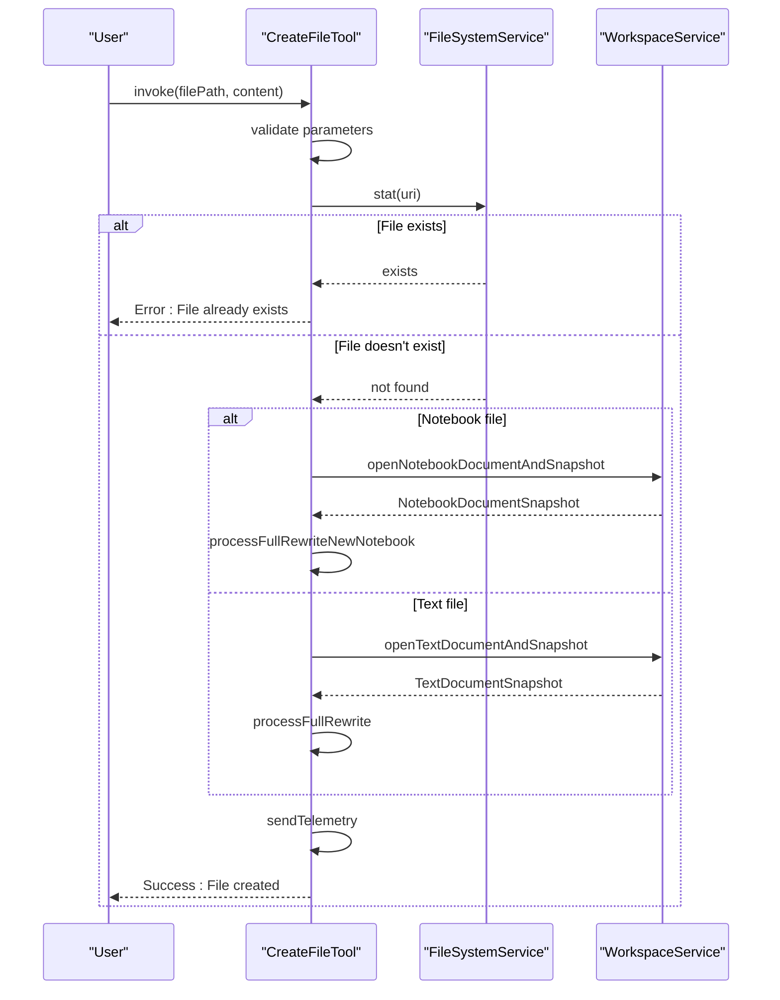
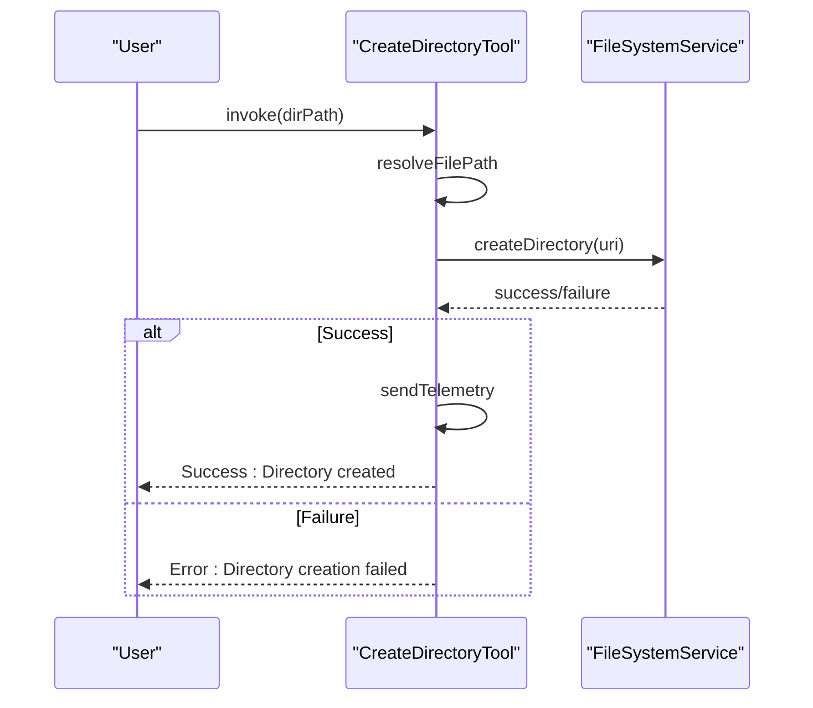
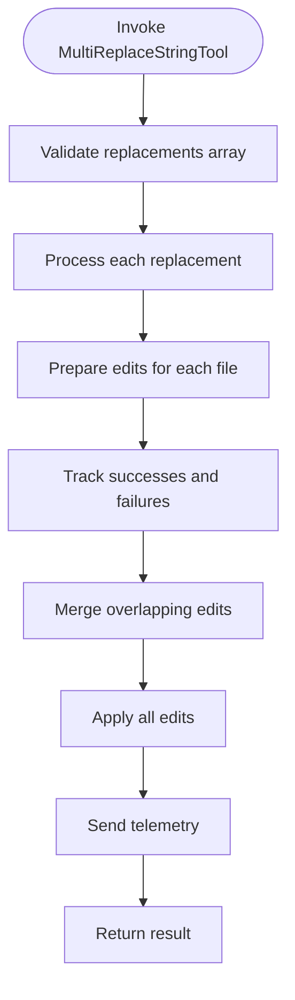
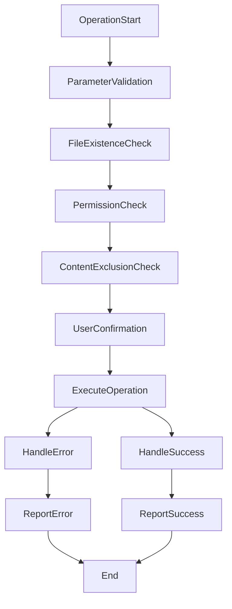

# File Operations Tools

<cite>
**Referenced Files in This Document**   
- [createFileTool.tsx](file://src/extension/tools/node/createFileTool.tsx)
- [createDirectoryTool.tsx](file://src/extension/tools/node/createDirectoryTool.tsx)
- [multiReplaceStringTool.tsx](file://src/extension/tools/node/multiReplaceStringTool.tsx)
- [applyPatch/parseApplyPatch.ts](file://src/extension/tools/node/applyPatch/parseApplyPatch.ts)
- [toolUtils.ts](file://src/extension/tools/node/toolUtils.ts)
- [toolNames.ts](file://src/extension/tools/common/toolNames.ts)
</cite>

## Table of Contents
1. [Introduction](#introduction)
2. [Core File Operations](#core-file-operations)
3. [File and Directory Creation](#file-and-directory-creation)
4. [Text Replacement Operations](#text-replacement-operations)
5. [Patch Application Mechanism](#patch-application-mechanism)
6. [Error Handling and Validation](#error-handling-and-validation)
7. [Concurrency and Atomicity Considerations](#concurrency-and-atomicity-considerations)
8. [Best Practices for Secure File System Interactions](#best-practices-for-secure-file-system-interactions)
9. [Conclusion](#conclusion)

## Introduction
The File Operations Tools sub-component of the Node Tools system provides a comprehensive suite of utilities for manipulating the workspace file system through VS Code's language model integration. These tools enable AI-assisted development by allowing natural language commands to perform file system operations such as file creation, directory creation, text replacement, and patch application. The implementation leverages VS Code's file service APIs to interact with the workspace while maintaining proper error handling, parameter validation, and user confirmation workflows. This document details the architecture and functionality of these tools, focusing on their implementation patterns, interaction with the workspace, and considerations for reliable file system operations.

## Core File Operations
The file operations tools are implemented as language model tools registered with the Copilot system, allowing them to be invoked through natural language commands. Each tool follows a consistent pattern of parameter validation, user confirmation, and execution through VS Code's file service APIs. The tools are designed to work within the constraints of the VS Code extension environment, handling both regular text files and notebook documents appropriately. The implementation uses dependency injection to access necessary services such as the file system service, workspace service, and telemetry service, ensuring proper separation of concerns and testability.

**Section sources**
- [toolNames.ts](file://src/extension/tools/common/toolNames.ts#L40-L56)
- [allTools.ts](file://src/extension/tools/node/allTools.ts#L5-L22)

## File and Directory Creation

### File Creation Implementation
The `createFileTool` implements the functionality to create new files in the workspace. It accepts parameters specifying the file path and initial content, validates that the file does not already exist, and creates the file through the workspace service. For notebook files, it uses the alternative notebook content edit generator to properly handle the notebook structure, while regular text files are processed using the text document snapshot API. The tool includes special handling for code blocks and file path comments in the content, ensuring proper formatting when creating files from AI-generated content.

**Diagram sources**
- [createFileTool.tsx](file://src/extension/tools/node/createFileTool.tsx#L60-L139)

**Section sources**
- [createFileTool.tsx](file://src/extension/tools/node/createFileTool.tsx#L36-L191)

### Directory Creation Implementation
The `createDirectoryTool` provides functionality to create new directories in the workspace. It accepts a directory path parameter, resolves it to a URI, and uses the file system service to create the directory. The implementation is straightforward, focusing on proper path resolution and error handling. The tool follows the same confirmation and telemetry patterns as other file operations tools, providing consistent user experience and monitoring capabilities.

**Diagram sources**
- [createDirectoryTool.tsx](file://src/extension/tools/node/createDirectoryTool.tsx#L27-L39)

**Section sources**
- [createDirectoryTool.tsx](file://src/extension/tools/node/createDirectoryTool.tsx#L15-L50)

## Text Replacement Operations

### Multi-File String Replacement
The `multiReplaceStringTool` enables batch string replacements across multiple files. It accepts an array of replacement operations, each specifying a file path, search string, and replacement string. The tool processes each replacement individually, preparing the edits and then applying them in a coordinated manner. It includes optimization to merge overlapping edits to the same file, ensuring that position calculations remain accurate. The implementation tracks success and failure rates for telemetry purposes and handles both text and notebook document types appropriately.

**Diagram sources**
- [multiReplaceStringTool.tsx](file://src/extension/tools/node/multiReplaceStringTool.tsx#L28-L102)

**Section sources**
- [multiReplaceStringTool.tsx](file://src/extension/tools/node/multiReplaceStringTool.tsx#L16-L109)

## Patch Application Mechanism
The `applyPatch` tool parses and applies diff-style patches to files in the workspace. It handles various patch formats and special cases such as CRLF line endings. The implementation includes robust parsing logic to interpret patch hunks and apply them correctly to the target files. For CRLF line endings, the tool normalizes line endings during patch application to ensure compatibility across different operating systems. The patch application process includes validation to ensure that the context matches before applying changes, preventing incorrect modifications. Encoding considerations are handled by the underlying file system service, which manages character encoding transparently.

**Section sources**
- [parseApplyPatch.ts](file://src/extension/tools/node/applyPatch/parseApplyPatch.ts)
- [agentIntent.ts](file://src/extension/intents/node/agentIntent.ts#L49)

## Error Handling and Validation
The file operations tools implement comprehensive error handling and parameter validation to ensure reliable operation. Each tool validates its input parameters before execution, throwing descriptive errors for invalid inputs. File existence is checked before creation operations to prevent accidental overwrites. Permission issues are handled gracefully by propagating errors from the file system service. The tools also validate that files are not excluded from content operations, preventing modifications to sensitive files. User confirmation is required for potentially destructive operations, with confirmation messages generated based on the operation details.

**Diagram sources**
- [toolUtils.ts](file://src/extension/tools/node/toolUtils.ts)
- [createFileTool.tsx](file://src/extension/tools/node/createFileTool.tsx#L73-L97)

**Section sources**
- [createFileTool.tsx](file://src/extension/tools/node/createFileTool.tsx#L73-L97)
- [toolUtils.ts](file://src/extension/tools/node/toolUtils.ts)

## Concurrency and Atomicity Considerations
The file operations tools address race conditions and concurrency issues through careful design and implementation. The file existence check in `createFileTool` includes a comment acknowledging the potential for race conditions, noting that the file system service lacks proper atomic methods for this operation. To mitigate this, the tools rely on the underlying file system operations being atomic where possible. For multi-file operations like `multiReplaceStringTool`, edits are prepared and validated before application, reducing the window for conflicts. The tools also handle file locking implicitly through the VS Code workspace service, which manages document locks during editing operations.

**Section sources**
- [createFileTool.tsx](file://src/extension/tools/node/createFileTool.tsx#L143-L152)
- [multiReplaceStringTool.tsx](file://src/extension/tools/node/multiReplaceStringTool.tsx)

## Best Practices for Secure File System Interactions
The implementation follows several best practices for secure file system interactions. Path resolution is performed through the `promptPathRepresentationService`, preventing directory traversal attacks. File operations are restricted to the workspace directory, preventing access to arbitrary file system locations. Sensitive files are protected through content exclusion checks that prevent modification of configuration and security-related files. Telemetry is used to monitor tool usage patterns and detect potential misuse. User confirmation is required for all file modifications, providing an additional layer of protection against unintended changes.

**Section sources**
- [toolUtils.ts](file://src/extension/tools/node/toolUtils.ts)
- [createFileTool.tsx](file://src/extension/tools/node/createFileTool.tsx#L66)

## Conclusion
The File Operations Tools sub-component provides a robust and secure foundation for AI-assisted file system manipulation in VS Code. By leveraging the platform's file service APIs and following established patterns for tool implementation, these tools enable natural language commands to perform complex file operations safely and reliably. The implementation addresses key concerns such as error handling, concurrency, and security, providing a solid foundation for AI-powered development workflows. Future enhancements could include more sophisticated conflict resolution, improved atomicity guarantees, and enhanced telemetry for usage analysis.