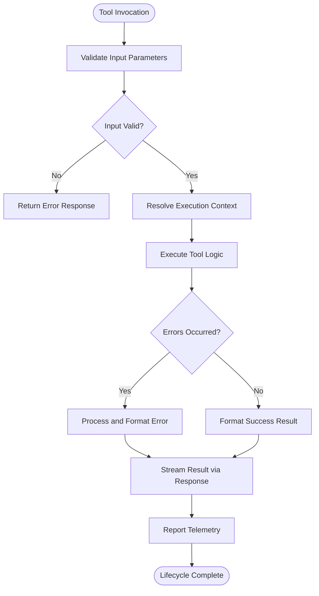
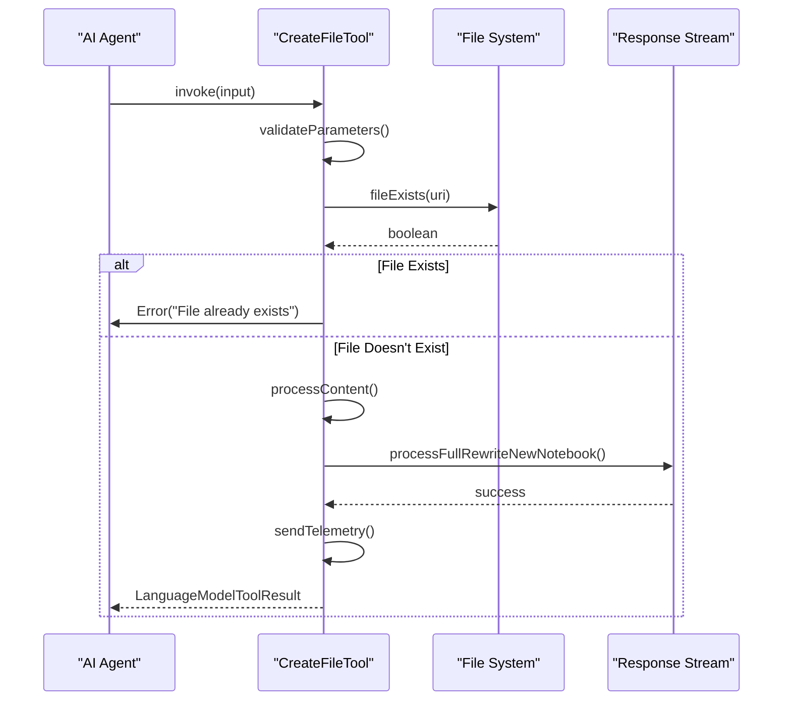
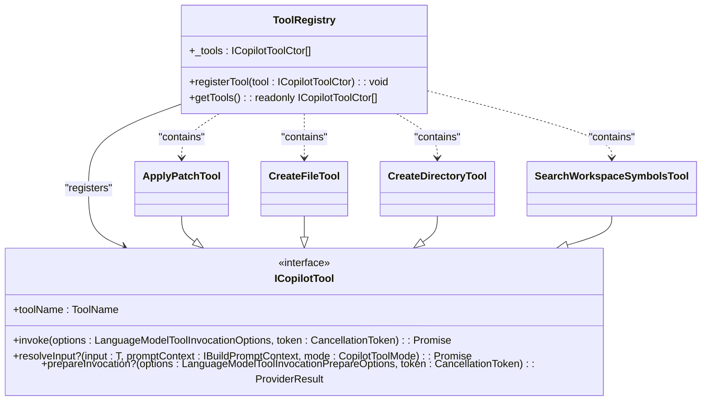
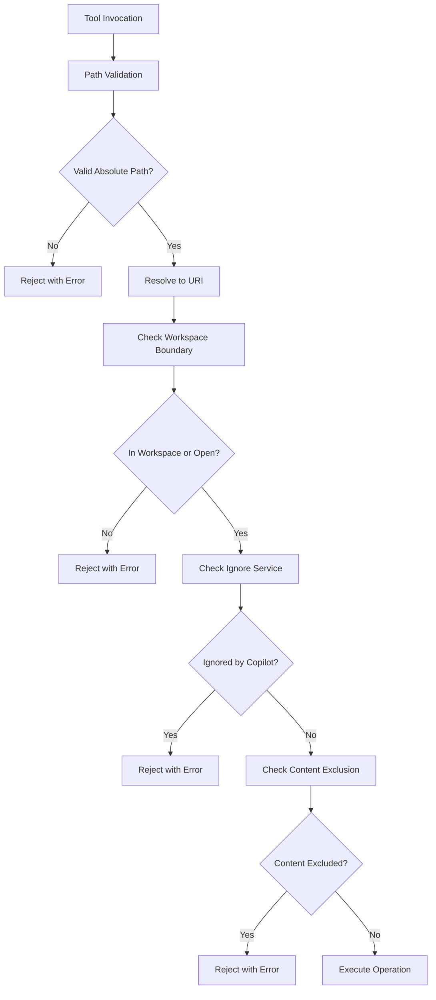
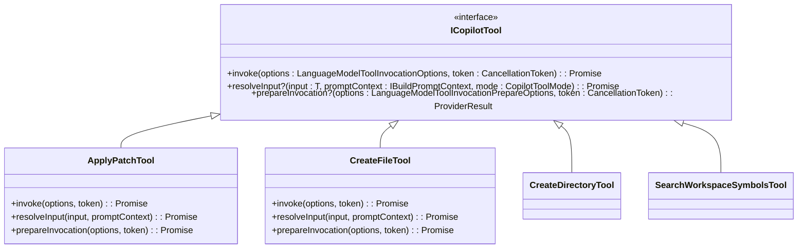

# Node Tools

<cite>
**Referenced Files in This Document**   
- [allTools.ts](file://src/extension/tools/node/allTools.ts)
- [applyPatchTool.tsx](file://src/extension/tools/node/applyPatchTool.tsx)
- [createFileTool.tsx](file://src/extension/tools/node/createFileTool.tsx)
- [createDirectoryTool.tsx](file://src/extension/tools/node/createDirectoryTool.tsx)
- [searchWorkspaceSymbolsTool.tsx](file://src/extension/tools/node/searchWorkspaceSymbolsTool.tsx)
- [toolsRegistry.ts](file://src/extension/tools/common/toolsRegistry.ts)
- [toolsService.ts](file://src/extension/tools/common/toolsService.ts)
- [toolUtils.ts](file://src/extension/tools/node/toolUtils.ts)
- [editFileToolUtils.tsx](file://src/extension/tools/node/editFileToolUtils.tsx)
</cite>

## Table of Contents
1. [Introduction](#introduction)
2. [Tool Execution Lifecycle](#tool-execution-lifecycle)
3. [Core Tool Implementations](#core-tool-implementations)
4. [Tool Registry and Schema Management](#tool-registry-and-schema-management)
5. [Error Handling and Security Considerations](#error-handling-and-security-considerations)
6. [Common Implementation Patterns](#common-implementation-patterns)
7. [Conclusion](#conclusion)

## Introduction

The Node Tools sub-component of the VSCode Copilot Chat system provides server-side tool execution capabilities within the Node.js context. These tools enable AI agents to perform file system operations, workspace queries, and other development tasks through a secure and structured interface. The implementation follows a consistent pattern across all tools, with standardized execution flows, parameter validation, error handling, and result formatting.

The tools operate within the extension's Node.js environment, interfacing with workspace services and the file system through carefully designed APIs. Each tool implements a common interface that ensures consistent behavior while allowing for specialized functionality. The system is designed to be both powerful for experienced developers and accessible to beginners, with clear error messages and safety checks to prevent common issues like file permission errors and race conditions.

**Section sources**
- [allTools.ts](file://src/extension/tools/node/allTools.ts#L1-L41)
- [toolsRegistry.ts](file://src/extension/tools/common/toolsRegistry.ts#L1-L76)

## Tool Execution Lifecycle

The execution lifecycle of Node Tools follows a standardized pattern that ensures consistent behavior across all tool implementations. Each tool's lifecycle begins with parameter validation and progresses through execution, result formatting, and telemetry reporting.

The lifecycle starts when a tool is invoked through the `invoke` method, which receives input parameters and a cancellation token. Before execution, the tool validates its input parameters and resolves any necessary context through the `resolveInput` method. During execution, the tool performs its primary function, such as file operations or workspace queries, while handling errors appropriately.

After successful execution, the tool formats its results using standardized response types and streams the results through the appropriate channels. Throughout the process, telemetry is collected to monitor tool usage and performance. The lifecycle concludes with proper cleanup and resource management.



**Diagram sources**
- [applyPatchTool.tsx](file://src/extension/tools/node/applyPatchTool.tsx#L188-L419)
- [createFileTool.tsx](file://src/extension/tools/node/createFileTool.tsx#L60-L139)
- [toolsService.ts](file://src/extension/tools/common/toolsService.ts#L179-L215)

## Core Tool Implementations

### applyPatch Tool

The `applyPatch` tool enables AI agents to make precise edits to existing files using a specialized diff format. This tool implements a sophisticated parser that processes patch instructions containing add, delete, and update operations. The implementation handles both text files and notebook documents, with special processing for notebook formats that may have complex internal structures.

The tool's execution involves parsing the patch input, validating the context, and applying the changes through VS Code's workspace edit system. It includes advanced features like automatic healing of malformed patches by delegating to a secondary model when parsing fails. This resilience ensures that minor formatting issues don't prevent successful execution.

The implementation carefully handles edge cases such as trailing newlines, ensuring that file modifications don't introduce unintended whitespace changes. It also manages file renames through the move operation, coordinating the rename with content updates in a single transaction.

**Section sources**
- [applyPatchTool.tsx](file://src/extension/tools/node/applyPatchTool.tsx#L60-L591)
- [applyPatch/parseApplyPatch.ts](file://src/extension/tools/node/applyPatch/parseApplyPatch.ts#L1-L20)

### createFile Tool

The `createFile` tool allows AI agents to create new files with specified content. This implementation includes comprehensive validation to prevent overwriting existing files, throwing specific errors that guide the agent to use appropriate editing tools instead. The tool handles both regular text files and notebook documents, applying format-specific processing to ensure proper content structure.

For notebook creation, the tool processes code blocks and removes leading filepath comments that might be included in the generated content. It integrates with the code mapper system to generate properly formatted notebook content, supporting various notebook formats through the alternative content service.

The implementation includes a race condition warning in the code comments, acknowledging the potential for timing issues when checking file existence. Despite this, the tool provides atomic-like behavior by combining existence checks with creation operations.



**Diagram sources**
- [createFileTool.tsx](file://src/extension/tools/node/createFileTool.tsx#L42-L189)
- [toolUtils.ts](file://src/extension/tools/node/toolUtils.ts#L94-L101)

### createDirectory Tool

The `createDirectory` tool provides a simple interface for creating new directories in the workspace. This implementation is straightforward, focusing on path resolution and directory creation through the file system service. The tool converts user-provided paths to absolute URIs using the prompt path representation service, ensuring consistent path handling across different operating systems.

The implementation includes minimal parameter validation, relying on the file system service to handle invalid paths and permission issues. It returns a success message with the created directory path, formatted for user-friendly display. The tool also provides preparation messages that inform the user about the impending directory creation.

**Section sources**
- [createDirectoryTool.tsx](file://src/extension/tools/node/createDirectoryTool.tsx#L19-L50)
- [toolUtils.ts](file://src/extension/tools/node/toolUtils.ts#L94-L101)

### searchWorkspaceSymbols Tool

The `searchWorkspaceSymbols` tool enables AI agents to query the workspace for specific symbols, such as functions, classes, or variables. This implementation interfaces with VS Code's language features service to perform symbol searches across the entire workspace. The tool returns structured results that include symbol names, container names, and location information.

The implementation includes result limiting to prevent overwhelming responses, capping results at 20 symbols while indicating when additional results exist. It formats the output using the prompt TSX system, creating rich, interactive responses that include file references. The tool also provides appropriate messaging for both successful searches and cases where no results are found.

```mermaid
flowchart TD
A[searchWorkspaceSymbols Invocation] --> B[Get Workspace Symbols]
B --> C{Symbols Found?}
C --> |Yes| D[Limit Results to 20]
C --> |No| E[Return "No symbols found"]
D --> F[Render Symbol Output]
E --> G[Stream Result]
F --> G
G --> H[Set Tool Result Message]
H --> I[Return ExtendedLanguageModelToolResult]
```

**Diagram sources**
- [searchWorkspaceSymbolsTool.tsx](file://src/extension/tools/node/searchWorkspaceSymbolsTool.tsx#L24-L94)
- [WorkspaceSymbolSearchOutput](file://src/extension/tools/node/searchWorkspaceSymbolsTool.tsx#L68-L94)

## Tool Registry and Schema Management

### Tool Registration System

The Node Tools system uses a centralized registry pattern implemented through the `ToolRegistry` class. This registry maintains a collection of tool constructors that are registered at module load time. The registration process is explicit, with each tool importing and registering itself in the `allTools.ts` file, creating a clear dependency graph.

The registry pattern enables lazy instantiation of tools, with instances created only when needed. This approach conserves memory and improves startup performance. The registry also provides a single point of discovery for all available tools, simplifying tool enumeration and management.



**Diagram sources**
- [toolsRegistry.ts](file://src/extension/tools/common/toolsRegistry.ts#L65-L75)
- [allTools.ts](file://src/extension/tools/node/allTools.ts#L6-L40)

### Schema Validation and Input Processing

The tools system implements robust input validation through the `toolsService.ts` file, which contains a comprehensive validation mechanism using the AJV JSON schema validator. This service validates tool inputs against defined schemas, providing detailed error messages when validation fails.

The validation process includes special handling for nested JSON strings, automatically attempting to parse stringified JSON objects within the input. This feature enhances robustness by accommodating common formatting issues in AI-generated tool calls. The service also caches compiled schemas to improve performance across multiple invocations of the same tool.

Input processing follows a consistent pattern across tools, with parameters resolved through the `resolveToolInputPath` utility function. This function ensures consistent path handling and validation, converting user-provided paths to absolute URIs while enforcing security constraints.

**Section sources**
- [toolsService.ts](file://src/extension/tools/common/toolsService.ts#L179-L215)
- [toolUtils.ts](file://src/extension/tools/node/toolUtils.ts#L94-L101)

## Error Handling and Security Considerations

### Error Handling Patterns

The Node Tools system implements comprehensive error handling patterns to ensure robust operation and provide meaningful feedback. Each tool wraps its execution in try-catch blocks, capturing both expected and unexpected errors. The error handling strategy includes specific error types for different failure modes, such as `InvalidPatchFormatError` and `InvalidContextError` in the applyPatch tool.

The system distinguishes between validation errors and execution errors, providing different response patterns for each. Validation errors typically result in immediate rejection of the tool call with a descriptive message, while execution errors may trigger recovery mechanisms like the patch healing process in the applyPatch tool.

Common error handling utilities are centralized in the `toolUtils.ts` file, including the `checkCancellation` function that handles cancellation tokens and the `assertFileNotContentExcluded` function that validates file access permissions. These utilities promote consistency across tool implementations.

**Section sources**
- [applyPatchTool.tsx](file://src/extension/tools/node/applyPatchTool.tsx#L200-L230)
- [toolUtils.ts](file://src/extension/tools/node/toolUtils.ts#L24-L28)

### Security and Safety Measures

The Node Tools implementation incorporates multiple security layers to prevent unauthorized or destructive operations. The most fundamental safety measure is path validation, with all file operations requiring absolute paths resolved through the `promptPathRepresentationService`. This prevents directory traversal attacks and ensures operations are confined to the workspace.

Additional security measures include:
- File exclusion checking through the ignore service, preventing operations on files configured to be ignored by Copilot
- Workspace boundary enforcement, restricting file access to workspace files unless they are explicitly open in an editor
- Content exclusion validation, preventing operations on files that are specifically excluded from tool access

The system also implements operation-specific safety checks, such as preventing file overwrites in the createFile tool and validating patch context in the applyPatch tool. These measures create a secure environment where AI agents can perform useful operations without risking damage to the codebase.



**Diagram sources**
- [toolUtils.ts](file://src/extension/tools/node/toolUtils.ts#L112-L135)
- [applyPatchTool.tsx](file://src/extension/tools/node/applyPatchTool.tsx#L255-L256)

## Common Implementation Patterns

### Consistent Tool Interface

All Node Tools implement a consistent interface pattern that ensures uniform behavior across different tool types. The core interface extends `ICopilotTool`, requiring implementation of the `invoke` method for execution and optionally supporting `resolveInput` for input processing and `prepareInvocation` for user interface messaging.

The `prepareInvocation` method is particularly important for user experience, providing messages that inform users about impending operations. These messages appear in the chat interface, giving users transparency into AI-driven actions. The method returns structured messages including invocation and past-tense descriptions, enabling rich UI representations.



**Diagram sources**
- [toolsRegistry.ts](file://src/extension/tools/common/toolsRegistry.ts#L28-L58)
- [createFileTool.tsx](file://src/extension/tools/node/createFileTool.tsx#L42-L189)

### Result Formatting and Streaming

The Node Tools system uses a standardized approach to result formatting and streaming, ensuring consistent output across different tools. Most tools return a `LanguageModelToolResult` containing one or more `LanguageModelPromptTsxPart` instances, which enable rich, interactive responses.

The response streaming pattern involves using the `promptContext.stream` to communicate progress and results. Tools like applyPatch and createFile use this stream to indicate text or notebook edits, creating visual feedback in the editor. The streaming approach allows for incremental updates, improving perceived performance and user experience.

Result formatting often involves rendering prompt elements using the `renderPromptElementJSON` function, which converts React-like components to JSON format suitable for transmission to the language model. This approach enables complex, structured responses that can include references, code blocks, and other rich content.

**Section sources**
- [applyPatchTool.tsx](file://src/extension/tools/node/applyPatchTool.tsx#L398-L411)
- [createFileTool.tsx](file://src/extension/tools/node/createFileTool.tsx#L119-L132)

## Conclusion

The Node Tools sub-component of the VSCode Copilot Chat system provides a robust, secure, and extensible framework for AI-driven development tasks. Through a consistent implementation pattern, comprehensive error handling, and thoughtful security measures, these tools enable AI agents to perform valuable operations while maintaining system integrity and user trust.

The architecture balances power and safety, allowing agents to modify files, create directories, and query workspace symbols while preventing destructive or unauthorized actions. The centralized registry and standardized interfaces make the system easy to extend with new tools, while the comprehensive telemetry and error reporting facilitate ongoing improvement.

For developers, the system demonstrates best practices in tool design, including clear separation of concerns, proper error handling, and user transparency. The implementation patterns serve as a model for building AI-integrated development tools that are both capable and responsible.