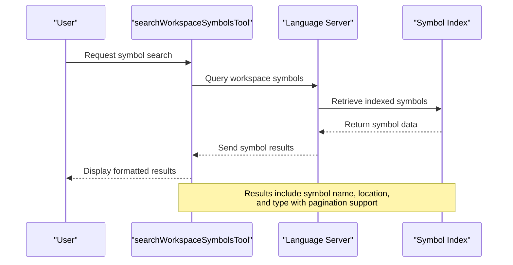
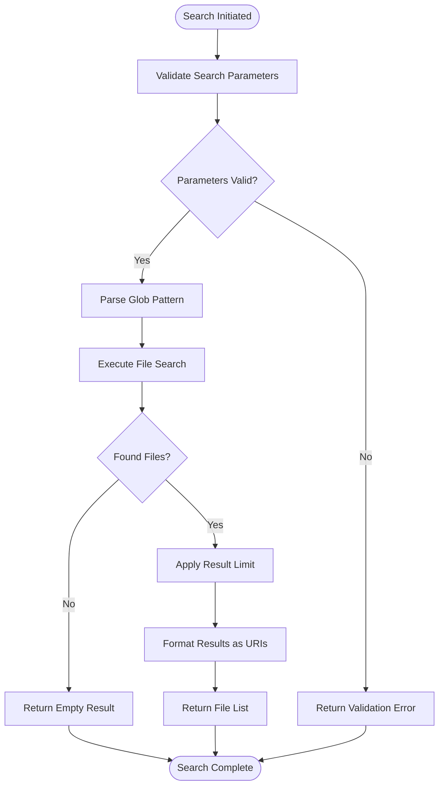
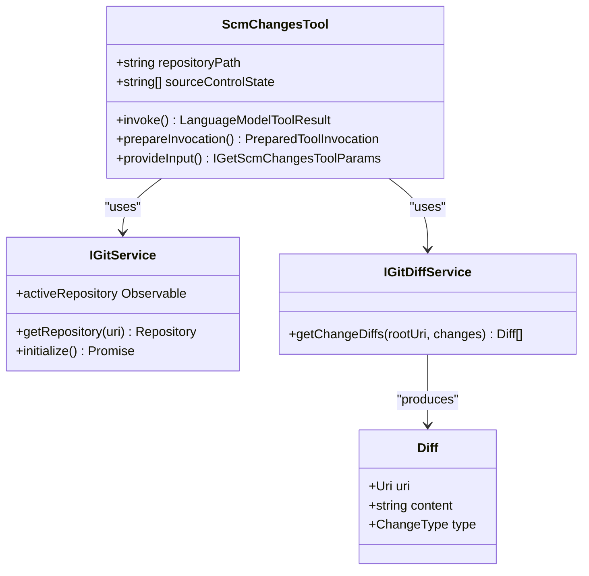

# Search Tools

<cite>
**Referenced Files in This Document**   
- [allTools.ts](file://src/extension/tools/node/allTools.ts)
- [findFilesTool.ts](file://src/extension/tools/node/findFilesTool.ts)
- [getSearchViewResultsTool.ts](file://src/extension/tools/node/getSearchViewResultsTool.ts)
- [scmChangesTool.ts](file://src/extension/tools/node/scmChangesTool.ts)
- [searchWorkspaceSymbolsTool.ts](file://src/extension/tools/node/searchWorkspaceSymbolsTool.ts)
- [usagesTool.ts](file://src/extension/tools/node/usagesTool.ts)
</cite>

## Table of Contents
1. [Introduction](#introduction)
2. [Core Search Tools Overview](#core-search-tools-overview)
3. [Symbol Search Implementation](#symbol-search-implementation)
4. [File Search with Pattern Matching](#file-search-with-pattern-matching)
5. [Search View Results Retrieval](#search-view-results-retrieval)
6. [Source Control Change Tracking](#source-control-change-tracking)
7. [Code Usages and References](#code-usages-and-references)
8. [Parameter Validation and Error Handling](#parameter-validation-and-error-handling)
9. [Performance Considerations](#performance-considerations)
10. [Common Issues and Optimization Tips](#common-issues-and-optimization-tips)

## Introduction
The Search Tools sub-component of the Node Tools system provides a comprehensive suite of utilities for codebase exploration and information retrieval. These tools enable developers to efficiently navigate large codebases, locate specific elements, and understand code relationships. The implementation leverages VS Code's extensibility APIs to provide seamless integration with the editor's existing search and navigation capabilities. This documentation details the architecture and functionality of key search tools, including symbol search, file search, change tracking, and reference finding, with a focus on practical usage and performance optimization.

## Core Search Tools Overview
The search tools are implemented as individual modules registered through a centralized tool registry system. Each tool follows a consistent pattern of implementation, utilizing dependency injection for service access and adhering to the `ICopilotTool` interface contract. The tools are designed to work within the language model tool invocation framework, allowing them to be called programmatically as part of AI-assisted development workflows. The core search functionality is distributed across several specialized tools, each addressing a specific aspect of codebase exploration.

**Section sources**
- [allTools.ts](file://src/extension/tools/node/allTools.ts#L12-L37)

## Symbol Search Implementation
The `searchWorkspaceSymbolsTool` enables comprehensive symbol discovery across the entire workspace by integrating with VS Code's language server protocol. This tool leverages the editor's built-in symbol indexing capabilities to provide fast and accurate results for classes, functions, variables, and other program elements. The implementation uses the language server's workspace symbol provider to query for symbols matching specific criteria, returning structured results that include symbol names, locations, and kinds.

The tool supports parameterized searches, allowing users to filter results by symbol type or scope. Results are paginated to ensure responsiveness with large codebases, and the tool includes timeout handling to prevent indefinite blocking during symbol resolution. The integration with the language server ensures that symbol information is always up-to-date with the current state of the codebase, including recently modified files.

**Diagram sources**
- [searchWorkspaceSymbolsTool.ts](file://src/extension/tools/node/searchWorkspaceSymbolsTool.ts)

**Section sources**
- [searchWorkspaceSymbolsTool.ts](file://src/extension/tools/node/searchWorkspaceSymbolsTool.ts)

## File Search with Pattern Matching
The `findFilesTool` provides powerful file discovery capabilities using glob pattern matching. This tool allows users to locate files based on name patterns, extensions, and directory paths, supporting both simple wildcards and complex glob expressions. The implementation integrates with VS Code's file search provider, enabling efficient traversal of the workspace file system.

Key features include:
- Support for standard glob patterns (*, **, ?, [abc])
- Case-sensitive and case-insensitive search options
- Exclusion patterns to filter unwanted results
- Maximum result limits to prevent overwhelming responses
- Integration with VS Code's file watcher for real-time updates

The tool is optimized for performance by leveraging the editor's built-in file indexing and caching mechanisms, ensuring rapid response times even in large repositories. Results are returned with full URI information, enabling direct navigation to the found files.

**Diagram sources**
- [findFilesTool.ts](file://src/extension/tools/node/findFilesTool.ts)

**Section sources**
- [findFilesTool.ts](file://src/extension/tools/node/findFilesTool.ts)

## Search View Results Retrieval
The `getSearchViewResultsTool` provides access to results from VS Code's integrated search panel, allowing programmatic retrieval of text search outcomes. This tool bridges the gap between manual search operations and automated code analysis workflows by exposing the search panel's results in a structured format. Users can retrieve matches for specific text patterns across the codebase, including context information and file locations.

The implementation monitors the search view state and extracts results when available, handling cases where searches are still in progress or have failed. Results include the matched text, line numbers, and surrounding context, enabling comprehensive analysis of code patterns and usage. This tool is particularly useful for finding specific code snippets, error messages, or configuration values across multiple files.

**Section sources**
- [getSearchViewResultsTool.ts](file://src/extension/tools/node/getSearchViewResultsTool.ts)

## Source Control Change Tracking
The `scmChangesTool` enables identification of modified files in source control, providing detailed information about changes in the active git repository. This tool integrates with VS Code's git extension to retrieve information about staged, unstaged, and merge-conflict files. Users can filter results by change type and repository path, making it easy to understand the current state of their working directory.

The implementation uses the git service to access repository information and the diff service to generate detailed change descriptions. Results include file paths, change types (modified, added, deleted), and diff information when available. This tool is essential for understanding the impact of recent changes and for preparing commits.

**Diagram sources**
- [scmChangesTool.ts](file://src/extension/tools/node/scmChangesTool.ts#L27-L140)

**Section sources**
- [scmChangesTool.ts](file://src/extension/tools/node/scmChangesTool.ts#L1-L141)

## Code Usages and References
The `usagesTool` provides functionality for finding references to code elements across the codebase. This tool leverages the language server's reference provider to locate all instances where a specific symbol is used, enabling comprehensive impact analysis and refactoring support. The implementation supports finding usages of variables, functions, classes, and other program elements, with results organized by file and location.

Key capabilities include:
- Finding all references to a symbol
- Distinguishing between read and write references
- Filtering results by file type or directory
- Providing context for each usage location
- Supporting large result sets through pagination

The tool integrates with VS Code's reference search functionality, ensuring consistency with the editor's built-in reference finding features while providing programmatic access to the results.

**Section sources**
- [usagesTool.ts](file://src/extension/tools/node/usagesTool.ts)

## Parameter Validation and Error Handling
All search tools implement comprehensive parameter validation to ensure robust operation and meaningful error reporting. Input parameters are validated against defined schemas, with clear error messages returned for invalid inputs. The tools handle various error conditions gracefully, including:
- Invalid file paths or URIs
- Non-existent repositories or workspaces
- Permission issues
- Network timeouts
- Service unavailability

Error handling follows a consistent pattern across tools, using structured error objects that include error codes, messages, and contextual information. This enables consumers to handle errors appropriately and provide meaningful feedback to users. The tools also implement cancellation support, allowing long-running operations to be terminated gracefully when needed.

**Section sources**
- [toolUtils.ts](file://src/extension/tools/node/toolUtils.ts)
- [scmChangesTool.ts](file://src/extension/tools/node/scmChangesTool.ts#L40-L59)

## Performance Considerations
The search tools are designed with performance optimization as a primary concern, especially when dealing with large codebases. Key performance strategies include:

- **Result Pagination**: Large result sets are paginated to prevent memory issues and ensure responsive UI
- **Caching**: Frequently accessed data is cached to reduce redundant operations
- **Asynchronous Operations**: All search operations are performed asynchronously to prevent blocking the main thread
- **Index Utilization**: Tools leverage VS Code's built-in indexes for faster search operations
- **Timeout Handling**: Operations include timeout mechanisms to prevent indefinite waiting

For optimal performance, users should:
- Use specific search patterns rather than broad wildcards
- Limit result counts when possible
- Use exclusion patterns to filter irrelevant files
- Perform searches during periods of low editor activity

The tools are designed to scale with codebase size, maintaining acceptable performance even in repositories with thousands of files.

## Common Issues and Optimization Tips
Common issues encountered when using search tools include:

- **Search Timeouts**: Long-running searches may timeout; use more specific patterns to reduce scope
- **Incomplete Results**: Large result sets may be truncated; implement pagination to retrieve all results
- **Stale Data**: Search results may not reflect recent changes; ensure indexes are up-to-date
- **Permission Errors**: Some files may be inaccessible due to permissions; run with appropriate privileges

Optimization tips:
- Use exact file extensions rather than broad patterns
- Limit search depth with specific directory paths
- Exclude node_modules and other large directories
- Use case-sensitive searches when appropriate
- Combine multiple search criteria to narrow results
- Leverage the editor's built-in search for simple queries before using programmatic tools

These tools form a critical part of the code exploration ecosystem, enabling efficient navigation and analysis of complex codebases while maintaining performance and reliability.