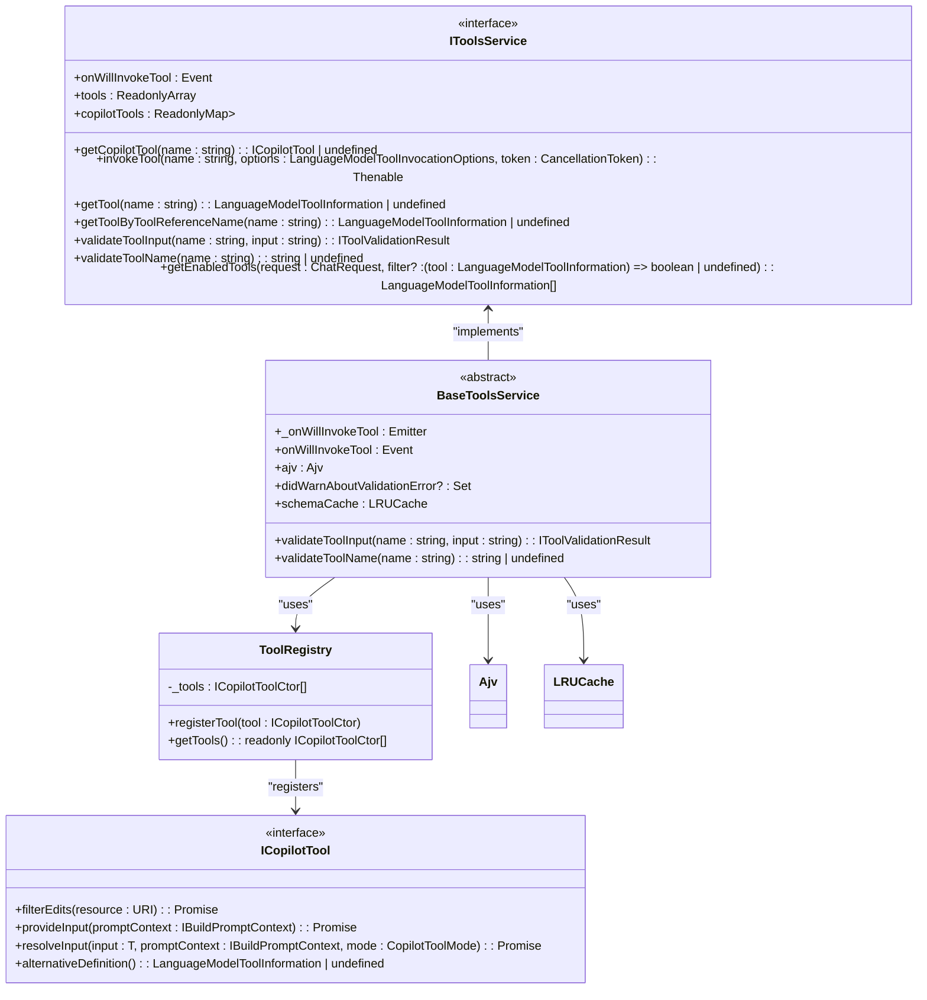
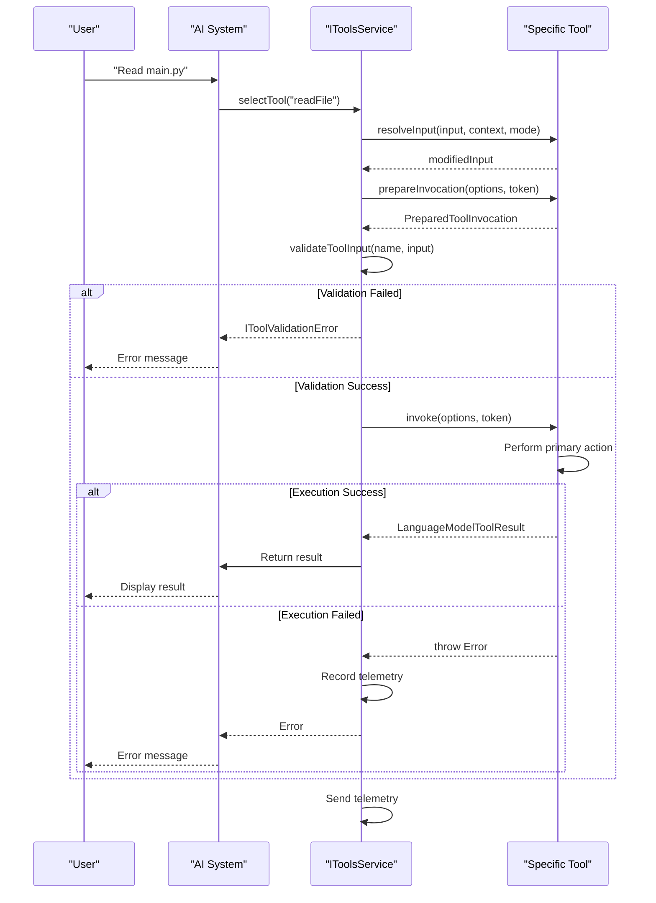
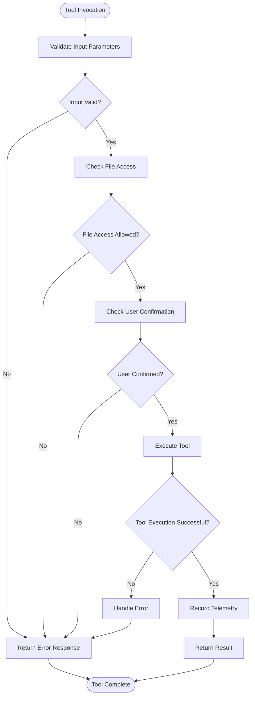
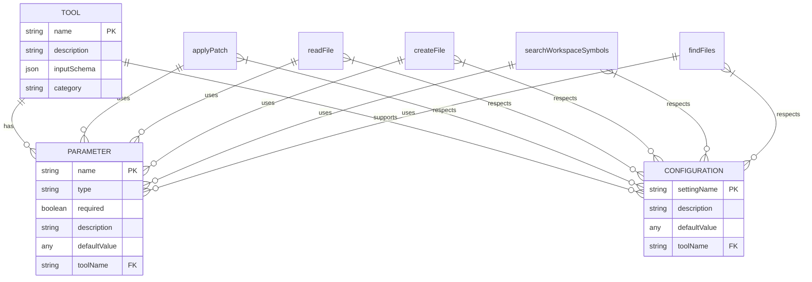

# Tools

<cite>
**Referenced Files in This Document**   
- [toolsRegistry.ts](file://src/extension/tools/common/toolsRegistry.ts)
- [toolsService.ts](file://src/extension/tools/common/toolsService.ts)
- [toolNames.ts](file://src/extension/tools/common/toolNames.ts)
- [allTools.ts](file://src/extension/tools/node/allTools.ts)
- [createFileTool.tsx](file://src/extension/tools/node/createFileTool.tsx)
- [readFileTool.tsx](file://src/extension/tools/node/readFileTool.tsx)
- [applyPatchTool.tsx](file://src/extension/tools/node/applyPatchTool.tsx)
- [searchWorkspaceSymbolsTool.tsx](file://src/extension/tools/node/searchWorkspaceSymbolsTool.tsx)
- [findFilesTool.tsx](file://src/extension/tools/node/findFilesTool.tsx)
- [toolUtils.ts](file://src/extension/tools/node/toolUtils.ts)
- [virtualTool.ts](file://src/extension/tools/common/virtualTools/virtualTool.ts)
- [toolGrouping.ts](file://src/extension/tools/common/virtualTools/toolGrouping.ts)
</cite>

## Table of Contents
1. [Introduction](#introduction)
2. [Tool System Design](#tool-system-design)
3. [Domain Model for Tools](#domain-model-for-tools)
4. [Tool Execution Lifecycle](#tool-execution-lifecycle)
5. [Security Model](#security-model)
6. [Configuration Options and Parameters](#configuration-options-and-parameters)
7. [Integration with Other Components](#integration-with-other-components)
8. [Common Issues and Troubleshooting](#common-issues-and-troubleshooting)
9. [Custom Tool Development](#custom-tool-development)
10. [Conclusion](#conclusion)

## Introduction
The Tools sub-component of the Extension Layer in the VS Code Copilot system provides a comprehensive framework for code manipulation and interaction with the development environment. This system enables Copilot to perform various operations on the codebase through a well-defined set of tools that follow the registry pattern. The tools facilitate natural language interactions by translating user commands into concrete actions within the editor, such as reading files, creating new files, applying patches, and searching workspace symbols.

This documentation provides a detailed explanation of the tool system's architecture, implementation, and usage patterns. It covers the design principles, execution lifecycle, security considerations, and integration points with other components of the Copilot system. The content is designed to be accessible to beginners while providing sufficient technical depth for experienced developers who want to understand or extend the tool system.

**Section sources**
- [toolsRegistry.ts](file://src/extension/tools/common/toolsRegistry.ts#L1-L76)
- [toolsService.ts](file://src/extension/tools/common/toolsService.ts#L1-L253)

## Tool System Design

The tool system in the VS Code Copilot extension follows a registry pattern that allows for extensible and modular tool management. At the core of this system is the `ToolRegistry`, which serves as a central repository for all available tools. The registry pattern enables dynamic registration and discovery of tools, making it easy to add new functionality without modifying existing code.

The system is built around the `ICopilotTool` interface, which extends the VS Code `LanguageModelTool` interface with additional capabilities specific to Copilot's requirements. This interface defines methods for tool execution, input validation, and user confirmation. Each tool implements this interface and is registered with the `ToolRegistry` during initialization.

The `IToolsService` interface provides the main entry point for interacting with tools. It offers methods for retrieving tool information, validating inputs, and invoking tools. The service acts as an abstraction layer between the Copilot AI system and the actual tool implementations, handling cross-cutting concerns like error handling, telemetry, and security checks.

The tool system is organized into several key directories:
- `common/`: Contains shared interfaces, utilities, and the registry implementation
- `node/`: Contains the actual tool implementations
- `vscode-node/`: Contains VS Code-specific tool integrations
- `test/`: Contains unit and integration tests for tools

This modular structure allows for separation of concerns and makes the system easier to maintain and extend.



**Diagram sources **
- [toolsRegistry.ts](file://src/extension/tools/common/toolsRegistry.ts#L1-L76)
- [toolsService.ts](file://src/extension/tools/common/toolsService.ts#L1-L253)

**Section sources**
- [toolsRegistry.ts](file://src/extension/tools/common/toolsRegistry.ts#L1-L76)
- [toolsService.ts](file://src/extension/tools/common/toolsService.ts#L1-L253)

## Domain Model for Tools

The domain model for tools in the VS Code Copilot system is centered around the concept of language model tools that can be invoked by the AI system to interact with the codebase and development environment. Each tool represents a specific capability or action that can be performed, such as reading a file, creating a new file, or searching for symbols in the workspace.

The core of the domain model is the `ToolName` enum, which defines all available tools in the system. This enum provides a type-safe way to reference tools throughout the codebase and ensures consistency in tool naming. Each tool has a corresponding implementation class that follows the naming convention `[ToolName]Tool` (e.g., `CreateFileTool`, `ReadFileTool`).

The tools are categorized into different groups based on their functionality:
- **Core Tools**: Essential tools that are always available, such as file manipulation and code search
- **Jupyter Notebook Tools**: Tools specifically designed for working with Jupyter notebooks
- **Web Interaction**: Tools that enable interaction with web resources
- **VS Code Interaction**: Tools that leverage VS Code's built-in features and APIs
- **Testing**: Tools related to testing workflows

Each tool has a well-defined interface with specific parameters and return values. For example, the `applyPatch` tool takes a patch string and explanation as input, while the `readFile` tool accepts a file path and optional line range parameters. The return values are typically structured as `LanguageModelToolResult` objects that contain the results of the tool execution in a format that can be easily consumed by the AI system.

The domain model also includes virtual tools, which are meta-tools that group multiple related tools together. These virtual tools follow the naming convention `activate_[category]` and allow users to enable entire categories of functionality with a single command. For example, `activate_jupyter_notebook` enables all Jupyter notebook-related tools.

```mermaid
classDiagram
class ToolName {
<<enum>>
ApplyPatch
Codebase
VSCodeAPI
TestFailure
RunTests
FindFiles
FindTextInFiles
ReadFile
ListDirectory
GetErrors
GetScmChanges
UpdateUserPreferences
ReadProjectStructure
CreateNewWorkspace
CreateNewJupyterNotebook
SearchWorkspaceSymbols
Usages
EditFile
CreateFile
ReplaceString
MultiReplaceString
EditNotebook
RunNotebookCell
GetNotebookSummary
ReadCellOutput
InstallExtension
FetchWebPage
FindTestFiles
GetProjectSetupInfo
SearchViewResults
DocInfo
GithubRepo
SimpleBrowser
CreateDirectory
RunVscodeCmd
CoreManageTodoList
CoreRunInTerminal
CoreGetTerminalOutput
CoreTerminalSelection
CoreTerminalLastCommand
CoreCreateAndRunTask
CoreRunTask
CoreGetTaskOutput
CoreRunTest
ToolReplay
EditFilesPlaceholder
RunSubagent
CoreConfirmationTool
CoreTerminalConfirmationTool
}
class ToolCategory {
<<enum>>
JupyterNotebook
WebInteraction
VSCodeInteraction
Testing
RedundantButSpecific
Core
}
class VirtualTool {
+name : string
+description : string
+lastUsedOnTurn : number
+metadata : IVirtualToolMetadata
+contents : (LanguageModelToolInformation | VirtualTool)[]
+isExpanded : boolean
+cloneWithNewName(name : string) : VirtualTool
+copyStateFrom(other : VirtualTool)
+find(name : string) : {tool : VirtualTool | LanguageModelToolInformation, path : VirtualTool[]} | undefined
+getLowestExpandedTool() : VirtualTool | undefined
+all() : Iterable<LanguageModelToolInformation | VirtualTool>
+tools() : Iterable<LanguageModelToolInformation>
}
class IVirtualToolMetadata {
+wasEmbeddingsMatched? : boolean
+wasExpandedByDefault? : boolean
+canBeCollapsed? : boolean
+possiblePrefix? : string
}
ToolName --> ToolCategory : "categorized as"
VirtualTool --> IVirtualToolMetadata : "has"
VirtualTool --> ToolName : "contains"
```

**Diagram sources **
- [toolNames.ts](file://src/extension/tools/common/toolNames.ts#L1-L250)
- [virtualTool.ts](file://src/extension/tools/common/virtualTools/virtualTool.ts#L1-L125)

**Section sources**
- [toolNames.ts](file://src/extension/tools/common/toolNames.ts#L1-L250)
- [virtualTool.ts](file://src/extension/tools/common/virtualTools/virtualTool.ts#L1-L125)

## Tool Execution Lifecycle

The tool execution lifecycle in the VS Code Copilot system follows a well-defined sequence of steps that ensures consistent behavior across all tools. This lifecycle begins when a natural language command is interpreted by the AI system and translated into a tool invocation, and ends when the tool's results are returned and integrated into the conversation.

The lifecycle consists of the following phases:

1. **Tool Selection**: The AI system determines which tool to invoke based on the user's natural language command. This decision is influenced by the tool's description, input schema, and current context.

2. **Input Resolution**: Before invoking the tool, the system may call the `resolveInput` method to modify or enhance the input parameters. This allows tools to adapt their behavior based on the context or execution mode (partial vs. full context).

3. **Preparation**: The `prepareInvocation` method is called to generate user-facing messages that describe what the tool will do. This provides transparency to the user about the impending action.

4. **Validation**: The input parameters are validated against the tool's schema using the Ajv validator. This ensures that the input is well-formed and contains all required fields.

5. **Execution**: The `invoke` method is called with the validated input parameters. This is where the tool performs its primary function, such as reading a file or applying a patch.

6. **Result Processing**: The tool returns a `LanguageModelToolResult` that contains the output in a structured format. This result is then processed and formatted for display to the user.

7. **Telemetry**: Throughout the execution, telemetry events are recorded to monitor tool usage, success rates, and performance characteristics.

The execution lifecycle is managed by the `IToolsService`, which coordinates these phases and handles cross-cutting concerns like error handling and cancellation. Each tool implementation is responsible for its specific logic within the `invoke` method, but the overall flow is standardized across all tools.

For example, when a user asks Copilot to "read the contents of main.py", the following sequence occurs:
1. The AI system selects the `readFile` tool based on the command
2. The `resolveInput` method is called to ensure the file path is properly formatted
3. The `prepareInvocation` method generates a message like "Reading main.py"
4. The input is validated to ensure it contains a valid file path
5. The `invoke` method opens the file and reads its contents
6. The results are formatted as a code block with syntax highlighting
7. Telemetry is recorded for the successful tool invocation



**Diagram sources **
- [toolsService.ts](file://src/extension/tools/common/toolsService.ts#L1-L253)
- [createFileTool.tsx](file://src/extension/tools/node/createFileTool.tsx#L1-L192)
- [readFileTool.tsx](file://src/extension/tools/node/readFileTool.tsx#L1-L289)

**Section sources**
- [toolsService.ts](file://src/extension/tools/common/toolsService.ts#L1-L253)
- [createFileTool.tsx](file://src/extension/tools/node/createFileTool.tsx#L1-L192)
- [readFileTool.tsx](file://src/extension/tools/node/readFileTool.tsx#L1-L289)

## Security Model

The security model for the tools in the VS Code Copilot system is designed to protect users from potentially harmful operations while still enabling useful code manipulation capabilities. The model implements multiple layers of protection, including file access controls, user confirmation mechanisms, and telemetry monitoring.

The primary security mechanism is file access control, which prevents tools from accessing files outside the workspace or in restricted locations. The `assertFileOkForTool` function checks whether a file can be accessed by a tool, considering factors such as:
- Whether the file is within the current workspace
- Whether the file is open in an editor
- Whether the file is configured to be ignored by Copilot
- Whether the file scheme is supported (e.g., not untitled files)

For operations that modify the codebase, such as creating or editing files, the system requires explicit user confirmation before applying changes. This is implemented through the `prepareInvocation` method, which returns a `PreparedToolInvocation` object containing messages that describe the intended action. The user must explicitly approve these actions before they are executed.

The system also implements input validation using JSON Schema to ensure that tool parameters are well-formed and within expected ranges. This prevents injection attacks and other security vulnerabilities that could arise from malformed input. The validation is performed using the Ajv library, which compiles the schema into an efficient validator function that is cached for performance.

Additionally, the system includes telemetry and monitoring to detect potentially malicious behavior. Each tool invocation is recorded with details about the operation, outcome, and any errors that occurred. This allows for analysis of usage patterns and detection of anomalous behavior.

The security model also includes rate limiting and timeout mechanisms to prevent denial-of-service attacks. Long-running operations are subject to timeouts (typically 20 seconds), and tools that fail repeatedly may be temporarily disabled.



**Diagram sources **
- [toolUtils.ts](file://src/extension/tools/node/toolUtils.ts#L1-L136)
- [toolsService.ts](file://src/extension/tools/common/toolsService.ts#L1-L253)
- [createFileTool.tsx](file://src/extension/tools/node/createFileTool.tsx#L1-L192)

**Section sources**
- [toolUtils.ts](file://src/extension/tools/node/toolUtils.ts#L1-L136)
- [toolsService.ts](file://src/extension/tools/common/toolsService.ts#L1-L253)
- [createFileTool.tsx](file://src/extension/tools/node/createFileTool.tsx#L1-L192)

## Configuration Options and Parameters

The tools in the VS Code Copilot system support various configuration options and parameters that control their behavior. These options are defined in the tool's input schema and can be specified when invoking the tool either through natural language commands or programmatically.

Each tool has a specific set of parameters that are relevant to its functionality. For example:

**applyPatch Tool**
- `input`: The patch content in a specific diff format
- `explanation`: A description of what the patch is intended to accomplish
- The patch format follows a specific syntax with headers for adding, deleting, or updating files, and uses @@ markers to indicate context

**readFile Tool**
- `filePath`: The absolute path of the file to read
- `offset`: Optional 1-based line number to start reading from (for large files)
- `limit`: Optional maximum number of lines to read
- The tool automatically truncates output at 2000 lines and can be called repeatedly with offset and limit parameters to read larger files in chunks

**createFile Tool**
- `filePath`: The path where the new file should be created
- `content`: The initial content of the file
- The tool validates that the file does not already exist before creation

**searchWorkspaceSymbols Tool**
- `symbolName`: The name of the symbol to search for
- Returns information about symbols matching the name, including location and container

**findFiles Tool**
- `query`: The search pattern or filename to find
- `maxResults`: Optional maximum number of results to return (defaults to 20)
- The query can use glob patterns and is automatically expanded with **/ prefix for better matching

These parameters are validated against JSON schemas defined in each tool's implementation. The schemas ensure that required parameters are present and that values are of the correct type and within acceptable ranges.

The system also supports configuration through VS Code settings, which can enable or disable certain tools or modify their behavior. For example, the `copilot.internal.enableReadFileV2` setting controls whether the enhanced version of the readFile tool is available.



**Diagram sources **
- [applyPatchTool.tsx](file://src/extension/tools/node/applyPatchTool.tsx#L1-L642)
- [readFileTool.tsx](file://src/extension/tools/node/readFileTool.tsx#L1-L289)
- [createFileTool.tsx](file://src/extension/tools/node/createFileTool.tsx#L1-L192)
- [searchWorkspaceSymbolsTool.tsx](file://src/extension/tools/node/searchWorkspaceSymbolsTool.tsx#L1-L95)
- [findFilesTool.tsx](file://src/extension/tools/node/findFilesTool.tsx#L1-L133)

**Section sources**
- [applyPatchTool.tsx](file://src/extension/tools/node/applyPatchTool.tsx#L1-L642)
- [readFileTool.tsx](file://src/extension/tools/node/readFileTool.tsx#L1-L289)
- [createFileTool.tsx](file://src/extension/tools/node/createFileTool.tsx#L1-L192)
- [searchWorkspaceSymbolsTool.tsx](file://src/extension/tools/node/searchWorkspaceSymbolsTool.tsx#L1-L95)
- [findFilesTool.tsx](file://src/extension/tools/node/findFilesTool.tsx#L1-L133)

## Integration with Other Components

The tools in the VS Code Copilot system integrate with various other components of the extension and the VS Code platform. These integrations enable the tools to leverage existing functionality and provide a seamless user experience.

The primary integration points include:

**Intent Processing System**
- The tools are invoked as part of the intent processing pipeline when the AI system determines that a specific action is required
- The `IBuildPromptContext` interface provides context about the current request, including the chat session, model, and stream
- Tools can access intent-specific information through this context to tailor their behavior

**Platform Layer Services**
- **File System Services**: Tools use the `IFileSystemService` to perform file operations like reading, writing, and deleting files
- **Workspace Services**: The `IWorkspaceService` provides access to workspace information, including open documents and workspace folders
- **Language Features Services**: Tools like `searchWorkspaceSymbols` use the `ILanguageFeaturesService` to access language-specific features like symbol information
- **Search Services**: The `ISearchService` enables tools like `findFiles` and `findTextInFiles` to search across the workspace
- **Notebook Services**: Specialized tools for Jupyter notebooks use the `INotebookService` and related interfaces to work with notebook documents

**VS Code Editor Integration**
- Tools can interact with the editor through the `vscode` API, including opening files, applying text edits, and displaying results
- The `ChatResponseStream` interface allows tools to stream results back to the chat interface
- File references in tool results are linked to the editor, allowing users to click on file paths to open them

**Telemetry and Monitoring**
- All tool invocations are recorded through the `ITelemetryService` for usage analysis and performance monitoring
- Telemetry events include information about the tool name, input parameters, outcome, and execution time
- This data is used to improve tool reliability and identify areas for optimization

**Configuration System**
- Tools respect VS Code settings through the `IConfigurationService`
- Feature flags and experiments can enable or disable tools based on user configuration
- Settings can modify tool behavior, such as the maximum number of results returned

These integrations are facilitated through dependency injection, with tools receiving the necessary services through their constructors. This decoupled architecture makes it easy to test tools in isolation and modify their dependencies as needed.

```mermaid
graph TB
subgraph "Copilot Extension"
Tools[Tools Sub-component]
Intent[Intent Processing System]
Prompt[Prompt System]
end
subgraph "Platform Layer"
Filesystem[File System Services]
Workspace[Workspace Services]
Language[Language Features Services]
Search[Search Services]
Notebook[Notebook Services]
Telemetry[Telemetry Service]
Configuration[Configuration Service]
end
subgraph "VS Code Platform"
Editor[VS Code Editor]
API[VS Code API]
end
Tools --> Intent: "invoked by"
Tools --> Prompt: "uses context from"
Tools --> Filesystem: "reads/writes files"
Tools --> Workspace: "accesses workspace info"
Tools --> Language: "queries symbols"
Tools --> Search: "performs searches"
Tools --> Notebook: "handles notebooks"
Tools --> Telemetry: "sends usage data"
Tools --> Configuration: "respects settings"
Tools --> Editor: "opens files"
Tools --> API: "applies edits"
```

**Diagram sources **
- [createFileTool.tsx](file://src/extension/tools/node/createFileTool.tsx#L1-L192)
- [readFileTool.tsx](file://src/extension/tools/node/readFileTool.tsx#L1-L289)
- [searchWorkspaceSymbolsTool.tsx](file://src/extension/tools/node/searchWorkspaceSymbolsTool.tsx#L1-L95)
- [findFilesTool.tsx](file://src/extension/tools/node/findFilesTool.tsx#L1-L133)
- [toolUtils.ts](file://src/extension/tools/node/toolUtils.ts#L1-L136)

**Section sources**
- [createFileTool.tsx](file://src/extension/tools/node/createFileTool.tsx#L1-L192)
- [readFileTool.tsx](file://src/extension/tools/node/readFileTool.tsx#L1-L289)
- [searchWorkspaceSymbolsTool.tsx](file://src/extension/tools/node/searchWorkspaceSymbolsTool.tsx#L1-L95)
- [findFilesTool.tsx](file://src/extension/tools/node/findFilesTool.tsx#L1-L133)
- [toolUtils.ts](file://src/extension/tools/node/toolUtils.ts#L1-L136)

## Common Issues and Troubleshooting

The tools in the VS Code Copilot system may encounter various issues during execution. Understanding these common problems and their solutions is essential for effective troubleshooting.

**Permission Errors**
- **File Outside Workspace**: When attempting to read or modify a file outside the current workspace that is not open in an editor, the tool will fail with an error message indicating the file cannot be accessed
- **Solution**: Open the file in the editor first, or move it into the workspace directory

**Tool Execution Failures**
- **Invalid Input**: If the input parameters do not match the tool's schema, validation will fail and the tool will not execute
- **Solution**: Check the required parameters and their types in the tool's documentation
- **Patch Format Errors**: The `applyPatch` tool requires a specific format for patches. Incorrect formatting will cause the tool to fail
- **Solution**: Ensure patches follow the required syntax with proper headers and context

**File Access Issues**
- **Ignored Files**: Files configured to be ignored by Copilot (e.g., through .gitignore or Copilot-specific settings) cannot be accessed by tools
- **Solution**: Modify the ignore configuration or use a different file
- **Large Files**: The `readFile` tool automatically truncates output at 2000 lines for performance reasons
- **Solution**: Use offset and limit parameters to read large files in chunks

**Workspace Context Problems**
- **No Active Workspace**: Some tools require an active workspace to function properly
- **Solution**: Open a folder or workspace in VS Code before using the tools
- **Unsupported File Types**: Certain file types or custom notebook formats may not be fully supported
- **Solution**: Convert to a supported format or use alternative tools

**Performance Issues**
- **Timeouts**: Long-running operations may be terminated if they exceed the timeout threshold (typically 20 seconds)
- **Solution**: Use more specific search patterns or break large operations into smaller steps
- **Rate Limiting**: Excessive tool usage may trigger rate limiting
- **Solution**: Space out tool invocations or combine multiple operations

When troubleshooting tool issues, it's helpful to:
1. Check the exact error message returned by the tool
2. Verify that all required parameters are provided and correctly formatted
3. Ensure the target files are accessible and not ignored
4. Consult the tool's documentation for specific requirements
5. Use the VS Code developer console to view detailed error logs

The system includes comprehensive telemetry that can help identify patterns in tool failures and guide improvements to reliability and usability.

**Section sources**
- [toolUtils.ts](file://src/extension/tools/node/toolUtils.ts#L1-L136)
- [createFileTool.tsx](file://src/extension/tools/node/createFileTool.tsx#L1-L192)
- [readFileTool.tsx](file://src/extension/tools/node/readFileTool.tsx#L1-L289)
- [applyPatchTool.tsx](file://src/extension/tools/node/applyPatchTool.tsx#L1-L642)

## Custom Tool Development

Developing custom tools for the VS Code Copilot system follows a standardized pattern that makes it easy to extend the existing functionality. To create a new tool, developers need to implement the `ICopilotTool` interface and register it with the `ToolRegistry`.

The process for creating a custom tool involves the following steps:

1. **Define the Tool Interface**: Create an interface that describes the input parameters for your tool. This interface should extend the base tool parameters and include any specific fields required by your functionality.

2. **Implement the Tool Class**: Create a class that implements the `ICopilotTool` interface. The class should:
   - Define a static `toolName` property that uses a value from the `ToolName` enum
   - Implement the `invoke` method to perform the primary functionality
   - Optionally implement `resolveInput` to modify input parameters based on context
   - Optionally implement `prepareInvocation` to provide user-facing messages
   - Optionally implement `alternativeDefinition` to provide an alternative tool description

3. **Register the Tool**: Add an import statement for your tool in the `allTools.ts` file to ensure it is registered with the `ToolRegistry` during initialization.

4. **Define Input Schema**: Provide a JSON schema that validates the tool's input parameters. This schema should be included in the tool's metadata.

5. **Add Telemetry**: Include telemetry events to monitor the tool's usage and performance, following the existing patterns in the codebase.

6. **Implement Security Checks**: Ensure your tool performs appropriate security checks, such as validating file access and requiring user confirmation for destructive operations.

7. **Write Tests**: Create unit and integration tests for your tool to verify its functionality and edge cases.

When designing custom tools, consider the following best practices:
- Keep tools focused on a single responsibility
- Provide clear and descriptive error messages
- Handle edge cases gracefully
- Respect user privacy and security
- Follow the existing code style and patterns
- Document the tool's purpose and usage

Custom tools can leverage the existing platform services through dependency injection, accessing functionality like file operations, workspace information, and language features. They can also integrate with the intent processing system to respond to natural language commands.

The modular architecture of the tool system makes it straightforward to add new capabilities while maintaining compatibility with the existing ecosystem.

**Section sources**
- [toolsRegistry.ts](file://src/extension/tools/common/toolsRegistry.ts#L1-L76)
- [toolsService.ts](file://src/extension/tools/common/toolsService.ts#L1-L253)
- [allTools.ts](file://src/extension/tools/node/allTools.ts#L1-L41)

## Conclusion

The Tools sub-component of the VS Code Copilot Extension Layer provides a robust and extensible framework for code manipulation and interaction with the development environment. Through the registry pattern, the system enables dynamic discovery and invocation of tools that translate natural language commands into concrete actions within the editor.

The domain model for tools is well-defined, with each tool representing a specific capability such as reading files, creating new files, applying patches, or searching workspace symbols. The execution lifecycle ensures consistent behavior across all tools, from selection and validation to execution and result processing.

The security model protects users from potentially harmful operations through file access controls, user confirmation mechanisms, and input validation. This ensures that tools can perform useful code manipulation while maintaining safety and privacy.

Integration with other components, including the intent processing system, platform layer services, and VS Code editor, enables tools to leverage existing functionality and provide a seamless user experience. The system's modular architecture makes it easy to extend with custom tools while maintaining compatibility with the existing ecosystem.

Understanding common issues and troubleshooting techniques helps users and developers effectively work with the tool system. The comprehensive documentation and standardized patterns make it straightforward to develop new tools and enhance the capabilities of the Copilot system.

Overall, the tools system represents a powerful mechanism for bridging the gap between natural language interaction and code manipulation, enabling developers to work more efficiently and effectively with the assistance of AI.