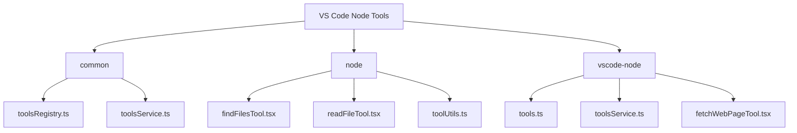
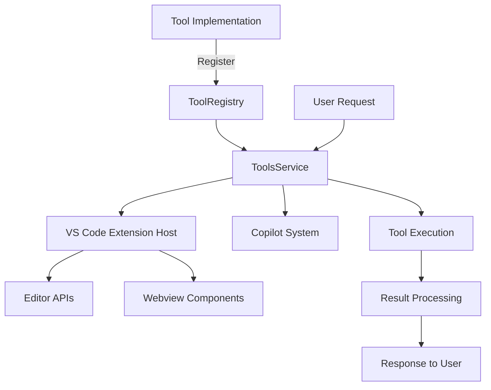
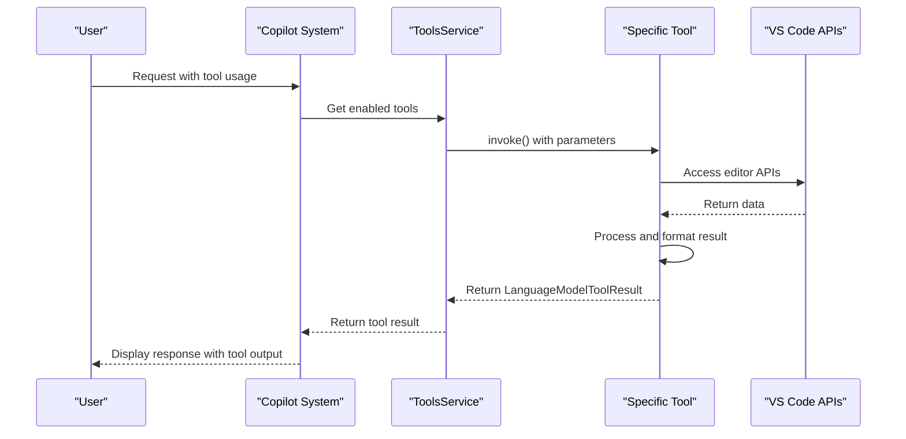
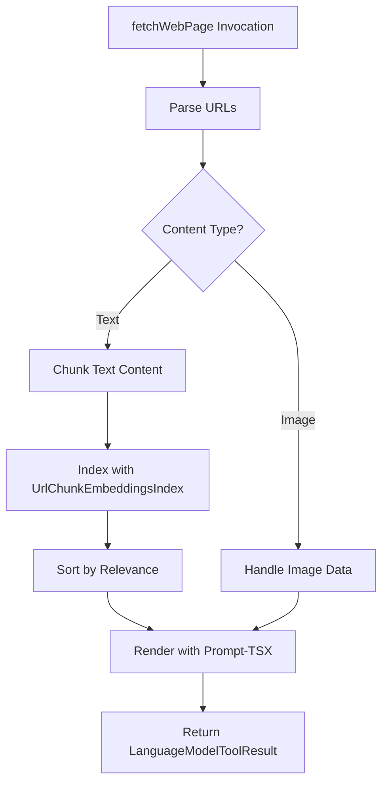
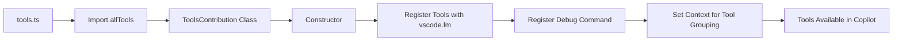

# VS Code Node Tools

<cite>
**Referenced Files in This Document**   
- [tools.ts](file://src/extension/tools/vscode-node/tools.ts)
- [toolsService.ts](file://src/extension/tools/vscode-node/toolsService.ts)
- [fetchWebPageTool.tsx](file://src/extension/tools/vscode-node/fetchWebPageTool.tsx)
- [toolsRegistry.ts](file://src/extension/tools/common/toolsRegistry.ts)
- [toolsService.ts](file://src/extension/tools/common/toolsService.ts)
- [findFilesTool.tsx](file://src/extension/tools/node/findFilesTool.tsx)
- [readFileTool.tsx](file://src/extension/tools/node/readFileTool.tsx)
- [toolUtils.ts](file://src/extension/tools/node/toolUtils.ts)
- [allTools.ts](file://src/extension/tools/node/allTools.ts)
</cite>

## Table of Contents
1. [Introduction](#introduction)
2. [Project Structure](#project-structure)
3. [Core Components](#core-components)
4. [Architecture Overview](#architecture-overview)
5. [Detailed Component Analysis](#detailed-component-analysis)
6. [Dependency Analysis](#dependency-analysis)
7. [Performance Considerations](#performance-considerations)
8. [Troubleshooting Guide](#troubleshooting-guide)
9. [Conclusion](#conclusion)

## Introduction
The VS Code Node Tools sub-component of the Tools system provides a framework for executing tools within the VS Code extension host context with access to editor APIs. This document thoroughly explains the implementation of these tools, focusing on their execution lifecycle, integration with the Copilot system, and interaction with VS Code components such as webviews. The tools enable various functionalities including file operations, web page fetching, and workspace searches, all while maintaining security and performance considerations.

## Project Structure
The VS Code Node Tools are organized within the `src/extension/tools` directory, which contains three main subdirectories: `common`, `node`, and `vscode-node`. The `common` directory houses shared interfaces and services used across different contexts, while the `node` directory contains the core tool implementations. The `vscode-node` directory includes components specific to the VS Code extension host environment.



**Diagram sources**
- [src/extension/tools](file://src/extension/tools)

**Section sources**
- [src/extension/tools](file://src/extension/tools)

## Core Components
The core components of the VS Code Node Tools system include the tools registry, tools service, and individual tool implementations. These components work together to register, manage, and execute tools within the VS Code extension host context. The system is designed to provide seamless integration with the Copilot system while maintaining access to VS Code editor APIs.

**Section sources**
- [toolsRegistry.ts](file://src/extension/tools/common/toolsRegistry.ts)
- [toolsService.ts](file://src/extension/tools/common/toolsService.ts)
- [tools.ts](file://src/extension/tools/vscode-node/tools.ts)

## Architecture Overview
The VS Code Node Tools architecture follows a modular design pattern where tools are registered through a central registry and executed via a service layer. The architecture enables tools to access VS Code editor APIs while maintaining separation between the tool implementations and the extension host integration points.



**Diagram sources**
- [toolsRegistry.ts](file://src/extension/tools/common/toolsRegistry.ts)
- [toolsService.ts](file://src/extension/tools/vscode-node/toolsService.ts)
- [tools.ts](file://src/extension/tools/vscode-node/tools.ts)

## Detailed Component Analysis

### Tool Execution Lifecycle
The tool execution lifecycle in the VS Code Node Tools system follows a well-defined pattern from registration to execution and result processing. Each tool implements the `ICopilotTool` interface and is registered with the `ToolRegistry`, making it available through the `ToolsService`.



**Diagram sources**
- [toolsService.ts](file://src/extension/tools/vscode-node/toolsService.ts)
- [fetchWebPageTool.tsx](file://src/extension/tools/vscode-node/fetchWebPageTool.tsx)

**Section sources**
- [toolsService.ts](file://src/extension/tools/vscode-node/toolsService.ts)
- [fetchWebPageTool.tsx](file://src/extension/tools/vscode-node/fetchWebPageTool.tsx)

### fetchWebPage Tool Implementation
The fetchWebPage tool demonstrates how VS Code Node Tools interface with external resources and webview components. This tool fetches web page content and processes it for display within the Copilot chat interface, handling both text and image content appropriately.



**Diagram sources**
- [fetchWebPageTool.tsx](file://src/extension/tools/vscode-node/fetchWebPageTool.tsx)

**Section sources**
- [fetchWebPageTool.tsx](file://src/extension/tools/vscode-node/fetchWebPageTool.tsx)

### Tools Service Implementation
The ToolsService class manages tool execution in the extension host environment, providing a bridge between the Copilot system and individual tool implementations. It handles tool registration, invocation, and result processing while maintaining proper error handling and logging.

```mermaid
classDiagram
class ToolsService {
+_serviceBrand : undefined
+_copilotTools : Lazy<Map<ToolName, ICopilotTool<any>>>
+_contributedToolCache : {input, output}
+tools : ReadonlyArray<LanguageModelToolInformation>
+copilotTools : ReadonlyMap<ToolName, ICopilotTool<any>>
+invokeTool(name, options, token) : Thenable<LanguageModelToolResult>
+getEnabledTools(request, filter) : LanguageModelToolInformation[]
+getCopilotTool(name) : ICopilotTool<any> | undefined
+getTool(name) : LanguageModelToolInformation | undefined
}
class BaseToolsService {
+_onWillInvokeTool : Emitter<IOnWillInvokeToolEvent>
+onWillInvokeTool : Event<IOnWillInvokeToolEvent>
+ajv : Ajv
+schemaCache : LRUCache<ValidateFunction>
+validateToolInput(name, input) : IToolValidationResult
+validateToolName(name) : string | undefined
}
ToolsService --|> BaseToolsService
ToolsService --> ToolRegistry
ToolsService --> ILogService
ToolsService --> IInstantiationService
```

**Diagram sources**
- [toolsService.ts](file://src/extension/tools/vscode-node/toolsService.ts)
- [toolsService.ts](file://src/extension/tools/common/toolsService.ts)

**Section sources**
- [toolsService.ts](file://src/extension/tools/vscode-node/toolsService.ts)

### Tools Entry Point
The tools.ts file serves as the entry point for registering available tools with the Copilot system. It imports all tool implementations and registers them with the VS Code language model API, making them available for use in chat sessions.



**Diagram sources**
- [tools.ts](file://src/extension/tools/vscode-node/tools.ts)

**Section sources**
- [tools.ts](file://src/extension/tools/vscode-node/tools.ts)

## Dependency Analysis
The VS Code Node Tools system has a well-defined dependency structure that ensures proper separation of concerns while maintaining access to necessary VS Code APIs and services.

```mermaid
graph TD
A[VS Code Node Tools] --> B[VS Code API]
A --> C[Platform Services]
A --> D[Utility Libraries]
B --> E[vscode.lm]
B --> F[vscode.commands]
C --> G[IWorkspaceService]
C --> H[ISearchService]
C --> I[ILogService]
D --> J[@vscode/prompt-tsx]
D --> K[util/common]
D --> L[util/vs]
A --> M[Common Components]
M --> N[toolsRegistry]
M --> O[toolsService]
```

**Diagram sources**
- [package.json](file://package.json)
- [tsconfig.json](file://tsconfig.json)

**Section sources**
- [package.json](file://package.json)
- [tsconfig.json](file://tsconfig.json)

## Performance Considerations
The VS Code Node Tools system incorporates several performance optimizations to ensure responsive tool execution and efficient resource usage. These include caching mechanisms, lazy loading, and timeout handling for long-running operations.

### Caching Strategy
The system implements multiple caching layers to improve performance:
- Schema validation caching using LRUCache
- Lazy initialization of expensive resources
- Result caching for frequently accessed data

### Timeout Handling
Tools like findFilesTool implement timeout mechanisms to prevent hanging operations:
- 20-second timeout for file searches
- Cancellation token support for user-initiated cancellation
- Race conditions between timeout and cancellation

### Resource Management
The system manages resources efficiently by:
- Using streaming for large file operations
- Implementing pagination for large result sets
- Optimizing memory usage through proper disposal patterns

**Section sources**
- [toolsService.ts](file://src/extension/tools/common/toolsService.ts)
- [findFilesTool.tsx](file://src/extension/tools/node/findFilesTool.tsx)
- [readFileTool.tsx](file://src/extension/tools/node/readFileTool.tsx)

## Troubleshooting Guide
This section addresses common issues encountered when developing and using VS Code Node Tools, with a focus on CORS restrictions and UI thread blocking.

### CORS Restrictions in Web Requests
When implementing tools that make web requests, developers may encounter CORS restrictions. The fetchWebPage tool handles this by:
- Using VS Code's internal network stack which bypasses browser CORS policies
- Properly handling authentication headers
- Implementing appropriate error handling for network failures

### UI Thread Blocking
To prevent UI thread blocking during tool execution:
- All tool operations are implemented as async functions
- Long-running operations use cancellation tokens
- Progress reporting is implemented for user feedback
- Heavy computations are offloaded when possible

### Common Issues and Solutions
1. **Tool not appearing in Copilot**: Ensure the tool is properly registered in the ToolRegistry and imported in allTools.ts
2. **Authentication failures**: Verify that the tool has proper permissions and authentication tokens
3. **Performance issues**: Check for missing cancellation token handling or inefficient algorithms
4. **Serialization errors**: Validate that tool input/output conforms to the defined JSON schema

**Section sources**
- [fetchWebPageTool.tsx](file://src/extension/tools/vscode-node/fetchWebPageTool.tsx)
- [toolUtils.ts](file://src/extension/tools/node/toolUtils.ts)
- [toolsService.ts](file://src/extension/tools/common/toolsService.ts)

## Conclusion
The VS Code Node Tools system provides a robust framework for executing tools within the VS Code extension host context. By leveraging the toolsService implementation and proper tool registration through tools.ts, developers can create powerful integrations with the Copilot system. The system handles complex scenarios such as web page fetching while addressing common issues like CORS restrictions and UI thread blocking. With its modular architecture and comprehensive error handling, the VS Code Node Tools system enables the creation of sophisticated, user-friendly tools that enhance the developer experience.