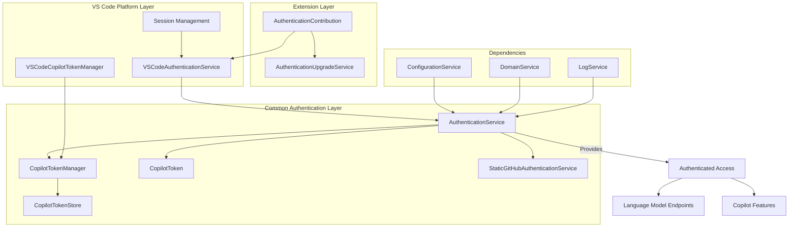
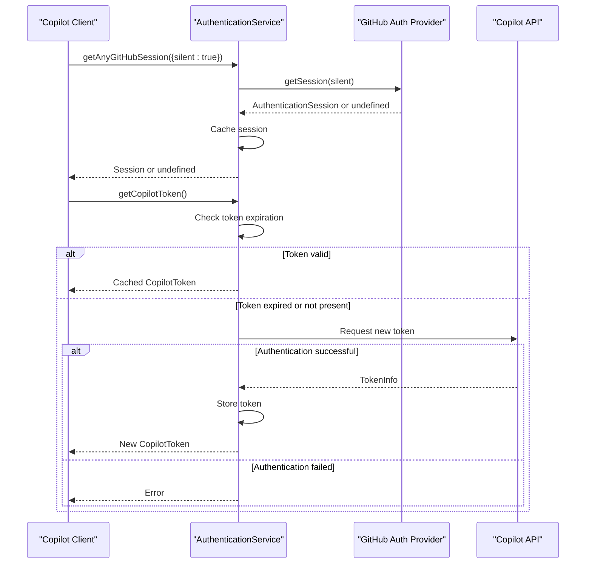
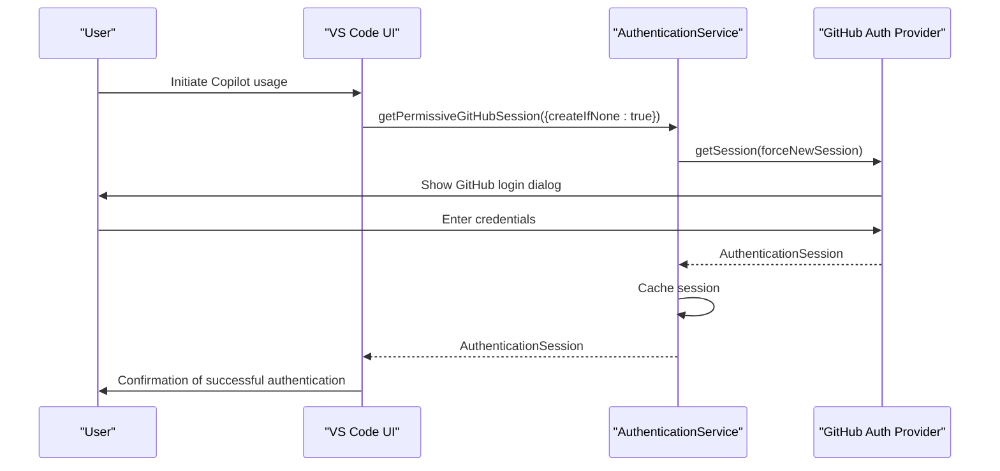
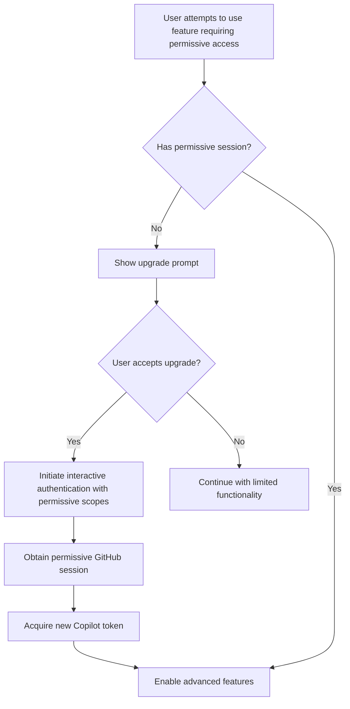
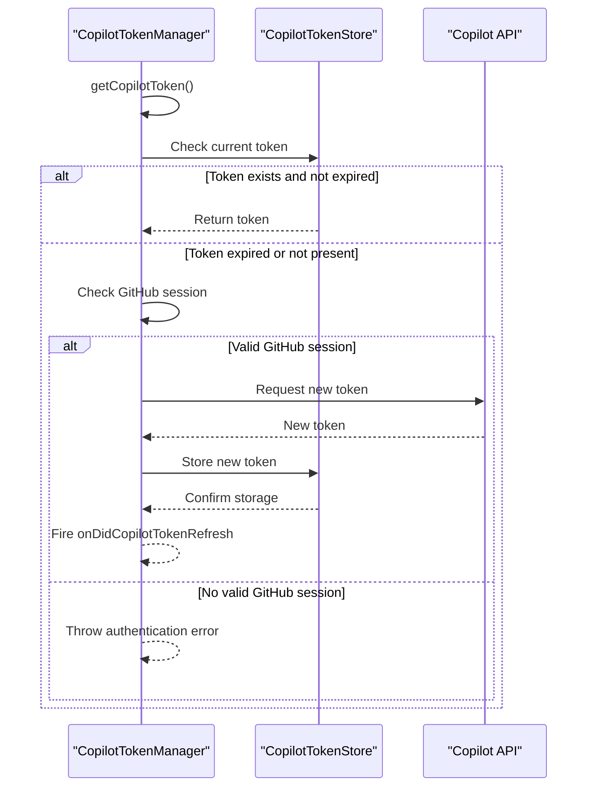
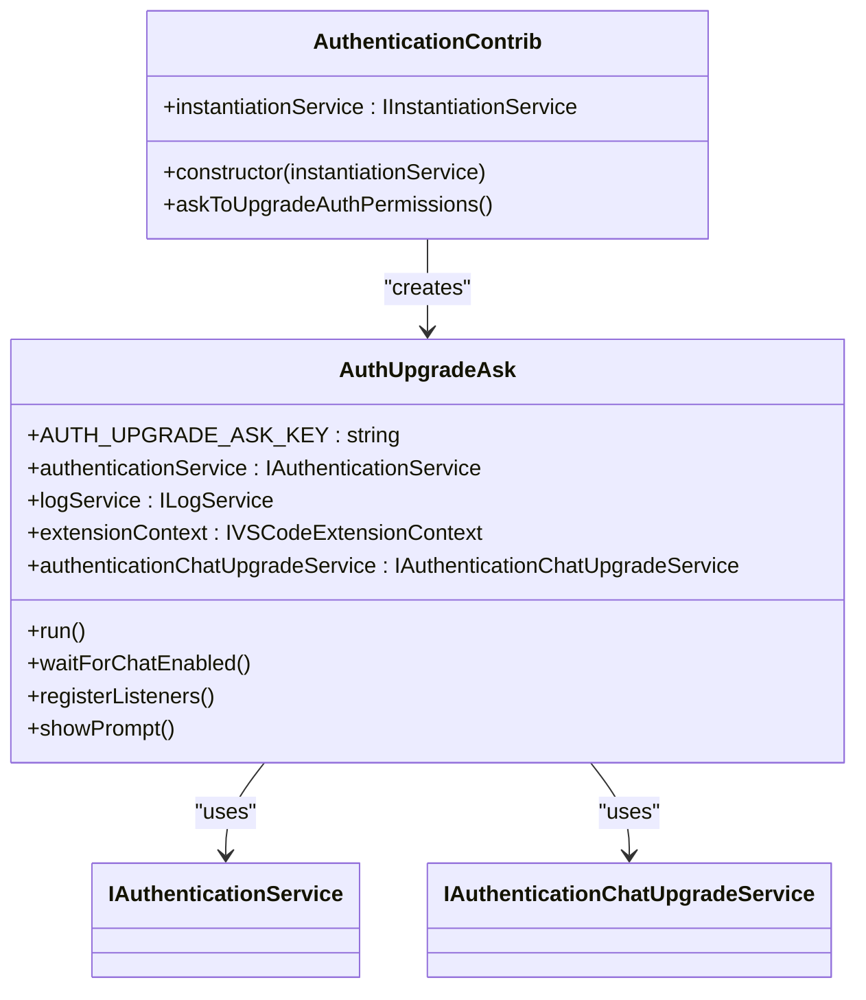
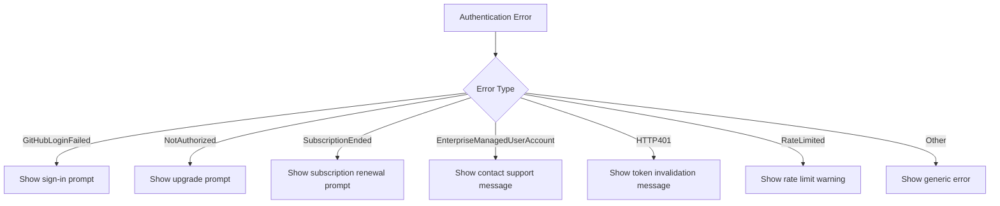

# Authentication Service

<cite>
**Referenced Files in This Document**   
- [authentication.ts](file://src/platform/authentication/common/authentication.ts)
- [copilotToken.ts](file://src/platform/authentication/common/copilotToken.ts)
- [copilotTokenManager.ts](file://src/platform/authentication/common/copilotTokenManager.ts)
- [copilotTokenStore.ts](file://src/platform/authentication/common/copilotTokenStore.ts)
- [authenticationService.ts](file://src/platform/authentication/vscode-node/authenticationService.ts)
- [copilotTokenManager.ts](file://src/platform/authentication/vscode-node/copilotTokenManager.ts)
- [session.ts](file://src/platform/authentication/vscode-node/session.ts)
- [authentication.contribution.ts](file://src/extension/authentication/vscode-node/authentication.contribution.ts)
- [configurationService.ts](file://src/platform/configuration/common/configurationService.ts)
- [domainService.ts](file://src/platform/endpoint/common/domainService.ts)
</cite>

## Table of Contents
1. [Introduction](#introduction)
2. [Architecture Overview](#architecture-overview)
3. [Core Components](#core-components)
4. [Authentication Flows](#authentication-flows)
5. [Token Management](#token-management)
6. [VS Code Integration](#vs-code-integration)
7. [Configuration and Permissions](#configuration-and-permissions)
8. [Error Handling](#error-handling)
9. [Security Considerations](#security-considerations)
10. [Practical Examples](#practical-examples)

## Introduction

The Authentication Service in GitHub Copilot Chat is responsible for managing user identity, authentication flows, and token management to enable secure access to Copilot services. This service acts as the central authority for authentication within the Copilot ecosystem, handling the acquisition, validation, and refresh of authentication tokens required to access language model endpoints and other Copilot features.

The service implements a multi-layered approach to authentication, separating common authentication logic from VS Code-specific implementations. It manages both GitHub authentication sessions and Copilot-specific tokens, ensuring users have the appropriate permissions to access various Copilot features based on their subscription level and organizational affiliation.

The authentication system is designed to handle various authentication scenarios, including silent authentication for existing sessions, interactive authentication when required, and token refresh mechanisms to maintain continuous access. It also implements sophisticated error handling strategies to manage authentication failures gracefully and provide meaningful feedback to users.

**Section sources**
- [authentication.ts](file://src/platform/authentication/common/authentication.ts#L1-L308)
- [copilotToken.ts](file://src/platform/authentication/common/copilotToken.ts#L1-L313)

## Architecture Overview

The Authentication Service follows a layered architecture with clear separation between platform-agnostic authentication logic and VS Code-specific implementations. The architecture consists of several key components that work together to provide a robust authentication system.



**Diagram sources**
- [authentication.ts](file://src/platform/authentication/common/authentication.ts#L1-L308)
- [authenticationService.ts](file://src/platform/authentication/vscode-node/authenticationService.ts#L1-L74)
- [copilotTokenManager.ts](file://src/platform/authentication/vscode-node/copilotTokenManager.ts#L1-L140)

**Section sources**
- [authentication.ts](file://src/platform/authentication/common/authentication.ts#L1-L308)
- [authenticationService.ts](file://src/platform/authentication/vscode-node/authenticationService.ts#L1-L74)

## Core Components

The Authentication Service consists of several core components that work together to manage user authentication and token lifecycle. These components are designed with clear separation of concerns, allowing for extensibility and maintainability.

### Authentication Service Interface

The `IAuthenticationService` interface defines the contract for authentication operations, providing methods for obtaining GitHub sessions and Copilot tokens. It exposes both synchronous properties for checking current authentication state and asynchronous methods for acquiring new sessions.

Key features of the authentication service include:
- Support for multiple authentication scopes (minimal and permissive)
- Event-driven architecture for authentication state changes
- Integration with VS Code's authentication provider system
- Support for both GitHub and Azure DevOps authentication

### Copilot Token Management

The token management system handles the acquisition, validation, and refresh of Copilot tokens. The `ICopilotTokenManager` interface defines the contract for token operations, while concrete implementations handle the specifics of token retrieval from the Copilot service.

The token system includes:
- Automatic token refresh based on expiration
- Error handling for token acquisition failures
- Support for anonymous access in development scenarios
- Integration with telemetry and logging services

### Token Storage

The `ICopilotTokenStore` provides a simple mechanism for storing and retrieving Copilot tokens. This component is designed to avoid cyclical dependencies between services while providing a centralized location for token storage.

```mermaid
classDiagram
class IAuthenticationService {
+isMinimalMode : boolean
+onDidAuthenticationChange : Event
+anyGitHubSession : AuthenticationSession
+permissiveGitHubSession : AuthenticationSession
+copilotToken : CopilotToken
+speculativeDecodingEndpointToken : string
+getAnyGitHubSession(options) : Promise~AuthenticationSession~
+getPermissiveGitHubSession(options) : Promise~AuthenticationSession~
+getCopilotToken(force) : Promise~CopilotToken~
+resetCopilotToken(httpError) : void
}
class ICopilotTokenManager {
+onDidCopilotTokenRefresh : Event
+getCopilotToken(force) : Promise~CopilotToken~
+resetCopilotToken(httpError) : void
}
class ICopilotTokenStore {
+copilotToken : CopilotToken
+onDidStoreUpdate : Event
}
class CopilotToken {
+token : string
+sku : string
+isIndividual : boolean
+organizationList : string[]
+enterpriseList : number[]
+endpoints : {api, telemetry, proxy}
+isInternal : boolean
+isMicrosoftInternal : boolean
+isGitHubInternal : boolean
+isFreeUser : boolean
+isNoAuthUser : boolean
+isChatQuotaExceeded : boolean
+isCompletionsQuotaExceeded : boolean
+codeQuoteEnabled : boolean
+isVscodeTeamMember : boolean
+codexAgentEnabled : boolean
+copilotPlan : 'free' | 'individual' | 'individual_pro' | 'business' | 'enterprise'
+quotaInfo : {quota_snapshots, quota_reset_date}
+username : string
+isTelemetryEnabled() : boolean
+isPublicSuggestionsEnabled() : boolean
+isChatEnabled() : boolean
+isCopilotIgnoreEnabled() : boolean
+isCopilotCodeReviewEnabled : boolean
+isEditorPreviewFeaturesEnabled() : boolean
+isMcpEnabled() : boolean
+getTokenValue(key) : string
+isExpandedClientSideIndexingEnabled() : boolean
+isFcv1() : boolean
}
IAuthenticationService --> ICopilotTokenManager : "uses"
IAuthenticationService --> ICopilotTokenStore : "uses"
ICopilotTokenManager --> CopilotToken : "creates"
ICopilotTokenStore --> CopilotToken : "stores"
```

**Diagram sources**
- [authentication.ts](file://src/platform/authentication/common/authentication.ts#L1-L308)
- [copilotTokenManager.ts](file://src/platform/authentication/common/copilotTokenManager.ts#L1-L60)
- [copilotTokenStore.ts](file://src/platform/authentication/common/copilotTokenStore.ts#L1-L41)
- [copilotToken.ts](file://src/platform/authentication/common/copilotToken.ts#L1-L313)

**Section sources**
- [authentication.ts](file://src/platform/authentication/common/authentication.ts#L1-L308)
- [copilotTokenManager.ts](file://src/platform/authentication/common/copilotTokenManager.ts#L1-L60)
- [copilotTokenStore.ts](file://src/platform/authentication/common/copilotTokenStore.ts#L1-L41)
- [copilotToken.ts](file://src/platform/authentication/common/copilotToken.ts#L1-L313)

## Authentication Flows

The Authentication Service implements several authentication flows to handle different scenarios and user interactions. These flows are designed to provide a seamless experience while maintaining security and respecting user preferences.

### Silent Authentication Flow

The silent authentication flow is used when the application needs to check the current authentication state without prompting the user. This flow is typically used during startup or when refreshing tokens.



**Diagram sources**
- [authenticationService.ts](file://src/platform/authentication/vscode-node/authenticationService.ts#L1-L74)
- [session.ts](file://src/platform/authentication/vscode-node/session.ts#L1-L128)
- [copilotTokenManager.ts](file://src/platform/authentication/vscode-node/copilotTokenManager.ts#L1-L140)

### Interactive Authentication Flow

The interactive authentication flow is triggered when the user needs to explicitly authenticate, typically when signing in for the first time or when upgrading permissions.



**Diagram sources**
- [authenticationService.ts](file://src/platform/authentication/vscode-node/authenticationService.ts#L1-L74)
- [session.ts](file://src/platform/authentication/vscode-node/session.ts#L1-L128)

### Permission Upgrade Flow

The permission upgrade flow allows users to upgrade their authentication scope from minimal to permissive, granting access to additional Copilot features.



**Diagram sources**
- [authentication.contribution.ts](file://src/extension/authentication/vscode-node/authentication.contribution.ts#L1-L110)
- [authenticationService.ts](file://src/platform/authentication/vscode-node/authenticationService.ts#L1-L74)

**Section sources**
- [authenticationService.ts](file://src/platform/authentication/vscode-node/authenticationService.ts#L1-L74)
- [session.ts](file://src/platform/authentication/vscode-node/session.ts#L1-L128)
- [authentication.contribution.ts](file://src/extension/authentication/vscode-node/authentication.contribution.ts#L1-L110)

## Token Management

The token management system is responsible for acquiring, validating, and refreshing Copilot tokens. This system ensures that users have valid tokens to access Copilot services while handling token expiration and invalidation gracefully.

### Token Acquisition

The token acquisition process involves several steps to ensure the user has a valid Copilot token:

1. Check for existing valid token in cache
2. If no valid token exists, acquire GitHub authentication session
3. Use GitHub session to request Copilot token from the Copilot service
4. Store the acquired token for future use

The system supports both silent and interactive token acquisition, depending on the user's authentication state and the required permissions.

### Token Refresh Mechanism

The token refresh mechanism automatically handles token expiration by acquiring new tokens before they expire. The system uses the `refresh_in` field from the token response to determine when to refresh the token, typically refreshing 5 minutes before expiration.



**Diagram sources**
- [copilotTokenManager.ts](file://src/platform/authentication/vscode-node/copilotTokenManager.ts#L1-L140)
- [copilotTokenStore.ts](file://src/platform/authentication/common/copilotTokenStore.ts#L1-L41)

### Secure Token Storage

Tokens are stored securely using the VS Code authentication provider system, which handles secure storage of authentication credentials. The `CopilotTokenStore` provides a simple interface for accessing the current token while ensuring that token updates are properly propagated to dependent services.

The system also implements token invalidation when HTTP errors indicate that a token is no longer valid, such as 401 Unauthorized responses.

**Section sources**
- [copilotTokenManager.ts](file://src/platform/authentication/vscode-node/copilotTokenManager.ts#L1-L140)
- [copilotTokenStore.ts](file://src/platform/authentication/common/copilotTokenStore.ts#L1-L41)
- [copilotToken.ts](file://src/platform/authentication/common/copilotToken.ts#L1-L313)

## VS Code Integration

The Authentication Service integrates closely with VS Code's authentication system, leveraging its built-in capabilities while extending them to support Copilot-specific requirements.

### Authentication Provider Integration

The service integrates with VS Code's authentication provider system through the `authentication` API. It supports both GitHub and GitHub Enterprise authentication providers, allowing users to authenticate with their preferred GitHub instance.

The integration handles:
- Session management with VS Code's authentication provider
- Event handling for authentication state changes
- Multi-account support for GitHub
- Secure storage of authentication tokens

### Extension Contribution

The authentication functionality is exposed to the VS Code extension through the `AuthenticationContrib` class, which serves as the entry point for authentication features.



**Diagram sources**
- [authentication.contribution.ts](file://src/extension/authentication/vscode-node/authentication.contribution.ts#L1-L110)
- [authenticationService.ts](file://src/platform/authentication/vscode-node/authenticationService.ts#L1-L74)

The extension contribution handles:
- Automatic prompting for authentication when needed
- Permission upgrade requests
- Integration with the extension context for state management
- Error handling and user feedback

**Section sources**
- [authentication.contribution.ts](file://src/extension/authentication/vscode-node/authentication.contribution.ts#L1-L110)
- [authenticationService.ts](file://src/platform/authentication/vscode-node/authenticationService.ts#L1-L74)

## Configuration and Permissions

The Authentication Service supports configurable authentication behavior through VS Code settings, allowing users and administrators to customize the authentication experience.

### Authentication Scopes

The service supports different authentication scopes to balance security and functionality:

- **Minimal Scope**: Includes `user:email` permission, sufficient for basic Copilot functionality
- **Permissive Scope**: Includes `read:user`, `user:email`, `repo`, and `workflow` permissions, enabling full Copilot functionality

The scope used depends on the user's configuration and the features they need to access.

### Configuration Options

The authentication behavior can be configured through several settings:

```mermaid
flowchart TD
A[Configuration Options] --> B[authProvider]
A --> C[authPermissions]
A --> D[allowAnonymousAccess]
B --> B1["github" | "githubEnterprise"]
C --> C1["minimal" | "permissive"]
D --> D1["true" | "false"]
B1 --> E[Authentication Provider Selection]
C1 --> F[Scope Requirements]
D1 --> G[Anonymous Access Policy]
```

These configuration options are managed through the `IConfigurationService` and affect various aspects of the authentication flow, including which authentication provider to use and the required permission level.

**Section sources**
- [configurationService.ts](file://src/platform/configuration/common/configurationService.ts#L1-L200)
- [authentication.ts](file://src/platform/authentication/common/authentication.ts#L1-L308)
- [session.ts](file://src/platform/authentication/vscode-node/session.ts#L1-L128)

## Error Handling

The Authentication Service implements comprehensive error handling to manage various authentication failure scenarios gracefully.

### Authentication Failure Types

The system handles several types of authentication failures:

- **GitHubLoginFailed**: User is not signed in to GitHub
- **NotAuthorized**: User does not have Copilot access
- **SubscriptionEnded**: User's Copilot subscription has ended
- **EnterpriseManagedUserAccount**: User is managed by an enterprise policy
- **HTTP401**: Invalid or expired GitHub token
- **RateLimited**: User has exceeded GitHub's API rate limit

### Error Recovery Strategies

The service implements different recovery strategies based on the error type:



For certain errors like HTTP 401 responses, the system shows a warning message to the user with instructions to sign out and sign back in to resolve the issue.

**Section sources**
- [copilotTokenManager.ts](file://src/platform/authentication/vscode-node/copilotTokenManager.ts#L1-L140)
- [copilotToken.ts](file://src/platform/authentication/common/copilotToken.ts#L1-L313)

## Security Considerations

The Authentication Service implements several security measures to protect user credentials and authentication tokens.

### Token Security

- Tokens are stored using VS Code's secure credential storage
- Token refresh mechanism minimizes exposure of long-lived tokens
- Automatic token invalidation on authentication errors
- Limited scope permissions based on user needs

### Data Protection

- User telemetry preferences are respected and stored locally
- Anonymous access is limited to development scenarios
- Enterprise user policies are enforced
- Internal Microsoft and GitHub organization members have additional security checks

### Secure Communication

- All authentication requests use HTTPS
- Tokens are transmitted securely between services
- Session state is validated on each request
- Regular token rotation reduces the impact of potential leaks

**Section sources**
- [copilotToken.ts](file://src/platform/authentication/common/copilotToken.ts#L1-L313)
- [authenticationService.ts](file://src/platform/authentication/vscode-node/authenticationService.ts#L1-L74)
- [copilotTokenManager.ts](file://src/platform/authentication/vscode-node/copilotTokenManager.ts#L1-L140)

## Practical Examples

This section provides practical examples of common authentication workflows and how to handle typical issues.

### Common Authentication Workflows

**Initial Setup Workflow:**
1. User installs Copilot extension
2. Extension detects no authentication
3. User is prompted to sign in to GitHub
4. After successful authentication, Copilot token is acquired
5. User can now use Copilot features

**Feature Upgrade Workflow:**
1. User attempts to use a feature requiring permissive access
2. System detects current session has minimal permissions
3. User is prompted to upgrade authentication permissions
4. User approves permission upgrade
5. New session with permissive scopes is acquired
6. User can now access the advanced feature

### Handling Common Issues

**Token Expiration:**
When a token expires, the system automatically attempts to refresh it using the existing GitHub session. If the refresh fails, the user may need to re-authenticate.

**Invalid Token:**
If a token becomes invalid (e.g., due to account changes), the system will detect this through HTTP 401 responses and prompt the user to sign out and sign back in to resolve the issue.

**Permission Issues:**
Users may encounter permission issues if their Copilot subscription has ended or if they don't have the required permissions. The system provides specific error messages to help users understand and resolve these issues.

**Network Issues:**
Transient network issues are handled by retry mechanisms with exponential backoff. Persistent issues may require user intervention or troubleshooting of network connectivity.

**Section sources**
- [authenticationService.ts](file://src/platform/authentication/vscode-node/authenticationService.ts#L1-L74)
- [copilotTokenManager.ts](file://src/platform/authentication/vscode-node/copilotTokenManager.ts#L1-L140)
- [authentication.contribution.ts](file://src/extension/authentication/vscode-node/authentication.contribution.ts#L1-L110)