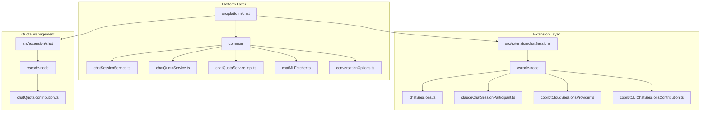
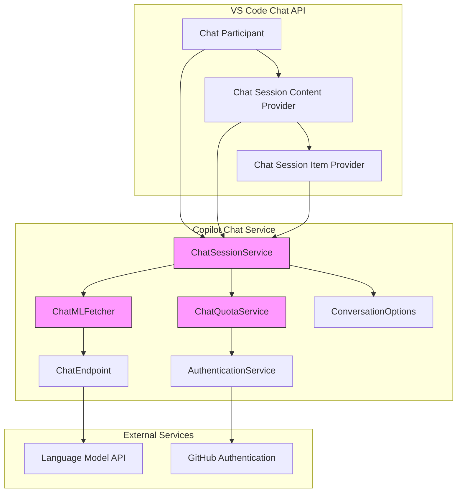
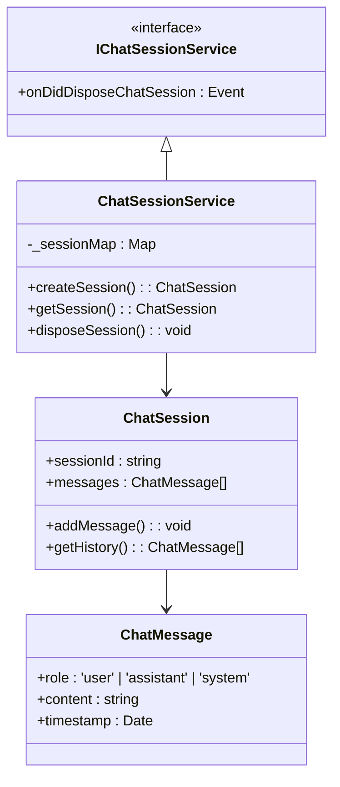
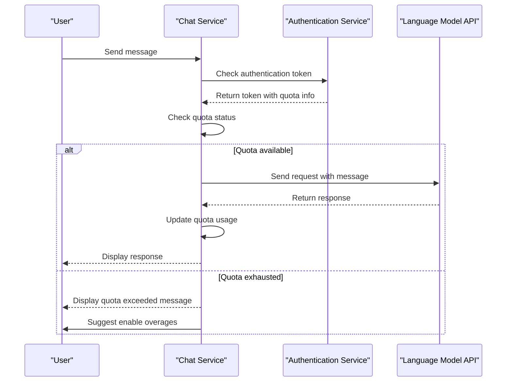
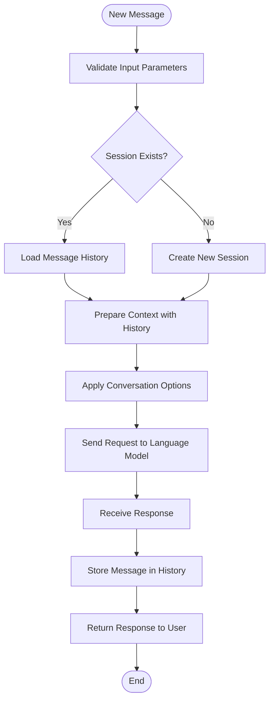
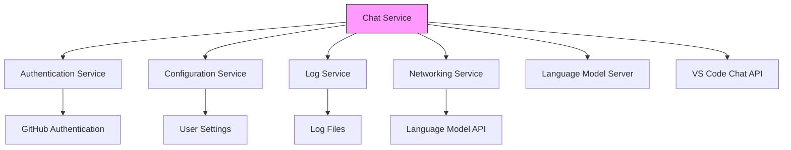

# Chat Service

<cite>
**Referenced Files in This Document**   
- [chatSessionService.ts](file://src/platform/chat/common/chatSessionService.ts)
- [chatQuotaService.ts](file://src/platform/chat/common/chatQuotaService.ts)
- [chatQuotaServiceImpl.ts](file://src/platform/chat/common/chatQuotaServiceImpl.ts)
- [chatQuota.contribution.ts](file://src/extension/chat/vscode-node/chatQuota.contribution.ts)
- [conversationOptions.ts](file://src/platform/chat/common/conversationOptions.ts)
- [chatMLFetcher.ts](file://src/platform/chat/common/chatMLFetcher.ts)
- [chatSessions.ts](file://src/extension/chatSessions/vscode-node/chatSessions.ts)
- [claudeChatSessionParticipant.ts](file://src/extension/chatSessions/vscode-node/claudeChatSessionParticipant.ts)
- [copilotCLIChatSessionsContribution.ts](file://src/extension/chatSessions/vscode-node/copilotCLIChatSessionsContribution.ts)
- [copilotCloudSessionsProvider.ts](file://src/extension/chatSessions/vscode-node/copilotCloudSessionsProvider.ts)
</cite>

## Table of Contents
1. [Introduction](#introduction)
2. [Project Structure](#project-structure)
3. [Core Components](#core-components)
4. [Architecture Overview](#architecture-overview)
5. [Detailed Component Analysis](#detailed-component-analysis)
6. [Dependency Analysis](#dependency-analysis)
7. [Performance Considerations](#performance-considerations)
8. [Troubleshooting Guide](#troubleshooting-guide)
9. [Conclusion](#conclusion)

## Introduction
The Chat Service in GitHub Copilot Chat is responsible for managing conversational sessions, handling chat state, and enforcing usage quotas. It provides the core functionality for interactive AI-assisted development within the VS Code environment. The service manages conversation lifecycle, preserves context across interactions, and integrates with authentication and endpoint services to deliver a seamless chat experience. This documentation details the implementation of conversation management, quota enforcement, and integration with other platform components.

## Project Structure
The chat service components are organized across multiple directories within the repository, with clear separation between platform-level services and extension-specific implementations. The core chat functionality resides in the `src/platform/chat` directory, while session management and contribution points are located in `src/extension/chatSessions`.

**Diagram sources**
- [chatSessionService.ts](file://src/platform/chat/common/chatSessionService.ts)
- [chatQuotaService.ts](file://src/platform/chat/common/chatQuotaService.ts)
- [chatSessions.ts](file://src/extension/chatSessions/vscode-node/chatSessions.ts)
- [chatQuota.contribution.ts](file://src/extension/chat/vscode-node/chatQuota.contribution.ts)

**Section sources**
- [src/platform/chat](file://src/platform/chat)
- [src/extension/chatSessions](file://src/extension/chatSessions)
- [src/extension/chat](file://src/extension/chat)

## Core Components
The Chat Service consists of several key components that work together to manage conversational sessions and enforce usage policies. The core components include the chat session service for managing conversation state, the quota service for tracking and limiting API usage, and the ML fetcher for communicating with language models. These components are designed to work in concert with authentication services for user identification and endpoint services for language model communication.

**Section sources**
- [chatSessionService.ts](file://src/platform/chat/common/chatSessionService.ts)
- [chatQuotaService.ts](file://src/platform/chat/common/chatQuotaService.ts)
- [chatMLFetcher.ts](file://src/platform/chat/common/chatMLFetcher.ts)

## Architecture Overview
The Chat Service architecture follows a layered approach with clear separation between platform services and extension contributions. The service integrates with VS Code's chat API to provide conversational capabilities while maintaining state and enforcing usage quotas.

**Diagram sources**
- [chatSessionService.ts](file://src/platform/chat/common/chatSessionService.ts)
- [chatQuotaService.ts](file://src/platform/chat/common/chatQuotaService.ts)
- [chatMLFetcher.ts](file://src/platform/chat/common/chatMLFetcher.ts)
- [chatSessions.ts](file://src/extension/chatSessions/vscode-node/chatSessions.ts)

## Detailed Component Analysis

### Chat Session Management
The chat session management system handles the creation, maintenance, and disposal of conversational sessions. It preserves conversation context and manages the interaction lifecycle between the user and the AI assistant.

#### Session Service Implementation

**Diagram sources**
- [chatSessionService.ts](file://src/platform/chat/common/chatSessionService.ts)

**Section sources**
- [chatSessionService.ts](file://src/platform/chat/common/chatSessionService.ts)

### Quota Service Implementation
The quota service tracks and limits API usage to prevent abuse and ensure fair resource allocation. It processes quota information from authentication tokens and HTTP headers to enforce usage limits.

#### Quota Service Architecture

**Diagram sources**
- [chatQuotaService.ts](file://src/platform/chat/common/chatQuotaService.ts)
- [chatQuotaServiceImpl.ts](file://src/platform/chat/common/chatQuotaServiceImpl.ts)

**Section sources**
- [chatQuotaService.ts](file://src/platform/chat/common/chatQuotaService.ts)
- [chatQuotaServiceImpl.ts](file://src/platform/chat/common/chatQuotaServiceImpl.ts)

### Conversation Context Preservation
The conversation management system preserves context across interactions by maintaining message history and conversation state. This enables the AI assistant to provide coherent and contextually relevant responses.

#### Context Preservation Flow

**Diagram sources**
- [conversationOptions.ts](file://src/platform/chat/common/conversationOptions.ts)
- [chatMLFetcher.ts](file://src/platform/chat/common/chatMLFetcher.ts)

**Section sources**
- [conversationOptions.ts](file://src/platform/chat/common/conversationOptions.ts)
- [chatMLFetcher.ts](file://src/platform/chat/common/chatMLFetcher.ts)

## Dependency Analysis
The Chat Service has dependencies on several core platform services and external components. These dependencies enable authentication, configuration management, logging, and communication with language models.

**Diagram sources**
- [chatQuotaServiceImpl.ts](file://src/platform/chat/common/chatQuotaServiceImpl.ts)
- [chatSessions.ts](file://src/extension/chatSessions/vscode-node/chatSessions.ts)
- [chatMLFetcher.ts](file://src/platform/chat/common/chatMLFetcher.ts)

**Section sources**
- [chatQuotaServiceImpl.ts](file://src/platform/chat/common/chatQuotaServiceImpl.ts)
- [chatSessions.ts](file://src/extension/chatSessions/vscode-node/chatSessions.ts)
- [chatMLFetcher.ts](file://src/platform/chat/common/chatMLFetcher.ts)

## Performance Considerations
The Chat Service is designed with performance in mind, particularly when handling large conversation histories. The service implements efficient message storage and retrieval mechanisms to minimize memory usage and response times. The quota service caches quota information to avoid repeated API calls, and the ML fetcher uses streaming to deliver responses incrementally. Configuration options allow users to control response length and other performance-related parameters.

## Troubleshooting Guide
Common issues with the Chat Service typically relate to authentication, quota limits, or network connectivity. When users encounter problems, they should first verify their authentication status and check their quota usage. If the quota is exhausted, users can enable overages through the provided command. Network issues may require checking firewall settings or proxy configurations. Error messages from the service typically include diagnostic information that can help identify the root cause.

**Section sources**
- [chatQuota.contribution.ts](file://src/extension/chat/vscode-node/chatQuota.contribution.ts)
- [chatQuotaServiceImpl.ts](file://src/platform/chat/common/chatQuotaServiceImpl.ts)

## Conclusion
The Chat Service in GitHub Copilot Chat provides a robust foundation for AI-assisted development within VS Code. By effectively managing conversational sessions, preserving context, and enforcing usage quotas, the service delivers a reliable and scalable chat experience. The modular architecture allows for easy integration with various language models and extension points, while the quota system ensures fair usage across all users. Future enhancements could include improved context management for very long conversations and more granular quota controls.