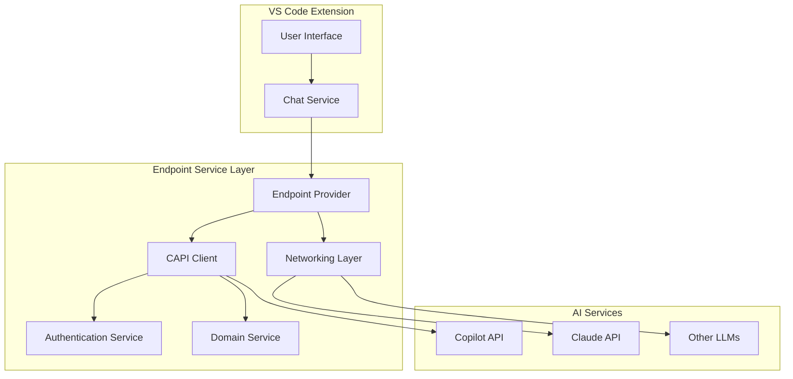
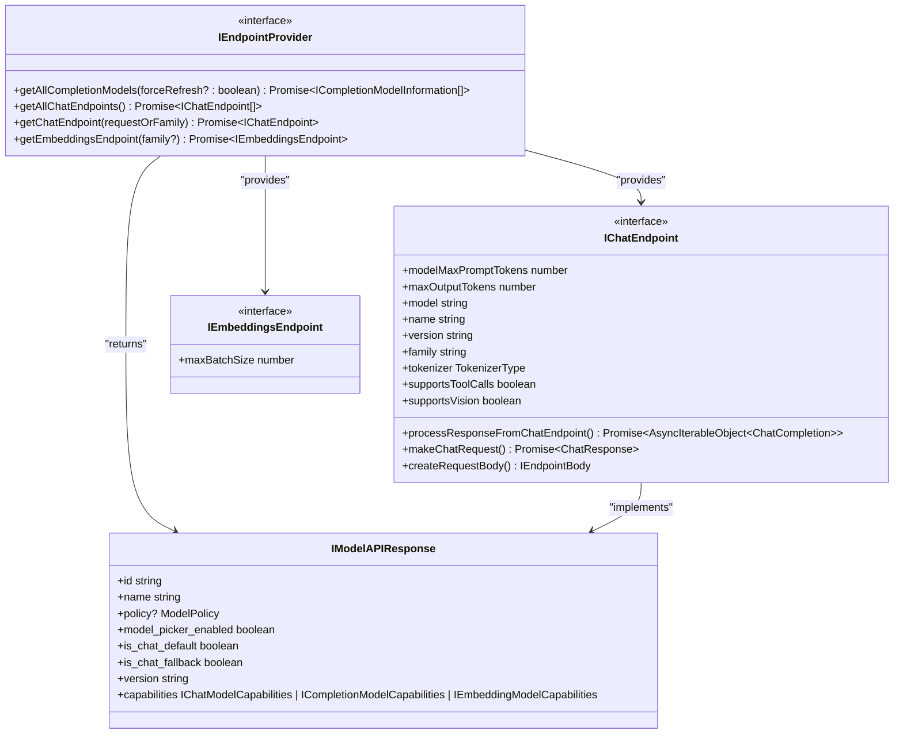
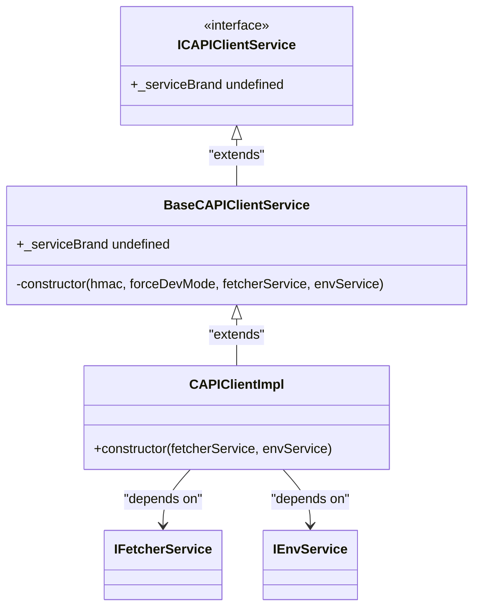
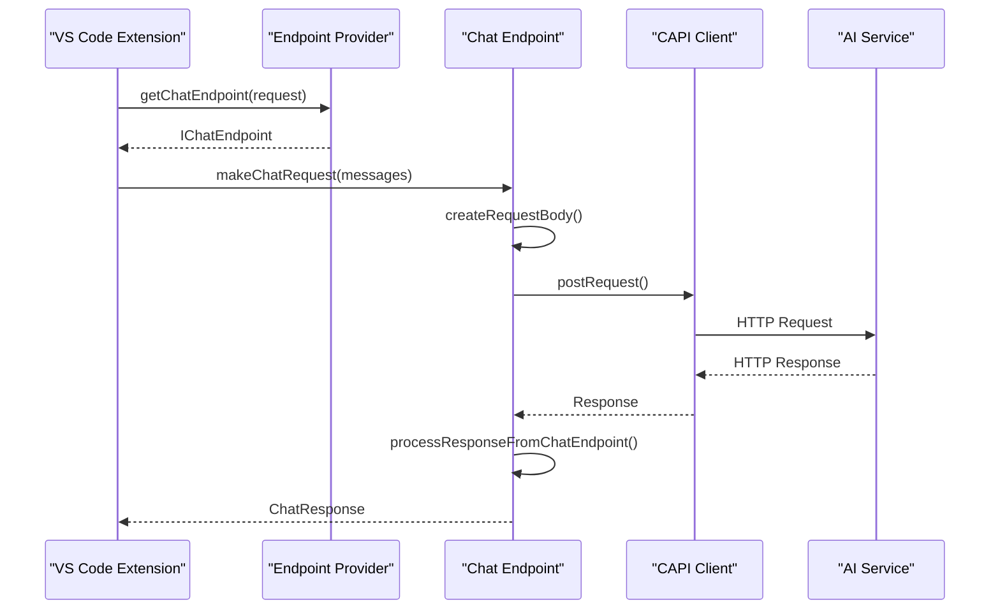
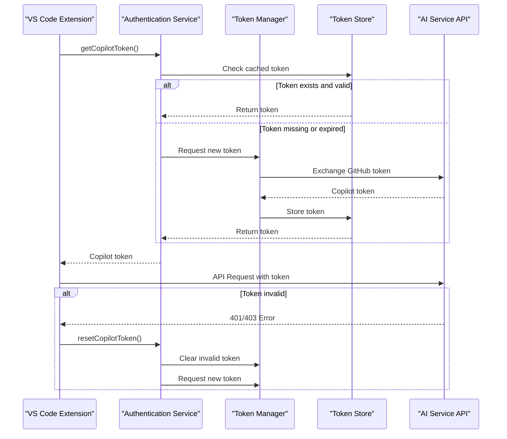
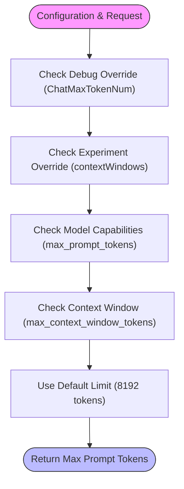
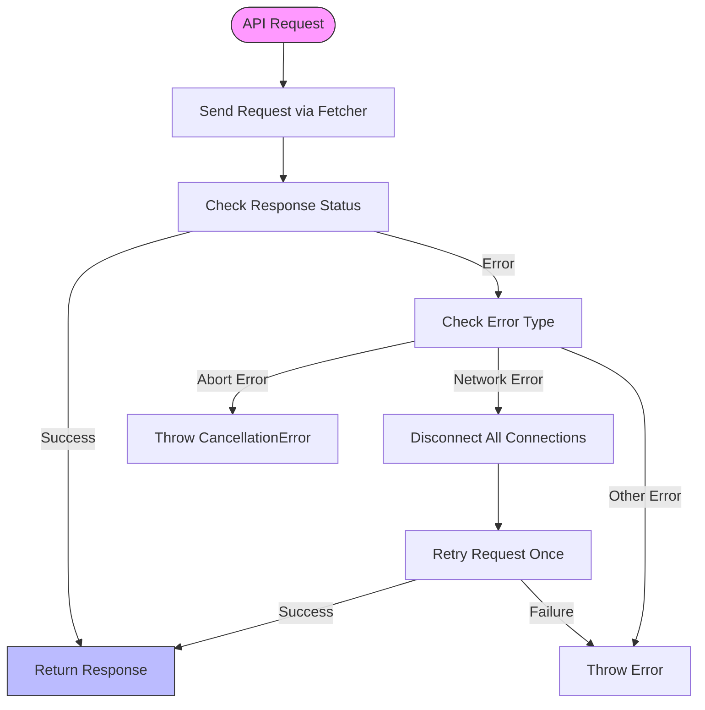

# Endpoint Service

<cite>
**Referenced Files in This Document**   
- [endpointProvider.ts](file://src/platform/endpoint/common/endpointProvider.ts)
- [capiClient.ts](file://src/platform/endpoint/common/capiClient.ts)
- [capiClientImpl.ts](file://src/platform/endpoint/node/capiClientImpl.ts)
- [chatEndpoint.ts](file://src/platform/endpoint/node/chatEndpoint.ts)
- [copilotChatEndpoint.ts](file://src/platform/endpoint/node/copilotChatEndpoint.ts)
- [networking.ts](file://src/platform/networking/common/networking.ts)
- [authentication.ts](file://src/platform/authentication/common/authentication.ts)
- [domainService.ts](file://src/platform/endpoint/common/domainService.ts)
- [domainServiceImpl.ts](file://src/platform/endpoint/node/domainServiceImpl.ts)
</cite>

## Table of Contents
1. [Introduction](#introduction)
2. [Architecture Overview](#architecture-overview)
3. [Endpoint Provider Pattern](#endpoint-provider-pattern)
4. [CAPI Client Implementation](#capi-client-implementation)
5. [Request and Response Handling](#request-and-response-handling)
6. [Authentication and Token Management](#authentication-and-token-management)
7. [Configuration and Endpoint Selection](#configuration-and-endpoint-selection)
8. [Error Recovery and Network Resilience](#error-recovery-and-network-resilience)
9. [Common Issues and Troubleshooting](#common-issues-and-troubleshooting)
10. [Conclusion](#conclusion)

## Introduction

The Endpoint Service in GitHub Copilot Chat serves as the integration layer between the VS Code extension and various language model APIs, including Copilot, Claude, and other AI services. This service abstracts the complexities of communicating with different AI providers through a unified interface, enabling seamless integration and switching between various language models. The service implements the endpoint provider pattern to manage different AI services, handling communication protocols, request/response processing, authentication, rate limiting, and network resilience.

The Endpoint Service is responsible for routing chat requests to appropriate language model endpoints based on configuration, model preferences, and availability. It manages the complete lifecycle of AI interactions, from request preparation and transmission to response processing and error handling. The service also handles critical aspects such as authentication token management, rate limiting enforcement, and network connectivity issues to ensure reliable performance.

**Section sources**
- [endpointProvider.ts](file://src/platform/endpoint/common/endpointProvider.ts#L1-L145)

## Architecture Overview

The Endpoint Service architecture follows a layered design pattern with clear separation of concerns. At its core is the endpoint provider pattern that abstracts different AI services behind a common interface. The architecture consists of several key components: the endpoint provider, CAPI client, networking layer, authentication service, and domain service.

**Diagram sources **
- [endpointProvider.ts](file://src/platform/endpoint/common/endpointProvider.ts#L119-L144)
- [capiClient.ts](file://src/platform/endpoint/common/capiClient.ts#L15-L38)
- [networking.ts](file://src/platform/networking/common/networking.ts#L110-L244)

**Section sources**
- [endpointProvider.ts](file://src/platform/endpoint/common/endpointProvider.ts#L1-L145)
- [capiClient.ts](file://src/platform/endpoint/common/capiClient.ts#L1-L39)

## Endpoint Provider Pattern

The Endpoint Service implements the endpoint provider pattern to abstract different AI services behind a common interface. This pattern allows the extension to interact with various language model APIs through a unified API, regardless of the underlying implementation differences. The `IEndpointProvider` interface defines the contract for endpoint providers, specifying methods for retrieving chat endpoints, completion models, and embeddings endpoints.

The pattern enables dynamic endpoint selection based on various factors such as model capabilities, user preferences, and service availability. Each endpoint implementation encapsulates the specific requirements and behaviors of its corresponding AI service, including request formatting, response parsing, and error handling. The provider pattern also facilitates the addition of new AI services without requiring changes to the core chat functionality.

**Diagram sources **
- [endpointProvider.ts](file://src/platform/endpoint/common/endpointProvider.ts#L119-L144)
- [networking.ts](file://src/platform/networking/common/networking.ts#L165-L244)

**Section sources**
- [endpointProvider.ts](file://src/platform/endpoint/common/endpointProvider.ts#L1-L145)

## CAPI Client Implementation

The CAPI (Copilot API) client implementation serves as the primary interface for communicating with the Copilot service. The client is implemented as an abstract base class `BaseCAPIClientService` that extends the `CAPIClient` from the Copilot API package, providing a foundation for service-specific implementations. The concrete implementation `CAPIClientImpl` handles the initialization and configuration of the CAPI client with necessary dependencies.

The CAPI client manages the connection to the Copilot service, handling authentication, request routing, and response processing. It integrates with the domain service to support dynamic endpoint configuration for different environments (e.g., production, enterprise, testing). The client also incorporates telemetry and logging capabilities to monitor API usage and diagnose issues.

**Diagram sources **
- [capiClient.ts](file://src/platform/endpoint/common/capiClient.ts#L15-L38)
- [capiClientImpl.ts](file://src/platform/endpoint/node/capiClientImpl.ts#L10-L23)

**Section sources**
- [capiClient.ts](file://src/platform/endpoint/common/capiClient.ts#L1-L39)
- [capiClientImpl.ts](file://src/platform/endpoint/node/capiClientImpl.ts#L1-L23)

## Request and Response Handling

The Endpoint Service implements a comprehensive request and response handling system that manages the complete lifecycle of AI interactions. The request handling process begins with the creation of a request body based on the chat request parameters, model capabilities, and configuration settings. The `createRequestBody` method in the `ChatEndpoint` class generates the appropriate request structure for the target endpoint, taking into account factors such as streaming support, tool calls, and model-specific requirements.

Response processing is handled through the `processResponseFromChatEndpoint` method, which parses and transforms the raw API response into a standardized format. The service supports both streaming and non-streaming responses, with different processing strategies for each. For streaming responses, the service uses an SSE (Server-Sent Events) processor to handle incremental data delivery, while non-streaming responses are processed as complete JSON payloads.

**Diagram sources **
- [chatEndpoint.ts](file://src/platform/endpoint/node/chatEndpoint.ts#L351-L391)
- [networking.ts](file://src/platform/networking/common/networking.ts#L359-L413)

**Section sources**
- [chatEndpoint.ts](file://src/platform/endpoint/node/chatEndpoint.ts#L1-L450)
- [networking.ts](file://src/platform/networking/common/networking.ts#L1-L453)

## Authentication and Token Management

The Endpoint Service integrates with the authentication service to manage authentication tokens for accessing AI services. The authentication system handles GitHub session management, Copilot token acquisition, and token refresh mechanisms. The service uses the `IAuthenticationService` interface to obtain valid authentication tokens, which are then included in API requests as Bearer tokens.

Token management includes handling token expiration, refresh, and error recovery. When a token becomes invalid (e.g., due to revocation or expiration), the service triggers a token refresh process and retries the failed request. The authentication service also manages different permission levels, such as minimal mode (read-only access) and permissive mode (full access), allowing the extension to adapt its behavior based on the available permissions.

**Diagram sources **
- [authentication.ts](file://src/platform/authentication/common/authentication.ts#L116-L126)
- [chatEndpoint.ts](file://src/platform/endpoint/node/chatEndpoint.ts#L324-L345)

**Section sources**
- [authentication.ts](file://src/platform/authentication/common/authentication.ts#L1-L308)
- [chatEndpoint.ts](file://src/platform/endpoint/node/chatEndpoint.ts#L324-L345)

## Configuration and Endpoint Selection

The Endpoint Service provides flexible configuration options for endpoint selection and model preferences. The service uses the domain service to manage dynamic endpoint configuration, allowing for environment-specific settings such as enterprise GitHub instances, proxy servers, and custom API endpoints. Configuration can be overridden through debug settings or experimentation variables, enabling testing and feature flag management.

Endpoint selection is determined by several factors, including the requested model family, user preferences, model availability, and service health. The `getChatEndpoint` method in the `IEndpointProvider` interface accepts a chat request, model family, or `LanguageModelChat` object to determine the appropriate endpoint. The service also considers model capabilities such as tool call support, vision capabilities, and streaming support when selecting an endpoint.

**Diagram sources **
- [domainService.ts](file://src/platform/endpoint/common/domainService.ts#L23-L27)
- [domainServiceImpl.ts](file://src/platform/endpoint/node/domainServiceImpl.ts#L17-L82)
- [chatEndpoint.ts](file://src/platform/endpoint/node/chatEndpoint.ts#L36-L72)

**Section sources**
- [domainService.ts](file://src/platform/endpoint/common/domainService.ts#L1-L28)
- [domainServiceImpl.ts](file://src/platform/endpoint/node/domainServiceImpl.ts#L1-L82)
- [chatEndpoint.ts](file://src/platform/endpoint/node/chatEndpoint.ts#L36-L72)

## Error Recovery and Network Resilience

The Endpoint Service implements robust error recovery and network resilience mechanisms to ensure reliable operation in various network conditions. The service handles common network errors such as connection resets, timeouts, and network changes by automatically retrying requests after disconnecting and reconnecting the network client. This approach helps recover from transient network issues without requiring user intervention.

The service also implements circuit breaker patterns and rate limiting to prevent overwhelming the AI services during periods of high load or service degradation. When an endpoint is unavailable or returning errors consistently, the service can fall back to alternative endpoints or degrade functionality gracefully. The error handling system captures detailed telemetry data to help diagnose and resolve issues.

**Diagram sources **
- [networking.ts](file://src/platform/networking/common/networking.ts#L347-L357)
- [networking.ts](file://src/platform/networking/common/networking.ts#L329-L334)

**Section sources**
- [networking.ts](file://src/platform/networking/common/networking.ts#L1-L453)

## Common Issues and Troubleshooting

The Endpoint Service may encounter various issues that affect its functionality. Common connectivity problems include network timeouts, SSL certificate errors, and firewall restrictions. These issues can be diagnosed by checking the extension's network logs and verifying that the system can reach the Copilot service endpoints. Users experiencing connectivity issues should verify their internet connection and check if any proxy settings need to be configured.

Model unavailability issues may occur when a requested model is temporarily offline or when the user's subscription does not include access to certain models. In such cases, the service should automatically fall back to alternative models or notify the user of the limitation. Authentication issues, such as token expiration or permission errors, can be resolved by re-authenticating with GitHub and ensuring the account has an active Copilot subscription.

For troubleshooting, users should check the extension's output logs for error messages, verify their Copilot subscription status, and ensure they are using the latest version of the extension. In enterprise environments, administrators should verify that the GitHub Enterprise instance is properly configured and accessible from the user's machine.

**Section sources**
- [networking.ts](file://src/platform/networking/common/networking.ts#L347-L357)
- [authentication.ts](file://src/platform/authentication/common/authentication.ts#L126-L133)
- [chatEndpoint.ts](file://src/platform/endpoint/node/chatEndpoint.ts#L228-L230)

## Conclusion

The Endpoint Service in GitHub Copilot Chat provides a robust integration layer between the VS Code extension and various language model APIs. Through the endpoint provider pattern, it abstracts the complexities of different AI services behind a common interface, enabling seamless switching between models and providers. The service handles critical aspects of AI integration, including request/response processing, authentication, rate limiting, and network resilience.

The architecture demonstrates a well-structured design with clear separation of concerns, making it maintainable and extensible. The implementation of the CAPI client, networking layer, and authentication integration ensures reliable communication with AI services while providing flexibility for configuration and error recovery. As the AI landscape continues to evolve, the Endpoint Service's modular design will facilitate the addition of new models and providers, ensuring the extension remains at the forefront of AI-assisted development.