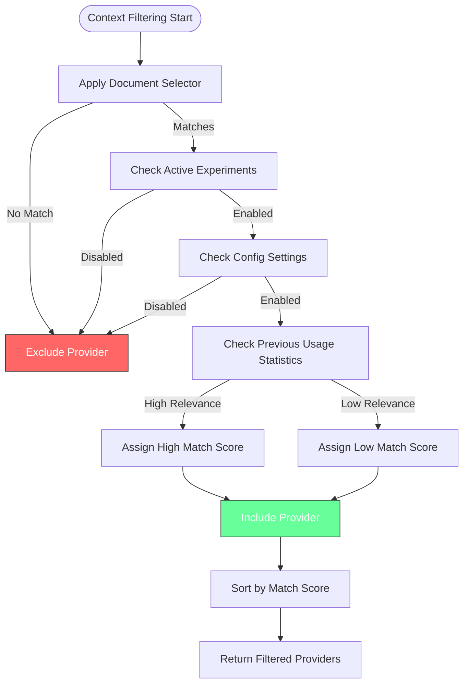

# Language Context Provider

<cite>
**Referenced Files in This Document**   
- [languageContextProviderService.ts](file://src/extension/languageContextProvider/vscode-node/languageContextProviderService.ts)
- [languageContextProviderService.ts](file://src/platform/languageContextProvider/common/languageContextProviderService.ts)
- [nullLanguageContextProviderService.ts](file://src/platform/languageContextProvider/common/nullLanguageContextProviderService.ts)
- [languageContextService.ts](file://src/platform/languageServer/common/languageContextService.ts)
- [contextProviderRegistry.ts](file://src/extension/completions-core/vscode-node/lib/src/prompt/contextProviderRegistry.ts)
- [contextProviderRegistryMultiLanguage.ts](file://src/extension/completions-core/vscode-node/lib/src/prompt/contextProviderRegistryMultiLanguage.ts)
- [api.ts](file://src/platform/inlineCompletions/common/api.ts)
- [contextItemSchemas.ts](file://src/extension/completions-core/vscode-node/lib/src/prompt/contextProviders/contextItemSchemas.ts)
</cite>

## Table of Contents
1. [Introduction](#introduction)
2. [Architecture Overview](#architecture-overview)
3. [Core Components](#core-components)
4. [Data Flow and Context Provision](#data-flow-and-context-provision)
5. [Configuration and Performance](#configuration-and-performance)
6. [Error Handling](#error-handling)
7. [Integration with VS Code Language Services](#integration-with-vs-code-language-services)
8. [Context Sensitivity and Filtering](#context-sensitivity-and-filtering)
9. [Examples and Use Cases](#examples-and-use-cases)
10. [Troubleshooting Guide](#troubleshooting-guide)

## Introduction

The Language Context Provider in GitHub Copilot Chat is a critical service that enables intelligent code suggestions by analyzing the current code context, including syntax, semantics, and project structure. This service extracts relevant information from the codebase to enhance AI responses with accurate contextual understanding. The provider acts as a bridge between the code editor's language services and the AI language model, ensuring that code suggestions are contextually relevant and semantically accurate.

The Language Context Provider operates by registering context providers that can supply different types of contextual information based on the current document and cursor position. These context providers are responsible for extracting code snippets, traits, and other relevant information that can inform the AI model's responses. The service integrates with VS Code's language services to understand the programming language being used and to extract language-specific context.

**Section sources**
- [languageContextProviderService.ts](file://src/extension/languageContextProvider/vscode-node/languageContextProviderService.ts#L1-L120)
- [api.ts](file://src/platform/inlineCompletions/common/api.ts#L1-L205)

## Architecture Overview

The Language Context Provider follows a modular architecture with clear separation of concerns between the interface definition, implementation, and integration layers. The core architecture consists of service interfaces, concrete implementations, and registry systems that manage the lifecycle of context providers.


**Diagram sources**
- [languageContextProviderService.ts](file://src/platform/languageContextProvider/common/languageContextProviderService.ts#L1-L26)
- [languageContextProviderService.ts](file://src/extension/languageContextProvider/vscode-node/languageContextProviderService.ts#L1-L120)
- [contextProviderRegistry.ts](file://src/extension/completions-core/vscode-node/lib/src/prompt/contextProviderRegistry.ts#L1-L547)

## Core Components

The Language Context Provider system consists of several core components that work together to provide contextual information to the AI model. The primary components include the service interface, concrete implementations, context item types, and the registry system.

The `ILanguageContextProviderService` interface defines the contract for the context provider service, specifying methods for registering providers, retrieving providers for a document, and getting context items. This interface is implemented by the `LanguageContextProviderService` class, which maintains a collection of registered context providers and manages their lifecycle.

The system supports two types of context items: snippets and traits. Snippets represent code extracted from source files, while traits represent key-value pairs that describe characteristics of the code or environment. These context items are converted to a standardized format that can be consumed by the language model.


**Diagram sources**
- [languageContextProviderService.ts](file://src/platform/languageContextProvider/common/languageContextProviderService.ts#L1-L26)
- [languageContextProviderService.ts](file://src/extension/languageContextProvider/vscode-node/languageContextProviderService.ts#L1-L120)
- [languageContextService.ts](file://src/platform/languageServer/common/languageContextService.ts#L1-L200)

**Section sources**
- [languageContextProviderService.ts](file://src/extension/languageContextProvider/vscode-node/languageContextProviderService.ts#L1-L120)
- [languageContextService.ts](file://src/platform/languageServer/common/languageContextService.ts#L1-L200)

## Data Flow and Context Provision

The data flow in the Language Context Provider follows a well-defined sequence from code analysis to context provision for language model requests. When a user requests code suggestions, the system initiates a context retrieval process that involves multiple stages of filtering, resolution, and transformation.

The process begins with the `getContextItems` method, which identifies relevant context providers based on the current document's language and content. The system then invokes each provider's resolver function, passing a request object that contains information about the completion context, time budget, and cancellation token. Providers return context items asynchronously, which are then converted to the standardized format used by the language model.

For performance optimization, the system implements a timeout mechanism through the `getContextItemsOnTimeout` method. If a provider takes too long to respond, the system can fall back to cached or pre-computed context items to ensure timely responses. This dual-path approach balances accuracy with responsiveness.


**Diagram sources**
- [languageContextProviderService.ts](file://src/extension/languageContextProvider/vscode-node/languageContextProviderService.ts#L43-L117)
- [contextProviderRegistry.ts](file://src/extension/completions-core/vscode-node/lib/src/prompt/contextProviderRegistry.ts#L126-L318)

## Configuration and Performance

The Language Context Provider includes several configuration options and performance optimizations to handle large codebases efficiently. The system provides configurable parameters for context sensitivity, time budgets, and caching strategies to balance quality and responsiveness.

Configuration options are exposed through the `MultiLanguageContextProviderParams` interface, which defines parameters such as maximum context items, maximum symbol matches, and import inclusion. These parameters can be controlled through feature flags and experiment configurations, allowing for A/B testing and gradual rollout of new behaviors.

For performance optimization, the system implements a multi-layered approach. The `CachedContextProviderRegistry` wraps the core registry with an LRU cache to avoid redundant context retrieval for the same completion request. The system also enforces time budgets for context providers, canceling long-running operations to maintain responsiveness. Additionally, the context provider registry supports filtering based on active experiments and configuration settings to reduce the number of providers that need to be queried.


**Diagram sources**
- [contextProviderRegistry.ts](file://src/extension/completions-core/vscode-node/lib/src/prompt/contextProviderRegistry.ts#L201-L212)
- [contextProviderRegistryMultiLanguage.ts](file://src/extension/completions-core/vscode-node/lib/src/prompt/contextProviderRegistryMultiLanguage.ts#L17-L37)
- [contextProviderRegistry.ts](file://src/extension/completions-core/vscode-node/lib/src/prompt/contextProviderRegistry.ts#L379-L428)

**Section sources**
- [contextProviderRegistry.ts](file://src/extension/completions-core/vscode-node/lib/src/prompt/contextProviderRegistry.ts#L1-L547)
- [contextProviderRegistryMultiLanguage.ts](file://src/extension/completions-core/vscode-node/lib/src/prompt/contextProviderRegistryMultiLanguage.ts#L1-L106)

## Error Handling

The Language Context Provider implements comprehensive error handling to ensure robust operation even when individual context providers fail. The system follows a fail-fast approach for provider registration while maintaining resilience during context retrieval.

When a context provider throws an error during resolution, the system captures the error and continues processing other providers. This ensures that a single failing provider does not prevent the system from providing context from other sources. Errors are logged with appropriate severity levels, and detailed error information is captured for telemetry and debugging purposes.

The system also handles cancellation scenarios gracefully. When a request is cancelled (either through explicit cancellation or timeout), the system ensures proper cleanup of resources and prevents orphaned operations. The `resolveAll` function used in the context provider registry handles both successful resolutions and errors uniformly, allowing the system to collect partial results even when some providers fail.


**Diagram sources**
- [contextProviderRegistry.ts](file://src/extension/completions-core/vscode-node/lib/src/prompt/contextProviderRegistry.ts#L251-L255)
- [contextProviderRegistry.ts](file://src/extension/completions-core/vscode-node/lib/src/prompt/contextProviderRegistry.ts#L269-L289)
- [contextProviderRegistry.ts](file://src/extension/completions-core/vscode-node/lib/src/prompt/contextProviderRegistry.ts#L291-L297)

**Section sources**
- [contextProviderRegistry.ts](file://src/extension/completions-core/vscode-node/lib/src/prompt/contextProviderRegistry.ts#L1-L547)
- [contextItemSchemas.ts](file://src/extension/completions-core/vscode-node/lib/src/prompt/contextProviders/contextItemSchemas.ts#L1-L150)

## Integration with VS Code Language Services

The Language Context Provider integrates deeply with VS Code's language services to provide accurate and relevant context information. The integration is achieved through the use of document selectors, which allow context providers to specify the programming languages and file types they support.

The system leverages VS Code's language detection capabilities to match context providers to the current document. When a document is opened or the cursor moves to a different position, the system queries the language services to determine the appropriate context providers to invoke. This ensures that language-specific context providers are only activated when relevant.

The integration also includes support for VS Code's extension API, allowing third-party extensions to register their own context providers. The `VSCodeContextProviderApiV1` class exposes the context provider functionality through the extension API, enabling other extensions to contribute context information to the AI model.

```mermaid
graph TB
subgraph "VS Code Platform"
LanguageService["VS Code Language Service"]
ExtensionAPI["VS Code Extension API"]
DocumentManager["Document Manager"]
end
subgraph "Copilot Context System"
ContextProviderService["LanguageContextProviderService"]
VSCodeContextApi["VSCodeContextProviderApiV1"]
ProviderRegistry["ContextProviderRegistry"]
end
LanguageService --> |Provides languageId| DocumentManager
DocumentManager --> |Triggers on document change| ContextProviderService
ContextProviderService --> |Uses| LanguageService : "languages.match()"
ExtensionAPI --> |Exposes| VSCodeContextApi
VSCodeContextApi --> |Implements| ContextProviderService
ContextProviderService --> |Manages| ProviderRegistry
style LanguageService fill:#6f9,stroke:#333
style ContextProviderService fill:#bbf,stroke:#333
style VSCodeContextApi fill:#f96,stroke:#333
```

**Diagram sources**
- [languageContextProviderService.ts](file://src/extension/languageContextProvider/vscode-node/languageContextProviderService.ts#L34-L36)
- [extensionApi.ts](file://src/extension/api/vscode/extensionApi.ts#L7-L29)
- [vscodeContextProviderApi.ts](file://src/extension/api/vscode/vscodeContextProviderApi.ts#L7-L13)

## Context Sensitivity and Filtering

The Language Context Provider implements sophisticated context sensitivity and filtering mechanisms to ensure that only relevant information is provided to the AI model. The system uses a multi-stage filtering process that considers language, content relevance, and user preferences.

The filtering process begins with document selector matching, which determines which context providers are applicable to the current document based on language and file type. Providers that don't match the document selector are excluded from consideration. This initial filtering reduces the number of providers that need to be queried.

Additional filtering is applied based on active experiments, configuration settings, and previous usage statistics. The system can prioritize providers based on their historical effectiveness and relevance to the current context. The `matchProviders` function in the context provider registry calculates a match score for each provider, which is used to sort and prioritize the results.



**Diagram sources**
- [contextProviderRegistry.ts](file://src/extension/completions-core/vscode-node/lib/src/prompt/contextProviderRegistry.ts#L320-L339)
- [contextProviderRegistry.ts](file://src/extension/completions-core/vscode-node/lib/src/prompt/contextProviderRegistry.ts#L507-L521)
- [contextProviderRegistry.ts](file://src/extension/completions-core/vscode-node/lib/src/prompt/contextProviderRegistry.ts#L148-L150)

## Examples and Use Cases

The Language Context Provider enables several key use cases that enhance the AI's ability to provide relevant code suggestions. These use cases demonstrate how context information improves the quality and accuracy of code completions.

One primary use case is cross-file context awareness, where the system can reference code from other files in the project when generating suggestions. For example, when working with a class that inherits from a base class in another file, the context provider can include the base class definition in the context, allowing the AI to understand the inheritance structure and generate appropriate method overrides.

Another use case is framework-specific context, where the system can provide framework-specific information such as component hierarchies, routing configurations, or database schema details. This allows the AI to generate code that follows the conventions and patterns of the specific framework being used.

The system also supports trait-based context, where metadata about the code or environment can influence suggestions. For example, if the current file is part of a test suite, the context provider can include traits indicating this, prompting the AI to generate test-appropriate code with proper assertions and test structure.


**Diagram sources**
- [languageContextProviderService.ts](file://src/extension/languageContextProvider/vscode-node/languageContextProviderService.ts#L74-L93)
- [languageContextService.ts](file://src/platform/languageServer/common/languageContextService.ts#L20-L81)
- [api.ts](file://src/platform/inlineCompletions/common/api.ts#L188-L202)

## Troubleshooting Guide

When encountering issues with the Language Context Provider, several common problems and their solutions should be considered. The most frequent issues relate to context providers not being registered, context items not being properly formatted, or performance problems with large codebases.

If context providers are not being recognized, verify that they are properly registered through the `registerContextProvider` method and that their document selectors match the current file type. Check the extension's activation events to ensure the extension is activated when needed.

For context items that are not appearing in suggestions, verify that they conform to the required schema (either Trait or CodeSnippet) and that required fields like `uri` for snippets or `name` and `value` for traits are present. The system filters out invalid context items, so schema compliance is essential.

Performance issues can often be addressed by reviewing the time budget configuration and ensuring that context providers complete their work within the allocated time. Use the `resolveOnTimeout` method to provide fallback context when the primary resolution takes too long. For large codebases, consider implementing caching strategies or limiting the scope of context retrieval.

**Section sources**
- [contextItemSchemas.ts](file://src/extension/completions-core/vscode-node/lib/src/prompt/contextProviders/contextItemSchemas.ts#L1-L150)
- [contextProviderRegistry.ts](file://src/extension/completions-core/vscode-node/lib/src/prompt/contextProviderRegistry.ts#L291-L297)
- [languageContextProviderService.ts](file://src/extension/languageContextProvider/vscode-node/languageContextProviderService.ts#L107-L117)