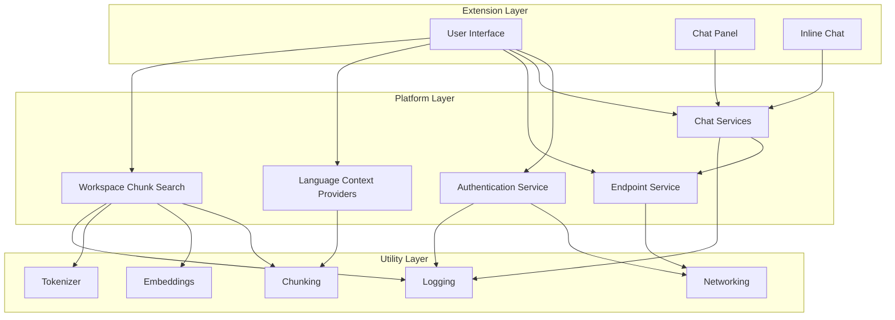
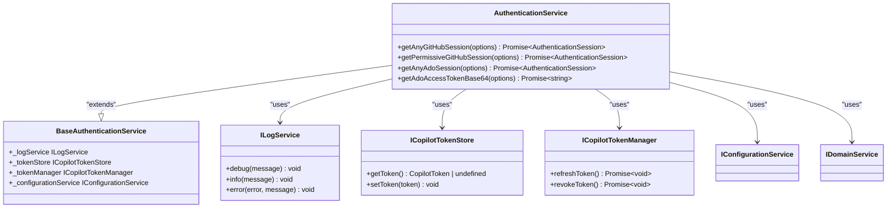
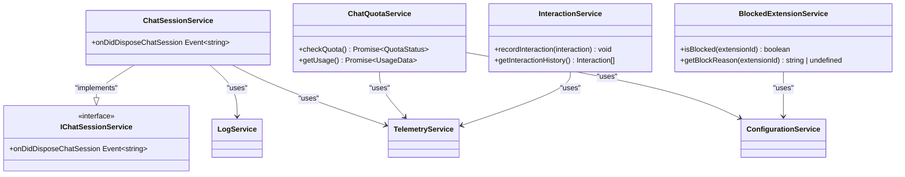
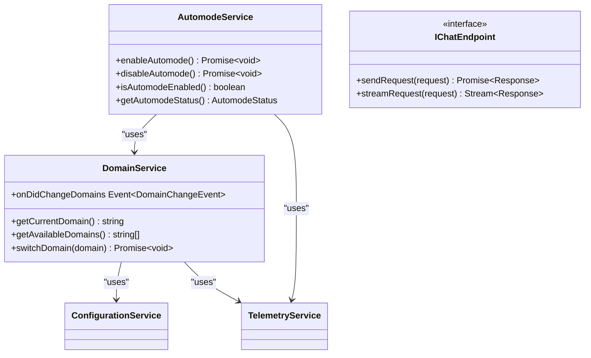
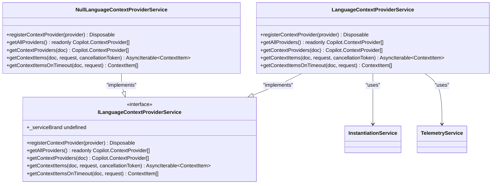

# Platform Layer

<cite>
**Referenced Files in This Document**   
- [authenticationService.ts](file://src/platform/authentication/vscode-node/authenticationService.ts)
- [languageContextProviderService.ts](file://src/platform/languageContextProvider/common/languageContextProviderService.ts)
- [workspaceChunkSearchService.ts](file://src/platform/workspaceChunkSearch/node/workspaceChunkSearchService.ts)
- [chatSessionService.ts](file://src/platform/chat/common/chatSessionService.ts)
- [endpointService.ts](file://src/platform/endpoint/common/automodeService.ts)
</cite>

## Table of Contents
1. [Introduction](#introduction)
2. [Architecture Overview](#architecture-overview)
3. [Core Components](#core-components)
4. [Authentication Service](#authentication-service)
5. [Chat Services](#chat-services)
6. [Endpoint Integration](#endpoint-integration)
7. [Language Context Providers](#language-context-providers)
8. [Workspace Chunk Search](#workspace-chunk-search)
9. [Service Pattern and Code Separation](#service-pattern-and-code-separation)
10. [Cross-Cutting Concerns](#cross-cutting-concerns)

## Introduction
The Platform Layer in GitHub Copilot Chat serves as the shared services layer that provides common functionality across the extension. This layer abstracts complex operations such as AI model communication, authentication flows, and codebase indexing, offering a consistent interface to higher-level components. The platform layer follows a services pattern where each service provides specific capabilities while maintaining separation between platform-specific code (vscode-node, vscode) and common code. This documentation details the component breakdown, interaction patterns, and architectural principles that enable the platform layer to deliver robust AI-powered features.

## Architecture Overview

**Diagram sources**
- [authenticationService.ts](file://src/platform/authentication/vscode-node/authenticationService.ts)
- [chatSessionService.ts](file://src/platform/chat/common/chatSessionService.ts)
- [workspaceChunkSearchService.ts](file://src/platform/workspaceChunkSearch/node/workspaceChunkSearchService.ts)

**Section sources**
- [authenticationService.ts](file://src/platform/authentication/vscode-node/authenticationService.ts)
- [chatSessionService.ts](file://src/platform/chat/common/chatSessionService.ts)
- [workspaceChunkSearchService.ts](file://src/platform/workspaceChunkSearch/node/workspaceChunkSearchService.ts)

## Core Components
The Platform Layer consists of several key components that provide essential services to the GitHub Copilot Chat extension. These components are designed to be reusable across different parts of the application while maintaining clear separation of concerns. The core components include authentication services for user identity and token management, chat services for conversation management and quota handling, endpoint services for language model integration, language context providers for code understanding, and workspace chunk search for codebase analysis. Each component follows a service-oriented architecture with well-defined interfaces and implementations.

**Section sources**
- [authenticationService.ts](file://src/platform/authentication/vscode-node/authenticationService.ts)
- [chatSessionService.ts](file://src/platform/chat/common/chatSessionService.ts)
- [workspaceChunkSearchService.ts](file://src/platform/workspaceChunkSearch/node/workspaceChunkSearchService.ts)

## Authentication Service

**Diagram sources**
- [authenticationService.ts](file://src/platform/authentication/vscode-node/authenticationService.ts)

**Section sources**
- [authenticationService.ts](file://src/platform/authentication/vscode-node/authenticationService.ts)

## Chat Services

**Diagram sources**
- [chatSessionService.ts](file://src/platform/chat/common/chatSessionService.ts)

**Section sources**
- [chatSessionService.ts](file://src/platform/chat/common/chatSessionService.ts)

## Endpoint Integration

**Diagram sources**
- [automodeService.ts](file://src/platform/endpoint/common/automodeService.ts)

**Section sources**
- [automodeService.ts](file://src/platform/endpoint/common/automodeService.ts)

## Language Context Providers

**Diagram sources**
- [languageContextProviderService.ts](file://src/platform/languageContextProvider/common/languageContextProviderService.ts)

**Section sources**
- [languageContextProviderService.ts](file://src/platform/languageContextProvider/common/languageContextProviderService.ts)

## Workspace Chunk Search

```mermaid
classDiagram
class WorkspaceChunkSearchService {
+onDidChangeIndexState Event~void~
+getIndexState() Promise~WorkspaceIndexState~
+hasFastSearch(sizing) Promise~boolean~
+searchFileChunks(sizing, query, options, telemetryInfo, progress, token) Promise~WorkspaceChunkSearchResult~
+triggerLocalIndexing(trigger, telemetryInfo) Promise~Result~true, TriggerIndexingError~~
+triggerRemoteIndexing(trigger, telemetryInfo) Promise~Result~true, TriggerIndexingError~~
}
class IWorkspaceChunkSearchService {
<<interface>>
+_serviceBrand undefined
+onDidChangeIndexState Event~void~
+getIndexState() Promise~WorkspaceIndexState~
+hasFastSearch(sizing) Promise~boolean~
+searchFileChunks(sizing, query, options, telemetryInfo, progress, token) Promise~WorkspaceChunkSearchResult~
+triggerLocalIndexing(trigger, telemetryInfo) Promise~Result~true, TriggerIndexingError~~
+triggerRemoteIndexing(trigger, telemetryInfo) Promise~Result~true, TriggerIndexingError~~
}
class WorkspaceChunkSearchServiceImpl {
+_embeddingsIndex WorkspaceChunkEmbeddingsIndex
+_embeddingsChunkSearch EmbeddingsChunkSearch
+_fullWorkspaceChunkSearch FullWorkspaceChunkSearch
+_codeSearchChunkSearch CodeSearchChunkSearch
+_tfidfChunkSearch TfidfChunkSearch
+_tfIdfWithSemanticChunkSearch TfIdfWithSemanticChunkSearch
}
class IWorkspaceChunkSearchStrategy {
<<interface>>
+id WorkspaceChunkSearchStrategyId
+searchWorkspace(sizing, query, options, telemetryInfo, token) Promise~StrategySearchResult~
+prepareSearchWorkspace?(telemetryInfo, token) Promise~void~
+onDidChangeIndexState? Event~void~
}
WorkspaceChunkSearchService --|> IWorkspaceChunkSearchService : "implements"
WorkspaceChunkSearchService --> WorkspaceChunkSearchServiceImpl : "delegates"
WorkspaceChunkSearchServiceImpl --> WorkspaceChunkEmbeddingsIndex : "uses"
WorkspaceChunkSearchServiceImpl --> EmbeddingsChunkSearch : "uses"
WorkspaceChunkSearchServiceImpl --> FullWorkspaceChunkSearch : "uses"
WorkspaceChunkSearchServiceImpl --> CodeSearchChunkSearch : "uses"
WorkspaceChunkSearchServiceImpl --> TfidfChunkSearch : "uses"
WorkspaceChunkSearchServiceImpl --> TfIdfWithSemanticChunkSearch : "uses"
WorkspaceChunkSearchServiceImpl --> IAuthenticationChatUpgradeService : "uses"
WorkspaceChunkSearchServiceImpl --> IEmbeddingsComputer : "uses"
WorkspaceChunkSearchServiceImpl --> IExperimentationService : "uses"
WorkspaceChunkSearchServiceImpl --> IIgnoreService : "uses"
WorkspaceChunkSearchServiceImpl --> ILogService : "uses"
WorkspaceChunkSearchServiceImpl --> IRerankerService : "uses"
WorkspaceChunkSearchServiceImpl --> ISimulationTestContext : "uses"
WorkspaceChunkSearchServiceImpl --> ITelemetryService : "uses"
WorkspaceChunkSearchServiceImpl --> IVSCodeExtensionContext : "uses"
WorkspaceChunkSearchServiceImpl --> IWorkspaceService : "uses"
WorkspaceChunkSearchServiceImpl --> IWorkspaceFileIndex : "uses"
```

**Diagram sources**
- [workspaceChunkSearchService.ts](file://src/platform/workspaceChunkSearch/node/workspaceChunkSearchService.ts)

**Section sources**
- [workspaceChunkSearchService.ts](file://src/platform/workspaceChunkSearch/node/workspaceChunkSearchService.ts)

## Service Pattern and Code Separation
The Platform Layer employs a services pattern to provide shared functionality across the extension. Each service is implemented as a class that implements a corresponding interface, following the dependency inversion principle. The architecture separates platform-specific code from common code through a directory structure that organizes files into common, vscode, and vscode-node subdirectories. The common directory contains shared interfaces and base implementations, while the platform-specific directories contain implementations that depend on the specific runtime environment. This separation allows for code reuse while accommodating platform-specific requirements. Services are registered with the dependency injection container and can be injected into components that require their functionality. The service pattern enables loose coupling between components and facilitates testing through dependency injection.

**Section sources**
- [authenticationService.ts](file://src/platform/authentication/vscode-node/authenticationService.ts)
- [chatSessionService.ts](file://src/platform/chat/common/chatSessionService.ts)
- [workspaceChunkSearchService.ts](file://src/platform/workspaceChunkSearch/node/workspaceChunkSearchService.ts)

## Cross-Cutting Concerns
The Platform Layer addresses several cross-cutting concerns including service lifecycle management, error handling, and performance optimization for network operations. Service lifecycle is managed through the Disposable pattern, where services implement cleanup logic in their dispose methods. Error handling is standardized across services with consistent error reporting and telemetry. Network operations are optimized through caching, batching, and intelligent fallback strategies. The workspace chunk search service, for example, implements multiple search strategies with fallback mechanisms to ensure responsiveness even when primary search methods are unavailable. Telemetry is integrated throughout the platform layer to monitor performance and usage patterns. Configuration management is handled through a centralized configuration service that provides access to user settings and feature flags. These cross-cutting concerns are implemented in a consistent manner across all platform services to ensure reliability and maintainability.

**Section sources**
- [workspaceChunkSearchService.ts](file://src/platform/workspaceChunkSearch/node/workspaceChunkSearchService.ts)
- [authenticationService.ts](file://src/platform/authentication/vscode-node/authenticationService.ts)
- [chatSessionService.ts](file://src/platform/chat/common/chatSessionService.ts)