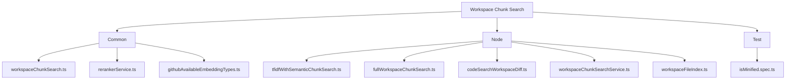
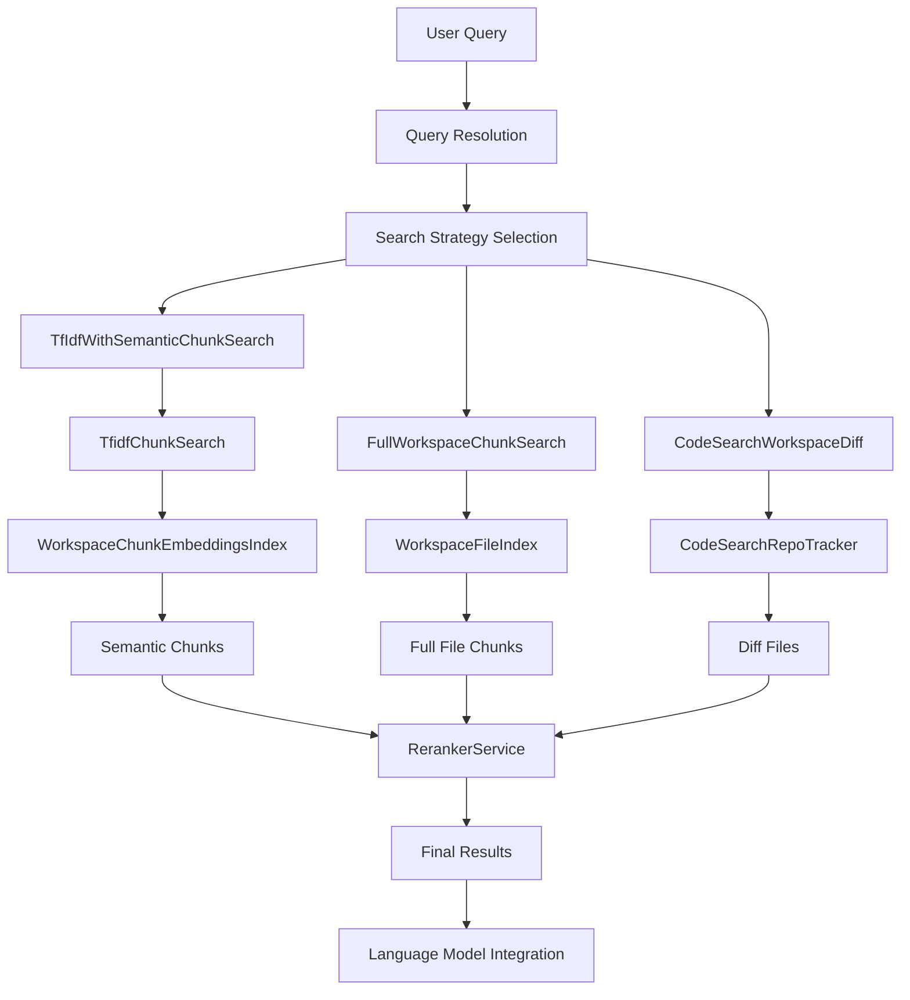
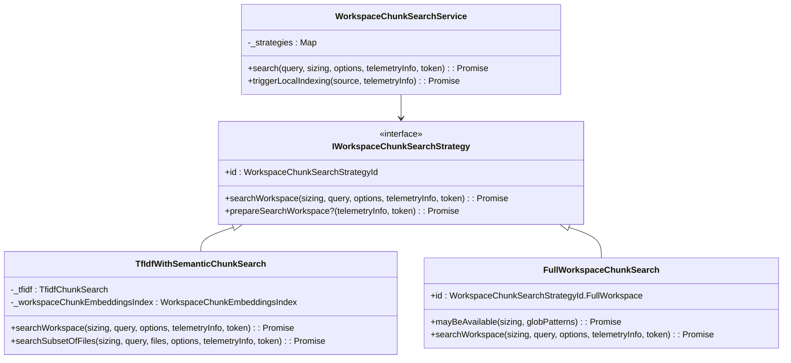
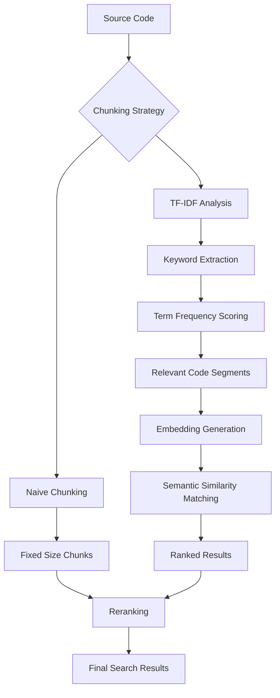
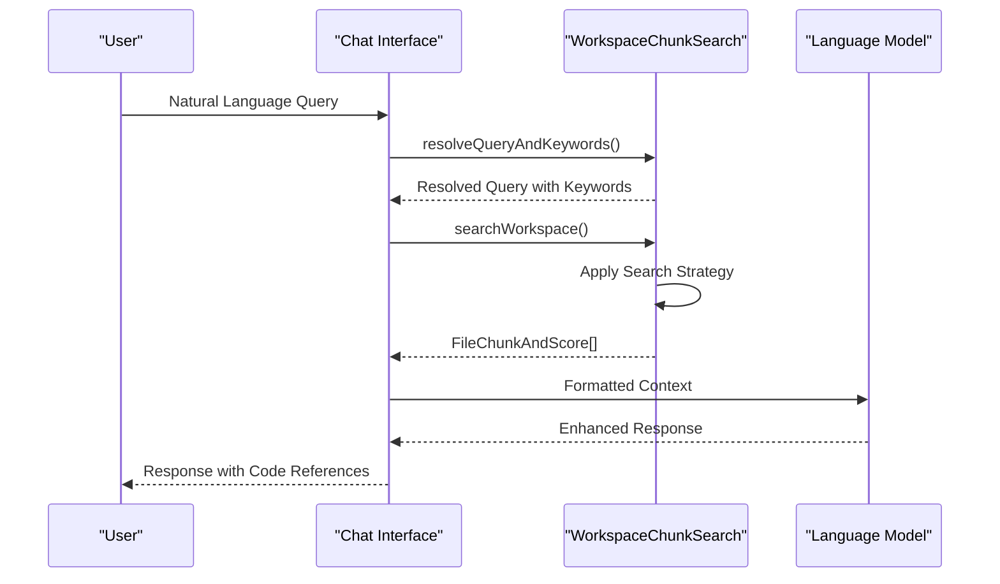
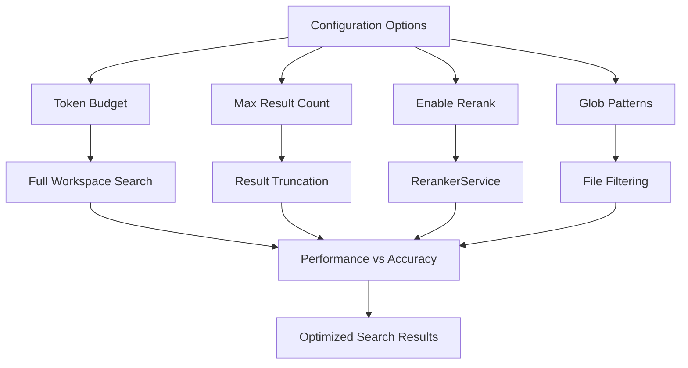
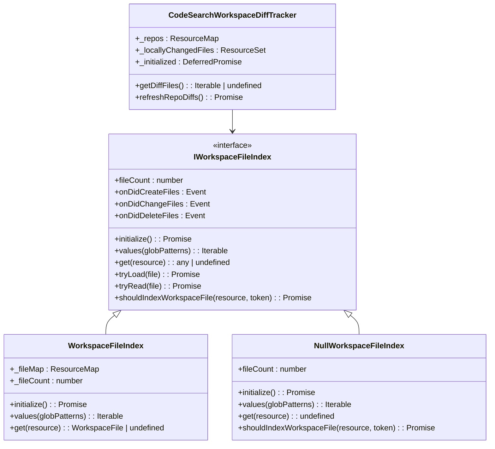
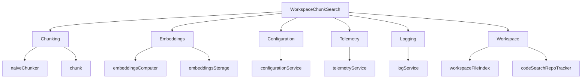

# Workspace Chunk Search

<cite>
**Referenced Files in This Document**   
- [workspaceChunkSearch.ts](file://src/platform/workspaceChunkSearch/common/workspaceChunkSearch.ts)
- [tfidfWithSemanticChunkSearch.ts](file://src/platform/workspaceChunkSearch/node/tfidfWithSemanticChunkSearch.ts)
- [fullWorkspaceChunkSearch.ts](file://src/platform/workspaceChunkSearch/node/fullWorkspaceChunkSearch.ts)
- [codeSearchWorkspaceDiff.ts](file://src/platform/workspaceChunkSearch/node/codeSearchWorkspaceDiff.ts)
- [chunk.ts](file://src/platform/chunking/common/chunk.ts)
- [naiveChunker.ts](file://src/platform/chunking/node/naiveChunker.ts)
- [embeddingsComputer.ts](file://src/platform/embeddings/common/embeddingsComputer.ts)
- [workspaceChunkSearchService.ts](file://src/platform/workspaceChunkSearch/node/workspaceChunkSearchService.ts)
- [workspaceFileIndex.ts](file://src/platform/workspaceChunkSearch/node/workspaceFileIndex.ts)
- [rerankerService.ts](file://src/platform/workspaceChunkSearch/common/rerankerService.ts)
</cite>

## Table of Contents
1. [Introduction](#introduction)
2. [Project Structure](#project-structure)
3. [Core Components](#core-components)
4. [Architecture Overview](#architecture-overview)
5. [Detailed Component Analysis](#detailed-component-analysis)
6. [Dependency Analysis](#dependency-analysis)
7. [Performance Considerations](#performance-considerations)
8. [Troubleshooting Guide](#troubleshooting-guide)
9. [Conclusion](#conclusion)

## Introduction
The Workspace Chunk Search service in GitHub Copilot Chat enables natural language search across the codebase by breaking code into searchable chunks and applying semantic indexing. This service plays a critical role in providing relevant code references in responses by intelligently indexing and retrieving code snippets based on user queries. The implementation combines multiple search strategies including naive chunking, TF-IDF with semantic search, and full workspace search, allowing for flexible trade-offs between accuracy and performance. The service integrates with the language model to enhance code understanding and retrieval, while providing configuration options for search sensitivity and performance tuning.

## Project Structure

**Diagram sources**
- [workspaceChunkSearch.ts](file://src/platform/workspaceChunkSearch/common/workspaceChunkSearch.ts)
- [tfidfWithSemanticChunkSearch.ts](file://src/platform/workspaceChunkSearch/node/tfidfWithSemanticChunkSearch.ts)
- [fullWorkspaceChunkSearch.ts](file://src/platform/workspaceChunkSearch/node/fullWorkspaceChunkSearch.ts)

**Section sources**
- [workspaceChunkSearch.ts](file://src/platform/workspaceChunkSearch/common/workspaceChunkSearch.ts)
- [tfidfWithSemanticChunkSearch.ts](file://src/platform/workspaceChunkSearch/node/tfidfWithSemanticChunkSearch.ts)
- [fullWorkspaceChunkSearch.ts](file://src/platform/workspaceChunkSearch/node/fullWorkspaceChunkSearch.ts)

## Core Components

The Workspace Chunk Search service consists of several core components that work together to enable efficient and accurate code search. The service implements multiple search strategies through the `IWorkspaceChunkSearchStrategy` interface, allowing for different approaches based on the context and requirements. The main strategies include TF-IDF with semantic chunking, full workspace search, and code search with workspace diff tracking. These strategies are coordinated through the `WorkspaceChunkSearchService` which manages the selection and execution of appropriate search methods based on configuration and workspace conditions.

**Section sources**
- [workspaceChunkSearch.ts](file://src/platform/workspaceChunkSearch/common/workspaceChunkSearch.ts)
- [workspaceChunkSearchService.ts](file://src/platform/workspaceChunkSearch/node/workspaceChunkSearchService.ts)

## Architecture Overview

**Diagram sources**
- [workspaceChunkSearch.ts](file://src/platform/workspaceChunkSearch/common/workspaceChunkSearch.ts)
- [tfidfWithSemanticChunkSearch.ts](file://src/platform/workspaceChunkSearch/node/tfidfWithSemanticChunkSearch.ts)
- [fullWorkspaceChunkSearch.ts](file://src/platform/workspaceChunkSearch/node/fullWorkspaceChunkSearch.ts)
- [codeSearchWorkspaceDiff.ts](file://src/platform/workspaceChunkSearch/node/codeSearchWorkspaceDiff.ts)
- [rerankerService.ts](file://src/platform/workspaceChunkSearch/common/rerankerService.ts)

## Detailed Component Analysis

### Chunking Strategy Implementation

The Workspace Chunk Search service implements a sophisticated chunking strategy that combines multiple approaches to balance accuracy and performance. The primary implementation uses TF-IDF (Term Frequency-Inverse Document Frequency) to identify relevant code segments, which are then enhanced with semantic embeddings for more accurate matching.

**Diagram sources**
- [workspaceChunkSearch.ts](file://src/platform/workspaceChunkSearch/common/workspaceChunkSearch.ts)
- [tfidfWithSemanticChunkSearch.ts](file://src/platform/workspaceChunkSearch/node/tfidfWithSemanticChunkSearch.ts)
- [fullWorkspaceChunkSearch.ts](file://src/platform/workspaceChunkSearch/node/fullWorkspaceChunkSearch.ts)
- [workspaceChunkSearchService.ts](file://src/platform/workspaceChunkSearch/node/workspaceChunkSearchService.ts)

**Section sources**
- [workspaceChunkSearch.ts](file://src/platform/workspaceChunkSearch/common/workspaceChunkSearch.ts)
- [tfidfWithSemanticChunkSearch.ts](file://src/platform/workspaceChunkSearch/node/tfidfWithSemanticChunkSearch.ts)
- [fullWorkspaceChunkSearch.ts](file://src/platform/workspaceChunkSearch/node/fullWorkspaceChunkSearch.ts)

### Naive Chunking and TF-IDF with Semantic Search

The service implements both naive chunking and advanced TF-IDF with semantic search strategies. The naive chunking approach divides code into fixed-size chunks, while the TF-IDF approach uses term frequency analysis to identify important code segments. The semantic search component enhances these results by applying embeddings to capture the meaning of code beyond simple keyword matching.

**Diagram sources**
- [chunk.ts](file://src/platform/chunking/common/chunk.ts)
- [naiveChunker.ts](file://src/platform/chunking/node/naiveChunker.ts)
- [embeddingsComputer.ts](file://src/platform/embeddings/common/embeddingsComputer.ts)
- [workspaceChunkSearch.ts](file://src/platform/workspaceChunkSearch/common/workspaceChunkSearch.ts)

**Section sources**
- [naiveChunker.ts](file://src/platform/chunking/node/naiveChunker.ts)
- [chunk.ts](file://src/platform/chunking/common/chunk.ts)
- [embeddingsComputer.ts](file://src/platform/embeddings/common/embeddingsComputer.ts)

### Integration with Language Model

The Workspace Chunk Search service integrates closely with the language model to provide relevant code references in responses. This integration occurs through the query resolution and result ranking processes, where the search results are formatted and prioritized for optimal use by the language model.

**Diagram sources**
- [workspaceChunkSearch.ts](file://src/platform/workspaceChunkSearch/common/workspaceChunkSearch.ts)
- [workspaceChunkSearchService.ts](file://src/platform/workspaceChunkSearch/node/workspaceChunkSearchService.ts)

**Section sources**
- [workspaceChunkSearch.ts](file://src/platform/workspaceChunkSearch/common/workspaceChunkSearch.ts)
- [workspaceChunkSearchService.ts](file://src/platform/workspaceChunkSearch/node/workspaceChunkSearchService.ts)

### Configuration Options and Performance Trade-offs

The service provides several configuration options that allow users to balance search accuracy and performance. These include token budget limits, result count hints, and strategy-specific settings that control the behavior of different search approaches.

**Diagram sources**
- [workspaceChunkSearch.ts](file://src/platform/workspaceChunkSearch/common/workspaceChunkSearch.ts)
- [fullWorkspaceChunkSearch.ts](file://src/platform/workspaceChunkSearch/node/fullWorkspaceChunkSearch.ts)
- [rerankerService.ts](file://src/platform/workspaceChunkSearch/common/rerankerService.ts)

**Section sources**
- [workspaceChunkSearch.ts](file://src/platform/workspaceChunkSearch/common/workspaceChunkSearch.ts)
- [fullWorkspaceChunkSearch.ts](file://src/platform/workspaceChunkSearch/node/fullWorkspaceChunkSearch.ts)

### Workspace Service Integration and Caching

The service interacts with the workspace service for file access and implements caching mechanisms to improve search performance. The `WorkspaceFileIndex` component provides efficient access to workspace files, while various caching strategies are employed to avoid redundant computations.

**Diagram sources**
- [workspaceFileIndex.ts](file://src/platform/workspaceChunkSearch/node/workspaceFileIndex.ts)
- [codeSearchWorkspaceDiff.ts](file://src/platform/workspaceChunkSearch/node/codeSearchWorkspaceDiff.ts)
- [nullWorkspaceFileIndex.ts](file://src/platform/workspaceChunkSearch/node/nullWorkspaceFileIndex.ts)

**Section sources**
- [workspaceFileIndex.ts](file://src/platform/workspaceChunkSearch/node/workspaceFileIndex.ts)
- [codeSearchWorkspaceDiff.ts](file://src/platform/workspaceChunkSearch/node/codeSearchWorkspaceDiff.ts)

## Dependency Analysis

**Diagram sources**
- [workspaceChunkSearch.ts](file://src/platform/workspaceChunkSearch/common/workspaceChunkSearch.ts)
- [chunk.ts](file://src/platform/chunking/common/chunk.ts)
- [embeddingsComputer.ts](file://src/platform/embeddings/common/embeddingsComputer.ts)
- [workspaceFileIndex.ts](file://src/platform/workspaceChunkSearch/node/workspaceFileIndex.ts)

**Section sources**
- [workspaceChunkSearch.ts](file://src/platform/workspaceChunkSearch/common/workspaceChunkSearch.ts)
- [chunk.ts](file://src/platform/chunking/common/chunk.ts)
- [embeddingsComputer.ts](file://src/platform/embeddings/common/embeddingsComputer.ts)

## Performance Considerations

The Workspace Chunk Search service implements several performance optimizations to ensure responsive search capabilities even in large codebases. The full workspace search strategy includes an upper bound on file count (100 files) to prevent excessive resource usage. Token budgeting is used to control the amount of code included in search results, with separate budgets for full workspace search and regular search. The service also implements caching at multiple levels, including file content caching and search result caching, to minimize redundant operations. The TF-IDF with semantic search approach balances the speed of keyword-based search with the accuracy of semantic analysis, providing a good compromise between performance and relevance.

**Section sources**
- [fullWorkspaceChunkSearch.ts](file://src/platform/workspaceChunkSearch/node/fullWorkspaceChunkSearch.ts)
- [tfidfWithSemanticChunkSearch.ts](file://src/platform/workspaceChunkSearch/node/tfidfWithSemanticChunkSearch.ts)
- [workspaceFileIndex.ts](file://src/platform/workspaceChunkSearch/node/workspaceFileIndex.ts)

## Troubleshooting Guide

Common issues with the Workspace Chunk Search service include incomplete search coverage and performance bottlenecks. Incomplete coverage may occur when files are excluded by glob patterns or when the token budget is too restrictive. Performance issues can arise in large repositories where the full workspace search strategy is not viable. To address these issues, users can adjust configuration options such as token budgets and glob patterns. For performance bottlenecks, enabling the reranker service can improve result quality while maintaining acceptable response times. Monitoring telemetry data can help identify specific performance issues, such as long-running search operations or frequent cache misses.

**Section sources**
- [workspaceChunkSearch.ts](file://src/platform/workspaceChunkSearch/common/workspaceChunkSearch.ts)
- [fullWorkspaceChunkSearch.ts](file://src/platform/workspaceChunkSearch/node/fullWorkspaceChunkSearch.ts)
- [workspaceChunkSearchService.ts](file://src/platform/workspaceChunkSearch/node/workspaceChunkSearchService.ts)

## Conclusion

The Workspace Chunk Search service in GitHub Copilot Chat provides a robust foundation for natural language code search through its multi-strategy approach. By combining naive chunking, TF-IDF analysis, and semantic search with embeddings, the service delivers relevant code references while maintaining performance across different workspace sizes. The modular architecture allows for flexible configuration and extension, making it adaptable to various use cases and performance requirements. Integration with the language model enhances the overall chat experience by providing contextually relevant code snippets in responses. With proper configuration and understanding of the trade-offs between accuracy and performance, users can effectively leverage this service to navigate and understand codebases through natural language queries.