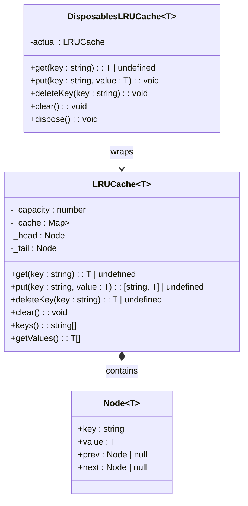
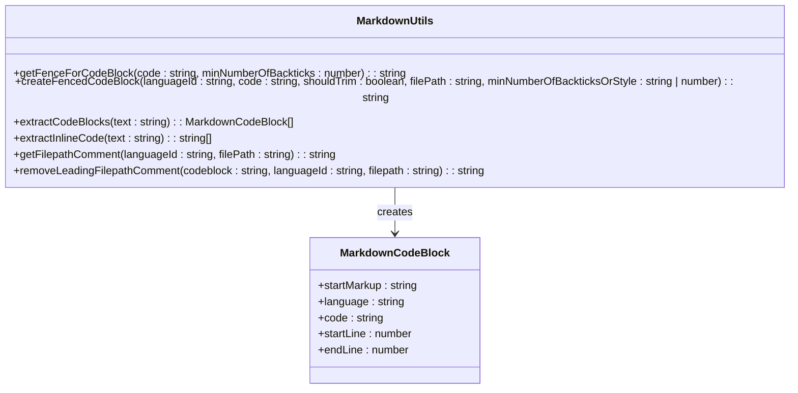

# Common Utilities

<cite>
**Referenced Files in This Document**   
- [async.ts](file://src/util/common/async.ts)
- [cache.ts](file://src/util/common/cache.ts)
- [debounce.ts](file://src/util/common/debounce.ts)
- [fileSystem.ts](file://src/util/common/fileSystem.ts)
- [glob.ts](file://src/util/common/glob.ts)
- [markdown.ts](file://src/util/common/markdown.ts)
- [arrays.ts](file://src/util/common/arrays.ts)
- [time.ts](file://src/util/common/time.ts)
- [types.ts](file://src/util/common/types.ts)
</cite>

## Table of Contents
1. [Introduction](#introduction)
2. [Async Utilities](#async-utilities)
3. [Caching Mechanisms](#caching-mechanisms)
4. [Debouncing Functions](#debouncing-functions)
5. [File System Operations](#file-system-operations)
6. [Glob Pattern Matching](#glob-pattern-matching)
7. [Markdown Processing](#markdown-processing)
8. [Additional Utility Functions](#additional-utility-functions)
9. [Integration and Usage Patterns](#integration-and-usage-patterns)
10. [Performance Considerations](#performance-considerations)
11. [Conclusion](#conclusion)

## Introduction
The Common Utilities sub-component of GitHub Copilot Chat provides a collection of shared utility functions that serve as foundational building blocks across both extension and platform layers. These utilities enable consistent behavior across different environments by offering standardized implementations for common programming patterns and operations. The utilities cover critical areas such as asynchronous operations management, caching strategies, debouncing mechanisms, file system operations, pattern matching, and markdown processing. This documentation provides a comprehensive analysis of these utilities, explaining their implementation details, interfaces, domain models, and usage patterns with concrete examples from the actual codebase. The utilities are designed to address common issues such as race conditions in async operations, cache invalidation strategies, and performance considerations for frequently called functions, making them essential components for both beginner and experienced developers working with the Copilot Chat system.

## Async Utilities

The async utilities provide robust mechanisms for managing asynchronous operations and task scheduling within the GitHub Copilot Chat system. The `TaskQueue` class implements a sequential task processing system that ensures tasks are executed in the order they were scheduled, preventing race conditions and maintaining predictable execution flow. This class uses a deferred promise pattern to manage task completion and provides methods for both strict scheduling (where skipped tasks result in cancellation errors) and lenient scheduling (where skipped tasks resolve to undefined). The `BatchedProcessor` utility optimizes performance by batching multiple requests together and processing them after a specified waiting period, reducing the number of individual operations and improving efficiency. Additionally, the `raceFilter` function enables selective resolution from multiple promises based on a filtering condition, allowing the system to respond to the first suitable result while maintaining control over the resolution criteria. These utilities are critical for managing the asynchronous nature of AI-powered code suggestions and chat interactions, ensuring smooth user experiences while maintaining system stability.

**Section sources**
- [async.ts](file://src/util/common/async.ts#L6-L156)

## Caching Mechanisms

The caching utilities implement a sophisticated LRU (Least Recently Used) cache mechanism that optimizes memory usage while maintaining quick access to frequently used data. The `LRUCache` class uses a combination of a Map and a doubly-linked list to achieve O(1) time complexity for both get and put operations, making it highly efficient for frequent cache access patterns. The implementation maintains a fixed capacity and automatically evicts the least recently used items when the cache reaches its limit, ensuring optimal memory utilization. Each cache operation updates the item's position in the linked list, with accessed items moved to the head (most recently used) and evicted items removed from the tail (least recently used). The `DisposablesLRUCache` extends this functionality by automatically disposing of cached items when they are evicted or when the cache is cleared, making it particularly useful for managing resources that require explicit cleanup. These caching mechanisms are essential for improving performance by reducing redundant computations and network requests, particularly in scenarios involving frequent access to language models, code snippets, and context information.

**Diagram sources**
- [cache.ts](file://src/util/common/cache.ts#L20-L194)

**Section sources**
- [cache.ts](file://src/util/common/cache.ts#L20-L194)

## Debouncing Functions

The debouncing utilities provide mechanisms to control the frequency of function execution, particularly important for handling rapid user interactions and preventing excessive processing. The `Debouncer` class implements trailing debouncing, ensuring that at most one call to `debounce` can be in progress at a time. When a new call is made, any pending operation is rejected, preventing race conditions and ensuring that only the most recent request is processed. This is particularly useful for scenarios like typing in a chat interface, where multiple rapid keystrokes should trigger only a single processing operation after the user pauses. The utility function `debounce` provides a convenient wrapper for synchronous functions, returning a promise-based version that automatically handles the debouncing logic. This implementation helps optimize performance by reducing unnecessary computations and network requests, while also improving the user experience by preventing overwhelming the system with rapid-fire requests. The debouncing mechanism is critical for maintaining responsiveness while managing resource-intensive operations like code analysis and AI inference.

**Section sources**
- [debounce.ts](file://src/util/common/debounce.ts#L6-L62)

## File System Operations

The file system utilities provide basic but essential functions for working with file paths and determining file characteristics. The primary function `looksLikeDirectory` determines whether a given file path likely represents a directory by checking for the presence of a file extension and comparing against a predefined list of well-known files that typically don't have extensions (such as Dockerfile, LICENSE, Makefile, README, etc.). This utility uses a regular expression to detect file extensions and performs a case-insensitive lookup against the list of extensionless files. This functionality is particularly important for proper file categorization and display in the user interface, ensuring that files like "Dockerfile" are correctly identified as files rather than directories. The implementation is simple but effective, providing a reliable way to distinguish between files and directories based on naming conventions commonly used in software development projects.

**Section sources**
- [fileSystem.ts](file://src/util/common/fileSystem.ts#L6-L9)

## Glob Pattern Matching

The glob pattern matching utilities provide robust support for file pattern matching and filtering operations, essential for implementing file search and inclusion/exclusion logic. Built on the picomatch library, these utilities support both string patterns and VS Code's RelativePattern objects, offering flexibility in how patterns are specified. The `isMatch` function handles both simple string patterns and complex RelativePattern objects, normalizing the matching process across different pattern types. For RelativePattern objects, the utility first attempts to match against the relative path from the base URI, falling back to direct path matching if the relative path calculation fails. The `shouldInclude` function implements a comprehensive filtering system that first checks exclusion patterns (which take precedence) and then inclusion patterns, allowing for sophisticated file selection logic. Additionally, the `combineGlob` function enables the combination of multiple glob patterns into a single bracket-expanded pattern, facilitating the creation of complex search criteria from simpler components. These utilities are fundamental for implementing features like file search, code context gathering, and workspace analysis.

**Section sources**
- [glob.ts](file://src/util/common/glob.ts#L6-L70)

## Markdown Processing

The markdown processing utilities provide comprehensive support for creating, parsing, and manipulating markdown content, particularly focused on code blocks and file path annotations. The utilities include functions for creating properly formatted fenced code blocks with appropriate language identifiers and optional file path comments, ensuring that code examples are displayed correctly with syntax highlighting. A key feature is the `getFenceForCodeBlock` function, which analyzes the content of a code block to determine the appropriate number of backticks needed for the fence, preventing premature termination of code blocks that contain triple backticks in their content. The utilities also support file path annotations within code blocks, automatically generating appropriate comment syntax based on the programming language. The `extractCodeBlocks` and `extractInlineCode` functions parse markdown content to identify and extract code blocks and inline code snippets, returning structured information about each code segment. These utilities are essential for implementing features like code explanation, documentation generation, and chat-based code sharing, ensuring that code content is properly formatted and contextualized.

**Diagram sources**
- [markdown.ts](file://src/util/common/markdown.ts#L112-L165)

**Section sources**
- [markdown.ts](file://src/util/common/markdown.ts#L6-L165)

## Additional Utility Functions

The utility collection includes several additional functions that address common programming needs across the codebase. The arrays utilities provide optimized implementations of common array operations such as counting elements that satisfy a predicate, finding insertion points in sorted arrays using binary search, and finding maximum elements according to a custom comparison function. The `filterMap` function combines filtering and mapping operations in a single pass, improving performance by avoiding intermediate arrays. The time utilities include the `secondsToHumanReadableTime` function, which converts raw seconds into user-friendly time descriptions (e.g., "6 hours and 50 minutes"), primarily used for displaying rate limit wait times. The types utilities provide type guard functions and conversion utilities for working with VS Code types, including functions to check if an object is a URI, location, or symbol information, and to convert between different representations. These additional utilities fill important gaps in JavaScript's standard library, providing type-safe, optimized implementations of commonly needed functionality.

**Section sources**
- [arrays.ts](file://src/util/common/arrays.ts#L6-L82)
- [time.ts](file://src/util/common/time.ts#L6-L31)
- [types.ts](file://src/util/common/types.ts#L6-L34)

## Integration and Usage Patterns

The common utilities are integrated throughout the GitHub Copilot Chat codebase, serving as foundational components for both extension and platform layers. The async utilities are used extensively in completion services, chat sessions, and authentication modules to manage asynchronous operations and prevent race conditions. Caching mechanisms are employed in document tracking, context providers, and speculative request handling to improve performance by reducing redundant computations and network requests. Debouncing functions are applied to user interface events, particularly in language context services where rapid selection changes need to be throttled to prevent excessive processing. The glob pattern matching utilities are used in file search, workspace analysis, and context gathering features to filter and include relevant files based on user-defined patterns. Markdown processing utilities are central to chat functionality, enabling the proper formatting and parsing of code examples shared in conversations. These utilities are designed to be composable and reusable, allowing different components to leverage consistent implementations of common patterns while maintaining loose coupling between system parts.

## Performance Considerations

The common utilities are designed with performance as a primary consideration, employing algorithms and data structures optimized for their specific use cases. The LRU cache implementation achieves O(1) time complexity for both get and put operations through the use of a Map combined with a doubly-linked list, making it highly efficient for frequent cache access patterns. The batched processor utility reduces the overhead of multiple similar operations by grouping them together, minimizing the number of network requests and computational cycles required. The debouncing mechanism prevents excessive processing of rapid user interactions, conserving system resources while maintaining responsiveness. The glob pattern matching utilities are optimized through the use of the picomatch library, which provides fast and accurate pattern matching with support for complex glob patterns. The markdown processing functions are designed to handle large code blocks efficiently, with the fence calculation algorithm analyzing only the necessary portions of the content. These performance optimizations are critical for maintaining a responsive user experience, particularly when dealing with the computationally intensive tasks associated with AI-powered code assistance.

## Conclusion

The Common Utilities sub-component of GitHub Copilot Chat provides a comprehensive set of shared functions that form the foundation of the system's functionality. These utilities address critical areas such as asynchronous operations management, caching, debouncing, file system operations, pattern matching, and markdown processing, offering standardized implementations that ensure consistent behavior across different environments. The thoughtful design and implementation of these utilities demonstrate a deep understanding of the challenges inherent in building AI-powered development tools, particularly in managing performance, preventing race conditions, and providing a responsive user experience. By providing well-documented, type-safe, and optimized implementations of common programming patterns, these utilities enable developers to focus on higher-level functionality while relying on robust, battle-tested components for foundational operations. The widespread integration of these utilities throughout the codebase highlights their importance to the overall architecture and functionality of GitHub Copilot Chat.