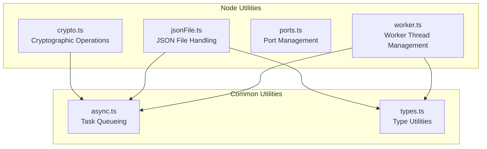
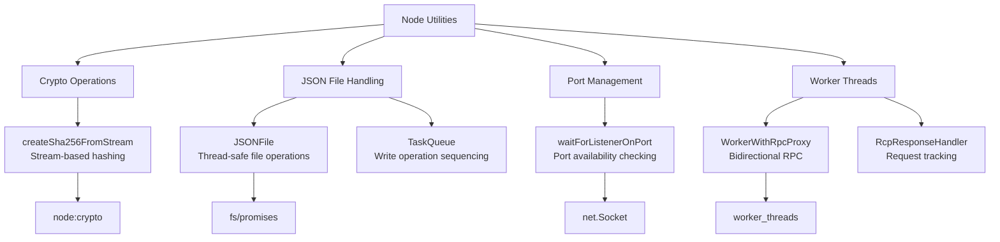
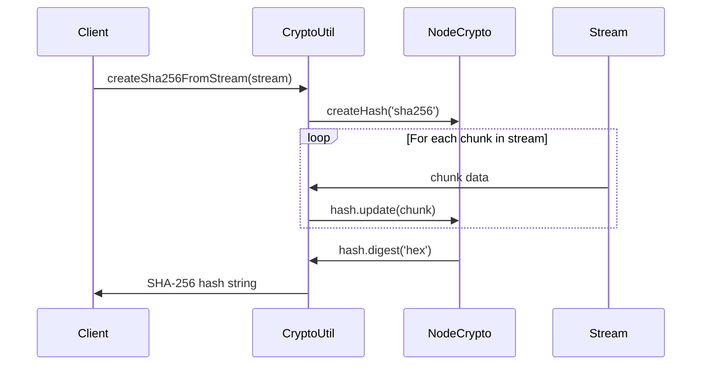
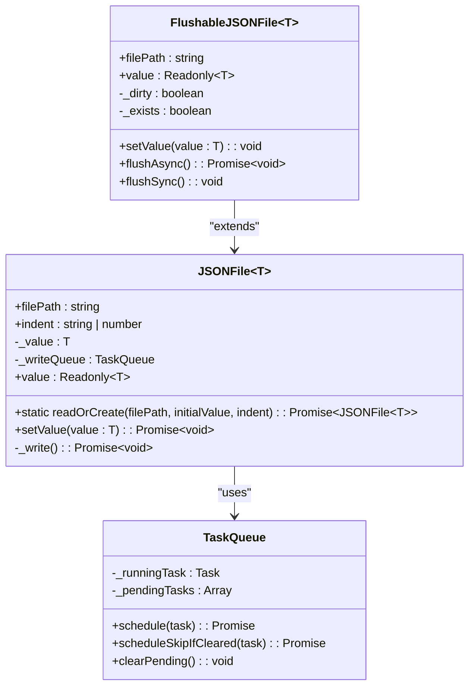
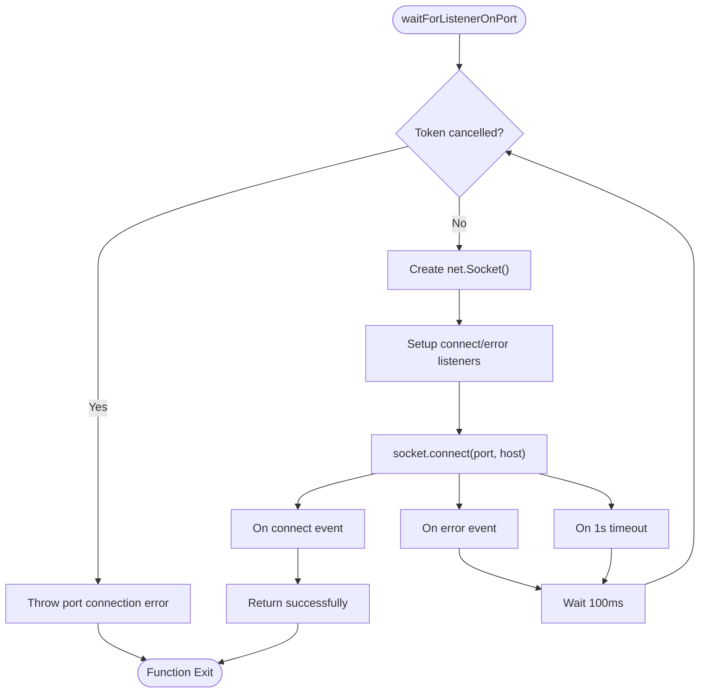
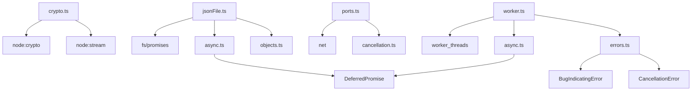

# Node Utilities

<cite>
**Referenced Files in This Document**   
- [crypto.ts](file://src/util/node/crypto.ts)
- [jsonFile.ts](file://src/util/node/jsonFile.ts)
- [ports.ts](file://src/util/node/ports.ts)
- [worker.ts](file://src/util/node/worker.ts)
- [async.ts](file://src/util/common/async.ts)
- [safeFileWriteUtils.ts](file://src/extension/workspaceRecorder/vscode-node/safeFileWriteUtils.ts)
- [diffServiceImpl.ts](file://src/platform/diff/node/diffServiceImpl.ts)
- [parserServiceImpl.ts](file://src/platform/parser/node/parserServiceImpl.ts)
</cite>

## Table of Contents
1. [Introduction](#introduction)
2. [Project Structure](#project-structure)
3. [Core Components](#core-components)
4. [Architecture Overview](#architecture-overview)
5. [Detailed Component Analysis](#detailed-component-analysis)
6. [Dependency Analysis](#dependency-analysis)
7. [Performance Considerations](#performance-considerations)
8. [Troubleshooting Guide](#troubleshooting-guide)
9. [Conclusion](#conclusion)

## Introduction
This document provides a comprehensive analysis of the Node Utilities sub-component within GitHub Copilot Chat. The utilities—crypto.ts, jsonFile.ts, ports.ts, and worker.ts—are essential for enabling Node.js-specific functionality that is not available in browser environments. These utilities leverage Node.js runtime capabilities to provide secure cryptographic operations, reliable JSON file handling, port monitoring, and efficient worker thread management. This documentation explains the implementation details, interfaces, domain models, and usage patterns of each utility, with concrete examples from the codebase. The content is designed to be accessible to beginners while providing sufficient technical depth for experienced developers, covering Node.js-specific performance considerations and best practices.

## Project Structure
The Node Utilities are located in the `src/util/node/` directory and are designed to work alongside browser-compatible utilities in `src/util/common/`. The utilities are structured to provide Node.js-specific implementations while maintaining compatibility with the broader application architecture.



**Diagram sources**
- [crypto.ts](file://src/util/node/crypto.ts)
- [jsonFile.ts](file://src/util/node/jsonFile.ts)
- [ports.ts](file://src/util/node/ports.ts)
- [worker.ts](file://src/util/node/worker.ts)
- [async.ts](file://src/util/common/async.ts)

**Section sources**
- [crypto.ts](file://src/util/node/crypto.ts)
- [jsonFile.ts](file://src/util/node/jsonFile.ts)
- [ports.ts](file://src/util/node/ports.ts)
- [worker.ts](file://src/util/node/worker.ts)

## Core Components
The Node Utilities sub-component consists of four primary modules that provide essential Node.js-specific functionality for GitHub Copilot Chat. These utilities enable operations that require access to the file system, network, and multi-threading capabilities, which are not available in browser environments. The components work together to provide a robust foundation for the application's backend operations, with each utility addressing specific technical requirements while maintaining a consistent design philosophy.

**Section sources**
- [crypto.ts](file://src/util/node/crypto.ts#L1-L16)
- [jsonFile.ts](file://src/util/node/jsonFile.ts#L1-L72)
- [ports.ts](file://src/util/node/ports.ts#L1-L53)
- [worker.ts](file://src/util/node/worker.ts#L1-L131)

## Architecture Overview
The Node Utilities architecture is designed to provide reliable, efficient, and thread-safe operations for critical application functions. The components follow a modular design pattern, with each utility focusing on a specific domain while leveraging shared infrastructure from common utilities. The architecture emphasizes asynchronous operations, error handling, and resource management to ensure robust performance in production environments.



**Diagram sources**
- [crypto.ts](file://src/util/node/crypto.ts#L6-L15)
- [jsonFile.ts](file://src/util/node/jsonFile.ts#L6-L47)
- [ports.ts](file://src/util/node/ports.ts#L6-L53)
- [worker.ts](file://src/util/node/worker.ts#L6-L131)

## Detailed Component Analysis

### Cryptographic Operations (crypto.ts)
The crypto utility provides a simple interface for creating SHA-256 hashes from Node.js readable streams. This functionality is essential for generating content fingerprints and ensuring data integrity in the application. The implementation leverages Node.js's built-in crypto module to provide efficient stream processing without loading entire files into memory.



**Diagram sources**
- [crypto.ts](file://src/util/node/crypto.ts#L9-L15)

**Section sources**
- [crypto.ts](file://src/util/node/crypto.ts#L6-L15)

### JSON File Handling (jsonFile.ts)
The JSON file utility provides a thread-safe mechanism for reading, writing, and updating JSON files with automatic conflict resolution. The implementation addresses common issues in concurrent file operations, such as race conditions and partial writes, by using a task queue to serialize write operations. This ensures data consistency even when multiple components attempt to modify the same file simultaneously.



**Diagram sources**
- [jsonFile.ts](file://src/util/node/jsonFile.ts#L10-L47)
- [async.ts](file://src/util/common/async.ts#L14-L87)
- [safeFileWriteUtils.ts](file://src/extension/workspaceRecorder/vscode-node/safeFileWriteUtils.ts#L11-L79)

**Section sources**
- [jsonFile.ts](file://src/util/node/jsonFile.ts#L6-L72)
- [async.ts](file://src/util/common/async.ts#L14-L87)
- [safeFileWriteUtils.ts](file://src/extension/workspaceRecorder/vscode-node/safeFileWriteUtils.ts#L11-L79)

### Port Management (ports.ts)
The port utility provides functionality for checking port availability and waiting for services to start listening on specific ports. This is particularly useful in development and testing scenarios where services need to coordinate their startup sequence. The implementation uses Node.js's net module to create temporary socket connections and monitor port status with configurable retry intervals.



**Diagram sources**
- [ports.ts](file://src/util/node/ports.ts#L21-L53)

**Section sources**
- [ports.ts](file://src/util/node/ports.ts#L6-L53)
- [diffServiceImpl.ts](file://src/platform/diff/node/diffServiceImpl.ts#L5-L86)

### Worker Thread Management (worker.ts)
The worker utility provides a robust framework for inter-thread communication using Remote Procedure Call (RPC) patterns. This enables efficient distribution of CPU-intensive tasks across multiple threads while maintaining a clean, promise-based API. The implementation handles serialization, error propagation, and lifecycle management to ensure reliable operation in production environments.

```mermaid
classDiagram
class WorkerWithRpcProxy~WorkerProxyType, HostProxyType~ {
-worker : Worker
-responseHandler : RcpResponseHandler
+proxy : RpcProxy~WorkerProxyType~
+terminate() : void
-handleError(err : Error) : void
}
class RcpResponseHandler {
-nextId : number
-handlers : Map~number, {resolve, reject}~
+createHandler~T~() : {id, result}
+handleResponse(response : RpcResponse) : void
+handleError(err : Error) : void
+clear() : void
}
class RpcProxy~ProxyType~ {
<<Type Alias>>
}
WorkerWithRpcProxy --> RcpResponseHandler : "contains"
WorkerWithRpcProxy --> Worker : "uses"
RcpResponseHandler --> Promise : "manages"
```

**Diagram sources**
- [worker.ts](file://src/util/node/worker.ts#L79-L131)
- [diffServiceImpl.ts](file://src/platform/diff/node/diffServiceImpl.ts#L5-L86)
- [parserServiceImpl.ts](file://src/platform/parser/node/parserServiceImpl.ts#L5-L126)

**Section sources**
- [worker.ts](file://src/util/node/worker.ts#L6-L131)
- [diffServiceImpl.ts](file://src/platform/diff/node/diffServiceImpl.ts#L5-L86)
- [parserServiceImpl.ts](file://src/platform/parser/node/parserServiceImpl.ts#L5-L126)

## Dependency Analysis
The Node Utilities have well-defined dependencies that follow a layered architecture pattern. Each utility depends on Node.js built-in modules for core functionality while leveraging shared utilities from the common module for cross-cutting concerns like task queuing and error handling.



**Diagram sources**
- [crypto.ts](file://src/util/node/crypto.ts#L6-L7)
- [jsonFile.ts](file://src/util/node/jsonFile.ts#L6-L8)
- [ports.ts](file://src/util/node/ports.ts#L6-L7)
- [worker.ts](file://src/util/node/worker.ts#L6-L7)
- [async.ts](file://src/util/common/async.ts#L6-L7)
- [types.ts](file://src/util/common/types.ts#L7-L8)

**Section sources**
- [crypto.ts](file://src/util/node/crypto.ts#L6-L15)
- [jsonFile.ts](file://src/util/node/jsonFile.ts#L6-L72)
- [ports.ts](file://src/util/node/ports.ts#L6-L53)
- [worker.ts](file://src/util/node/worker.ts#L6-L131)
- [async.ts](file://src/util/common/async.ts#L6-L156)
- [types.ts](file://src/util/common/types.ts#L6-L34)

## Performance Considerations
The Node Utilities are designed with performance and reliability as primary concerns. The cryptographic operations use stream processing to handle large files efficiently without memory overhead. The JSON file utility employs a task queue to prevent race conditions and ensure data consistency, though this introduces a small latency for write operations. The worker thread management system enables parallel processing of CPU-intensive tasks, significantly improving performance for operations like code parsing and diff computation. The port management utility uses exponential backoff patterns to minimize network overhead when checking port availability. Overall, these utilities demonstrate careful consideration of Node.js performance characteristics and provide efficient implementations for their respective domains.

## Troubleshooting Guide
When working with the Node Utilities, several common issues may arise. For cryptographic operations, ensure that input streams are properly formatted and not prematurely closed. For JSON file operations, be aware that the task queue may delay write operations, so use await when immediate persistence is required. When using worker threads, ensure that all data passed between threads is serializable via JSON, as non-serializable objects will cause errors. For port management, verify that the target host and port are accessible and not blocked by firewalls. In all cases, monitor error handling patterns and ensure that promises are properly awaited to prevent unhandled rejections.

**Section sources**
- [crypto.ts](file://src/util/node/crypto.ts#L9-L15)
- [jsonFile.ts](file://src/util/node/jsonFile.ts#L38-L46)
- [ports.ts](file://src/util/node/ports.ts#L21-L53)
- [worker.ts](file://src/util/node/worker.ts#L87-L115)

## Conclusion
The Node Utilities sub-component provides essential functionality that enables GitHub Copilot Chat to leverage Node.js runtime capabilities beyond what is available in browser environments. The utilities demonstrate robust design patterns for handling cryptographic operations, file I/O, network communication, and multi-threading, with careful attention to error handling, performance, and reliability. By providing a clean, promise-based API for these low-level operations, the utilities enable higher-level components to focus on business logic while ensuring consistent and reliable behavior across different execution environments. The modular design and clear interfaces make these utilities reusable across the application and serve as a model for implementing Node.js-specific functionality in a maintainable way.