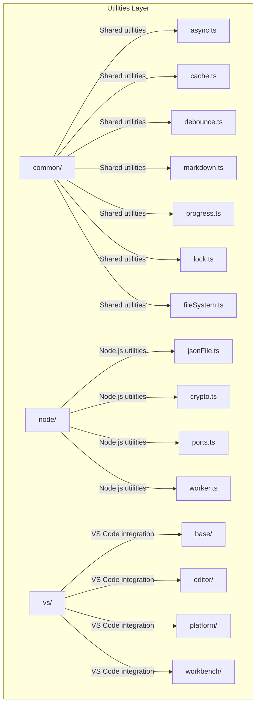
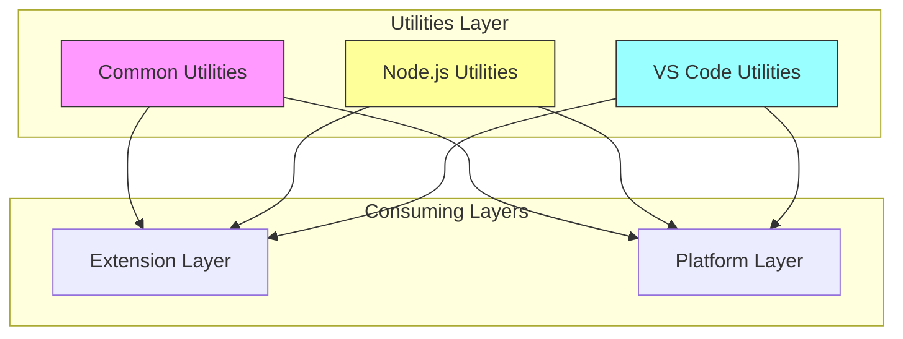
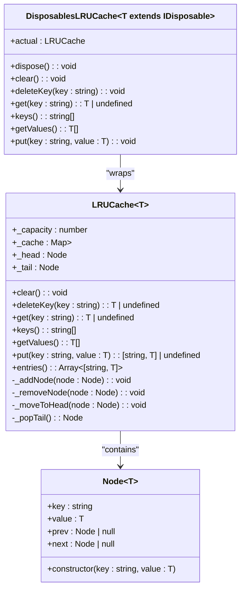
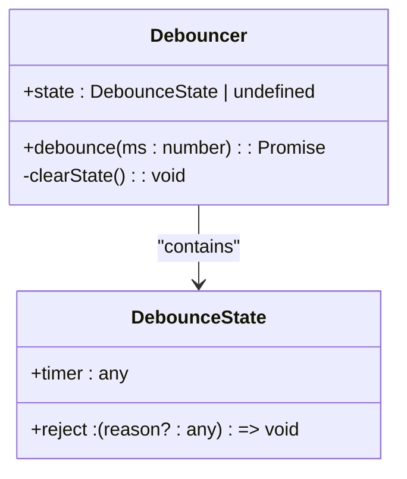
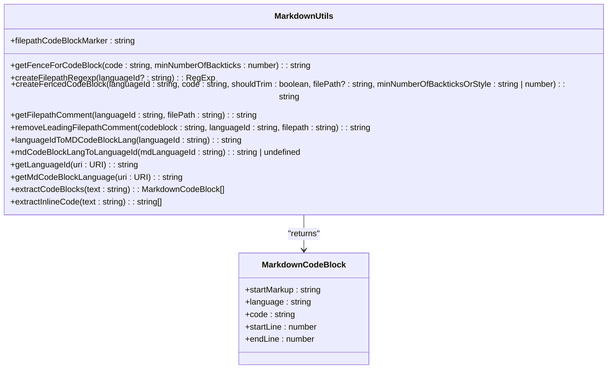
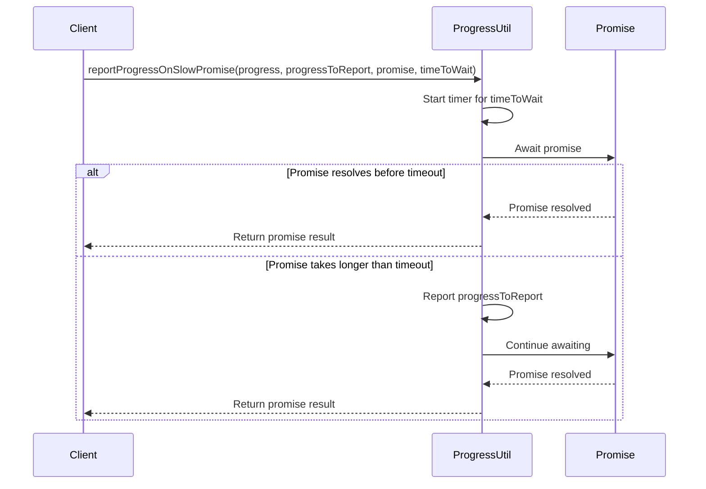
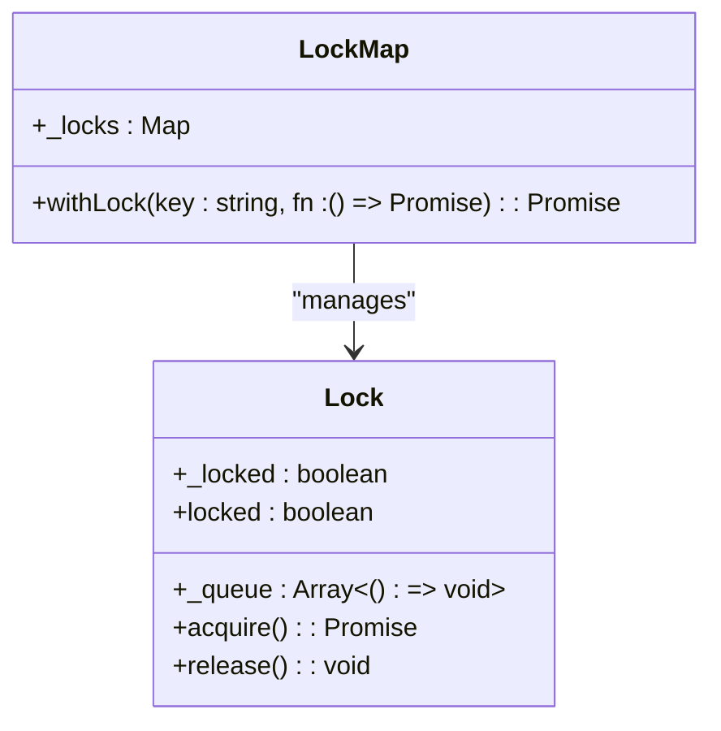

# Utilities Layer

<cite>
**Referenced Files in This Document**   
- [async.ts](file://src/util/common/async.ts)
- [cache.ts](file://src/util/common/cache.ts)
- [debounce.ts](file://src/util/common/debounce.ts)
- [markdown.ts](file://src/util/common/markdown.ts)
- [progress.ts](file://src/util/common/progress.ts)
- [lock.ts](file://src/util/common/lock.ts)
- [fileSystem.ts](file://src/util/common/fileSystem.ts)
- [jsonFile.ts](file://src/util/node/jsonFile.ts)
- [vs/base/common/async.ts](file://src/util/vs/base/common/async.ts)
</cite>

## Table of Contents
1. [Introduction](#introduction)
2. [Project Structure](#project-structure)
3. [Core Components](#core-components)
4. [Architecture Overview](#architecture-overview)
5. [Detailed Component Analysis](#detailed-component-analysis)
6. [Dependency Analysis](#dependency-analysis)
7. [Performance Considerations](#performance-considerations)
8. [Troubleshooting Guide](#troubleshooting-guide)
9. [Conclusion](#conclusion)

## Introduction
The Utilities Layer in GitHub Copilot Chat serves as the foundational helper layer that provides common functions used across the entire codebase. This layer is designed to offer reusable, reliable utility functions that support both the extension and platform layers. The utilities are organized into three main categories: common utilities that are platform-agnostic, node-specific utilities that leverage Node.js runtime capabilities, and VS Code-specific utilities that facilitate integration with the VS Code editor environment. This architectural approach promotes code reusability, type safety, and performance optimization across the application.

## Project Structure
The Utilities Layer is organized in a modular structure within the `src/util` directory, with clear separation between different types of utilities. The layer follows a hierarchical organization that separates common functionality from platform-specific implementations.



**Diagram sources**
- [src/util](file://src/util)

**Section sources**
- [src/util](file://src/util)

## Core Components
The Utilities Layer consists of several core components that provide essential functionality for the GitHub Copilot Chat application. These components are designed to be reusable across different parts of the codebase and follow the principle of separation of concerns. The layer provides utilities for asynchronous operations, caching, debouncing, markdown processing, progress tracking, locking mechanisms, and file system operations. These utilities are consumed by both the extension layer and platform layer, ensuring consistent behavior and reducing code duplication.

**Section sources**
- [src/util/common/async.ts](file://src/util/common/async.ts)
- [src/util/common/cache.ts](file://src/util/common/cache.ts)
- [src/util/common/debounce.ts](file://src/util/common/debounce.ts)
- [src/util/common/markdown.ts](file://src/util/common/markdown.ts)
- [src/util/common/progress.ts](file://src/util/common/progress.ts)
- [src/util/common/lock.ts](file://src/util/common/lock.ts)
- [src/util/common/fileSystem.ts](file://src/util/common/fileSystem.ts)

## Architecture Overview
The Utilities Layer follows a modular architecture that separates concerns and promotes reusability. The layer is organized into three main categories: common utilities, node-specific utilities, and VS Code-specific utilities. This architectural pattern ensures that platform-agnostic functionality is separated from platform-specific implementations, making the codebase more maintainable and testable.



**Diagram sources**
- [src/util](file://src/util)
- [src/extension](file://src/extension)
- [src/platform](file://src/platform)

## Detailed Component Analysis

### Common Utilities Analysis
The common utilities provide platform-agnostic functionality that can be used across different environments. These utilities include async helpers, caching mechanisms, debouncing functions, markdown processing, progress tracking, and locking mechanisms.

#### Async Utilities
The async utilities provide various patterns for handling asynchronous operations, including task queues, batched processors, and promise racing.

```mermaid
classDiagram
class TaskQueue {
+_runningTask : Task<any>
+_pendingTasks : Array<{task : Task<any>, deferred : DeferredPromise<any>, setUndefinedWhenCleared : boolean}>
+schedule(task : Task<T>) : Promise<T>
+scheduleSkipIfCleared(task : Task<T>) : Promise<T | undefined>
+clearPending() : void
-_runIfNotRunning() : void
-_processQueue() : Promise<void>
}
class BatchedProcessor~TArg, TResult~ {
+_queue : Array<{arg : TArg, promise : DeferredPromise<TResult>}>
+_timeout : any | null
+_fn : (args : TArg[]) => Promise<TResult[]>
+_waitingTimeMs : number
+request(arg : TArg) : Promise<TResult>
-_flush() : Promise<void>
}
class DeferredPromise~T~ {
+p : Promise<T>
+complete(value : T) : void
+error(error : any) : void
+cancel() : void
}
TaskQueue --> DeferredPromise : "uses"
BatchedProcessor --> DeferredPromise : "uses"
```

**Diagram sources**
- [src/util/common/async.ts](file://src/util/common/async.ts)
- [src/util/vs/base/common/async.ts](file://src/util/vs/base/common/async.ts)

**Section sources**
- [src/util/common/async.ts](file://src/util/common/async.ts)

#### Caching Utilities
The caching utilities provide LRU (Least Recently Used) cache implementations for efficient memory management and data retrieval.



**Diagram sources**
- [src/util/common/cache.ts](file://src/util/common/cache.ts)

**Section sources**
- [src/util/common/cache.ts](file://src/util/common/cache.ts)

#### Debouncing Utilities
The debouncing utilities provide mechanisms to limit the rate at which functions are executed, which is particularly useful for handling rapid user input events.



**Diagram sources**
- [src/util/common/debounce.ts](file://src/util/common/debounce.ts)

**Section sources**
- [src/util/common/debounce.ts](file://src/util/common/debounce.ts)

#### Markdown Utilities
The markdown utilities provide functionality for processing and generating markdown content, which is essential for the chat interface.



**Diagram sources**
- [src/util/common/markdown.ts](file://src/util/common/markdown.ts)

**Section sources**
- [src/util/common/markdown.ts](file://src/util/common/markdown.ts)

#### Progress Utilities
The progress utilities provide mechanisms for reporting progress on long-running operations.



**Diagram sources**
- [src/util/common/progress.ts](file://src/util/common/progress.ts)

**Section sources**
- [src/util/common/progress.ts](file://src/util/common/progress.ts)

#### Locking Utilities
The locking utilities provide mechanisms for synchronizing access to shared resources.



**Diagram sources**
- [src/util/common/lock.ts](file://src/util/common/lock.ts)

**Section sources**
- [src/util/common/lock.ts](file://src/util/common/lock.ts)

#### File System Utilities
The file system utilities provide helper functions for working with file paths and extensions.


**Diagram sources**
- [src/util/common/fileSystem.ts](file://src/util/common/fileSystem.ts)

**Section sources**
- [src/util/common/fileSystem.ts](file://src/util/common/fileSystem.ts)

### Node-specific Utilities Analysis
The node-specific utilities leverage Node.js runtime capabilities to provide functionality that is specific to the Node.js environment.

#### JSON File Utilities
The JSON file utilities provide a wrapper for reading and writing JSON files with automatic serialization and deserialization.

```mermaid
classDiagram
class JSONFile~T~ {
+filePath : string
+indent : string | number
+_value : T
+value : Readonly<T>
+_writeQueue : TaskQueue
+static readOrCreate(filePath : string, initialValue : T, indent : string | number) : Promise<JSONFile<T>>
+constructor(filePath : string, initialValue : T, indent : string | number)
+setValue(value : T) : Promise<void>
-_write() : Promise<void>
}
class TaskQueue {
+_runningTask : Task<any>
+_pendingTasks : Array<{task : Task<any>, deferred : DeferredPromise<any>, setUndefinedWhenCleared : boolean}>
+schedule(task : Task<T>) : Promise<T>
+scheduleSkipIfCleared(task : Task<T>) : Promise<T | undefined>
+clearPending() : void
}
JSONFile --> TaskQueue : "uses"
```

**Diagram sources**
- [src/util/node/jsonFile.ts](file://src/util/node/jsonFile.ts)
- [src/util/common/async.ts](file://src/util/common/async.ts)

**Section sources**
- [src/util/node/jsonFile.ts](file://src/util/node/jsonFile.ts)

## Dependency Analysis
The Utilities Layer has a well-defined dependency structure that ensures proper separation of concerns and reusability. The layer is designed to be consumed by both the extension and platform layers, providing a consistent set of utility functions across the application.


**Diagram sources**
- [src/util](file://src/util)
- [src/extension](file://src/extension)
- [src/platform](file://src/platform)

**Section sources**
- [src/util](file://src/util)
- [src/extension](file://src/extension)
- [src/platform](file://src/platform)

## Performance Considerations
The Utilities Layer is designed with performance optimization in mind, particularly in areas such as caching, debouncing, and asynchronous operations. The LRU cache implementation ensures efficient memory usage by automatically evicting least recently used items when the cache reaches its capacity. The debouncing utilities help prevent excessive function calls during rapid user interactions, improving responsiveness. The task queue and batched processor patterns optimize the execution of asynchronous operations by grouping related tasks and processing them efficiently. These performance optimizations contribute to a smoother user experience and more efficient resource utilization across the application.

## Troubleshooting Guide
When troubleshooting issues related to the Utilities Layer, consider the following common scenarios:

1. **Cache-related issues**: If data is not being retrieved from the cache as expected, verify that the cache keys are consistent and that the cache capacity is sufficient for the use case.

2. **Async operation issues**: If asynchronous operations are not executing in the expected order, check the implementation of the task queue or batched processor to ensure proper sequencing.

3. **Debouncing issues**: If debounced functions are not being called as expected, verify the debounce timing and ensure that the function is not being called too frequently.

4. **Locking issues**: If there are issues with resource access synchronization, check the lock implementation to ensure that locks are being acquired and released properly.

5. **Markdown processing issues**: If markdown content is not being processed correctly, verify the markdown syntax and ensure that the appropriate utility functions are being used.

**Section sources**
- [src/util/common/cache.ts](file://src/util/common/cache.ts)
- [src/util/common/async.ts](file://src/util/common/async.ts)
- [src/util/common/debounce.ts](file://src/util/common/debounce.ts)
- [src/util/common/lock.ts](file://src/util/common/lock.ts)
- [src/util/common/markdown.ts](file://src/util/common/markdown.ts)

## Conclusion
The Utilities Layer in GitHub Copilot Chat provides a robust foundation of reusable helper functions that support both the extension and platform layers. By organizing utilities into common, node-specific, and VS Code-specific categories, the layer promotes code reusability, type safety, and performance optimization. The architectural patterns used, such as modular organization by functionality and separation of concerns, ensure that the utilities are maintainable and extensible. This layer plays a critical role in enabling reliable, reusable functions for operations like debouncing, locking, markdown processing, and progress tracking, contributing to the overall stability and performance of the GitHub Copilot Chat application.