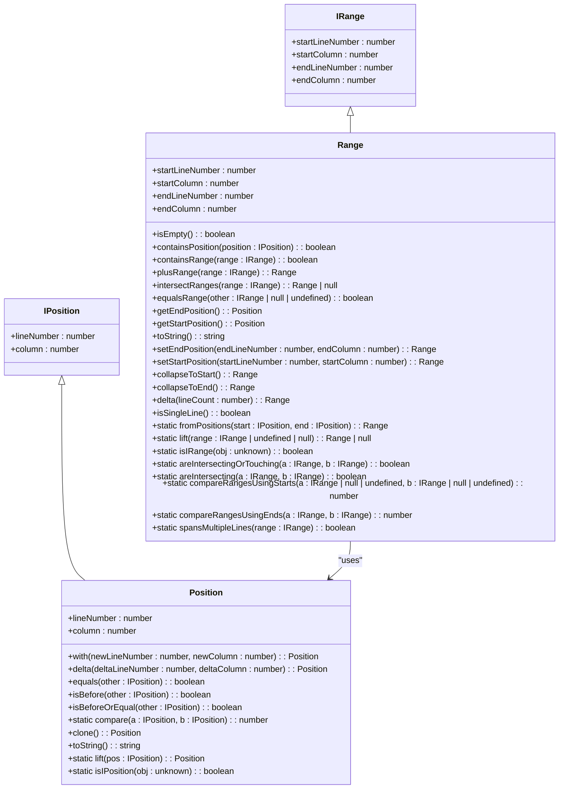
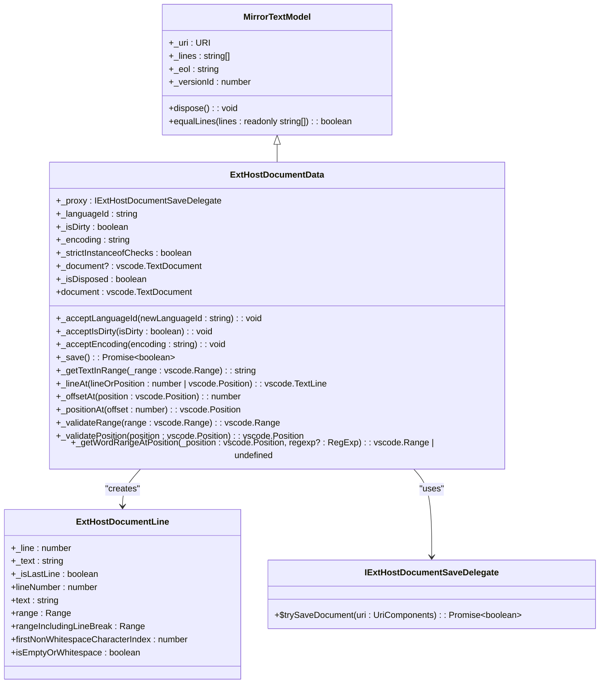

# VS Code Utilities

<cite>
**Referenced Files in This Document**   
- [event.ts](file://src/util/vs/base/common/event.ts)
- [lifecycle.ts](file://src/util/vs/base/common/lifecycle.ts)
- [range.ts](file://src/util/vs/editor/common/core/range.ts)
- [position.ts](file://src/util/vs/editor/common/core/position.ts)
- [instantiation.ts](file://src/util/vs/platform/instantiation/common/instantiation.ts)
- [serviceCollection.ts](file://src/util/vs/platform/instantiation/common/serviceCollection.ts)
- [extHostDocumentData.ts](file://src/util/vs/workbench/api/common/extHostDocumentData.ts)
</cite>

## Table of Contents
1. [Introduction](#introduction)
2. [Base Utilities](#base-utilities)
3. [Editor Integration Helpers](#editor-integration-helpers)
4. [Dependency Injection Patterns](#dependency-injection-patterns)
5. [Workbench API Extensions](#workbench-api-extensions)
6. [Best Practices and Common Issues](#best-practices-and-common-issues)
7. [Conclusion](#conclusion)

## Introduction
The VS Code Utilities sub-component of GitHub Copilot Chat provides a comprehensive set of tools and patterns that enable deep integration with the Visual Studio Code editor. These utilities form the foundation for accessing editor state, document models, and workbench services, allowing Copilot Chat to deliver intelligent, context-aware assistance. The utilities are organized into four main categories: base utilities for common programming patterns, editor integration helpers for working with the editor's document model, dependency injection patterns for service management, and workbench API extensions for accessing VS Code's broader functionality. This documentation provides a detailed analysis of each utility category, explaining their implementation, interfaces, and usage patterns to help developers understand how to effectively leverage these tools in their extensions.

## Base Utilities

The base utilities in the VS Code Utilities sub-component provide fundamental programming patterns and abstractions that are used throughout the codebase. These utilities are located in the `src/util/vs/base/common/` directory and include essential functionality for event handling, lifecycle management, and asynchronous operations. The `event.ts` file implements a sophisticated event system that allows for subscription, filtering, mapping, and debouncing of events, while the `lifecycle.ts` file provides comprehensive tools for managing the lifecycle of disposable objects, ensuring proper cleanup and preventing memory leaks. These base utilities form the foundation upon which higher-level functionality is built, providing consistent patterns for event-driven programming and resource management across the entire extension.

**Section sources**
- [event.ts](file://src/util/vs/base/common/event.ts#L1-L1783)
- [lifecycle.ts](file://src/util/vs/base/common/lifecycle.ts#L1-L884)

## Editor Integration Helpers

The editor integration helpers provide specialized utilities for working with the VS Code editor's document model and user interface. Located in the `src/util/vs/editor/common/` directory, these helpers include core data structures like `Position` and `Range` that represent locations and spans within text documents. The `position.ts` file defines the `Position` class and `IPosition` interface for representing cursor locations, while `range.ts` implements the `Range` class and `IRange` interface for representing spans of text. These classes provide methods for comparing positions, validating ranges, and performing geometric operations on text spans. These utilities enable precise manipulation of text selections and are essential for implementing features like code navigation, refactoring, and inline editing that require accurate positioning within documents.



**Diagram sources **
- [position.ts](file://src/util/vs/editor/common/core/position.ts#L1-L187)
- [range.ts](file://src/util/vs/editor/common/core/range.ts#L1-L520)

**Section sources**
- [position.ts](file://src/util/vs/editor/common/core/position.ts#L1-L187)
- [range.ts](file://src/util/vs/editor/common/core/range.ts#L1-L520)

## Dependency Injection Patterns

The dependency injection patterns in the VS Code Utilities sub-component provide a robust framework for managing services and their dependencies. Located in the `src/util/vs/platform/instantiation/common/` directory, this system is built around the `IInstantiationService` interface and supporting classes like `ServiceCollection`. The `instantiation.ts` file defines the core interfaces and decorators for dependency injection, including the `createDecorator` function that generates service identifiers and the `getServiceDependencies` function that retrieves dependency metadata from constructors. The `serviceCollection.ts` file implements the `ServiceCollection` class, which acts as a registry for services, allowing them to be registered and retrieved by their identifiers. This pattern enables loose coupling between components, facilitates testing through dependency injection, and provides a clean mechanism for extending functionality through service overrides.

```mermaid
classDiagram
class ServiceIdentifier~T~ {
+type : T
}
class ServicesAccessor {
+get~T~(id : ServiceIdentifier~T~) : T
+getIfExists~T~(id : ServiceIdentifier~T~) : T | undefined
}
class IInstantiationService {
+createInstance~T~(descriptor : SyncDescriptor0~T~) : T
+createInstance~Ctor extends new (...args : any[]) => unknown, R extends InstanceType~Ctor~~(ctor : Ctor, ...args : GetLeadingNonServiceArgs~ConstructorParameters~Ctor~~) : R
+invokeFunction~R, TS extends any[] = []~(fn : (accessor : ServicesAccessor, ...args : TS) => R, ...args : TS) : R
+createChild(services : ServiceCollection, store? : DisposableStore) : IInstantiationService
+dispose() : void
}
class ServiceCollection {
+set~T~(id : ServiceIdentifier~T~, instanceOrDescriptor : T | SyncDescriptor~T~) : T | SyncDescriptor~T~
+has(id : ServiceIdentifier~any~) : boolean
+get~T~(id : ServiceIdentifier~T~) : T | SyncDescriptor~T~
}
class _util {
+serviceIds : Map~string, ServiceIdentifier~any~~
+DI_TARGET : '$di$target'
+DI_DEPENDENCIES : '$di$dependencies'
+getServiceDependencies(ctor : DI_TARGET_OBJ) : { id : ServiceIdentifier~any~; index : number }[]
}
IInstantiationService --> ServicesAccessor : "uses"
IInstantiationService --> ServiceCollection : "uses"
_util --> ServiceIdentifier : "manages"
ServiceCollection --> ServiceIdentifier : "uses"
```

**Diagram sources **
- [instantiation.ts](file://src/util/vs/platform/instantiation/common/instantiation.ts#L1-L134)
- [serviceCollection.ts](file://src/util/vs/platform/instantiation/common/serviceCollection.ts#L1-L35)

**Section sources**
- [instantiation.ts](file://src/util/vs/platform/instantiation/common/instantiation.ts#L1-L134)
- [serviceCollection.ts](file://src/util/vs/platform/instantiation/common/serviceCollection.ts#L1-L35)

## Workbench API Extensions

The workbench API extensions provide access to VS Code's broader functionality beyond the editor itself. Located in the `src/util/vs/workbench/api/common/` directory, these extensions bridge the gap between the extension and the VS Code workbench, enabling access to document state, language features, and workspace services. The `extHostDocumentData.ts` file implements the `ExtHostDocumentData` class, which extends `MirrorTextModel` to provide a rich interface for working with text documents. This class exposes the `vscode.TextDocument` API, allowing extensions to read document content, validate positions, and perform operations like saving. It also provides methods for working with text lines, calculating offsets, and finding word ranges, making it a central component for any extension that needs to interact with the editor's document model.



**Diagram sources **
- [extHostDocumentData.ts](file://src/util/vs/workbench/api/common/extHostDocumentData.ts#L1-L315)

**Section sources**
- [extHostDocumentData.ts](file://src/util/vs/workbench/api/common/extHostDocumentData.ts#L1-L315)

## Best Practices and Common Issues

When working with the VS Code Utilities sub-component, several best practices and common issues should be considered to ensure robust and efficient code. One critical aspect is proper disposal of event listeners and other disposable resources, which is facilitated by the `DisposableStore` and `Disposable` classes in the lifecycle utilities. Developers should always ensure that event subscriptions and other resources are properly disposed of to prevent memory leaks. Another important consideration is maintaining compatibility with VS Code API changes, which can be addressed by using the dependency injection system to abstract away direct dependencies on specific API versions. Performance considerations are also crucial when interacting with the editor's document model, particularly when performing operations on large files or in response to frequent events. Techniques like debouncing and throttling, provided by the event utilities, can help mitigate performance issues by reducing the frequency of expensive operations.

**Section sources**
- [event.ts](file://src/util/vs/base/common/event.ts#L1-L1783)
- [lifecycle.ts](file://src/util/vs/base/common/lifecycle.ts#L1-L884)

## Conclusion

The VS Code Utilities sub-component of GitHub Copilot Chat provides a comprehensive set of tools and patterns that enable deep integration with the Visual Studio Code editor. By understanding the implementation details of the base utilities, editor integration helpers, dependency injection patterns, and workbench API extensions, developers can create powerful extensions that leverage the full capabilities of the editor. The utilities provide a solid foundation for building context-aware, high-performance features that enhance the developer experience. As the VS Code ecosystem continues to evolve, these utilities will remain a critical component for enabling innovative AI-powered coding assistance and other advanced editor integrations.