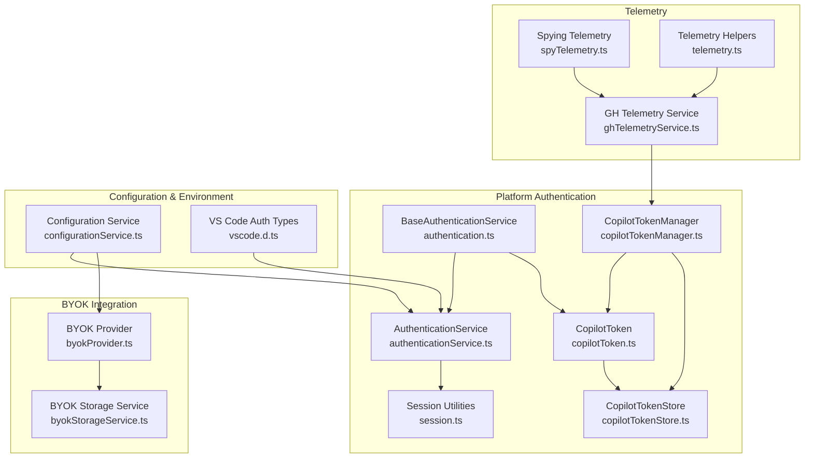
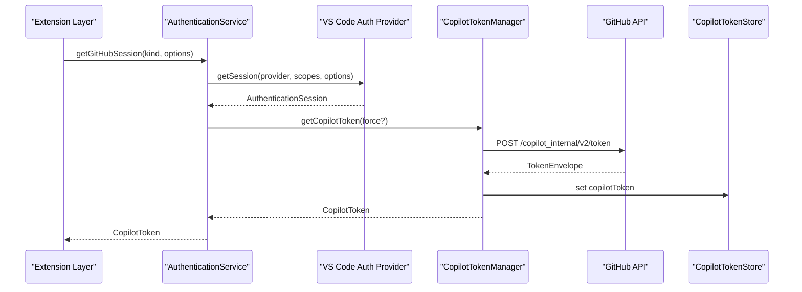
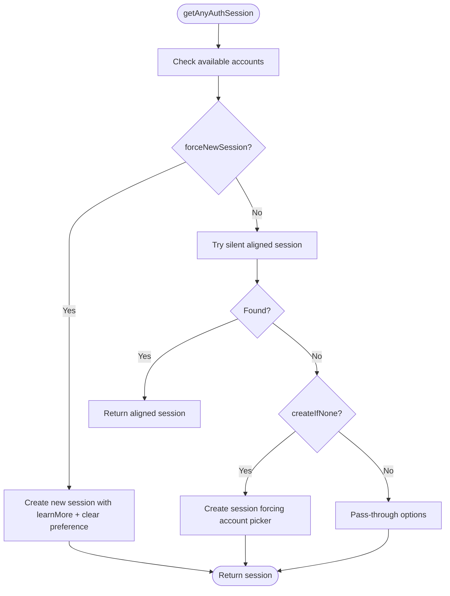
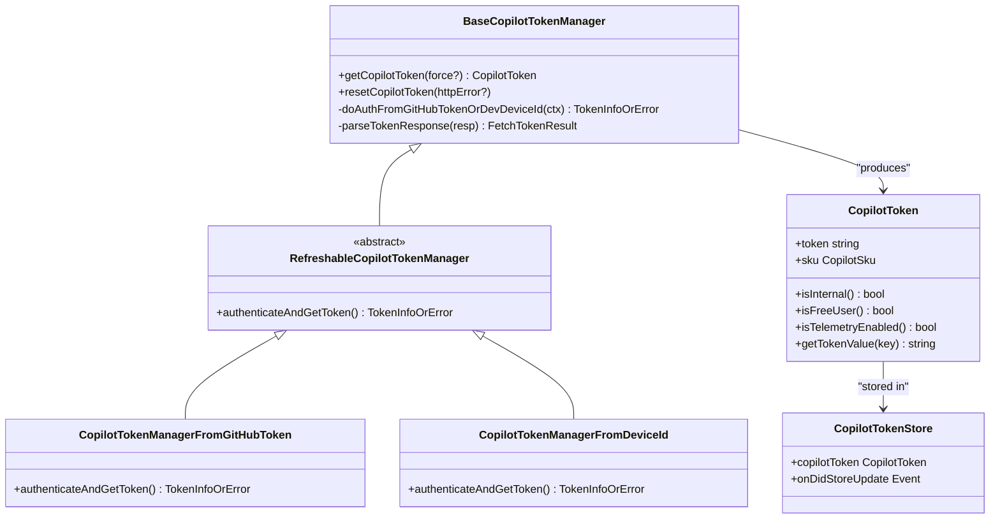
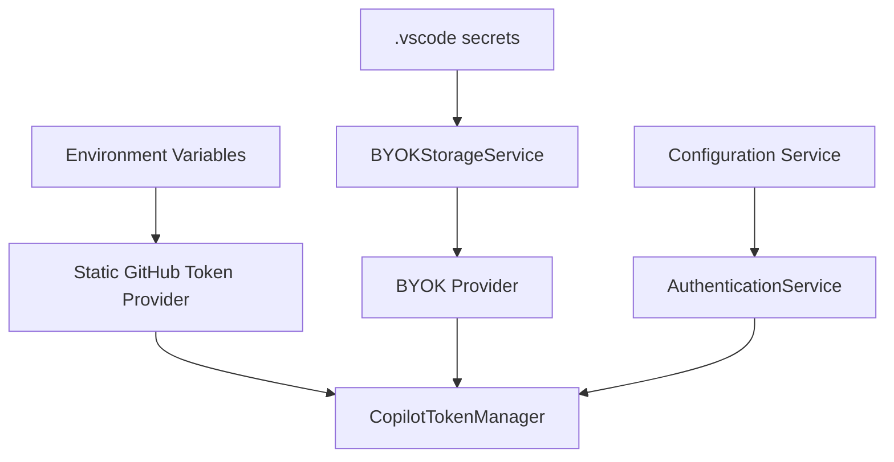
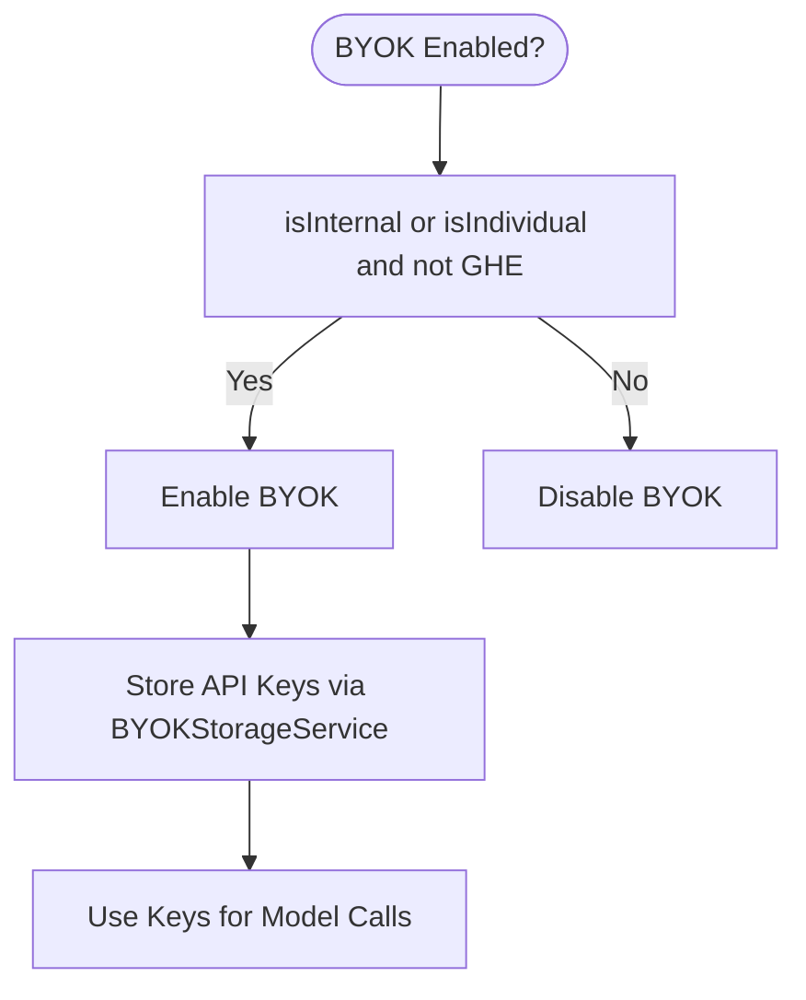
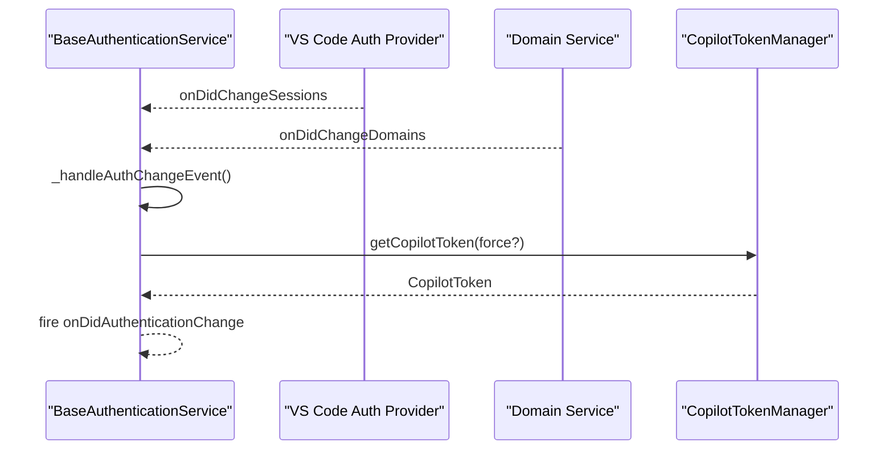
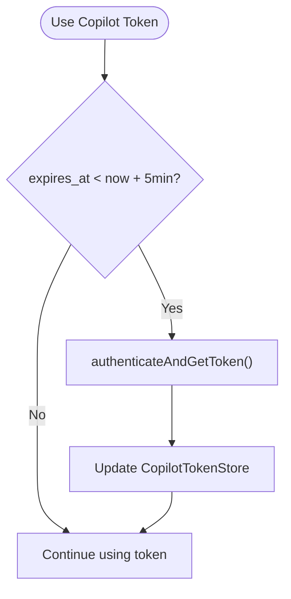
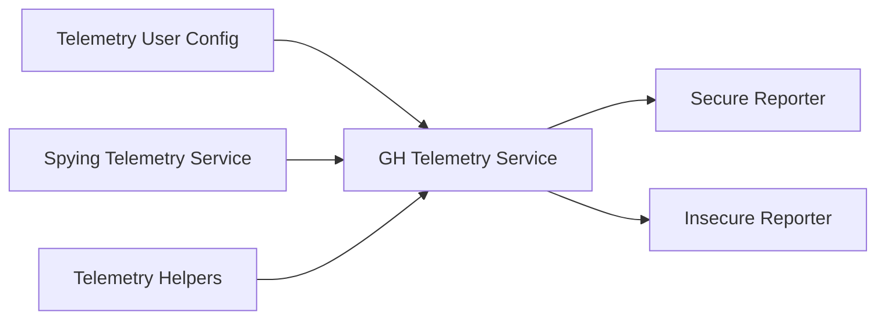
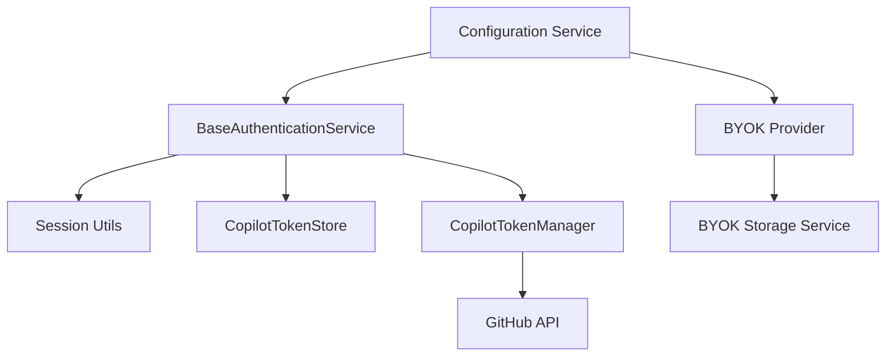

# Authentication & Security

<cite>
**Referenced Files in This Document**
- [authentication.ts](file://src/platform/authentication/common/authentication.ts)
- [authenticationService.ts](file://src/platform/authentication/vscode-node/authenticationService.ts)
- [session.ts](file://src/platform/authentication/vscode-node/session.ts)
- [copilotToken.ts](file://src/platform/authentication/common/copilotToken.ts)
- [copilotTokenManager.ts](file://src/platform/authentication/node/copilotTokenManager.ts)
- [copilotTokenStore.ts](file://src/platform/authentication/common/copilotTokenStore.ts)
- [byokStorageService.ts](file://src/extension/byok/vscode-node/byokStorageService.ts)
- [byokProvider.ts](file://src/extension/byok/common/byokProvider.ts)
- [configurationService.ts](file://src/platform/configuration/common/configurationService.ts)
- [getToken.mts](file://script/setup/getToken.mts)
- [vscode.d.ts](file://src/extension/vscode.d.ts)
- [ghTelemetryService.ts](file://src/platform/telemetry/common/ghTelemetryService.ts)
- [spyTelemetry.ts](file://src/platform/telemetry/node/spyingTelemetryService.ts)
- [telemetry.ts](file://src/extension/completions-core/vscode-node/lib/src/telemetry.ts)
- [automodeService.ts](file://src/platform/endpoint/node/automodeService.ts)
</cite>

## Table of Contents
1. [Introduction](#introduction)
2. [Project Structure](#project-structure)
3. [Core Components](#core-components)
4. [Architecture Overview](#architecture-overview)
5. [Detailed Component Analysis](#detailed-component-analysis)
6. [Dependency Analysis](#dependency-analysis)
7. [Performance Considerations](#performance-considerations)
8. [Troubleshooting Guide](#troubleshooting-guide)
9. [Conclusion](#conclusion)
10. [Appendices](#appendices)

## Introduction
This document explains the authentication and security systems powering GitHub Copilot integration in the repository. It covers the GitHub authentication flow, token management, secure credential storage, anonymous access model, Bring Your Own Key (BYOK) support, enterprise authentication integration, authentication upgrade and refresh mechanisms, session management, and security considerations for code context handling, data privacy, and telemetry collection. Guidance is included for configuring authentication across development, testing, and production environments, along with best practices and compliance considerations for AI-assisted development tools.

## Project Structure
Authentication and security functionality is organized around a platform-layer authentication service, a VS Code node implementation, token minting and caching, secure storage, BYOK provider integration, and telemetry. The following diagram maps the primary modules involved in authentication and token lifecycle.

**Diagram sources**
- [authentication.ts](file://src/platform/authentication/common/authentication.ts#L158-L332)
- [authenticationService.ts](file://src/platform/authentication/vscode-node/authenticationService.ts#L16-L76)
- [session.ts](file://src/platform/authentication/vscode-node/session.ts#L25-L120)
- [copilotToken.ts](file://src/platform/authentication/common/copilotToken.ts#L67-L238)
- [copilotTokenManager.ts](file://src/platform/authentication/node/copilotTokenManager.ts#L88-L360)
- [copilotTokenStore.ts](file://src/platform/authentication/common/copilotTokenStore.ts#L24-L41)
- [byokProvider.ts](file://src/extension/byok/common/byokProvider.ts#L12-L87)
- [byokStorageService.ts](file://src/extension/byok/vscode-node/byokStorageService.ts#L58-L169)
- [configurationService.ts](file://src/platform/configuration/common/configurationService.ts#L169-L200)
- [vscode.d.ts](file://src/extension/vscode.d.ts#L17983-L18202)
- [ghTelemetryService.ts](file://src/platform/telemetry/common/ghTelemetryService.ts#L20-L56)
- [spyTelemetry.ts](file://src/platform/telemetry/node/spyingTelemetryService.ts#L85-L116)
- [telemetry.ts](file://src/extension/completions-core/vscode-node/lib/src/telemetry.ts#L73-L359)

**Section sources**
- [authentication.ts](file://src/platform/authentication/common/authentication.ts#L1-L341)
- [authenticationService.ts](file://src/platform/authentication/vscode-node/authenticationService.ts#L1-L76)
- [session.ts](file://src/platform/authentication/vscode-node/session.ts#L1-L120)
- [copilotToken.ts](file://src/platform/authentication/common/copilotToken.ts#L1-L615)
- [copilotTokenManager.ts](file://src/platform/authentication/node/copilotTokenManager.ts#L1-L532)
- [copilotTokenStore.ts](file://src/platform/authentication/common/copilotTokenStore.ts#L1-L41)
- [byokProvider.ts](file://src/extension/byok/common/byokProvider.ts#L1-L229)
- [byokStorageService.ts](file://src/extension/byok/vscode-node/byokStorageService.ts#L1-L169)
- [configurationService.ts](file://src/platform/configuration/common/configurationService.ts#L1-L200)
- [vscode.d.ts](file://src/extension/vscode.d.ts#L17983-L18202)
- [ghTelemetryService.ts](file://src/platform/telemetry/common/ghTelemetryService.ts#L1-L56)
- [spyTelemetry.ts](file://src/platform/telemetry/node/spyingTelemetryService.ts#L1-L116)
- [telemetry.ts](file://src/extension/completions-core/vscode-node/lib/src/telemetry.ts#L1-L359)

## Core Components
- Authentication Service: Provides GitHub and Azure DevOps session acquisition, minimal mode enforcement, and token refresh orchestration.
- Session Utilities: Resolve aligned scopes, permissive scopes, and any available session with appropriate fallbacks.
- Token Manager: Mint and cache Copilot tokens from GitHub tokens or device IDs, with validation and telemetry.
- Token Store: Centralized, observable store for Copilot tokens to avoid circular dependencies.
- BYOK Provider and Storage: Securely store provider/model keys and manage model configurations for Bring Your Own Key scenarios.
- Configuration Service: Supplies auth provider selection, minimal mode, and telemetry user configuration.
- Telemetry: Secure and insecure reporters with enhanced telemetry gating and spy utilities for testing.

**Section sources**
- [authentication.ts](file://src/platform/authentication/common/authentication.ts#L32-L156)
- [authenticationService.ts](file://src/platform/authentication/vscode-node/authenticationService.ts#L16-L76)
- [session.ts](file://src/platform/authentication/vscode-node/session.ts#L25-L120)
- [copilotTokenManager.ts](file://src/platform/authentication/node/copilotTokenManager.ts#L88-L360)
- [copilotTokenStore.ts](file://src/platform/authentication/common/copilotTokenStore.ts#L11-L41)
- [byokProvider.ts](file://src/extension/byok/common/byokProvider.ts#L12-L87)
- [byokStorageService.ts](file://src/extension/byok/vscode-node/byokStorageService.ts#L58-L169)
- [configurationService.ts](file://src/platform/configuration/common/configurationService.ts#L169-L200)
- [ghTelemetryService.ts](file://src/platform/telemetry/common/ghTelemetryService.ts#L20-L56)

## Architecture Overview
The authentication subsystem integrates with VS Code’s authentication provider, resolves sessions with appropriate scopes, mints Copilot tokens, and manages refresh and telemetry. BYOK enables enterprise and BYOK scenarios with secure secret storage.

**Diagram sources**
- [authenticationService.ts](file://src/platform/authentication/vscode-node/authenticationService.ts#L43-L59)
- [session.ts](file://src/platform/authentication/vscode-node/session.ts#L25-L90)
- [copilotTokenManager.ts](file://src/platform/authentication/node/copilotTokenManager.ts#L264-L288)
- [copilotTokenStore.ts](file://src/platform/authentication/common/copilotTokenStore.ts#L24-L41)

## Detailed Component Analysis

### GitHub Authentication Flow
- Scope Resolution: The system attempts aligned scopes first, then minimal scopes, and finally legacy scopes for backward compatibility.
- Interactive vs Silent: Interactive flows bypass caching to avoid hanging on user choice; silent flows use cached sessions.
- Minimal Mode: When enabled, permissive session acquisition throws or returns undefined to enforce least privilege.

**Diagram sources**
- [session.ts](file://src/platform/authentication/vscode-node/session.ts#L25-L90)

**Section sources**
- [session.ts](file://src/platform/authentication/vscode-node/session.ts#L25-L120)
- [authentication.ts](file://src/platform/authentication/common/authentication.ts#L191-L194)

### Token Management and Refresh
- Token Minting: Tokens are minted from GitHub tokens or device IDs with validation and extended metadata.
- Caching and Refresh: Tokens are cached and refreshed proactively near expiry; errors reset token state and trigger telemetry.
- Validation Strategy: Strict validation with fallback to critical fields to tolerate server schema changes.

**Diagram sources**
- [copilotTokenManager.ts](file://src/platform/authentication/node/copilotTokenManager.ts#L88-L360)
- [copilotTokenManager.ts](file://src/platform/authentication/node/copilotTokenManager.ts#L448-L531)
- [copilotToken.ts](file://src/platform/authentication/common/copilotToken.ts#L67-L238)
- [copilotTokenStore.ts](file://src/platform/authentication/common/copilotTokenStore.ts#L24-L41)

**Section sources**
- [copilotTokenManager.ts](file://src/platform/authentication/node/copilotTokenManager.ts#L137-L360)
- [copilotToken.ts](file://src/platform/authentication/common/copilotToken.ts#L299-L474)
- [copilotTokenStore.ts](file://src/platform/authentication/common/copilotTokenStore.ts#L18-L41)

### Secure Credential Storage
- GitHub OAuth/PAT: Environment-based providers for automation and local scripts.
- BYOK Secrets: Uses VS Code secrets for API keys, with provider-level and model-level scoping.
- Privacy Controls: Telemetry gated by user configuration; enhanced telemetry requires explicit consent.

**Diagram sources**
- [copilotTokenManager.ts](file://src/platform/authentication/node/copilotTokenManager.ts#L44-L85)
- [byokStorageService.ts](file://src/extension/byok/vscode-node/byokStorageService.ts#L65-L115)
- [configurationService.ts](file://src/platform/configuration/common/configurationService.ts#L169-L200)

**Section sources**
- [getToken.mts](file://script/setup/getToken.mts#L66-L102)
- [byokStorageService.ts](file://src/extension/byok/vscode-node/byokStorageService.ts#L58-L169)
- [ghTelemetryService.ts](file://src/platform/telemetry/common/ghTelemetryService.ts#L20-L56)

### Anonymous Access Model and BYOK Support
- Anonymous Access: No-auth scenarios supported via device ID-based token minting and BYOK providers.
- BYOK Auth Types: Global API key, per-model deployment, and no-auth providers; keys stored securely.
- Enterprise Integration: BYOK availability depends on internal/individual access and non-GHE environments.

**Diagram sources**
- [byokProvider.ts](file://src/extension/byok/common/byokProvider.ts#L156-L164)
- [byokStorageService.ts](file://src/extension/byok/vscode-node/byokStorageService.ts#L81-L101)

**Section sources**
- [byokProvider.ts](file://src/extension/byok/common/byokProvider.ts#L12-L87)
- [byokProvider.ts](file://src/extension/byok/common/byokProvider.ts#L156-L164)
- [byokStorageService.ts](file://src/extension/byok/vscode-node/byokStorageService.ts#L58-L169)

### Authentication Upgrade and Session Management
- Upgrade Path: From minimal to permissive scopes when permitted; interactive flows ensure user consent.
- Session Caching: Task singler prevents concurrent auth flows; sessions are cached and events fire on changes.
- Domain Changes: Domain service changes trigger re-authentication to align endpoints.

**Diagram sources**
- [authenticationService.ts](file://src/platform/authentication/vscode-node/authenticationService.ts#L27-L38)
- [authentication.ts](file://src/platform/authentication/common/authentication.ts#L276-L331)

**Section sources**
- [authenticationService.ts](file://src/platform/authentication/vscode-node/authenticationService.ts#L16-L76)
- [authentication.ts](file://src/platform/authentication/common/authentication.ts#L158-L332)

### Token Refresh Mechanisms and Session Management
- Proactive Refresh: Tokens refreshed when nearing expiry or when forced.
- Auto Mode Service: Triggers token refresh on window activation if close to expiry.
- WWW-Authenticate Challenges: Authentication provider supports challenge-based session creation.

**Diagram sources**
- [copilotTokenManager.ts](file://src/platform/authentication/node/copilotTokenManager.ts#L451-L462)
- [automodeService.ts](file://src/platform/endpoint/node/automodeService.ts#L33-L57)
- [vscode.d.ts](file://src/extension/vscode.d.ts#L18100-L18122)

**Section sources**
- [copilotTokenManager.ts](file://src/platform/authentication/node/copilotTokenManager.ts#L448-L477)
- [automodeService.ts](file://src/platform/endpoint/node/automodeService.ts#L33-L57)
- [vscode.d.ts](file://src/extension/vscode.d.ts#L18100-L18122)

### Security Considerations for Code Context, Privacy, and Telemetry
- Code Context Handling: Token parsing and feature flags prevent unintended exposure; telemetry is gated by user consent.
- Data Privacy: Enhanced telemetry is only sent when user configuration permits; insecure reporter is used otherwise.
- Telemetry Collection: Spy utilities capture events for testing; telemetry helpers extend and sanitize data appropriately.

**Diagram sources**
- [ghTelemetryService.ts](file://src/platform/telemetry/common/ghTelemetryService.ts#L20-L56)
- [spyTelemetry.ts](file://src/platform/telemetry/node/spyingTelemetryService.ts#L85-L116)
- [telemetry.ts](file://src/extension/completions-core/vscode-node/lib/src/telemetry.ts#L73-L359)

**Section sources**
- [ghTelemetryService.ts](file://src/platform/telemetry/common/ghTelemetryService.ts#L20-L56)
- [spyTelemetry.ts](file://src/platform/telemetry/node/spyingTelemetryService.ts#L85-L116)
- [telemetry.ts](file://src/extension/completions-core/vscode-node/lib/src/telemetry.ts#L73-L359)

## Dependency Analysis
The authentication system exhibits low coupling between components, with clear separation of concerns:
- BaseAuthenticationService orchestrates sessions and token refresh.
- CopilotTokenManager encapsulates token minting and validation.
- CopilotTokenStore provides a centralized, observable token store.
- BYOK provider and storage isolate enterprise key management.
- Configuration service supplies environment-aware settings.

**Diagram sources**
- [authentication.ts](file://src/platform/authentication/common/authentication.ts#L158-L332)
- [copilotTokenManager.ts](file://src/platform/authentication/node/copilotTokenManager.ts#L88-L360)
- [byokProvider.ts](file://src/extension/byok/common/byokProvider.ts#L12-L87)
- [configurationService.ts](file://src/platform/configuration/common/configurationService.ts#L169-L200)

**Section sources**
- [authentication.ts](file://src/platform/authentication/common/authentication.ts#L158-L332)
- [copilotTokenManager.ts](file://src/platform/authentication/node/copilotTokenManager.ts#L88-L360)
- [byokProvider.ts](file://src/extension/byok/common/byokProvider.ts#L12-L87)
- [configurationService.ts](file://src/platform/configuration/common/configurationService.ts#L169-L200)

## Performance Considerations
- Minimize Concurrent Auth: Task singler prevents redundant auth flows.
- Proactive Refresh: Refresh tokens before expiry to reduce latency.
- Validation Efficiency: Two-tier validation tolerates server schema changes without breaking clients.
- Telemetry Sampling: Controlled reporting reduces overhead and respects user preferences.

[No sources needed since this section provides general guidance]

## Troubleshooting Guide
Common issues and resolutions:
- Minimal Mode Errors: Permissive session acquisition throws when minimal mode is enabled; switch to any session or disable minimal mode.
- Token Retrieval Failures: Network errors, parse failures, or rate limits are handled with telemetry; retry or adjust rate.
- Session Changes: Authentication changes trigger token refresh; ensure observers react to onDidAuthenticationChange.
- BYOK Key Issues: Verify provider auth type and model registration; trim whitespace from keys; delete empty keys.

**Section sources**
- [authentication.ts](file://src/platform/authentication/common/authentication.ts#L25-L30)
- [copilotTokenManager.ts](file://src/platform/authentication/node/copilotTokenManager.ts#L180-L220)
- [byokStorageService.ts](file://src/extension/byok/vscode-node/byokStorageService.ts#L88-L92)

## Conclusion
The authentication and security system provides a robust, modular framework for GitHub Copilot integration. It enforces least privilege via minimal mode, securely manages tokens and keys, supports BYOK for enterprise environments, and integrates with VS Code’s authentication provider. Telemetry is user-controlled, and validation strategies ensure resilience against server changes. Proper configuration across environments and adherence to best practices will maintain security and reliability.

[No sources needed since this section summarizes without analyzing specific files]

## Appendices

### Configuration Guidance by Environment
- Development: Use environment variables for tokens; leverage local scripts to generate tokens when needed.
- Testing: Utilize automation-friendly token managers; ensure scenario automation flags are respected.
- Production: Enforce minimal mode where appropriate; rely on persistent sessions and secure secret storage.

**Section sources**
- [getToken.mts](file://script/setup/getToken.mts#L66-L102)
- [copilotTokenManager.ts](file://src/platform/authentication/node/copilotTokenManager.ts#L66-L85)

### Best Practices and Compliance
- Least Privilege: Prefer any session for read-only operations; reserve permissive sessions for write actions.
- Secure Storage: Store API keys via VS Code secrets; avoid embedding keys in code or logs.
- Telemetry Consent: Respect user configuration; avoid enhanced telemetry unless explicitly permitted.
- Schema Resilience: Rely on two-tier validation to handle server schema changes gracefully.

**Section sources**
- [authentication.ts](file://src/platform/authentication/common/authentication.ts#L38-L43)
- [byokStorageService.ts](file://src/extension/byok/vscode-node/byokStorageService.ts#L88-L92)
- [ghTelemetryService.ts](file://src/platform/telemetry/common/ghTelemetryService.ts#L20-L56)
- [copilotTokenManager.ts](file://src/platform/authentication/node/copilotTokenManager.ts#L325-L345)