# BYOK & Enterprise Authentication

<cite>
**Referenced Files in This Document**
- [byokProvider.ts](file://src/extension/byok/common/byokProvider.ts)
- [anthropicMessageConverter.ts](file://src/extension/byok/common/anthropicMessageConverter.ts)
- [geminiMessageConverter.ts](file://src/extension/byok/common/geminiMessageConverter.ts)
- [openAIEndpoint.ts](file://src/extension/byok/node/openAIEndpoint.ts)
- [azureOpenAIEndpoint.ts](file://src/extension/byok/node/azureOpenAIEndpoint.ts)
- [anthropicProvider.ts](file://src/extension/byok/vscode-node/anthropicProvider.ts)
- [geminiNativeProvider.ts](file://src/extension/byok/vscode-node/geminiNativeProvider.ts)
- [customOAIProvider.ts](file://src/extension/byok/vscode-node/customOAIProvider.ts)
- [byokContribution.ts](file://src/extension/byok/vscode-node/byokContribution.ts)
- [authentication.ts](file://src/platform/authentication/common/authentication.ts)
</cite>

## Table of Contents
1. [Introduction](#introduction)
2. [Project Structure](#project-structure)
3. [Core Components](#core-components)
4. [Architecture Overview](#architecture-overview)
5. [Detailed Component Analysis](#detailed-component-analysis)
6. [Dependency Analysis](#dependency-analysis)
7. [Performance Considerations](#performance-considerations)
8. [Troubleshooting Guide](#troubleshooting-guide)
9. [Conclusion](#conclusion)
10. [Appendices](#appendices)

## Introduction
This document explains the Bring Your Own Key (BYOK) and enterprise authentication support in the repository. It covers the BYOK provider architecture, custom endpoint configuration, and enterprise authentication integration patterns. It also details Anthropic and Gemini message conversion for BYOK scenarios, custom API endpoint setup, and authentication header management. Practical examples demonstrate configuring BYOK endpoints, handling enterprise-specific authentication challenges, and implementing custom authentication providers. Security considerations for enterprise deployments, certificate management, and proxy configuration are addressed, along with troubleshooting BYOK configurations and migrating from hosted to BYOK authentication models.

## Project Structure
The BYOK feature is implemented across three layers:
- Common BYOK abstractions and utilities
- Provider implementations for Anthropic, Gemini, and OpenAI-compatible endpoints
- Endpoint adapters and authentication integration

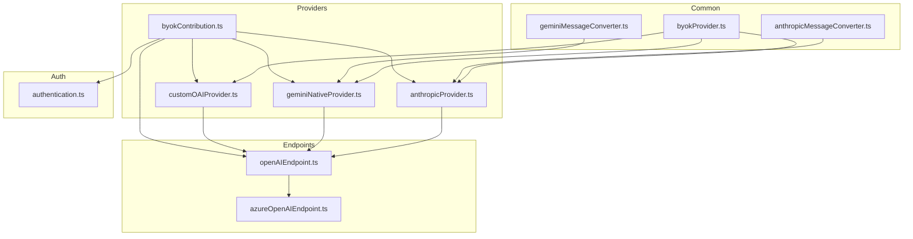

**Diagram sources**
- [byokProvider.ts](file://src/extension/byok/common/byokProvider.ts#L1-L229)
- [anthropicMessageConverter.ts](file://src/extension/byok/common/anthropicMessageConverter.ts#L1-L295)
- [geminiMessageConverter.ts](file://src/extension/byok/common/geminiMessageConverter.ts#L1-L326)
- [openAIEndpoint.ts](file://src/extension/byok/node/openAIEndpoint.ts#L1-L327)
- [azureOpenAIEndpoint.ts](file://src/extension/byok/node/azureOpenAIEndpoint.ts#L1-L24)
- [anthropicProvider.ts](file://src/extension/byok/vscode-node/anthropicProvider.ts#L1-L801)
- [geminiNativeProvider.ts](file://src/extension/byok/vscode-node/geminiNativeProvider.ts#L1-L511)
- [customOAIProvider.ts](file://src/extension/byok/vscode-node/customOAIProvider.ts#L1-L190)
- [byokContribution.ts](file://src/extension/byok/vscode-node/byokContribution.ts#L1-L81)
- [authentication.ts](file://src/platform/authentication/common/authentication.ts#L1-L341)

**Section sources**
- [byokContribution.ts](file://src/extension/byok/vscode-node/byokContribution.ts#L25-L81)
- [byokProvider.ts](file://src/extension/byok/common/byokProvider.ts#L12-L129)

## Core Components
- BYOK provider registry and model capability resolution
- Anthropic and Gemini message converters for cross-platform compatibility
- OpenAI-compatible endpoint adapter with strict header sanitization
- Azure-specific endpoint adapter supporting Entra ID
- Provider registration and authentication gating
- Authentication service abstraction for enterprise flows

Key responsibilities:
- Define BYOKAuthType and model capability interfaces
- Resolve model info from known models and user overrides
- Convert VS Code language model messages to provider-specific formats
- Construct endpoint bodies and headers with security safeguards
- Register providers conditionally based on authentication and environment

**Section sources**
- [byokProvider.ts](file://src/extension/byok/common/byokProvider.ts#L12-L129)
- [anthropicMessageConverter.ts](file://src/extension/byok/common/anthropicMessageConverter.ts#L91-L136)
- [geminiMessageConverter.ts](file://src/extension/byok/common/geminiMessageConverter.ts#L123-L201)
- [openAIEndpoint.ts](file://src/extension/byok/node/openAIEndpoint.ts#L55-L327)
- [azureOpenAIEndpoint.ts](file://src/extension/byok/node/azureOpenAIEndpoint.ts#L12-L23)
- [byokContribution.ts](file://src/extension/byok/vscode-node/byokContribution.ts#L48-L81)
- [authentication.ts](file://src/platform/authentication/common/authentication.ts#L32-L156)

## Architecture Overview
The BYOK architecture integrates authentication checks, provider registration, and endpoint communication with strict security controls.

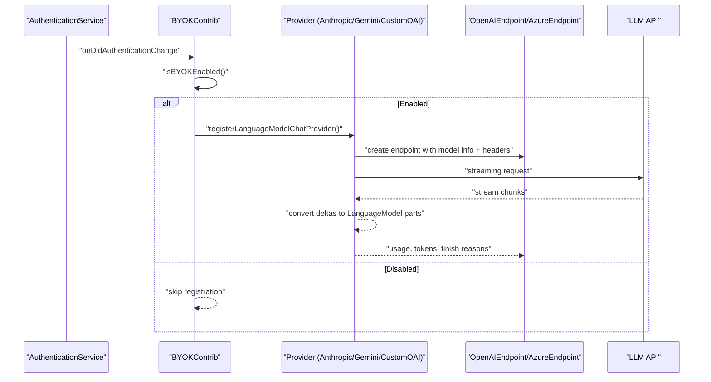

**Diagram sources**
- [byokContribution.ts](file://src/extension/byok/vscode-node/byokContribution.ts#L48-L81)
- [byokProvider.ts](file://src/extension/byok/common/byokProvider.ts#L156-L164)
- [anthropicProvider.ts](file://src/extension/byok/vscode-node/anthropicProvider.ts#L93-L527)
- [geminiNativeProvider.ts](file://src/extension/byok/vscode-node/geminiNativeProvider.ts#L76-L383)
- [openAIEndpoint.ts](file://src/extension/byok/node/openAIEndpoint.ts#L236-L327)
- [azureOpenAIEndpoint.ts](file://src/extension/byok/node/azureOpenAIEndpoint.ts#L12-L23)
- [authentication.ts](file://src/platform/authentication/common/authentication.ts#L158-L332)

## Detailed Component Analysis

### BYOK Provider Registry and Model Capability Resolution
- BYOKAuthType defines global API key, per-model deployment, and no-auth modes.
- BYOKKnownModels map model IDs to capabilities including token limits, tool calling, vision, thinking, and supported endpoints.
- resolveModelInfo merges user-provided capabilities, known models, and defaults to produce IChatModelInformation and LanguageModelChatInformation.

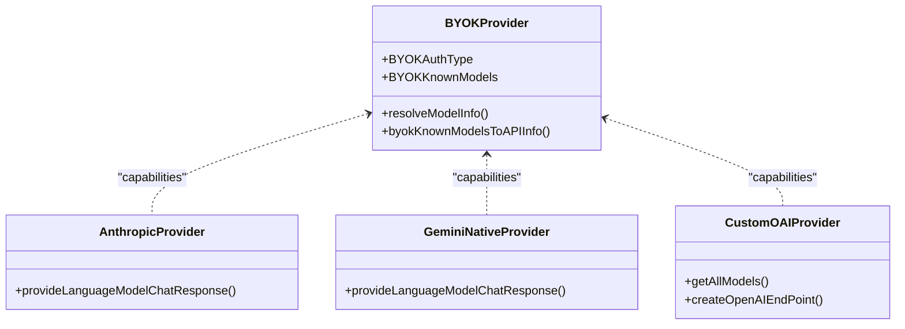

**Diagram sources**
- [byokProvider.ts](file://src/extension/byok/common/byokProvider.ts#L12-L154)
- [anthropicProvider.ts](file://src/extension/byok/vscode-node/anthropicProvider.ts#L29-L91)
- [geminiNativeProvider.ts](file://src/extension/byok/vscode-node/geminiNativeProvider.ts#L25-L74)
- [customOAIProvider.ts](file://src/extension/byok/vscode-node/customOAIProvider.ts#L70-L162)

**Section sources**
- [byokProvider.ts](file://src/extension/byok/common/byokProvider.ts#L12-L154)

### Anthropic Message Conversion for BYOK
- Converts VS Code LanguageModelChatMessage[] to Anthropic’s MessageParam[] and system text blocks.
- Merges adjacent messages by role and supports thinking, tool_use, tool_result, and image content.
- Provides logging-safe raw message conversion and preserves tool results as separate tool messages.

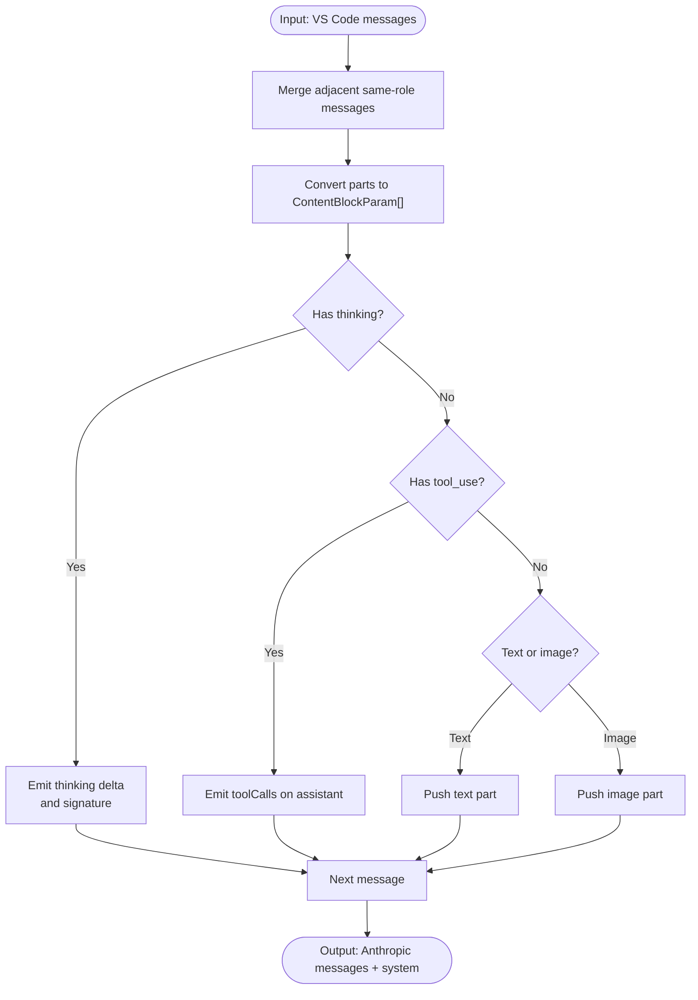

**Diagram sources**
- [anthropicMessageConverter.ts](file://src/extension/byok/common/anthropicMessageConverter.ts#L91-L136)

**Section sources**
- [anthropicMessageConverter.ts](file://src/extension/byok/common/anthropicMessageConverter.ts#L12-L136)

### Gemini Message Conversion for BYOK
- Converts VS Code messages to Gemini Content[] and optional systemInstruction.
- Handles functionCall/functionResponse pairing and ensures functionResponse parts appear in user role messages.
- Supports inlineData images and structured function responses with optional image payloads.

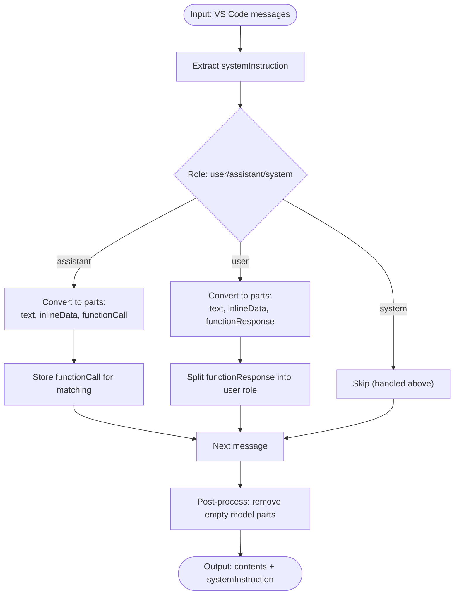

**Diagram sources**
- [geminiMessageConverter.ts](file://src/extension/byok/common/geminiMessageConverter.ts#L123-L201)

**Section sources**
- [geminiMessageConverter.ts](file://src/extension/byok/common/geminiMessageConverter.ts#L11-L201)

### OpenAI-Compatible Endpoint Adapter and Header Management
- OpenAIEndpoint constructs request bodies and headers with strict sanitization:
  - Reserved headers are disallowed (e.g., Authorization, api-key, Content-Type).
  - Custom headers are validated for name/value length, forbidden patterns, and control characters.
  - Supports Responses API and CAPI pathways with appropriate body adjustments.
- AzureOpenAIEndpoint overrides header generation to use Bearer token for Entra ID.

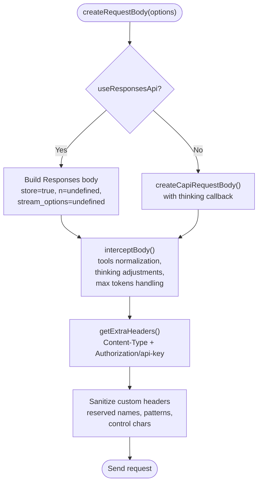

**Diagram sources**
- [openAIEndpoint.ts](file://src/extension/byok/node/openAIEndpoint.ts#L236-L327)

**Section sources**
- [openAIEndpoint.ts](file://src/extension/byok/node/openAIEndpoint.ts#L55-L327)
- [azureOpenAIEndpoint.ts](file://src/extension/byok/node/azureOpenAIEndpoint.ts#L12-L23)

### Provider Registration and Authentication Gating
- BYOKContrib registers providers only when authentication and environment allow BYOK.
- Known models list is fetched from a CDN and injected into providers.
- Authentication changes trigger re-evaluation of BYOK enablement.

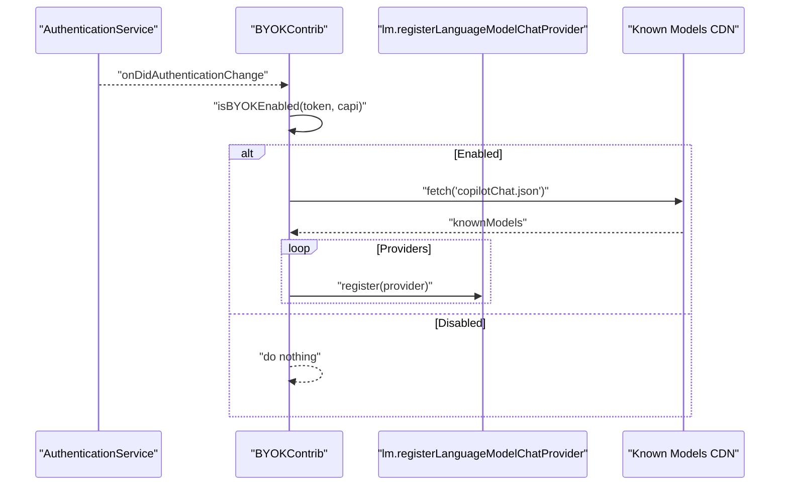

**Diagram sources**
- [byokContribution.ts](file://src/extension/byok/vscode-node/byokContribution.ts#L48-L81)
- [byokProvider.ts](file://src/extension/byok/common/byokProvider.ts#L156-L164)
- [authentication.ts](file://src/platform/authentication/common/authentication.ts#L158-L332)

**Section sources**
- [byokContribution.ts](file://src/extension/byok/vscode-node/byokContribution.ts#L25-L81)
- [authentication.ts](file://src/platform/authentication/common/authentication.ts#L32-L156)

### Anthropic Provider Implementation
- Fetches model list from Anthropic API and merges with known capabilities.
- Streams Anthropic responses, handling content_block_start/delta/stop events.
- Emits tool calls, tool results, citations, and thinking parts with signatures.
- Records telemetry and OTel metrics, including time-to-first-token and usage.

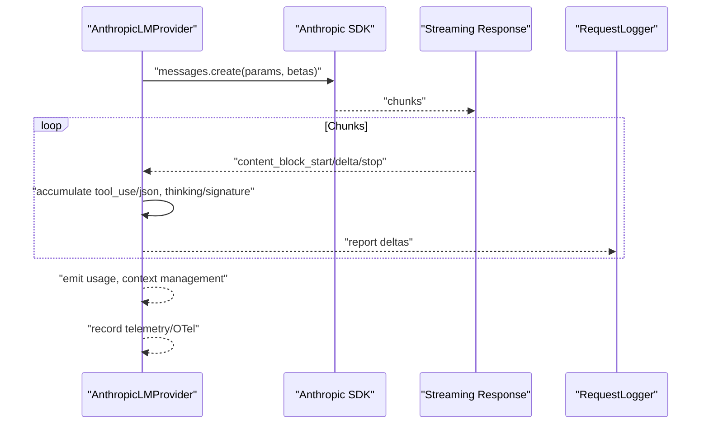

**Diagram sources**
- [anthropicProvider.ts](file://src/extension/byok/vscode-node/anthropicProvider.ts#L93-L527)

**Section sources**
- [anthropicProvider.ts](file://src/extension/byok/vscode-node/anthropicProvider.ts#L29-L527)

### Gemini Native Provider Implementation
- Converts messages to Gemini Content[] and systemInstruction.
- Streams Gemini responses, handling functionCall/functionResponse and thought signatures.
- Emits tool calls and tool results as distinct messages.
- Records telemetry and OTel metrics.

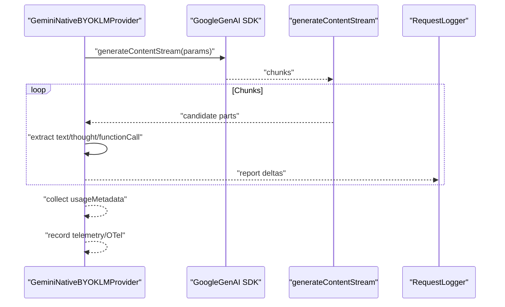

**Diagram sources**
- [geminiNativeProvider.ts](file://src/extension/byok/vscode-node/geminiNativeProvider.ts#L76-L383)

**Section sources**
- [geminiNativeProvider.ts](file://src/extension/byok/vscode-node/geminiNativeProvider.ts#L25-L383)

### Custom OpenAI-Compatible Provider
- Resolves custom endpoint URLs with sensible defaults (/v1/chat/completions or explicit /responses).
- Migrates legacy configurations and creates OpenAIEndpoint instances with model-specific capabilities.
- Supports requestHeaders propagation to endpoint.

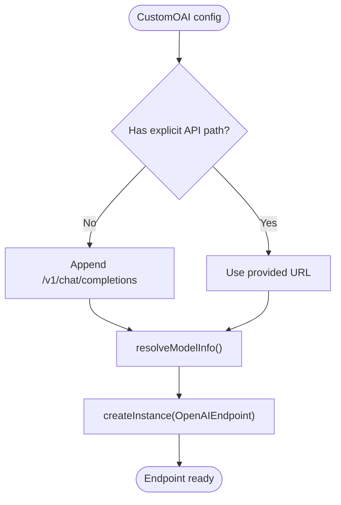

**Diagram sources**
- [customOAIProvider.ts](file://src/extension/byok/vscode-node/customOAIProvider.ts#L19-L162)

**Section sources**
- [customOAIProvider.ts](file://src/extension/byok/vscode-node/customOAIProvider.ts#L47-L162)

## Dependency Analysis
- BYOK providers depend on common converters and endpoint adapters.
- Endpoint adapters depend on configuration services and logging.
- Provider registration depends on authentication and environment checks.

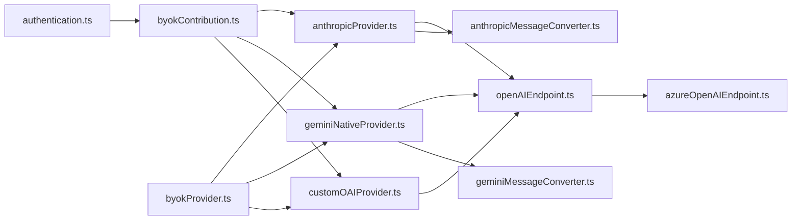

**Diagram sources**
- [authentication.ts](file://src/platform/authentication/common/authentication.ts#L1-L341)
- [byokContribution.ts](file://src/extension/byok/vscode-node/byokContribution.ts#L1-L81)
- [anthropicProvider.ts](file://src/extension/byok/vscode-node/anthropicProvider.ts#L1-L801)
- [geminiNativeProvider.ts](file://src/extension/byok/vscode-node/geminiNativeProvider.ts#L1-L511)
- [customOAIProvider.ts](file://src/extension/byok/vscode-node/customOAIProvider.ts#L1-L190)
- [openAIEndpoint.ts](file://src/extension/byok/node/openAIEndpoint.ts#L1-L327)
- [azureOpenAIEndpoint.ts](file://src/extension/byok/node/azureOpenAIEndpoint.ts#L1-L24)
- [anthropicMessageConverter.ts](file://src/extension/byok/common/anthropicMessageConverter.ts#L1-L295)
- [geminiMessageConverter.ts](file://src/extension/byok/common/geminiMessageConverter.ts#L1-L326)
- [byokProvider.ts](file://src/extension/byok/common/byokProvider.ts#L1-L229)

**Section sources**
- [byokContribution.ts](file://src/extension/byok/vscode-node/byokContribution.ts#L25-L81)
- [openAIEndpoint.ts](file://src/extension/byok/node/openAIEndpoint.ts#L55-L327)

## Performance Considerations
- Streaming: Both Anthropic and Gemini providers stream responses to minimize latency; ensure network stability and handle cancellations gracefully.
- Tokenization: Providers estimate token counts; actual tokenizers may differ, leading to slight over/under estimates.
- Usage reporting: Endpoint adapters and providers collect usage metrics; ensure accurate token accounting for cost control.
- Header sanitization: Excessive or invalid custom headers are rejected; keep custom headers minimal and valid to avoid request failures.

[No sources needed since this section provides general guidance]

## Troubleshooting Guide
Common issues and resolutions:
- BYOK not appearing
  - Verify authentication and environment allow BYOK; check BYOK enablement logic and authentication change events.
  - Confirm providers are registered after onDidAuthenticationChange fires.
- Authentication failures
  - Ensure correct scopes and sessions; minimal mode disables permissive sessions.
  - For Azure, confirm Entra ID token is used instead of API key header.
- Custom endpoint misconfiguration
  - Use explicit API paths or rely on URL resolution logic.
  - Validate requestHeaders for reserved names and forbidden patterns.
- Rate limits and errors
  - Endpoint adapter normalizes rate limit and stream error messages for display.
- Telemetry and tracing
  - Providers record OTel spans and telemetry; inspect spans for usage and finish reasons.

**Section sources**
- [byokContribution.ts](file://src/extension/byok/vscode-node/byokContribution.ts#L48-L81)
- [authentication.ts](file://src/platform/authentication/common/authentication.ts#L32-L156)
- [openAIEndpoint.ts](file://src/extension/byok/node/openAIEndpoint.ts#L21-L41)
- [azureOpenAIEndpoint.ts](file://src/extension/byok/node/azureOpenAIEndpoint.ts#L12-L23)
- [customOAIProvider.ts](file://src/extension/byok/vscode-node/customOAIProvider.ts#L19-L45)

## Conclusion
The BYOK and enterprise authentication system integrates secure provider registration, strict header sanitization, and robust message conversion for Anthropic and Gemini. It supports custom OpenAI-compatible endpoints, enterprise authentication flows, and detailed telemetry/tracing. By following the configuration patterns and security guidelines outlined here, organizations can deploy BYOK with confidence in enterprise environments.

[No sources needed since this section summarizes without analyzing specific files]

## Appendices

### Practical Examples

- Configure a Custom OpenAI-compatible endpoint
  - Provide a base URL or explicit API path; the resolver appends defaults when needed.
  - Define model capabilities (tokens, tool calling, vision, thinking, requestHeaders).
  - Create endpoint with model info and register provider.

  **Section sources**
  - [customOAIProvider.ts](file://src/extension/byok/vscode-node/customOAIProvider.ts#L19-L162)

- Handle enterprise authentication and SSO
  - Gate BYOK registration on authentication and environment checks.
  - Use authentication change events to re-register providers when conditions change.
  - For Azure, use Entra ID tokens via the Azure endpoint adapter.

  **Section sources**
  - [byokContribution.ts](file://src/extension/byok/vscode-node/byokContribution.ts#L48-L81)
  - [authentication.ts](file://src/platform/authentication/common/authentication.ts#L158-L332)
  - [azureOpenAIEndpoint.ts](file://src/extension/byok/node/azureOpenAIEndpoint.ts#L12-L23)

- Implement custom authentication providers
  - Extend the BYOK provider pattern: define model capabilities, convert messages, and create endpoints.
  - Respect reserved headers and sanitize custom headers.
  - Integrate with telemetry and logging for observability.

  **Section sources**
  - [byokProvider.ts](file://src/extension/byok/common/byokProvider.ts#L12-L129)
  - [openAIEndpoint.ts](file://src/extension/byok/node/openAIEndpoint.ts#L140-L208)

### Security Considerations
- Certificate management
  - Ensure trust stores include enterprise CA certificates for internal endpoints.
- Proxy configuration
  - Configure HTTP/HTTPS proxies in the environment; avoid setting forbidden headers.
- Header restrictions
  - Reserved headers and forbidden patterns are rejected; use only allowed custom headers.
- Zero data retention
  - Some models support zero data retention; adjust endpoint behavior accordingly.

**Section sources**
- [openAIEndpoint.ts](file://src/extension/byok/node/openAIEndpoint.ts#L56-L102)
- [openAIEndpoint.ts](file://src/extension/byok/node/openAIEndpoint.ts#L140-L208)

### Migration from Hosted to BYOK
- Providers fetch known models from a CDN; ensure your BYOK configuration aligns with the known model list.
- Migrate legacy configurations using the custom provider’s migration routine.
- Validate endpoint URLs and authentication methods for your environment.

**Section sources**
- [byokContribution.ts](file://src/extension/byok/vscode-node/byokContribution.ts#L67-L80)
- [customOAIProvider.ts](file://src/extension/byok/vscode-node/customOAIProvider.ts#L86-L109)