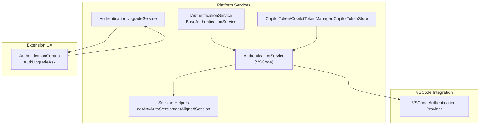
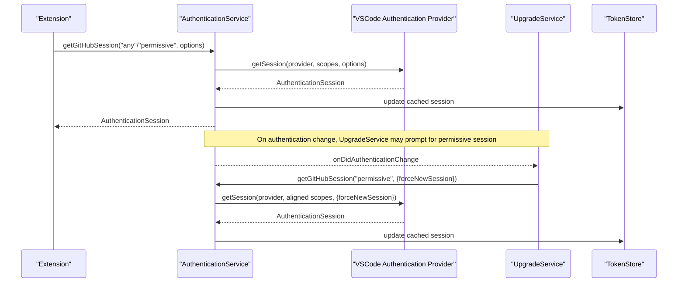
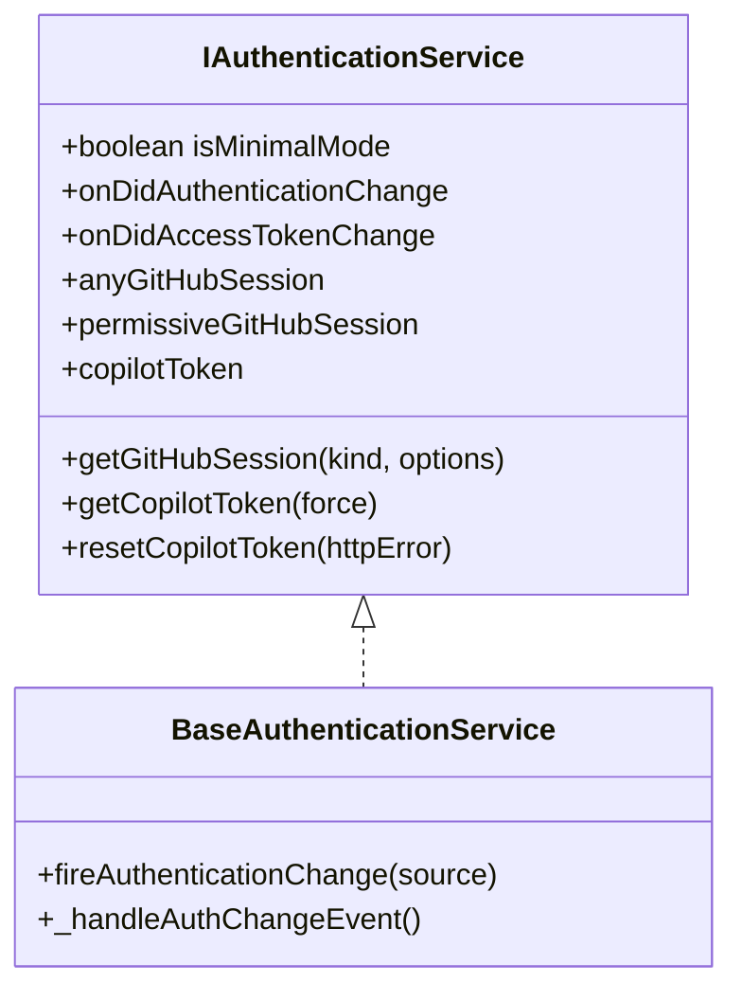
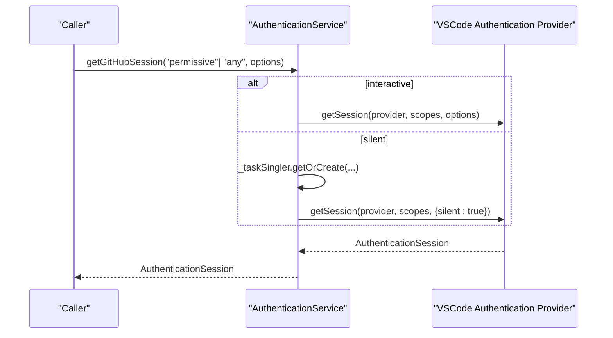
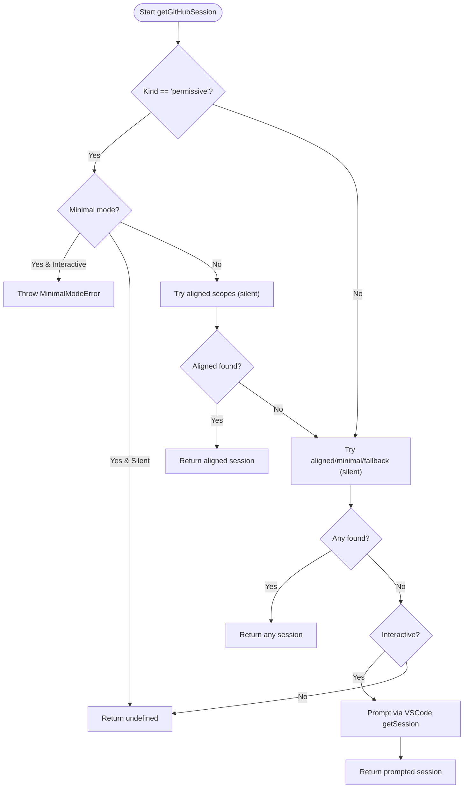
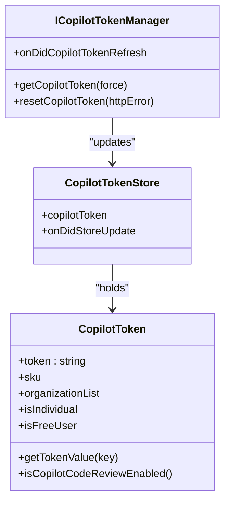
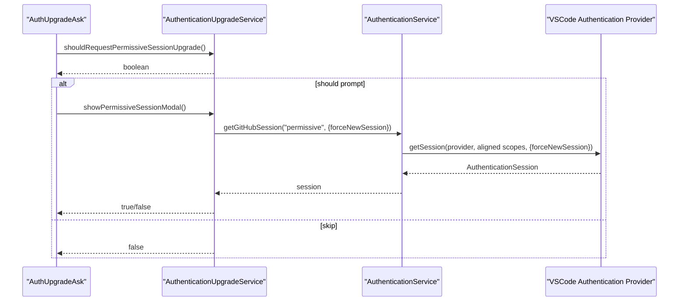
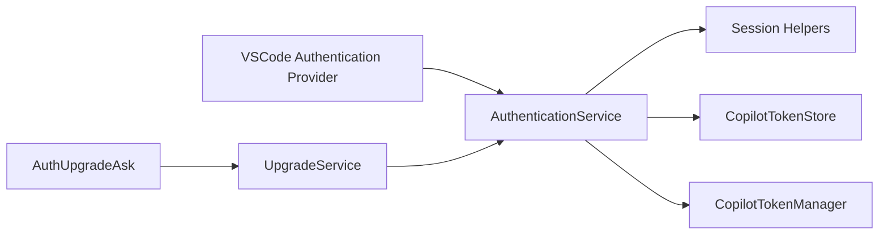

# GitHub Authentication

<cite>
**Referenced Files in This Document**
- [authentication.ts](file://src/platform/authentication/common/authentication.ts)
- [authenticationService.ts](file://src/platform/authentication/vscode-node/authenticationService.ts)
- [session.ts](file://src/platform/authentication/vscode-node/session.ts)
- [authentication.contribution.ts](file://src/extension/authentication/vscode-node/authentication.contribution.ts)
- [authenticationUpgrade.ts](file://src/platform/authentication/common/authenticationUpgrade.ts)
- [authenticationUpgradeService.ts](file://src/platform/authentication/common/authenticationUpgradeService.ts)
- [copilotToken.ts](file://src/platform/authentication/common/copilotToken.ts)
- [copilotTokenManager.ts](file://src/platform/authentication/common/copilotTokenManager.ts)
- [copilotTokenStore.ts](file://src/platform/authentication/common/copilotTokenStore.ts)
- [session.test.ts](file://src/extension/test/vscode-node/session.test.ts)
</cite>

## Table of Contents
1. [Introduction](#introduction)
2. [Project Structure](#project-structure)
3. [Core Components](#core-components)
4. [Architecture Overview](#architecture-overview)
5. [Detailed Component Analysis](#detailed-component-analysis)
6. [Dependency Analysis](#dependency-analysis)
7. [Performance Considerations](#performance-considerations)
8. [Troubleshooting Guide](#troubleshooting-guide)
9. [Conclusion](#conclusion)
10. [Appendices](#appendices)

## Introduction
This document explains the GitHub authentication system used by the extension, focusing on how users log in, how tokens are acquired and refreshed, and how the system integrates with VSCode’s authentication provider API. It covers:
- Interactive and silent authentication modes
- Differences between “permissive” and “any” GitHub sessions
- Authentication scopes (read:user, user:email, repo, workflow)
- Minimal mode functionality
- The authentication service interface, session management, and event handling
- Practical examples for VSCode extensions
- Token refresh mechanisms, session persistence, and security considerations

## Project Structure
The authentication system is split between platform services and extension contributions:
- Platform services define the authentication interface, token handling, and session selection logic
- VSCode-specific implementations integrate with VSCode’s authentication provider
- Extension contributions manage UX prompts and upgrades

**Diagram sources**
- [authentication.ts](file://src/platform/authentication/common/authentication.ts#L32-L156)
- [authenticationService.ts](file://src/platform/authentication/vscode-node/authenticationService.ts#L16-L75)
- [session.ts](file://src/platform/authentication/vscode-node/session.ts#L25-L113)
- [copilotToken.ts](file://src/platform/authentication/common/copilotToken.ts#L67-L238)
- [copilotTokenManager.ts](file://src/platform/authentication/common/copilotTokenManager.ts#L10-L43)
- [copilotTokenStore.ts](file://src/platform/authentication/common/copilotTokenStore.ts#L11-L40)
- [authenticationUpgradeService.ts](file://src/platform/authentication/common/authenticationUpgradeService.ts#L21-L222)
- [authentication.contribution.ts](file://src/extension/authentication/vscode-node/authentication.contribution.ts#L17-L108)

**Section sources**
- [authentication.ts](file://src/platform/authentication/common/authentication.ts#L1-L341)
- [authenticationService.ts](file://src/platform/authentication/vscode-node/authenticationService.ts#L1-L76)
- [session.ts](file://src/platform/authentication/vscode-node/session.ts#L1-L120)
- [authentication.contribution.ts](file://src/extension/authentication/vscode-node/authentication.contribution.ts#L1-L109)
- [authenticationUpgrade.ts](file://src/platform/authentication/common/authenticationUpgrade.ts#L1-L46)
- [authenticationUpgradeService.ts](file://src/platform/authentication/common/authenticationUpgradeService.ts#L1-L223)
- [copilotToken.ts](file://src/platform/authentication/common/copilotToken.ts#L1-L615)
- [copilotTokenManager.ts](file://src/platform/authentication/common/copilotTokenManager.ts#L1-L60)
- [copilotTokenStore.ts](file://src/platform/authentication/common/copilotTokenStore.ts#L1-L41)

## Core Components
- Authentication service interface and base implementation:
  - Defines the contract for acquiring GitHub sessions (“any” vs “permissive”), token handling, and event emission for authentication changes
  - Exposes events for authentication and access token changes
- VSCode-specific authentication service:
  - Wraps VSCode’s authentication provider and manages session retrieval with single-flight requests
  - Subscribes to VSCode’s session change events and domain changes
- Session helpers:
  - Select appropriate scopes depending on permissions and availability
  - Support silent retrieval, forced new sessions, and account picker behavior
- Token management:
  - Token envelope parsing, validation, and feature flags
  - Token store and refresh lifecycle
- Upgrade service:
  - Determines when to prompt users for a more permissive session
  - Provides UX for granting or deferring permission

**Section sources**
- [authentication.ts](file://src/platform/authentication/common/authentication.ts#L32-L156)
- [authenticationService.ts](file://src/platform/authentication/vscode-node/authenticationService.ts#L16-L75)
- [session.ts](file://src/platform/authentication/vscode-node/session.ts#L25-L113)
- [copilotToken.ts](file://src/platform/authentication/common/copilotToken.ts#L67-L238)
- [copilotTokenManager.ts](file://src/platform/authentication/common/copilotTokenManager.ts#L10-L43)
- [copilotTokenStore.ts](file://src/platform/authentication/common/copilotTokenStore.ts#L11-L40)
- [authenticationUpgradeService.ts](file://src/platform/authentication/common/authenticationUpgradeService.ts#L21-L222)

## Architecture Overview
The system orchestrates GitHub authentication through VSCode’s provider, with internal caching and event-driven updates.

**Diagram sources**
- [authenticationService.ts](file://src/platform/authentication/vscode-node/authenticationService.ts#L43-L59)
- [session.ts](file://src/platform/authentication/vscode-node/session.ts#L25-L55)
- [authenticationUpgradeService.ts](file://src/platform/authentication/common/authenticationUpgradeService.ts#L86-L107)
- [copilotTokenStore.ts](file://src/platform/authentication/common/copilotTokenStore.ts#L30-L39)

## Detailed Component Analysis

### Authentication Service Interface and Events
- Purpose:
  - Provide a unified interface to acquire GitHub sessions with different permission levels
  - Emit events when authentication state changes to keep dependent services in sync
- Key capabilities:
  - “any” session: minimal scopes sufficient for basic Copilot usage
  - “permissive” session: aligned scopes enabling broader repository access
  - Silent vs interactive flows via options
  - Minimal mode: restricts “permissive” acquisition to avoid prompting
- Events:
  - onDidAuthenticationChange: fires when sessions or tokens change
  - onDidAccessTokenChange: fires when access token changes
  - onDidAdoAuthenticationChange: separate ADO event

**Diagram sources**
- [authentication.ts](file://src/platform/authentication/common/authentication.ts#L32-L156)
- [authentication.ts](file://src/platform/authentication/common/authentication.ts#L158-L332)

**Section sources**
- [authentication.ts](file://src/platform/authentication/common/authentication.ts#L32-L156)
- [authentication.ts](file://src/platform/authentication/common/authentication.ts#L158-L332)

### VSCode Authentication Service Implementation
- Responsibilities:
  - Subscribe to VSCode authentication and domain change events
  - Single-flight session retrieval to avoid concurrent flows
  - Cache and expose “any” and “permissive” sessions
- Behavior:
  - Uses provider ID determined by configuration (GitHub or GitHub Enterprise)
  - For “permissive” sessions, prefers aligned scopes; for “any”, starts with minimal and falls back

**Diagram sources**
- [authenticationService.ts](file://src/platform/authentication/vscode-node/authenticationService.ts#L43-L59)
- [session.ts](file://src/platform/authentication/vscode-node/session.ts#L25-L55)

**Section sources**
- [authenticationService.ts](file://src/platform/authentication/vscode-node/authenticationService.ts#L16-L75)

### Session Selection Logic: Any vs Permissive
- “Any” session:
  - Attempts aligned scopes first (when not in minimal mode), then minimal scopes, then legacy scope
  - Suitable for read-only, public data access
- “Permissive” session:
  - Requires aligned scopes; throws in minimal mode for interactive flows
  - Supports forced new session with explicit user confirmation
- Silent vs interactive:
  - Silent: returns cached or existing session without UI
  - Interactive: triggers VSCode UI to sign in or pick an account

**Diagram sources**
- [session.ts](file://src/platform/authentication/vscode-node/session.ts#L63-L90)
- [session.ts](file://src/platform/authentication/vscode-node/session.ts#L99-L113)
- [authentication.ts](file://src/platform/authentication/common/authentication.ts#L25-L30)

**Section sources**
- [session.ts](file://src/platform/authentication/vscode-node/session.ts#L25-L113)
- [authentication.ts](file://src/platform/authentication/common/authentication.ts#L25-L30)

### Authentication Scopes and Minimal Mode
- Scopes:
  - Minimal: user:email (required for Copilot)
  - Legacy: read:user
  - Aligned: read:user, user:email, repo, workflow (recommended for richer features)
- Minimal mode:
  - Disables “permissive” interactive acquisition and returns undefined for silent requests
  - Useful for environments requiring least privilege

**Section sources**
- [authentication.ts](file://src/platform/authentication/common/authentication.ts#L16-L24)
- [session.ts](file://src/platform/authentication/vscode-node/session.ts#L100-L105)

### Token Management and Refresh
- Copilot token:
  - Envelope parsing and validation with strict and fallback strategies
  - Feature flags and organization metadata embedded in token
- Token store:
  - Centralized storage for token updates and cross-service access
- Token manager:
  - Provides refresh lifecycle and event emission for downstream services

**Diagram sources**
- [copilotToken.ts](file://src/platform/authentication/common/copilotToken.ts#L67-L238)
- [copilotTokenManager.ts](file://src/platform/authentication/common/copilotTokenManager.ts#L10-L43)
- [copilotTokenStore.ts](file://src/platform/authentication/common/copilotTokenStore.ts#L11-L40)

**Section sources**
- [copilotToken.ts](file://src/platform/authentication/common/copilotToken.ts#L67-L238)
- [copilotTokenManager.ts](file://src/platform/authentication/common/copilotTokenManager.ts#L10-L43)
- [copilotTokenStore.ts](file://src/platform/authentication/common/copilotTokenStore.ts#L11-L40)

### Authentication Upgrade UX
- Purpose:
  - Prompt users to grant a more permissive session when needed for repository access
- Flow:
  - Decide whether to prompt based on minimal mode, existing sessions, and repository access
  - Present a confirmation dialog and act on user choice (grant, not now, never ask again)
  - Optionally integrate with chat UI for inline confirmation

**Diagram sources**
- [authentication.contribution.ts](file://src/extension/authentication/vscode-node/authentication.contribution.ts#L46-L107)
- [authenticationUpgradeService.ts](file://src/platform/authentication/common/authenticationUpgradeService.ts#L52-L107)

**Section sources**
- [authentication.contribution.ts](file://src/extension/authentication/vscode-node/authentication.contribution.ts#L17-L108)
- [authenticationUpgrade.ts](file://src/platform/authentication/common/authenticationUpgrade.ts#L11-L45)
- [authenticationUpgradeService.ts](file://src/platform/authentication/common/authenticationUpgradeService.ts#L21-L222)

### Practical Examples for VSCode Extensions
- Acquire a session silently for background operations:
  - Call the authentication service with silent options to avoid UI interruptions
- Prompt the user for a permissive session when repository access is required:
  - Use the upgrade service to present a confirmation dialog and then acquire the session
- React to authentication changes:
  - Subscribe to onDidAuthenticationChange to refresh token state and UI

**Section sources**
- [authenticationService.ts](file://src/platform/authentication/vscode-node/authenticationService.ts#L43-L59)
- [authenticationUpgradeService.ts](file://src/platform/authentication/common/authenticationUpgradeService.ts#L86-L107)
- [authentication.ts](file://src/platform/authentication/common/authentication.ts#L161-L168)

## Dependency Analysis
- Coupling:
  - VSCode authentication service depends on VSCode’s authentication provider and configuration service
  - Token store decouples token access from the authentication service to prevent cycles
- Cohesion:
  - Session selection logic is centralized in session helpers
  - Token management is encapsulated in token manager/store
- External integration:
  - Uses VSCode’s authentication provider registration and session events

**Diagram sources**
- [authenticationService.ts](file://src/platform/authentication/vscode-node/authenticationService.ts#L16-L41)
- [session.ts](file://src/platform/authentication/vscode-node/session.ts#L25-L55)
- [copilotTokenStore.ts](file://src/platform/authentication/common/copilotTokenStore.ts#L24-L40)
- [copilotTokenManager.ts](file://src/platform/authentication/common/copilotTokenManager.ts#L10-L43)
- [authenticationUpgradeService.ts](file://src/platform/authentication/common/authenticationUpgradeService.ts#L21-L50)
- [authentication.contribution.ts](file://src/extension/authentication/vscode-node/authentication.contribution.ts#L17-L26)

**Section sources**
- [authenticationService.ts](file://src/platform/authentication/vscode-node/authenticationService.ts#L16-L41)
- [session.ts](file://src/platform/authentication/vscode-node/session.ts#L25-L55)
- [copilotTokenStore.ts](file://src/platform/authentication/common/copilotTokenStore.ts#L24-L40)
- [copilotTokenManager.ts](file://src/platform/authentication/common/copilotTokenManager.ts#L10-L43)
- [authenticationUpgradeService.ts](file://src/platform/authentication/common/authenticationUpgradeService.ts#L21-L50)
- [authentication.contribution.ts](file://src/extension/authentication/vscode-node/authentication.contribution.ts#L17-L26)

## Performance Considerations
- Single-flight requests:
  - The authentication service uses a task singler to avoid concurrent session acquisition
- Silent-first strategy:
  - Prefer silent retrieval to minimize UI churn and reduce latency
- Event-driven updates:
  - React to onDidAuthenticationChange to avoid polling and keep state synchronized

**Section sources**
- [authenticationService.ts](file://src/platform/authentication/vscode-node/authenticationService.ts#L17-L17)
- [authentication.ts](file://src/platform/authentication/common/authentication.ts#L276-L331)

## Troubleshooting Guide
Common issues and resolutions:
- No session acquired:
  - Ensure silent retrieval returns a session; if not, trigger interactive flow with explicit options
- Minimal mode prevents permissive acquisition:
  - Switch to “any” sessions or adjust permissions configuration
- Authentication state not updating:
  - Subscribe to onDidAuthenticationChange and refresh token state accordingly
- Token refresh failures:
  - Reset token via the token manager and retry; inspect error envelopes for actionable messages

**Section sources**
- [session.ts](file://src/platform/authentication/vscode-node/session.ts#L25-L55)
- [authentication.ts](file://src/platform/authentication/common/authentication.ts#L25-L30)
- [authentication.ts](file://src/platform/authentication/common/authentication.ts#L276-L331)
- [copilotToken.ts](file://src/platform/authentication/common/copilotToken.ts#L349-L386)

## Conclusion
The GitHub authentication system integrates tightly with VSCode’s authentication provider to deliver flexible, secure, and user-friendly sign-in experiences. By distinguishing between “any” and “permissive” sessions, supporting silent and interactive flows, and providing robust token management and event handling, the system enables extensions to reliably access GitHub resources while respecting user preferences and security constraints.

## Appendices

### Authentication Scopes Reference
- Minimal: user:email
- Legacy: read:user
- Aligned: read:user, user:email, repo, workflow

**Section sources**
- [authentication.ts](file://src/platform/authentication/common/authentication.ts#L16-L24)

### Example: Implementing GitHub Authentication in a VSCode Extension
- Acquire a session:
  - Use the authentication service to get a session with desired kind and options
- Handle authentication changes:
  - Listen to onDidAuthenticationChange to update UI and token state
- Manage upgrades:
  - Use the upgrade service to prompt users for permissive sessions when repository access is needed

**Section sources**
- [authenticationService.ts](file://src/platform/authentication/vscode-node/authenticationService.ts#L43-L59)
- [authentication.ts](file://src/platform/authentication/common/authentication.ts#L161-L168)
- [authenticationUpgradeService.ts](file://src/platform/authentication/common/authenticationUpgradeService.ts#L86-L107)

### Security Considerations
- Least privilege:
  - Prefer “any” sessions when possible; only request “permissive” when repository access is required
- Minimal mode:
  - Use minimal mode to enforce restricted access in sensitive environments
- Token handling:
  - Store tokens securely and avoid exposing them in logs or telemetry
  - Reset tokens on HTTP errors to prevent continued use of invalid credentials

**Section sources**
- [authentication.ts](file://src/platform/authentication/common/authentication.ts#L37-L43)
- [copilotToken.ts](file://src/platform/authentication/common/copilotToken.ts#L349-L386)