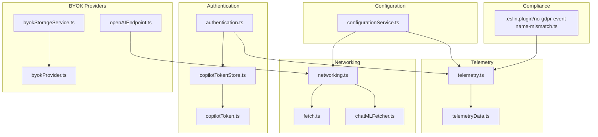
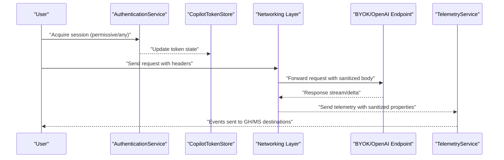
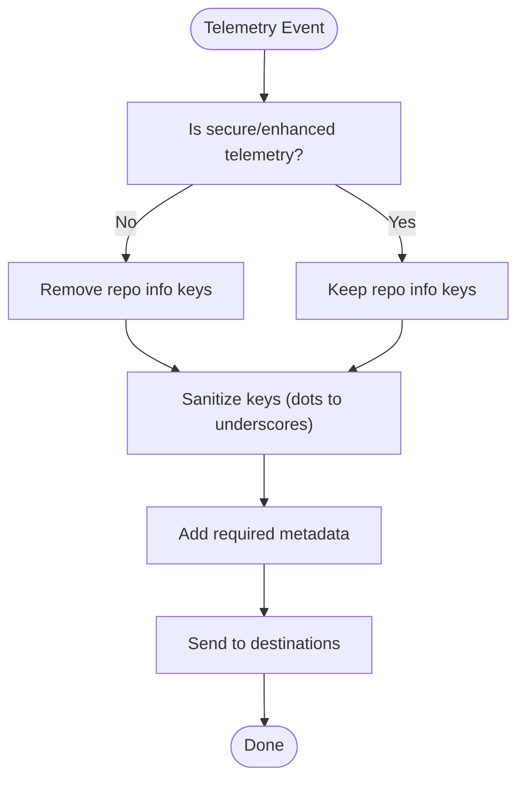
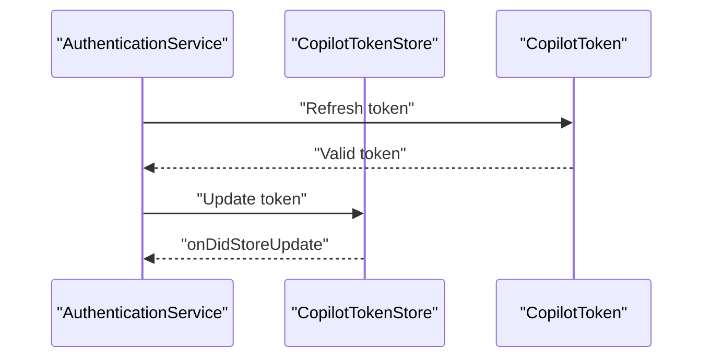
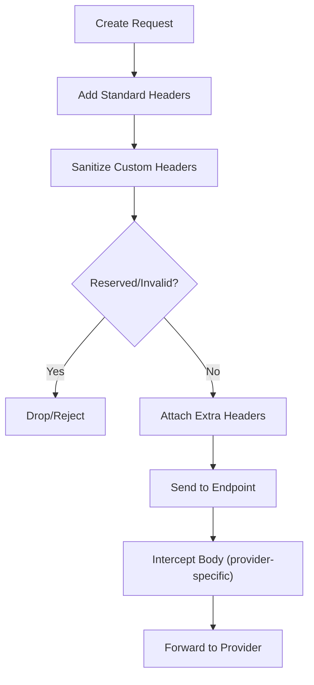
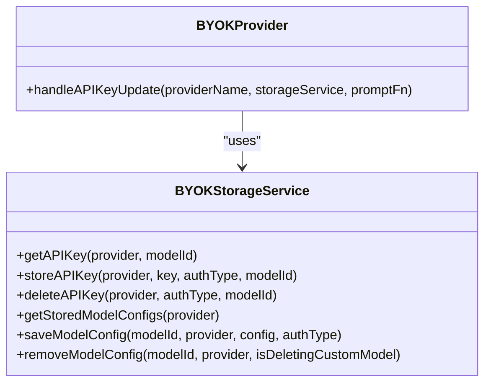
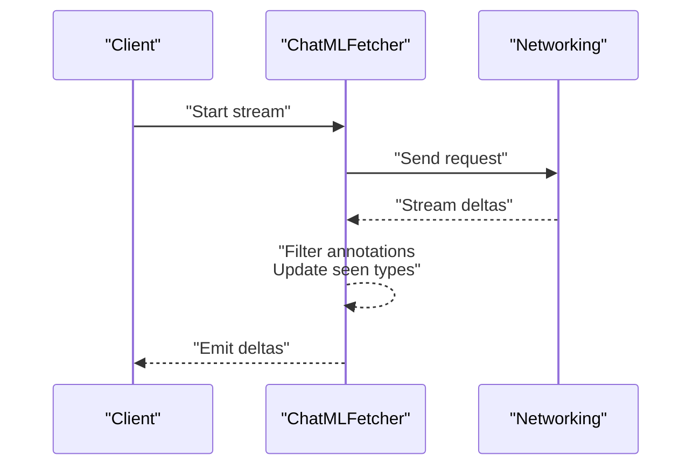
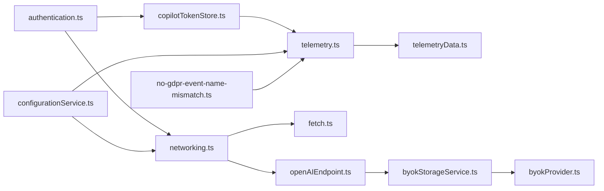

# Security & Privacy

<cite>
**Referenced Files in This Document**
- [SECURITY.md](file://SECURITY.md)
- [README.md](file://README.md)
- [src/platform/telemetry/common/telemetry.ts](file://src/platform/telemetry/common/telemetry.ts)
- [src/platform/telemetry/common/telemetryData.ts](file://src/platform/telemetry/common/telemetryData.ts)
- [src/platform/authentication/common/authentication.ts](file://src/platform/authentication/common/authentication.ts)
- [src/platform/authentication/common/copilotTokenStore.ts](file://src/platform/authentication/common/copilotTokenStore.ts)
- [src/platform/authentication/common/copilotToken.ts](file://src/platform/authentication/common/copilotToken.ts)
- [src/platform/configuration/common/configurationService.ts](file://src/platform/configuration/common/configurationService.ts)
- [src/platform/networking/common/networking.ts](file://src/platform/networking/common/networking.ts)
- [src/platform/networking/common/fetch.ts](file://src/platform/networking/common/fetch.ts)
- [src/platform/chat/common/chatMLFetcher.ts](file://src/platform/chat/common/chatMLFetcher.ts)
- [src/extension/byok/node/openAIEndpoint.ts](file://src/extension/byok/node/openAIEndpoint.ts)
- [src/extension/byok/vscode-node/byokStorageService.ts](file://src/extension/byok/vscode-node/byokStorageService.ts)
- [src/extension/byok/common/byokProvider.ts](file://src/extension/byok/common/byokProvider.ts)
- [.eslintplugin/no-gdpr-event-name-mismatch.ts](file://.eslintplugin/no-gdpr-event-name-mismatch.ts)
</cite>

## Table of Contents
1. [Introduction](#introduction)
2. [Project Structure](#project-structure)
3. [Core Components](#core-components)
4. [Architecture Overview](#architecture-overview)
5. [Detailed Component Analysis](#detailed-component-analysis)
6. [Dependency Analysis](#dependency-analysis)
7. [Performance Considerations](#performance-considerations)
8. [Troubleshooting Guide](#troubleshooting-guide)
9. [Conclusion](#conclusion)
10. [Appendices](#appendices)

## Introduction
This document provides comprehensive security and privacy guidance for the AI-assisted development environment. It focuses on how the system protects user data, secures communications, manages credentials, and complies with privacy expectations. It also outlines telemetry policies, consent mechanisms, and operational controls such as secure deletion and monitoring.

## Project Structure
Security and privacy controls are implemented across several layers:
- Telemetry and consent management
- Authentication and token handling
- Network request security and sanitization
- Secure credential storage
- Configuration-driven privacy controls
- Code quality enforcement for privacy annotations

**Diagram sources**
- [src/platform/telemetry/common/telemetry.ts](file://src/platform/telemetry/common/telemetry.ts#L112-L134)
- [src/platform/telemetry/common/telemetryData.ts](file://src/platform/telemetry/common/telemetryData.ts#L12-L211)
- [src/platform/authentication/common/authentication.ts](file://src/platform/authentication/common/authentication.ts#L32-L156)
- [src/platform/authentication/common/copilotTokenStore.ts](file://src/platform/authentication/common/copilotTokenStore.ts#L18-L40)
- [src/platform/authentication/common/copilotToken.ts](file://src/platform/authentication/common/copilotToken.ts#L178-L226)
- [src/platform/networking/common/networking.ts](file://src/platform/networking/common/networking.ts#L348-L431)
- [src/platform/networking/common/fetch.ts](file://src/platform/networking/common/fetch.ts#L23-L32)
- [src/platform/chat/common/chatMLFetcher.ts](file://src/platform/chat/common/chatMLFetcher.ts#L82-L122)
- [src/extension/byok/node/openAIEndpoint.ts](file://src/extension/byok/node/openAIEndpoint.ts#L55-L102)
- [src/extension/byok/vscode-node/byokStorageService.ts](file://src/extension/byok/vscode-node/byokStorageService.ts#L58-L169)
- [src/extension/byok/common/byokProvider.ts](file://src/extension/byok/common/byokProvider.ts#L187-L213)
- [src/platform/configuration/common/configurationService.ts](file://src/platform/configuration/common/configurationService.ts#L624-L744)
- [.eslintplugin/no-gdpr-event-name-mismatch.ts](file://.eslintplugin/no-gdpr-event-name-mismatch.ts#L58-L83)

**Section sources**
- [src/platform/telemetry/common/telemetry.ts](file://src/platform/telemetry/common/telemetry.ts#L112-L134)
- [src/platform/telemetry/common/telemetryData.ts](file://src/platform/telemetry/common/telemetryData.ts#L12-L211)
- [src/platform/authentication/common/authentication.ts](file://src/platform/authentication/common/authentication.ts#L32-L156)
- [src/platform/authentication/common/copilotTokenStore.ts](file://src/platform/authentication/common/copilotTokenStore.ts#L18-L40)
- [src/platform/authentication/common/copilotToken.ts](file://src/platform/authentication/common/copilotToken.ts#L178-L226)
- [src/platform/networking/common/networking.ts](file://src/platform/networking/common/networking.ts#L348-L431)
- [src/platform/networking/common/fetch.ts](file://src/platform/networking/common/fetch.ts#L23-L32)
- [src/platform/chat/common/chatMLFetcher.ts](file://src/platform/chat/common/chatMLFetcher.ts#L82-L122)
- [src/extension/byok/node/openAIEndpoint.ts](file://src/extension/byok/node/openAIEndpoint.ts#L55-L102)
- [src/extension/byok/vscode-node/byokStorageService.ts](file://src/extension/byok/vscode-node/byokStorageService.ts#L58-L169)
- [src/extension/byok/common/byokProvider.ts](file://src/extension/byok/common/byokProvider.ts#L187-L213)
- [src/platform/configuration/common/configurationService.ts](file://src/platform/configuration/common/configurationService.ts#L624-L744)
- [.eslintplugin/no-gdpr-event-name-mismatch.ts](file://.eslintplugin/no-gdpr-event-name-mismatch.ts#L58-L83)

## Core Components
- Telemetry service and user consent
  - Telemetry interfaces and destinations are defined to separate Microsoft and GitHub channels and to honor user opt-in/out.
  - Telemetry data sanitization and GDPR exemptions are enforced.
- Authentication and token lifecycle
  - Authentication service exposes session and token access with minimal-mode safeguards.
  - Token store decouples token state from authentication service to avoid cyclic dependencies.
- Network security and request sanitization
  - Requests include standardized headers and sanitized bodies; BYOK endpoints enforce reserved headers and value validation.
- Secure credential storage
  - BYOK provider storage uses VS Code secrets for API keys and global state for model configs.
- Configuration-driven privacy controls
  - Settings govern telemetry behavior and provider permissions.
- Compliance enforcement
  - ESLint plugin validates GDPR annotation consistency with telemetry event names.

**Section sources**
- [src/platform/telemetry/common/telemetry.ts](file://src/platform/telemetry/common/telemetry.ts#L112-L134)
- [src/platform/telemetry/common/telemetryData.ts](file://src/platform/telemetry/common/telemetryData.ts#L12-L211)
- [src/platform/authentication/common/authentication.ts](file://src/platform/authentication/common/authentication.ts#L32-L156)
- [src/platform/authentication/common/copilotTokenStore.ts](file://src/platform/authentication/common/copilotTokenStore.ts#L18-L40)
- [src/platform/networking/common/networking.ts](file://src/platform/networking/common/networking.ts#L348-L431)
- [src/extension/byok/vscode-node/byokStorageService.ts](file://src/extension/byok/vscode-node/byokStorageService.ts#L58-L169)
- [src/platform/configuration/common/configurationService.ts](file://src/platform/configuration/common/configurationService.ts#L624-L744)
- [.eslintplugin/no-gdpr-event-name-mismatch.ts](file://.eslintplugin/no-gdpr-event-name-mismatch.ts#L58-L83)

## Architecture Overview
The system integrates authentication, telemetry, and network layers to protect user data and ensure secure communication.

**Diagram sources**
- [src/platform/authentication/common/authentication.ts](file://src/platform/authentication/common/authentication.ts#L158-L332)
- [src/platform/authentication/common/copilotTokenStore.ts](file://src/platform/authentication/common/copilotTokenStore.ts#L24-L40)
- [src/platform/networking/common/networking.ts](file://src/platform/networking/common/networking.ts#L348-L431)
- [src/extension/byok/node/openAIEndpoint.ts](file://src/extension/byok/node/openAIEndpoint.ts#L320-L326)
- [src/platform/telemetry/common/telemetry.ts](file://src/platform/telemetry/common/telemetry.ts#L112-L134)

## Detailed Component Analysis

### Telemetry, Consent, and Data Protection
- Consent and destinations
  - TelemetryService defines destinations for GitHub and Microsoft channels and supports internal-only events.
  - Enhanced telemetry can be controlled via user settings and token flags.
- Data minimization and sanitization
  - TelemetryData removes repository-related keys for standard telemetry unless secure/enhanced mode is active.
  - Keys are sanitized to avoid unsupported characters and GDPR exemptions are honored.
- GDPR and annotation enforcement
  - ESLint plugin enforces consistency between telemetry event names and GDPR comments to prevent mismatches.

**Diagram sources**
- [src/platform/telemetry/common/telemetryData.ts](file://src/platform/telemetry/common/telemetryData.ts#L127-L140)
- [src/platform/telemetry/common/telemetryData.ts](file://src/platform/telemetry/common/telemetryData.ts#L147-L157)
- [src/platform/telemetry/common/telemetryData.ts](file://src/platform/telemetry/common/telemetryData.ts#L205-L210)
- [.eslintplugin/no-gdpr-event-name-mismatch.ts](file://.eslintplugin/no-gdpr-event-name-mismatch.ts#L58-L83)

**Section sources**
- [src/platform/telemetry/common/telemetry.ts](file://src/platform/telemetry/common/telemetry.ts#L112-L134)
- [src/platform/telemetry/common/telemetryData.ts](file://src/platform/telemetry/common/telemetryData.ts#L12-L211)
- [.eslintplugin/no-gdpr-event-name-mismatch.ts](file://.eslintplugin/no-gdpr-event-name-mismatch.ts#L58-L83)

### Authentication and Token Lifecycle
- Minimal mode and permission boundaries
  - AuthenticationService exposes minimal-mode to restrict permissive sessions.
  - Events fire on authentication changes to keep state synchronized.
- Token store and refresh
  - CopilotTokenStore maintains token state and emits updates to dependent services.

**Diagram sources**
- [src/platform/authentication/common/authentication.ts](file://src/platform/authentication/common/authentication.ts#L176-L332)
- [src/platform/authentication/common/copilotTokenStore.ts](file://src/platform/authentication/common/copilotTokenStore.ts#L24-L40)
- [src/platform/authentication/common/copilotToken.ts](file://src/platform/authentication/common/copilotToken.ts#L178-L226)

**Section sources**
- [src/platform/authentication/common/authentication.ts](file://src/platform/authentication/common/authentication.ts#L32-L156)
- [src/platform/authentication/common/copilotTokenStore.ts](file://src/platform/authentication/common/copilotTokenStore.ts#L18-L40)
- [src/platform/authentication/common/copilotToken.ts](file://src/platform/authentication/common/copilotToken.ts#L178-L226)

### Network Security and Request Sanitization
- Standardized headers and request shaping
  - Networking layer adds required headers and supports cancellation and retry on specific network errors.
- BYOK endpoint protections
  - Reserved headers cannot be overridden; header names/values are validated to prevent injection.
  - Body interception normalizes request shapes for different providers.

**Diagram sources**
- [src/platform/networking/common/networking.ts](file://src/platform/networking/common/networking.ts#L348-L431)
- [src/extension/byok/node/openAIEndpoint.ts](file://src/extension/byok/node/openAIEndpoint.ts#L140-L234)
- [src/extension/byok/node/openAIEndpoint.ts](file://src/extension/byok/node/openAIEndpoint.ts#L266-L294)

**Section sources**
- [src/platform/networking/common/networking.ts](file://src/platform/networking/common/networking.ts#L348-L431)
- [src/platform/networking/common/fetch.ts](file://src/platform/networking/common/fetch.ts#L23-L32)
- [src/extension/byok/node/openAIEndpoint.ts](file://src/extension/byok/node/openAIEndpoint.ts#L55-L102)
- [src/extension/byok/node/openAIEndpoint.ts](file://src/extension/byok/node/openAIEndpoint.ts#L140-L234)
- [src/extension/byok/node/openAIEndpoint.ts](file://src/extension/byok/node/openAIEndpoint.ts#L266-L294)

### Secure Credential Storage and BYOK Providers
- Secrets and model configuration storage
  - API keys are stored securely via VS Code secrets; model configurations are persisted in global state.
  - Storage supports provider-level and model-level keys depending on auth type.
- API key update flow
  - Centralized handler manages prompting, deletion, and storage of keys.

**Diagram sources**
- [src/extension/byok/vscode-node/byokStorageService.ts](file://src/extension/byok/vscode-node/byokStorageService.ts#L58-L169)
- [src/extension/byok/common/byokProvider.ts](file://src/extension/byok/common/byokProvider.ts#L187-L213)

**Section sources**
- [src/extension/byok/vscode-node/byokStorageService.ts](file://src/extension/byok/vscode-node/byokStorageService.ts#L58-L169)
- [src/extension/byok/common/byokProvider.ts](file://src/extension/byok/common/byokProvider.ts#L187-L213)

### Data Handling in Streaming Responses
- Response deltas and annotations
  - Response parts include content deltas, tool calls, thinking, and annotations; logic filters annotations appropriately during streaming.
- Request correlation
  - Request IDs are extracted from headers and embedded into telemetry for traceability.

**Diagram sources**
- [src/platform/chat/common/chatMLFetcher.ts](file://src/platform/chat/common/chatMLFetcher.ts#L82-L122)
- [src/platform/networking/common/fetch.ts](file://src/platform/networking/common/fetch.ts#L23-L32)

**Section sources**
- [src/platform/chat/common/chatMLFetcher.ts](file://src/platform/chat/common/chatMLFetcher.ts#L82-L122)
- [src/platform/networking/common/fetch.ts](file://src/platform/networking/common/fetch.ts#L23-L32)

### Privacy Controls and User Consent
- Configuration keys
  - Settings govern telemetry behavior and provider permissions, enabling users to tailor privacy posture.
- Token flags
  - Token flags expose telemetry and suggestion preferences, allowing users to control data sharing.

**Section sources**
- [src/platform/configuration/common/configurationService.ts](file://src/platform/configuration/common/configurationService.ts#L624-L744)
- [src/platform/authentication/common/copilotToken.ts](file://src/platform/authentication/common/copilotToken.ts#L178-L226)

## Dependency Analysis
The following diagram highlights key dependencies among security-critical components.

**Diagram sources**
- [src/platform/authentication/common/authentication.ts](file://src/platform/authentication/common/authentication.ts#L158-L332)
- [src/platform/authentication/common/copilotTokenStore.ts](file://src/platform/authentication/common/copilotTokenStore.ts#L24-L40)
- [src/platform/telemetry/common/telemetry.ts](file://src/platform/telemetry/common/telemetry.ts#L112-L134)
- [src/platform/telemetry/common/telemetryData.ts](file://src/platform/telemetry/common/telemetryData.ts#L12-L211)
- [src/platform/networking/common/networking.ts](file://src/platform/networking/common/networking.ts#L348-L431)
- [src/platform/networking/common/fetch.ts](file://src/platform/networking/common/fetch.ts#L23-L32)
- [src/extension/byok/node/openAIEndpoint.ts](file://src/extension/byok/node/openAIEndpoint.ts#L320-L326)
- [src/extension/byok/vscode-node/byokStorageService.ts](file://src/extension/byok/vscode-node/byokStorageService.ts#L58-L169)
- [src/extension/byok/common/byokProvider.ts](file://src/extension/byok/common/byokProvider.ts#L187-L213)
- [src/platform/configuration/common/configurationService.ts](file://src/platform/configuration/common/configurationService.ts#L624-L744)
- [.eslintplugin/no-gdpr-event-name-mismatch.ts](file://.eslintplugin/no-gdpr-event-name-mismatch.ts#L58-L83)

**Section sources**
- [src/platform/authentication/common/authentication.ts](file://src/platform/authentication/common/authentication.ts#L158-L332)
- [src/platform/telemetry/common/telemetry.ts](file://src/platform/telemetry/common/telemetry.ts#L112-L134)
- [src/platform/networking/common/networking.ts](file://src/platform/networking/common/networking.ts#L348-L431)
- [src/extension/byok/node/openAIEndpoint.ts](file://src/extension/byok/node/openAIEndpoint.ts#L320-L326)
- [src/extension/byok/vscode-node/byokStorageService.ts](file://src/extension/byok/vscode-node/byokStorageService.ts#L58-L169)
- [src/platform/configuration/common/configurationService.ts](file://src/platform/configuration/common/configurationService.ts#L624-L744)
- [.eslintplugin/no-gdpr-event-name-mismatch.ts](file://.eslintplugin/no-gdpr-event-name-mismatch.ts#L58-L83)

## Performance Considerations
- Telemetry batching and sanitization overhead are bounded; multiplexing long properties avoids excessive payload sizes.
- Network retries are limited to specific transient errors to reduce repeated load.
- BYOK header validation and body normalization occur once per request to minimize runtime overhead.

[No sources needed since this section provides general guidance]

## Troubleshooting Guide
- Telemetry not sent or missing fields
  - Verify user consent flags and token telemetry settings; ensure GDPR exemptions are applied only where permitted.
- Authentication state drift
  - Subscribe to authentication change events and refresh tokens when state changes.
- BYOK API key issues
  - Confirm key storage via secrets and model registration in global state; reconfigure if needed.
- Network errors and retries
  - Inspect retry-once logic for transient errors and ensure cancellation tokens are wired properly.

**Section sources**
- [src/platform/telemetry/common/telemetryData.ts](file://src/platform/telemetry/common/telemetryData.ts#L12-L211)
- [src/platform/authentication/common/authentication.ts](file://src/platform/authentication/common/authentication.ts#L176-L332)
- [src/extension/byok/vscode-node/byokStorageService.ts](file://src/extension/byok/vscode-node/byokStorageService.ts#L58-L169)
- [src/platform/networking/common/networking.ts](file://src/platform/networking/common/networking.ts#L433-L444)

## Conclusion
The system implements layered security and privacy controls: strict telemetry consent and sanitization, robust authentication and token lifecycle management, secure credential storage, and request sanitization for providers. Configuration and code quality checks further strengthen compliance and correctness.

[No sources needed since this section summarizes without analyzing specific files]

## Appendices

### Security Best Practices for AI-Assisted Development Tools
- Minimize data exposure
  - Prefer standard telemetry over enhanced telemetry unless required.
  - Avoid sending sensitive file contents or credentials in prompts.
- Secure provider integrations
  - Use reserved header lists and strict header/value validation.
  - Store provider credentials in secure secrets and rotate keys regularly.
- Privacy by design
  - Apply GDPR exemptions only when justified; sanitize keys and remove repository identifiers from standard telemetry.
  - Respect user consent and provide clear opt-out mechanisms.

[No sources needed since this section provides general guidance]

### Compliance and Disclosure
- Vulnerability reporting
  - Follow the repository’s security policy for responsible disclosure.
- Privacy notices
  - Refer to the product privacy statement and transparency note for data handling details.

**Section sources**
- [SECURITY.md](file://SECURITY.md#L1-L14)
- [README.md](file://README.md#L78-L81)