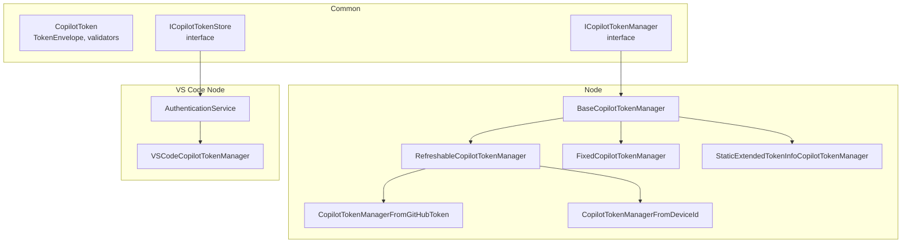
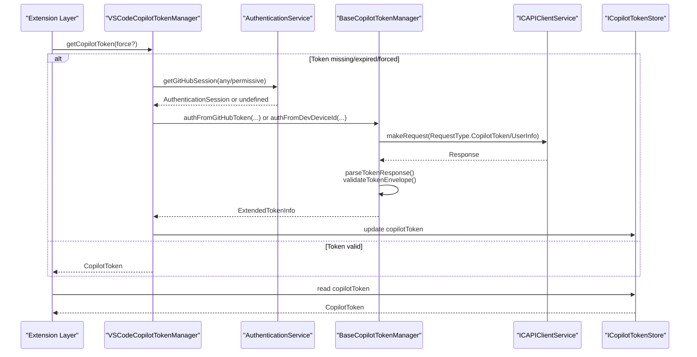
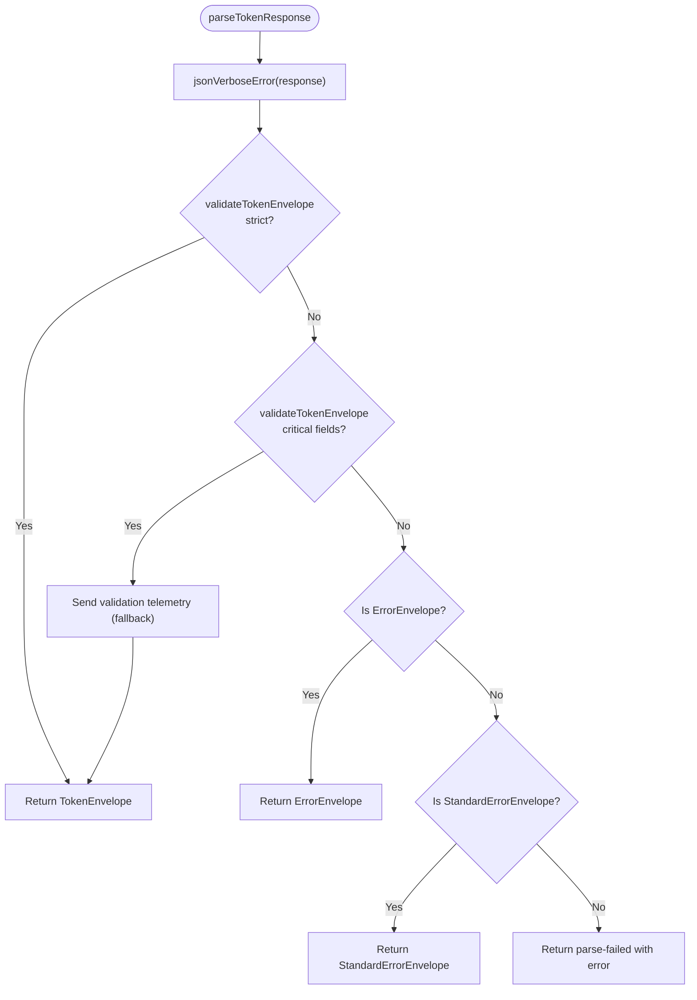
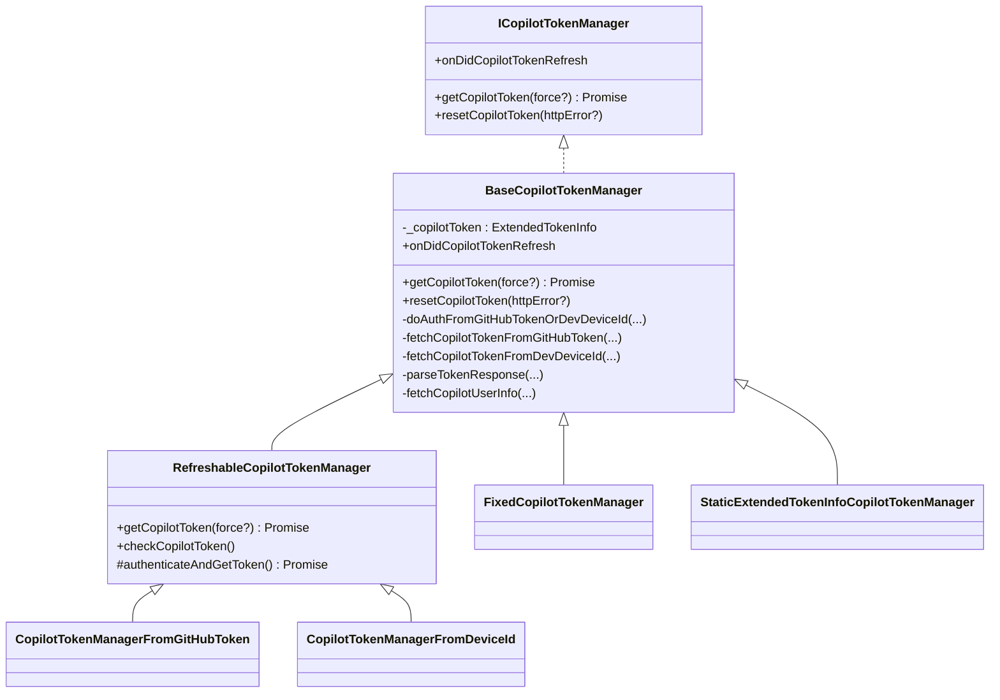
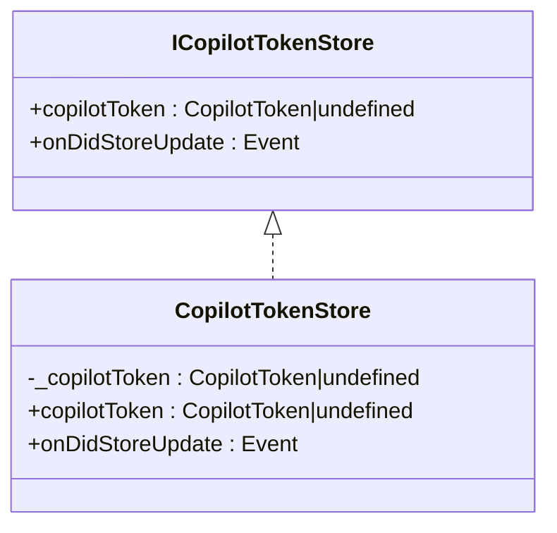
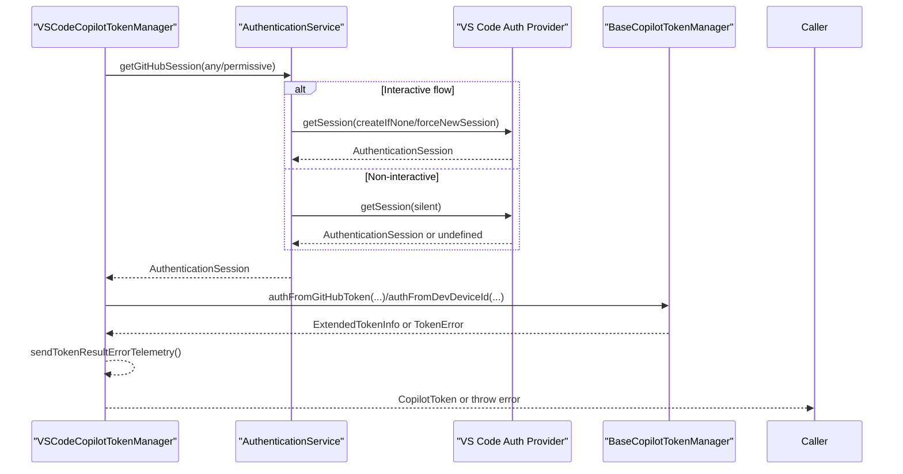
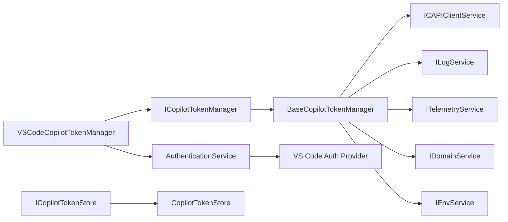

# Token Management

<cite>
**Referenced Files in This Document**
- [copilotToken.ts](file://src/platform/authentication/common/copilotToken.ts)
- [copilotTokenManager.ts (common)](file://src/platform/authentication/common/copilotTokenManager.ts)
- [copilotTokenStore.ts](file://src/platform/authentication/common/copilotTokenStore.ts)
- [copilotTokenManager.ts (node)](file://src/platform/authentication/node/copilotTokenManager.ts)
- [copilotTokenManager.ts (vscode-node)](file://src/platform/authentication/vscode-node/copilotTokenManager.ts)
- [authenticationService.ts (vscode-node)](file://src/platform/authentication/vscode-node/authenticationService.ts)
- [staticGitHubAuthenticationService.ts](file://src/platform/authentication/common/staticGitHubAuthenticationService.ts)
</cite>

## Table of Contents
1. [Introduction](#introduction)
2. [Project Structure](#project-structure)
3. [Core Components](#core-components)
4. [Architecture Overview](#architecture-overview)
5. [Detailed Component Analysis](#detailed-component-analysis)
6. [Dependency Analysis](#dependency-analysis)
7. [Performance Considerations](#performance-considerations)
8. [Troubleshooting Guide](#troubleshooting-guide)
9. [Conclusion](#conclusion)

## Introduction
This document explains the token management system for Copilot within the repository. It covers the Copilot token lifecycle (acquisition, validation, refresh, and expiration handling), the token store for secure credential storage, responsibilities of the token manager, and integration with GitHub authentication. It also clarifies the relationship between GitHub authentication tokens and Copilot service tokens, token scoping and permissions, rotation strategies, secure transmission, and cleanup procedures. Practical examples focus on validation, error handling for expired or invalid tokens, and implementing refresh mechanisms.

## Project Structure
The token management system spans common interfaces and platform-specific implementations:
- Common contracts define token envelopes, validation, and manager/store interfaces.
- Node implementations provide reusable logic for authentication flows and token parsing.
- VS Code node implementations integrate with the VS Code authentication provider and session management.
- A static authentication service supports test and automation scenarios.

**Diagram sources**
- [copilotToken.ts](file://src/platform/authentication/common/copilotToken.ts#L67-L478)
- [copilotTokenManager.ts (common)](file://src/platform/authentication/common/copilotTokenManager.ts#L10-L60)
- [copilotTokenStore.ts](file://src/platform/authentication/common/copilotTokenStore.ts#L11-L41)
- [copilotTokenManager.ts (node)](file://src/platform/authentication/node/copilotTokenManager.ts#L88-L532)
- [copilotTokenManager.ts (vscode-node)](file://src/platform/authentication/vscode-node/copilotTokenManager.ts#L32-L168)
- [authenticationService.ts (vscode-node)](file://src/platform/authentication/vscode-node/authenticationService.ts#L16-L76)

**Section sources**
- [copilotToken.ts](file://src/platform/authentication/common/copilotToken.ts#L1-L615)
- [copilotTokenManager.ts (common)](file://src/platform/authentication/common/copilotTokenManager.ts#L1-L60)
- [copilotTokenStore.ts](file://src/platform/authentication/common/copilotTokenStore.ts#L1-L41)
- [copilotTokenManager.ts (node)](file://src/platform/authentication/node/copilotTokenManager.ts#L1-L532)
- [copilotTokenManager.ts (vscode-node)](file://src/platform/authentication/vscode-node/copilotTokenManager.ts#L1-L168)
- [authenticationService.ts (vscode-node)](file://src/platform/authentication/vscode-node/authenticationService.ts#L1-L76)

## Core Components
- CopilotToken: Parses and exposes token fields, SKU, plan, organization lists, endpoints, quotas, and feature flags derived from the token envelope.
- TokenEnvelope and validators: Define the expected server response shape and provide strict and fallback validation to tolerate minor server schema changes.
- ICopilotTokenManager: Defines acquiring a valid token, resetting on HTTP errors, and emitting refresh events.
- ICopilotTokenStore: Provides a lightweight store for the current Copilot token to avoid cyclic dependencies.
- BaseCopilotTokenManager and subclasses: Implement token acquisition via GitHub token or device ID, response parsing/validation, and token extension with user info.
- VSCodeCopilotTokenManager: Integrates with VS Code sessions, handles user-facing errors, and coordinates warnings and telemetry.
- AuthenticationService and StaticGitHubAuthenticationService: Provide GitHub sessions and integrate token store updates.

**Section sources**
- [copilotToken.ts](file://src/platform/authentication/common/copilotToken.ts#L67-L478)
- [copilotTokenManager.ts (common)](file://src/platform/authentication/common/copilotTokenManager.ts#L10-L60)
- [copilotTokenStore.ts](file://src/platform/authentication/common/copilotTokenStore.ts#L11-L41)
- [copilotTokenManager.ts (node)](file://src/platform/authentication/node/copilotTokenManager.ts#L88-L532)
- [copilotTokenManager.ts (vscode-node)](file://src/platform/authentication/vscode-node/copilotTokenManager.ts#L32-L168)
- [authenticationService.ts (vscode-node)](file://src/platform/authentication/vscode-node/authenticationService.ts#L16-L76)
- [staticGitHubAuthenticationService.ts](file://src/platform/authentication/common/staticGitHubAuthenticationService.ts#L14-L88)

## Architecture Overview
The system separates concerns across layers:
- Common contracts define token shapes and service interfaces.
- Node implementations encapsulate network calls, validation, and token extension.
- VS Code node integrates with the VS Code authentication provider and session management.
- Token store centralizes token updates for consumers.

**Diagram sources**
- [copilotTokenManager.ts (vscode-node)](file://src/platform/authentication/vscode-node/copilotTokenManager.ts#L47-L101)
- [copilotTokenManager.ts (node)](file://src/platform/authentication/node/copilotTokenManager.ts#L157-L259)
- [authenticationService.ts (vscode-node)](file://src/platform/authentication/vscode-node/authenticationService.ts#L43-L59)
- [copilotTokenStore.ts](file://src/platform/authentication/common/copilotTokenStore.ts#L24-L40)

## Detailed Component Analysis

### CopilotToken and Envelope Validation
- TokenEnvelope defines the server response shape, including token, expiry, refresh timing, SKU, plan, organization lists, endpoints, quotas, and feature flags.
- Two-tier validation strategy:
  - Strict validation against the full schema.
  - Fallback validation on critical fields to tolerate non-critical server changes.
- Error envelopes and standard error envelopes are recognized and mapped to TokenErrorReason and TokenErrorNotificationId.

**Diagram sources**
- [copilotTokenManager.ts (node)](file://src/platform/authentication/node/copilotTokenManager.ts#L294-L319)
- [copilotToken.ts](file://src/platform/authentication/common/copilotToken.ts#L370-L478)

**Section sources**
- [copilotToken.ts](file://src/platform/authentication/common/copilotToken.ts#L299-L478)

### Token Manager Responsibilities and Lifecycle
- Acquisition:
  - From GitHub token: fetches token and user info concurrently, validates, extends with user data, adjusts expiry for robustness, and emits telemetry.
  - From device ID: uses editor device ID header to mint a token.
- Validation:
  - Uses strict and fallback validators; telemetry tracks drift.
- Refresh:
  - RefreshableCopilotTokenManager checks expiry and refresh threshold before returning a token.
  - Emits onDidCopilotTokenRefresh when a new token is acquired.
- Expiration handling:
  - resetCopilotToken clears the cached token and optionally records HTTP error telemetry.
- Error handling:
  - Maps HTTP statuses, Copilot-specific errors, standard errors, and parse failures to TokenErrorReason.
  - VSCodeCopilotTokenManager surfaces user-facing errors and warnings.

**Diagram sources**
- [copilotTokenManager.ts (common)](file://src/platform/authentication/common/copilotTokenManager.ts#L10-L60)
- [copilotTokenManager.ts (node)](file://src/platform/authentication/node/copilotTokenManager.ts#L88-L532)

**Section sources**
- [copilotTokenManager.ts (node)](file://src/platform/authentication/node/copilotTokenManager.ts#L129-L259)
- [copilotTokenManager.ts (common)](file://src/platform/authentication/common/copilotTokenManager.ts#L15-L43)

### Token Store Implementation
- ICopilotTokenStore provides a simple in-memory store for the current Copilot token and an event for updates.
- CopilotTokenStore fires onDidStoreUpdate when the token identity changes, enabling decoupled consumers to react to token changes.

**Diagram sources**
- [copilotTokenStore.ts](file://src/platform/authentication/common/copilotTokenStore.ts#L11-L41)

**Section sources**
- [copilotTokenStore.ts](file://src/platform/authentication/common/copilotTokenStore.ts#L18-L40)

### VS Code Integration and Session Handling
- VSCodeCopilotTokenManager:
  - Ensures a valid token by obtaining a GitHub session (or allowing anonymous device ID flow).
  - Coordinates warnings and user-facing errors based on TokenErrorNotificationId.
  - Uses TaskSingler to serialize concurrent requests and avoid redundant work.
- AuthenticationService:
  - Wraps VS Code authentication provider to supply GitHub sessions.
  - Reacts to session and domain changes to trigger re-authentication flows.

**Diagram sources**
- [copilotTokenManager.ts (vscode-node)](file://src/platform/authentication/vscode-node/copilotTokenManager.ts#L67-L101)
- [authenticationService.ts (vscode-node)](file://src/platform/authentication/vscode-node/authenticationService.ts#L43-L69)

**Section sources**
- [copilotTokenManager.ts (vscode-node)](file://src/platform/authentication/vscode-node/copilotTokenManager.ts#L32-L168)
- [authenticationService.ts (vscode-node)](file://src/platform/authentication/vscode-node/authenticationService.ts#L16-L76)

### Token Scoping and Permissions
- GitHub scopes:
  - Permissive scope aligned with GitHub requirements.
  - Any scope for user email.
- Copilot token features:
  - Derived from token envelope and token map keys (e.g., code review, telemetry, public suggestions, MCP).
- Plan and SKU:
  - Copilot plan and SKU determine capabilities and quotas for free/limited users.

**Section sources**
- [staticGitHubAuthenticationService.ts](file://src/platform/authentication/common/staticGitHubAuthenticationService.ts#L24-L44)
- [copilotToken.ts](file://src/platform/authentication/common/copilotToken.ts#L161-L230)

### Token Rotation Strategies
- Refresh threshold:
  - Tokens are refreshed when nearing expiry or when forced.
- Device ID fallback:
  - Anonymous access uses device ID when no GitHub session is available.
- Telemetry-driven robustness:
  - Adjusted expiry to allow refresh to succeed even with clock skew.

**Section sources**
- [copilotTokenManager.ts (node)](file://src/platform/authentication/node/copilotTokenManager.ts#L451-L462)
- [copilotTokenManager.ts (vscode-node)](file://src/platform/authentication/vscode-node/copilotTokenManager.ts#L53-L64)

### Secure Transmission Protocols
- GitHub token authentication:
  - Authorization header with token.
  - X-GitHub-Api-Version header included.
- Device ID authentication:
  - Editor-Device-Id header used for anonymous flows.
- Retry and expectJSON:
  - Requests configured to retry and expect JSON responses.

**Section sources**
- [copilotTokenManager.ts (node)](file://src/platform/authentication/node/copilotTokenManager.ts#L264-L288)

### Token Storage and Cleanup
- Token store:
  - Stores the current Copilot token and emits updates on change.
- Cleanup:
  - resetCopilotToken clears the cached token and records telemetry for the given HTTP error.
- Static services:
  - StaticGitHubAuthenticationService enables setting a token directly for testing or automation.

**Section sources**
- [copilotTokenStore.ts](file://src/platform/authentication/common/copilotTokenStore.ts#L24-L40)
- [copilotTokenManager.ts (node)](file://src/platform/authentication/node/copilotTokenManager.ts#L129-L135)
- [staticGitHubAuthenticationService.ts](file://src/platform/authentication/common/staticGitHubAuthenticationService.ts#L63-L70)

## Dependency Analysis
- ICopilotTokenManager depends on:
  - BaseOctoKitService, ILogService, ITelemetryService, IDomainService, ICAPIClientService, IFetcherService, IEnvService.
- VSCodeCopilotTokenManager depends on:
  - AuthenticationService for sessions and configuration.
- Token store is consumed by networking and telemetry services to avoid cyclic dependencies.

**Diagram sources**
- [copilotTokenManager.ts (node)](file://src/platform/authentication/node/copilotTokenManager.ts#L98-L108)
- [copilotTokenManager.ts (vscode-node)](file://src/platform/authentication/vscode-node/copilotTokenManager.ts#L35-L44)
- [authenticationService.ts (vscode-node)](file://src/platform/authentication/vscode-node/authenticationService.ts#L19-L26)
- [copilotTokenStore.ts](file://src/platform/authentication/common/copilotTokenStore.ts#L11-L22)

**Section sources**
- [copilotTokenManager.ts (node)](file://src/platform/authentication/node/copilotTokenManager.ts#L98-L108)
- [copilotTokenManager.ts (vscode-node)](file://src/platform/authentication/vscode-node/copilotTokenManager.ts#L35-L44)
- [authenticationService.ts (vscode-node)](file://src/platform/authentication/vscode-node/authenticationService.ts#L19-L26)
- [copilotTokenStore.ts](file://src/platform/authentication/common/copilotTokenStore.ts#L11-L22)

## Performance Considerations
- Concurrency control:
  - TaskSingler serializes authentication attempts to reduce redundant work.
- Validation telemetry:
  - Tracks strict vs fallback validation to monitor server schema stability.
- Expiry adjustment:
  - Adds a buffer to expiry to ensure refresh succeeds before actual expiry.

[No sources needed since this section provides general guidance]

## Troubleshooting Guide
- Common errors and resolutions:
  - NotAuthorized: Surface user-facing errors based on notification_id (e.g., not signed up, subscription ended, enterprise managed user account, server error).
  - HTTP401: Prompt user to sign out and sign in again.
  - GitHubLoginFailed: Indicates no session available when required.
  - RateLimited: Inform user that API rate limit was exceeded.
  - ParseFailed: Indicates malformed server response; check validation telemetry.
- Token reset:
  - Call resetCopilotToken with HTTP error code to clear the cached token and record telemetry.
- Debugging:
  - Use debug logs to trace token acquisition steps and warnings.

**Section sources**
- [copilotTokenManager.ts (vscode-node)](file://src/platform/authentication/vscode-node/copilotTokenManager.ts#L103-L147)
- [copilotTokenManager.ts (node)](file://src/platform/authentication/node/copilotTokenManager.ts#L129-L220)
- [copilotToken.ts](file://src/platform/authentication/common/copilotToken.ts#L559-L612)

## Conclusion
The token management system provides a robust, layered approach to acquiring, validating, rotating, and storing Copilot tokens. It integrates securely with GitHub authentication, handles various error conditions gracefully, and offers telemetry to monitor reliability. The design separates concerns across common interfaces, node implementations, and VS Code integrations, enabling maintainability and testability while ensuring secure transmission and appropriate token lifecycle management.