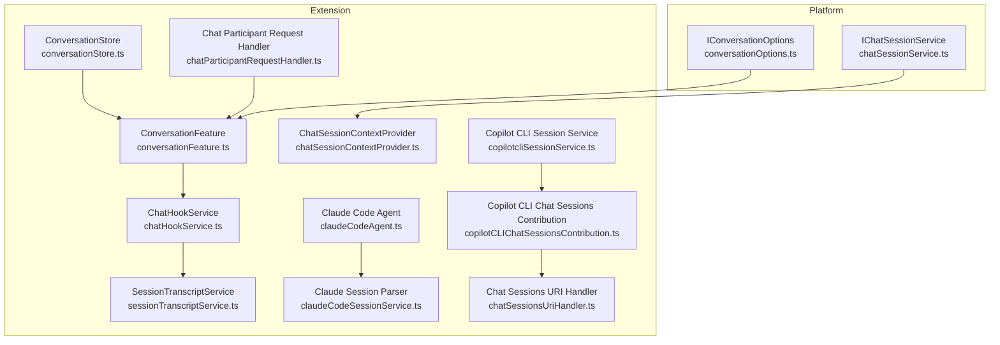
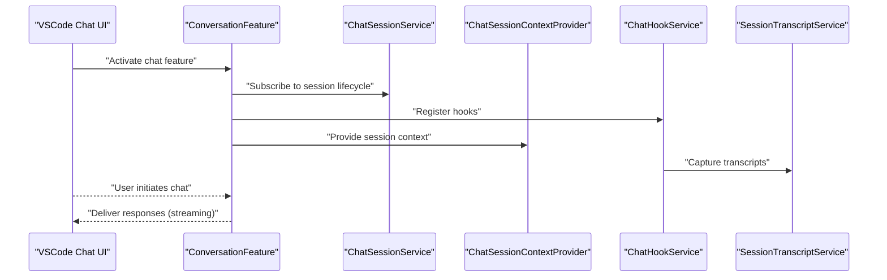
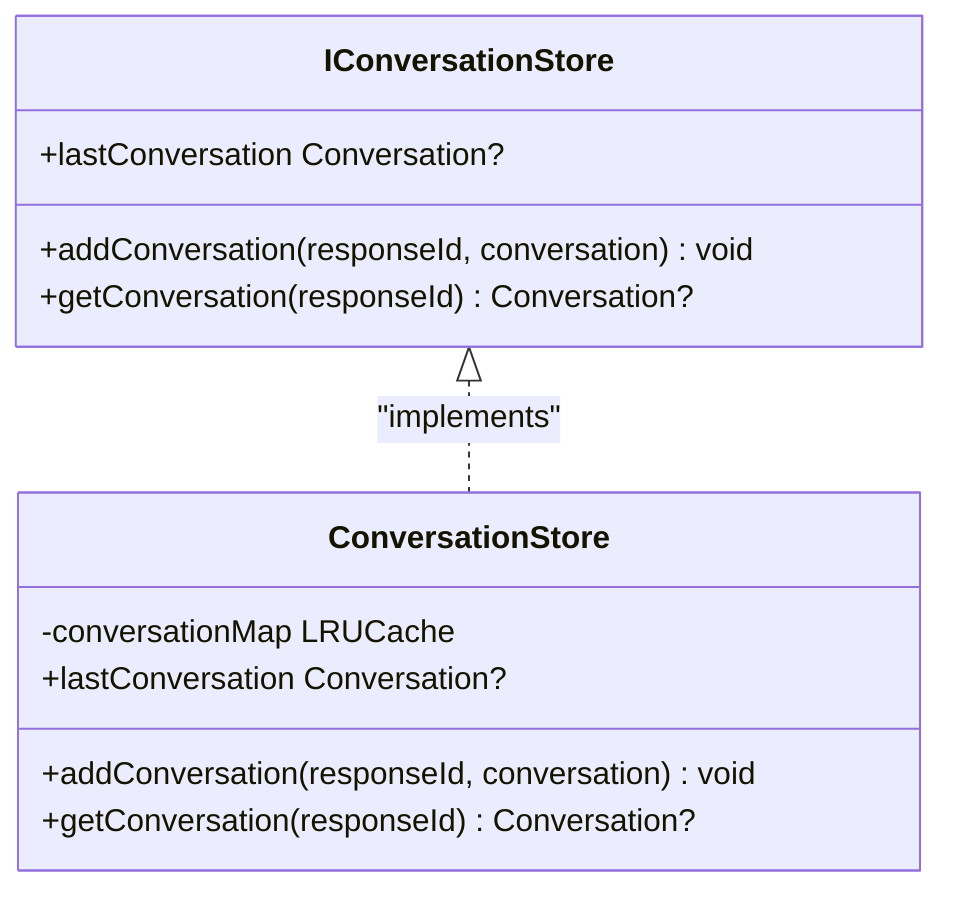
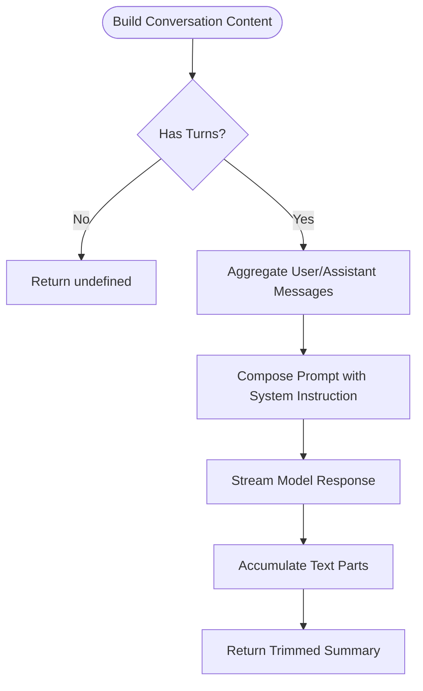
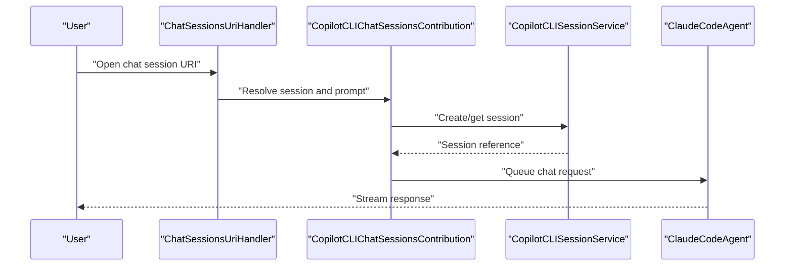
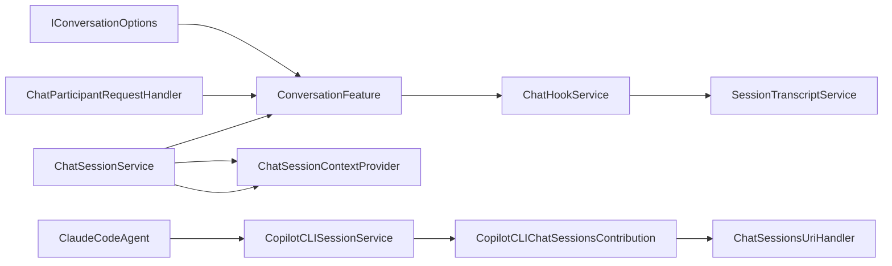

# Chat & Conversations

<cite>
**Referenced Files in This Document**
- [conversationStore.ts](file://src/extension/conversationStore/node/conversationStore.ts)
- [conversationOptions.ts](file://src/platform/chat/common/conversationOptions.ts)
- [chatSessionService.ts](file://src/platform/chat/vscode/chatSessionService.ts)
- [chatSessionContextProvider.ts](file://src/extension/chatSessionContext/vscode-node/chatSessionContextProvider.ts)
- [conversationFeature.ts](file://src/extension/conversation/vscode-node/conversationFeature.ts)
- [telemetry.ts](file://src/extension/prompt/node/telemetry.ts)
- [chatHookService.ts](file://src/extension/chat/vscode-node/chatHookService.ts)
- [sessionTranscriptService.ts](file://src/extension/chat/vscode-node/sessionTranscriptService.ts)
- [claudeCodeAgent.ts](file://src/extension/chatSessions/claude/node/claudeCodeAgent.ts)
- [claudeCodeSessionService.ts](file://src/extension/chatSessions/claude/node/sessionParser/claudeCodeSessionService.ts)
- [copilotcliSessionService.ts](file://src/extension/chatSessions/copilotcli/node/copilotcliSessionService.ts)
- [copilotCLIChatSessionsContribution.ts](file://src/extension/chatSessions/vscode-node/copilotCLIChatSessionsContribution.ts)
- [chatSessionsUriHandler.ts](file://src/extension/chatSessions/vscode/chatSessionsUriHandler.ts)
- [chatParticipantRequestHandler.ts](file://src/extension/prompt/node/chatParticipantRequestHandler.ts)
</cite>

## Table of Contents
1. [Introduction](#introduction)
2. [Project Structure](#project-structure)
3. [Core Components](#core-components)
4. [Architecture Overview](#architecture-overview)
5. [Detailed Component Analysis](#detailed-component-analysis)
6. [Dependency Analysis](#dependency-analysis)
7. [Performance Considerations](#performance-considerations)
8. [Troubleshooting Guide](#troubleshooting-guide)
9. [Conclusion](#conclusion)
10. [Appendices](#appendices)

## Introduction
This document explains the chat and conversation management systems in the repository. It covers chat session architecture, conversation history management, message processing workflows, and the different chat modes supported. It also documents the conversation store implementation, session persistence and retrieval mechanisms, the hook system for extending chat functionality, chat UI integration, message formatting, response streaming, and collaboration features such as session sharing and metadata management. Finally, it describes the integration with VSCode’s chat interface and extension contributions.

## Project Structure
The chat and conversation subsystem spans several areas:
- Platform-level chat services and contracts
- Extension-level providers, hooks, and session management
- Conversation storage and telemetry
- VSCode-specific integrations for chat sessions and context providers

**Diagram sources**
- [conversationOptions.ts](file://src/platform/chat/common/conversationOptions.ts#L1-L17)
- [chatSessionService.ts](file://src/platform/chat/vscode/chatSessionService.ts#L1-L16)
- [conversationStore.ts](file://src/extension/conversationStore/node/conversationStore.ts#L1-L40)
- [conversationFeature.ts](file://src/extension/conversation/vscode-node/conversationFeature.ts#L131-L168)
- [chatSessionContextProvider.ts](file://src/extension/chatSessionContext/vscode-node/chatSessionContextProvider.ts#L200-L236)
- [chatHookService.ts](file://src/extension/chat/vscode-node/chatHookService.ts#L1-L20)
- [sessionTranscriptService.ts](file://src/extension/chat/vscode-node/sessionTranscriptService.ts#L1-L20)
- [claudeCodeAgent.ts](file://src/extension/chatSessions/claude/node/claudeCodeAgent.ts#L195-L205)
- [claudeCodeSessionService.ts](file://src/extension/chatSessions/claude/node/sessionParser/claudeCodeSessionService.ts#L1-L10)
- [copilotcliSessionService.ts](file://src/extension/chatSessions/copilotcli/node/copilotcliSessionService.ts#L340-L360)
- [copilotCLIChatSessionsContribution.ts](file://src/extension/chatSessions/vscode-node/copilotCLIChatSessionsContribution.ts#L880-L960)
- [chatSessionsUriHandler.ts](file://src/extension/chatSessions/vscode/chatSessionsUriHandler.ts#L60-L70)
- [chatParticipantRequestHandler.ts](file://src/extension/prompt/node/chatParticipantRequestHandler.ts#L316-L349)

**Section sources**
- [conversationStore.ts](file://src/extension/conversationStore/node/conversationStore.ts#L1-L40)
- [conversationOptions.ts](file://src/platform/chat/common/conversationOptions.ts#L1-L17)
- [chatSessionService.ts](file://src/platform/chat/vscode/chatSessionService.ts#L1-L16)
- [chatSessionContextProvider.ts](file://src/extension/chatSessionContext/vscode-node/chatSessionContextProvider.ts#L200-L236)
- [conversationFeature.ts](file://src/extension/conversation/vscode-node/conversationFeature.ts#L131-L168)
- [telemetry.ts](file://src/extension/prompt/node/telemetry.ts#L1-L22)
- [chatHookService.ts](file://src/extension/chat/vscode-node/chatHookService.ts#L1-L20)
- [sessionTranscriptService.ts](file://src/extension/chat/vscode-node/sessionTranscriptService.ts#L1-L20)
- [claudeCodeAgent.ts](file://src/extension/chatSessions/claude/node/claudeCodeAgent.ts#L195-L205)
- [claudeCodeSessionService.ts](file://src/extension/chatSessions/claude/node/sessionParser/claudeCodeSessionService.ts#L1-L10)
- [copilotcliSessionService.ts](file://src/extension/chatSessions/copilotcli/node/copilotcliSessionService.ts#L340-L360)
- [copilotCLIChatSessionsContribution.ts](file://src/extension/chatSessions/vscode-node/copilotCLIChatSessionsContribution.ts#L880-L960)
- [chatSessionsUriHandler.ts](file://src/extension/chatSessions/vscode/chatSessionsUriHandler.ts#L60-L70)
- [chatParticipantRequestHandler.ts](file://src/extension/prompt/node/chatParticipantRequestHandler.ts#L316-L349)

## Core Components
- Conversation store: An LRU-backed store keyed by response identifiers to hold recent conversations for fast retrieval.
- Conversation options: A platform-level service contract defining model parameters and rejection messaging.
- Chat session service: A VSCode-side adapter exposing lifecycle events for chat sessions.
- Chat session context provider: A provider that generates summaries from conversation content using a language model.
- Conversation feature: The extension feature that registers providers, commands, participants, and related information providers.
- Telemetry: Utilities to attach unique identifiers to conversational telemetry and track message metrics.
- Hook system: Services enabling chat hooks and transcript capture for extended functionality.
- Session persistence and retrieval: Services for Claude and Copilot CLI chat sessions, including URI handling and session item management.
- Chat participant request handler: Bridges VSCode chat history entries into conversation turns.

**Section sources**
- [conversationStore.ts](file://src/extension/conversationStore/node/conversationStore.ts#L10-L39)
- [conversationOptions.ts](file://src/platform/chat/common/conversationOptions.ts#L8-L16)
- [chatSessionService.ts](file://src/platform/chat/vscode/chatSessionService.ts#L10-L16)
- [chatSessionContextProvider.ts](file://src/extension/chatSessionContext/vscode-node/chatSessionContextProvider.ts#L200-L236)
- [conversationFeature.ts](file://src/extension/conversation/vscode-node/conversationFeature.ts#L131-L168)
- [telemetry.ts](file://src/extension/prompt/node/telemetry.ts#L14-L22)
- [chatHookService.ts](file://src/extension/chat/vscode-node/chatHookService.ts#L1-L20)
- [sessionTranscriptService.ts](file://src/extension/chat/vscode-node/sessionTranscriptService.ts#L1-L20)
- [claudeCodeAgent.ts](file://src/extension/chatSessions/claude/node/claudeCodeAgent.ts#L195-L205)
- [claudeCodeSessionService.ts](file://src/extension/chatSessions/claude/node/sessionParser/claudeCodeSessionService.ts#L1-L10)
- [copilotcliSessionService.ts](file://src/extension/chatSessions/copilotcli/node/copilotcliSessionService.ts#L340-L360)
- [copilotCLIChatSessionsContribution.ts](file://src/extension/chatSessions/vscode-node/copilotCLIChatSessionsContribution.ts#L880-L960)
- [chatSessionsUriHandler.ts](file://src/extension/chatSessions/vscode/chatSessionsUriHandler.ts#L60-L70)
- [chatParticipantRequestHandler.ts](file://src/extension/prompt/node/chatParticipantRequestHandler.ts#L316-L349)

## Architecture Overview
The system integrates platform-level contracts with extension-level implementations to support:
- Chat modes: Panel chat, inline chat, and agent chat sessions
- Conversation history management: Turn-based conversations with optional persistence
- Message processing: Streaming responses, telemetry, and participant orchestration
- Collaboration: Summaries, session sharing, and participant tracking
- VSCode integration: Chat sessions lifecycle, context providers, and URI handlers

**Diagram sources**
- [conversationFeature.ts](file://src/extension/conversation/vscode-node/conversationFeature.ts#L131-L168)
- [chatSessionService.ts](file://src/platform/chat/vscode/chatSessionService.ts#L10-L16)
- [chatSessionContextProvider.ts](file://src/extension/chatSessionContext/vscode-node/chatSessionContextProvider.ts#L200-L236)
- [chatHookService.ts](file://src/extension/chat/vscode-node/chatHookService.ts#L1-L20)
- [sessionTranscriptService.ts](file://src/extension/chat/vscode-node/sessionTranscriptService.ts#L1-L20)

## Detailed Component Analysis

### Conversation Store
The conversation store provides a service interface and an LRU-backed implementation to cache conversations keyed by response identifiers. It exposes methods to add, retrieve, and access the most recent conversation.

**Diagram sources**
- [conversationStore.ts](file://src/extension/conversationStore/node/conversationStore.ts#L10-L39)

**Section sources**
- [conversationStore.ts](file://src/extension/conversationStore/node/conversationStore.ts#L10-L39)

### Conversation Options
Defines the platform-level service identifier and contract for controlling conversation behavior, including response token limits, sampling parameters, and rejection messaging.

**Section sources**
- [conversationOptions.ts](file://src/platform/chat/common/conversationOptions.ts#L8-L16)

### Chat Session Service
Wraps VSCode’s chat session lifecycle events into a platform service, exposing disposal notifications.

**Section sources**
- [chatSessionService.ts](file://src/platform/chat/vscode/chatSessionService.ts#L10-L16)

### Chat Session Context Provider
Generates a concise summary of a conversation by streaming a language model response built from conversation turns. It aggregates user and assistant messages into a structured prompt and streams the model’s output.

**Diagram sources**
- [chatSessionContextProvider.ts](file://src/extension/chatSessionContext/vscode-node/chatSessionContextProvider.ts#L200-L236)

**Section sources**
- [chatSessionContextProvider.ts](file://src/extension/chatSessionContext/vscode-node/chatSessionContextProvider.ts#L200-L236)

### Conversation Feature
Activates and deactivates contributions, registers providers, commands, participants, and related information providers, and manages lifecycle via disposables.

**Section sources**
- [conversationFeature.ts](file://src/extension/conversation/vscode-node/conversationFeature.ts#L131-L168)

### Telemetry Utilities
Provides a unique message identifier and a telemetry data wrapper to record conversational metrics such as token counts and message lengths.

**Section sources**
- [telemetry.ts](file://src/extension/prompt/node/telemetry.ts#L14-L22)

### Hook System and Transcript Capture
Hook services integrate with transcript capture to extend chat functionality and record session transcripts for later analysis or sharing.

**Section sources**
- [chatHookService.ts](file://src/extension/chat/vscode-node/chatHookService.ts#L1-L20)
- [sessionTranscriptService.ts](file://src/extension/chat/vscode-node/sessionTranscriptService.ts#L1-L20)

### Session Persistence and Retrieval
- Claude Code Agent: Represents queued chat requests for Claude sessions.
- Claude Session Parser: Loads and manages Claude Code chat sessions stored on disk.
- Copilot CLI Session Service: Manages CLI-backed chat sessions and disposes them after activity.
- Copilot CLI Chat Sessions Contribution: Handles session items, delegation, and URI-based session opening.
- Chat Sessions URI Handler: Processes URIs to open chat sessions and tracks session types for telemetry.

**Diagram sources**
- [chatSessionsUriHandler.ts](file://src/extension/chatSessions/vscode/chatSessionsUriHandler.ts#L60-L70)
- [copilotCLIChatSessionsContribution.ts](file://src/extension/chatSessions/vscode-node/copilotCLIChatSessionsContribution.ts#L880-L960)
- [copilotcliSessionService.ts](file://src/extension/chatSessions/copilotcli/node/copilotcliSessionService.ts#L340-L360)
- [claudeCodeAgent.ts](file://src/extension/chatSessions/claude/node/claudeCodeAgent.ts#L195-L205)

**Section sources**
- [claudeCodeAgent.ts](file://src/extension/chatSessions/claude/node/claudeCodeAgent.ts#L195-L205)
- [claudeCodeSessionService.ts](file://src/extension/chatSessions/claude/node/sessionParser/claudeCodeSessionService.ts#L1-L10)
- [copilotcliSessionService.ts](file://src/extension/chatSessions/copilotcli/node/copilotcliSessionService.ts#L340-L360)
- [copilotCLIChatSessionsContribution.ts](file://src/extension/chatSessions/vscode-node/copilotCLIChatSessionsContribution.ts#L880-L960)
- [chatSessionsUriHandler.ts](file://src/extension/chatSessions/vscode/chatSessionsUriHandler.ts#L60-L70)

### Chat Modes
- Panel chat: Integrated chat panel managed by VSCode chat lifecycle and extension contributions.
- Inline chat: Editor-integrated chat experiences handled by inline chat providers and related services.
- Agent chat sessions: Specialized chat sessions backed by agents (e.g., Claude, Copilot CLI), with persistent storage and retrieval.

**Section sources**
- [conversationFeature.ts](file://src/extension/conversation/vscode-node/conversationFeature.ts#L131-L168)
- [chatSessionService.ts](file://src/platform/chat/vscode/chatSessionService.ts#L10-L16)
- [claudeCodeAgent.ts](file://src/extension/chatSessions/claude/node/claudeCodeAgent.ts#L195-L205)
- [copilotcliSessionService.ts](file://src/extension/chatSessions/copilotcli/node/copilotcliSessionService.ts#L340-L360)

### Conversation History Management and Message Processing
- History bridging: Converts VSCode chat history entries into conversation turns, pairing requests and responses.
- Streaming: Responses are streamed from language model providers and integrated into the chat UI.
- Formatting: Conversation content is aggregated into prompts for summarization and context generation.

**Section sources**
- [chatParticipantRequestHandler.ts](file://src/extension/prompt/node/chatParticipantRequestHandler.ts#L316-L349)
- [chatSessionContextProvider.ts](file://src/extension/chatSessionContext/vscode-node/chatSessionContextProvider.ts#L200-L236)

### Chat UI Integration and Collaboration Features
- VSCode chat integration: Uses platform services and contribution points to expose chat capabilities.
- Session sharing: URI handler and session item management enable sharing and opening sessions.
- Metadata management: Telemetry utilities attach unique identifiers and metrics to messages for auditability.

**Section sources**
- [chatSessionService.ts](file://src/platform/chat/vscode/chatSessionService.ts#L10-L16)
- [chatSessionsUriHandler.ts](file://src/extension/chatSessions/vscode/chatSessionsUriHandler.ts#L60-L70)
- [telemetry.ts](file://src/extension/prompt/node/telemetry.ts#L14-L22)

## Dependency Analysis
The following diagram shows key dependencies among core components:

**Diagram sources**
- [conversationOptions.ts](file://src/platform/chat/common/conversationOptions.ts#L8-L16)
- [conversationFeature.ts](file://src/extension/conversation/vscode-node/conversationFeature.ts#L131-L168)
- [chatSessionService.ts](file://src/platform/chat/vscode/chatSessionService.ts#L10-L16)
- [chatSessionContextProvider.ts](file://src/extension/chatSessionContext/vscode-node/chatSessionContextProvider.ts#L200-L236)
- [chatHookService.ts](file://src/extension/chat/vscode-node/chatHookService.ts#L1-L20)
- [sessionTranscriptService.ts](file://src/extension/chat/vscode-node/sessionTranscriptService.ts#L1-L20)
- [claudeCodeAgent.ts](file://src/extension/chatSessions/claude/node/claudeCodeAgent.ts#L195-L205)
- [copilotcliSessionService.ts](file://src/extension/chatSessions/copilotcli/node/copilotcliSessionService.ts#L340-L360)
- [copilotCLIChatSessionsContribution.ts](file://src/extension/chatSessions/vscode-node/copilotCLIChatSessionsContribution.ts#L880-L960)
- [chatSessionsUriHandler.ts](file://src/extension/chatSessions/vscode/chatSessionsUriHandler.ts#L60-L70)
- [chatParticipantRequestHandler.ts](file://src/extension/prompt/node/chatParticipantRequestHandler.ts#L316-L349)

**Section sources**
- [conversationOptions.ts](file://src/platform/chat/common/conversationOptions.ts#L8-L16)
- [conversationFeature.ts](file://src/extension/conversation/vscode-node/conversationFeature.ts#L131-L168)
- [chatSessionService.ts](file://src/platform/chat/vscode/chatSessionService.ts#L10-L16)
- [chatSessionContextProvider.ts](file://src/extension/chatSessionContext/vscode-node/chatSessionContextProvider.ts#L200-L236)
- [chatHookService.ts](file://src/extension/chat/vscode-node/chatHookService.ts#L1-L20)
- [sessionTranscriptService.ts](file://src/extension/chat/vscode-node/sessionTranscriptService.ts#L1-L20)
- [claudeCodeAgent.ts](file://src/extension/chatSessions/claude/node/claudeCodeAgent.ts#L195-L205)
- [copilotcliSessionService.ts](file://src/extension/chatSessions/copilotcli/node/copilotcliSessionService.ts#L340-L360)
- [copilotCLIChatSessionsContribution.ts](file://src/extension/chatSessions/vscode-node/copilotCLIChatSessionsContribution.ts#L880-L960)
- [chatSessionsUriHandler.ts](file://src/extension/chatSessions/vscode/chatSessionsUriHandler.ts#L60-L70)
- [chatParticipantRequestHandler.ts](file://src/extension/prompt/node/chatParticipantRequestHandler.ts#L316-L349)

## Performance Considerations
- Conversation store: LRU cache sizing impacts memory usage and hit rates; tune capacity based on concurrent sessions.
- Streaming: Prefer streaming responses to reduce perceived latency and improve user experience.
- Context summarization: Summarization runs against language models; batch or debounce requests to minimize cost and latency.
- Session lifecycle: Dispose inactive sessions promptly to free resources (as seen in CLI session service).

[No sources needed since this section provides general guidance]

## Troubleshooting Guide
- Session disposal events: Subscribe to session disposal via the chat session service to detect lifecycle changes.
- Context provider errors: Errors during summarization are logged; verify model availability and prompt construction.
- History bridging: Ensure paired request/response entries; unpaired entries are skipped during conversion.
- Telemetry identifiers: Confirm unique message IDs are generated and attached to telemetry events.

**Section sources**
- [chatSessionService.ts](file://src/platform/chat/vscode/chatSessionService.ts#L10-L16)
- [chatSessionContextProvider.ts](file://src/extension/chatSessionContext/vscode-node/chatSessionContextProvider.ts#L200-L236)
- [chatParticipantRequestHandler.ts](file://src/extension/prompt/node/chatParticipantRequestHandler.ts#L316-L349)
- [telemetry.ts](file://src/extension/prompt/node/telemetry.ts#L14-L22)

## Conclusion
The chat and conversation management system combines platform-level contracts with extension-level implementations to support multiple chat modes, robust conversation history handling, streaming responses, and collaboration features. The hook system and transcript capture enable extensibility, while VSCode integrations provide seamless session lifecycle management and UI participation. The conversation store and telemetry utilities ensure efficient retrieval and observability across sessions.

[No sources needed since this section summarizes without analyzing specific files]

## Appendices
- Example workflows:
  - Multi-turn discussion: Use conversation turns and streaming responses to maintain context across exchanges.
  - Context preservation: Leverage the chat session context provider to summarize long histories and inject concise context.
  - Session sharing: Open chat sessions via URIs and manage session items through contributions.
- Best practices:
  - Keep conversation stores sized appropriately for expected concurrency.
  - Stream responses to improve responsiveness.
  - Log and monitor context provider errors for reliability.
  - Attach unique identifiers to messages for traceability.

[No sources needed since this section provides general guidance]