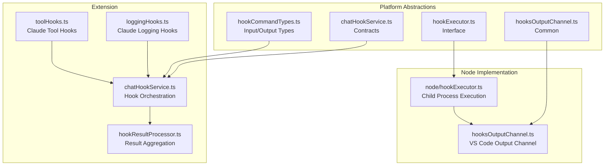
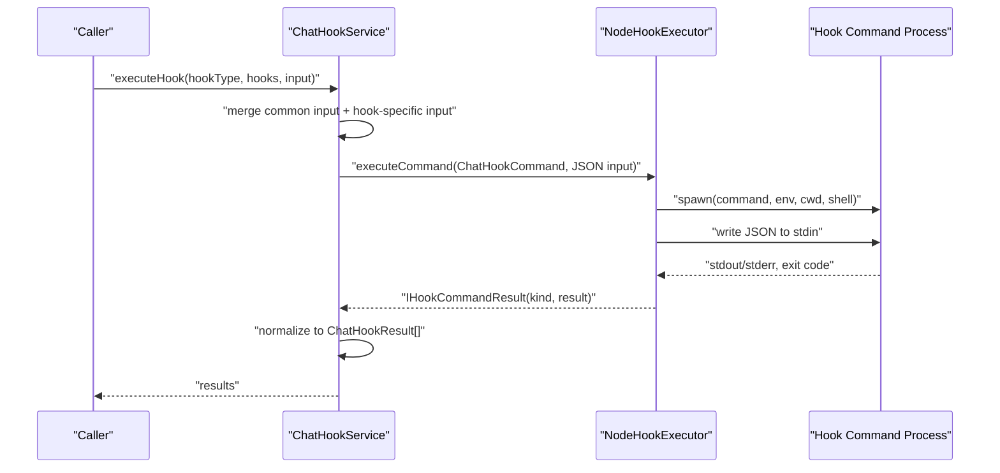
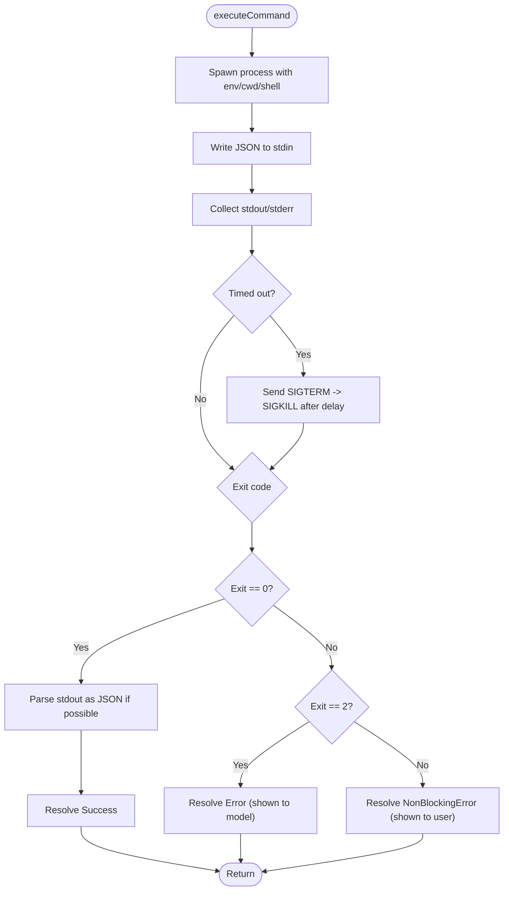
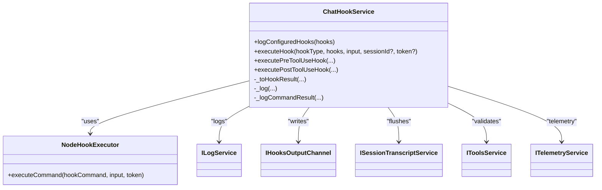
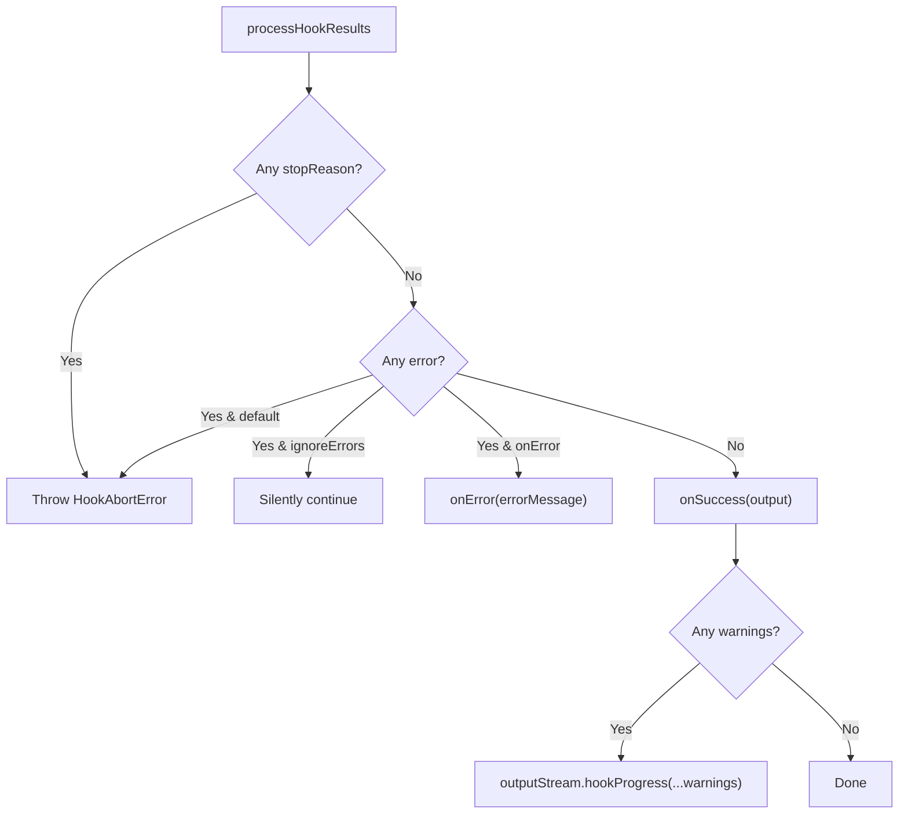
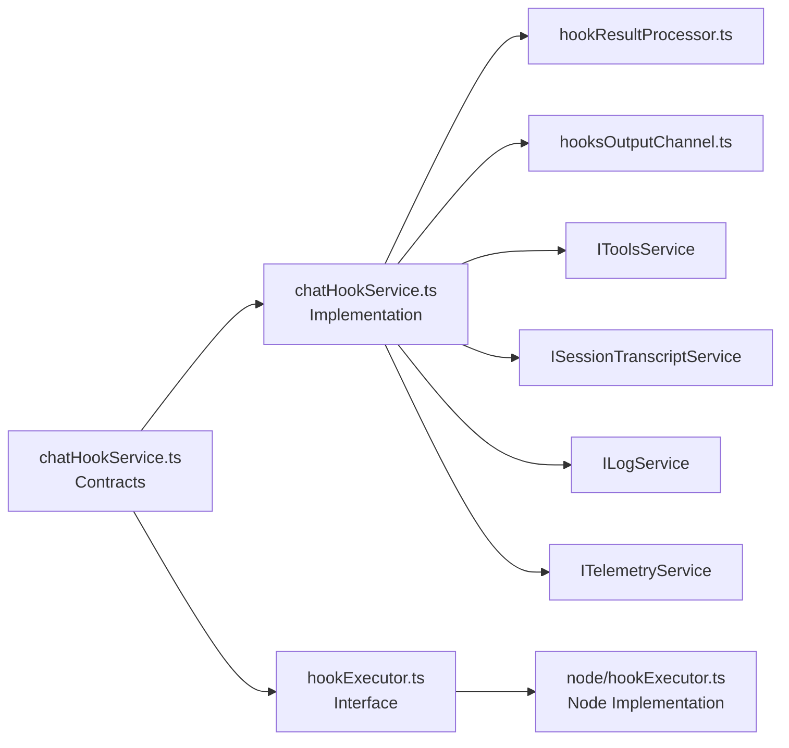

# Chat Hooks System

<cite>
**Referenced Files in This Document**
- [vscode.proposed.chatHooks.d.ts](file://src/extension/vscode.proposed.chatHooks.d.ts)
- [chatHookService.ts](file://src/platform/chat/common/chatHookService.ts)
- [hookExecutor.ts](file://src/platform/chat/common/hookExecutor.ts)
- [node/hookExecutor.ts](file://src/platform/chat/node/hookExecutor.ts)
- [chatHookService.ts](file://src/extension/chat/vscode-node/chatHookService.ts)
- [hooksOutputChannel.ts](file://src/extension/chat/vscode-node/hooksOutputChannel.ts)
- [hooksOutputChannel.ts](file://src/platform/chat/common/hooksOutputChannel.ts)
- [hookCommandTypes.ts](file://src/platform/chat/common/hookCommandTypes.ts)
- [hookResultProcessor.ts](file://src/extension/intents/node/hookResultProcessor.ts)
- [loggingHooks.ts](file://src/extension/chatSessions/claude/node/hooks/loggingHooks.ts)
- [toolHooks.ts](file://src/extension/chatSessions/claude/node/hooks/toolHooks.ts)
- [create-hook.prompt.md](file://assets/prompts/create-hook.prompt.md)
</cite>

## Table of Contents
1. [Introduction](#introduction)
2. [Project Structure](#project-structure)
3. [Core Components](#core-components)
4. [Architecture Overview](#architecture-overview)
5. [Detailed Component Analysis](#detailed-component-analysis)
6. [Dependency Analysis](#dependency-analysis)
7. [Performance Considerations](#performance-considerations)
8. [Troubleshooting Guide](#troubleshooting-guide)
9. [Conclusion](#conclusion)
10. [Appendices](#appendices)

## Introduction
This document describes the chat hooks system architecture used to extend and govern chat interactions. It covers the hook service implementation, registration mechanisms, command processing workflows, and the hook executor service. It also documents hook types (pre/post-processing and validation), parameter handling, result processing, output channels, logging, debugging, performance considerations, error handling, and fallback strategies.

## Project Structure
The chat hooks system spans platform abstractions and extension implementations:
- Platform contracts define hook types, command inputs/outputs, and the hook executor interface.
- The extension implements the hook service and executor, integrates with output channels and telemetry, and processes hook results.
- Example Claude hooks demonstrate practical implementations for logging and tool-call auditing.

**Diagram sources**
- [chatHookService.ts](file://src/platform/chat/common/chatHookService.ts#L1-L270)
- [hookExecutor.ts](file://src/platform/chat/common/hookExecutor.ts#L1-L45)
- [hookCommandTypes.ts](file://src/platform/chat/common/hookCommandTypes.ts#L1-L59)
- [hooksOutputChannel.ts](file://src/platform/chat/common/hooksOutputChannel.ts#L1-L18)
- [node/hookExecutor.ts](file://src/platform/chat/node/hookExecutor.ts#L1-L203)
- [hooksOutputChannel.ts](file://src/extension/chat/vscode-node/hooksOutputChannel.ts#L1-L21)
- [chatHookService.ts](file://src/extension/chat/vscode-node/chatHookService.ts#L1-L449)
- [hookResultProcessor.ts](file://src/extension/intents/node/hookResultProcessor.ts#L1-L148)
- [loggingHooks.ts](file://src/extension/chatSessions/claude/node/hooks/loggingHooks.ts#L1-L117)
- [toolHooks.ts](file://src/extension/chatSessions/claude/node/hooks/toolHooks.ts#L1-L163)

**Section sources**
- [chatHookService.ts](file://src/platform/chat/common/chatHookService.ts#L1-L270)
- [hookExecutor.ts](file://src/platform/chat/common/hookExecutor.ts#L1-L45)
- [hookCommandTypes.ts](file://src/platform/chat/common/hookCommandTypes.ts#L1-L59)
- [hooksOutputChannel.ts](file://src/platform/chat/common/hooksOutputChannel.ts#L1-L18)
- [node/hookExecutor.ts](file://src/platform/chat/node/hookExecutor.ts#L1-L203)
- [hooksOutputChannel.ts](file://src/extension/chat/vscode-node/hooksOutputChannel.ts#L1-L21)
- [chatHookService.ts](file://src/extension/chat/vscode-node/chatHookService.ts#L1-L449)
- [hookResultProcessor.ts](file://src/extension/intents/node/hookResultProcessor.ts#L1-L148)
- [loggingHooks.ts](file://src/extension/chatSessions/claude/node/hooks/loggingHooks.ts#L1-L117)
- [toolHooks.ts](file://src/extension/chatSessions/claude/node/hooks/toolHooks.ts#L1-L163)

## Core Components
- Hook types and contracts: Defined in the VS Code proposal and platform contracts, including hook types, command shape, and result kinds.
- Hook command input/output: Structured JSON contracts for pre/post-tool-use and other hook types.
- Hook executor: Spawns OS processes, writes JSON to stdin, captures stdout/stderr, and interprets exit codes.
- Hook service: Orchestrates hook execution, merges common input, logs, aggregates results, and applies collapsing rules for pre/post-tool-use.
- Result processor: Aggregates warnings, handles stop reasons, and throws abort errors when hooks request interruption.
- Output channel: Dedicated VS Code output channel for hook logs and diagnostics.

**Section sources**
- [vscode.proposed.chatHooks.d.ts](file://src/extension/vscode.proposed.chatHooks.d.ts#L1-L127)
- [chatHookService.ts](file://src/platform/chat/common/chatHookService.ts#L1-L270)
- [hookCommandTypes.ts](file://src/platform/chat/common/hookCommandTypes.ts#L1-L59)
- [hookExecutor.ts](file://src/platform/chat/common/hookExecutor.ts#L1-L45)
- [node/hookExecutor.ts](file://src/platform/chat/node/hookExecutor.ts#L1-L203)
- [chatHookService.ts](file://src/extension/chat/vscode-node/chatHookService.ts#L1-L449)
- [hookResultProcessor.ts](file://src/extension/intents/node/hookResultProcessor.ts#L1-L148)
- [hooksOutputChannel.ts](file://src/extension/chat/vscode-node/hooksOutputChannel.ts#L1-L21)

## Architecture Overview
The system executes user-configured scripts at specific chat lifecycle points. The extension’s hook service prepares inputs, flushes transcripts when needed, and invokes the hook executor. The executor spawns a process, passes JSON via stdin, and parses stdout as structured output or falls back to string output. Results are normalized and collapsed according to hook type rules.

**Diagram sources**
- [chatHookService.ts](file://src/extension/chat/vscode-node/chatHookService.ts#L81-L173)
- [node/hookExecutor.ts](file://src/platform/chat/node/hookExecutor.ts#L27-L164)
- [hookExecutor.ts](file://src/platform/chat/common/hookExecutor.ts#L28-L44)

## Detailed Component Analysis

### Hook Types and Contracts
- Hook types include lifecycle events such as SessionStart, SessionEnd, UserPromptSubmit, PreToolUse, PostToolUse, PreCompact, SubagentStart, SubagentStop, Stop, and ErrorOccurred.
- Commands carry resolved platform-specific command, working directory, environment variables, and timeout.
- Results include kind (success/error/warning), optional stop reason, optional warning message, and hook-specific output.

**Section sources**
- [vscode.proposed.chatHooks.d.ts](file://src/extension/vscode.proposed.chatHooks.d.ts#L10-L127)
- [chatHookService.ts](file://src/platform/chat/common/chatHookService.ts#L1-L270)

### Hook Command Inputs and Outputs
- PreToolUse: Provides tool name, tool input, and tool use ID; supports permission decision, updated input, and additional context.
- PostToolUse: Provides tool name, tool input, tool response, and tool use ID; supports decision and additional context.
- Other hooks: SessionStart, SubagentStart/Stop, UserPromptSubmit, Stop, and PreCompact define their own input/output contracts.

**Section sources**
- [hookCommandTypes.ts](file://src/platform/chat/common/hookCommandTypes.ts#L14-L59)
- [chatHookService.ts](file://src/platform/chat/common/chatHookService.ts#L95-L270)

### Hook Executor Service
- Spawns child processes with configurable shell, working directory, and environment.
- Writes JSON input to stdin and reads stdout/stderr.
- Interprets exit codes: 0 success (parse JSON if possible), 2 blocking error (shown to model), others non-blocking errors (shown to user).
- Implements timeouts and cancellation with SIGTERM/SIGKILL escalation.
- Logs diagnostics to both log service and the hooks output channel.

**Diagram sources**
- [node/hookExecutor.ts](file://src/platform/chat/node/hookExecutor.ts#L27-L164)

**Section sources**
- [hookExecutor.ts](file://src/platform/chat/common/hookExecutor.ts#L1-L45)
- [node/hookExecutor.ts](file://src/platform/chat/node/hookExecutor.ts#L1-L203)

### Hook Service Orchestration
- Merges common fields (timestamp, hook event name, session ID, transcript path) with hook-specific input.
- Flushes session transcript before execution when a session ID is provided.
- Executes hooks sequentially, logging inputs and outputs, and honoring stopReason to halt further execution.
- Converts executor results to standardized ChatHookResult, extracting stopReason, warningMessage, and hook-specific output.
- Validates PreToolUse updatedInput against tool schema and collapses results using strict precedence for permissions.

**Diagram sources**
- [chatHookService.ts](file://src/extension/chat/vscode-node/chatHookService.ts#L29-L449)
- [node/hookExecutor.ts](file://src/platform/chat/node/hookExecutor.ts#L19-L165)

**Section sources**
- [chatHookService.ts](file://src/extension/chat/vscode-node/chatHookService.ts#L1-L449)

### Result Processing and Collapsing Rules
- General processing: Aggregates warnings, throws abort errors on stopReason or error, and optionally collects blocking reasons for Stop/SubagentStop hooks.
- PreToolUse collapsing: Most restrictive decision wins (deny > ask > allow), last updatedInput wins, concatenates additionalContext.
- PostToolUse collapsing: First block decision wins, concatenates additionalContext.

**Diagram sources**
- [hookResultProcessor.ts](file://src/extension/intents/node/hookResultProcessor.ts#L76-L135)

**Section sources**
- [hookResultProcessor.ts](file://src/extension/intents/node/hookResultProcessor.ts#L1-L148)
- [chatHookService.ts](file://src/extension/chat/vscode-node/chatHookService.ts#L264-L447)

### Example Hook Implementations
- Claude logging hooks: Implement logging for Notification, UserPromptSubmit, Stop, PreCompact, and PermissionRequest events.
- Tool hooks: Implement logging for PreToolUse, PostToolUse, PostToolUseFailure, and plan-mode transitions; integrate with request logging and session state.

**Section sources**
- [loggingHooks.ts](file://src/extension/chatSessions/claude/node/hooks/loggingHooks.ts#L1-L117)
- [toolHooks.ts](file://src/extension/chatSessions/claude/node/hooks/toolHooks.ts#L1-L163)

### Hook Registration Mechanisms
- Hooks are registered via a registry pattern and mapped to hook types. Example hooks demonstrate how to register callbacks for specific events.

**Section sources**
- [loggingHooks.ts](file://src/extension/chatSessions/claude/node/hooks/loggingHooks.ts#L37-L117)
- [toolHooks.ts](file://src/extension/chatSessions/claude/node/hooks/toolHooks.ts#L41-L163)

### Hook Command Types, Parameter Handling, and Result Processing
- PreToolUse: Supports permissionDecision, updatedInput, and additionalContext; validated against tool schema before use.
- PostToolUse: Supports decision and additionalContext; enforces decision value constraints.
- Common fields: stopReason, continue, systemMessage, hookEventName; hook-specific output is extracted and sanitized.

**Section sources**
- [hookCommandTypes.ts](file://src/platform/chat/common/hookCommandTypes.ts#L14-L59)
- [chatHookService.ts](file://src/extension/chat/vscode-node/chatHookService.ts#L264-L447)

### Hook Output Channel System, Logging, and Debugging
- Dedicated output channel “GitHub Copilot Chat Hooks” for hook logs.
- Centralized logging via log service and output channel; includes request IDs, hook types, inputs, and outputs.
- Redaction of sensitive keys in inputs for logging safety.

**Section sources**
- [hooksOutputChannel.ts](file://src/extension/chat/vscode-node/hooksOutputChannel.ts#L1-L21)
- [hooksOutputChannel.ts](file://src/platform/chat/common/hooksOutputChannel.ts#L1-L18)
- [chatHookService.ts](file://src/extension/chat/vscode-node/chatHookService.ts#L46-L73)

### Integration with External Services
- Request logging integration for tool calls in PostToolUse hooks.
- Session state updates for plan mode transitions.
- Telemetry for hook execution metrics and configuration.

**Section sources**
- [toolHooks.ts](file://src/extension/chatSessions/claude/node/hooks/toolHooks.ts#L50-L85)
- [chatHookService.ts](file://src/extension/chat/vscode-node/chatHookService.ts#L32-L44)

## Dependency Analysis
The system exhibits clear separation of concerns:
- Platform contracts define the public API and data contracts.
- Node implementation encapsulates OS-level process execution.
- Extension orchestrates lifecycle, logging, and result collapsing.
- Example hooks demonstrate integration patterns.

**Diagram sources**
- [chatHookService.ts](file://src/platform/chat/common/chatHookService.ts#L1-L270)
- [chatHookService.ts](file://src/extension/chat/vscode-node/chatHookService.ts#L1-L449)
- [hookExecutor.ts](file://src/platform/chat/common/hookExecutor.ts#L1-L45)
- [node/hookExecutor.ts](file://src/platform/chat/node/hookExecutor.ts#L1-L203)
- [hookResultProcessor.ts](file://src/extension/intents/node/hookResultProcessor.ts#L1-L148)
- [hooksOutputChannel.ts](file://src/extension/chat/vscode-node/hooksOutputChannel.ts#L1-L21)

**Section sources**
- [chatHookService.ts](file://src/platform/chat/common/chatHookService.ts#L1-L270)
- [chatHookService.ts](file://src/extension/chat/vscode-node/chatHookService.ts#L1-L449)
- [hookExecutor.ts](file://src/platform/chat/common/hookExecutor.ts#L1-L45)
- [node/hookExecutor.ts](file://src/platform/chat/node/hookExecutor.ts#L1-L203)
- [hookResultProcessor.ts](file://src/extension/intents/node/hookResultProcessor.ts#L1-L148)
- [hooksOutputChannel.ts](file://src/extension/chat/vscode-node/hooksOutputChannel.ts#L1-L21)

## Performance Considerations
- Default timeout and graceful termination: The executor sets a default timeout and escalates to SIGKILL after a delay to prevent runaway processes.
- Cancellation support: Execution respects cancellation tokens to abort early.
- Transcript flushing: Session transcript is flushed before hook execution to minimize staleness, with a bounded timeout to avoid blocking chat.
- Logging overhead: Redaction and minimal JSON serialization reduce I/O and risk exposure.

[No sources needed since this section provides general guidance]

## Troubleshooting Guide
- Hook command failed to start: Non-blocking warning; check command path, shell, and environment.
- Hook command timed out: Increase timeout or optimize hook logic; inspect output channel for timing details.
- Non-JSON output: Executor logs a warning; ensure hook prints valid JSON or plain text as appropriate.
- Blocking error (exit code 2): Shown to the model; hook should provide actionable error messages.
- Warnings aggregation: Multiple warnings are summarized in the output stream for visibility.
- StopReason and aborts: Hooks can request immediate abortion; check the output channel for stop messages and hook progress.

**Section sources**
- [node/hookExecutor.ts](file://src/platform/chat/node/hookExecutor.ts#L32-L47)
- [node/hookExecutor.ts](file://src/platform/chat/node/hookExecutor.ts#L126-L132)
- [node/hookExecutor.ts](file://src/platform/chat/node/hookExecutor.ts#L140-L148)
- [hookResultProcessor.ts](file://src/extension/intents/node/hookResultProcessor.ts#L76-L135)
- [chatHookService.ts](file://src/extension/chat/vscode-node/chatHookService.ts#L152-L162)

## Conclusion
The chat hooks system provides a robust, extensible mechanism to govern chat interactions through user-defined scripts. It separates concerns between orchestration, execution, and result processing, while offering strong logging, telemetry, and debugging capabilities. The design supports lifecycle hooks, pre/post-tool-use gating, and contextual augmentation, with clear error handling and performance safeguards.

[No sources needed since this section summarizes without analyzing specific files]

## Appendices

### Hook Implementation Patterns
- Use the Claude hook registry pattern to register callbacks for specific hook types.
- Implement logging hooks for visibility and debugging.
- Integrate with request logging and session state for richer observability.

**Section sources**
- [loggingHooks.ts](file://src/extension/chatSessions/claude/node/hooks/loggingHooks.ts#L1-L117)
- [toolHooks.ts](file://src/extension/chatSessions/claude/node/hooks/toolHooks.ts#L1-L163)

### Creating Custom Hooks
- Use the provided prompt to guide hook creation, focusing on policy enforcement, automation, and context injection.
- Save hooks in the recommended location and iterate on clarity and ambiguity.

**Section sources**
- [create-hook.prompt.md](file://assets/prompts/create-hook.prompt.md#L1-L29)