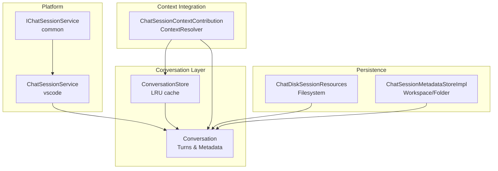
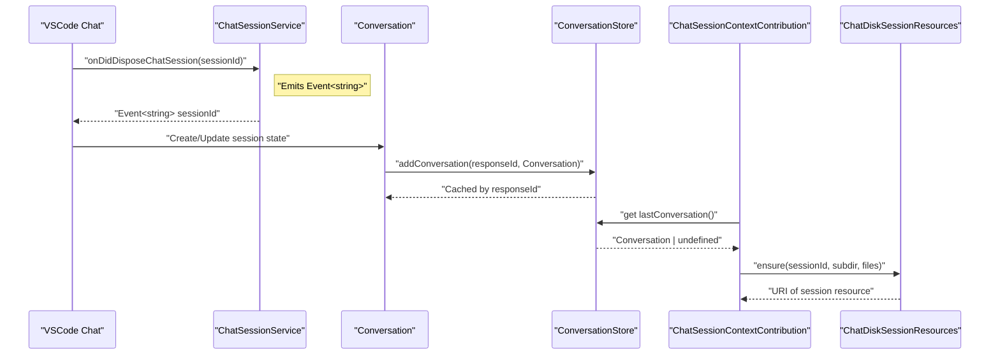
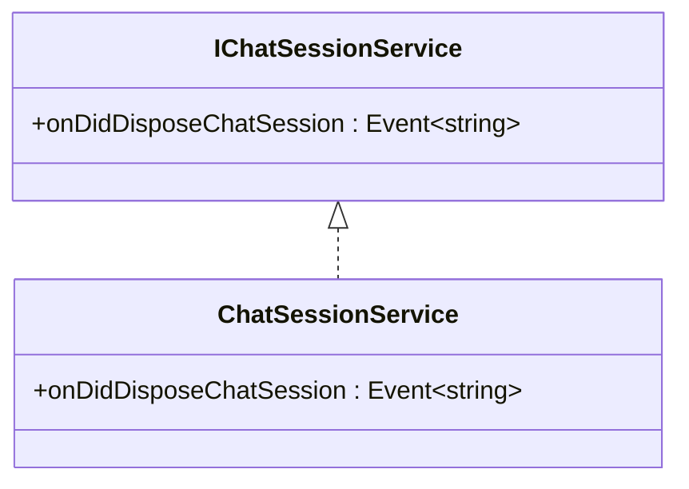
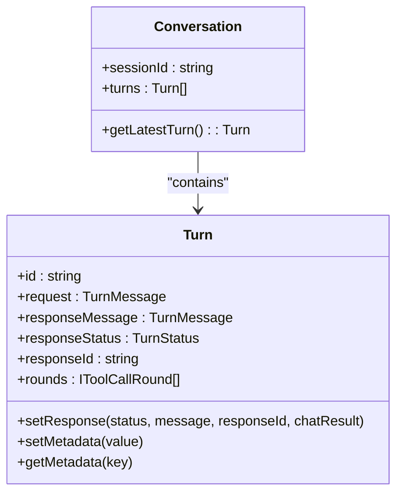
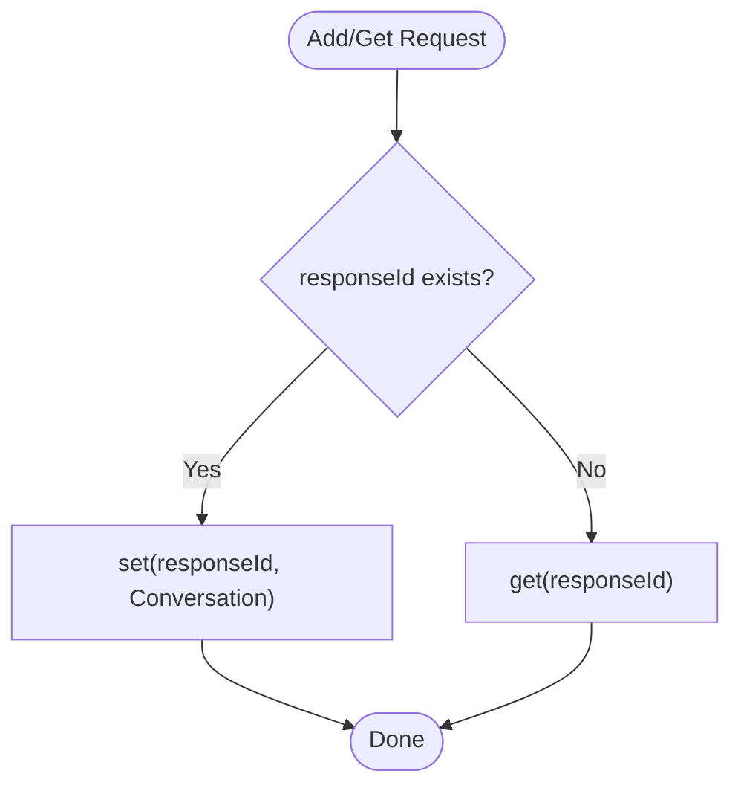
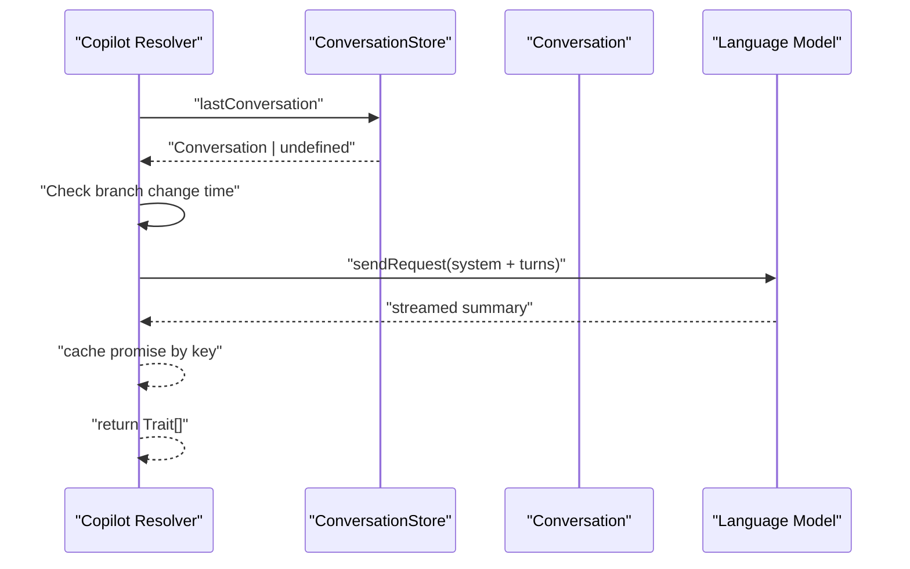
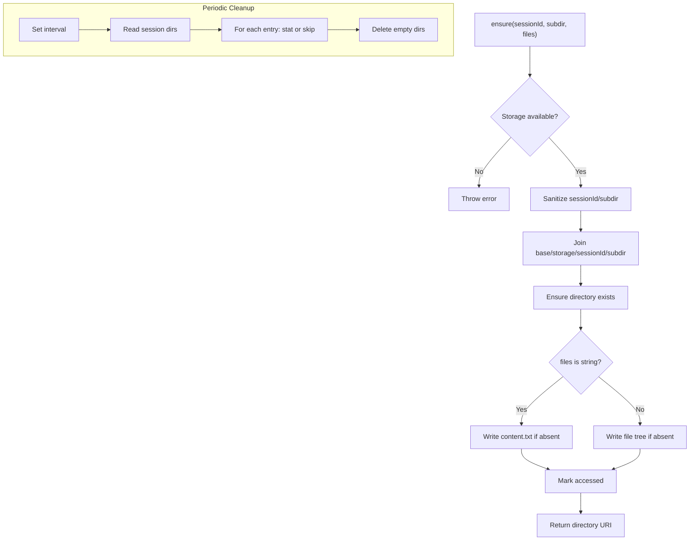
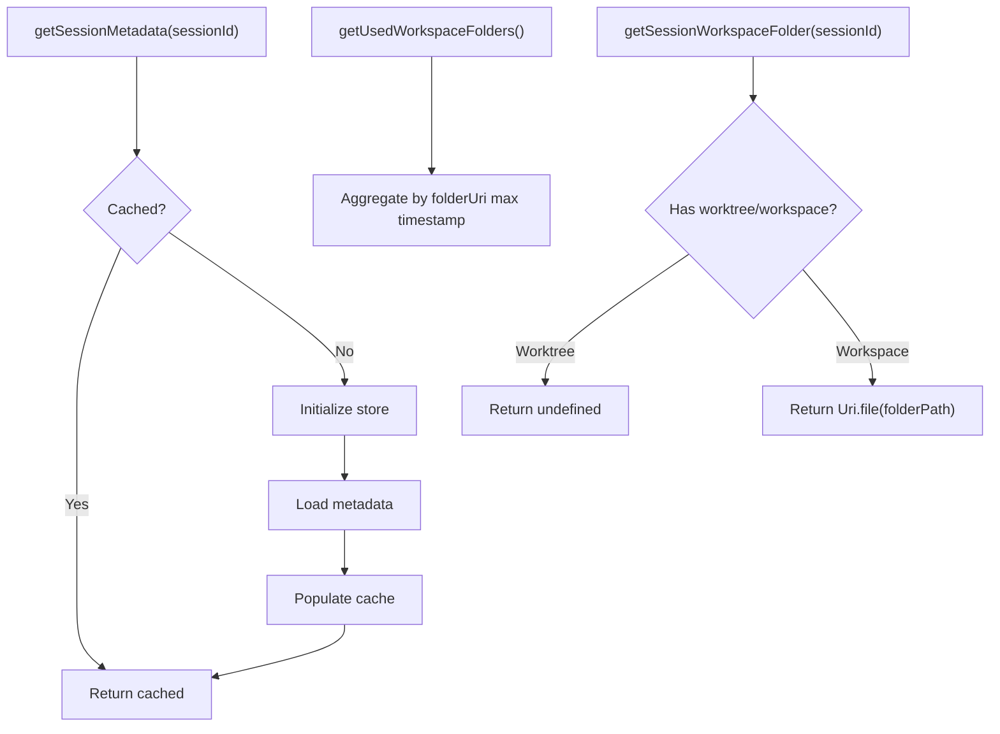
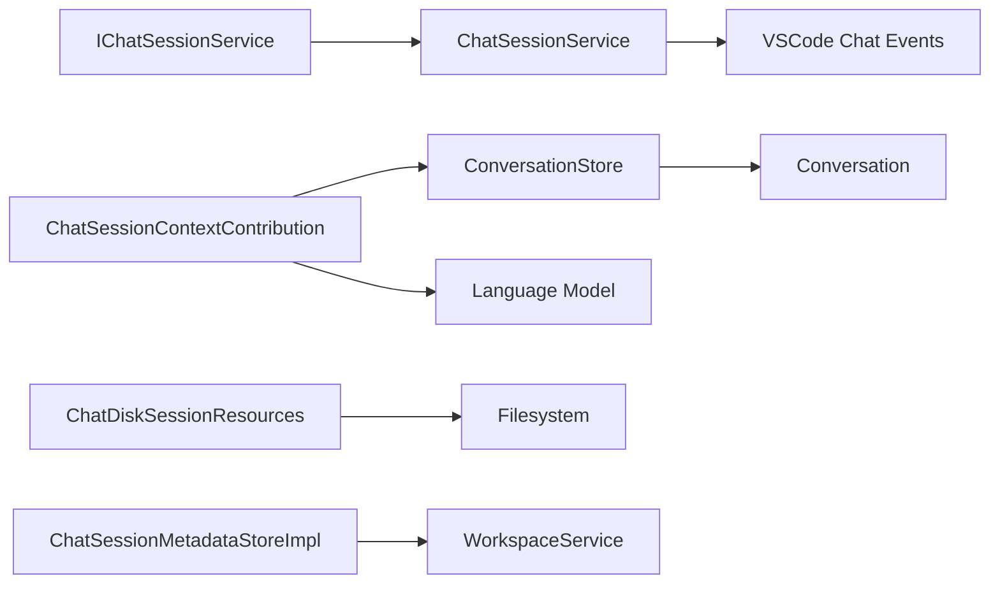

# Chat Session Management

<cite>
**Referenced Files in This Document**
- [chatSessionService.ts](file://src/platform/chat/common/chatSessionService.ts)
- [chatSessionService.ts](file://src/platform/chat/vscode/chatSessionService.ts)
- [conversationStore.ts](file://src/extension/conversationStore/node/conversationStore.ts)
- [chatSessionContextProvider.ts](file://src/extension/chatSessionContext/vscode-node/chatSessionContextProvider.ts)
- [conversation.ts](file://src/extension/prompt/common/conversation.ts)
- [chatDiskSessionResourcesImpl.ts](file://src/extension/prompts/node/chatDiskSessionResourcesImpl.ts)
- [chatSessionMetadataStoreImpl.ts](file://src/extension/chatSessions/vscode-node/chatSessionMetadataStoreImpl.ts)
</cite>

## Table of Contents
1. [Introduction](#introduction)
2. [Project Structure](#project-structure)
3. [Core Components](#core-components)
4. [Architecture Overview](#architecture-overview)
5. [Detailed Component Analysis](#detailed-component-analysis)
6. [Dependency Analysis](#dependency-analysis)
7. [Performance Considerations](#performance-considerations)
8. [Troubleshooting Guide](#troubleshooting-guide)
9. [Conclusion](#conclusion)

## Introduction
This document describes the chat session management system in the VSCode Copilot Chat extension. It covers the session lifecycle from creation to disposal, state management, persistence, and cleanup. It documents the IChatSessionService interface and its integration with VSCode’s chat session provider, explains conversation storage and retrieval, and details metadata management including timestamps and session properties. It also outlines session creation workflows, concurrent handling, sharing via context providers, restoration and recovery strategies, and error handling.

## Project Structure
The chat session management spans several modules:
- Platform-level service abstraction and implementation for VSCode chat session disposal events
- Conversation model and turn state machine
- In-memory conversation store for recent sessions
- Context provider that surfaces session context to Copilot
- Disk-backed session resources for persistence and cleanup
- Session metadata store for workspace and folder tracking

**Diagram sources**
- [chatSessionService.ts](file://src/platform/chat/common/chatSessionService.ts#L1-L15)
- [chatSessionService.ts](file://src/platform/chat/vscode/chatSessionService.ts#L1-L16)
- [conversation.ts](file://src/extension/prompt/common/conversation.ts#L224-L243)
- [conversationStore.ts](file://src/extension/conversationStore/node/conversationStore.ts#L20-L39)
- [chatSessionContextProvider.ts](file://src/extension/chatSessionContext/vscode-node/chatSessionContextProvider.ts#L83-L110)
- [chatDiskSessionResourcesImpl.ts](file://src/extension/prompts/node/chatDiskSessionResourcesImpl.ts#L38-L69)
- [chatSessionMetadataStoreImpl.ts](file://src/extension/chatSessions/vscode-node/chatSessionMetadataStoreImpl.ts#L199-L221)

**Section sources**
- [chatSessionService.ts](file://src/platform/chat/common/chatSessionService.ts#L1-L15)
- [chatSessionService.ts](file://src/platform/chat/vscode/chatSessionService.ts#L1-L16)
- [conversation.ts](file://src/extension/prompt/common/conversation.ts#L224-L243)
- [conversationStore.ts](file://src/extension/conversationStore/node/conversationStore.ts#L20-L39)
- [chatSessionContextProvider.ts](file://src/extension/chatSessionContext/vscode-node/chatSessionContextProvider.ts#L83-L110)
- [chatDiskSessionResourcesImpl.ts](file://src/extension/prompts/node/chatDiskSessionResourcesImpl.ts#L38-L69)
- [chatSessionMetadataStoreImpl.ts](file://src/extension/chatSessions/vscode-node/chatSessionMetadataStoreImpl.ts#L199-L221)

## Core Components
- IChatSessionService: Abstraction for observing chat session disposal events from VSCode.
- ChatSessionService: Implements IChatSessionService by forwarding VSCode’s onDidDisposeChatSession event.
- Conversation: Encapsulates a session’s turns and exposes latest turn accessors.
- Turn: Represents a single exchange with status, response metadata, and tool-call rounds.
- ConversationStore: LRU cache keyed by responseId for recent conversations.
- ChatSessionContextContribution: Registers a Copilot context provider that resolves traits from the most recent conversation.
- ChatDiskSessionResources: Ensures per-session directories and writes files with retention and periodic cleanup.
- ChatSessionMetadataStoreImpl: Tracks workspace/folder usage and session metadata for recovery and restoration.

**Section sources**
- [chatSessionService.ts](file://src/platform/chat/common/chatSessionService.ts#L9-L15)
- [chatSessionService.ts](file://src/platform/chat/vscode/chatSessionService.ts#L10-L16)
- [conversation.ts](file://src/extension/prompt/common/conversation.ts#L58-L91)
- [conversation.ts](file://src/extension/prompt/common/conversation.ts#L224-L243)
- [conversationStore.ts](file://src/extension/conversationStore/node/conversationStore.ts#L12-L18)
- [conversationStore.ts](file://src/extension/conversationStore/node/conversationStore.ts#L20-L39)
- [chatSessionContextProvider.ts](file://src/extension/chatSessionContext/vscode-node/chatSessionContextProvider.ts#L83-L110)
- [chatDiskSessionResourcesImpl.ts](file://src/extension/prompts/node/chatDiskSessionResourcesImpl.ts#L38-L69)
- [chatSessionMetadataStoreImpl.ts](file://src/extension/chatSessions/vscode-node/chatSessionMetadataStoreImpl.ts#L199-L221)

## Architecture Overview
The system integrates VSCode’s chat session lifecycle with internal conversation modeling and persistence. Disposal events are observed via IChatSessionService, while active sessions are represented by Conversation objects stored in an in-memory cache. Context providers can derive contextual traits from the most recent conversation. Persistent resources are managed under the extension storage directory with retention and cleanup policies.

**Diagram sources**
- [chatSessionService.ts](file://src/platform/chat/vscode/chatSessionService.ts#L10-L16)
- [conversationStore.ts](file://src/extension/conversationStore/node/conversationStore.ts#L28-L38)
- [chatSessionContextProvider.ts](file://src/extension/chatSessionContext/vscode-node/chatSessionContextProvider.ts#L122-L166)
- [chatDiskSessionResourcesImpl.ts](file://src/extension/prompts/node/chatDiskSessionResourcesImpl.ts#L79-L104)

## Detailed Component Analysis

### IChatSessionService and ChatSessionService
- Purpose: Provide a stable abstraction for listening to chat session disposal events from VSCode.
- Implementation: Delegates to VSCode’s native event stream.
- Integration: Used by higher-level components to react to session lifecycle changes.

**Diagram sources**
- [chatSessionService.ts](file://src/platform/chat/common/chatSessionService.ts#L9-L15)
- [chatSessionService.ts](file://src/platform/chat/vscode/chatSessionService.ts#L10-L16)

**Section sources**
- [chatSessionService.ts](file://src/platform/chat/common/chatSessionService.ts#L9-L15)
- [chatSessionService.ts](file://src/platform/chat/vscode/chatSessionService.ts#L10-L16)

### Conversation and Turn Lifecycle
- Conversation encapsulates a sequence of turns and enforces at least one turn.
- Turn tracks request/response pairing, status, response identifiers, and tool-call rounds.
- Response metadata includes rendering hints, token usage, and tool-call results.

**Diagram sources**
- [conversation.ts](file://src/extension/prompt/common/conversation.ts#L224-L243)
- [conversation.ts](file://src/extension/prompt/common/conversation.ts#L58-L91)
- [conversation.ts](file://src/extension/prompt/common/conversation.ts#L158-L166)
- [conversation.ts](file://src/extension/prompt/common/conversation.ts#L345-L379)

**Section sources**
- [conversation.ts](file://src/extension/prompt/common/conversation.ts#L224-L243)
- [conversation.ts](file://src/extension/prompt/common/conversation.ts#L58-L91)
- [conversation.ts](file://src/extension/prompt/common/conversation.ts#L158-L166)
- [conversation.ts](file://src/extension/prompt/common/conversation.ts#L345-L379)

### ConversationStore: In-Memory Session Storage
- Role: Provides an LRU cache keyed by responseId for recent conversations.
- Access: Exposes add/get and lastConversation getter.
- Behavior: Evicts least recently used items to cap memory usage.

**Diagram sources**
- [conversationStore.ts](file://src/extension/conversationStore/node/conversationStore.ts#L20-L39)

**Section sources**
- [conversationStore.ts](file://src/extension/conversationStore/node/conversationStore.ts#L12-L18)
- [conversationStore.ts](file://src/extension/conversationStore/node/conversationStore.ts#L20-L39)

### ChatSessionContextContribution: Session Context Provider
- Registers Copilot context providers for general and SCM inputs.
- Resolves context from the most recent conversation, skipping stale contexts after branch changes.
- Generates a concise summary from conversation turns and caches the promise to avoid redundant work.

**Diagram sources**
- [chatSessionContextProvider.ts](file://src/extension/chatSessionContext/vscode-node/chatSessionContextProvider.ts#L112-L166)
- [chatSessionContextProvider.ts](file://src/extension/chatSessionContext/vscode-node/chatSessionContextProvider.ts#L180-L223)
- [conversationStore.ts](file://src/extension/conversationStore/node/conversationStore.ts#L36-L38)

**Section sources**
- [chatSessionContextProvider.ts](file://src/extension/chatSessionContext/vscode-node/chatSessionContextProvider.ts#L83-L110)
- [chatSessionContextProvider.ts](file://src/extension/chatSessionContext/vscode-node/chatSessionContextProvider.ts#L122-L166)
- [chatSessionContextProvider.ts](file://src/extension/chatSessionContext/vscode-node/chatSessionContextProvider.ts#L180-L223)

### ChatDiskSessionResources: Persistence and Cleanup
- Ensures a per-session directory under extension storage with sanitized paths.
- Writes content or structured file trees only if missing.
- Maintains access timestamps and periodically cleans stale resources beyond a retention window.

**Diagram sources**
- [chatDiskSessionResourcesImpl.ts](file://src/extension/prompts/node/chatDiskSessionResourcesImpl.ts#L79-L104)
- [chatDiskSessionResourcesImpl.ts](file://src/extension/prompts/node/chatDiskSessionResourcesImpl.ts#L170-L207)

**Section sources**
- [chatDiskSessionResourcesImpl.ts](file://src/extension/prompts/node/chatDiskSessionResourcesImpl.ts#L38-L69)
- [chatDiskSessionResourcesImpl.ts](file://src/extension/prompts/node/chatDiskSessionResourcesImpl.ts#L79-L104)
- [chatDiskSessionResourcesImpl.ts](file://src/extension/prompts/node/chatDiskSessionResourcesImpl.ts#L170-L207)

### ChatSessionMetadataStoreImpl: Workspace and Folder Tracking
- Loads and caches session metadata keyed by sessionId.
- Provides workspace folder and used workspace folders with timestamps.
- Supports retrieving workspace folder for a given sessionId.

**Diagram sources**
- [chatSessionMetadataStoreImpl.ts](file://src/extension/chatSessions/vscode-node/chatSessionMetadataStoreImpl.ts#L222-L226)
- [chatSessionMetadataStoreImpl.ts](file://src/extension/chatSessions/vscode-node/chatSessionMetadataStoreImpl.ts#L211-L221)
- [chatSessionMetadataStoreImpl.ts](file://src/extension/chatSessions/vscode-node/chatSessionMetadataStoreImpl.ts#L199-L209)

**Section sources**
- [chatSessionMetadataStoreImpl.ts](file://src/extension/chatSessions/vscode-node/chatSessionMetadataStoreImpl.ts#L199-L221)

## Dependency Analysis
- IChatSessionService depends on VSCode’s chat disposal event.
- ChatSessionContextContribution depends on ConversationStore and language model selection.
- ConversationStore depends on LRUCache and Conversation model.
- ChatDiskSessionResources depends on extension storage and filesystem APIs.
- ChatSessionMetadataStoreImpl depends on session metadata files and workspace services.

**Diagram sources**
- [chatSessionService.ts](file://src/platform/chat/vscode/chatSessionService.ts#L10-L16)
- [chatSessionContextProvider.ts](file://src/extension/chatSessionContext/vscode-node/chatSessionContextProvider.ts#L83-L110)
- [conversationStore.ts](file://src/extension/conversationStore/node/conversationStore.ts#L20-L39)
- [chatDiskSessionResourcesImpl.ts](file://src/extension/prompts/node/chatDiskSessionResourcesImpl.ts#L38-L69)
- [chatSessionMetadataStoreImpl.ts](file://src/extension/chatSessions/vscode-node/chatSessionMetadataStoreImpl.ts#L199-L221)

**Section sources**
- [chatSessionService.ts](file://src/platform/chat/vscode/chatSessionService.ts#L10-L16)
- [chatSessionContextProvider.ts](file://src/extension/chatSessionContext/vscode-node/chatSessionContextProvider.ts#L83-L110)
- [conversationStore.ts](file://src/extension/conversationStore/node/conversationStore.ts#L20-L39)
- [chatDiskSessionResourcesImpl.ts](file://src/extension/prompts/node/chatDiskSessionResourcesImpl.ts#L38-L69)
- [chatSessionMetadataStoreImpl.ts](file://src/extension/chatSessions/vscode-node/chatSessionMetadataStoreImpl.ts#L199-L221)

## Performance Considerations
- ConversationStore uses an LRU cache to bound memory growth; ensure responseId uniqueness and frequent access patterns align with expected usage.
- ChatSessionContextContribution caches summary promises per conversation key to avoid redundant model calls; branch change invalidates cache to prevent stale context.
- ChatDiskSessionResources writes files only once and relies on periodic cleanup; tune retention and cleanup intervals for workload characteristics.
- Token usage metadata enables summarization triggers; consider thresholds appropriate for session length and model costs.

[No sources needed since this section provides general guidance]

## Troubleshooting Guide
- No disposal events observed: Verify IChatSessionService is wired to VSCode’s onDidDisposeChatSession and that the service is instantiated.
- Empty context returned: Confirm ConversationStore.lastConversation is populated and the conversation started after the last branch change.
- Missing persisted resources: Ensure extension storage URI is available and paths are sanitized; check cleanup logs for deletion of empty or stale directories.
- Metadata queries return undefined: Initialize the metadata store and confirm session metadata files exist for the requested sessionId.

**Section sources**
- [chatSessionService.ts](file://src/platform/chat/vscode/chatSessionService.ts#L10-L16)
- [chatSessionContextProvider.ts](file://src/extension/chatSessionContext/vscode-node/chatSessionContextProvider.ts#L122-L166)
- [chatDiskSessionResourcesImpl.ts](file://src/extension/prompts/node/chatDiskSessionResourcesImpl.ts#L60-L68)
- [chatSessionMetadataStoreImpl.ts](file://src/extension/chatSessions/vscode-node/chatSessionMetadataStoreImpl.ts#L222-L226)

## Conclusion
The chat session management system combines a VSCode-native disposal observer, a robust conversation model with turn state, an in-memory cache for recent sessions, and persistent disk-backed resources with retention and cleanup. Context providers can leverage the most recent conversation to enrich Copilot experiences, while metadata stores enable workspace-aware recovery and restoration. Together, these components provide a scalable foundation for session lifecycle management, concurrency-safe access, and resilient persistence.