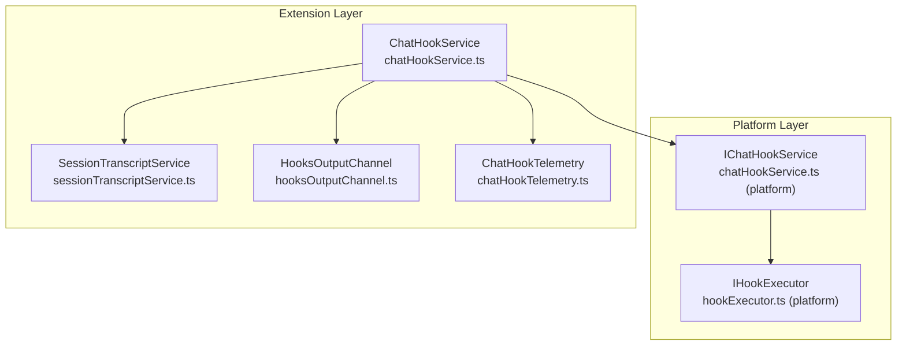
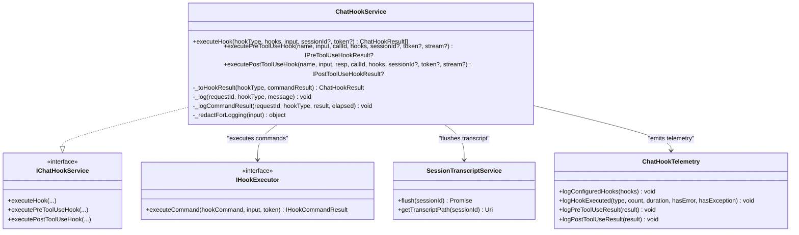
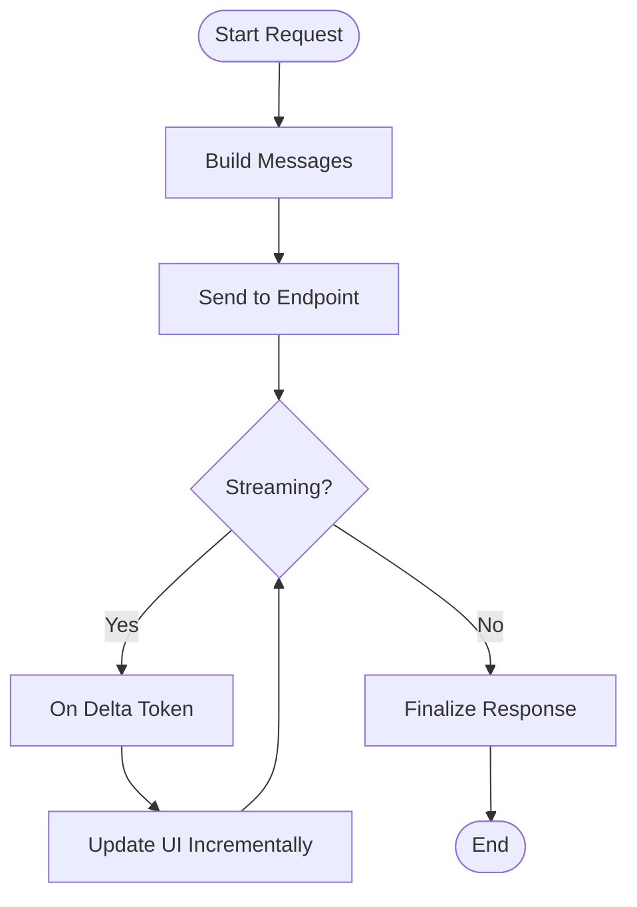
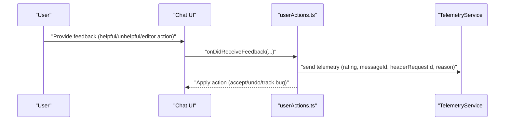
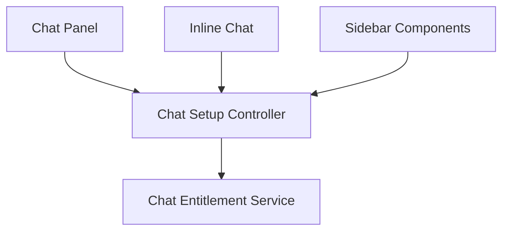
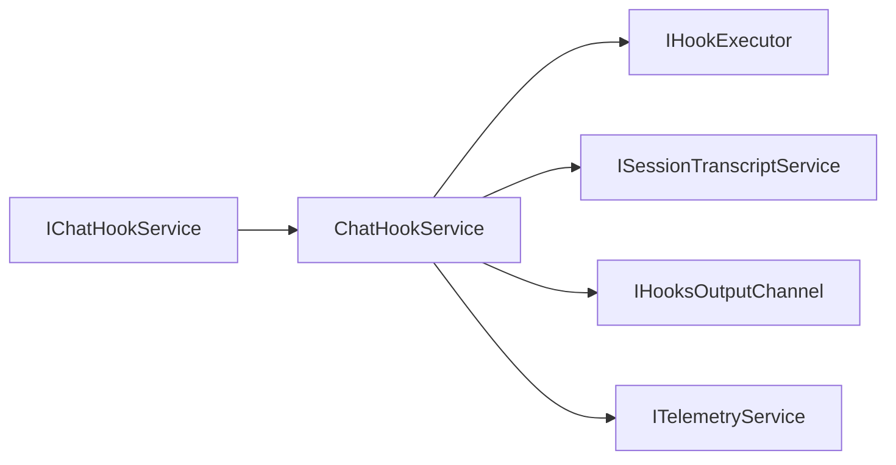

# Chat UI Integration

<cite>
**Referenced Files in This Document**
- [chatHookService.ts](file://src/extension/chat/vscode-node/chatHookService.ts)
- [chatHookTelemetry.ts](file://src/extension/chat/vscode-node/chatHookTelemetry.ts)
- [chatHookService.ts (platform)](file://src/platform/chat/common/chatHookService.ts)
- [hookExecutor.ts (platform)](file://src/platform/chat/common/hookExecutor.ts)
- [userActions.ts](file://src/extension/conversation/vscode-node/userActions.ts)
- [sessionTranscriptService.ts](file://src/extension/chat/vscode-node/sessionTranscriptService.ts)
- [hooksOutputChannel.ts](file://src/extension/chat/vscode-node/hooksOutputChannel.ts)
- [chatHookService.spec.ts](file://src/extension/chat/test/node/chatHookService.spec.ts)
- [chatMLFetcher.ts](file://src/extension/prompt/node/chatMLFetcher.ts)
- [inlineChat.test.ts](file://src/extension/inlineChat/test/vscode-node/inlineChat.test.ts)
</cite>

## Table of Contents
1. [Introduction](#introduction)
2. [Project Structure](#project-structure)
3. [Core Components](#core-components)
4. [Architecture Overview](#architecture-overview)
5. [Detailed Component Analysis](#detailed-component-analysis)
6. [Dependency Analysis](#dependency-analysis)
7. [Performance Considerations](#performance-considerations)
8. [Troubleshooting Guide](#troubleshooting-guide)
9. [Conclusion](#conclusion)
10. [Appendices](#appendices)

## Introduction
This document explains how the chat UI integrates with VSCode’s chat infrastructure, focusing on the chat hook service that extends the chat lifecycle with pre/post tool-use hooks, participant contributions, and UI rendering. It covers how messages are formatted, streamed, and updated in real time, and how feedback is collected and surfaced. Accessibility, keyboard navigation, and responsive design patterns are addressed to ensure inclusive and usable chat experiences.

## Project Structure
The chat UI integration spans two primary layers:
- Platform abstractions define the hook contracts and execution semantics used by the extension.
- Extension implementations orchestrate hook execution, telemetry, transcript flushing, and output channel logging.



**Diagram sources**
- [chatHookService.ts (platform)](file://src/platform/chat/common/chatHookService.ts#L9-L72)
- [hookExecutor.ts (platform)](file://src/platform/chat/common/hookExecutor.ts#L9-L44)
- [chatHookService.ts](file://src/extension/chat/vscode-node/chatHookService.ts#L29-L44)
- [sessionTranscriptService.ts](file://src/extension/chat/vscode-node/sessionTranscriptService.ts)
- [hooksOutputChannel.ts](file://src/extension/chat/vscode-node/hooksOutputChannel.ts)
- [chatHookTelemetry.ts](file://src/extension/chat/vscode-node/chatHookTelemetry.ts#L10-L99)

**Section sources**
- [chatHookService.ts (platform)](file://src/platform/chat/common/chatHookService.ts#L1-L270)
- [hookExecutor.ts (platform)](file://src/platform/chat/common/hookExecutor.ts#L1-L45)
- [chatHookService.ts](file://src/extension/chat/vscode-node/chatHookService.ts#L1-L449)
- [chatHookTelemetry.ts](file://src/extension/chat/vscode-node/chatHookTelemetry.ts#L1-L99)

## Core Components
- ChatHookService: Executes hook commands, merges inputs, logs results, collapses outcomes, and enforces permissions and stop reasons.
- IChatHookService (platform): Defines the contract for hook execution, including pre/post tool-use collapsing rules.
- IHookExecutor (platform): Executes a single hook command and interprets exit codes and outputs.
- ChatHookTelemetry: Emits telemetry for configured hooks, execution durations, and collapsed results.
- SessionTranscriptService: Ensures transcripts are flushed prior to hook execution for up-to-date context.
- HooksOutputChannel: Provides a dedicated output channel for hook logs and warnings.

**Section sources**
- [chatHookService.ts](file://src/extension/chat/vscode-node/chatHookService.ts#L29-L449)
- [chatHookService.ts (platform)](file://src/platform/chat/common/chatHookService.ts#L9-L91)
- [hookExecutor.ts (platform)](file://src/platform/chat/common/hookExecutor.ts#L9-L44)
- [chatHookTelemetry.ts](file://src/extension/chat/vscode-node/chatHookTelemetry.ts#L10-L99)
- [sessionTranscriptService.ts](file://src/extension/chat/vscode-node/sessionTranscriptService.ts)
- [hooksOutputChannel.ts](file://src/extension/chat/vscode-node/hooksOutputChannel.ts)

## Architecture Overview
The chat hook service sits between the chat UI and the underlying hook executor. It orchestrates:
- Transcript flushing before hook execution
- Merging common and per-command inputs
- Command execution with cancellation support
- Result collapsing and permission enforcement
- Telemetry emission and output channel logging

```mermaid
sequenceDiagram
participant UI as "Chat UI"
participant Svc as "ChatHookService"
participant Trans as "SessionTranscriptService"
participant Exec as "IHookExecutor"
participant Out as "HooksOutputChannel"
participant Tel as "ChatHookTelemetry"
UI->>Svc : "executePreToolUseHook(...)"
Svc->>Trans : "flush(sessionId) (race timeout)"
Trans-->>Svc : "transcriptPath"
Svc->>Svc : "merge commonInput + hookCommand.cwd + tool input"
loop "for each hookCommand"
Svc->>Out : "appendLine(log input)"
Svc->>Exec : "executeCommand(hookCommand, input, token)"
Exec-->>Svc : "IHookCommandResult"
Svc->>Out : "appendLine(log result)"
Svc->>Svc : "collapse results (deny>ask>allow)"
alt "stopReason set"
Svc-->>UI : "stopReason"
exit
end
end
Svc->>Tel : "logPreToolUseResult(result)"
Svc-->>UI : "collapsed result"
```

**Diagram sources**
- [chatHookService.ts](file://src/extension/chat/vscode-node/chatHookService.ts#L81-L173)
- [chatHookService.ts](file://src/extension/chat/vscode-node/chatHookService.ts#L264-L359)
- [hookExecutor.ts (platform)](file://src/platform/chat/common/hookExecutor.ts#L28-L44)
- [sessionTranscriptService.ts](file://src/extension/chat/vscode-node/sessionTranscriptService.ts)
- [hooksOutputChannel.ts](file://src/extension/chat/vscode-node/hooksOutputChannel.ts)
- [chatHookTelemetry.ts](file://src/extension/chat/vscode-node/chatHookTelemetry.ts#L67-L82)

## Detailed Component Analysis

### Chat Hook Service Implementation
Responsibilities:
- Resolve hook commands from the request hooks and execute them in order.
- Merge common metadata (timestamp, hook event name, session_id, transcript_path) with per-command inputs.
- Log inputs and outputs to the hooks output channel with redaction of sensitive keys.
- Collapse multiple hook results into a single outcome:
  - PreToolUse: deny > ask > allow; last updatedInput wins; concatenate additionalContext.
  - PostToolUse: first block decision wins; concatenate additionalContext.
- Enforce stopReason semantics and optional systemMessage warnings.
- Emit telemetry for hook configuration and execution outcomes.



**Diagram sources**
- [chatHookService.ts](file://src/extension/chat/vscode-node/chatHookService.ts#L29-L449)
- [chatHookService.ts (platform)](file://src/platform/chat/common/chatHookService.ts#L9-L72)
- [hookExecutor.ts (platform)](file://src/platform/chat/common/hookExecutor.ts#L9-L44)
- [chatHookTelemetry.ts](file://src/extension/chat/vscode-node/chatHookTelemetry.ts#L10-L99)
- [sessionTranscriptService.ts](file://src/extension/chat/vscode-node/sessionTranscriptService.ts)

**Section sources**
- [chatHookService.ts](file://src/extension/chat/vscode-node/chatHookService.ts#L29-L449)
- [chatHookService.ts (platform)](file://src/platform/chat/common/chatHookService.ts#L9-L91)

### Message Formatting, Streaming, and Real-Time Updates
- Message formatting and streaming are handled by the chat backend and transport layer. The chat ML fetcher manages successful responses, token counts, and streaming recording for telemetry and UI updates.
- The chat UI receives incremental updates via the response stream and renders them progressively.



**Diagram sources**
- [chatMLFetcher.ts](file://src/extension/prompt/node/chatMLFetcher.ts#L1575-L1588)

**Section sources**
- [chatMLFetcher.ts](file://src/extension/prompt/node/chatMLFetcher.ts#L1567-L1588)

### Feedback Collection Mechanism and User Interaction Patterns
- Feedback events are captured and mapped to telemetry events for both panel and inline chat contexts.
- The handler translates user actions (helpful/unhelpful, accepted/undone, bug reports) into structured telemetry payloads.



**Diagram sources**
- [userActions.ts](file://src/extension/conversation/vscode-node/userActions.ts#L367-L394)

**Section sources**
- [userActions.ts](file://src/extension/conversation/vscode-node/userActions.ts#L350-L394)

### Integration with VSCode Chat Panel, Inline Chat, and Sidebar Components
- The extension tests demonstrate inline chat integration points and lifecycle behaviors, indicating how inline chat participates in the broader chat ecosystem.
- The chat setup controller coordinates chat entitlement and UI flows, ensuring proper integration with the workbench.



**Diagram sources**
- [inlineChat.test.ts](file://src/extension/inlineChat/test/vscode-node/inlineChat.test.ts#L1-L21)

**Section sources**
- [inlineChat.test.ts](file://src/extension/inlineChat/test/vscode-node/inlineChat.test.ts#L1-L21)

### Examples of Custom Chat UI Extensions and Participant Contributions
- Hook-based customization allows participants to contribute context, enforce permissions, and influence tool usage without modifying the core agent logic.
- Example capabilities:
  - PreToolUse: Deny/block tool invocation, request additional context, or update tool arguments.
  - PostToolUse: Block tool results, append additional context, or surface warnings.
  - Stop/Subagent hooks: Control agent progression and termination.

**Section sources**
- [chatHookService.ts (platform)](file://src/platform/chat/common/chatHookService.ts#L74-L270)
- [chatHookService.ts](file://src/extension/chat/vscode-node/chatHookService.ts#L264-L447)

## Dependency Analysis
The hook service depends on platform interfaces and extension services to deliver a robust, observable, and secure chat experience.



**Diagram sources**
- [chatHookService.ts (platform)](file://src/platform/chat/common/chatHookService.ts#L9-L72)
- [chatHookService.ts](file://src/extension/chat/vscode-node/chatHookService.ts#L35-L44)

**Section sources**
- [chatHookService.ts (platform)](file://src/platform/chat/common/chatHookService.ts#L9-L72)
- [chatHookService.ts](file://src/extension/chat/vscode-node/chatHookService.ts#L35-L44)

## Performance Considerations
- Race timeout on transcript flush prevents blocking hook execution.
- Early stopping when a hook sets a stop reason avoids unnecessary work.
- Redaction of sensitive input keys reduces risk and overhead.
- Telemetry captures execution counts, durations, and error rates for observability.

**Section sources**
- [chatHookService.ts](file://src/extension/chat/vscode-node/chatHookService.ts#L96-L102)
- [chatHookService.ts](file://src/extension/chat/vscode-node/chatHookService.ts#L146-L151)
- [chatHookTelemetry.ts](file://src/extension/chat/vscode-node/chatHookTelemetry.ts#L45-L65)

## Troubleshooting Guide
Common issues and resolutions:
- Hooks not executing: Verify hook configuration and that the hook type exists in the request hooks.
- Unexpected stopReason: Inspect hook outputs for stopReason and ensure hookEventName matches the current hook type.
- Permission decisions ignored: Confirm decision values are valid ('allow', 'deny', 'ask' for PreToolUse; 'block' for PostToolUse).
- Transcript outdated: Ensure transcript flush occurs before hook execution; check race timeout behavior.
- Excessive warnings: Review hook stderr outputs and adjust hook logic to avoid non-blocking errors.

Operational logging:
- Use the hooks output channel to inspect inputs and outputs per hook command.
- Monitor telemetry events for hook configuration and execution outcomes.

**Section sources**
- [chatHookService.ts](file://src/extension/chat/vscode-node/chatHookService.ts#L75-L79)
- [chatHookService.ts](file://src/extension/chat/vscode-node/chatHookService.ts#L122-L173)
- [hooksOutputChannel.ts](file://src/extension/chat/vscode-node/hooksOutputChannel.ts)
- [chatHookTelemetry.ts](file://src/extension/chat/vscode-node/chatHookTelemetry.ts#L15-L43)

## Conclusion
The chat hook service provides a flexible, observable, and secure extension point for integrating custom chat UI behaviors and participant contributions. By enforcing strict permission collapsing, early stopping, and comprehensive telemetry, it ensures predictable and transparent chat experiences across the panel, inline chat, and sidebar components.

## Appendices

### Accessibility and Responsive Design Patterns
- Keyboard Navigation: Ensure focus management and keyboard shortcuts are available for chat input, feedback controls, and participant menus.
- Screen Reader Support: Announce message updates, warnings, and progress indicators to assistive technologies.
- Responsive Layouts: Adapt chat panels and inline chat to narrow widths, with collapsible context areas and truncated message previews.
- High Contrast and Zoom: Validate readability and contrast ratios across themes and zoom levels.

[No sources needed since this section provides general guidance]