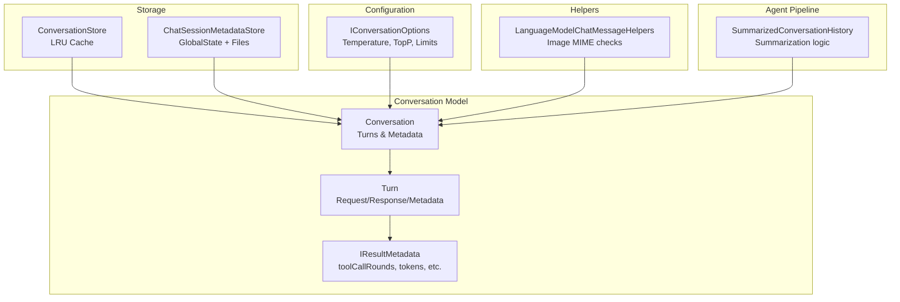
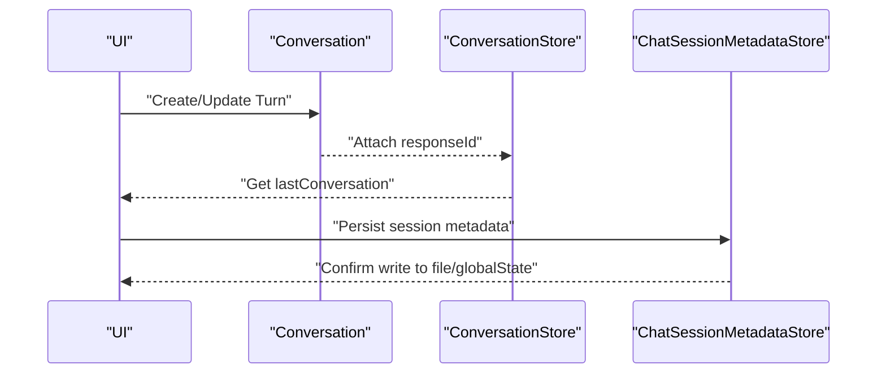
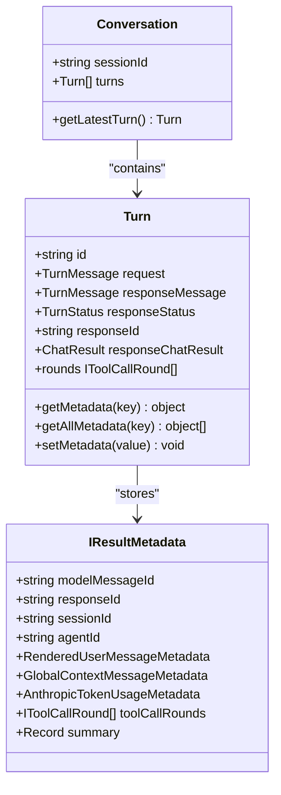
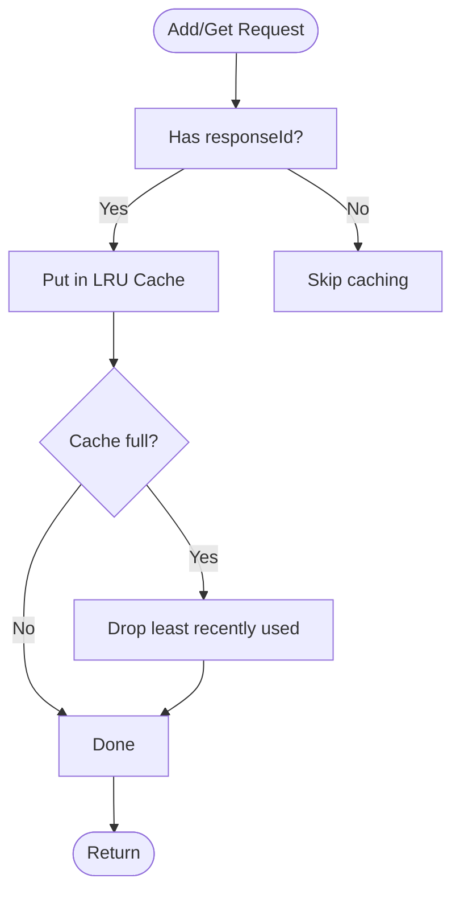
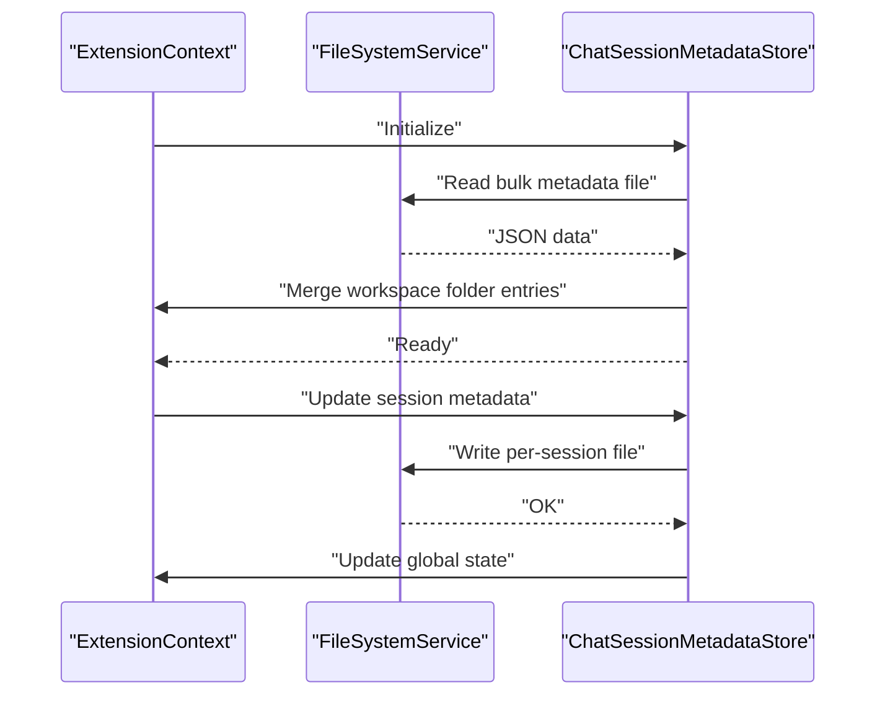
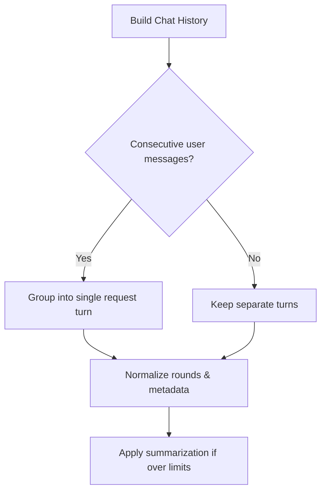
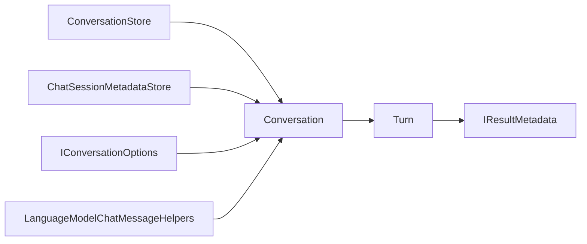

# Conversation History & Storage

<cite>
**Referenced Files in This Document**
- [conversationStore.ts](file://src/extension/conversationStore/node/conversationStore.ts)
- [conversation.ts](file://src/extension/prompt/common/conversation.ts)
- [conversation.ts](file://src/extension/prompt/node/conversation.ts)
- [conversationOptions.ts](file://src/platform/chat/common/conversationOptions.ts)
- [languageModelChatMessageHelpers.ts](file://src/extension/conversation/common/languageModelChatMessageHelpers.ts)
- [chatSessionMetadataStoreImpl.ts](file://src/extension/chatSessions/vscode-node/chatSessionMetadataStoreImpl.ts)
- [chatHistoryBuilder.spec.ts](file://src/extension/chatSessions/vscode-node/test/chatHistoryBuilder.spec.ts)
- [chatSessionMetadataStoreImpl.spec.ts](file://src/extension/chatSessions/vscode-node/test/chatSessionMetadataStoreImpl.spec.ts)
- [summarizedConversationHistory.tsx](file://src/extension/prompts/node/agent/summarizedConversationHistory.tsx)
- [authenticationUpgradeService.ts](file://src/platform/authentication/common/authenticationUpgradeService.ts)
</cite>

## Table of Contents
1. [Introduction](#introduction)
2. [Project Structure](#project-structure)
3. [Core Components](#core-components)
4. [Architecture Overview](#architecture-overview)
5. [Detailed Component Analysis](#detailed-component-analysis)
6. [Dependency Analysis](#dependency-analysis)
7. [Performance Considerations](#performance-considerations)
8. [Troubleshooting Guide](#troubleshooting-guide)
9. [Conclusion](#conclusion)
10. [Appendices](#appendices)

## Introduction
This document explains the conversation history and storage systems in the project. It covers the conversation model structure, persistence strategies, retrieval mechanisms, configuration options, language model helpers, serialization/deserialization, integration with VSCode workspace state and file-based storage, indexing/search capabilities, and performance optimizations for large histories.

## Project Structure
The conversation system spans several modules:
- Conversation model and metadata: core types and lifecycle of turns and conversations
- Conversation store: in-memory LRU cache for recent conversations
- Chat session metadata store: persistent storage for session metadata using VSCode’s global state and file system
- Conversation options: runtime configuration for model behavior
- Language model helpers: utilities for processing chat message parts
- Summarization pipeline: agent-side logic to manage long histories
- Authentication upgrade service: demonstrates history reuse and context preservation

**Diagram sources**
- [conversation.ts](file://src/extension/prompt/common/conversation.ts#L224-L243)
- [conversation.ts](file://src/extension/prompt/common/conversation.ts#L58-L189)
- [conversation.ts](file://src/extension/prompt/common/conversation.ts#L345-L379)
- [conversationStore.ts](file://src/extension/conversationStore/node/conversationStore.ts#L20-L39)
- [chatSessionMetadataStoreImpl.ts](file://src/extension/chatSessions/vscode-node/chatSessionMetadataStoreImpl.ts#L49-L311)
- [conversationOptions.ts](file://src/platform/chat/common/conversationOptions.ts#L10-L16)
- [languageModelChatMessageHelpers.ts](file://src/extension/conversation/common/languageModelChatMessageHelpers.ts#L17-L36)
- [summarizedConversationHistory.tsx](file://src/extension/prompts/node/agent/summarizedConversationHistory.tsx#L769-L789)

**Section sources**
- [conversation.ts](file://src/extension/prompt/common/conversation.ts#L1-L412)
- [conversationStore.ts](file://src/extension/conversationStore/node/conversationStore.ts#L1-L40)
- [chatSessionMetadataStoreImpl.ts](file://src/extension/chatSessions/vscode-node/chatSessionMetadataStoreImpl.ts#L49-L311)
- [conversationOptions.ts](file://src/platform/chat/common/conversationOptions.ts#L1-L17)
- [languageModelChatMessageHelpers.ts](file://src/extension/conversation/common/languageModelChatMessageHelpers.ts#L1-L37)
- [summarizedConversationHistory.tsx](file://src/extension/prompts/node/agent/summarizedConversationHistory.tsx#L769-L789)

## Core Components
- Conversation model
  - Turn encapsulates a single exchange with request/response and metadata
  - Conversation aggregates turns and exposes latest turn access
  - IResultMetadata carries tool-call rounds, token usage, rendered messages, and other runtime artifacts
- Conversation store
  - Lightweight in-memory LRU cache keyed by responseId
  - Provides add/get and access to last conversation
- Chat session metadata store
  - Persists per-session metadata to a file and mirrors to VSCode global state
  - Ensures durability and recovery across sessions
- Conversation options
  - Exposes max response tokens, temperature, topP, and rejection message
- Language model helpers
  - Validates image data parts for supported MIME types
- Summarization pipeline
  - Manages summarization boundaries and continuation flags for long histories

**Section sources**
- [conversation.ts](file://src/extension/prompt/common/conversation.ts#L58-L189)
- [conversation.ts](file://src/extension/prompt/common/conversation.ts#L224-L243)
- [conversation.ts](file://src/extension/prompt/common/conversation.ts#L345-L379)
- [conversationStore.ts](file://src/extension/conversationStore/node/conversationStore.ts#L20-L39)
- [chatSessionMetadataStoreImpl.ts](file://src/extension/chatSessions/vscode-node/chatSessionMetadataStoreImpl.ts#L49-L311)
- [conversationOptions.ts](file://src/platform/chat/common/conversationOptions.ts#L10-L16)
- [languageModelChatMessageHelpers.ts](file://src/extension/conversation/common/languageModelChatMessageHelpers.ts#L17-L36)
- [summarizedConversationHistory.tsx](file://src/extension/prompts/node/agent/summarizedConversationHistory.tsx#L769-L789)

## Architecture Overview
The system separates transient and persistent concerns:
- Transient: ConversationStore holds recent conversations in memory
- Persistent: ChatSessionMetadataStore writes session metadata to disk and syncs with VSCode global state
- Model: Conversation/Turn/IResultMetadata define the canonical data model
- Configuration: IConversationOptions controls model behavior
- Helpers: LanguageModelChatMessageHelpers support message part validation

**Diagram sources**
- [conversationStore.ts](file://src/extension/conversationStore/node/conversationStore.ts#L28-L38)
- [chatSessionMetadataStoreImpl.ts](file://src/extension/chatSessions/vscode-node/chatSessionMetadataStoreImpl.ts#L263-L268)

## Detailed Component Analysis

### Conversation Model Structure
The conversation model centers around Turn and Conversation:
- Turn
  - Holds request (user prompt, references, tool references, edited file events)
  - Tracks response (message, status, responseId, chatResult)
  - Stores metadata including tool-call rounds, rendered messages, token usage, and summaries
  - Provides getters for rendered user/global context and round normalization
- Conversation
  - Immutable collection of turns with latest-turn access
- IResultMetadata
  - Carries structured metadata for downstream consumers (tokens, tool-call rounds, summaries, rendered content)

**Diagram sources**
- [conversation.ts](file://src/extension/prompt/common/conversation.ts#L58-L189)
- [conversation.ts](file://src/extension/prompt/common/conversation.ts#L224-L243)
- [conversation.ts](file://src/extension/prompt/common/conversation.ts#L345-L379)

**Section sources**
- [conversation.ts](file://src/extension/prompt/common/conversation.ts#L23-L37)
- [conversation.ts](file://src/extension/prompt/common/conversation.ts#L58-L189)
- [conversation.ts](file://src/extension/prompt/common/conversation.ts#L224-L243)
- [conversation.ts](file://src/extension/prompt/common/conversation.ts#L345-L379)

### Conversation Store Architecture
- Purpose: cache recent conversations keyed by responseId
- Implementation: LRU cache with fixed capacity
- Accessors: add, get, lastConversation

**Diagram sources**
- [conversationStore.ts](file://src/extension/conversationStore/node/conversationStore.ts#L20-L39)

**Section sources**
- [conversationStore.ts](file://src/extension/conversationStore/node/conversationStore.ts#L10-L39)

### Chat Session Metadata Store (Persistent Storage)
- Initialization
  - Loads bulk metadata from file
  - Merges workspace folder entries from global state
  - Cleans up invalid or untitled sessions
- Write path
  - Writes per-session metadata to a dedicated file
  - Updates in-memory cache and global state
- Read path
  - Retrieves session metadata from cache or file
  - Deduplicates workspace folders across sessions

**Diagram sources**
- [chatSessionMetadataStoreImpl.ts](file://src/extension/chatSessions/vscode-node/chatSessionMetadataStoreImpl.ts#L49-L74)
- [chatSessionMetadataStoreImpl.ts](file://src/extension/chatSessions/vscode-node/chatSessionMetadataStoreImpl.ts#L263-L268)
- [chatSessionMetadataStoreImpl.ts](file://src/extension/chatSessions/vscode-node/chatSessionMetadataStoreImpl.ts#L279-L298)
- [chatSessionMetadataStoreImpl.ts](file://src/extension/chatSessions/vscode-node/chatSessionMetadataStoreImpl.ts#L300-L310)

**Section sources**
- [chatSessionMetadataStoreImpl.ts](file://src/extension/chatSessions/vscode-node/chatSessionMetadataStoreImpl.ts#L49-L311)

### Conversation Options Configuration
- IConversationOptions defines:
  - maxResponseTokens: cap on response tokens
  - temperature: randomness of sampling
  - topP: nucleus sampling
  - rejectionMessage: user-facing message on rejection
- These options influence model behavior during conversation turns.

**Section sources**
- [conversationOptions.ts](file://src/platform/chat/common/conversationOptions.ts#L10-L16)

### Language Model Chat Message Helpers
- Purpose: validate image data parts for supported MIME types
- Functionality: type guard for image parts and MIME-type checks

**Section sources**
- [languageModelChatMessageHelpers.ts](file://src/extension/conversation/common/languageModelChatMessageHelpers.ts#L17-L36)

### Serialization, Deserialization, and Data Transformation
- Conversation model
  - Uses typed metadata and normalized references
  - Rounds normalization ensures continuity across persisted and live results
- Chat session metadata
  - Serialized to JSON for file and global state persistence
  - Tests demonstrate multi-turn history building and grouping of consecutive user messages
- Example references
  - Multi-turn history builder: [chatHistoryBuilder.spec.ts](file://src/extension/chatSessions/vscode-node/test/chatHistoryBuilder.spec.ts#L215-L247)
  - Workspace folder storage and retrieval: [chatSessionMetadataStoreImpl.spec.ts](file://src/extension/chatSessions/vscode-node/test/chatSessionMetadataStoreImpl.spec.ts#L725-L741), [chatSessionMetadataStoreImpl.spec.ts](file://src/extension/chatSessions/vscode-node/test/chatSessionMetadataStoreImpl.spec.ts#L994-L1017)

**Section sources**
- [conversation.ts](file://src/extension/prompt/common/conversation.ts#L199-L218)
- [conversation.ts](file://src/extension/prompt/common/conversation.ts#L248-L341)
- [chatSessionMetadataStoreImpl.spec.ts](file://src/extension/chatSessions/vscode-node/test/chatHistoryBuilder.spec.ts#L215-L247)
- [chatSessionMetadataStoreImpl.spec.ts](file://src/extension/chatSessions/vscode-node/test/chatSessionMetadataStoreImpl.spec.ts#L725-L741)
- [chatSessionMetadataStoreImpl.spec.ts](file://src/extension/chatSessions/vscode-node/test/chatSessionMetadataStoreImpl.spec.ts#L994-L1017)

### Integration with VSCode Workspace State and File-Based Storage
- Global state integration
  - Stores workspace folder entries and merges with bulk metadata
  - Debounced updates to reduce IO
- File-based storage
  - Per-session metadata files for durability
  - Bulk metadata file for aggregated state
- Recovery behavior
  - On startup, cleans invalid entries and retries writes for incomplete sessions

**Section sources**
- [chatSessionMetadataStoreImpl.ts](file://src/extension/chatSessions/vscode-node/chatSessionMetadataStoreImpl.ts#L49-L74)
- [chatSessionMetadataStoreImpl.ts](file://src/extension/chatSessions/vscode-node/chatSessionMetadataStoreImpl.ts#L75-L90)
- [chatSessionMetadataStoreImpl.ts](file://src/extension/chatSessions/vscode-node/chatSessionMetadataStoreImpl.ts#L263-L268)
- [chatSessionMetadataStoreImpl.ts](file://src/extension/chatSessions/vscode-node/chatSessionMetadataStoreImpl.ts#L279-L298)
- [chatSessionMetadataStoreImpl.ts](file://src/extension/chatSessions/vscode-node/chatSessionMetadataStoreImpl.ts#L300-L310)

### Conversation Indexing, Search, and Performance Optimization
- Indexing and search
  - No explicit indexing/search APIs are present in the analyzed files
  - Summarization pipeline manages long histories by excluding certain rounds/messages when over limits
- Performance optimization
  - ConversationStore uses LRU cache to bound memory usage
  - Debounced global state updates minimize IO overhead
  - Consecutive user messages are grouped to reduce turn count and improve throughput

**Diagram sources**
- [chatHistoryBuilder.spec.ts](file://src/extension/chatSessions/vscode-node/test/chatHistoryBuilder.spec.ts#L234-L247)
- [summarizedConversationHistory.tsx](file://src/extension/prompts/node/agent/summarizedConversationHistory.tsx#L769-L789)

**Section sources**
- [chatHistoryBuilder.spec.ts](file://src/extension/chatSessions/vscode-node/test/chatHistoryBuilder.spec.ts#L215-L247)
- [summarizedConversationHistory.tsx](file://src/extension/prompts/node/agent/summarizedConversationHistory.tsx#L769-L789)
- [conversationStore.ts](file://src/extension/conversationStore/node/conversationStore.ts#L24-L26)

### Context Preservation Across Sessions
- Demonstrated by authentication upgrade service retrieving prior request fields from history when resuming a session
- Highlights preservation of prompt, command, references, and tool references across interruptions

**Section sources**
- [authenticationUpgradeService.ts](file://src/platform/authentication/common/authenticationUpgradeService.ts#L161-L183)

## Dependency Analysis
- Conversation depends on Turn and IResultMetadata
- ConversationStore depends on Conversation and LRUCache
- ChatSessionMetadataStore depends on file system and VSCode global state
- IConversationOptions influences model behavior
- LanguageModelChatMessageHelpers supports message part validation

**Diagram sources**
- [conversation.ts](file://src/extension/prompt/common/conversation.ts#L224-L243)
- [conversationStore.ts](file://src/extension/conversationStore/node/conversationStore.ts#L20-L39)
- [chatSessionMetadataStoreImpl.ts](file://src/extension/chatSessions/vscode-node/chatSessionMetadataStoreImpl.ts#L49-L311)
- [conversationOptions.ts](file://src/platform/chat/common/conversationOptions.ts#L10-L16)
- [languageModelChatMessageHelpers.ts](file://src/extension/conversation/common/languageModelChatMessageHelpers.ts#L17-L36)

**Section sources**
- [conversation.ts](file://src/extension/prompt/common/conversation.ts#L1-L412)
- [conversationStore.ts](file://src/extension/conversationStore/node/conversationStore.ts#L1-L40)
- [chatSessionMetadataStoreImpl.ts](file://src/extension/chatSessions/vscode-node/chatSessionMetadataStoreImpl.ts#L1-L311)
- [conversationOptions.ts](file://src/platform/chat/common/conversationOptions.ts#L1-L17)
- [languageModelChatMessageHelpers.ts](file://src/extension/conversation/common/languageModelChatMessageHelpers.ts#L1-L37)

## Performance Considerations
- Use ConversationStore for recent, frequently accessed conversations to avoid repeated IO
- Prefer grouped user messages to reduce turn count and token usage
- Apply summarization when approaching model context limits to maintain performance
- Debounce global state updates to minimize disk writes

[No sources needed since this section provides general guidance]

## Troubleshooting Guide
- Conversation not found by responseId
  - Verify responseId is set when adding to ConversationStore
  - Check LRU eviction behavior if cache capacity is exceeded
- Metadata not persisting
  - Confirm per-session file write succeeded and global state update was triggered
  - Review initialization cleanup of invalid or untitled sessions
- History anomalies after restart
  - Ensure bulk metadata merge and workspace folder reconciliation occurred during initialization

**Section sources**
- [conversationStore.ts](file://src/extension/conversationStore/node/conversationStore.ts#L28-L38)
- [chatSessionMetadataStoreImpl.ts](file://src/extension/chatSessions/vscode-node/chatSessionMetadataStoreImpl.ts#L49-L74)
- [chatSessionMetadataStoreImpl.ts](file://src/extension/chatSessions/vscode-node/chatSessionMetadataStoreImpl.ts#L263-L268)
- [chatSessionMetadataStoreImpl.ts](file://src/extension/chatSessions/vscode-node/chatSessionMetadataStoreImpl.ts#L279-L298)

## Conclusion
The conversation system combines a robust model (Turn/Conversation/IResultMetadata), an efficient in-memory cache (ConversationStore), and durable persistence (ChatSessionMetadataStore) integrated with VSCode’s workspace state and file system. Configuration via IConversationOptions and helpers for language model message parts complete the picture. Summarization and grouping strategies help manage long histories efficiently, while debounced updates and LRU caching optimize performance.

[No sources needed since this section summarizes without analyzing specific files]

## Appendices
- Example references for tests and behavior:
  - Multi-turn history and grouping: [chatHistoryBuilder.spec.ts](file://src/extension/chatSessions/vscode-node/test/chatHistoryBuilder.spec.ts#L215-L247)
  - Workspace folder storage/retrieval: [chatSessionMetadataStoreImpl.spec.ts](file://src/extension/chatSessions/vscode-node/test/chatSessionMetadataStoreImpl.spec.ts#L725-L741), [chatSessionMetadataStoreImpl.spec.ts](file://src/extension/chatSessions/vscode-node/test/chatSessionMetadataStoreImpl.spec.ts#L994-L1017)
  - Intent invocation metadata: [conversation.ts](file://src/extension/prompt/node/conversation.ts#L9-L15)

[No sources needed since this section lists references without analyzing specific files]