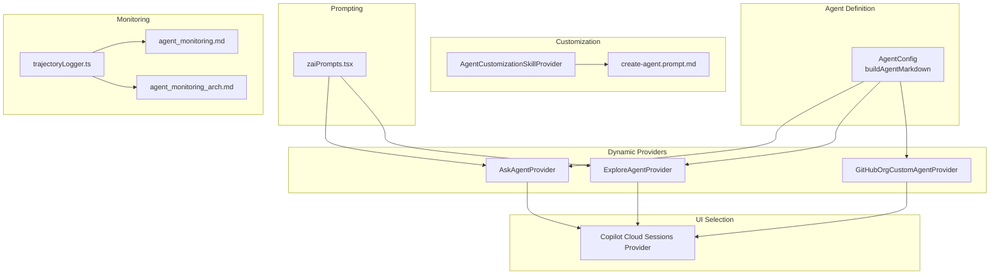
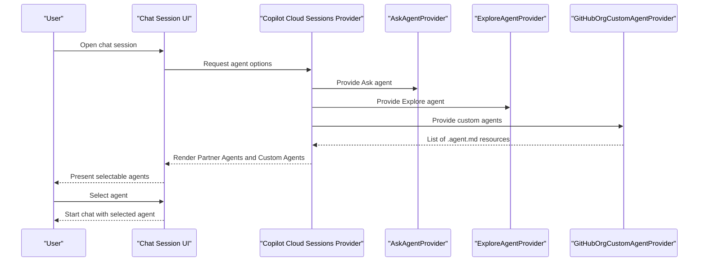
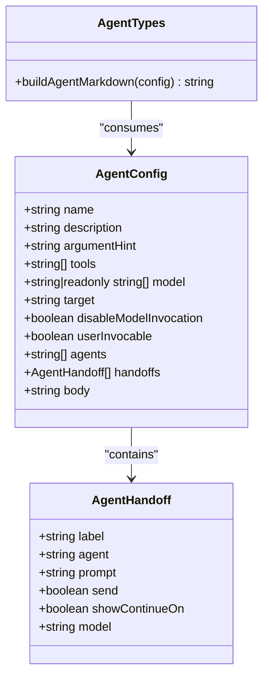
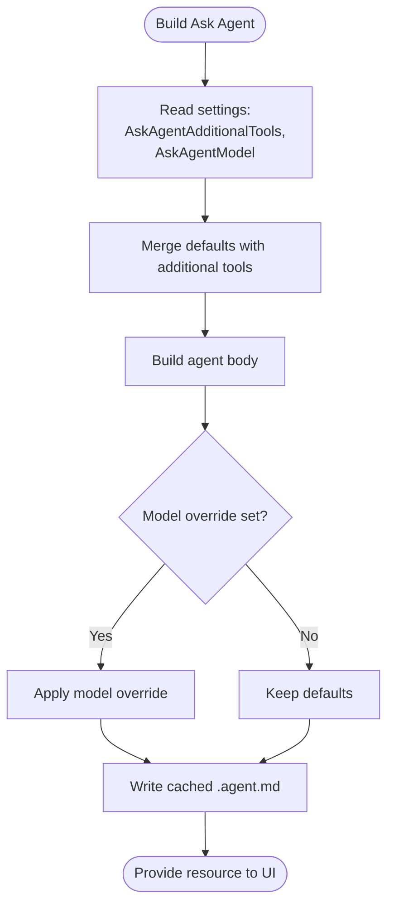
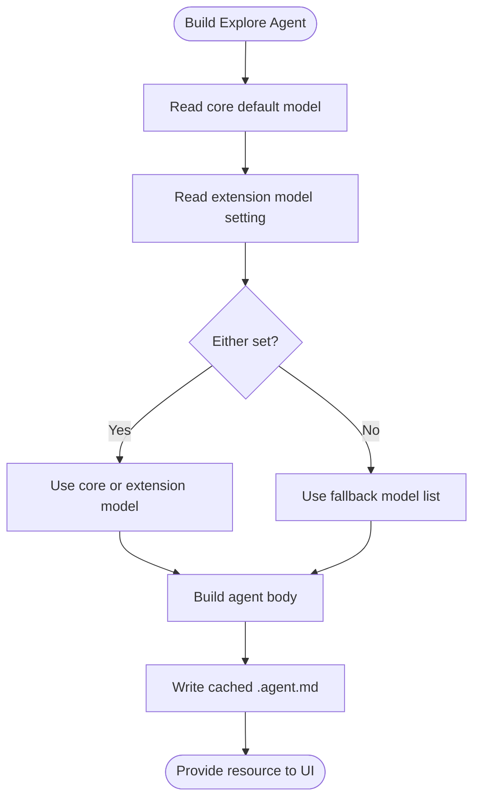
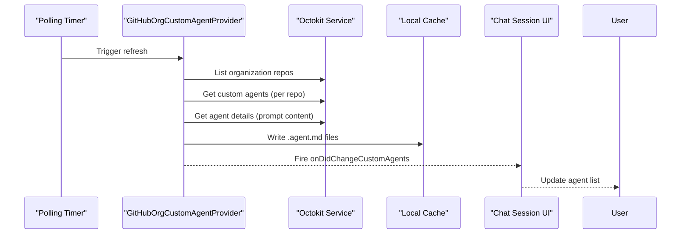
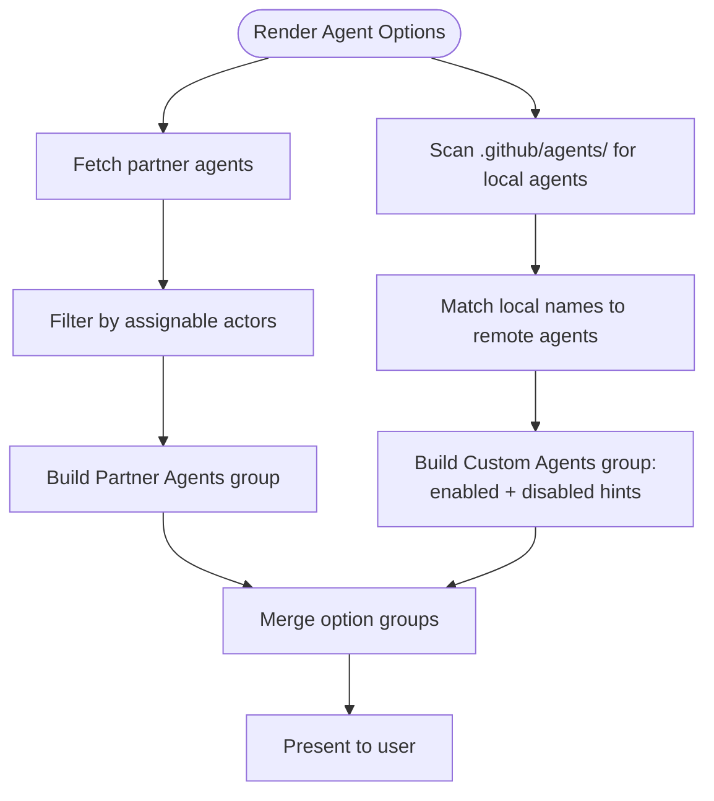
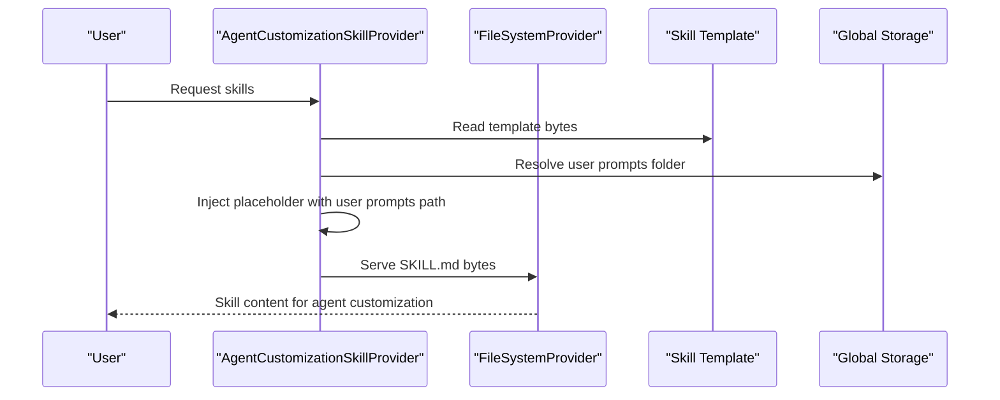
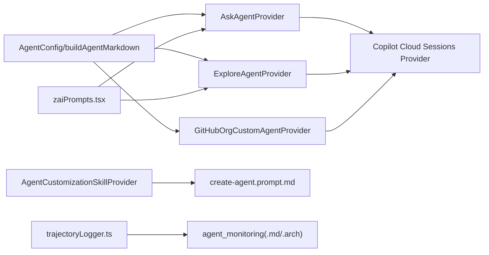

# Agent Configuration & Personalization

<cite>
**Referenced Files in This Document**
- [agentTypes.ts](file://src/extension/agents/vscode-node/agentTypes.ts)
- [askAgentProvider.ts](file://src/extension/agents/vscode-node/askAgentProvider.ts)
- [exploreAgentProvider.ts](file://src/extension/agents/vscode-node/exploreAgentProvider.ts)
- [githubOrgCustomAgentProvider.ts](file://src/extension/agents/vscode-node/githubOrgCustomAgentProvider.ts)
- [copilotCloudSessionsProvider.ts](file://src/extension/chatSessions/vscode-node/copilotCloudSessionsProvider.ts)
- [agentCustomizationSkillProvider.ts](file://src/extension/agents/vscode-node/agentCustomizationSkillProvider.ts)
- [create-agent.prompt.md](file://assets/prompts/create-agent.prompt.md)
- [zaiPrompts.tsx](file://src/extension/prompts/node/agent/zaiPrompts.tsx)
- [trajectoryLogger.ts](file://src/platform/trajectory/node/trajectoryLogger.ts)
- [agent_monitoring.md](file://docs/monitoring/agent_monitoring.md)
- [agent_monitoring_arch.md](file://docs/monitoring/agent_monitoring_arch.md)
</cite>

## Table of Contents
1. [Introduction](#introduction)
2. [Project Structure](#project-structure)
3. [Core Components](#core-components)
4. [Architecture Overview](#architecture-overview)
5. [Detailed Component Analysis](#detailed-component-analysis)
6. [Dependency Analysis](#dependency-analysis)
7. [Performance Considerations](#performance-considerations)
8. [Troubleshooting Guide](#troubleshooting-guide)
9. [Conclusion](#conclusion)
10. [Appendices](#appendices)

## Introduction
This document explains how agents are configured, personalized, selected, and optimized within the system. It covers:
- Agent selection criteria and capability matching
- Performance optimization settings
- Personality and response style customization
- Domain expertise and tool access configuration
- Contextual behavior modification and handoffs
- Examples for debugging specialists, code reviewers, and project explorers
- Agent switching, fallback behaviors, and load balancing strategies
- Integration with custom instructions, context providers, and external model configurations
- Monitoring, resource allocation, and scaling considerations
- Troubleshooting, validation, and optimal setup recommendations

## Project Structure
Agent configuration and personalization spans several subsystems:
- Agent metadata and generation: AgentConfig, YAML frontmatter builder, and provider implementations
- Dynamic agent provisioning: Ask and Explore agents with settings-based customization
- Remote agent discovery and caching: GitHub organization-backed agent lists
- Chat session agent selection UI: Partner and custom agent options
- Skill-based customization: Built-in agent-customization skill and user prompts integration
- Prompt engineering and role shaping: Agent-specific prompt templates
- Monitoring and observability: Trajectory logging and monitoring docs

**Diagram sources**
- [agentTypes.ts](file://src/extension/agents/vscode-node/agentTypes.ts#L22-L120)
- [askAgentProvider.ts](file://src/extension/agents/vscode-node/askAgentProvider.ts#L42-L151)
- [exploreAgentProvider.ts](file://src/extension/agents/vscode-node/exploreAgentProvider.ts#L50-L148)
- [githubOrgCustomAgentProvider.ts](file://src/extension/agents/vscode-node/githubOrgCustomAgentProvider.ts#L20-L156)
- [copilotCloudSessionsProvider.ts](file://src/extension/chatSessions/vscode-node/copilotCloudSessionsProvider.ts#L766-L821)
- [agentCustomizationSkillProvider.ts](file://src/extension/agents/vscode-node/agentCustomizationSkillProvider.ts#L29-L253)
- [create-agent.prompt.md](file://assets/prompts/create-agent.prompt.md#L1-L29)
- [zaiPrompts.tsx](file://src/extension/prompts/node/agent/zaiPrompts.tsx#L27-L35)
- [trajectoryLogger.ts](file://src/platform/trajectory/node/trajectoryLogger.ts#L177-L225)
- [agent_monitoring.md](file://docs/monitoring/agent_monitoring.md)
- [agent_monitoring_arch.md](file://docs/monitoring/agent_monitoring_arch.md)

**Section sources**
- [agentTypes.ts](file://src/extension/agents/vscode-node/agentTypes.ts#L1-L121)
- [askAgentProvider.ts](file://src/extension/agents/vscode-node/askAgentProvider.ts#L1-L152)
- [exploreAgentProvider.ts](file://src/extension/agents/vscode-node/exploreAgentProvider.ts#L1-L149)
- [githubOrgCustomAgentProvider.ts](file://src/extension/agents/vscode-node/githubOrgCustomAgentProvider.ts#L1-L212)
- [copilotCloudSessionsProvider.ts](file://src/extension/chatSessions/vscode-node/copilotCloudSessionsProvider.ts#L638-L821)
- [agentCustomizationSkillProvider.ts](file://src/extension/agents/vscode-node/agentCustomizationSkillProvider.ts#L1-L254)
- [create-agent.prompt.md](file://assets/prompts/create-agent.prompt.md#L1-L29)
- [zaiPrompts.tsx](file://src/extension/prompts/node/agent/zaiPrompts.tsx#L20-L35)
- [trajectoryLogger.ts](file://src/platform/trajectory/node/trajectoryLogger.ts#L177-L225)
- [agent_monitoring.md](file://docs/monitoring/agent_monitoring.md)
- [agent_monitoring_arch.md](file://docs/monitoring/agent_monitoring_arch.md)

## Core Components
- AgentConfig: Defines agent metadata, tools, model preferences, handoffs, and body content. Includes a builder that emits YAML frontmatter plus a body.
- AskAgentProvider: Dynamically builds a read-only “Ask” agent with settings-driven tool additions and model overrides.
- ExploreAgentProvider: Dynamically builds a read-only “Explore” subagent with model fallback lists and settings-driven tuning.
- GitHubOrgCustomAgentProvider: Pulls remote agents from an organization repository, caches them locally, and exposes them to the UI.
- Copilot Cloud Sessions Provider: Presents selectable agent options including partner agents and custom agents, with default selections and filtering.
- AgentCustomizationSkillProvider: Serves a built-in skill that guides users through agent customization and integrates with user prompts storage.
- Prompt templates: Role-focused prompts (e.g., zaiPrompts) shape agent personality and response style.
- Trajectory logging: Captures agent steps, models, tokens, and costs for monitoring and optimization.

**Section sources**
- [agentTypes.ts](file://src/extension/agents/vscode-node/agentTypes.ts#L22-L120)
- [askAgentProvider.ts](file://src/extension/agents/vscode-node/askAgentProvider.ts#L20-L151)
- [exploreAgentProvider.ts](file://src/extension/agents/vscode-node/exploreAgentProvider.ts#L30-L148)
- [githubOrgCustomAgentProvider.ts](file://src/extension/agents/vscode-node/githubOrgCustomAgentProvider.ts#L20-L156)
- [copilotCloudSessionsProvider.ts](file://src/extension/chatSessions/vscode-node/copilotCloudSessionsProvider.ts#L766-L821)
- [agentCustomizationSkillProvider.ts](file://src/extension/agents/vscode-node/agentCustomizationSkillProvider.ts#L29-L253)
- [zaiPrompts.tsx](file://src/extension/prompts/node/agent/zaiPrompts.tsx#L27-L35)
- [trajectoryLogger.ts](file://src/platform/trajectory/node/trajectoryLogger.ts#L177-L225)

## Architecture Overview
Agent personalization is driven by configuration objects, dynamic providers, and UI selection. Providers generate .agent.md files that define capabilities, tools, and behavior. Users select agents in chat sessions, optionally augmented by skills and custom instructions.

**Diagram sources**
- [copilotCloudSessionsProvider.ts](file://src/extension/chatSessions/vscode-node/copilotCloudSessionsProvider.ts#L766-L821)
- [askAgentProvider.ts](file://src/extension/agents/vscode-node/askAgentProvider.ts#L67-L75)
- [exploreAgentProvider.ts](file://src/extension/agents/vscode-node/exploreAgentProvider.ts#L75-L83)
- [githubOrgCustomAgentProvider.ts](file://src/extension/agents/vscode-node/githubOrgCustomAgentProvider.ts#L35-L53)

## Detailed Component Analysis

### AgentConfig and YAML Frontmatter Builder
AgentConfig encapsulates:
- Identity: name, description, argument-hint
- Behavior: tools, model(s), target, disableModelInvocation, userInvocable
- Composition: agents (subagents), handoffs (label, agent, prompt, send, showContinueOn, model)
- Content: body (prompt narrative)

The builder writes a deterministic YAML frontmatter followed by the body, enabling consistent parsing and validation.

**Diagram sources**
- [agentTypes.ts](file://src/extension/agents/vscode-node/agentTypes.ts#L9-L34)
- [agentTypes.ts](file://src/extension/agents/vscode-node/agentTypes.ts#L56-L120)

**Section sources**
- [agentTypes.ts](file://src/extension/agents/vscode-node/agentTypes.ts#L22-L120)

### Ask Agent Provider (Read-Only Assistant)
The Ask agent is read-only, focused on answering questions and explaining code. Its configuration is customized by:
- Additional tools from settings
- Optional model override
- Default read-only toolset

It writes a cached .agent.md file to global storage for consumption by the UI.

**Diagram sources**
- [askAgentProvider.ts](file://src/extension/agents/vscode-node/askAgentProvider.ts#L129-L150)
- [askAgentProvider.ts](file://src/extension/agents/vscode-node/askAgentProvider.ts#L77-L93)

**Section sources**
- [askAgentProvider.ts](file://src/extension/agents/vscode-node/askAgentProvider.ts#L20-L151)

### Explore Agent Provider (Code Research Subagent)
The Explore agent is a read-only subagent optimized for fast, parallel codebase exploration. It:
- Supports a fallback model priority list
- Respects core and extension configuration for default and override models
- Emphasizes broad-to-narrow search strategies and speed principles

**Diagram sources**
- [exploreAgentProvider.ts](file://src/extension/agents/vscode-node/exploreAgentProvider.ts#L135-L147)
- [exploreAgentProvider.ts](file://src/extension/agents/vscode-node/exploreAgentProvider.ts#L85-L101)

**Section sources**
- [exploreAgentProvider.ts](file://src/extension/agents/vscode-node/exploreAgentProvider.ts#L30-L148)

### GitHub Organization Custom Agent Provider
This provider:
- Polls organization repositories for custom agents
- Fetches full agent details (including prompt content)
- Generates .agent.md content from remote details
- Caches files and notifies listeners of changes
- Integrates with the UI to surface selectable agents

**Diagram sources**
- [githubOrgCustomAgentProvider.ts](file://src/extension/agents/vscode-node/githubOrgCustomAgentProvider.ts#L55-L116)
- [githubOrgCustomAgentProvider.ts](file://src/extension/agents/vscode-node/githubOrgCustomAgentProvider.ts#L118-L155)

**Section sources**
- [githubOrgCustomAgentProvider.ts](file://src/extension/agents/vscode-node/githubOrgCustomAgentProvider.ts#L20-L156)

### Chat Session Agent Selection
The UI composes agent options from:
- Partner agents (filtered by assignable actors)
- Local custom agents (matching remote names)
- Disabled local-only agents with hints to push to remote

**Diagram sources**
- [copilotCloudSessionsProvider.ts](file://src/extension/chatSessions/vscode-node/copilotCloudSessionsProvider.ts#L638-L655)
- [copilotCloudSessionsProvider.ts](file://src/extension/chatSessions/vscode-node/copilotCloudSessionsProvider.ts#L766-L821)
- [copilotCloudSessionsProvider.ts](file://src/extension/chatSessions/vscode-node/copilotCloudSessionsProvider.ts#L657-L674)

**Section sources**
- [copilotCloudSessionsProvider.ts](file://src/extension/chatSessions/vscode-node/copilotCloudSessionsProvider.ts#L638-L821)

### Agent Customization Skill and User Prompts Integration
The built-in skill:
- Serves a dynamic SKILL.md via a FileSystemProvider
- Injects the user prompts folder path into the skill content
- Enables users to learn and apply customization patterns

**Diagram sources**
- [agentCustomizationSkillProvider.ts](file://src/extension/agents/vscode-node/agentCustomizationSkillProvider.ts#L202-L234)
- [agentCustomizationSkillProvider.ts](file://src/extension/agents/vscode-node/agentCustomizationSkillProvider.ts#L148-L177)

**Section sources**
- [agentCustomizationSkillProvider.ts](file://src/extension/agents/vscode-node/agentCustomizationSkillProvider.ts#L29-L253)
- [create-agent.prompt.md](file://assets/prompts/create-agent.prompt.md#L1-L29)

### Prompt Engineering and Personality Shaping
Role-focused prompts emphasize:
- Front-loaded instructions and constraints
- Clear persona assignment
- Decomposition guidance for complex tasks

These principles guide agent behavior and response style.

**Section sources**
- [zaiPrompts.tsx](file://src/extension/prompts/node/agent/zaiPrompts.tsx#L27-L35)

## Dependency Analysis
- AgentConfig and builders are consumed by providers to produce .agent.md files.
- Ask and Explore providers depend on configuration services for tool and model customization.
- GitHubOrgCustomAgentProvider depends on Octokit and a caching service to manage remote agents.
- Copilot Cloud Sessions Provider orchestrates UI options by aggregating provider outputs.
- AgentCustomizationSkillProvider depends on extension context and global storage to locate user prompts.
- Trajectory logger captures agent execution metrics for monitoring.

**Diagram sources**
- [agentTypes.ts](file://src/extension/agents/vscode-node/agentTypes.ts#L56-L120)
- [askAgentProvider.ts](file://src/extension/agents/vscode-node/askAgentProvider.ts#L129-L150)
- [exploreAgentProvider.ts](file://src/extension/agents/vscode-node/exploreAgentProvider.ts#L135-L147)
- [githubOrgCustomAgentProvider.ts](file://src/extension/agents/vscode-node/githubOrgCustomAgentProvider.ts#L118-L155)
- [copilotCloudSessionsProvider.ts](file://src/extension/chatSessions/vscode-node/copilotCloudSessionsProvider.ts#L766-L821)
- [agentCustomizationSkillProvider.ts](file://src/extension/agents/vscode-node/agentCustomizationSkillProvider.ts#L202-L234)
- [create-agent.prompt.md](file://assets/prompts/create-agent.prompt.md#L1-L29)
- [zaiPrompts.tsx](file://src/extension/prompts/node/agent/zaiPrompts.tsx#L27-L35)
- [trajectoryLogger.ts](file://src/platform/trajectory/node/trajectoryLogger.ts#L177-L225)
- [agent_monitoring.md](file://docs/monitoring/agent_monitoring.md)
- [agent_monitoring_arch.md](file://docs/monitoring/agent_monitoring_arch.md)

**Section sources**
- [agentTypes.ts](file://src/extension/agents/vscode-node/agentTypes.ts#L22-L120)
- [askAgentProvider.ts](file://src/extension/agents/vscode-node/askAgentProvider.ts#L42-L151)
- [exploreAgentProvider.ts](file://src/extension/agents/vscode-node/exploreAgentProvider.ts#L50-L148)
- [githubOrgCustomAgentProvider.ts](file://src/extension/agents/vscode-node/githubOrgCustomAgentProvider.ts#L20-L156)
- [copilotCloudSessionsProvider.ts](file://src/extension/chatSessions/vscode-node/copilotCloudSessionsProvider.ts#L766-L821)
- [agentCustomizationSkillProvider.ts](file://src/extension/agents/vscode-node/agentCustomizationSkillProvider.ts#L29-L253)
- [zaiPrompts.tsx](file://src/extension/prompts/node/agent/zaiPrompts.tsx#L27-L35)
- [trajectoryLogger.ts](file://src/platform/trajectory/node/trajectoryLogger.ts#L177-L225)
- [agent_monitoring.md](file://docs/monitoring/agent_monitoring.md)
- [agent_monitoring_arch.md](file://docs/monitoring/agent_monitoring_arch.md)

## Performance Considerations
- Model selection: Explore agent uses a fallback model list to balance speed and capability; Ask agent supports overrides for specialized tasks.
- Tool sets: Limit tools to reduce token usage and latency; merge additional tools carefully to avoid redundant or conflicting capabilities.
- Caching: Providers write cached .agent.md files to global storage to minimize repeated computation and I/O.
- Parallelism: Explore agent’s speed principles encourage parallel independent tool calls to reduce latency.
- Monitoring: Trajectory logging tracks tokens, cost, and step metrics to inform optimization and budgeting.

[No sources needed since this section provides general guidance]

## Troubleshooting Guide
Common issues and resolutions:
- Agent not appearing in UI:
  - Verify provider readiness and cancellation checks.
  - Confirm cache writes succeed and files exist in global storage.
- Remote agents missing:
  - Ensure organization repositories are accessible and agent details are fetched.
  - Check cache updates and clearing logic for stale entries.
- Model invocation errors:
  - Validate model settings and fallback lists.
  - Confirm model availability and permissions.
- Customization skill not loaded:
  - Confirm FileSystemProvider registration and placeholder injection.
  - Verify user prompts folder path resolution.
- Monitoring gaps:
  - Ensure trajectory logging is enabled and steps are recorded with model names and metrics.

**Section sources**
- [askAgentProvider.ts](file://src/extension/agents/vscode-node/askAgentProvider.ts#L67-L93)
- [exploreAgentProvider.ts](file://src/extension/agents/vscode-node/exploreAgentProvider.ts#L75-L101)
- [githubOrgCustomAgentProvider.ts](file://src/extension/agents/vscode-node/githubOrgCustomAgentProvider.ts#L55-L116)
- [agentCustomizationSkillProvider.ts](file://src/extension/agents/vscode-node/agentCustomizationSkillProvider.ts#L148-L177)
- [trajectoryLogger.ts](file://src/platform/trajectory/node/trajectoryLogger.ts#L177-L225)

## Conclusion
Agent configuration and personalization rely on a flexible, layered system:
- Structured metadata and YAML frontmatter define capabilities and behavior
- Dynamic providers tailor agents to user settings and contexts
- Remote and local agent discovery enrich selection
- Prompt engineering shapes personality and response style
- Monitoring and caching enable performance optimization and reliability

[No sources needed since this section summarizes without analyzing specific files]

## Appendices

### Example Agent Configurations
- Debugging Specialist:
  - Tools: search, read, web, execute/testFailure, execute/getTerminalOutput
  - Model: prioritized model list optimized for diagnostics
  - Body: structured workflow emphasizing hypothesis, evidence, and remediation
- Code Reviewer:
  - Tools: search, read, github/issue_read, github.vscode-pull-request-github/activePullRequest
  - Model: higher reasoning model
  - Body: checklist-driven review process with style and correctness emphasis
- Project Explorer:
  - Tools: search, read, github/repo
  - Model: Explore agent fallback list
  - Body: broad-to-narrow search strategy with parallel exploration

[No sources needed since this section provides general guidance]

### Agent Switching, Fallbacks, and Load Balancing
- UI selection groups:
  - Partner agents: filtered by assignable actors
  - Custom agents: matched by name; disabled hints for local-only agents
- Fallback behaviors:
  - Explore agent: fallback model list ensures availability
  - Ask agent: model override enables task-specific tuning
- Load balancing:
  - Parallel tool calls in Explore agent improve throughput
  - Separate providers isolate concerns and enable independent scaling

**Section sources**
- [copilotCloudSessionsProvider.ts](file://src/extension/chatSessions/vscode-node/copilotCloudSessionsProvider.ts#L766-L821)
- [exploreAgentProvider.ts](file://src/extension/agents/vscode-node/exploreAgentProvider.ts#L19-L23)
- [askAgentProvider.ts](file://src/extension/agents/vscode-node/askAgentProvider.ts#L130-L131)

### Integration with Custom Instructions and Context Providers
- Built-in skill guides customization and integrates with user prompts storage
- Prompt templates shape agent roles and response styles
- Configuration services drive tool and model choices

**Section sources**
- [agentCustomizationSkillProvider.ts](file://src/extension/agents/vscode-node/agentCustomizationSkillProvider.ts#L29-L253)
- [create-agent.prompt.md](file://assets/prompts/create-agent.prompt.md#L1-L29)
- [zaiPrompts.tsx](file://src/extension/prompts/node/agent/zaiPrompts.tsx#L27-L35)

### Monitoring, Resource Allocation, and Scaling
- Trajectory logging captures per-step metrics and inferred model names
- Monitoring docs describe architecture and operational guidance
- Optimize by selecting appropriate models, limiting tools, and leveraging parallelism

**Section sources**
- [trajectoryLogger.ts](file://src/platform/trajectory/node/trajectoryLogger.ts#L177-L225)
- [agent_monitoring.md](file://docs/monitoring/agent_monitoring.md)
- [agent_monitoring_arch.md](file://docs/monitoring/agent_monitoring_arch.md)