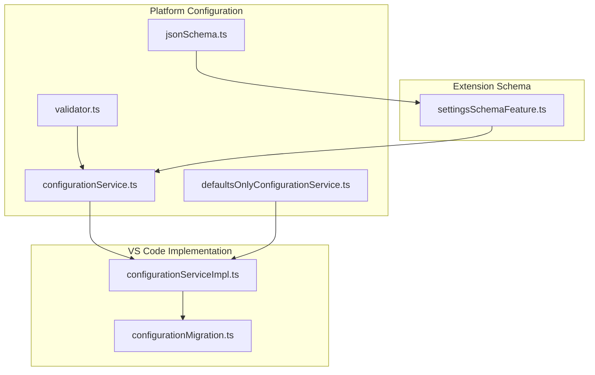
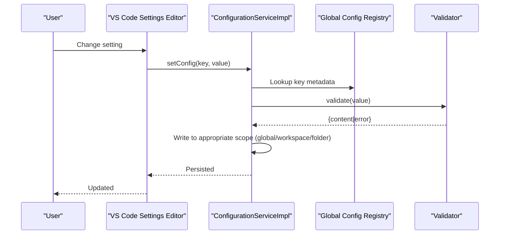
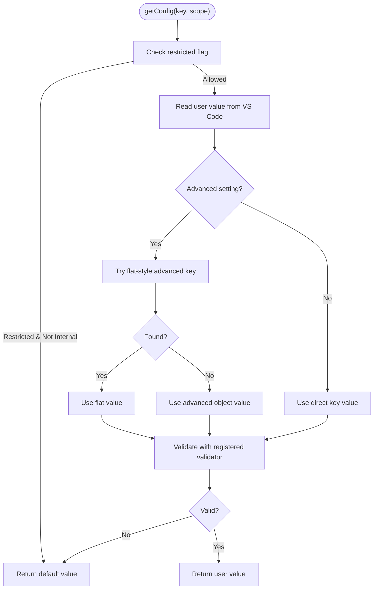
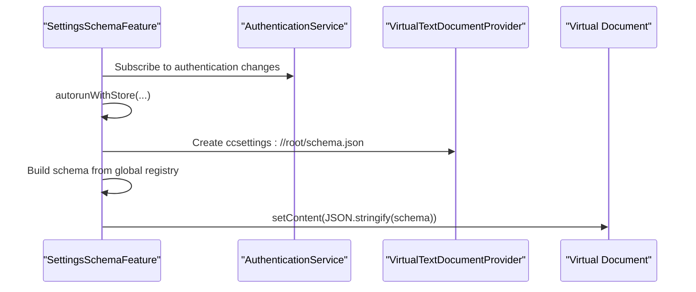
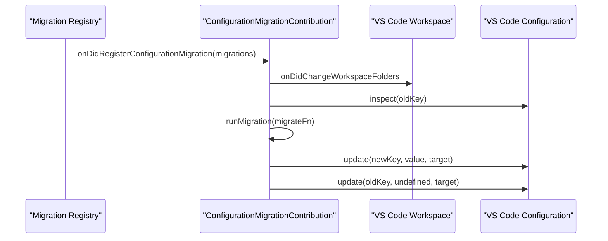
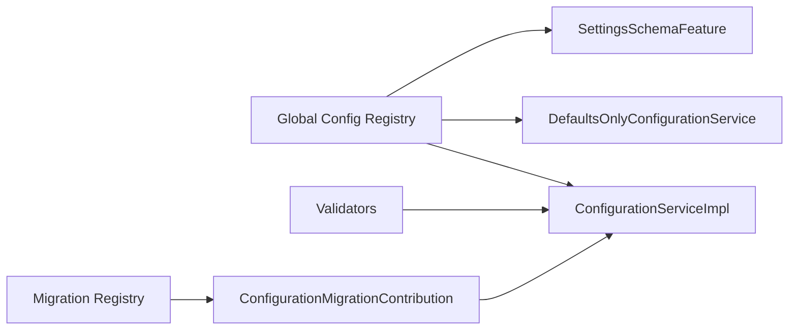

# Configuration & Settings

<cite>
**Referenced Files in This Document**
- [settingsSchemaFeature.ts](file://src/extension/settingsSchema/vscode-node/settingsSchemaFeature.ts)
- [configurationService.ts](file://src/platform/configuration/common/configurationService.ts)
- [defaultsOnlyConfigurationService.ts](file://src/platform/configuration/common/defaultsOnlyConfigurationService.ts)
- [jsonSchema.ts](file://src/platform/configuration/common/jsonSchema.ts)
- [validator.ts](file://src/platform/configuration/common/validator.ts)
- [configurationServiceImpl.ts](file://src/platform/configuration/vscode/configurationServiceImpl.ts)
- [configurationMigration.ts](file://src/extension/configuration/vscode-node/configurationMigration.ts)
</cite>

## Table of Contents
1. [Introduction](#introduction)
2. [Project Structure](#project-structure)
3. [Core Components](#core-components)
4. [Architecture Overview](#architecture-overview)
5. [Detailed Component Analysis](#detailed-component-analysis)
6. [Dependency Analysis](#dependency-analysis)
7. [Performance Considerations](#performance-considerations)
8. [Troubleshooting Guide](#troubleshooting-guide)
9. [Conclusion](#conclusion)
10. [Appendices](#appendices)

## Introduction
This document explains the configuration and settings system for the extension. It covers:
- Extension settings, their categories, and effects
- Settings schema, validation rules, and configuration inheritance
- Customization features such as custom instructions and agent personalization
- Workspace-specific settings, team configuration management, and enterprise policy enforcement
- Configuration migration, default value handling, and settings synchronization across environments
- Guidance for optimizing settings for performance, security, and productivity
- Troubleshooting, validation errors, and settings reset procedures
- Relationship between user settings, workspace settings, and organizational policies

## Project Structure
The configuration system is implemented across platform and extension layers:
- Platform configuration defines the registry, validators, schema types, and concrete services
- Extension configuration provides migration and schema generation for internal users
- Settings keys are centrally defined and validated against package.json defaults

**Diagram sources**
- [configurationService.ts](file://src/platform/configuration/common/configurationService.ts#L1-L1039)
- [defaultsOnlyConfigurationService.ts](file://src/platform/configuration/common/defaultsOnlyConfigurationService.ts#L1-L92)
- [validator.ts](file://src/platform/configuration/common/validator.ts#L1-L312)
- [jsonSchema.ts](file://src/platform/configuration/common/jsonSchema.ts#L1-L139)
- [configurationServiceImpl.ts](file://src/platform/configuration/vscode/configurationServiceImpl.ts#L1-L386)
- [configurationMigration.ts](file://src/extension/configuration/vscode-node/configurationMigration.ts#L1-L181)
- [settingsSchemaFeature.ts](file://src/extension/settingsSchema/vscode-node/settingsSchemaFeature.ts#L1-L56)

**Section sources**
- [configurationService.ts](file://src/platform/configuration/common/configurationService.ts#L1-L1039)
- [configurationServiceImpl.ts](file://src/platform/configuration/vscode/configurationServiceImpl.ts#L1-L386)
- [configurationMigration.ts](file://src/extension/configuration/vscode-node/configurationMigration.ts#L1-L181)
- [settingsSchemaFeature.ts](file://src/extension/settingsSchema/vscode-node/settingsSchemaFeature.ts#L1-L56)

## Core Components
- Configuration registry and keys: Centralized definition of all settings, including advanced, shared, and team/internal-only keys. Keys carry metadata such as default values, deprecation, and validation rules.
- Configuration services:
  - A concrete VS Code-backed service that reads/writes settings, merges defaults, and handles experiments.
  - A defaults-only service for tests and controlled environments.
- Validation and schema:
  - Strongly typed validators for primitives, objects, arrays, unions, enums, and literals.
  - JSON schema types used to expose internal settings to editors.
- Migration:
  - Registry-driven migration of legacy keys to new keys with value transformation.
- Schema generation:
  - Internal-only JSON schema provider for advanced settings.

**Section sources**
- [configurationService.ts](file://src/platform/configuration/common/configurationService.ts#L481-L563)
- [configurationServiceImpl.ts](file://src/platform/configuration/vscode/configurationServiceImpl.ts#L93-L161)
- [defaultsOnlyConfigurationService.ts](file://src/platform/configuration/common/defaultsOnlyConfigurationService.ts#L12-L91)
- [validator.ts](file://src/platform/configuration/common/validator.ts#L8-L312)
- [jsonSchema.ts](file://src/platform/configuration/common/jsonSchema.ts#L6-L139)
- [configurationMigration.ts](file://src/extension/configuration/vscode-node/configurationMigration.ts#L115-L180)
- [settingsSchemaFeature.ts](file://src/extension/settingsSchema/vscode-node/settingsSchemaFeature.ts#L31-L54)

## Architecture Overview
The configuration system follows a layered architecture:
- Registry: Defines all settings and their metadata
- Validators: Enforce type safety and constraints
- Services: Implement reading, writing, inspection, and experiment-based resolution
- Migration: Transforms legacy keys/values into current form
- Schema: Exposes internal-only advanced settings to editors

**Diagram sources**
- [configurationServiceImpl.ts](file://src/platform/configuration/vscode/configurationServiceImpl.ts#L213-L272)
- [configurationService.ts](file://src/platform/configuration/common/configurationService.ts#L481-L563)
- [validator.ts](file://src/platform/configuration/common/validator.ts#L8-L18)

## Detailed Component Analysis

### Settings Registry and Keys
- Keys are defined via factory helpers that register entries in a global registry.
- Keys include:
  - Shared: cross-extension settings (e.g., authentication provider and permissions)
  - Advanced: user-visible advanced toggles and behaviors
  - Team/Internal: restricted settings for team members and internal users
- Keys carry:
  - Fully qualified IDs
  - Default values (including custom defaults for teams/internal)
  - Optional validators
  - Deprecation and migration metadata

Recommended configuration patterns:
- Prefer explicit registration for new settings to ensure validation and schema coverage.
- Use custom defaults judiciously and set reasonable expiration dates for team/internal defaults.

**Section sources**
- [configurationService.ts](file://src/platform/configuration/common/configurationService.ts#L624-L800)
- [configurationService.ts](file://src/platform/configuration/common/configurationService.ts#L518-L563)

### Configuration Service Behavior
- Reading:
  - Respects scope (global/workspace/folder/language) and merges defaults with user overrides.
  - Supports advanced settings in both flat and object forms.
  - Validates values using registered validators; invalid values fall back to defaults.
- Writing:
  - Advanced settings must be written in object form; attempting flat form throws an error.
  - Determines target scope based on where the setting is currently defined.
- Inspection:
  - Returns default, global, workspace, and folder values per key.
- Experiment-based settings:
  - Reads user-configured values first, then experiment variables, then defaults.

**Diagram sources**
- [configurationServiceImpl.ts](file://src/platform/configuration/vscode/configurationServiceImpl.ts#L93-L161)
- [configurationService.ts](file://src/platform/configuration/common/configurationService.ts#L192-L211)

**Section sources**
- [configurationServiceImpl.ts](file://src/platform/configuration/vscode/configurationServiceImpl.ts#L93-L187)
- [configurationService.ts](file://src/platform/configuration/common/configurationService.ts#L192-L211)

### Validation and Schema
- Validators:
  - Primitive validators (string, number, boolean)
  - Object validator with required fields
  - Array and tuple validators
  - Union, enum, literal, nullable, and lazy validators
- JSON schema:
  - Typed schema for numeric, string, array, object, and references
  - Used to generate internal-only settings schema

Best practices:
- Always attach a validator to keys that require strict typing.
- Use object validators to enforce required fields and nested structures.

**Section sources**
- [validator.ts](file://src/platform/configuration/common/validator.ts#L36-L312)
- [jsonSchema.ts](file://src/platform/configuration/common/jsonSchema.ts#L6-L139)

### Settings Schema Generation (Internal Users)
- Generates a virtual JSON schema document containing all recognized advanced settings for internal users.
- Pattern properties mark unknown advanced settings as deprecated.

**Diagram sources**
- [settingsSchemaFeature.ts](file://src/extension/settingsSchema/vscode-node/settingsSchemaFeature.ts#L14-L29)
- [settingsSchemaFeature.ts](file://src/extension/settingsSchema/vscode-node/settingsSchemaFeature.ts#L31-L54)

**Section sources**
- [settingsSchemaFeature.ts](file://src/extension/settingsSchema/vscode-node/settingsSchemaFeature.ts#L14-L56)

### Configuration Migration
- Registry-driven migrations transform legacy keys to new keys and optionally rewrite values.
- Applies to global and workspace scopes and runs on workspace folder changes and extension initialization.
- Example migrations include renaming experimental keys and normalizing advanced settings.

**Diagram sources**
- [configurationMigration.ts](file://src/extension/configuration/vscode-node/configurationMigration.ts#L38-L113)
- [configurationMigration.ts](file://src/extension/configuration/vscode-node/configurationMigration.ts#L101-L104)

**Section sources**
- [configurationMigration.ts](file://src/extension/configuration/vscode-node/configurationMigration.ts#L115-L180)
- [configurationService.ts](file://src/platform/configuration/common/configurationService.ts#L543-L558)

### Defaults-Only Service
- Ignores user settings and experiments; returns only default values.
- Useful for testing and deterministic behavior.

**Section sources**
- [defaultsOnlyConfigurationService.ts](file://src/platform/configuration/common/defaultsOnlyConfigurationService.ts#L12-L91)

## Dependency Analysis
- Registry and keys are consumed by services and schema providers.
- Validators are attached to keys and executed during read/write.
- Migration depends on registry entries and workspace events.
- Schema generation depends on authentication state and registry contents.

**Diagram sources**
- [configurationService.ts](file://src/platform/configuration/common/configurationService.ts#L481-L563)
- [configurationServiceImpl.ts](file://src/platform/configuration/vscode/configurationServiceImpl.ts#L1-L386)
- [defaultsOnlyConfigurationService.ts](file://src/platform/configuration/common/defaultsOnlyConfigurationService.ts#L1-L92)
- [settingsSchemaFeature.ts](file://src/extension/settingsSchema/vscode-node/settingsSchemaFeature.ts#L1-L56)
- [configurationMigration.ts](file://src/extension/configuration/vscode-node/configurationMigration.ts#L1-L181)

**Section sources**
- [configurationService.ts](file://src/platform/configuration/common/configurationService.ts#L481-L563)
- [configurationServiceImpl.ts](file://src/platform/configuration/vscode/configurationServiceImpl.ts#L1-L386)
- [configurationMigration.ts](file://src/extension/configuration/vscode-node/configurationMigration.ts#L1-L181)

## Performance Considerations
- Minimize heavy validations on hot paths; keep validators simple and fast.
- Prefer object-based advanced settings to avoid flat-style parsing overhead.
- Use experiment-based settings sparingly; ensure experiment variables are cached where appropriate.
- Avoid frequent writes to settings; batch updates when possible.

## Troubleshooting Guide
Common issues and resolutions:
- Unknown advanced setting warnings:
  - Internal-only advanced settings are exposed via the generated schema; unknown keys are marked deprecated.
- Validation errors:
  - If a setting fails validation, the service logs an error and falls back to the default value.
- Cannot write advanced setting:
  - Advanced settings must be written in object form; the service throws an error if flat form is attempted.
- Team/internal default expiration:
  - Team/internal defaults with expiration dates trigger warnings; update or remove expired values.
- Settings not applying:
  - Verify scope (global/workspace/folder) and ensure the setting is not restricted for external users.

Reset procedures:
- To reset a setting to default, delete it from the appropriate scope; the service will return the default value.
- To reset all Copilot settings, clear the extension’s configuration entries in VS Code settings.

**Section sources**
- [settingsSchemaFeature.ts](file://src/extension/settingsSchema/vscode-node/settingsSchemaFeature.ts#L42-L50)
- [configurationServiceImpl.ts](file://src/platform/configuration/vscode/configurationServiceImpl.ts#L150-L161)
- [configurationServiceImpl.ts](file://src/platform/configuration/vscode/configurationServiceImpl.ts#L236-L237)
- [configurationServiceImpl.ts](file://src/platform/configuration/vscode/configurationServiceImpl.ts#L53-L91)

## Conclusion
The configuration system provides a robust, extensible foundation for managing extension settings. It enforces strong typing, supports advanced customization, and offers migration and schema capabilities tailored for internal users. By following the recommended patterns—validating inputs, using scoped defaults, and leveraging migrations—you can optimize settings for performance, security, and productivity while maintaining a consistent user experience.

## Appendices

### Recommended Use Cases and Settings
- Developer productivity:
  - Enable advanced inline edits and related preferences to streamline code suggestions.
  - Tune selection ratio thresholds and aggressiveness for inline edits.
- Security and privacy:
  - Restrict internal-only settings to authorized users.
  - Prefer secure endpoints and disable unnecessary telemetry in sensitive environments.
- Enterprise policy enforcement:
  - Use workspace and folder scopes to enforce organization-wide defaults.
  - Leverage migration to phase out legacy keys and align with current defaults.

### Relationship Between User, Workspace, and Organizational Policies
- User settings: Per-user overrides in global scope.
- Workspace settings: Overrides for the current workspace.
- Folder settings: Overrides for specific workspace folders.
- Organizational policies: Enforced defaults via team/internal defaults and restricted settings.

**Section sources**
- [configurationServiceImpl.ts](file://src/platform/configuration/vscode/configurationServiceImpl.ts#L163-L187)
- [configurationService.ts](file://src/platform/configuration/common/configurationService.ts#L329-L356)