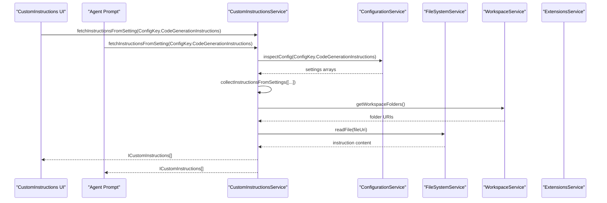
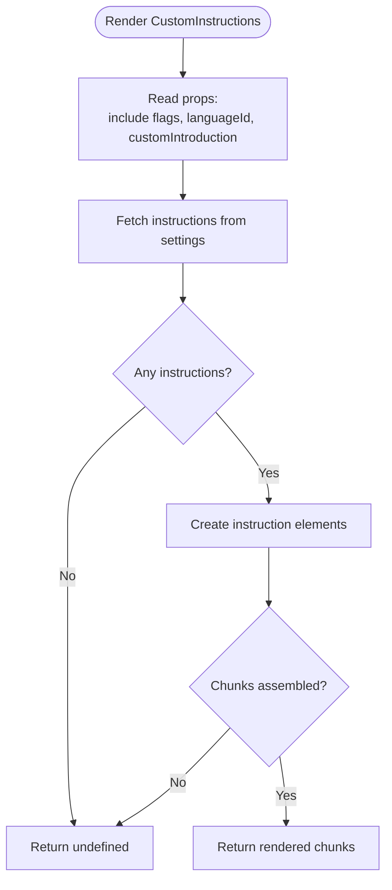
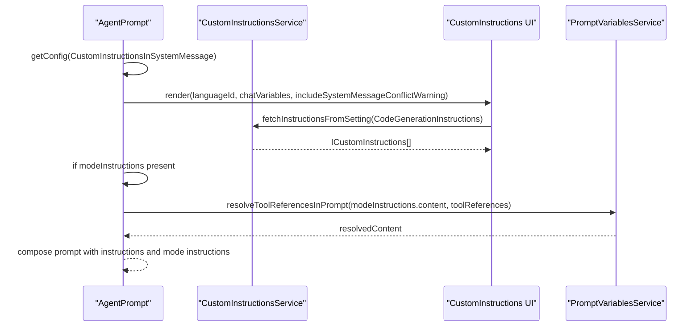
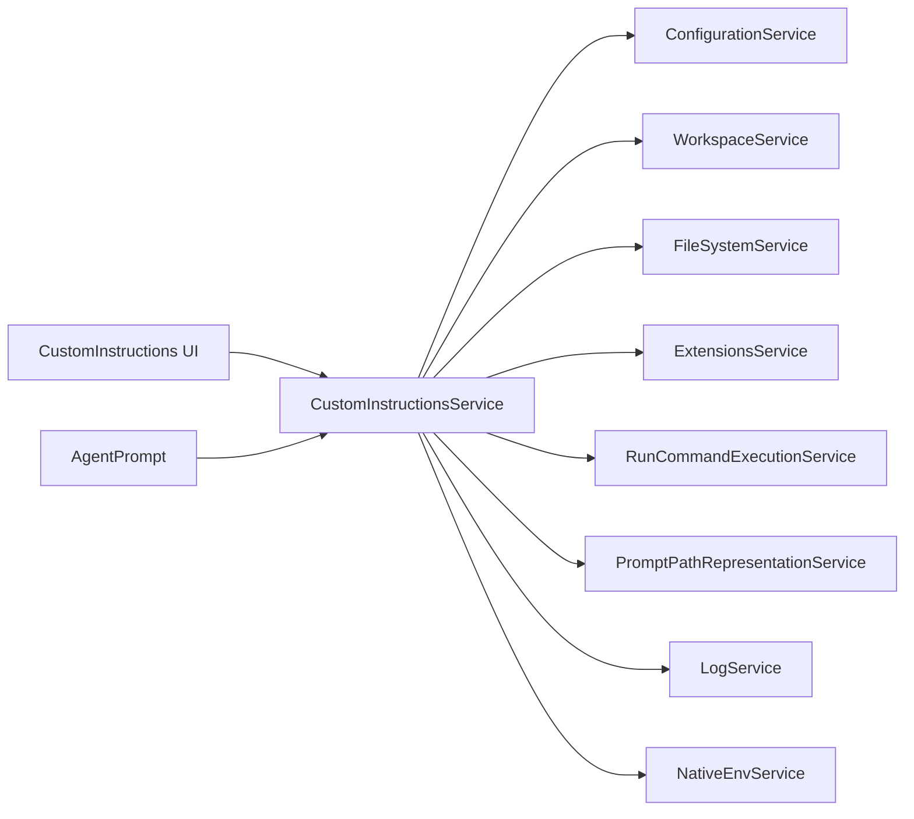

# Custom Instructions & Prompts

<cite>
**Referenced Files in This Document**
- [copilot-instructions.md](file://.github/copilot-instructions.md)
- [create-instructions.prompt.md](file://assets/prompts/create-instructions.prompt.md)
- [customInstructionsService.ts](file://src/platform/customInstructions/common/customInstructionsService.ts)
- [customInstructions.tsx](file://src/extension/prompts/node/panel/customInstructions.tsx)
- [agentPrompt.tsx](file://src/extension/prompts/node/agent/agentPrompt.tsx)
- [promptTypes.ts](file://src/platform/customInstructions/common/promptTypes.ts)
- [promptPathRepresentationService.ts](file://src/platform/prompts/common/promptPathRepresentationService.ts)
- [configurationService.ts](file://src/platform/configuration/common/configurationService.ts)
- [fileSystemService.ts](file://src/platform/filesystem/common/fileSystemService.ts)
- [workspaceService.ts](file://src/platform/workspace/common/workspaceService.ts)
- [extensionsService.ts](file://src/platform/extensions/common/extensionsService.ts)
- [runCommandExecutionService.ts](file://src/platform/commands/common/runCommandExecutionService.ts)
- [logService.ts](file://src/platform/log/common/logService.ts)
- [nativeEnvService.ts](file://src/platform/env/common/envService.ts)
- [testCustomInstructionsService.ts](file://src/platform/test/common/testCustomInstructionsService.ts)
- [customInstructions.stest.ts](file://test/prompts/customInstructions.stest.ts)
</cite>

## Table of Contents
1. [Introduction](#introduction)
2. [Project Structure](#project-structure)
3. [Core Components](#core-components)
4. [Architecture Overview](#architecture-overview)
5. [Detailed Component Analysis](#detailed-component-analysis)
6. [Dependency Analysis](#dependency-analysis)
7. [Performance Considerations](#performance-considerations)
8. [Troubleshooting Guide](#troubleshooting-guide)
9. [Conclusion](#conclusion)
10. [Appendices](#appendices)

## Introduction
This document explains how the system creates, stores, and manages custom instructions and prompts to influence agent behavior and responses. It covers instruction syntax, variable substitution, and context injection; how instructions are scoped to workspaces, shared across teams, and enforced organization-wide; and how dynamic instruction generation integrates with prompt files and context providers. It also documents priority systems, conflict resolution, versioning, validation, testing, performance impact, best practices, security considerations, and maintenance strategies.

## Project Structure
The custom instructions and prompt management system spans platform services and extension UI components:
- Platform services define the instruction model, discovery, filtering, and loading from settings, files, and extension contributions.
- Extension UI components render and inject instructions into prompts for agents and panels.
- Assets provide guidance prompts for authoring instructions.
- Tests validate behavior and edge cases.

```mermaid
graph TB
subgraph "Platform Services"
CIS["CustomInstructionsService<br/>src/platform/customInstructions/common/customInstructionsService.ts"]
PT["promptTypes.ts<br/>src/platform/customInstructions/common/promptTypes.ts"]
PPRS["promptPathRepresentationService.ts<br/>src/platform/prompts/common/promptPathRepresentationService.ts"]
CS["configurationService.ts<br/>src/platform/configuration/common/configurationService.ts"]
FSS["fileSystemService.ts<br/>src/platform/filesystem/common/fileSystemService.ts"]
WS["workspaceService.ts<br/>src/platform/workspace/common/workspaceService.ts"]
ES["extensionsService.ts<br/>src/platform/extensions/common/extensionsService.ts"]
RCES["runCommandExecutionService.ts<br/>src/platform/commands/common/runCommandExecutionService.ts"]
LOGS["logService.ts<br/>src/platform/log/common/logService.ts"]
NES["nativeEnvService.ts<br/>src/platform/env/common/envService.ts"]
end
subgraph "Extension UI"
CIP["CustomInstructions.tsx<br/>src/extension/prompts/node/panel/customInstructions.tsx"]
AP["agentPrompt.tsx<br/>src/extension/prompts/node/agent/agentPrompt.tsx"]
end
subgraph "Assets"
A1["create-instructions.prompt.md<br/>assets/prompts/create-instructions.prompt.md"]
end
subgraph "Tests"
T1["testCustomInstructionsService.ts<br/>src/platform/test/common/testCustomInstructionsService.ts"]
T2["customInstructions.stest.ts<br/>test/prompts/customInstructions.stest.ts"]
end
CIP --> CIS
AP --> CIS
CIS --> CS
CIS --> WS
CIS --> FSS
CIS --> ES
CIS --> RCES
CIS --> PPRS
CIS --> LOGS
CIS --> NES
A1 -. guidance .-> CIP
T1 -. mocks .-> CIS
T2 -. scenarios .-> CIP
```



**Diagram sources**
- [customInstructionsService.ts](file://src/platform/customInstructions/common/customInstructionsService.ts#L106-L474)
- [customInstructions.tsx](file://src/extension/prompts/node/panel/customInstructions.tsx#L54-L133)
- [agentPrompt.tsx](file://src/extension/prompts/node/agent/agentPrompt.tsx#L181-L203)
- [promptTypes.ts](file://src/platform/customInstructions/common/promptTypes.ts)
- [promptPathRepresentationService.ts](file://src/platform/prompts/common/promptPathRepresentationService.ts)
- [configurationService.ts](file://src/platform/configuration/common/configurationService.ts)
- [fileSystemService.ts](file://src/platform/filesystem/common/fileSystemService.ts)
- [workspaceService.ts](file://src/platform/workspace/common/workspaceService.ts)
- [extensionsService.ts](file://src/platform/extensions/common/extensionsService.ts)
- [runCommandExecutionService.ts](file://src/platform/commands/common/runCommandExecutionService.ts)
- [logService.ts](file://src/platform/log/common/logService.ts)
- [nativeEnvService.ts](file://src/platform/env/common/envService.ts)
- [create-instructions.prompt.md](file://assets/prompts/create-instructions.prompt.md#L1-L31)
- [testCustomInstructionsService.ts](file://src/platform/test/common/testCustomInstructionsService.ts#L16-L22)
- [customInstructions.stest.ts](file://test/prompts/customInstructions.stest.ts)

**Section sources**
- [copilot-instructions.md](file://.github/copilot-instructions.md#L1-L353)
- [create-instructions.prompt.md](file://assets/prompts/create-instructions.prompt.md#L1-L31)

## Core Components
- CustomInstructionsService: Central service that discovers, loads, and filters instructions from settings, files, skills, and extension contributions; exposes observables for dynamic matching; and provides utilities for skill detection and index parsing.
- CustomInstructions UI element: Renders instructions into prompts for panels and agents, respecting inclusion flags and system message placement.
- Agent prompt composition: Integrates instructions into agent prompts, optionally placing them in the system message and injecting mode-specific instructions.
- Prompt types and indices: Defines instruction file extensions, locations, and index parsing for skills and agents.
- Configuration and environment: Reads settings, workspace folders, and user home to resolve instruction sources and paths.
- Extensions and skills: Supports external instruction files and skill-based instructions contributed by extensions.

**Section sources**
- [customInstructionsService.ts](file://src/platform/customInstructions/common/customInstructionsService.ts#L57-L81)
- [customInstructions.tsx](file://src/extension/prompts/node/panel/customInstructions.tsx#L54-L133)
- [agentPrompt.tsx](file://src/extension/prompts/node/agent/agentPrompt.tsx#L181-L203)
- [promptTypes.ts](file://src/platform/customInstructions/common/promptTypes.ts)

## Architecture Overview
The system orchestrates instruction sourcing and injection across layers:
- Discovery: Settings arrays, file paths, skills, and extension contributions.
- Filtering: Glob-based matching against configured locations, workspace folders, and personal directories.
- Loading: Reading instruction content from files and constructing instruction objects.
- Injection: Rendering into prompts either as part of the user/system message or as explicit instruction chunks.



**Diagram sources**
- [customInstructions.tsx](file://src/extension/prompts/node/panel/customInstructions.tsx#L109-L130)
- [agentPrompt.tsx](file://src/extension/prompts/node/agent/agentPrompt.tsx#L181-L203)
- [customInstructionsService.ts](file://src/platform/customInstructions/common/customInstructionsService.ts#L307-L345)
- [configurationService.ts](file://src/platform/configuration/common/configurationService.ts)
- [fileSystemService.ts](file://src/platform/filesystem/common/fileSystemService.ts)
- [workspaceService.ts](file://src/platform/workspace/common/workspaceService.ts)

## Detailed Component Analysis

### CustomInstructionsService
Responsibilities:
- Fetch instructions from settings arrays (text or file imports).
- Load instructions from files across workspace folders.
- Detect external instruction files and skills from configuration, workspace, and extension contributions.
- Provide observables for dynamic matching of instruction locations.
- Parse instruction index files to discover skills and agents.
- Expose utilities for skill directory and name resolution.

Key behaviors:
- Settings-based instructions support both inline text and file imports with optional language scoping.
- File-based instructions are read per workspace folder and aggregated.
- External instruction detection includes user data scheme, configured locations, extension contributions, and skills.
- Index parsing extracts instruction and skill file paths and agent names from XML-like index content.

```mermaid
classDiagram
class ICustomInstructionsService {
+fetchInstructionsFromSetting(configKey) Promise~ICustomInstructions[]~
+fetchInstructionsFromFile(fileUri) Promise~ICustomInstructions|undefined~
+getAgentInstructions() Promise~URI[]~
+parseInstructionIndexFile(text) IInstructionIndexFile
+isExternalInstructionsFile(uri) Promise~boolean~
+isExternalInstructionsFolder(uri) boolean
+isSkillFile(uri) boolean
+isSkillMdFile(uri) boolean
+getExtensionSkillInfo(uri) { skillName, skillFolderUri }|undefined
+refreshExtensionPromptFiles() Promise~void~
}
class CustomInstructionsService {
-_matchInstructionLocationsFromConfig
-_matchInstructionLocationsFromExtensions
-_matchInstructionLocationsFromSkills
-_extensionPromptFilesCache
+fetchInstructionsFromSetting(...)
+fetchInstructionsFromFile(...)
+getAgentInstructions()
+parseInstructionIndexFile(...)
+isExternalInstructionsFile(uri)
+isExternalInstructionsFolder(uri)
+isSkillFile(uri)
+isSkillMdFile(uri)
+getExtensionSkillInfo(uri)
+refreshExtensionPromptFiles()
}
ICustomInstructionsService <|.. CustomInstructionsService
```

**Diagram sources**
- [customInstructionsService.ts](file://src/platform/customInstructions/common/customInstructionsService.ts#L57-L81)
- [customInstructionsService.ts](file://src/platform/customInstructions/common/customInstructionsService.ts#L106-L474)

**Section sources**
- [customInstructionsService.ts](file://src/platform/customInstructions/common/customInstructionsService.ts#L106-L474)

### CustomInstructions UI Element
Responsibilities:
- Render instruction chunks into prompts for panels and agents.
- Respect inclusion flags for different instruction categories (code generation, tests, feedback, commit messages, pull request descriptions).
- Optionally include a system message conflict warning and custom introduction text depending on placement.

Processing logic:
- Collect instructions from settings using the service.
- Create instruction elements and assemble chunks.
- Return undefined if no chunks are produced.



**Diagram sources**
- [customInstructions.tsx](file://src/extension/prompts/node/panel/customInstructions.tsx#L66-L133)

**Section sources**
- [customInstructions.tsx](file://src/extension/prompts/node/panel/customInstructions.tsx#L54-L133)

### Agent Prompt Composition
Responsibilities:
- Integrate instructions into agent prompts.
- Respect configuration for whether instructions are placed in the system message.
- Inject mode-specific instructions when present.

Processing logic:
- Determine whether to place instructions in the system message.
- Render CustomInstructions UI element accordingly.
- Append mode instructions if provided, resolving tool references.



**Diagram sources**
- [agentPrompt.tsx](file://src/extension/prompts/node/agent/agentPrompt.tsx#L181-L203)
- [customInstructions.tsx](file://src/extension/prompts/node/panel/customInstructions.tsx#L66-L133)

**Section sources**
- [agentPrompt.tsx](file://src/extension/prompts/node/agent/agentPrompt.tsx#L181-L203)

### Instruction Syntax, Variable Substitution, and Context Injection
- Instruction syntax: Instructions can be provided as inline text or as file imports. File-based instructions are read from workspace folders and treated as single instruction blocks per file.
- Language scoping: Instructions can specify a languageId to constrain applicability.
- Variable substitution: Mode instructions support tool reference resolution via a variables service, enabling dynamic substitution of tool references into instruction content.
- Context injection: Instructions are injected into prompts either as part of the system message or as explicit instruction chunks, depending on configuration and UI rendering.

**Section sources**
- [customInstructionsService.ts](file://src/platform/customInstructions/common/customInstructionsService.ts#L90-L104)
- [agentPrompt.tsx](file://src/extension/prompts/node/agent/agentPrompt.tsx#L192-L202)

### Workspace-Specific Instructions, Team Sharing, and Organizational Policy
- Workspace-specific: Instructions can be loaded from workspace folders using a dedicated path and are discovered per workspace folder.
- Team-wide sharing: Instructions can be placed in external locations recognized by the service (configured paths, user home, extension contributions, skills).
- Organizational policy enforcement: External instruction detection includes user data scheme and configured locations, allowing centralized policies to be enforced across environments.

**Section sources**
- [customInstructionsService.ts](file://src/platform/customInstructions/common/customInstructionsService.ts#L290-L305)
- [customInstructionsService.ts](file://src/platform/customInstructions/common/customInstructionsService.ts#L424-L440)

### Instruction Priority, Conflict Resolution, and Version Management
- Priority and ordering: Instructions collected from settings arrays are processed in order, with deduplication by file path and text content. The order reflects the order of entries in the settings arrays.
- Conflict resolution: When instructions are placed in the system message versus user message chunks, the agent prompt composes them with explicit mode instructions taking precedence over general instructions.
- Version management: The system does not implement explicit versioning for instructions; however, file-based instructions can be managed via VCS and updated per workspace or organization.

**Section sources**
- [customInstructionsService.ts](file://src/platform/customInstructions/common/customInstructionsService.ts#L329-L345)
- [agentPrompt.tsx](file://src/extension/prompts/node/agent/agentPrompt.tsx#L196-L202)

### Integration with Prompt Files, Context Providers, and Dynamic Generation
- Prompt files: Instructions can be loaded from prompt files and skills, with extension contributions supported via a command-based refresh mechanism.
- Context providers: Skills and instruction indices can be resolved to skill directories and names for contextual awareness.
- Dynamic generation: The guidance prompt asset provides a structured process for drafting and iterating on instructions, aligning with agent customization principles.

**Section sources**
- [customInstructionsService.ts](file://src/platform/customInstructions/common/customInstructionsService.ts#L379-L422)
- [customInstructionsService.ts](file://src/platform/customInstructions/common/customInstructionsService.ts#L447-L473)
- [create-instructions.prompt.md](file://assets/prompts/create-instructions.prompt.md#L1-L31)

### Validation, Testing Methodologies, and Performance Impact
- Validation: The service logs warnings and debug messages for missing files and errors while refreshing extension prompt files. Index parsing validates XML-like content and resolves URIs.
- Testing: Unit tests and scenario tests exercise instruction loading, filtering, and UI rendering. Mock services enable configurable test scenarios.
- Performance: Matching and filtering rely on observable caches and glob-based checks; file reads are performed per workspace folder. Consider minimizing instruction file count and avoiding overly broad globs for large workspaces.

**Section sources**
- [customInstructionsService.ts](file://src/platform/customInstructions/common/customInstructionsService.ts#L379-L388)
- [customInstructionsService.ts](file://src/platform/customInstructions/common/customInstructionsService.ts#L420-L422)
- [testCustomInstructionsService.ts](file://src/platform/test/common/testCustomInstructionsService.ts#L16-L22)
- [customInstructions.stest.ts](file://test/prompts/customInstructions.stest.ts)

## Dependency Analysis
The CustomInstructionsService depends on configuration, workspace, file system, extensions, and logging services. The UI components depend on the service and prompt path representation.



**Diagram sources**
- [customInstructionsService.ts](file://src/platform/customInstructions/common/customInstructionsService.ts#L117-L126)
- [customInstructions.tsx](file://src/extension/prompts/node/panel/customInstructions.tsx#L55-L65)
- [agentPrompt.tsx](file://src/extension/prompts/node/agent/agentPrompt.tsx#L181-L191)

**Section sources**
- [customInstructionsService.ts](file://src/platform/customInstructions/common/customInstructionsService.ts#L117-L126)

## Performance Considerations
- Minimize instruction file count and scope to reduce I/O and parsing overhead.
- Prefer language-scoped instructions to avoid unnecessary processing.
- Use configured instruction locations judiciously to avoid expensive glob matching.
- Cache and reuse extension prompt file lists; refresh only when necessary.

## Troubleshooting Guide
Common issues and remedies:
- Instructions not appearing:
  - Verify settings arrays include valid text or file entries.
  - Confirm file paths exist within workspace folders.
  - Check external instruction detection settings and paths.
- Errors during extension prompt file refresh:
  - Inspect logs for warnings and ensure the command returns expected data.
- Skill or index parsing failures:
  - Validate index XML-like content and referenced file paths.

**Section sources**
- [customInstructionsService.ts](file://src/platform/customInstructions/common/customInstructionsService.ts#L379-L388)
- [customInstructionsService.ts](file://src/platform/customInstructions/common/customInstructionsService.ts#L420-L422)

## Conclusion
The custom instructions and prompt management system provides a flexible, layered approach to defining, discovering, and injecting instructions into agent prompts. By combining settings-based text and file imports, external instruction detection, and skill-aware indexing, it supports workspace-specific, team-wide, and organization-wide instruction enforcement. With clear injection points, conflict resolution via mode instructions, and robust testing and validation, the system enables reliable customization of agent behavior.

## Appendices

### Practical Examples and Templates
- Authoring instructions: Use the guidance prompt to draft and iterate on instructions aligned with agent customization principles.
- Example categories:
  - Programming language conventions
  - Debugging procedures
  - Code review processes

**Section sources**
- [create-instructions.prompt.md](file://assets/prompts/create-instructions.prompt.md#L1-L31)

### Best Practices
- Keep instructions concise and language-scoped where applicable.
- Use file-based instructions for reusable, team-wide rules.
- Leverage mode instructions for context-specific behavior.
- Maintain clear separation between system message and user message chunks.

### Security Considerations
- Restrict external instruction locations to trusted paths.
- Validate and sanitize instruction content to prevent unintended behavior injection.
- Audit skill contributions and index files regularly.

### Maintenance Strategies
- Version instruction files with VCS and review changes alongside code reviews.
- Monitor performance in large workspaces and adjust instruction locations and counts.
- Update guidance prompts periodically to reflect evolving customization needs.