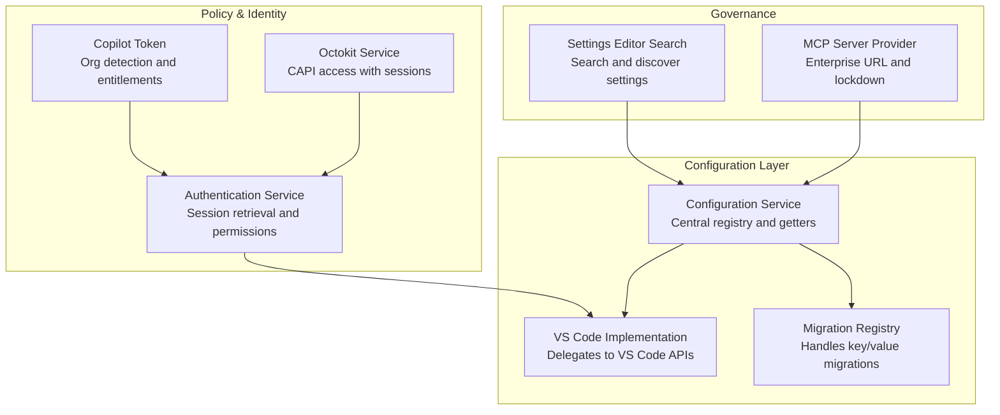
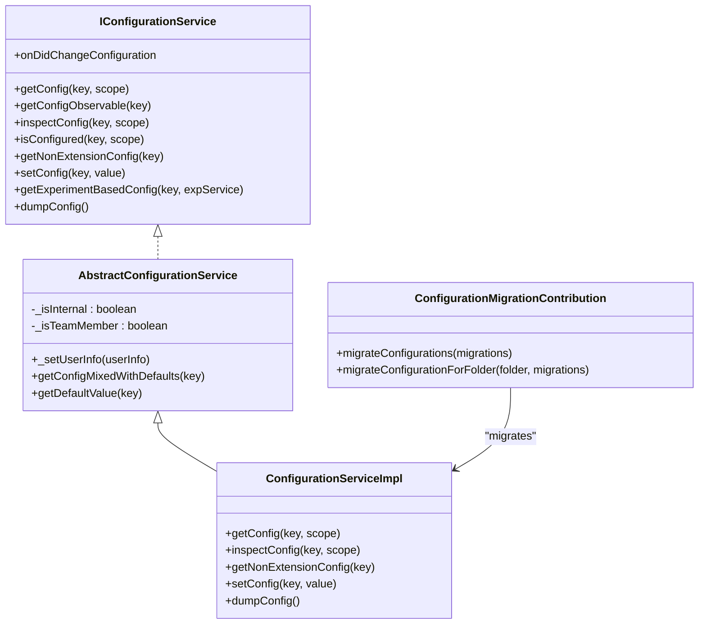
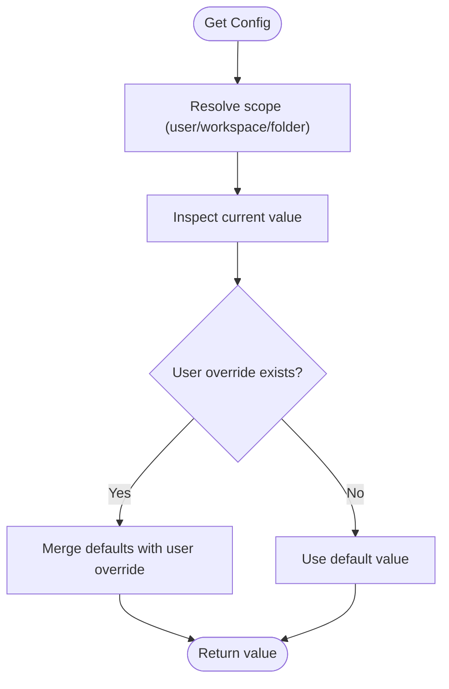
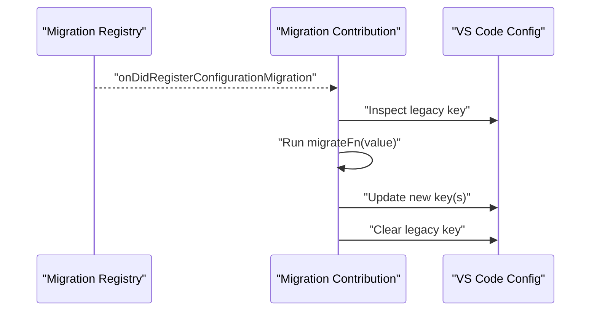
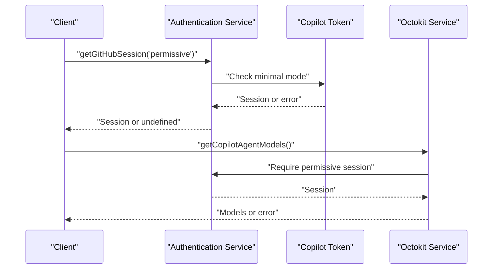
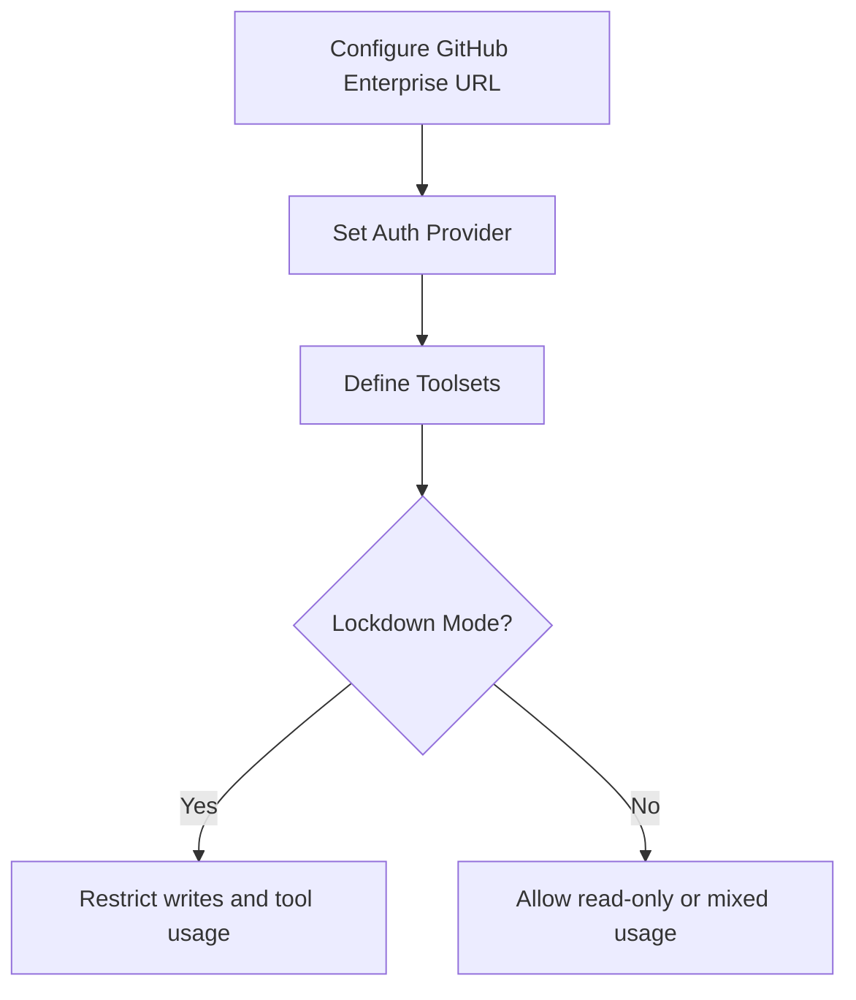
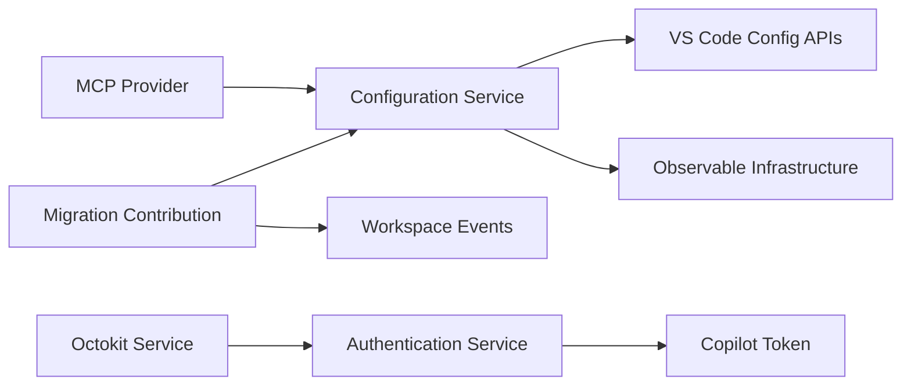

# Enterprise & Team Configuration

<cite>
**Referenced Files in This Document**
- [configurationService.ts](file://src/platform/configuration/common/configurationService.ts)
- [configurationServiceImpl.ts](file://src/platform/configuration/vscode/configurationServiceImpl.ts)
- [configurationMigration.ts](file://src/extension/configuration/vscode-node/configurationMigration.ts)
- [settingsEditorSearchService.ts](file://src/platform/settingsEditor/common/settingsEditorSearchService.ts)
- [githubMcpDefinitionProvider.ts](file://src/extension/githubMcp/common/githubMcpDefinitionProvider.ts)
- [githubMcpDefinitionProvider.spec.ts](file://src/extension/githubMcp/test/node/githubMcpDefinitionProvider.spec.ts)
- [copilotToken.ts](file://src/platform/authentication/common/copilotToken.ts)
- [octoKitServiceImpl.ts](file://src/platform/github/common/octoKitServiceImpl.ts)
- [staticGitHubAuthenticationService.ts](file://src/platform/authentication/common/staticGitHubAuthenticationService.ts)
- [configurationService.test.ts](file://src/extension/test/vscode-node/configurationService.test.ts)
- [configurationService.test.ts](file://src/extension/test/vscode-node/configurations.test.ts)
- [vscode.d.ts](file://src/extension/vscode.d.ts)
- [configurationServiceImpl.ts](file://src/platform/configuration/vscode/configurationServiceImpl.ts)
</cite>

## Table of Contents
1. [Introduction](#introduction)
2. [Project Structure](#project-structure)
3. [Core Components](#core-components)
4. [Architecture Overview](#architecture-overview)
5. [Detailed Component Analysis](#detailed-component-analysis)
6. [Dependency Analysis](#dependency-analysis)
7. [Performance Considerations](#performance-considerations)
8. [Troubleshooting Guide](#troubleshooting-guide)
9. [Conclusion](#conclusion)
10. [Appendices](#appendices)

## Introduction
This document provides enterprise-grade guidance for configuration management across an organization using the Copilot Chat platform. It covers:
- Organization-wide settings and policy enforcement
- Governance controls and compliance-aware configuration
- Workspace configuration inheritance and team collaboration settings
- Shared resource management and MCP server governance
- Deployment strategies, automated provisioning, and centralized management
- Versioning, audit trails, and change management
- Identity provider integration, access control, and policy enforcement
- Backup, disaster recovery, and migration planning
- Testing, validation, and rollback strategies
- Troubleshooting and conflict resolution across configuration sources

## Project Structure
The configuration system is organized around a central configuration service with layered namespaces for shared, advanced, team internal, and deprecated settings. It integrates with VS Code’s configuration APIs, supports migration, and enforces policies via authentication and token inspection.

**Diagram sources**
- [configurationService.ts](file://src/platform/configuration/common/configurationService.ts#L81-L165)
- [configurationServiceImpl.ts](file://src/platform/configuration/vscode/configurationServiceImpl.ts#L93-L103)
- [configurationMigration.ts](file://src/extension/configuration/vscode-node/configurationMigration.ts#L38-L113)
- [copilotToken.ts](file://src/platform/authentication/common/copilotToken.ts#L1-L32)
- [octoKitServiceImpl.ts](file://src/platform/github/common/octoKitServiceImpl.ts#L408-L441)
- [settingsEditorSearchService.ts](file://src/platform/settingsEditor/common/settingsEditorSearchService.ts#L10-L22)
- [githubMcpDefinitionProvider.ts](file://src/extension/githubMcp/common/githubMcpDefinitionProvider.ts#L14-L18)

**Section sources**
- [configurationService.ts](file://src/platform/configuration/common/configurationService.ts#L1-L1039)
- [configurationServiceImpl.ts](file://src/platform/configuration/vscode/configurationServiceImpl.ts#L53-L103)
- [configurationMigration.ts](file://src/extension/configuration/vscode-node/configurationMigration.ts#L1-L181)
- [settingsEditorSearchService.ts](file://src/platform/settingsEditor/common/settingsEditorSearchService.ts#L1-L22)
- [githubMcpDefinitionProvider.ts](file://src/extension/githubMcp/common/githubMcpDefinitionProvider.ts#L1-L18)

## Core Components
- Central configuration service with typed keys, defaults, validators, and observability
- VS Code-backed implementation that respects user, workspace, and folder scopes
- Migration registry for safe key renames and value transformations
- Authentication and token-based policy enforcement for enterprise settings
- MCP server governance for enterprise URLs and lockdown modes
- Settings editor search for discoverability and governance

Key capabilities:
- Organization-aware defaults and expiration-based team defaults
- Policy enforcement via minimal-permissions mode and permissive sessions
- Centralized configuration inspection and change events for auditability
- Automated migration of legacy keys to new locations

**Section sources**
- [configurationService.ts](file://src/platform/configuration/common/configurationService.ts#L81-L165)
- [configurationServiceImpl.ts](file://src/platform/configuration/vscode/configurationServiceImpl.ts#L93-L103)
- [configurationMigration.ts](file://src/extension/configuration/vscode-node/configurationMigration.ts#L115-L181)
- [copilotToken.ts](file://src/platform/authentication/common/copilotToken.ts#L1-L32)
- [octoKitServiceImpl.ts](file://src/platform/github/common/octoKitServiceImpl.ts#L408-L441)
- [githubMcpDefinitionProvider.ts](file://src/extension/githubMcp/common/githubMcpDefinitionProvider.ts#L14-L18)

## Architecture Overview
The configuration architecture separates concerns across:
- Registry and definition: centralized configuration keys and defaults
- Implementation: VS Code integration and scope resolution
- Policy: authentication and token-based gating
- Migration: safe transitions across versions
- Governance: MCP and settings editor integrations

**Diagram sources**
- [configurationService.ts](file://src/platform/configuration/common/configurationService.ts#L81-L165)
- [configurationService.ts](file://src/platform/configuration/common/configurationService.ts#L169-L327)
- [configurationServiceImpl.ts](file://src/platform/configuration/vscode/configurationServiceImpl.ts#L93-L103)
- [configurationMigration.ts](file://src/extension/configuration/vscode-node/configurationMigration.ts#L38-L113)

## Detailed Component Analysis

### Configuration Service and Scopes
- Supports user, workspace, and folder scopes with language-specific variants
- Provides observability via change events and observable getters
- Mixes user overrides with defaults for object-typed settings
- Enforces internal-only restrictions and team-default expiration checks

**Diagram sources**
- [configurationService.ts](file://src/platform/configuration/common/configurationService.ts#L192-L211)
- [configurationServiceImpl.ts](file://src/platform/configuration/vscode/configurationServiceImpl.ts#L93-L103)

**Section sources**
- [configurationService.ts](file://src/platform/configuration/common/configurationService.ts#L33-L79)
- [configurationService.ts](file://src/platform/configuration/common/configurationService.ts#L192-L211)
- [configurationServiceImpl.ts](file://src/platform/configuration/vscode/configurationServiceImpl.ts#L93-L103)

### Configuration Migration
- Registers migrations for legacy keys and transforms values
- Applies migrations at global and workspace levels
- Handles workspace folder additions and initial activation

**Diagram sources**
- [configurationMigration.ts](file://src/extension/configuration/vscode-node/configurationMigration.ts#L38-L113)
- [configurationMigration.ts](file://src/extension/configuration/vscode-node/configurationMigration.ts#L115-L181)

**Section sources**
- [configurationMigration.ts](file://src/extension/configuration/vscode-node/configurationMigration.ts#L1-L181)

### Authentication and Policy Enforcement
- Authentication sessions gated by minimal-permissions mode
- Permissive sessions required for CAPI access and MCP server configuration
- Organization detection influences default values and entitlements

**Diagram sources**
- [staticGitHubAuthenticationService.ts](file://src/platform/authentication/common/staticGitHubAuthenticationService.ts#L46-L75)
- [octoKitServiceImpl.ts](file://src/platform/github/common/octoKitServiceImpl.ts#L408-L441)
- [copilotToken.ts](file://src/platform/authentication/common/copilotToken.ts#L1-L32)

**Section sources**
- [staticGitHubAuthenticationService.ts](file://src/platform/authentication/common/staticGitHubAuthenticationService.ts#L46-L75)
- [octoKitServiceImpl.ts](file://src/platform/github/common/octoKitServiceImpl.ts#L408-L441)
- [copilotToken.ts](file://src/platform/authentication/common/copilotToken.ts#L1-L32)

### MCP Server Governance
- Enterprise URL configuration for GitHub Enterprise
- Toolsets, read-only, and lockdown modes for governance
- Tests demonstrate configurable auth provider and GHE URI

**Diagram sources**
- [githubMcpDefinitionProvider.ts](file://src/extension/githubMcp/common/githubMcpDefinitionProvider.ts#L14-L18)
- [githubMcpDefinitionProvider.spec.ts](file://src/extension/githubMcp/test/node/githubMcpDefinitionProvider.spec.ts#L79-L105)

**Section sources**
- [githubMcpDefinitionProvider.ts](file://src/extension/githubMcp/common/githubMcpDefinitionProvider.ts#L1-L18)
- [githubMcpDefinitionProvider.spec.ts](file://src/extension/githubMcp/test/node/githubMcpDefinitionProvider.spec.ts#L76-L105)

### Settings Editor Integration
- Provides a search service for settings discovery
- Enables governance by surfacing configuration options consistently

**Section sources**
- [settingsEditorSearchService.ts](file://src/platform/settingsEditor/common/settingsEditorSearchService.ts#L1-L22)

### Identity Provider Integration
- Authentication provider registration and WWW-Authenticate challenge handling
- Supports enterprise identity flows and scoped sessions

**Section sources**
- [vscode.d.ts](file://src/extension/vscode.d.ts#L18100-L18333)

## Dependency Analysis
- Configuration service depends on VS Code configuration APIs and observable infrastructure
- Migration contribution depends on configuration registry and VS Code workspace events
- Authentication service depends on token store and environment checks
- MCP provider depends on configuration service for enterprise URL and policy flags

**Diagram sources**
- [configurationServiceImpl.ts](file://src/platform/configuration/vscode/configurationServiceImpl.ts#L93-L103)
- [configurationMigration.ts](file://src/extension/configuration/vscode-node/configurationMigration.ts#L38-L113)
- [staticGitHubAuthenticationService.ts](file://src/platform/authentication/common/staticGitHubAuthenticationService.ts#L46-L75)
- [octoKitServiceImpl.ts](file://src/platform/github/common/octoKitServiceImpl.ts#L408-L441)
- [githubMcpDefinitionProvider.ts](file://src/extension/githubMcp/common/githubMcpDefinitionProvider.ts#L14-L18)

**Section sources**
- [configurationServiceImpl.ts](file://src/platform/configuration/vscode/configurationServiceImpl.ts#L93-L103)
- [configurationMigration.ts](file://src/extension/configuration/vscode-node/configurationMigration.ts#L38-L113)
- [staticGitHubAuthenticationService.ts](file://src/platform/authentication/common/staticGitHubAuthenticationService.ts#L46-L75)
- [octoKitServiceImpl.ts](file://src/platform/github/common/octoKitServiceImpl.ts#L408-L441)
- [githubMcpDefinitionProvider.ts](file://src/extension/githubMcp/common/githubMcpDefinitionProvider.ts#L14-L18)

## Performance Considerations
- Use observable getters for reactive updates to avoid polling
- Minimize workspace-level configuration changes to reduce event churn
- Prefer default values and minimal overrides to simplify audits
- Cache frequently accessed configuration values within short-lived scopes

## Troubleshooting Guide
Common issues and resolutions:
- Configuration not applying in workspace: verify scope resolution and inspect values at user/workspace/folder levels
- Team default expired or misconfigured: check expiration dates and owner contact
- Authentication failures for MCP or CAPI: ensure permissive session exists and minimal mode allows requested scopes
- Migration errors: confirm legacy keys were cleared and new keys applied

Validation and testing references:
- Internal settings default validation tests
- Configuration inspection and change event tests

**Section sources**
- [configurationService.test.ts](file://src/extension/test/vscode-node/configurationService.test.ts)
- [configurationService.test.ts](file://src/extension/test/vscode-node/configurations.test.ts#L34-L46)

## Conclusion
The configuration system provides a robust, enterprise-ready foundation for managing organization-wide settings, enforcing policies, and governing shared resources. By leveraging typed configuration keys, observable updates, migrations, and authentication-driven policies, teams can achieve centralized control, compliance, and operational reliability.

## Appendices

### Enterprise Configuration Patterns
- Organization-aware defaults: use team/internal default variants with expiration dates
- Compliance gates: enforce minimal-permissions mode and permissive sessions for sensitive operations
- Shared governance: MCP lockdown and toolsets to control external integrations
- Change management: use migration registry for safe key and value transitions

### Backup, Disaster Recovery, and Migration Planning
- Maintain configuration snapshots via dump and inspection APIs
- Use migration registry to safely evolve configuration keys and values
- Document and test rollback procedures for problematic deployments

### Testing and Validation
- Validate default values for internal settings
- Inspect configuration changes via change events
- Test authentication flows and session alignment for governance