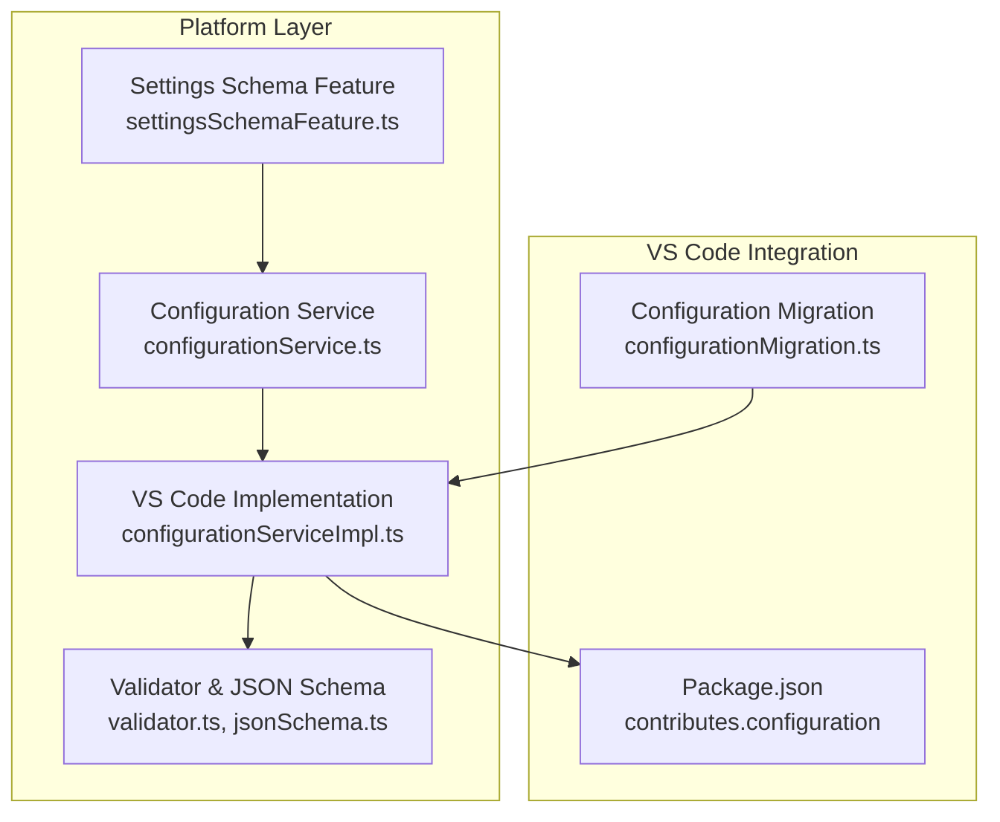
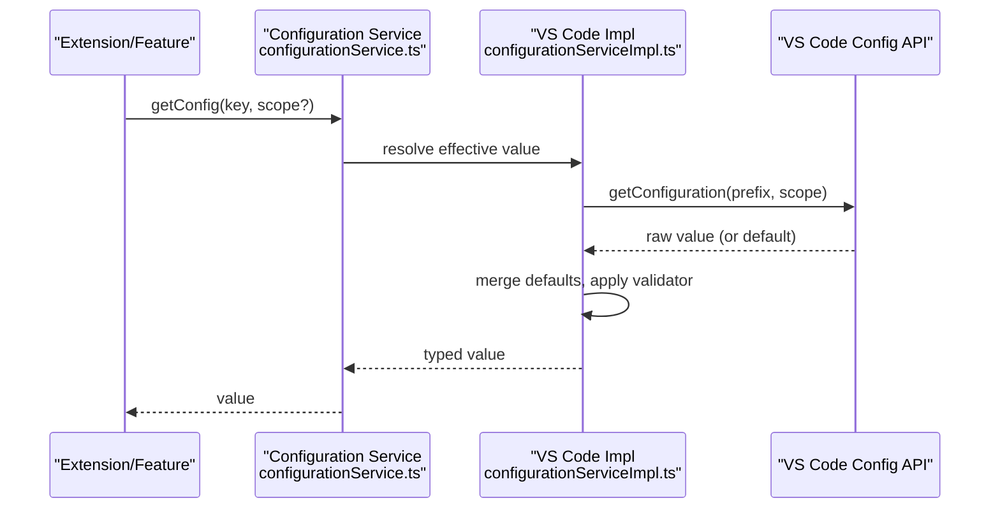
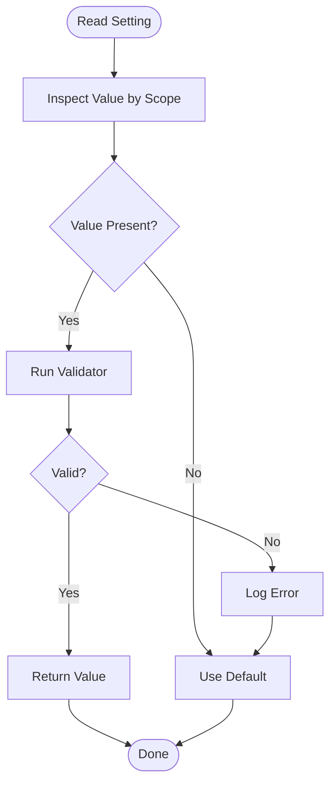
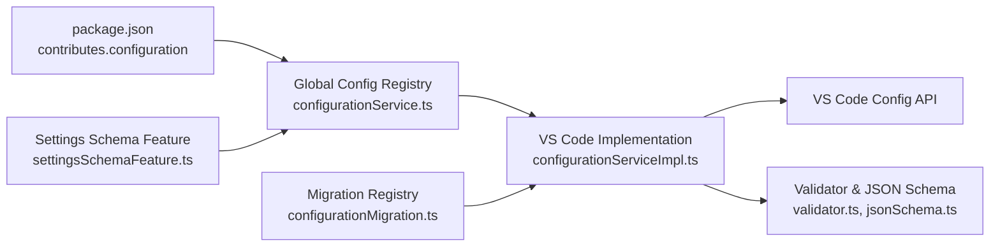

# User Settings & Preferences

<cite>
**Referenced Files in This Document**
- [configurationService.ts](file://src/platform/configuration/common/configurationService.ts)
- [configurationServiceImpl.ts](file://src/platform/configuration/vscode/configurationServiceImpl.ts)
- [configurationMigration.ts](file://src/extension/configuration/vscode-node/configurationMigration.ts)
- [settingsSchemaFeature.ts](file://src/extension/settingsSchema/vscode-node/settingsSchemaFeature.ts)
- [jsonSchema.ts](file://src/platform/configuration/common/jsonSchema.ts)
- [validator.ts](file://src/platform/configuration/common/validator.ts)
- [package.json](file://package.json)
- [settingsEditorSearchService.ts](file://src/extension/prompt/node/settingsEditorSearchResultsSelector.ts)
- [settingsEditorSearchServiceImpl.ts](file://src/extension/prompt/vscode-node/settingsEditorSearchServiceImpl.ts)
- [settingsEditorSearchServiceCommon.ts](file://src/platform/settingsEditor/common/settingsEditorSearchService.ts)
</cite>

## Table of Contents
1. [Introduction](#introduction)
2. [Project Structure](#project-structure)
3. [Core Components](#core-components)
4. [Architecture Overview](#architecture-overview)
5. [Detailed Component Analysis](#detailed-component-analysis)
6. [Dependency Analysis](#dependency-analysis)
7. [Performance Considerations](#performance-considerations)
8. [Troubleshooting Guide](#troubleshooting-guide)
9. [Conclusion](#conclusion)
10. [Appendices](#appendices)

## Introduction
This document explains user-level configuration settings for GitHub Copilot Chat within VS Code. It covers available categories (chat preferences, agent/model parameters, UI and inline editing preferences, advanced/internal settings), setting scopes (user, workspace, workspace folder), precedence and inheritance, validation and error handling, and practical configuration scenarios. It also addresses security-related settings, privacy controls, and data handling preferences.

## Project Structure
The configuration system is implemented in the platform layer and surfaced via VS Code’s configuration APIs. Key elements:
- Central registry and typed configuration keys
- VS Code-backed implementation with validation and migration
- Settings schema generation for internal users
- Package.json-driven schema and visibility
- Settings editor search integration

**Diagram sources**
- [configurationService.ts](file://src/platform/configuration/common/configurationService.ts#L1-L120)
- [configurationServiceImpl.ts](file://src/platform/configuration/vscode/configurationServiceImpl.ts#L1-L120)
- [validator.ts](file://src/platform/configuration/common/validator.ts#L1-L120)
- [jsonSchema.ts](file://src/platform/configuration/common/jsonSchema.ts#L1-L120)
- [settingsSchemaFeature.ts](file://src/extension/settingsSchema/vscode-node/settingsSchemaFeature.ts#L1-L56)
- [package.json](file://package.json#L150-L200)
- [configurationMigration.ts](file://src/extension/configuration/vscode-node/configurationMigration.ts#L1-L120)

**Section sources**
- [configurationService.ts](file://src/platform/configuration/common/configurationService.ts#L1-L120)
- [configurationServiceImpl.ts](file://src/platform/configuration/vscode/configurationServiceImpl.ts#L1-L120)
- [settingsSchemaFeature.ts](file://src/extension/settingsSchema/vscode-node/settingsSchemaFeature.ts#L1-L56)
- [package.json](file://package.json#L150-L200)

## Core Components
- Configuration registry and typed keys: Defines all settings, default values, and validation rules. Keys are grouped by category (shared, advanced, team/internal).
- VS Code-backed implementation: Reads/writes settings, merges defaults, handles scope precedence, validates values, and fires change events.
- Validation and schema: Strongly typed validators and JSON schema fragments for internal schema generation.
- Settings schema feature: Generates a virtual JSON schema for internal users to validate advanced settings.
- Configuration migration: Safely migrates legacy/expperimental keys to new canonical keys.
- Package.json schema: Declares public settings, defaults, and visibility.

**Section sources**
- [configurationService.ts](file://src/platform/configuration/common/configurationService.ts#L480-L560)
- [configurationServiceImpl.ts](file://src/platform/configuration/vscode/configurationServiceImpl.ts#L93-L161)
- [validator.ts](file://src/platform/configuration/common/validator.ts#L8-L120)
- [jsonSchema.ts](file://src/platform/configuration/common/jsonSchema.ts#L1-L120)
- [settingsSchemaFeature.ts](file://src/extension/settingsSchema/vscode-node/settingsSchemaFeature.ts#L31-L54)
- [configurationMigration.ts](file://src/extension/configuration/vscode-node/configurationMigration.ts#L115-L181)
- [package.json](file://package.json#L150-L200)

## Architecture Overview
The configuration system exposes a strongly-typed API to the rest of the product. Consumers request a setting by its typed key, and the implementation resolves the effective value considering scope, defaults, and validation.

**Diagram sources**
- [configurationService.ts](file://src/platform/configuration/common/configurationService.ts#L81-L165)
- [configurationServiceImpl.ts](file://src/platform/configuration/vscode/configurationServiceImpl.ts#L93-L161)

## Detailed Component Analysis

### Settings Categories and Keys
Settings are organized into namespaces. The following categories are defined in the configuration registry:

- Shared (visible to all users)
  - Example: Authentication provider and permissions
- Advanced (visible to all users)
  - Example: Agent temperature, history summarization, inline edits preferences, OTel telemetry, notebook alternatives, tools grouping, search subagent toggles and parameters
- Team/Internal (restricted to internal users)
  - Example: Debug flags, model provider preference, internal-only experiments, telemetry toggles

These keys are defined using a builder that registers them in a global registry and associates default values, validators, and metadata.

**Section sources**
- [configurationService.ts](file://src/platform/configuration/common/configurationService.ts#L624-L800)

### Setting Scopes, Precedence, and Inheritance
- Scopes: Global (user), Workspace, Workspace Folder
- Precedence (highest to lowest):
  - Workspace Folder (if applicable)
  - Workspace
  - Global (user)
  - Default (from code or package.json)
- Language-specific overrides: Supported for keys scoped to a language; languageIds are tracked during inspection.
- Advanced settings: Two storage styles are supported for reading; writing is only supported in the object-style nested under the advanced group.

Behavior highlights:
- When a setting is not configured, the effective value is the default.
- For object-type settings, user values are merged with defaults (user overrides default).
- Advanced settings: If a flat-style key exists, writing is blocked to avoid ambiguity; only the object-style under advanced can be written.

**Section sources**
- [configurationServiceImpl.ts](file://src/platform/configuration/vscode/configurationServiceImpl.ts#L163-L187)
- [configurationServiceImpl.ts](file://src/platform/configuration/vscode/configurationServiceImpl.ts#L213-L272)

### Validation, Error Handling, and Recovery
- Validation: Each key may carry a validator. If a stored value fails validation, it is rejected and the default is used.
- Error handling: Validation errors are logged; the system falls back to defaults.
- Recovery: If a value is invalid, removing or correcting the setting reverts to default behavior.

**Diagram sources**
- [configurationServiceImpl.ts](file://src/platform/configuration/vscode/configurationServiceImpl.ts#L150-L161)
- [validator.ts](file://src/platform/configuration/common/validator.ts#L8-L120)

**Section sources**
- [configurationServiceImpl.ts](file://src/platform/configuration/vscode/configurationServiceImpl.ts#L150-L161)
- [validator.ts](file://src/platform/configuration/common/validator.ts#L8-L120)

### Settings Editor and Search
- Settings editor search: A searchable index of settings is available to assist users in discovering and filtering settings.
- Internal schema: A virtual JSON schema is generated for internal users to validate advanced settings.

**Section sources**
- [settingsEditorSearchService.ts](file://src/extension/prompt/node/settingsEditorSearchResultsSelector.ts#L1-L50)
- [settingsEditorSearchServiceImpl.ts](file://src/extension/prompt/vscode-node/settingsEditorSearchServiceImpl.ts#L1-L50)
- [settingsEditorSearchServiceCommon.ts](file://src/platform/settingsEditor/common/settingsEditorSearchService.ts#L1-L50)
- [settingsSchemaFeature.ts](file://src/extension/settingsSchema/vscode-node/settingsSchemaFeature.ts#L31-L54)

### Security, Privacy, and Data Handling Preferences
- Authentication provider and permission mode: Controls identity provider and requested permission level.
- Debug overrides: Optional URL overrides for proxies and endpoints for development/testing.
- Telemetry capture: OTel exporter configuration and content capture toggle.
- Internal-only flags: Some settings are restricted to internal users and are not exposed publicly.

Practical guidance:
- Prefer default providers and permissions unless you have a specific need.
- Avoid enabling content capture in sensitive environments.
- Use debug overrides only during development and remove them afterward.

**Section sources**
- [configurationService.ts](file://src/platform/configuration/common/configurationService.ts#L631-L640)
- [configurationService.ts](file://src/platform/configuration/common/configurationService.ts#L738-L744)
- [configurationServiceImpl.ts](file://src/platform/configuration/vscode/configurationServiceImpl.ts#L93-L161)

### Practical Configuration Scenarios

- Optimize for different programming languages
  - Adjust inline edits aggressiveness and preferred model for specific contexts.
  - Enable/disable diagnostics context provider and language context features for targeted languages.
  - Tune selection ratio thresholds for inline suggestions.

- Adjust response length preferences
  - Control agent history summarization thresholds and modes to reduce context bloat.
  - Use instant apply short-context limits to constrain prompt size for faster responses.

- Configure agent switching behavior
  - Toggle search subagent enablement and related parameters (use agentic proxy, model, tool call limit).
  - Manage omitting base agent instructions and history summarization with prompt cache.

- Manage large tool results
  - Enable disk-based writing for large tool results and tune the threshold to balance performance and context limits.

- Reset to defaults
  - Remove the setting from the appropriate scope (global/workspace/workspace folder) or set it to undefined; the system will revert to defaults.

- Troubleshoot configuration conflicts
  - Inspect effective values across scopes and language overrides.
  - Use settings editor search to locate conflicting keys.
  - Validate values using the internal schema (for internal users) to catch malformed entries.

**Section sources**
- [configurationService.ts](file://src/platform/configuration/common/configurationService.ts#L675-L744)
- [configurationServiceImpl.ts](file://src/platform/configuration/vscode/configurationServiceImpl.ts#L163-L187)

## Dependency Analysis
The configuration system depends on:
- VS Code configuration APIs for persistence and change events
- Validators and JSON schema for runtime validation and schema generation
- Package.json for public defaults and visibility
- Migration registry for evolving keys

**Diagram sources**
- [package.json](file://package.json#L150-L200)
- [configurationService.ts](file://src/platform/configuration/common/configurationService.ts#L480-L560)
- [configurationServiceImpl.ts](file://src/platform/configuration/vscode/configurationServiceImpl.ts#L1-L120)
- [validator.ts](file://src/platform/configuration/common/validator.ts#L1-L120)
- [jsonSchema.ts](file://src/platform/configuration/common/jsonSchema.ts#L1-L120)
- [configurationMigration.ts](file://src/extension/configuration/vscode-node/configurationMigration.ts#L1-L120)
- [settingsSchemaFeature.ts](file://src/extension/settingsSchema/vscode-node/settingsSchemaFeature.ts#L1-L56)

**Section sources**
- [configurationService.ts](file://src/platform/configuration/common/configurationService.ts#L480-L560)
- [configurationServiceImpl.ts](file://src/platform/configuration/vscode/configurationServiceImpl.ts#L1-L120)
- [configurationMigration.ts](file://src/extension/configuration/vscode-node/configurationMigration.ts#L1-L120)
- [settingsSchemaFeature.ts](file://src/extension/settingsSchema/vscode-node/settingsSchemaFeature.ts#L1-L56)
- [package.json](file://package.json#L150-L200)

## Performance Considerations
- Keep conversation history summarization thresholds reasonable to avoid excessive context.
- Limit large tool results to disk when dealing with heavy tool outputs to prevent prompt overflow.
- Prefer default models and settings unless experimentation indicates otherwise.
- Avoid enabling content capture in production environments to reduce overhead.

[No sources needed since this section provides general guidance]

## Troubleshooting Guide
- Invalid value detected
  - Cause: Stored value fails validator.
  - Action: Correct or remove the value; defaults will be used.
- Cannot write advanced setting
  - Cause: Flat-style key exists; writing requires object-style under advanced.
  - Action: Update the setting to the object-style format.
- Conflicting scopes
  - Cause: Values set at multiple scopes.
  - Action: Inspect effective value across scopes and adjust as needed.
- Internal-only setting not visible
  - Cause: Restricted to internal users.
  - Action: Verify account privileges or consult documentation.
- Migration issues
  - Cause: Legacy key renamed or moved.
  - Action: Allow migration to occur; verify new key presence and correctness.

**Section sources**
- [configurationServiceImpl.ts](file://src/platform/configuration/vscode/configurationServiceImpl.ts#L150-L161)
- [configurationServiceImpl.ts](file://src/platform/configuration/vscode/configurationServiceImpl.ts#L213-L272)
- [configurationMigration.ts](file://src/extension/configuration/vscode-node/configurationMigration.ts#L60-L99)

## Conclusion
The configuration system provides a robust, typed, and validated mechanism for managing user preferences across chat, agents, inline edits, and advanced/internal features. By understanding scopes, precedence, validation, and migration, users can tailor Copilot Chat to their workflows while maintaining reliability and performance.

[No sources needed since this section summarizes without analyzing specific files]

## Appendices

### Appendix A: Representative Settings by Category
- Shared
  - Authentication provider and permissions
- Advanced
  - Agent temperature, history summarization, inline edits preferences, OTel telemetry, notebook alternatives, tools grouping, search subagent toggles and parameters
- Team/Internal
  - Debug flags, model provider preference, internal-only experiments, telemetry toggles

**Section sources**
- [configurationService.ts](file://src/platform/configuration/common/configurationService.ts#L624-L800)

### Appendix B: Settings Schema Generation (Internal)
- Internal users receive a virtual JSON schema containing all registered settings, enabling validation and discovery.

**Section sources**
- [settingsSchemaFeature.ts](file://src/extension/settingsSchema/vscode-node/settingsSchemaFeature.ts#L31-L54)
- [jsonSchema.ts](file://src/platform/configuration/common/jsonSchema.ts#L1-L120)
- [validator.ts](file://src/platform/configuration/common/validator.ts#L1-L120)