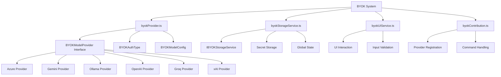
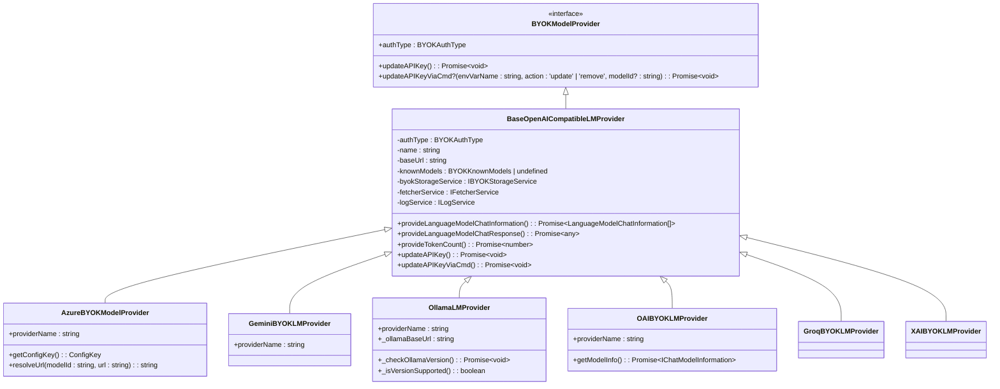
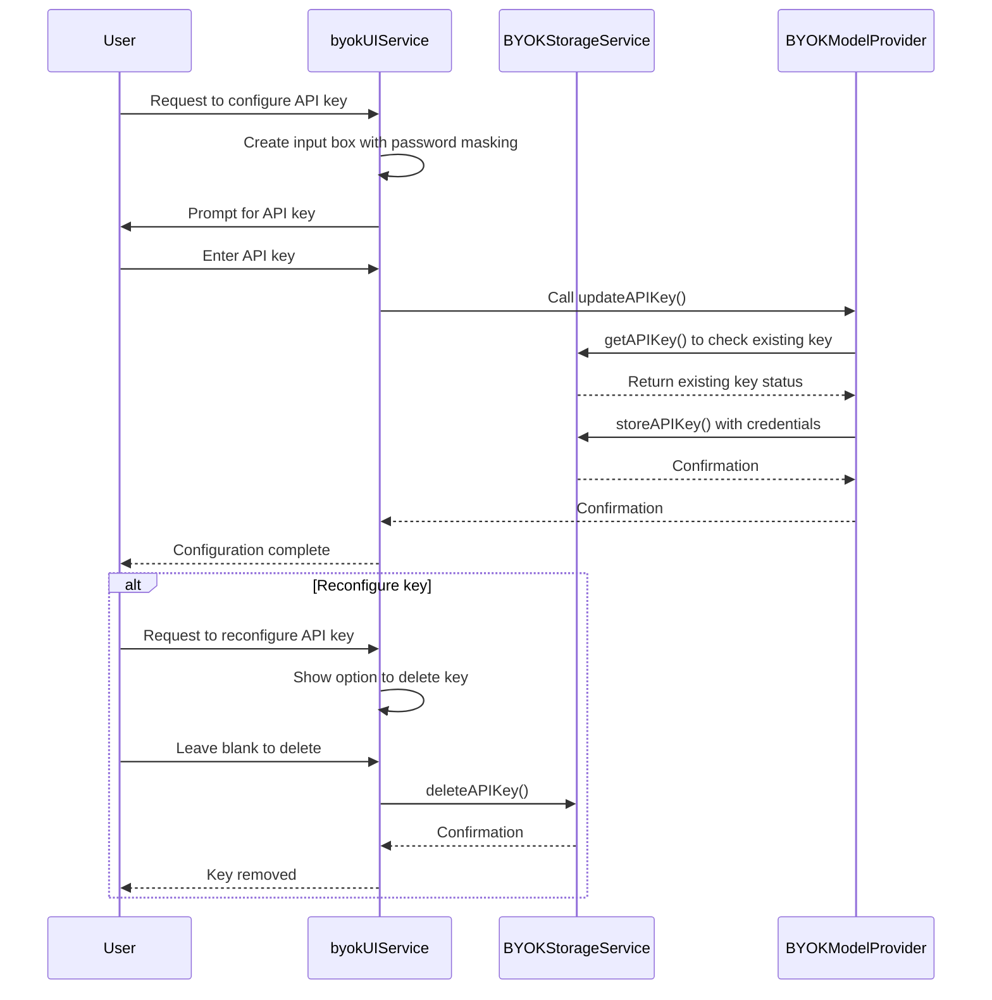
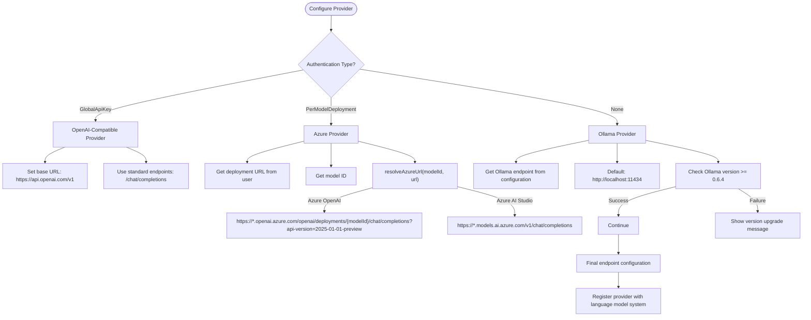
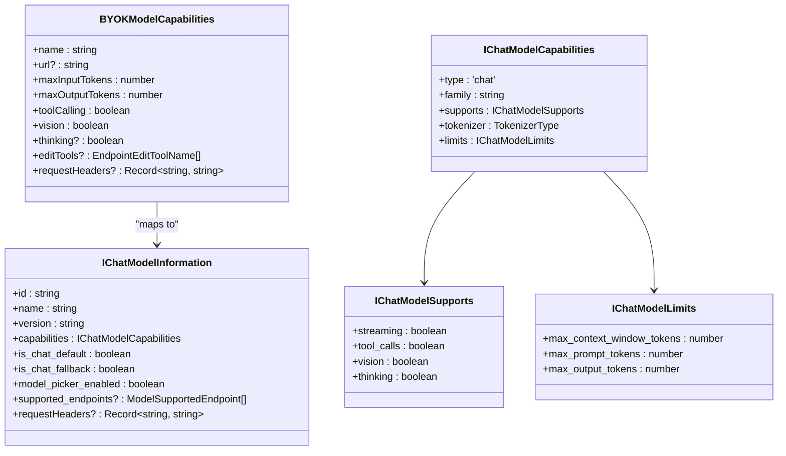

# Bring Your Own Key (BYOK) Providers

<cite>
**Referenced Files in This Document**   
- [byokProvider.ts](file://src/extension/byok/common/byokProvider.ts)
- [byokStorageService.ts](file://src/extension/byok/vscode-node/byokStorageService.ts)
- [byokUIService.ts](file://src/extension/byok/vscode-node/byokUIService.ts)
- [azureProvider.ts](file://src/extension/byok/vscode-node/azureProvider.ts)
- [geminiProvider.ts](file://src/extension/byok/vscode-node/geminiProvider.ts)
- [ollamaProvider.ts](file://src/extension/byok/vscode-node/ollamaProvider.ts)
- [openAIProvider.ts](file://src/extension/byok/vscode-node/openAIProvider.ts)
- [baseOpenAICompatibleProvider.ts](file://src/extension/byok/vscode-node/baseOpenAICompatibleProvider.ts)
- [byokContribution.ts](file://src/extension/byok/vscode-node/byokContribution.ts)
</cite>

## Table of Contents
1. [Introduction](#introduction)
2. [BYOK Architecture Overview](#byok-architecture-overview)
3. [Core Components](#core-components)
4. [Provider Implementation Details](#provider-implementation-details)
5. [Authentication and Credential Management](#authentication-and-credential-management)
6. [Endpoint Configuration and Request Formatting](#endpoint-configuration-and-request-formatting)
7. [Model Capabilities and Chat Model Integration](#model-capabilities-and-chat-model-integration)
8. [Provider-Specific Configuration](#provider-specific-configuration)
9. [Troubleshooting Common Issues](#troubleshooting-common-issues)
10. [Conclusion](#conclusion)

## Introduction

The Bring Your Own Key (BYOK) system in GitHub Copilot Chat enables users to connect to various AI providers using their own API credentials. This architecture allows integration with multiple AI services including Azure, Gemini, Ollama, OpenAI, Groq, and xAI, providing flexibility in choosing AI models and deployment options. The BYOK framework is designed to securely manage credentials, handle provider-specific configurations, and maintain consistent chat model capabilities across different providers.

**Section sources**
- [byokProvider.ts](file://src/extension/byok/common/byokProvider.ts)
- [byokContribution.ts](file://src/extension/byok/vscode-node/byokContribution.ts)

## BYOK Architecture Overview

The BYOK system follows a modular architecture with a clear separation of concerns between the core interface, provider implementations, and supporting services. The architecture enables extensibility while maintaining consistent behavior across different AI providers.

**Diagram sources**
- [byokProvider.ts](file://src/extension/byok/common/byokProvider.ts)
- [byokStorageService.ts](file://src/extension/byok/vscode-node/byokStorageService.ts)
- [byokUIService.ts](file://src/extension/byok/vscode-node/byokUIService.ts)
- [byokContribution.ts](file://src/extension/byok/vscode-node/byokContribution.ts)

**Section sources**
- [byokProvider.ts](file://src/extension/byok/common/byokProvider.ts)
- [byokStorageService.ts](file://src/extension/byok/vscode-node/byokStorageService.ts)
- [byokUIService.ts](file://src/extension/byok/vscode-node/byokUIService.ts)
- [byokContribution.ts](file://src/extension/byok/vscode-node/byokContribution.ts)

## Core Components

The BYOK system consists of several core components that work together to enable provider integration. The `BYOKModelProvider` interface defines the contract that all providers must implement, ensuring consistent behavior across different AI services. The `BYOKStorageService` handles secure credential storage using VS Code's secrets API, while the `byokUIService` manages user interactions for API key input and configuration.

The system supports three authentication types through the `BYOKAuthType` enum: GlobalApiKey for providers like OpenAI, PerModelDeployment for Azure with deployment-specific credentials, and None for local providers like Ollama. Model configurations are managed through typed interfaces that capture provider-specific requirements while maintaining a consistent structure.

**Section sources**
- [byokProvider.ts](file://src/extension/byok/common/byokProvider.ts)
- [byokStorageService.ts](file://src/extension/byok/vscode-node/byokStorageService.ts)
- [byokUIService.ts](file://src/extension/byok/vscode-node/byokUIService.ts)

## Provider Implementation Details

The BYOK framework implements a hierarchical provider structure with shared base classes and provider-specific implementations. The `BaseOpenAICompatibleLMProvider` serves as a common base for providers that follow the OpenAI API specification, reducing code duplication and ensuring consistent behavior.

**Diagram sources**
- [byokProvider.ts](file://src/extension/byok/common/byokProvider.ts)
- [baseOpenAICompatibleProvider.ts](file://src/extension/byok/vscode-node/baseOpenAICompatibleProvider.ts)
- [azureProvider.ts](file://src/extension/byok/vscode-node/azureProvider.ts)
- [geminiProvider.ts](file://src/extension/byok/vscode-node/geminiProvider.ts)
- [ollamaProvider.ts](file://src/extension/byok/vscode-node/ollamaProvider.ts)
- [openAIProvider.ts](file://src/extension/byok/vscode-node/openAIProvider.ts)

**Section sources**
- [baseOpenAICompatibleProvider.ts](file://src/extension/byok/vscode-node/baseOpenAICompatibleProvider.ts)
- [azureProvider.ts](file://src/extension/byok/vscode-node/azureProvider.ts)
- [geminiProvider.ts](file://src/extension/byok/vscode-node/geminiProvider.ts)
- [ollamaProvider.ts](file://src/extension/byok/vscode-node/ollamaProvider.ts)
- [openAIProvider.ts](file://src/extension/byok/vscode-node/openAIProvider.ts)

## Authentication and Credential Management

The BYOK system implements a secure credential management system through the `BYOKStorageService` class, which handles API key storage and retrieval using VS Code's secrets API. Credentials are stored with provider-specific keys following the pattern `copilot-byok-{providerName}-{modelId}-api-key` for model-specific keys or `copilot-byok-{providerName}-api-key` for provider-level keys.

**Diagram sources**
- [byokStorageService.ts](file://src/extension/byok/vscode-node/byokStorageService.ts)
- [byokUIService.ts](file://src/extension/byok/vscode-node/byokUIService.ts)
- [byokProvider.ts](file://src/extension/byok/common/byokProvider.ts)

**Section sources**
- [byokStorageService.ts](file://src/extension/byok/vscode-node/byokStorageService.ts)
- [byokUIService.ts](file://src/extension/byok/vscode-node/byokUIService.ts)

## Endpoint Configuration and Request Formatting

The BYOK system handles provider-specific endpoint configuration through a combination of base URL settings and provider-specific URL resolution logic. For OpenAI-compatible providers, the base URL is configured in the provider constructor, while Azure has specialized URL resolution logic to handle deployment-specific endpoints.

**Diagram sources**
- [azureProvider.ts](file://src/extension/byok/vscode-node/azureProvider.ts)
- [ollamaProvider.ts](file://src/extension/byok/vscode-node/ollamaProvider.ts)
- [openAIProvider.ts](file://src/extension/byok/vscode-node/openAIProvider.ts)
- [baseOpenAICompatibleProvider.ts](file://src/extension/byok/vscode-node/baseOpenAICompatibleProvider.ts)

**Section sources**
- [azureProvider.ts](file://src/extension/byok/vscode-node/azureProvider.ts)
- [ollamaProvider.ts](file://src/extension/byok/vscode-node/ollamaProvider.ts)
- [openAIProvider.ts](file://src/extension/byok/vscode-node/openAIProvider.ts)

## Model Capabilities and Chat Model Integration

The BYOK system integrates with the core language model system through the `LanguageModelChatProvider` interface, exposing model capabilities to the chat system. Model capabilities are defined through the `BYOKModelCapabilities` interface, which includes properties like maximum input/output tokens, tool calling support, vision capabilities, and thinking capabilities.

**Diagram sources**
- [byokProvider.ts](file://src/extension/byok/common/byokProvider.ts)
- [platform/endpoint/common/endpointProvider.ts](file://src/platform/endpoint/common/endpointProvider.ts)

**Section sources**
- [byokProvider.ts](file://src/extension/byok/common/byokProvider.ts)

## Provider-Specific Configuration

Each BYOK provider has specific configuration requirements and implementation details that address their unique characteristics:

### Azure Provider
The Azure provider requires both a deployment URL and API key for each model, following the PerModelDeployment authentication pattern. It implements specialized URL resolution logic to handle different Azure deployment scenarios including Azure OpenAI and Azure AI Studio.

### Gemini Provider
The Gemini provider uses the GlobalApiKey authentication pattern and connects to Google's generative language API through an OpenAI-compatible endpoint. It leverages the base OpenAI-compatible provider implementation with minimal customization.

### Ollama Provider
The Ollama provider uses no authentication (None) and connects to a local Ollama server. It includes version checking to ensure compatibility with Ollama 0.6.4 or higher, and dynamically discovers available models through the Ollama API.

### OpenAI Provider
The OpenAI provider uses the GlobalApiKey authentication pattern and connects to the standard OpenAI API endpoints. It supports both chat completions and responses endpoints based on configuration.

**Section sources**
- [azureProvider.ts](file://src/extension/byok/vscode-node/azureProvider.ts)
- [geminiProvider.ts](file://src/extension/byok/vscode-node/geminiProvider.ts)
- [ollamaProvider.ts](file://src/extension/byok/vscode-node/ollamaProvider.ts)
- [openAIProvider.ts](file://src/extension/byok/vscode-node/openAIProvider.ts)

## Troubleshooting Common Issues

### Authentication Failures
Common causes of authentication failures include:
- Incorrect API keys or deployment URLs
- Expired or revoked API keys
- Network connectivity issues to the provider endpoint
- Insufficient permissions for the API key

For Azure providers, ensure the deployment URL follows the correct format and includes the appropriate API version. For OpenAI-compatible providers, verify the API key has the necessary permissions.

### Region-Specific Endpoints
Some providers require region-specific endpoints. For Azure, ensure the deployment URL includes the correct region (e.g., westus, eastus). For Ollama, configure the `github.copilot.chat.byok.ollamaEndpoint` setting if the server is running on a different host.

### Version Compatibility
The Ollama provider requires version 0.6.4 or higher. If encountering connection issues, verify the Ollama server version and upgrade if necessary. The system will display a clear error message with upgrade instructions when the version is incompatible.

### Configuration Guidance
- For Azure: Use the full deployment URL from the Azure portal and ensure the API key has appropriate permissions
- For Gemini: Use the API key from Google Cloud Console with the Generative Language API enabled
- For Ollama: Ensure the Ollama server is running and accessible at the configured endpoint
- For OpenAI: Use an API key with appropriate permissions from the OpenAI platform

**Section sources**
- [ollamaProvider.ts](file://src/extension/byok/vscode-node/ollamaProvider.ts)
- [azureProvider.ts](file://src/extension/byok/vscode-node/azureProvider.ts)
- [byokProvider.ts](file://src/extension/byok/common/byokProvider.ts)

## Conclusion

The BYOK provider system in GitHub Copilot Chat provides a flexible and secure framework for integrating with various AI providers. By implementing a consistent interface across different providers, the system enables users to leverage their preferred AI services while maintaining a unified user experience. The architecture emphasizes security through proper credential management, extensibility through modular design, and reliability through comprehensive error handling and version compatibility checks.

The system's design allows for easy addition of new providers by implementing the core interface and leveraging shared base classes where appropriate. This approach ensures consistency while accommodating provider-specific requirements for authentication, endpoint configuration, and request formatting.