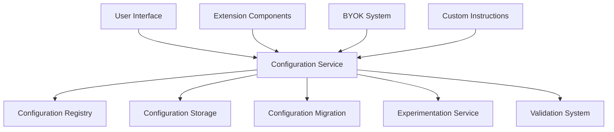
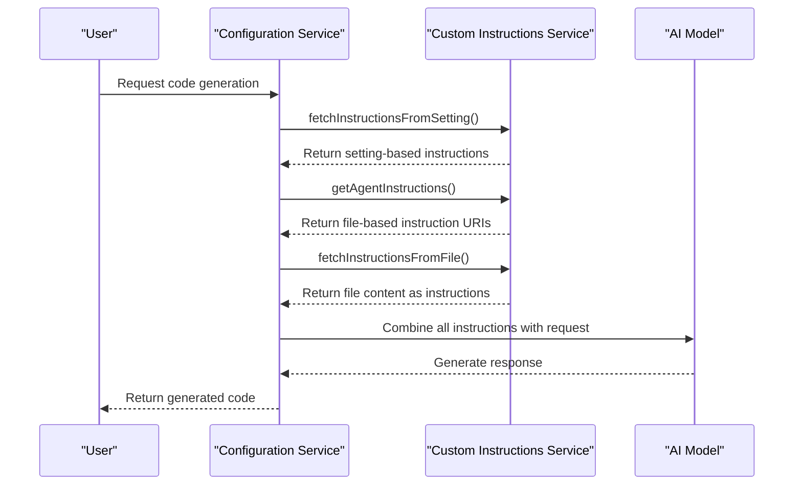
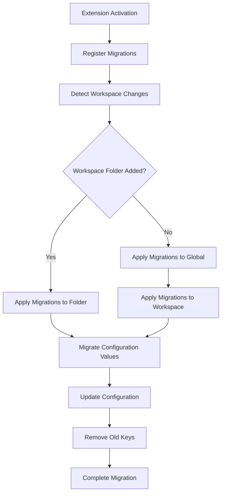

# Configuration and Customization

<cite>
**Referenced Files in This Document**   
- [configurationService.ts](file://src/platform/configuration/common/configurationService.ts)
- [configurationMigration.ts](file://src/extension/configuration/vscode-node/configurationMigration.ts)
- [customInstructionsService.ts](file://src/platform/customInstructions/common/customInstructionsService.ts)
- [byokProvider.ts](file://src/extension/byok/common/byokProvider.ts)
- [byokContribution.ts](file://src/extension/byok/vscode-node/byokContribution.ts)
- [byokStorageService.ts](file://src/extension/byok/vscode-node/byokStorageService.ts)
- [jsonSchema.ts](file://src/platform/configuration/common/jsonSchema.ts)
</cite>

## Table of Contents
1. [Introduction](#introduction)
2. [Configuration System Architecture](#configuration-system-architecture)
3. [Core Configuration Options](#core-configuration-options)
4. [Custom Instructions System](#custom-instructions-system)
5. [Bring Your Own Key (BYOK) Functionality](#bring-your-own-key-byok-functionality)
6. [Configuration Migration System](#configuration-migration-system)
7. [Configuration Validation and Defaults](#configuration-validation-and-defaults)
8. [Common Configuration Issues and Solutions](#common-configuration-issues-and-solutions)
9. [Conclusion](#conclusion)

## Introduction

GitHub Copilot Chat provides a comprehensive configuration and customization system that allows users to tailor the AI assistant's behavior to their specific needs. This document details the implementation of the settings system, covering how configuration values are stored, accessed, validated, and migrated. It also explains advanced customization features including custom instructions for personalizing AI behavior and the Bring Your Own Key (BYOK) functionality that enables connection to various AI providers such as Azure, Gemini, and Ollama.

The configuration system is designed with multiple layers of abstraction to provide flexibility while maintaining consistency across different environments and user types. It supports various configuration scopes including global, workspace, and language-specific settings, allowing for granular control over Copilot's behavior. The system also incorporates experimentation features that enable gradual rollout of new functionality to specific user segments.

**Section sources**
- [configurationService.ts](file://src/platform/configuration/common/configurationService.ts#L1-L100)

## Configuration System Architecture

The configuration system in GitHub Copilot Chat is built around a service-oriented architecture with clear separation of concerns. At its core is the `IConfigurationService` interface that provides a unified API for accessing and modifying configuration values. This service abstracts the underlying storage mechanism and provides additional features such as configuration observation, validation, and migration.

The architecture follows a layered approach with the following key components:
- **Configuration Service**: The central component that manages all configuration operations
- **Configuration Registry**: A registry that maintains all defined configuration keys and their metadata
- **Configuration Migration System**: Handles backward compatibility and settings upgrades
- **Experimentation Integration**: Connects configuration values with feature experimentation
- **Validation System**: Ensures configuration values meet specified criteria

The system is designed to be extensible, allowing new configuration options to be added without modifying the core infrastructure. Configuration keys are defined using a type-safe approach that includes metadata such as default values, validation rules, and scope information.



**Diagram sources **
- [configurationService.ts](file://src/platform/configuration/common/configurationService.ts#L28-L164)

**Section sources**
- [configurationService.ts](file://src/platform/configuration/common/configurationService.ts#L1-L200)

## Core Configuration Options

The GitHub Copilot Chat extension exposes numerous configuration options that control various aspects of its functionality. These options are organized hierarchically under the `github.copilot` namespace and can be categorized into several groups based on their functionality.

### General Settings
These settings control the basic behavior of Copilot Chat:

- `chat.useResponsesApi`: Enables the use of the Responses API instead of Chat Completions when supported (default: true)
- `chat.responsesApiReasoningEffort`: Configures reasoning effort sent to Responses API (default: 'default', valid values: 'low', 'medium', 'high', 'default')
- `chat.responsesApiReasoningSummary`: Configures reasoning summary style (default: 'detailed', valid values: 'off', 'detailed')
- `chat.imageUpload.enabled`: Enables image upload functionality (default: true)

### Code Generation Settings
These settings control code generation behavior:

- `chat.codeGeneration.instructions`: User-provided code generation instructions (default: [])
- `chat.testGeneration.instructions`: Instructions specifically for test generation (default: [])
- `chat.codeGeneration.useInstructionFiles`: Enables loading instructions from files (default: true)
- `chat.generateTests.codeLens`: Shows "Generate tests" code lens for uncovered symbols (default: false)

### Editor Integration Settings
These settings control how Copilot integrates with the editor:

- `chat.editor.temporalContext.enabled`: Adds context from recently used files in inline chat (default: false)
- `chat.edits.temporalContext.enabled`: Adds temporal context for edits (default: false)
- `chat.scopeSelection`: Enables scope selection feature (default: false)
- `editor.enableCodeActions`: Enables editor code actions (default: true)

### Advanced Settings
These settings are intended for advanced users and developers:

- `chat.advanced.debug.overrideProxyUrl`: Overrides the base domain for CAPI requests (default: undefined)
- `chat.advanced.debug.overrideCapiUrl`: Overrides the CAPI URL (default: undefined)
- `chat.advanced.workspace.maxLocalIndexSize`: Sets maximum local index size (default: 100,000)
- `chat.advanced.workspace.enableFullWorkspace`: Enables full workspace awareness (default: true)

### Model Selection Settings
These settings control which AI models are used:

- `chat.advanced.debug.overrideChatEngine`: Forces a particular model (default: undefined)
- `chat.advanced.temporalContext.maxAge`: Configures temporal context max age (default: 100)
- `chat.advanced.instantApply.modelName`: Sets the model name for instant apply (default: 'gpt-4o-instant-apply-full-ft-v66')

The configuration system supports multiple scopes including global, workspace, and workspace folder levels, allowing users to define different settings for different projects. Configuration values can be accessed programmatically through the `IConfigurationService` interface using strongly-typed configuration keys.

**Section sources**
- [configurationService.ts](file://src/platform/configuration/common/configurationService.ts#L573-L800)

## Custom Instructions System

The custom instructions system allows users to personalize GitHub Copilot's behavior by providing specific guidance on how the AI should respond to requests. This system supports multiple methods for defining instructions, including direct configuration settings and external files.

### Instruction Types
Custom instructions can be defined in two formats:

1. **Text Instructions**: Direct text that should be included in the AI's context
2. **File Instructions**: References to external files containing instructions

Each instruction can optionally specify a language ID to indicate that it should only apply when working with that specific programming language.

### Configuration and Storage
Custom instructions are stored in the user's settings and can be configured at different scopes (global, workspace, folder). The system supports both direct text entry and file references, allowing for flexible organization of instructions.

The main configuration options for custom instructions are:
- `chat.codeGeneration.instructions`: General code generation instructions
- `chat.testGeneration.instructions`: Instructions specifically for test generation
- `chat.commitMessageGeneration.instructions`: Instructions for commit message generation
- `chat.pullRequestDescriptionGeneration.instructions`: Instructions for PR description generation

### File-Based Instructions
The system supports loading instructions from external files, which is enabled by default through the `chat.codeGeneration.useInstructionFiles` setting. When enabled, Copilot automatically looks for instruction files in the workspace.

The default location for instruction files is `.github/copilot-instructions.md` in the workspace root. Users can also define custom locations through the `chat.instructionsFilesLocations` setting, which accepts a mapping of file paths to boolean values indicating whether instructions should be loaded from those locations.

### Instruction Processing
When processing a request, the custom instructions system collects instructions from all available sources and combines them into a unified context for the AI. The collection process follows a specific order:

1. Workspace folder level instructions
2. Workspace level instructions  
3. Global level instructions

This ensures that more specific (local) instructions take precedence over general ones. The system also deduplicates instructions to prevent the same content from being included multiple times.



**Diagram sources **
- [customInstructionsService.ts](file://src/platform/customInstructions/common/customInstructionsService.ts#L46-L247)

**Section sources**
- [customInstructionsService.ts](file://src/platform/customInstructions/common/customInstructionsService.ts#L1-L247)

## Bring Your Own Key (BYOK) Functionality

The Bring Your Own Key (BYOK) functionality allows users to connect GitHub Copilot Chat to various AI providers using their own API credentials. This feature provides flexibility for users who want to leverage different AI models or maintain control over their API usage and costs.

### Supported Providers
The BYOK system supports multiple AI providers with different authentication methods:

- **OpenAI**: Uses global API key authentication
- **Azure**: Requires per-model deployment URL and API key
- **Gemini**: Supports both native and OpenAI-compatible APIs
- **Ollama**: No authentication required (local models)
- **Groq**: Global API key authentication
- **Anthropic**: Global API key authentication

### Authentication Types
The system defines three authentication types to accommodate different provider requirements:

1. **GlobalApiKey**: Single API key for all models (e.g., OpenAI)
2. **PerModelDeployment**: Requires both deployment URL and API key per model (e.g., Azure)
3. **None**: No authentication required (e.g., Ollama)

### Provider Architecture
The BYOK system is built around a modular architecture that allows new providers to be added without modifying the core system. Each provider implements the `BYOKModelProvider` interface, which defines methods for:

- Registering models
- Updating API keys
- Providing model information
- Handling authentication

The system uses a registry pattern where providers register themselves and their available models. This allows the UI to dynamically display available models based on the configured providers.

### Model Configuration
Users can configure custom models through the settings system. Each model configuration includes:

- **modelId**: Unique identifier for the model
- **apiKey**: Authentication key (when required)
- **deploymentUrl**: Endpoint URL (for providers like Azure)
- **capabilities**: Model capabilities including:
  - Maximum input and output tokens
  - Tool calling support
  - Vision capabilities
  - Thinking capabilities
  - Edit tools support

### Security and Access Control
The BYOK system includes several security features:

- API keys are stored securely using the platform's secret storage
- Access to BYOK features is restricted based on user type and environment
- Internal and team members have additional capabilities and early access to features
- Environment variables can be used to provide API keys without storing them in settings

The system determines BYOK availability based on the user's account type and environment. Generally, BYOK is available to internal users and individual subscribers but not to GitHub Enterprise users.

```mermaid
classDiagram
class BYOKModelProvider {
<<interface>>
+authType : BYOKAuthType
+updateAPIKey() : Promise~void~
+updateAPIKeyViaCmd?(envVarName : string, action : 'update' | 'remove', modelId? : string) : Promise~void~
}
class BYOKModelRegistry {
+name : string
+authType : BYOKAuthType
+updateKnownModelsList(knownModels : BYOKKnownModels | undefined) : void
+getAllModels(apiKey? : string) : Promise~{ id : string; name : string }[]~
+registerModel(config : BYOKModelConfig) : Promise~Disposable~
}
class BYOKModelConfig {
+modelId : string
+capabilities? : BYOKModelCapabilities
}
class BYOKModelCapabilities {
+name : string
+url? : string
+maxInputTokens : number
+maxOutputTokens : number
+toolCalling : boolean
+vision : boolean
+thinking? : boolean
+editTools? : EndpointEditToolName[]
+requestHeaders? : Record~string, string~
}
BYOKModelProvider <|-- AzureProvider
BYOKModelProvider <|-- OpenAIProvider
BYOKModelProvider <|-- OllamaProvider
BYOKModelRegistry <.. BYOKModelProvider : "uses"
BYOKModelConfig <.. BYOKModelRegistry : "contains"
BYOKModelCapabilities <.. BYOKModelConfig : "references"
```

**Diagram sources **
- [byokProvider.ts](file://src/extension/byok/common/byokProvider.ts#L13-L190)

**Section sources**
- [byokProvider.ts](file://src/extension/byok/common/byokProvider.ts#L1-L190)
- [byokContribution.ts](file://src/extension/byok/vscode-node/byokContribution.ts)
- [byokStorageService.ts](file://src/extension/byok/vscode-node/byokStorageService.ts)

## Configuration Migration System

The configuration migration system handles backward compatibility and settings upgrades when configuration schemas change between versions. This ensures a smooth transition for users when settings are renamed, reorganized, or deprecated.

### Migration Architecture
The migration system is built around the `ConfigurationMigrationRegistry` which maintains a list of migration functions. Each migration is defined as an object with:

- **key**: The configuration key to migrate
- **migrateFn**: A function that transforms the old value to the new format

The system processes migrations in a specific order, allowing multiple migrations to be applied to the same configuration value if necessary.

### Migration Process
When the extension starts, the migration system performs the following steps:

1. Registers all defined migrations with the `ConfigurationMigrationRegistry`
2. Detects when workspace folders are added or changed
3. For each configuration scope (global, workspace, folder), inspects the current value
4. Applies the migration function to transform the value
5. Updates the configuration with the transformed value
6. Removes the old configuration key to prevent conflicts

### Example Migrations
The codebase includes several examples of configuration migrations that demonstrate common patterns:

- **Namespace Migration**: Moving settings from experimental to stable namespaces
- **Path Refactoring**: Changing the hierarchical path of configuration keys
- **Value Transformation**: Converting data formats or structures

For example, the migration for code generation instructions moves the setting from:
```
github.copilot.chat.experimental.codeGeneration.instructions
```
to:
```
github.copilot.chat.codeGeneration.instructions
```

While simultaneously removing the old experimental key to prevent conflicts.

### Event-Driven Migration
The migration system is event-driven and responds to changes in the workspace configuration. It listens for workspace folder changes and applies migrations when new folders are added. This ensures that all workspace configurations are properly migrated regardless of when they were created.

The system also handles the case where multiple migrations might apply to the same configuration key, ensuring that migrations are applied in the correct order and that the final configuration state is consistent.



**Diagram sources **
- [configurationMigration.ts](file://src/extension/configuration/vscode-node/configurationMigration.ts#L1-L206)

**Section sources**
- [configurationMigration.ts](file://src/extension/configuration/vscode-node/configurationMigration.ts#L1-L206)

## Configuration Validation and Defaults

The configuration system includes robust validation and default value management to ensure configuration integrity and provide sensible defaults for users.

### Validation System
The system uses a validator interface (`IValidator`) to validate configuration values. Validators are attached to configuration keys and are invoked when values are set. The validation system supports:

- **Type validation**: Ensuring values are of the correct type
- **Range validation**: Checking numeric values against minimum and maximum limits
- **Pattern validation**: Validating strings against regular expressions
- **Custom validation**: Arbitrary validation logic implemented in code

The system includes built-in validators for common types such as booleans and strings, and allows for custom validators to be defined for complex data structures.

### Default Value Management
The configuration system handles default values through a sophisticated system that supports multiple scenarios:

- **Simple defaults**: Static default values defined in code
- **Conditional defaults**: Different defaults based on user type (internal, team member, external)
- **Experiment-based defaults**: Defaults that vary based on experimentation treatments

The system ensures that default values defined in code match those in the package.json schema, preventing inconsistencies between documentation and implementation.

### Team and Internal Defaults
The system supports different default values for different user segments:

- **Internal users**: Microsoft employees with access to internal features
- **Team members**: Copilot team members who may have early access to features
- **External users**: General public users

For team members, the system can roll out features to a percentage of the team using a hash-based selection algorithm. This allows for gradual feature rollout and testing before general availability.

### Configuration Scopes
The system supports multiple configuration scopes with a specific precedence order:

1. **Workspace folder**: Settings specific to a folder in a multi-root workspace
2. **Workspace**: Settings specific to a workspace
3. **Global**: User-level settings that apply everywhere
4. **Language-specific**: Settings that apply only to specific languages

When a configuration value is requested, the system checks these scopes in order and returns the first defined value, falling back to the default if no value is defined in any scope.

**Section sources**
- [configurationService.ts](file://src/platform/configuration/common/configurationService.ts#L24-L357)

## Common Configuration Issues and Solutions

This section addresses common configuration issues users may encounter and provides solutions for resolving them.

### Configuration Conflicts
One common issue is configuration conflicts that occur when multiple settings affect the same behavior. For example, a global setting might conflict with a workspace setting, or an experimental setting might conflict with a stable setting.

**Solution**: The system resolves conflicts through a clear precedence hierarchy where more specific scopes override more general ones. Users can resolve conflicts by:
- Removing redundant settings from higher scopes
- Using the Settings editor to inspect which value is currently active
- Reloading the window after making changes to ensure proper application

### Migration Issues
When upgrading to a new version, users might encounter issues with migrated settings, such as missing functionality or unexpected behavior.

**Solution**: The migration system is designed to be non-destructive and maintain backward compatibility. If issues occur:
- Check that old settings have been properly removed
- Verify that new settings have been correctly populated
- Restart the editor to ensure all migrations are applied
- Consult the release notes for any manual migration steps

### BYOK Configuration Problems
Users may encounter issues when configuring BYOK providers, such as authentication failures or model availability issues.

**Solution**: For BYOK problems:
- Verify API keys are correctly formatted and have appropriate permissions
- Check network connectivity to the provider's API endpoints
- Ensure the provider is supported in the current environment
- Use environment variables as an alternative to storing keys in settings
- Consult provider-specific documentation for rate limits and quotas

### Custom Instructions Not Applying
Users may find that custom instructions are not being applied as expected.

**Solution**: To troubleshoot instruction issues:
- Verify the `chat.codeGeneration.useInstructionFiles` setting is enabled
- Check that instruction files are in the correct location (.github/copilot-instructions.md)
- Ensure file permissions allow reading the instruction files
- Validate that the instruction content is not empty
- Check the developer console for any error messages related to file access

### Performance Issues with Large Configurations
Large configuration sets or complex instruction files may impact performance.

**Solution**: To optimize performance:
- Break large instruction files into smaller, more focused files
- Use workspace-level settings instead of global settings when possible
- Disable unused features through configuration
- Limit the scope of temporal context with appropriate settings
- Consider using environment variables for frequently changing values

**Section sources**
- [configurationService.ts](file://src/platform/configuration/common/configurationService.ts)
- [customInstructionsService.ts](file://src/platform/customInstructions/common/customInstructionsService.ts)
- [byokProvider.ts](file://src/extension/byok/common/byokProvider.ts)

## Conclusion

The configuration and customization system in GitHub Copilot Chat provides a powerful and flexible framework for tailoring the AI assistant to individual needs and preferences. The system is designed with several key principles in mind:

1. **Extensibility**: The architecture allows for new configuration options and providers to be added without disrupting existing functionality
2. **Backward Compatibility**: The migration system ensures smooth upgrades between versions
3. **Security**: Sensitive information like API keys is handled securely
4. **User Control**: Users have granular control over AI behavior through multiple configuration methods
5. **Consistency**: A unified API provides consistent access to configuration values across the codebase

The custom instructions feature enables users to personalize Copilot's behavior by providing specific guidance, while the BYOK functionality offers flexibility in choosing AI providers and models. Together, these features create a highly adaptable system that can meet the needs of diverse users and use cases.

For developers and advanced users, the system provides deep customization options and integration points, while maintaining accessibility for beginners through intuitive settings and clear documentation. The combination of robust defaults, comprehensive validation, and flexible configuration scopes ensures a reliable and predictable user experience.

As the system continues to evolve, it will likely incorporate additional customization options, improved migration strategies, and enhanced integration with external AI providers, further expanding the possibilities for personalizing the Copilot experience.

**Section sources**
- [configurationService.ts](file://src/platform/configuration/common/configurationService.ts)
- [customInstructionsService.ts](file://src/platform/customInstructions/common/customInstructionsService.ts)
- [byokProvider.ts](file://src/extension/byok/common/byokProvider.ts)