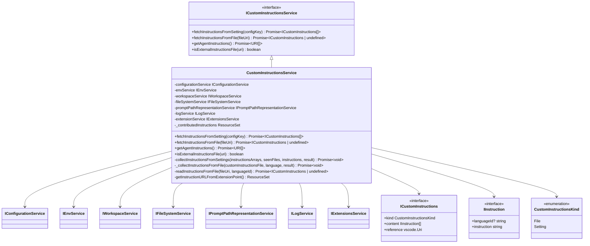
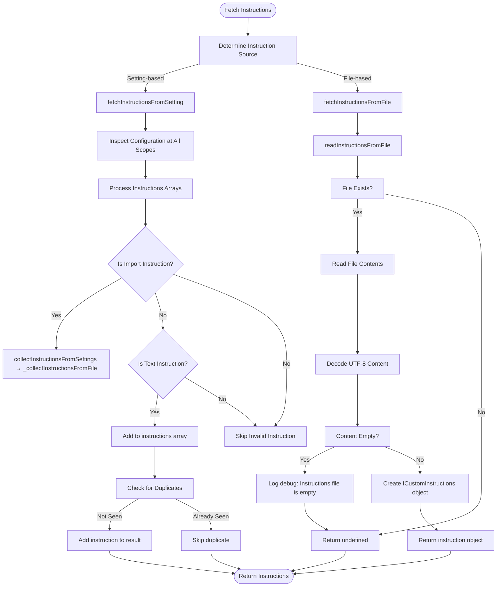
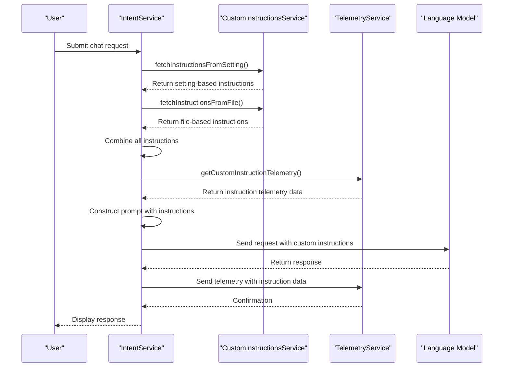

# Custom Instructions

<cite>
**Referenced Files in This Document**   
- [customInstructionsService.ts](file://src/platform/customInstructions/common/customInstructionsService.ts)
- [chatParticipantTelemetry.ts](file://src/extension/prompt/node/chatParticipantTelemetry.ts)
- [intentService.ts](file://src/extension/intents/node/intentService.ts)
- [configurationService.ts](file://src/platform/configuration/common/configurationService.ts)
</cite>

## Table of Contents
1. [Introduction](#introduction)
2. [Custom Instructions Service Architecture](#custom-instructions-service-architecture)
3. [Instruction Storage and Retrieval](#instruction-storage-and-retrieval)
4. [Integration with Conversation Flow](#integration-with-conversation-flow)
5. [Relationship with Prompt Components](#relationship-with-prompt-components)
6. [Common Issues and Troubleshooting](#common-issues-and-troubleshooting)
7. [Best Practices for Writing Custom Instructions](#best-practices-for-writing-custom-instructions)
8. [Conclusion](#conclusion)

## Introduction
The Custom Instructions feature in GitHub Copilot Chat enables users to personalize the AI's behavior and responses by defining specific guidelines that are incorporated into the prompt context before being sent to the language model. This documentation provides a comprehensive analysis of the implementation, covering how user-defined instructions are stored, retrieved, and injected into conversation flows. The system supports multiple instruction sources including settings-based instructions and file-based instructions, with a sophisticated service architecture that manages the instruction lifecycle and ensures proper integration with other prompt components like conversation history and context providers.

## Custom Instructions Service Architecture

**Diagram sources**
- [customInstructionsService.ts](file://src/platform/customInstructions/common/customInstructionsService.ts#L46-L246)

**Section sources**
- [customInstructionsService.ts](file://src/platform/customInstructions/common/customInstructionsService.ts#L46-L246)

## Instruction Storage and Retrieval

The Custom Instructions service implements a comprehensive system for storing and retrieving user-defined instructions from multiple sources. The architecture supports two primary instruction types: setting-based instructions stored in configuration files and file-based instructions stored in dedicated `.instructions.md` files within the workspace.

Setting-based instructions are retrieved through the `fetchInstructionsFromSetting` method, which inspects configuration values at different scopes (workspace folder, workspace, and global) and processes both text instructions and file import instructions. The service ensures de-duplication of instructions by maintaining sets of seen files and instruction texts.

File-based instructions are managed through the `fetchInstructionsFromFile` method, which reads instruction content from specified file URIs. The service supports a special convention where `.github/copilot-instructions.md` files in workspace folders are automatically detected and included when the `chat.instructionsFilesLocations` setting is enabled.

The instruction retrieval process is designed to handle various edge cases, including empty files, missing files, and circular references. The service also provides utility methods like `isExternalInstructionsFile` to determine whether a given file URI represents an external instructions file based on its location and extension.

**Diagram sources**
- [customInstructionsService.ts](file://src/platform/customInstructions/common/customInstructionsService.ts#L122-L191)

**Section sources**
- [customInstructionsService.ts](file://src/platform/customInstructions/common/customInstructionsService.ts#L122-L191)

## Integration with Conversation Flow

The integration of custom instructions into the conversation flow is managed through the interaction between the custom instructions service and various components in the Copilot Chat system. While the intent service itself does not directly handle custom instructions, it works in conjunction with the custom instructions service to ensure that user-defined guidelines are properly incorporated into the AI's responses.

The telemetry system plays a crucial role in tracking the usage of custom instructions. In the `chatParticipantTelemetry.ts` file, the `getCustomInstructionTelemetry` function is used to extract telemetry data about custom instructions from prompt references. This data is then included in the telemetry events sent to monitor the effectiveness and usage patterns of custom instructions.

When a chat request is processed, the system collects custom instructions from all available sources and incorporates them into the prompt context before sending the request to the language model. This ensures that the AI has access to the user's personalized guidelines when generating responses. The telemetry system captures this process through events like `panel.request`, which include measurements for custom instruction metrics such as `codeGenInstructionsCount`, `codeGenInstructionsLength`, and `codeGenInstructionsFilteredCount`.

The integration is designed to be transparent to the end user while providing valuable insights to developers about how custom instructions are being used and their impact on conversation quality.

**Diagram sources**
- [customInstructionsService.ts](file://src/platform/customInstructions/common/customInstructionsService.ts#L50-L52)
- [chatParticipantTelemetry.ts](file://src/extension/prompt/node/chatParticipantTelemetry.ts#L23)
- [intentService.ts](file://src/extension/intents/node/intentService.ts#L20-L22)

**Section sources**
- [customInstructionsService.ts](file://src/platform/customInstructions/common/customInstructionsService.ts#L50-L52)
- [chatParticipantTelemetry.ts](file://src/extension/prompt/node/chatParticipantTelemetry.ts#L23)
- [intentService.ts](file://src/extension/intents/node/intentService.ts#L20-L22)

## Relationship with Prompt Components

Custom instructions are integrated with other prompt components to create a comprehensive context for the language model. The system combines custom instructions with conversation history, code context, and other relevant information to provide the AI with a complete understanding of the user's requirements and the current development context.

The configuration service plays a key role in managing the relationship between custom instructions and other prompt components. The `CustomInstructionsInSystemMessage` setting (defined in `configurationService.ts`) controls whether custom instructions are included in the system message sent to the language model. This setting allows users to toggle the inclusion of custom instructions based on their needs.

When constructing the final prompt, the system follows a specific order to ensure optimal context utilization:
1. System message with role definition and capabilities
2. Custom instructions (if enabled)
3. Conversation history
4. Current code context and relevant files
5. User's current request

This hierarchical structure ensures that custom instructions have a strong influence on the AI's behavior while still allowing the conversation history and immediate context to provide additional nuance. The telemetry system tracks the interaction between these components through various metrics, including prompt token counts and context type information.

The integration is designed to prevent conflicts between different prompt components. For example, if both setting-based and file-based instructions contain similar guidelines, the system's de-duplication mechanisms ensure that the instructions are not repeated unnecessarily, optimizing token usage.

**Section sources**
- [configurationService.ts](file://src/platform/configuration/common/configurationService.ts#L812)
- [customInstructionsService.ts](file://src/platform/customInstructions/common/customInstructionsService.ts#L122-L142)

## Common Issues and Troubleshooting

Several common issues can arise when using custom instructions in GitHub Copilot Chat. Understanding these issues and their solutions is essential for both users and developers extending the feature.

**Instructions Being Ignored**
One common issue is custom instructions being ignored by the AI. This can occur due to several reasons:
- The `chat.customInstructionsInSystemMessage` setting is disabled
- Instructions exceed token limits and are truncated
- Conflicting instructions in different sources create ambiguity
- Instructions are not specific enough to influence the AI's behavior

To troubleshoot this issue, users should verify that the custom instructions setting is enabled and check the telemetry data to confirm that instructions are being included in the prompt.

**Instruction Truncation**
Due to token limitations in language models, long custom instructions may be truncated. The system does not currently provide explicit feedback when instructions are truncated, which can lead to unexpected behavior. Developers can monitor this issue through the telemetry metrics that track prompt token counts and instruction lengths.

**File Resolution Issues**
When using file-based instructions, users may encounter issues with file resolution. The system looks for instruction files relative to workspace folders, so files outside these locations may not be found. Additionally, the special `.github/copilot-instructions.md` files must be in the correct location within the workspace hierarchy.

**Best Practices for Troubleshooting**
1. Check the developer console for debug messages from the custom instructions service
2. Verify instruction file paths and permissions
3. Test with simplified instructions to isolate issues
4. Monitor telemetry data for evidence of instruction inclusion
5. Ensure the instruction file extension is `.instructions.md`

**Section sources**
- [customInstructionsService.ts](file://src/platform/customInstructions/common/customInstructionsService.ts#L174-L191)
- [configurationService.ts](file://src/platform/configuration/common/configurationService.ts#L812)

## Best Practices for Writing Custom Instructions

Effective custom instructions should be clear, specific, and focused on the desired behavior. Here are best practices for writing custom instructions that maximize their effectiveness:

**Be Specific and Actionable**
Instead of vague instructions like "be helpful," use specific guidance such as "always provide code examples in TypeScript when discussing JavaScript concepts" or "explain complex algorithms step by step with visual descriptions."

**Prioritize Important Guidelines**
Place the most important instructions at the beginning, as token limitations may result in later instructions being truncated. Critical behavioral guidelines should come before less important preferences.

**Use Language-Specific Instructions**
Leverage the languageId property to provide targeted instructions for specific programming languages. For example, you might have different coding style preferences for Python versus JavaScript.

**Avoid Contradictory Instructions**
Ensure that instructions do not conflict with each other. For example, don't specify both "always use functional programming patterns" and "prefer object-oriented design" without clarifying when to use each approach.

**Keep Instructions Concise**
While comprehensive guidance is valuable, extremely long instructions may be truncated or diluted in their impact. Focus on the most essential guidelines and refine them over time based on their effectiveness.

**Test and Iterate**
Regularly evaluate the effectiveness of custom instructions by observing the AI's responses. Refine instructions based on what works well and what needs improvement.

**Organize Instructions Logically**
Group related instructions together and use clear formatting to enhance readability. Consider organizing instructions by category such as coding style, documentation standards, and problem-solving approach.

**Section sources**
- [customInstructionsService.ts](file://src/platform/customInstructions/common/customInstructionsService.ts#L30-L44)

## Conclusion
The Custom Instructions feature in GitHub Copilot Chat provides a powerful mechanism for personalizing the AI's behavior and responses. The implementation features a robust service architecture that manages the lifecycle of user-defined instructions from multiple sources, including settings and dedicated instruction files. The system integrates these instructions seamlessly into the conversation flow, ensuring they are considered alongside other prompt components like conversation history and code context.

For developers extending the feature, the service-oriented architecture provides clear interfaces for accessing and managing custom instructions. The telemetry system offers valuable insights into instruction usage and effectiveness, enabling continuous improvement of the feature. By following best practices for writing custom instructions and understanding common issues, users can maximize the value of this feature in their development workflow.

The implementation demonstrates a thoughtful approach to balancing flexibility with performance considerations, particularly in handling token limitations and ensuring efficient instruction retrieval. As the feature evolves, opportunities exist to enhance feedback mechanisms for instruction truncation and to provide more sophisticated conflict resolution between competing instructions.