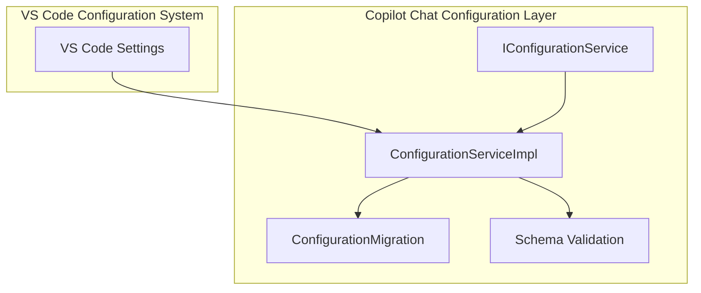
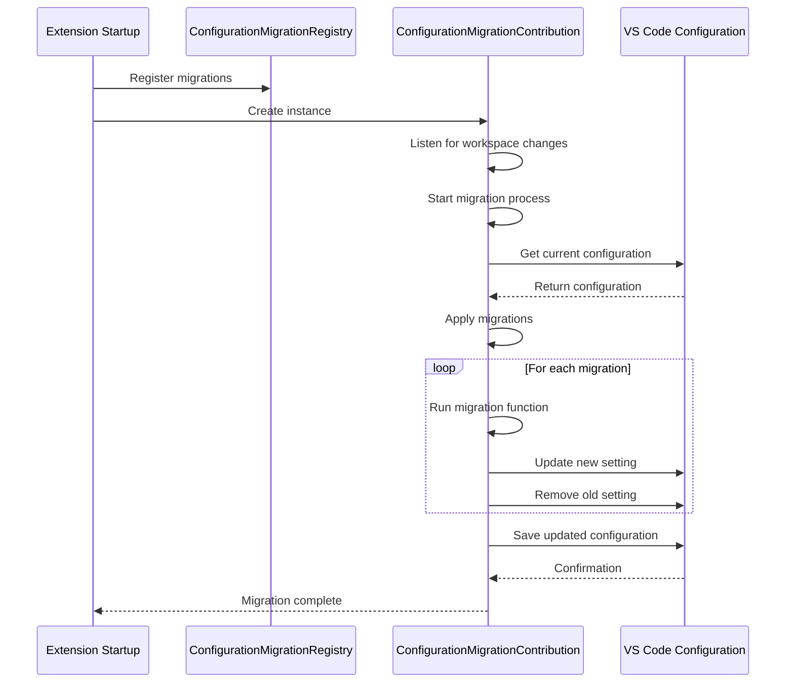
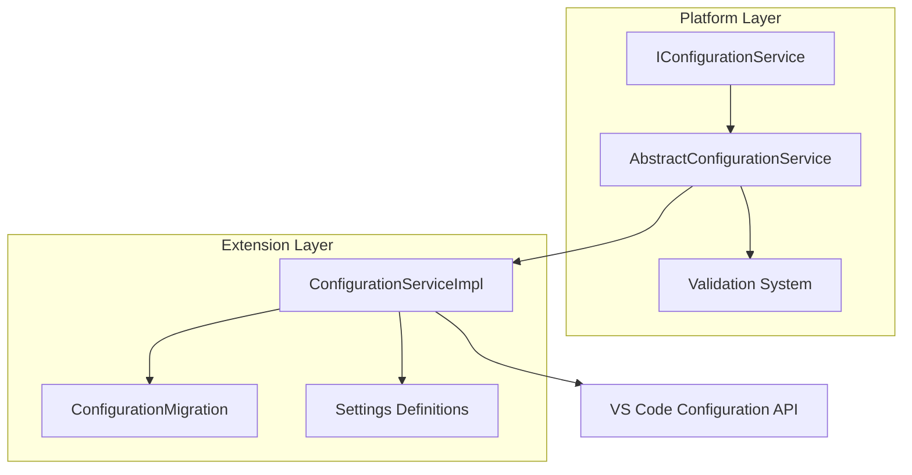

# General Settings

<cite>
**Referenced Files in This Document**   
- [configurationMigration.ts](file://src/extension/configuration/vscode-node/configurationMigration.ts)
- [configurationService.ts](file://src/platform/configuration/common/configurationService.ts)
- [configurationServiceImpl.ts](file://src/platform/configuration/vs/common/configurationServiceImpl.ts)
- [validator.ts](file://src/platform/configuration/common/validator.ts)
- [jsonSchema.ts](file://src/platform/configuration/common/jsonSchema.ts)
- [package.json](file://package.json)
</cite>

## Table of Contents
1. [Introduction](#introduction)
2. [Configuration Architecture Overview](#configuration-architecture-overview)
3. [Settings Definition in package.json](#settings-definition-in-packagejson)
4. [Configuration Service Implementation](#configuration-service-implementation)
5. [Schema Validation System](#schema-validation-system)
6. [Configuration Migration Framework](#configuration-migration-framework)
7. [Relationship Between Platform and Extension Configuration](#relationship-between-platform-and-extension-configuration)
8. [Common Issues and Troubleshooting](#common-issues-and-troubleshooting)
9. [Conclusion](#conclusion)

## Introduction

The GitHub Copilot Chat extension implements a comprehensive configuration management system that integrates with VS Code's settings infrastructure while providing advanced features for schema validation, backward compatibility, and experimental feature management. This document explains the implementation of the configuration system, covering how settings are defined, stored, accessed, validated, and migrated across versions.

The system is designed to handle both public settings visible to all users and internal settings restricted to team members or internal users. It supports complex data types, validation rules, and migration strategies to ensure a smooth user experience when settings evolve over time.

**Section sources**
- [configurationService.ts](file://src/platform/configuration/common/configurationService.ts#L26-L800)
- [package.json](file://package.json#L140-L800)

## Configuration Architecture Overview

The configuration system in GitHub Copilot Chat follows a layered architecture with clear separation between platform-level services and extension-specific implementations. At its core is the `IConfigurationService` interface that defines the contract for configuration access and manipulation.

The architecture consists of three main components:
1. **Configuration Service Interface**: Defines the API for configuration operations
2. **Configuration Service Implementation**: Provides the concrete implementation that interacts with VS Code's configuration system
3. **Configuration Migration System**: Handles backward compatibility when settings change

This separation allows for a clean abstraction between the configuration API and its implementation, making it easier to maintain and extend the system.



**Diagram sources**
- [configurationService.ts](file://src/platform/configuration/common/configurationService.ts#L28-L164)
- [configurationServiceImpl.ts](file://src/platform/configuration/vscode/configurationServiceImpl.ts#L21-L256)

## Settings Definition in package.json

Settings in the GitHub Copilot Chat extension are primarily defined in the `package.json` file through the `contributes.configuration` property. This follows VS Code's standard contribution point for extension settings.

The configuration contributions are organized into categories, with each category containing a set of properties that define individual settings. Each setting property includes metadata such as type, default value, description, and scope. For example:

```json
{
  "contributes": {
    "configuration": [
      {
        "id": "github.copilot",
        "title": "GitHub Copilot",
        "type": "object",
        "properties": {
          "github.copilot.chat.codeGeneration.instructions": {
            "type": "array",
            "default": [],
            "description": "User provided code generation instructions for the chat"
          }
        }
      }
    ]
  }
}
```

Settings are organized under the `github.copilot` namespace, with subcategories like `chat`, `advanced`, and others. The system supports both simple settings and complex object structures. Some settings are marked as internal and not exposed in the package.json, while others are public and visible to all users.

The configuration system also supports advanced features like experiment-based settings, which can have different values based on A/B testing configurations.

**Section sources**
- [package.json](file://package.json#L140-L800)
- [configurationService.ts](file://src/platform/configuration/common/configurationService.ts#L429-L480)

## Configuration Service Implementation

The configuration service implementation provides the concrete functionality for accessing and modifying settings. It is built around the `AbstractConfigurationService` class which implements the `IConfigurationService` interface.

The service uses a registry pattern to manage all configuration settings, with each setting registered through helper functions like `defineSetting`, `defineValidatedSetting`, and `defineExpSetting`. These functions create configuration objects that contain metadata about the setting, including its ID, default value, and validation rules.

```mermaid
classDiagram
class IConfigurationService {
+getConfig(key : Config<T>, scope? : ConfigurationScope) : T
+getConfigObservable(key : Config<T>) : IObservable<T>
+inspectConfig(key : BaseConfig<T>, scope? : ConfigurationScope) : InspectConfigResult<T> | undefined
+isConfigured(key : BaseConfig<T>, scope? : ConfigurationScope) : boolean
+getNonExtensionConfig(configKey : string) : T | undefined
+setConfig(key : BaseConfig<T>, value : T) : Thenable<void>
+getExperimentBasedConfig(key : ExperimentBasedConfig<T>, experimentationService : IExperimentationService, scope? : ConfigurationScope) : T
+getExperimentBasedConfigObservable(key : ExperimentBasedConfig<T>, experimentationService : IExperimentationService) : IObservable<T>
+getConfigMixedWithDefaults(key : Config<T>) : T
+getDefaultValue(key : Config<T>) : T
+onDidChangeConfiguration : Event<ConfigurationChangeEvent>
+updateExperimentBasedConfiguration(treatments : string[]) : void
+dumpConfig() : { [key : string] : string }
}
class AbstractConfigurationService {
-_onDidChangeConfiguration : Emitter<ConfigurationChangeEvent>
-_isInternal : boolean
-_isTeamMember : boolean
-_teamMemberUsername : string | undefined
-observables : Map<string, IObservable<any>>
+getConfigMixedWithDefaults(key : Config<T>) : T
+getDefaultValue(key : BaseConfig<T>) : T
+_setUserInfo(userInfo : { isInternal : boolean; isTeamMember : boolean; teamMemberUsername? : string }) : void
+getConfig(key : Config<T>, scope? : ConfigurationScope) : T
+inspectConfig(key : BaseConfig<T>, scope? : ConfigurationScope) : InspectConfigResult<T> | undefined
+getNonExtensionConfig(configKey : string) : T | undefined
+setConfig(key : BaseConfig<T>, value : T) : Thenable<void>
+getExperimentBasedConfig(key : ExperimentBasedConfig<T>, experimentationService : IExperimentationService) : T
+dumpConfig() : { [key : string] : string }
+updateExperimentBasedConfiguration(treatments : string[]) : void
+getConfigObservable(key : Config<T>) : IObservable<T>
+getExperimentBasedConfigObservable(key : ExperimentBasedConfig<T>, experimentationService : IExperimentationService) : IObservable<T>
+_getObservable_$show2FramesUp(key : BaseConfig<T>, getValue : () => T) : IObservable<T>
+_isUsingTeamDefault(key : BaseConfig<any>) : boolean
+_extractHashValue(input : string) : number
+isConfigured(key : BaseConfig<T>, scope? : ConfigurationScope) : boolean
}
class ConfigurationServiceImpl {
-config : WorkspaceConfiguration
+getConfig(key : Config<T>, scope? : vscode.ConfigurationScope) : T
+inspectConfig(key : BaseConfig<T>, scope? : vscode.ConfigurationScope) : InspectConfigResult<T> | undefined
+getNonExtensionConfig(configKey : string) : T | undefined
+setConfig(key : BaseConfig<T>, value : T) : Thenable<void>
+getExperimentBasedConfig(key : ExperimentBasedConfig<T>, experimentationService : IExperimentationService, scope? : vscode.ConfigurationScope) : T
+_getUserConfiguredValueForExperimentBasedConfig(key : ExperimentBasedConfig<T>, scope? : vscode.ConfigurationScope) : T | undefined
+dumpConfig() : { [key : string] : string }
+updateExperimentBasedConfiguration(treatments : string[]) : void
+_getTargetFromInspect(inspect? : { key : string; workspaceValue? : unknown; workspaceFolderValue? : unknown }) : vscode.ConfigurationTarget
}
IConfigurationService <|-- AbstractConfigurationService
AbstractConfigurationService <|-- ConfigurationServiceImpl
```

**Diagram sources**
- [configurationService.ts](file://src/platform/configuration/common/configurationService.ts#L80-L164)
- [configurationServiceImpl.ts](file://src/platform/configuration/vscode/configurationServiceImpl.ts#L21-L256)

## Schema Validation System

The configuration system includes a robust schema validation framework that ensures settings conform to expected types and constraints. The validation system is built around the `IValidator` interface, which defines a contract for validating configuration values.

Validators are created using factory functions like `vString()`, `vNumber()`, `vBoolean()`, `vArray()`, `vObj()`, and `vEnum()`. These validators can be composed to create complex validation rules for nested objects and arrays.

The validation system supports:
- Type checking (string, number, boolean, object, array)
- Required field validation
- Array validation with item-specific validators
- Object validation with property-specific validators
- Enum validation for restricted value sets
- Union types for values that can be one of several types

When a setting is accessed, the system automatically validates its value against the defined schema. If validation fails, the system logs an error and returns the default value to prevent runtime errors.

```mermaid
classDiagram
class IValidator~T~ {
+validate(content : unknown) : { content : T; error : undefined } | { content : undefined; error : ValidationError }
+toSchema() : JsonSchema
+isRequired?() : boolean
}
class TypeofValidator~TKey~ {
-type : TKey
+validate(content : unknown) : { content : TypeOfMap[TKey]; error : undefined } | { content : undefined; error : ValidationError }
+toSchema() : JsonSchema
}
class ObjectValidator~T~ {
-properties : Record<string, IValidator<any>>
+validate(content : unknown) : { content : any; error : undefined } | { content : undefined; error : ValidationError }
+toSchema() : JsonSchema
}
class ArrayValidator~T~ {
-validator : IValidator<T>
+validate(content : unknown) : { content : T[]; error : undefined } | { content : undefined; error : ValidationError }
+toSchema() : JsonSchema
}
class UnionValidator~T~ {
-validators : IValidator<any>[]
+validate(content : unknown) : { content : any; error : undefined } | { content : undefined; error : ValidationError }
+toSchema() : JsonSchema
}
class EnumValidator~T~ {
-values : T[]
+validate(content : unknown) : { content : any; error : undefined } | { content : undefined; error : ValidationError }
+toSchema() : JsonSchema
}
IValidator <|-- TypeofValidator
IValidator <|-- ObjectValidator
IValidator <|-- ArrayValidator
IValidator <|-- UnionValidator
IValidator <|-- EnumValidator
class JsonSchema {
+$id? : string
+$schema? : string
+title? : string
+description? : string
+definitions? : { [name : string] : JsonSchema }
+enum? : unknown[]
+format? : string | Format
+if? : JsonSchema
+then? : JsonSchema
+else? : JsonSchema
+allOf? : JsonSchema[]
+anyOf? : JsonSchema[]
+oneOf? : JsonSchema[]
+not? : JsonSchema
}
class NumericJsonSchema {
+type : JsonSchemaType.Numeric | JsonSchemaType[]
+multipleOf? : number
+maximum? : number
+exclusiveMaximum? : boolean
+minimum? : number
+exclusiveMinimum? : boolean
}
class StringJsonSchema {
+type : typeof JsonSchemaType.string | JsonSchemaType[]
+maxLength? : number
+minLength? : number
+pattern? : string
}
class ArrayJsonSchema {
+type : typeof JsonSchemaType.array | JsonSchemaType[]
+items? : JsonSchema | JsonSchema[]
+additionalItems? : JsonSchema
+maxItems? : number
+minItems? : number
+uniqueItems? : boolean
+contains : JsonSchema
}
class ObjectJsonSchema {
+type : typeof JsonSchemaType.object | JsonSchemaType[]
+maxProperties? : number
+minProperties? : number
+required? : string[]
+properties? : { [name : string] : JsonSchema }
+patternProperties? : { [name : string] : JsonSchema }
+additionalProperties? : JsonSchema
+dependencies? : { [name : string] : JsonSchema | string[] }
}
JsonSchema <|-- NumericJsonSchema
JsonSchema <|-- StringJsonSchema
JsonSchema <|-- ArrayJsonSchema
JsonSchema <|-- ObjectJsonSchema
```

**Diagram sources**
- [validator.ts](file://src/platform/configuration/common/validator.ts#L8-L292)
- [jsonSchema.ts](file://src/platform/configuration/common/jsonSchema.ts#L6-L139)

## Configuration Migration Framework

The configuration migration framework handles backward compatibility when settings change between versions. This is crucial for maintaining user preferences and ensuring a smooth upgrade experience.

The migration system is implemented in `configurationMigration.ts` and follows these key principles:

1. **Migration Registry**: A central registry stores all migration functions that need to be applied
2. **Migration Functions**: Each migration is a function that transforms an old setting value to a new format
3. **Automatic Application**: Migrations are automatically applied when the extension starts
4. **Scope Handling**: Migrations are applied to all relevant configuration scopes (global, workspace, folder)

The system uses the `ConfigurationMigrationRegistry` to register migrations, with each migration specifying:
- The key of the setting to migrate
- A migration function that transforms the value
- Optional asynchronous operations



**Diagram sources**
- [configurationMigration.ts](file://src/extension/configuration/vscode-node/configurationMigration.ts#L1-L206)

## Relationship Between Platform and Extension Configuration

The configuration system establishes a clear relationship between platform-level configuration services and extension-specific implementations. The platform provides the core configuration service interface and base implementation, while the extension provides the concrete implementation that integrates with VS Code.

The key components of this relationship are:

1. **Platform Configuration Service**: Defined in `src/platform/configuration/common/configurationService.ts`, this provides the abstract interface and base functionality
2. **Extension Configuration Implementation**: Defined in `src/extension/configuration/vscode-node/configurationServiceImpl.ts`, this implements the platform interface using VS Code's configuration API
3. **Configuration Migration**: Handled at the extension level but integrated with the platform service
4. **Validation System**: Shared between platform and extension through common validator modules

This architecture allows for separation of concerns, with the platform defining what configuration operations are available and the extension implementing how they are performed in the VS Code environment.



**Diagram sources**
- [configurationService.ts](file://src/platform/configuration/common/configurationService.ts#L28-L164)
- [configurationServiceImpl.ts](file://src/platform/configuration/vscode/configurationServiceImpl.ts#L21-L256)
- [configurationMigration.ts](file://src/extension/configuration/vscode-node/configurationMigration.ts#L1-L206)

## Common Issues and Troubleshooting

Several common issues can occur with the configuration system, along with recommended troubleshooting steps:

### Settings Not Persisting
**Symptoms**: Changes to settings don't save or revert after restart
**Causes**:
- Permission issues with settings file
- Conflicting settings in different scopes (user, workspace, folder)
- Migration conflicts between old and new setting formats

**Troubleshooting**:
1. Check file permissions on settings.json
2. Verify which configuration scope is being modified
3. Look for error messages in the developer console
4. Try resetting the setting to default and reconfiguring

### Migration Failures
**Symptoms**: Old settings not properly migrated to new format
**Causes**:
- Migration functions not properly registered
- Asynchronous migration operations not completing
- Conflicts between flat and object style advanced settings

**Troubleshooting**:
1. Check the migration registry for proper registration
2. Verify migration functions handle all possible input types
3. Ensure proper error handling in migration functions
4. Manually update settings if automatic migration fails

### Validation Errors
**Symptoms**: Settings not applying or default values being used unexpectedly
**Causes**:
- Invalid data types in settings
- Values outside allowed ranges
- Required fields missing in object settings

**Troubleshooting**:
1. Check developer console for validation error messages
2. Verify setting values match expected types and constraints
3. Use VS Code's settings editor to ensure proper formatting
4. Consult documentation for valid values and formats

### Performance Issues
**Symptoms**: Slow startup or configuration access
**Causes**:
- Complex validation rules
- Large configuration objects
- Synchronous operations in configuration access

**Troubleshooting**:
1. Optimize validation rules for performance
2. Consider breaking large configuration objects into smaller ones
3. Use asynchronous operations where appropriate
4. Cache frequently accessed configuration values

**Section sources**
- [configurationService.ts](file://src/platform/configuration/common/configurationService.ts#L80-L164)
- [configurationServiceImpl.ts](file://src/platform/configuration/vscode/configurationServiceImpl.ts#L21-L256)
- [validator.ts](file://src/platform/configuration/common/validator.ts#L8-L292)
- [configurationMigration.ts](file://src/extension/configuration/vscode-node/configurationMigration.ts#L1-L206)

## Conclusion

The GitHub Copilot Chat configuration system provides a robust and flexible framework for managing extension settings. By combining VS Code's built-in configuration system with custom validation, migration, and service layers, it offers a comprehensive solution for handling user preferences and application settings.

Key strengths of the system include:
- Clear separation between platform and extension concerns
- Comprehensive validation to ensure data integrity
- Automated migration for backward compatibility
- Support for both public and internal settings
- Integration with experimentation systems for feature rollout

The system is designed to be maintainable and extensible, allowing for new settings to be added and existing ones to evolve over time without disrupting the user experience. By following the patterns and practices documented here, developers can effectively work with the configuration system to enhance the functionality of the Copilot Chat extension.