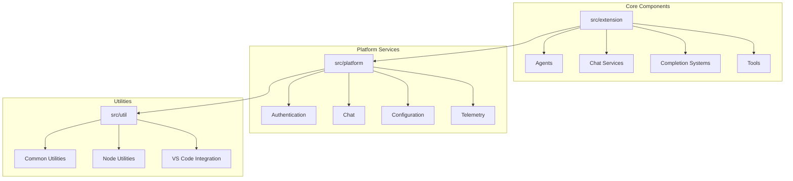
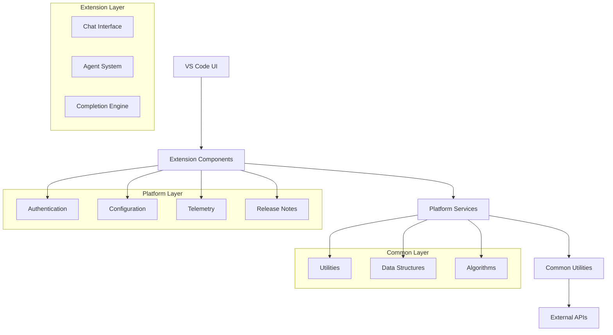
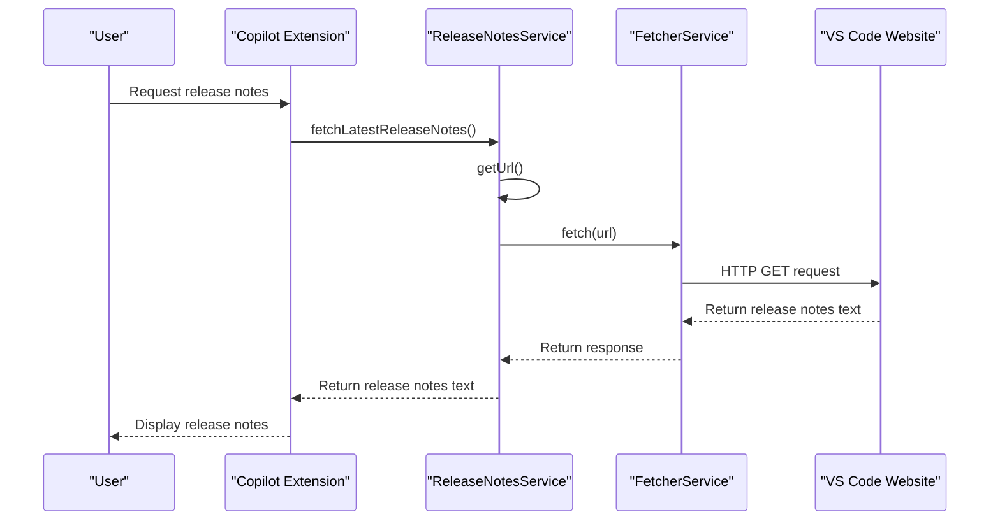
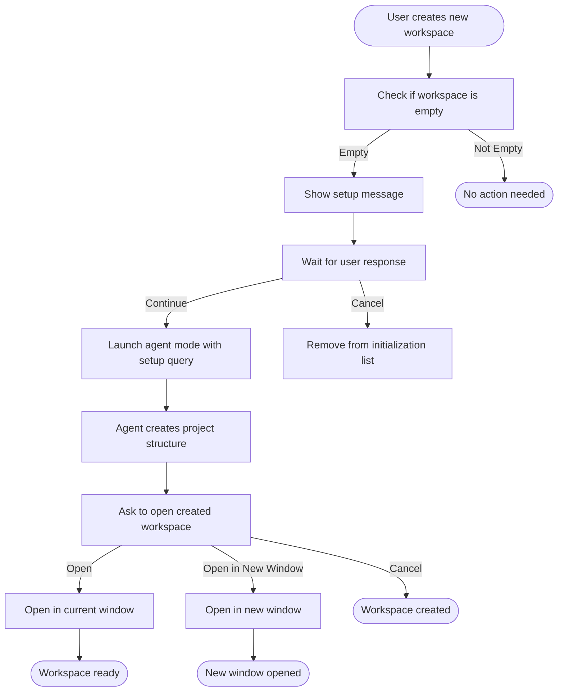
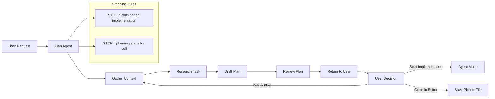
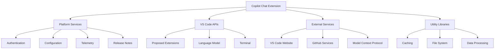

# IFLOW WEEKLY UPDATE GUIDE

<cite>
**Referenced Files in This Document**   
- [README.md](file://README.md)
- [package.json](file://package.json)
- [releaseNotesServiceImpl.ts](file://src/platform/releaseNotes/vscode/releaseNotesServiceImpl.ts)
- [releaseNotesService.ts](file://src/platform/releaseNotes/common/releaseNotesService.ts)
- [newWorkspaceInitializer.ts](file://src/extension/getting-started/vscode-node/newWorkspaceInitializer.ts)
- [newWorkspace.contribution.ts](file://src/extension/getting-started/vscode-node/newWorkspace.contribution.ts)
- [vscode.d.ts](file://src/extension/vscode.d.ts)
- [Plan.agent.md](file://assets/agents/Plan.agent.md)
</cite>

## Table of Contents
1. [Introduction](#introduction)
2. [Project Structure](#project-structure)
3. [Core Components](#core-components)
4. [Architecture Overview](#architecture-overview)
5. [Detailed Component Analysis](#detailed-component-analysis)
6. [Dependency Analysis](#dependency-analysis)
7. [Performance Considerations](#performance-considerations)
8. [Troubleshooting Guide](#troubleshooting-guide)
9. [Conclusion](#conclusion)
10. [Appendices](#appendices)

## Introduction
GitHub Copilot is an AI-powered peer programming tool designed to enhance developer productivity within Visual Studio Code. The extension provides intelligent code suggestions, conversational AI assistance, and advanced features like agent mode for autonomous coding tasks. This document serves as a comprehensive guide to the current state of the GitHub Copilot Chat extension, detailing its architecture, core components, and recent developments.

The extension integrates seamlessly with VS Code, offering features such as inline suggestions, next edit suggestions (NES), and chat-based assistance. It supports a wide range of programming languages and frameworks, adapting to individual coding styles and project requirements. The system is designed to maintain user privacy while providing context-aware assistance through various participants, variables, and slash commands.

**Section sources**
- [README.md](file://README.md#L1-L84)

## Project Structure
The GitHub Copilot Chat repository follows a well-organized structure with distinct directories for different components:

- **assets/agents/**: Contains agent configuration files, including the Plan.agent.md for planning workflows
- **chat-lib/**: Houses shared library components for chat functionality
- **script/**: Includes various utility scripts for build, setup, and testing processes
- **src/**: Main source code directory with extension components, platform services, and utilities
- **test/**: Comprehensive test suite with scenarios, simulations, and outcome validation
- Root-level configuration files: package.json, tsconfig.json, and other project configuration

The src/ directory is particularly important, containing the extension's core functionality organized into logical modules such as agents, chat services, completion systems, and platform utilities. This modular structure enables maintainable code and clear separation of concerns.

**Diagram sources **
- [package.json](file://package.json#L1-L4435)

**Section sources**
- [package.json](file://package.json#L1-L4435)

## Core Components
The GitHub Copilot Chat extension consists of several core components that work together to provide AI-powered coding assistance. The system architecture is built around a modular design with clear separation between the user interface, business logic, and platform services.

Key components include the agent system for autonomous coding tasks, the chat interface for conversational assistance, and the completion system for inline suggestions. The extension also includes specialized services for release notes, workspace management, and telemetry collection.

The release notes service is a notable component that fetches and displays version-specific information from the VS Code documentation site. This service demonstrates the extension's ability to integrate external resources to provide relevant information to users.

**Section sources**
- [releaseNotesServiceImpl.ts](file://src/platform/releaseNotes/vscode/releaseNotesServiceImpl.ts#L1-L66)
- [releaseNotesService.ts](file://src/platform/releaseNotes/common/releaseNotesService.ts#L1-L22)

## Architecture Overview
The GitHub Copilot Chat extension follows a service-oriented architecture with clear separation between components. The system is designed to be extensible, with well-defined interfaces and dependency injection patterns.

The architecture consists of three main layers:
1. **Extension Layer**: Contains VS Code-specific implementations and UI components
2. **Platform Layer**: Provides shared services and utilities across different IDEs
3. **Common Layer**: Houses fundamental data structures and algorithms

Communication between components follows a dependency injection pattern, with services registered and resolved through a central instantiation system. This design enables loose coupling and facilitates testing and maintenance.

**Diagram sources **
- [releaseNotesServiceImpl.ts](file://src/platform/releaseNotes/vscode/releaseNotesServiceImpl.ts#L1-L66)
- [releaseNotesService.ts](file://src/platform/releaseNotes/common/releaseNotesService.ts#L1-L22)

## Detailed Component Analysis

### Release Notes Service
The Release Notes Service is responsible for fetching and displaying version-specific information from the VS Code documentation site. This component demonstrates the extension's ability to integrate external resources to provide relevant information to users.

The service implementation includes methods to fetch both the latest release notes and notes for specific VS Code versions. It handles version parsing and URL construction to retrieve the appropriate documentation from the VS Code website.

**Diagram sources **
- [releaseNotesServiceImpl.ts](file://src/platform/releaseNotes/vscode/releaseNotesServiceImpl.ts#L1-L66)
- [releaseNotesService.ts](file://src/platform/releaseNotes/common/releaseNotesService.ts#L1-L22)

**Section sources**
- [releaseNotesServiceImpl.ts](file://src/platform/releaseNotes/vscode/releaseNotesServiceImpl.ts#L1-L66)
- [releaseNotesService.ts](file://src/platform/releaseNotes/common/releaseNotesService.ts#L1-L22)

### New Workspace Creation
The new workspace creation feature enables users to set up complete project structures through natural language commands. This functionality is implemented through a combination of initialization services and contribution points.

The NewWorkspaceInitializer class monitors workspace state and triggers setup workflows when appropriate. It integrates with VS Code's command system to launch agent-mode sessions for project creation.

**Diagram sources **
- [newWorkspaceInitializer.ts](file://src/extension/getting-started/vscode-node/newWorkspaceInitializer.ts#L1-L55)
- [newWorkspace.contribution.ts](file://src/extension/getting-started/vscode-node/newWorkspace.contribution.ts#L1-L17)

**Section sources**
- [newWorkspaceInitializer.ts](file://src/extension/getting-started/vscode-node/newWorkspaceInitializer.ts#L1-L55)
- [newWorkspace.contribution.ts](file://src/extension/getting-started/vscode-node/newWorkspace.contribution.ts#L1-L17)

### Agent System
The agent system in GitHub Copilot enables autonomous coding tasks through specialized agents like the Plan agent. These agents follow specific workflows to research, plan, and execute complex development tasks.

The Plan agent, defined in Plan.agent.md, focuses exclusively on planning multi-step tasks without implementing them. It uses a structured workflow that includes context gathering, research, and plan drafting, with strict stopping rules to prevent implementation.

**Diagram sources **
- [Plan.agent.md](file://assets/agents/Plan.agent.md#L1-L34)

**Section sources**
- [Plan.agent.md](file://assets/agents/Plan.agent.md#L1-L34)

## Dependency Analysis
The GitHub Copilot Chat extension has a well-defined dependency structure with clear relationships between components. The system uses dependency injection to manage service dependencies, promoting loose coupling and testability.

Key dependencies include:
- Platform services (authentication, configuration, telemetry)
- External APIs (VS Code documentation, GitHub services)
- Utility libraries (caching, file system operations, data processing)

The extension also depends on specific VS Code APIs and proposed extensions, as declared in the package.json file. These dependencies enable advanced features like interactive sessions, code actions, and terminal integration.

**Diagram sources **
- [package.json](file://package.json#L1-L4435)

**Section sources**
- [package.json](file://package.json#L1-L4435)

## Performance Considerations
The GitHub Copilot Chat extension is designed with performance in mind, implementing various optimization strategies to ensure responsive user experiences. The system employs caching mechanisms, efficient data structures, and asynchronous operations to minimize latency.

Key performance considerations include:
- Efficient release notes fetching with proper URL construction
- Optimized workspace initialization to avoid unnecessary operations
- Streamlined agent workflows to reduce processing time
- Proper resource management to prevent memory leaks

The extension also implements telemetry collection to monitor performance metrics and identify potential bottlenecks. This data helps guide optimization efforts and ensures the system remains responsive under various usage patterns.

## Troubleshooting Guide
When encountering issues with the GitHub Copilot Chat extension, consider the following troubleshooting steps:

1. **Version Compatibility**: Ensure you're using a compatible version of VS Code, as the extension requires the latest releases.
2. **Authentication**: Verify your GitHub Copilot subscription and authentication status.
3. **Network Connectivity**: Check your internet connection, as the extension relies on external services.
4. **Configuration**: Review extension settings to ensure they're properly configured.
5. **Telemetry**: Examine telemetry data for error patterns or performance issues.

For specific issues with release notes, verify that the VS Code version can be properly parsed and that the documentation URL is correctly constructed. For workspace creation issues, check that the initialization context is properly set and that the agent system is functioning correctly.

**Section sources**
- [README.md](file://README.md#L1-L84)
- [package.json](file://package.json#L1-L4435)

## Conclusion
The GitHub Copilot Chat extension represents a sophisticated AI-powered development tool that enhances programmer productivity through intelligent code suggestions, conversational assistance, and autonomous coding capabilities. The system's modular architecture, clear separation of concerns, and well-defined interfaces make it maintainable and extensible.

Recent developments, such as the enhanced workspace creation and agent system improvements, demonstrate the extension's evolution toward more comprehensive development assistance. The integration of external resources like release notes and the implementation of specialized agents show a commitment to providing context-aware, relevant assistance.

As the extension continues to evolve, maintaining performance, privacy, and usability will remain critical priorities. The current architecture provides a solid foundation for future enhancements while ensuring a seamless user experience.

## Appendices

### Appendix A: Key Configuration Settings
- **Version**: 0.33.0
- **Build Type**: dev
- **Required VS Code Version**: ^1.106.0-20251024
- **Node.js Requirement**: >=22.14.0
- **Enabled API Proposals**: interactive, codeActionAI, activeComment, and others

### Appendix B: Major Component Versions
- **completionsCoreVersion**: 1.378.1799
- **internalAIKey**: 1058ec22-3c95-4951-8443-f26c1f325911
- **ariaKey**: 0c6ae279ed8443289764825290e4f9e2-1a736e7c-1324-4338-be46-fc2a58ae4d14-7255