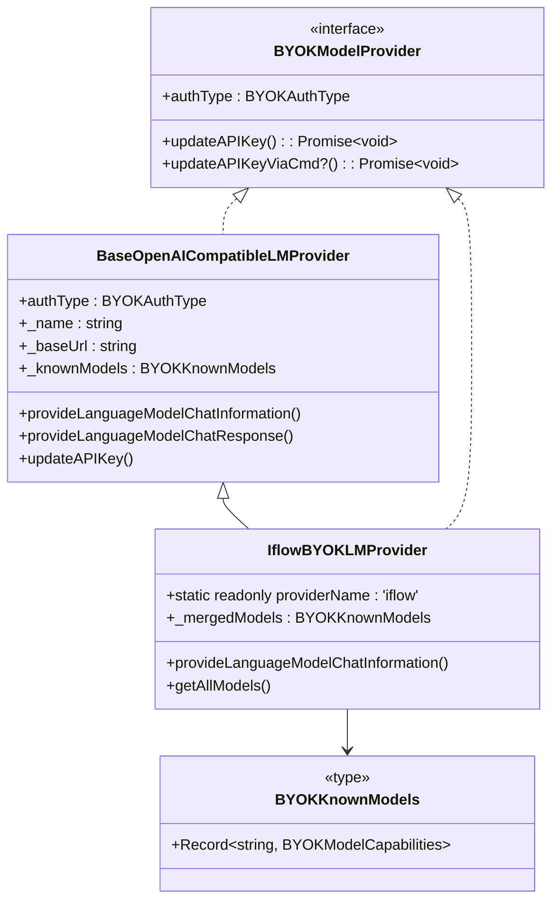
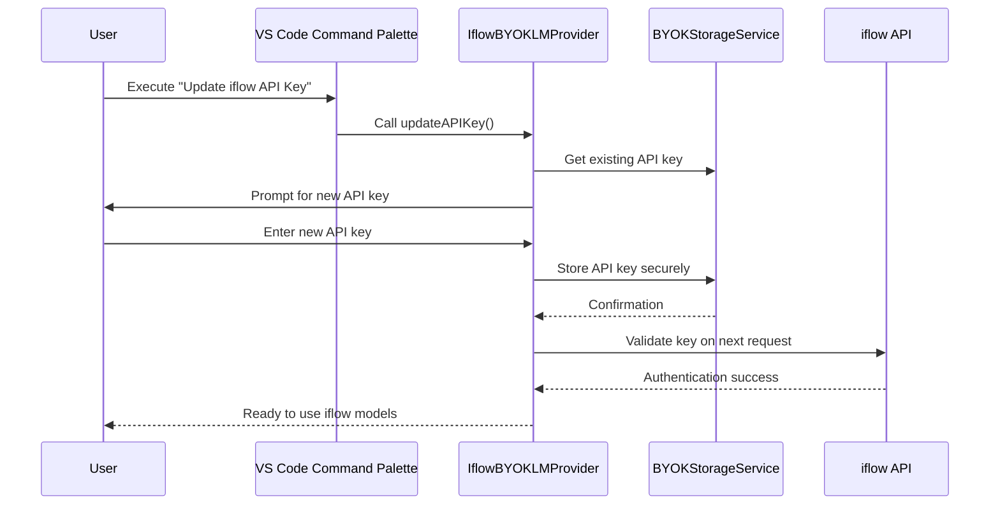
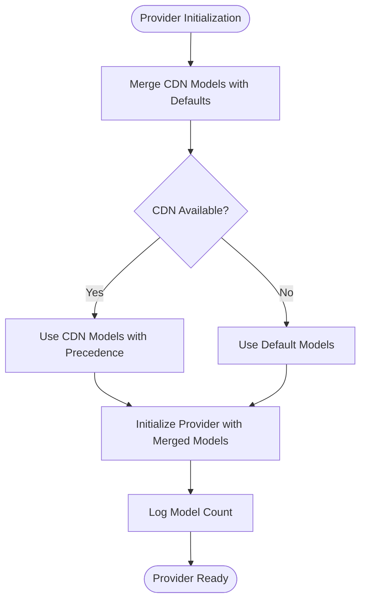
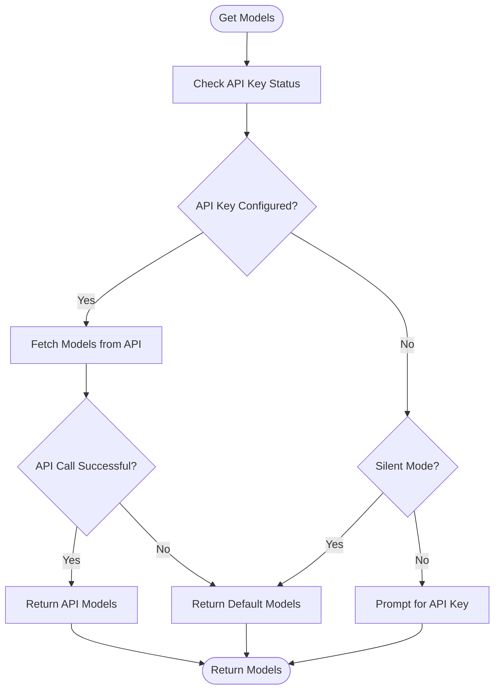

# iflow Quick Reference

<cite>
**Referenced Files in This Document**   
- [iflow-quick-reference.md](file://docs/iflow-quick-reference.md)
- [iflow-setup.md](file://docs/iflow-setup.md)
- [iflowProvider.ts](file://src/extension/byok/vscode-node/iflowProvider.ts)
- [byokProvider.ts](file://src/extension/byok/common/byokProvider.ts)
- [baseOpenAICompatibleProvider.ts](file://src/extension/byok/vscode-node/baseOpenAICompatibleProvider.ts)
- [byokContribution.ts](file://src/extension/byok/vscode-node/byokContribution.ts)
</cite>

## Table of Contents
1. [Weekly Update (Required)](#weekly-update-required)
2. [First Time Setup](#first-time-setup)
3. [Available Models](#available-models)
4. [Troubleshooting](#troubleshooting)
5. [Pro Tips](#pro-tips)
6. [Architecture Overview](#architecture-overview)
7. [Configuration and Authentication](#configuration-and-authentication)
8. [Model Management](#model-management)
9. [Error Handling and Fallbacks](#error-handling-and-fallbacks)
10. [Programmatic Integration](#programmatic-integration)

## Weekly Update (Required)

⏰ **Update your iflow API key every week**

### Quick Steps:
1. `Ctrl+Shift+P` (or `Cmd+Shift+P` on Mac)
2. Type: `Update iflow`
3. Select: `GitHub Copilot: Update iflow API Key`
4. Paste new key → Press `Enter`

⏱️ **Takes 10 seconds**

**Section sources**
- [iflow-quick-reference.md](file://docs/iflow-quick-reference.md#L5-L13)
- [iflow-setup.md](file://docs/iflow-setup.md#L52-L64)

## First Time Setup

1. Get API key from [https://apis.iflow.cn](https://apis.iflow.cn)
2. Command Palette → `GitHub Copilot: Update iflow API Key`
3. Paste key → Press `Enter`
4. Done! Select iflow models in Copilot Chat

**Section sources**
- [iflow-quick-reference.md](file://docs/iflow-quick-reference.md#L17-L22)
- [iflow-setup.md](file://docs/iflow-setup.md#L17-L37)

## Available Models

- **Qwen3-Coder** - Advanced coding (256K context)
- **kimi-k2-0905** - General purpose with vision

**Section sources**
- [iflow-quick-reference.md](file://docs/iflow-quick-reference.md#L26-L30)
- [iflowProvider.ts](file://src/extension/byok/vscode-node/iflowProvider.ts#L14-L28)

## Troubleshooting

**Authentication Error?**
→ Update your API key (it expires weekly)

**Models not showing?**
→ Restart VS Code after entering API key

**Remove iflow?**
→ Run update command with empty input

**Section sources**
- [iflow-quick-reference.md](file://docs/iflow-quick-reference.md#L34-L43)
- [iflow-setup.md](file://docs/iflow-setup.md#L87-L113)

## Pro Tips

✅ Set a weekly calendar reminder
✅ Update on the same day each week
✅ Bookmark your iflow dashboard
✅ Keep a backup of your current key until the new one works

**Section sources**
- [iflow-quick-reference.md](file://docs/iflow-quick-reference.md#L46-L51)

## Architecture Overview

The iflow integration in GitHub Copilot follows a Bring Your Own Key (BYOK) architecture that extends the base OpenAI-compatible provider pattern. The system is designed to work with iflow's API while providing fallback capabilities when the API is unavailable.



**Diagram sources**
- [iflowProvider.ts](file://src/extension/byok/vscode-node/iflowProvider.ts#L31-L103)
- [baseOpenAICompatibleProvider.ts](file://src/extension/byok/vscode-node/baseOpenAICompatibleProvider.ts#L17-L160)
- [byokProvider.ts](file://src/extension/byok/common/byokProvider.ts#L70-L83)

## Configuration and Authentication

The iflow provider uses a global API key authentication model with weekly key rotation requirements. The configuration system integrates with VS Code's secrets storage for secure key management.

The authentication flow follows these steps:
1. User initiates key update via command palette
2. System prompts for new API key
3. Key is stored securely using VS Code's secrets API
4. Provider initializes with the stored key

The system supports both UI-based and programmatic key updates, with environment variable integration for automation scenarios.



**Diagram sources**
- [iflowProvider.ts](file://src/extension/byok/vscode-node/iflowProvider.ts#L112-L136)
- [byokContribution.ts](file://src/extension/byok/vscode-node/byokContribution.ts#L116-L124)
- [byokStorageService.ts](file://src/extension/byok/vscode-node/byokStorageService.ts)

## Model Management

The iflow provider maintains a list of available models with their capabilities. The system uses a fallback mechanism that combines default models with CDN-provided models, giving precedence to CDN models.

The model configuration includes:
- **Qwen3-Coder**: Advanced coding model with 256K context window
- **kimi-k2**: General-purpose model with vision support

Each model specification includes:
- Maximum input and output tokens
- Tool calling capability
- Vision capability
- Name and ID mapping

The system merges default models with any CDN-provided models, ensuring availability even when the CDN is unreachable.



**Diagram sources**
- [iflowProvider.ts](file://src/extension/byok/vscode-node/iflowProvider.ts#L42-L45)
- [byokProvider.ts](file://src/extension/byok/common/byokProvider.ts#L86-L87)

## Error Handling and Fallbacks

The iflow provider implements robust error handling to ensure availability even when the API is unreachable. The system uses multiple fallback strategies to maintain functionality.

When retrieving models:
1. Attempt to fetch models from the iflow API endpoint
2. If API call fails (404 or other error), fall back to default models
3. Return models to ensure visibility in the UI

The provider also handles API key scenarios:
- With API key: Delegate to parent class behavior
- Without API key in silent mode: Return default models for visibility
- Without API key in non-silent mode: Prompt user for API key



**Diagram sources**
- [iflowProvider.ts](file://src/extension/byok/vscode-node/iflowProvider.ts#L64-L87)
- [iflowProvider.ts](file://src/extension/byok/vscode-node/iflowProvider.ts#L92-L101)

## Programmatic Integration

The iflow provider supports programmatic integration through VS Code commands and environment variables, enabling automation and CI/CD scenarios.

### Command Line Integration
```bash
# Set your API key as an environment variable
export IFLOW_API_KEY="your-new-api-key-here"

# Update via command
code --command github.copilot.chat.manageBYOKAPIKey iflow IFLOW_API_KEY update
```

The programmatic update process:
1. Set API key as environment variable
2. Call VS Code command with provider name, environment variable name, and action
3. System reads environment variable and updates storage
4. Provider is ready for use

This integration supports both update and remove actions, allowing for automated key rotation and cleanup.

**Section sources**
- [iflow-setup.md](file://docs/iflow-setup.md#L78-L84)
- [baseOpenAICompatibleProvider.ts](file://src/extension/byok/vscode-node/baseOpenAICompatibleProvider.ts#L138-L158)