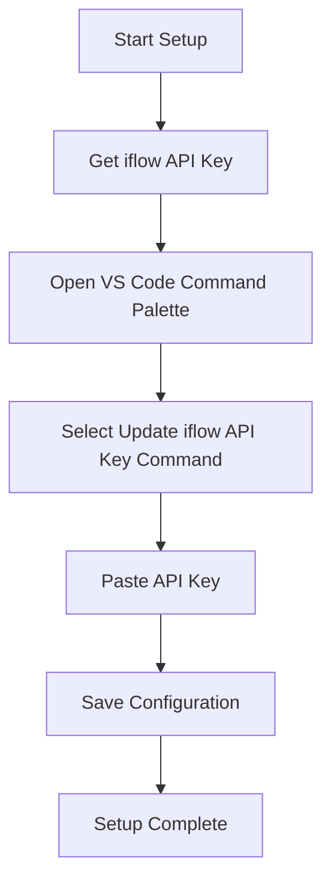
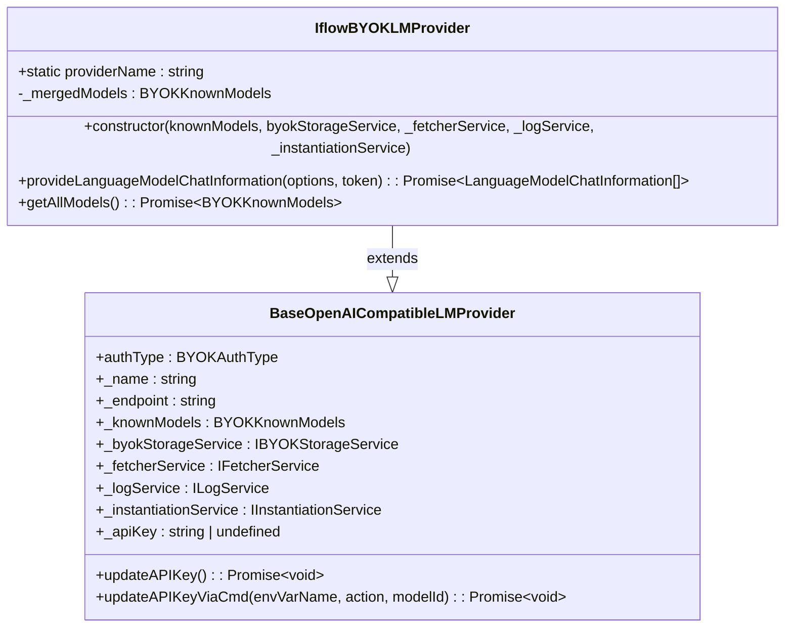
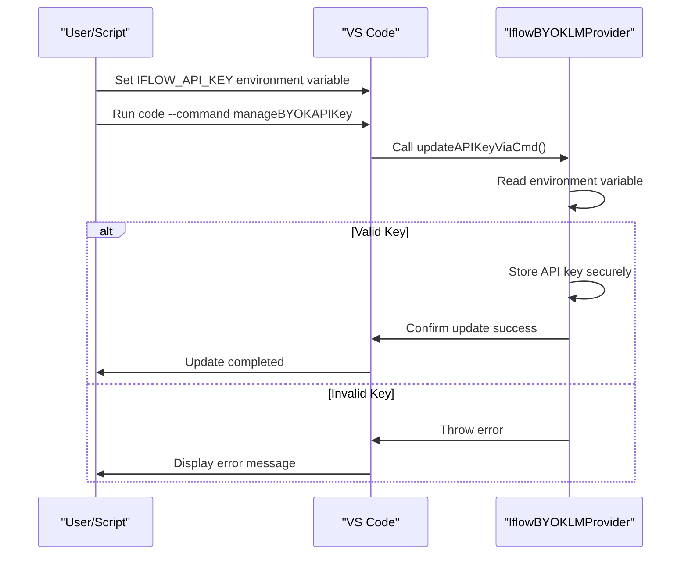

# iflow Setup Guide

<cite>
**Referenced Files in This Document**   
- [iflow-setup.md](file://docs/iflow-setup.md)
- [package.json](file://package.json)
- [iflowProvider.ts](file://src/extension/byok/vscode-node/iflowProvider.ts)
- [baseOpenAICompatibleProvider.ts](file://src/extension/byok/vscode-node/baseOpenAICompatibleProvider.ts)
- [byokContribution.ts](file://src/extension/byok/vscode-node/byokContribution.ts)
</cite>

## Table of Contents
1. [Introduction](#introduction)
2. [Prerequisites](#prerequisites)
3. [Initial Setup](#initial-setup)
4. [Using iflow Models](#using-iflow-models)
5. [Weekly API Key Update](#weekly-api-key-update)
6. [Programmatic API Key Update](#programmatic-api-key-update)
7. [Troubleshooting](#troubleshooting)
8. [Security Notes](#security-notes)
9. [Support and Resources](#support-and-resources)

## Introduction

This guide provides comprehensive instructions for setting up and configuring iflow as a Bring Your Own Key (BYOK) provider in GitHub Copilot. iflow is an OpenAI-compatible API provider that requires weekly API key rotation to maintain access to its AI models. This documentation covers the complete setup process, including initial configuration, model usage, key management, and troubleshooting.

The integration allows users to leverage iflow's advanced language models such as Qwen3-Coder and kimi-k2-0905 directly within the GitHub Copilot environment in VS Code. The setup process is designed to be straightforward, with both manual and programmatic configuration options available.

**Section sources**
- [iflow-setup.md](file://docs/iflow-setup.md#L1-L133)

## Prerequisites

Before configuring iflow with GitHub Copilot, ensure you have the following prerequisites:

- **GitHub Copilot extension** installed in VS Code
- **Active iflow account** with API access permissions
- **Valid iflow API key** generated from your iflow dashboard

The GitHub Copilot Chat extension must be properly installed and activated in your VS Code environment. Your iflow account should have active API access, which can typically be verified and managed through the iflow dashboard at [https://apis.iflow.cn](https://apis.iflow.cn). Once logged in, navigate to your API settings or dashboard to generate or access your API key.

**Section sources**
- [iflow-setup.md](file://docs/iflow-setup.md#L9-L14)

## Initial Setup

### Step 1: Get Your iflow API Key

To begin the setup process, obtain your iflow API key by following these steps:

1. Log in to your iflow account at [https://apis.iflow.cn](https://apis.iflow.cn)
2. Navigate to your API settings or dashboard section
3. Generate a new API key or copy an existing one
4. Securely store the API key, as it will need to be updated weekly

**Important**: Save your API key securely, as you will need to update it on a weekly basis to maintain uninterrupted service.

### Step 2: Configure iflow in VS Code

After obtaining your API key, configure iflow in VS Code using the following procedure:

1. Open the Command Palette:
   - **Windows/Linux**: Press `Ctrl+Shift+P`
   - **macOS**: Press `Cmd+Shift+P`

2. Type and select the command: `GitHub Copilot: Update iflow API Key`

3. In the input box that appears:
   - Paste your iflow API key
   - Press `Enter` to save the configuration

Once completed, your iflow provider will be configured and ready for use within GitHub Copilot.



**Diagram sources**
- [iflow-setup.md](file://docs/iflow-setup.md#L17-L37)
- [baseOpenAICompatibleProvider.ts](file://src/extension/byok/vscode-node/baseOpenAICompatibleProvider.ts#L112-L136)

**Section sources**
- [iflow-setup.md](file://docs/iflow-setup.md#L17-L37)
- [baseOpenAICompatibleProvider.ts](file://src/extension/byok/vscode-node/baseOpenAICompatibleProvider.ts#L112-L136)

## Using iflow Models

Once configured, iflow models will be available in the GitHub Copilot model selector. The available models include:

- **Qwen3-Coder**: Advanced coding model with 256K context window
- **kimi-k2-0905**: General-purpose model with vision support

To use an iflow model:

1. Open GitHub Copilot Chat in VS Code
2. Click on the model selector dropdown
3. Choose your preferred iflow model from the list
4. Begin your coding session with the selected model

The models are automatically registered through the `IflowBYOKLMProvider` class, which handles the provider initialization and model availability. The provider is registered with a base URL of `https://apis.iflow.cn/v1` and includes default model configurations that can be overridden by CDN-provided models.



**Diagram sources**
- [iflowProvider.ts](file://src/extension/byok/vscode-node/iflowProvider.ts#L31-L103)
- [baseOpenAICompatibleProvider.ts](file://src/extension/byok/vscode-node/baseOpenAICompatibleProvider.ts)

**Section sources**
- [iflow-setup.md](file://docs/iflow-setup.md#L38-L51)
- [iflowProvider.ts](file://src/extension/byok/vscode-node/iflowProvider.ts#L14-L30)

## Weekly API Key Update

**Important**: iflow requires weekly API key rotation to maintain service access.

### Quick Update Process

To update your API key:

1. Obtain a new API key from your iflow account
2. Open the VS Code Command Palette (`Ctrl+Shift+P` or `Cmd+Shift+P`)
3. Type: `GitHub Copilot: Update iflow API Key`
4. Paste your new API key into the input box
5. Press `Enter` to save

The update process takes less than 10 seconds to complete and ensures uninterrupted access to iflow services.

### Setting a Reminder

To prevent service interruption due to expired keys:

- Set a recurring weekly calendar reminder for key updates
- Choose a consistent day for updates (e.g., every Monday)
- Bookmark the iflow dashboard for quick access when generating new keys

The key update functionality is implemented in the `BaseOpenAICompatibleLMProvider` class, which provides the `updateAPIKey()` method to handle the key update process through the VS Code UI.

**Section sources**
- [iflow-setup.md](file://docs/iflow-setup.md#L52-L73)
- [baseOpenAICompatibleProvider.ts](file://src/extension/byok/vscode-node/baseOpenAICompatibleProvider.ts#L112-L136)

## Programmatic API Key Update

For automation or CI/CD environments, you can update the API key programmatically using command-line tools.

### Environment Variable Method

Set your API key as an environment variable and update via command:

```bash
# Set your API key as an environment variable
export IFLOW_API_KEY="your-new-api-key-here"

# Update via command
code --command github.copilot.chat.manageBYOKAPIKey iflow IFLOW_API_KEY update
```

### Command-Line Interface

The programmatic update is handled by the `updateAPIKeyViaCmd()` method, which supports both updating and removing API keys:

```typescript
async updateAPIKeyViaCmd(envVarName: string, action: 'update' | 'remove' = 'update', modelId?: string): Promise<void>
```

This method checks for the environment variable, validates its presence, and either stores a new API key or removes an existing one based on the specified action.



**Diagram sources**
- [baseOpenAICompatibleProvider.ts](file://src/extension/byok/vscode-node/baseOpenAICompatibleProvider.ts#L138-L158)

**Section sources**
- [iflow-setup.md](file://docs/iflow-setup.md#L74-L84)
- [baseOpenAICompatibleProvider.ts](file://src/extension/byok/vscode-node/baseOpenAICompatibleProvider.ts#L138-L158)

## Troubleshooting

### API Key Not Working

If you encounter authentication errors:

1. Verify your API key is correct and has not expired
2. Check if it has been more than 7 days since your last update
3. Obtain a fresh API key from iflow and update it in VS Code

### Models Not Appearing

If iflow models don't appear in the model selector:

1. Confirm you have entered a valid API key
2. Restart VS Code to refresh the extension state
3. Check the Output panel (View → Output → GitHub Copilot) for any error messages

### Removing iflow Configuration

To remove your iflow API key configuration:

1. Open the Command Palette in VS Code
2. Type: `GitHub Copilot: Update iflow API Key`
3. Leave the input box empty
4. Press `Enter` to delete the stored API key

The provider registration process in `byokContribution.ts` includes error handling to log any issues during iflow provider registration, which can help diagnose configuration problems.

**Section sources**
- [iflow-setup.md](file://docs/iflow-setup.md#L86-L113)
- [byokContribution.ts](file://src/extension/byok/vscode-node/byokContribution.ts#L116-L124)

## Security Notes

The iflow integration follows secure practices for API key management:

- API keys are stored securely using VS Code's built-in secrets storage
- Keys are encrypted and never exposed in plain text
- Each workspace can have its own API key configuration
- API keys are only transmitted to the iflow API endpoint

The `IBYOKStorageService` handles secure storage operations, ensuring that API keys are properly encrypted and protected. The system is designed to minimize security risks while providing convenient access to iflow's AI models.

**Section sources**
- [iflow-setup.md](file://docs/iflow-setup.md#L115-L121)

## Support and Resources

For assistance with iflow integration:

- **iflow API or account issues**: Contact iflow support directly
- **GitHub Copilot integration issues**: Refer to the [main documentation](../README.md) or file an issue in the repository

Additional resources:
- [iflow Documentation](https://apis.iflow.cn/docs)
- [GitHub Copilot BYOK Overview](./byok-overview.md)
- Official GitHub Copilot resources and tutorials

**Section sources**
- [iflow-setup.md](file://docs/iflow-setup.md#L123-L133)