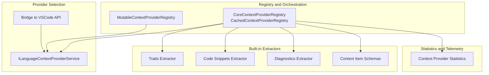
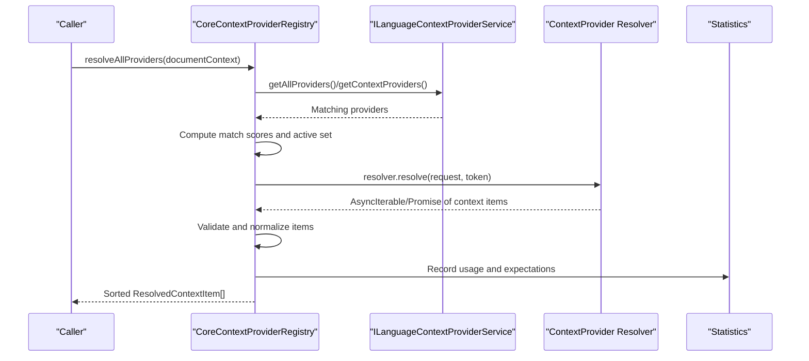
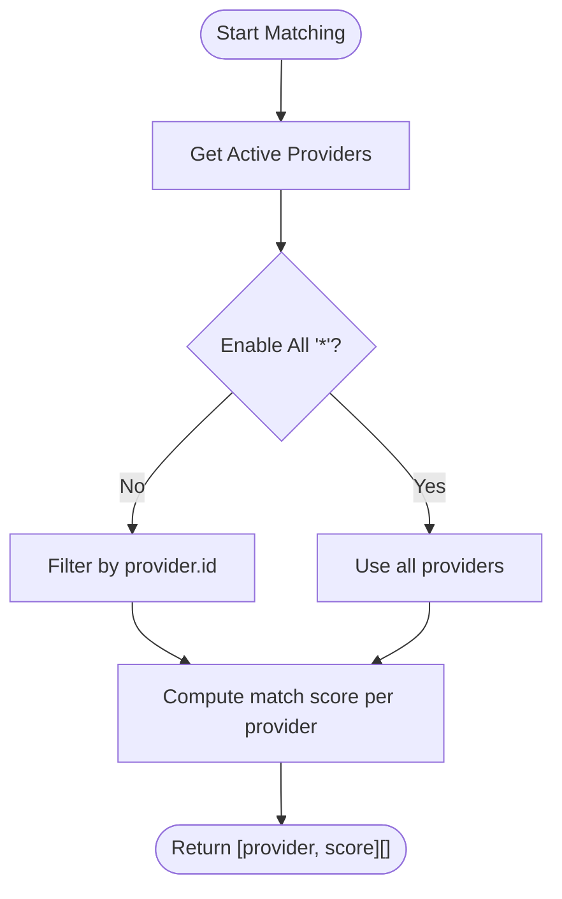
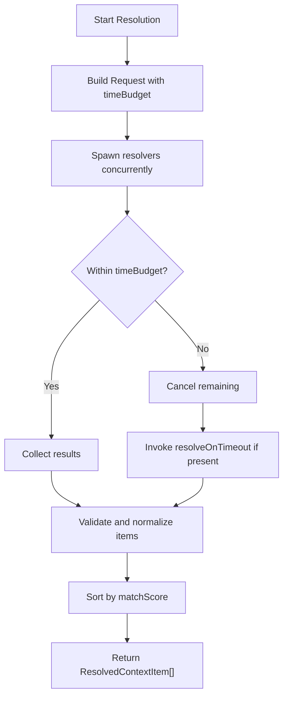
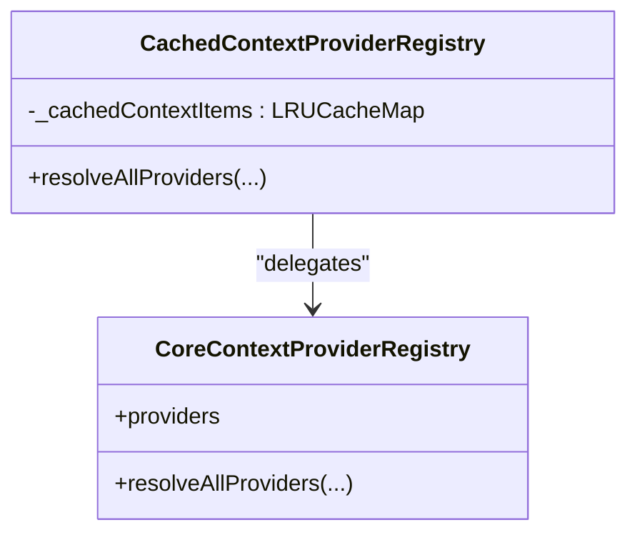
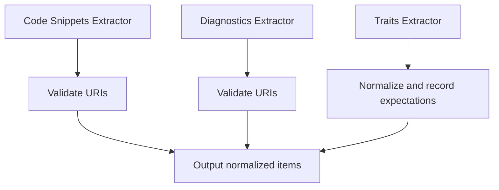
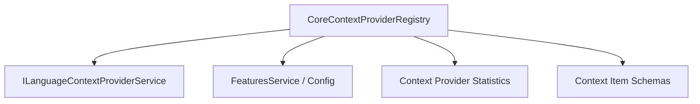

# Context Providers

<cite>
**Referenced Files in This Document**
- [contextProviderRegistry.ts](file://src/extension/completions-core/vscode-node/lib/src/prompt/contextProviderRegistry.ts)
- [contextItemSchemas.ts](file://src/extension/completions-core/vscode-node/lib/src/prompt/contextProviders/contextItemSchemas.ts)
- [codeSnippets.ts](file://src/extension/completions-core/vscode-node/lib/src/prompt/contextProviders/codeSnippets.ts)
- [diagnostics.ts](file://src/extension/completions-core/vscode-node/lib/src/prompt/contextProviders/diagnostics.ts)
- [traits.ts](file://src/extension/completions-core/vscode-node/lib/src/prompt/contextProviders/traits.ts)
- [languageContextProviderService.ts](file://src/platform/languageContextProvider/common/languageContextProviderService.ts)
- [chatSessionContextProvider.ts](file://src/extension/chatSessionContext/vscode-node/chatSessionContextProvider.ts)
- [languageContextProviderService.ts](file://src/extension/languageContextProvider/vscode-node/languageContextProviderService.ts)
- [contextProviderApiV1.ts](file://src/extension/completions-core/vscode-node/types/src/contextProviderApiV1.ts)
- [contextProviderBridge.ts](file://src/extension/completions-core/vscode-node/lib/src/prompt/components/contextProviderBridge.ts)
- [contextProviderRegistryCpp.ts](file://src/extension/completions-core/vscode-node/lib/src/prompt/contextProviderRegistryCpp.ts)
- [contextProviderRegistryCSharp.ts](file://src/extension/completions-core/vscode-node/lib/src/prompt/contextProviderRegistryCSharp.ts)
- [contextProviderRegistryMultiLanguage.ts](file://src/extension/completions-core/vscode-node/lib/src/prompt/contextProviderRegistryMultiLanguage.ts)
- [contextProviderRegistryTs.ts](file://src/extension/completions-core/vscode-node/lib/src/prompt/contextProviderRegistryTs.ts)
- [contextProviderStatistics.ts](file://src/extension/completions-core/vscode-node/lib/src/prompt/contextProviderStatistics.ts)
- [contextProviderRegistry.test.ts](file://src/extension/completions-core/vscode-node/lib/src/prompt/test/contextProviderRegistry.test.ts)
- [contextProviderBridge.test.ts](file://src/extension/completions-core/vscode-node/lib/src/prompt/components/test/contextProviderBridge.test.ts)
- [claudeChatSessionContentProvider.ts](file://src/extension/chatSessions/vscode-node/claudeChatSessionContentProvider.ts)
- [context.ts](file://src/extension/chatSessions/copilotcli/vscode-node/commands/context.ts)
- [context.spec.ts](file://src/extension/chatSessions/copilotcli/vscode-node/test/context.spec.ts)
</cite>

## Table of Contents
1. [Introduction](#introduction)
2. [Project Structure](#project-structure)
3. [Core Components](#core-components)
4. [Architecture Overview](#architecture-overview)
5. [Detailed Component Analysis](#detailed-component-analysis)
6. [Dependency Analysis](#dependency-analysis)
7. [Performance Considerations](#performance-considerations)
8. [Troubleshooting Guide](#troubleshooting-guide)
9. [Conclusion](#conclusion)
10. [Appendices](#appendices)

## Introduction
This document explains the context providers system used to gather and contribute contextual information for AI-assisted authoring experiences. It covers:
- Context detection architecture and provider registration
- Workspace context gathering and project-specific information extraction
- Types of context: file context, selection context, workspace context, and custom providers
- Context resolution pipeline, caching, and performance optimizations
- Implementation examples for custom providers and external integrations
- VSCode integration patterns and provider registration
- Best practices, security, privacy, filtering, relevance scoring, and prioritization

## Project Structure
The context providers system spans several modules:
- Registry and orchestration of providers
- Validation and schema enforcement for context items
- Built-in context extractors (traits, code snippets, diagnostics)
- Language-level provider service and bridge for VSCode
- Statistics and telemetry hooks
- Session-based and workspace-aware providers

**Diagram sources**
- [contextProviderRegistry.ts](file://src/extension/completions-core/vscode-node/lib/src/prompt/contextProviderRegistry.ts#L109-L337)
- [languageContextProviderService.ts](file://src/platform/languageContextProvider/common/languageContextProviderService.ts#L18-L30)
- [languageContextProviderService.ts](file://src/extension/languageContextProvider/vscode-node/languageContextProviderService.ts#L50-L76)
- [contextItemSchemas.ts](file://src/extension/completions-core/vscode-node/lib/src/prompt/contextProviders/contextItemSchemas.ts#L119-L202)
- [traits.ts](file://src/extension/completions-core/vscode-node/lib/src/prompt/contextProviders/traits.ts#L13-L37)
- [codeSnippets.ts](file://src/extension/completions-core/vscode-node/lib/src/prompt/contextProviders/codeSnippets.ts#L20-L69)
- [diagnostics.ts](file://src/extension/completions-core/vscode-node/lib/src/prompt/contextProviders/diagnostics.ts#L15-L70)
- [contextProviderStatistics.ts](file://src/extension/completions-core/vscode-node/lib/src/prompt/contextProviderStatistics.ts)

**Section sources**
- [contextProviderRegistry.ts](file://src/extension/completions-core/vscode-node/lib/src/prompt/contextProviderRegistry.ts#L1-L593)
- [languageContextProviderService.ts](file://src/platform/languageContextProvider/common/languageContextProviderService.ts#L1-L31)

## Core Components
- ContextProvider registry: orchestrates provider discovery, matching, resolution, and aggregation
- Provider selection: language-level service that selects active providers per document
- Schema enforcement: validates and normalizes context items
- Built-in extractors: traits, code snippets, diagnostics
- Statistics and telemetry: tracks usage and expectations per provider
- VSCode bridge: exposes providers via the Copilot API surface

Key responsibilities:
- Match providers against document context and active configuration
- Enforce time budgets and cancellation
- Validate and normalize context items
- Aggregate and sort results by match quality
- Cache results per completion for performance

**Section sources**
- [contextProviderRegistry.ts](file://src/extension/completions-core/vscode-node/lib/src/prompt/contextProviderRegistry.ts#L109-L337)
- [contextItemSchemas.ts](file://src/extension/completions-core/vscode-node/lib/src/prompt/contextProviders/contextItemSchemas.ts#L119-L202)
- [traits.ts](file://src/extension/completions-core/vscode-node/lib/src/prompt/contextProviders/traits.ts#L13-L37)
- [codeSnippets.ts](file://src/extension/completions-core/vscode-node/lib/src/prompt/contextProviders/codeSnippets.ts#L20-L69)
- [diagnostics.ts](file://src/extension/completions-core/vscode-node/lib/src/prompt/contextProviders/diagnostics.ts#L15-L70)
- [languageContextProviderService.ts](file://src/platform/languageContextProvider/common/languageContextProviderService.ts#L18-L30)

## Architecture Overview
The system resolves context across multiple providers in a controlled pipeline:
1. Provider discovery and selection
2. Matching against document context and active configuration
3. Concurrent resolution with time budget and cancellation
4. Schema validation and normalization
5. Aggregation and sorting by match score
6. Optional fallback during timeout
7. Statistics and telemetry

**Diagram sources**
- [contextProviderRegistry.ts](file://src/extension/completions-core/vscode-node/lib/src/prompt/contextProviderRegistry.ts#L137-L315)
- [languageContextProviderService.ts](file://src/platform/languageContextProvider/common/languageContextProviderService.ts#L23-L29)
- [contextProviderBridge.ts](file://src/extension/completions-core/vscode-node/lib/src/prompt/components/contextProviderBridge.ts)

## Detailed Component Analysis

### Context Detection and Provider Matching
- Provider selection uses a language-level service to discover providers targeting Completions or other contexts.
- Matching computes a score per provider based on the document selector and active configuration.
- Active providers are filtered by experiment settings, configuration, and defaults.

**Diagram sources**
- [contextProviderRegistry.ts](file://src/extension/completions-core/vscode-node/lib/src/prompt/contextProviderRegistry.ts#L317-L336)
- [contextProviderRegistry.ts](file://src/extension/completions-core/vscode-node/lib/src/prompt/contextProviderRegistry.ts#L494-L508)

**Section sources**
- [contextProviderRegistry.ts](file://src/extension/completions-core/vscode-node/lib/src/prompt/contextProviderRegistry.ts#L317-L336)
- [contextProviderRegistry.ts](file://src/extension/completions-core/vscode-node/lib/src/prompt/contextProviderRegistry.ts#L494-L508)

### Context Resolution Pipeline
- Time budgeting: a configurable or feature-driven budget limits total resolution time; a timeout cancels remaining providers.
- Concurrency: providers resolve concurrently; results are collected and merged.
- Fallback: if providers exceed budget, optional resolveOnTimeout can supply partial items.
- Validation: items are validated against schemas; invalid items are dropped and logged; IDs are normalized.

**Diagram sources**
- [contextProviderRegistry.ts](file://src/extension/completions-core/vscode-node/lib/src/prompt/contextProviderRegistry.ts#L208-L254)
- [contextProviderRegistry.ts](file://src/extension/completions-core/vscode-node/lib/src/prompt/contextProviderRegistry.ts#L273-L290)
- [contextItemSchemas.ts](file://src/extension/completions-core/vscode-node/lib/src/prompt/contextProviders/contextItemSchemas.ts#L142-L161)

**Section sources**
- [contextProviderRegistry.ts](file://src/extension/completions-core/vscode-node/lib/src/prompt/contextProviderRegistry.ts#L208-L254)
- [contextProviderRegistry.ts](file://src/extension/completions-core/vscode-node/lib/src/prompt/contextProviderRegistry.ts#L273-L290)
- [contextItemSchemas.ts](file://src/extension/completions-core/vscode-node/lib/src/prompt/contextProviders/contextItemSchemas.ts#L142-L161)

### Caching Mechanisms and Performance Optimizations
- Completion-scoped cache: results are cached per completionId for the lifetime of a single completion request.
- LRU cache with small capacity to limit memory footprint.
- Time budget enforcement prevents long-running resolutions.
- Early cancellation short-circuits slow providers.

**Diagram sources**
- [contextProviderRegistry.ts](file://src/extension/completions-core/vscode-node/lib/src/prompt/contextProviderRegistry.ts#L375-L432)

**Section sources**
- [contextProviderRegistry.ts](file://src/extension/completions-core/vscode-node/lib/src/prompt/contextProviderRegistry.ts#L375-L432)

### Context Types and Extraction
- Traits: metadata about the code or environment (e.g., framework, language version). Extracted and sorted by importance; expectations recorded for telemetry.
- Code snippets: file excerpts with URIs; validated for document existence and relevance; relative paths optionally attached.
- Diagnostics: structured diagnostics per URI; validated and filtered; sorted by importance.

**Diagram sources**
- [traits.ts](file://src/extension/completions-core/vscode-node/lib/src/prompt/contextProviders/traits.ts#L13-L37)
- [codeSnippets.ts](file://src/extension/completions-core/vscode-node/lib/src/prompt/contextProviders/codeSnippets.ts#L20-L69)
- [diagnostics.ts](file://src/extension/completions-core/vscode-node/lib/src/prompt/contextProviders/diagnostics.ts#L15-L70)

**Section sources**
- [traits.ts](file://src/extension/completions-core/vscode-node/lib/src/prompt/contextProviders/traits.ts#L13-L37)
- [codeSnippets.ts](file://src/extension/completions-core/vscode-node/lib/src/prompt/contextProviders/codeSnippets.ts#L20-L69)
- [diagnostics.ts](file://src/extension/completions-core/vscode-node/lib/src/prompt/contextProviders/diagnostics.ts#L15-L70)

### Schema Validation and Normalization
- Validates presence and types of required fields (importance, origin, id).
- Ensures IDs are valid and unique; generates replacements on conflict.
- Filters unsupported item types and logs invalid entries.

**Section sources**
- [contextItemSchemas.ts](file://src/extension/completions-core/vscode-node/lib/src/prompt/contextProviders/contextItemSchemas.ts#L21-L95)
- [contextItemSchemas.ts](file://src/extension/completions-core/vscode-node/lib/src/prompt/contextProviders/contextItemSchemas.ts#L177-L201)

### Workspace Context Gathering and Project-Specific Information
- Workspace folders and selection inform session context providers.
- Session context provider registers for general and language-specific selectors.
- Folder selection and MRU fallback support multi-root and empty workspaces.

**Section sources**
- [claudeChatSessionContentProvider.ts](file://src/extension/chatSessions/vscode-node/claudeChatSessionContentProvider.ts#L115-L158)
- [chatSessionContextProvider.ts](file://src/extension/chatSessionContext/vscode-node/chatSessionContextProvider.ts#L83-L120)

### Custom Context Providers and External Integrations
- Providers register via the language-level service with a unique id, selector, and resolver.
- Resolver supports sync, async iterable, or promise return; optional resolveOnTimeout for fallback.
- Bridge handles conversion and concurrent execution across providers.

Implementation examples (paths):
- Provider registration and resolver contract: [contextProviderApiV1.ts](file://src/extension/completions-core/vscode-node/types/src/contextProviderApiV1.ts#L55-L68)
- Provider bridge and concurrency: [contextProviderBridge.ts](file://src/extension/completions-core/vscode-node/lib/src/prompt/components/contextProviderBridge.ts)
- Language-level registration: [languageContextProviderService.ts](file://src/platform/languageContextProvider/common/languageContextProviderService.ts#L21-L25)
- VSCode-side registration: [languageContextProviderService.ts](file://src/extension/languageContextProvider/vscode-node/languageContextProviderService.ts#L50-L76)

**Section sources**
- [contextProviderApiV1.ts](file://src/extension/completions-core/vscode-node/types/src/contextProviderApiV1.ts#L55-L68)
- [contextProviderBridge.ts](file://src/extension/completions-core/vscode-node/lib/src/prompt/components/contextProviderBridge.ts)
- [languageContextProviderService.ts](file://src/platform/languageContextProvider/common/languageContextProviderService.ts#L21-L25)
- [languageContextProviderService.ts](file://src/extension/languageContextProvider/vscode-node/languageContextProviderService.ts#L50-L76)

### Context Contribution System and Registration
- Providers are registered with targets (e.g., Completions, NES).
- The registry composes built-in and mutable providers.
- Tests validate registration and resolution behavior.

Registration and tests:
- Mutable registry: [contextProviderRegistry.ts](file://src/extension/completions-core/vscode-node/lib/src/prompt/contextProviderRegistry.ts#L339-L373)
- Provider bridge tests: [contextProviderBridge.test.ts](file://src/extension/completions-core/vscode-node/lib/src/prompt/components/test/contextProviderBridge.test.ts#L112-L136)
- Registry tests: [contextProviderRegistry.test.ts](file://src/extension/completions-core/vscode-node/lib/src/prompt/test/contextProviderRegistry.test.ts#L1561-L1582)

**Section sources**
- [contextProviderRegistry.ts](file://src/extension/completions-core/vscode-node/lib/src/prompt/contextProviderRegistry.ts#L339-L373)
- [contextProviderBridge.test.ts](file://src/extension/completions-core/vscode-node/lib/src/prompt/components/test/contextProviderBridge.test.ts#L112-L136)
- [contextProviderRegistry.test.ts](file://src/extension/completions-core/vscode-node/lib/src/prompt/test/contextProviderRegistry.test.ts#L1561-L1582)

### Filtering, Relevance Scoring, and Prioritization
- Sorting by matchScore ensures higher-quality providers appear first.
- Default diagnostic settings allow tuning warning inclusion and limits.
- Statistics track usage and expectations to guide future decisions.

**Section sources**
- [contextProviderRegistry.ts](file://src/extension/completions-core/vscode-node/lib/src/prompt/contextProviderRegistry.ts#L313-L315)
- [contextProviderRegistry.ts](file://src/extension/completions-core/vscode-node/lib/src/prompt/contextProviderRegistry.ts#L544-L583)

## Dependency Analysis
The registry depends on:
- Language-level provider service for discovery and selection
- Feature flags and configuration for active providers and budgets
- Statistics service for usage tracking
- Schema validators for normalization

**Diagram sources**
- [contextProviderRegistry.ts](file://src/extension/completions-core/vscode-node/lib/src/prompt/contextProviderRegistry.ts#L112-L119)
- [contextProviderRegistry.ts](file://src/extension/completions-core/vscode-node/lib/src/prompt/contextProviderRegistry.ts#L535-L542)

**Section sources**
- [contextProviderRegistry.ts](file://src/extension/completions-core/vscode-node/lib/src/prompt/contextProviderRegistry.ts#L112-L119)
- [contextProviderRegistry.ts](file://src/extension/completions-core/vscode-node/lib/src/prompt/contextProviderRegistry.ts#L535-L542)

## Performance Considerations
- Time budgeting: enforce a hard cap to prevent long waits; disable for debugging.
- Concurrency: resolve multiple providers in parallel; cancel on timeout.
- Caching: reuse results per completion to avoid recomputation.
- Validation batching: validate URIs in parallel to reduce overhead.
- Sorting: minimal cost due to small provider sets; keep sorted by matchScore.

[No sources needed since this section provides general guidance]

## Troubleshooting Guide
Common issues and remedies:
- Providers not resolving: check active provider lists and document selector matches.
- Slow resolution: adjust time budget or disable heavy providers.
- Invalid context items: inspect logs for schema violations; ensure IDs are unique and valid.
- Timeout behavior: implement resolveOnTimeout to return partial results.

**Section sources**
- [contextProviderRegistry.ts](file://src/extension/completions-core/vscode-node/lib/src/prompt/contextProviderRegistry.ts#L273-L290)
- [contextItemSchemas.ts](file://src/extension/completions-core/vscode-node/lib/src/prompt/contextProviders/contextItemSchemas.ts#L177-L201)

## Conclusion
The context providers system offers a robust, extensible mechanism to gather, validate, and prioritize contextual information for AI-assisted authoring. Its design emphasizes performance, reliability, and configurability, while enabling custom providers and external integrations through a clear API and bridge.

[No sources needed since this section summarizes without analyzing specific files]

## Appendices

### Best Practices for Context Providers
- Keep IDs unique and valid; rely on normalization if missing.
- Respect time budgets; implement resolveOnTimeout for fallback.
- Validate URIs and document states before emitting content.
- Use matchScore and importance to guide prioritization.
- Record expectations for diagnostics and traits to improve telemetry.

**Section sources**
- [contextItemSchemas.ts](file://src/extension/completions-core/vscode-node/lib/src/prompt/contextProviders/contextItemSchemas.ts#L177-L201)
- [diagnostics.ts](file://src/extension/completions-core/vscode-node/lib/src/prompt/contextProviders/diagnostics.ts#L72-L78)
- [traits.ts](file://src/extension/completions-core/vscode-node/lib/src/prompt/contextProviders/traits.ts#L31-L37)

### Security and Privacy Considerations
- Validate and sanitize all emitted content; avoid sensitive data.
- Respect workspace trust and MRU selections for folder context.
- Limit caching scope to completion lifetimes to minimize persistence.
- Log errors and invalid items without exposing secrets.

**Section sources**
- [claudeChatSessionContentProvider.ts](file://src/extension/chatSessions/vscode-node/claudeChatSessionContentProvider.ts#L115-L158)
- [contextProviderRegistry.ts](file://src/extension/completions-core/vscode-node/lib/src/prompt/contextProviderRegistry.ts#L411-L431)