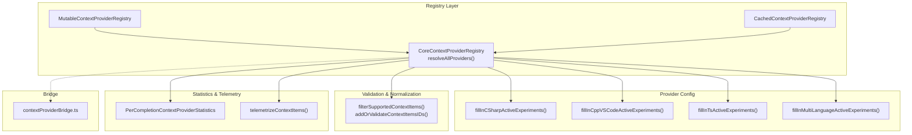
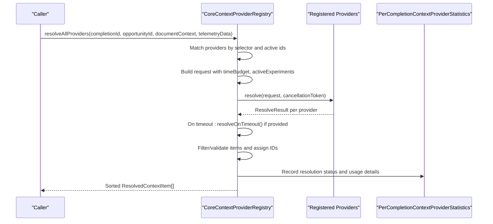
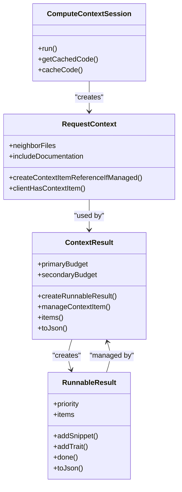
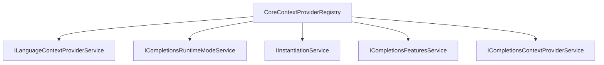

# Context Resolution Pipeline

<cite>
**Referenced Files in This Document**
- [contextProviderRegistry.ts](file://src/extension/completions-core/vscode-node/lib/src/prompt/contextProviderRegistry.ts)
- [contextProviderRegistryMultiLanguage.ts](file://src/extension/completions-core/vscode-node/lib/src/prompt/contextProviderRegistryMultiLanguage.ts)
- [contextProviderRegistryCSharp.ts](file://src/extension/completions-core/vscode-node/lib/src/prompt/contextProviderRegistryCSharp.ts)
- [contextProviderRegistryCpp.ts](file://src/extension/completions-core/vscode-node/lib/src/prompt/contextProviderRegistryCpp.ts)
- [contextProviderRegistryTs.ts](file://src/extension/completions-core/vscode-node/lib/src/prompt/contextProviderRegistryTs.ts)
- [contextItemSchemas.ts](file://src/extension/completions-core/vscode-node/lib/src/prompt/contextProviders/contextItemSchemas.ts)
- [contextProviderStatistics.ts](file://src/extension/completions-core/vscode-node/lib/src/prompt/contextProviderStatistics.ts)
- [contextProviderBridge.ts](file://src/extension/completions-core/vscode-node/lib/src/prompt/components/contextProviderBridge.ts)
- [contextProviderBridge.test.ts](file://src/extension/completions-core/vscode-node/lib/src/prompt/components/test/contextProviderBridge.test.ts)
- [contextProviderRegistry.test.ts](file://src/extension/completions-core/vscode-node/lib/src/prompt/test/contextProviderRegistry.test.ts)
- [contextProviderRegistryMultiLanguage.test.ts](file://src/extension/completions-core/vscode-node/lib/src/prompt/test/contextProviderRegistryMultiLanguage.test.ts)
- [contextProviderRegistryTs.test.ts](file://src/extension/completions-core/vscode-node/lib/src/prompt/test/contextProviderRegistryTs.test.ts)
- [contextProviderStatistics.test.ts](file://src/extension/completions-core/vscode-node/lib/src/prompt/test/contextProviderStatistics.test.ts)
- [contextProviderTelemetry.ts](file://src/extension/completions-core/vscode-node/lib/src/prompt/test/contextProviderTelemetry.ts)
- [contextProviderApiV1.ts](file://src/extension/completions-core/vscode-node/types/src/contextProviderApiV1.ts)
- [contextProvider.ts](file://src/extension/typescriptContext/serverPlugin/src/common/contextProvider.ts)
</cite>

## Table of Contents
1. [Introduction](#introduction)
2. [Project Structure](#project-structure)
3. [Core Components](#core-components)
4. [Architecture Overview](#architecture-overview)
5. [Detailed Component Analysis](#detailed-component-analysis)
6. [Dependency Analysis](#dependency-analysis)
7. [Performance Considerations](#performance-considerations)
8. [Troubleshooting Guide](#troubleshooting-guide)
9. [Conclusion](#conclusion)
10. [Appendices](#appendices)

## Introduction
This document describes the context resolution pipeline architecture used to collect, process, and combine context from multiple sources into unified context information for AI-assisted authoring experiences. It explains the resolution order, priority and conflict strategies, aggregation and normalization, caching and invalidation, and performance optimizations. It also provides guidance for extending the pipeline and adding new context sources.

## Project Structure
The context resolution pipeline spans several modules:
- Registry and orchestration: selects providers, enforces timeouts, merges results, validates schemas, assigns IDs, and caches per completion.
- Provider-specific experiment configuration: injects active experiments and parameters for C#, C++, TypeScript, and multi-language providers.
- Schema validation and normalization: filters unsupported item types, validates IDs, and ensures consistent typing.
- Statistics and telemetry: tracks usage, resolution status, and usage details per provider and completion.
- TypeScript context server plugin: advanced context computation with budgets, caching scopes, and runnable results.

**Diagram sources**
- [contextProviderRegistry.ts](file://src/extension/completions-core/vscode-node/lib/src/prompt/contextProviderRegistry.ts#L137-L315)
- [contextProviderRegistryCSharp.ts](file://src/extension/completions-core/vscode-node/lib/src/prompt/contextProviderRegistryCSharp.ts#L16-L39)
- [contextProviderRegistryCpp.ts](file://src/extension/completions-core/vscode-node/lib/src/prompt/contextProviderRegistryCpp.ts#L26-L62)
- [contextProviderRegistryTs.ts](file://src/extension/completions-core/vscode-node/lib/src/prompt/contextProviderRegistryTs.ts#L18-L49)
- [contextProviderRegistryMultiLanguage.ts](file://src/extension/completions-core/vscode-node/lib/src/prompt/contextProviderRegistryMultiLanguage.ts#L45-L107)
- [contextItemSchemas.ts](file://src/extension/completions-core/vscode-node/lib/src/prompt/contextProviders/contextItemSchemas.ts#L142-L201)
- [contextProviderStatistics.ts](file://src/extension/completions-core/vscode-node/lib/src/prompt/contextProviderStatistics.ts#L35-L191)
- [contextProviderBridge.ts](file://src/extension/completions-core/vscode-node/lib/src/prompt/components/contextProviderBridge.ts)

**Section sources**
- [contextProviderRegistry.ts](file://src/extension/completions-core/vscode-node/lib/src/prompt/contextProviderRegistry.ts#L109-L337)
- [contextProviderRegistryMultiLanguage.ts](file://src/extension/completions-core/vscode-node/lib/src/prompt/contextProviderRegistryMultiLanguage.ts#L45-L107)
- [contextProviderRegistryCSharp.ts](file://src/extension/completions-core/vscode-node/lib/src/prompt/contextProviderRegistryCSharp.ts#L16-L39)
- [contextProviderRegistryCpp.ts](file://src/extension/completions-core/vscode-node/lib/src/prompt/contextProviderRegistryCpp.ts#L26-L62)
- [contextProviderRegistryTs.ts](file://src/extension/completions-core/vscode-node/lib/src/prompt/contextProviderRegistryTs.ts#L18-L49)
- [contextItemSchemas.ts](file://src/extension/completions-core/vscode-node/lib/src/prompt/contextProviders/contextItemSchemas.ts#L142-L201)
- [contextProviderStatistics.ts](file://src/extension/completions-core/vscode-node/lib/src/prompt/contextProviderStatistics.ts#L35-L191)

## Core Components
- CoreContextProviderRegistry: orchestrates provider selection, cancellation, timeouts, parallel resolution, fallback on timeout, schema filtering, ID assignment, sorting by match score, and statistics updates.
- MutableContextProviderRegistry: allows dynamic registration/unregistration of providers alongside the global registry.
- CachedContextProviderRegistry: LRU cache for resolved context items keyed by completionId to avoid recomputation within a single request lifecycle.
- Provider experiment injectors: populate active experiments and parameters for C#, C++, TypeScript, and multi-language providers.
- Schema validation and normalization: ensures items conform to supported types and assigns/validates IDs.
- Statistics and telemetry: tracks resolution status, usage, and usage details per provider and completion.

**Section sources**
- [contextProviderRegistry.ts](file://src/extension/completions-core/vscode-node/lib/src/prompt/contextProviderRegistry.ts#L109-L337)
- [contextProviderRegistry.ts](file://src/extension/completions-core/vscode-node/lib/src/prompt/contextProviderRegistry.ts#L375-L432)
- [contextProviderRegistryCSharp.ts](file://src/extension/completions-core/vscode-node/lib/src/prompt/contextProviderRegistryCSharp.ts#L16-L39)
- [contextProviderRegistryCpp.ts](file://src/extension/completions-core/vscode-node/lib/src/prompt/contextProviderRegistryCpp.ts#L26-L62)
- [contextProviderRegistryTs.ts](file://src/extension/completions-core/vscode-node/lib/src/prompt/contextProviderRegistryTs.ts#L18-L49)
- [contextProviderRegistryMultiLanguage.ts](file://src/extension/completions-core/vscode-node/lib/src/prompt/contextProviderRegistryMultiLanguage.ts#L45-L107)
- [contextItemSchemas.ts](file://src/extension/completions-core/vscode-node/lib/src/prompt/contextProviders/contextItemSchemas.ts#L142-L201)
- [contextProviderStatistics.ts](file://src/extension/completions-core/vscode-node/lib/src/prompt/contextProviderStatistics.ts#L35-L191)

## Architecture Overview
The pipeline resolves context in a controlled, parallelized manner with strict time budgeting and robust fallback and validation.

**Diagram sources**
- [contextProviderRegistry.ts](file://src/extension/completions-core/vscode-node/lib/src/prompt/contextProviderRegistry.ts#L137-L315)
- [contextProviderStatistics.ts](file://src/extension/completions-core/vscode-node/lib/src/prompt/contextProviderStatistics.ts#L67-L191)

## Detailed Component Analysis

### Provider Selection, Matching, and Activation
- Active provider IDs are derived from defaults, configuration, and experiments. A wildcard enables all providers.
- Providers are matched against the document context via a selector scoring function; only positive scores are resolved.
- For unmatched providers, a placeholder entry with resolution "none" is produced.

**Section sources**
- [contextProviderRegistry.ts](file://src/extension/completions-core/vscode-node/lib/src/prompt/contextProviderRegistry.ts#L317-L336)
- [contextProviderRegistry.ts](file://src/extension/completions-core/vscode-node/lib/src/prompt/contextProviderRegistry.ts#L494-L508)

### Time Budgeting, Cancellation, and Parallel Resolution
- A time budget is computed from configuration or feature service. Zero budget disables timeout for debugging.
- A CancellationTokenSource is created; when the budget expires, it cancels provider resolution.
- All provider resolutions are awaited concurrently; results are collected and mapped back to providers.

**Section sources**
- [contextProviderRegistry.ts](file://src/extension/completions-core/vscode-node/lib/src/prompt/contextProviderRegistry.ts#L208-L248)

### Fallback on Timeout and Conflict Resolution
- If a provider exceeds the time budget, its resolver may return fallback items via resolveOnTimeout.
- Items are merged; if any fallback is present, the resolution status becomes "partial".
- Errors are recorded; non-cancellation errors are logged.

**Section sources**
- [contextProviderRegistry.ts](file://src/extension/completions-core/vscode-node/lib/src/prompt/contextProviderRegistry.ts#L270-L290)
- [contextProviderRegistry.ts](file://src/extension/completions-core/vscode-node/lib/src/prompt/contextProviderRegistry.ts#L258-L268)

### Schema Filtering, Validation, and ID Normalization
- Unsupported item types are dropped; counts are logged.
- Items are validated and typed consistently.
- IDs are assigned or replaced if invalid/duplicated; logs errors for replacements.

**Section sources**
- [contextItemSchemas.ts](file://src/extension/completions-core/vscode-node/lib/src/prompt/contextProviders/contextItemSchemas.ts#L142-L201)

### Sorting and Aggregation
- Results are sorted by match score (highest first).
- Aggregation occurs at the item level; duplicates are avoided by reference reuse in downstream consumers.

**Section sources**
- [contextProviderRegistry.ts](file://src/extension/completions-core/vscode-node/lib/src/prompt/contextProviderRegistry.ts#L313-L314)
- [contextProvider.ts](file://src/extension/typescriptContext/serverPlugin/src/common/contextProvider.ts#L525-L551)

### Experiment Injection and Parameter Propagation
- Provider-specific experiments and parameters are injected for C#, C++, TypeScript, and multi-language contexts.
- Parameters are parsed from experiments or defaults and added to active experiments.

**Section sources**
- [contextProviderRegistryCSharp.ts](file://src/extension/completions-core/vscode-node/lib/src/prompt/contextProviderRegistryCSharp.ts#L16-L39)
- [contextProviderRegistryCpp.ts](file://src/extension/completions-core/vscode-node/lib/src/prompt/contextProviderRegistryCpp.ts#L26-L62)
- [contextProviderRegistryTs.ts](file://src/extension/completions-core/vscode-node/lib/src/prompt/contextProviderRegistryTs.ts#L18-L49)
- [contextProviderRegistryMultiLanguage.ts](file://src/extension/completions-core/vscode-node/lib/src/prompt/contextProviderRegistryMultiLanguage.ts#L45-L107)

### Statistics, Usage Tracking, and Telemetry
- Per-completion statistics track resolution status, usage, and usage details.
- Telemetry aggregates provider-level metrics including matched flag, resolution time, usage, and counts.

**Section sources**
- [contextProviderStatistics.ts](file://src/extension/completions-core/vscode-node/lib/src/prompt/contextProviderStatistics.ts#L67-L191)
- [contextProviderRegistry.ts](file://src/extension/completions-core/vscode-node/lib/src/prompt/contextProviderRegistry.ts#L434-L488)

### Caching Strategies and Invalidation
- CachedContextProviderRegistry caches resolved items per completionId with a small LRU cache.
- Cache is invalidated automatically after a single completion lifecycle; no cross-request sharing is implied.

**Section sources**
- [contextProviderRegistry.ts](file://src/extension/completions-core/vscode-node/lib/src/prompt/contextProviderRegistry.ts#L375-L432)

### TypeScript Context Server Plugin (Advanced Computation)
- Supports runnable results with priorities and character budgets for primary and secondary contexts.
- Provides caching scopes, reference-based reuse, and deterministic item management across client and server.
- Computes context items with cost-awareness and speculative kinds.

**Diagram sources**
- [contextProvider.ts](file://src/extension/typescriptContext/serverPlugin/src/common/contextProvider.ts#L36-L91)
- [contextProvider.ts](file://src/extension/typescriptContext/serverPlugin/src/common/contextProvider.ts#L308-L407)
- [contextProvider.ts](file://src/extension/typescriptContext/serverPlugin/src/common/contextProvider.ts#L433-L569)
- [contextProvider.ts](file://src/extension/typescriptContext/serverPlugin/src/common/contextProvider.ts#L204-L295)

**Section sources**
- [contextProvider.ts](file://src/extension/typescriptContext/serverPlugin/src/common/contextProvider.ts#L308-L407)
- [contextProvider.ts](file://src/extension/typescriptContext/serverPlugin/src/common/contextProvider.ts#L433-L569)

### Bridge Between Legacy and New APIs
- The bridge module integrates legacy context provider APIs with the new pipeline, enabling gradual migration and compatibility.

**Section sources**
- [contextProviderBridge.ts](file://src/extension/completions-core/vscode-node/lib/src/prompt/components/contextProviderBridge.ts)
- [contextProviderBridge.test.ts](file://src/extension/completions-core/vscode-node/lib/src/prompt/components/test/contextProviderBridge.test.ts)

## Dependency Analysis
The registry depends on:
- Language context provider service for provider discovery.
- Runtime mode service for debug behavior.
- Feature service for experiments and time budgets.
- Instantiation service for composition and parameter injection.
- Statistics service for usage tracking.

**Diagram sources**
- [contextProviderRegistry.ts](file://src/extension/completions-core/vscode-node/lib/src/prompt/contextProviderRegistry.ts#L112-L119)

**Section sources**
- [contextProviderRegistry.ts](file://src/extension/completions-core/vscode-node/lib/src/prompt/contextProviderRegistry.ts#L112-L119)

## Performance Considerations
- Time budgeting: enforce a hard cap to prevent long-running providers from blocking completions; disable for debugging.
- Parallel resolution: resolve all providers concurrently to minimize latency.
- Early cancellation: cancel provider tokens on timeout to free resources.
- Caching: cache per completionId to avoid recomputation within a single request.
- Schema filtering: drop invalid items early to reduce downstream processing overhead.
- Budget-aware TypeScript context: use primary/secondary budgets and speculative kinds to constrain token usage.

[No sources needed since this section provides general guidance]

## Troubleshooting Guide
Common issues and remedies:
- Providers not resolving: verify active provider IDs and selector matching; check for cancellation or timeout.
- Excessive partial resolutions: adjust time budget or reduce provider count; leverage fallback logic where available.
- Invalid context items: inspect schema validation logs; ensure IDs are unique and alphanumeric/hyphen.
- Poor usage tracking: confirm expectations and prompt matcher statistics are populated; verify telemetry aggregation.

**Section sources**
- [contextProviderRegistry.ts](file://src/extension/completions-core/vscode-node/lib/src/prompt/contextProviderRegistry.ts#L258-L268)
- [contextItemSchemas.ts](file://src/extension/completions-core/vscode-node/lib/src/prompt/contextProviders/contextItemSchemas.ts#L177-L201)
- [contextProviderStatistics.ts](file://src/extension/completions-core/vscode-node/lib/src/prompt/contextProviderStatistics.ts#L105-L191)

## Conclusion
The context resolution pipeline is designed for reliability, performance, and extensibility. It balances parallelism with safety via time budgets and cancellation, normalizes heterogeneous context into a consistent schema, and provides rich telemetry and statistics. Advanced providers (e.g., TypeScript context) integrate sophisticated budgeting and caching to further optimize relevance and throughput.

[No sources needed since this section summarizes without analyzing specific files]

## Appendices

### Implementation Patterns for Extending the Pipeline
- Add a new provider: implement a resolver with optional resolveOnTimeout and register via the language context provider service.
- Inject provider-specific experiments: add a fillIn*ActiveExperiments function and wire it into the registry.
- Normalize new item types: extend supported schemas and validation logic.
- Track usage: record expectations and update usage details; ensure telemetry captures provider-level metrics.

**Section sources**
- [contextProviderRegistry.ts](file://src/extension/completions-core/vscode-node/lib/src/prompt/contextProviderRegistry.ts#L121-L127)
- [contextProviderRegistry.ts](file://src/extension/completions-core/vscode-node/lib/src/prompt/contextProviderRegistry.ts#L183-L198)
- [contextItemSchemas.ts](file://src/extension/completions-core/vscode-node/lib/src/prompt/contextProviders/contextItemSchemas.ts#L97-L108)
- [contextProviderStatistics.ts](file://src/extension/completions-core/vscode-node/lib/src/prompt/contextProviderStatistics.ts#L80-L103)

### Example Scenarios and Context Resolution Order
- Inline chat: providers selected by document context and active IDs; resolved in parallel with time budget; fallback applied on timeout; items validated and sorted by match score.
- Panel chat: similar flow; statistics and telemetry capture usage details for evaluation.
- Agent interactions: leverage the same registry; ensure agent-specific experiments are injected.
- Automated workflows: use the cached registry to avoid repeated computation; monitor resolution status and usage.

**Section sources**
- [contextProviderRegistry.ts](file://src/extension/completions-core/vscode-node/lib/src/prompt/contextProviderRegistry.ts#L137-L315)
- [contextProviderStatistics.ts](file://src/extension/completions-core/vscode-node/lib/src/prompt/contextProviderStatistics.ts#L45-L64)

### Monitoring Context Quality and Relevance
- Use telemetry to track resolution status, resolution time, and usage details.
- Compute usage percentage and categorize as full/partial/none to assess relevance.
- Validate prompt matchers to ensure expected tokens align with actual tokens.

**Section sources**
- [contextProviderStatistics.ts](file://src/extension/completions-core/vscode-node/lib/src/prompt/contextProviderStatistics.ts#L105-L191)
- [contextProviderRegistry.ts](file://src/extension/completions-core/vscode-node/lib/src/prompt/contextProviderRegistry.ts#L434-L488)