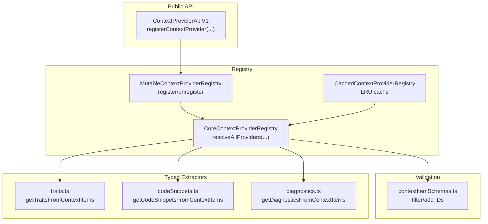
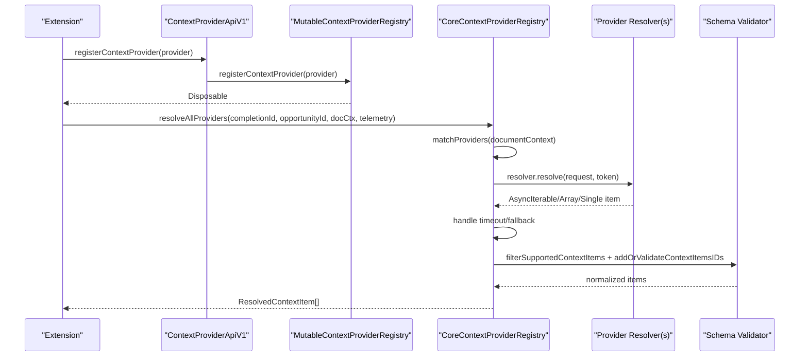
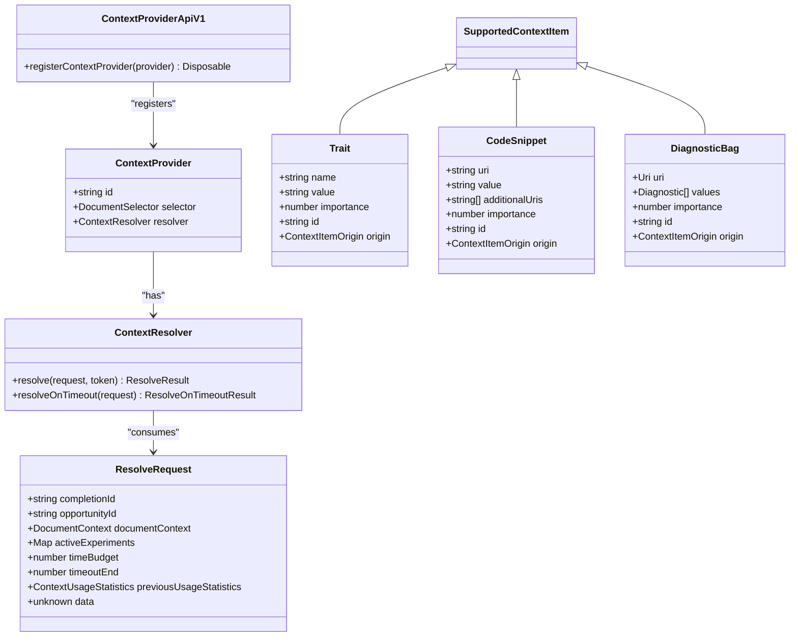
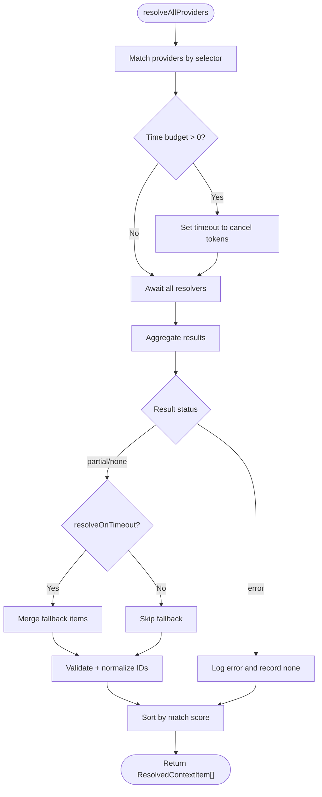
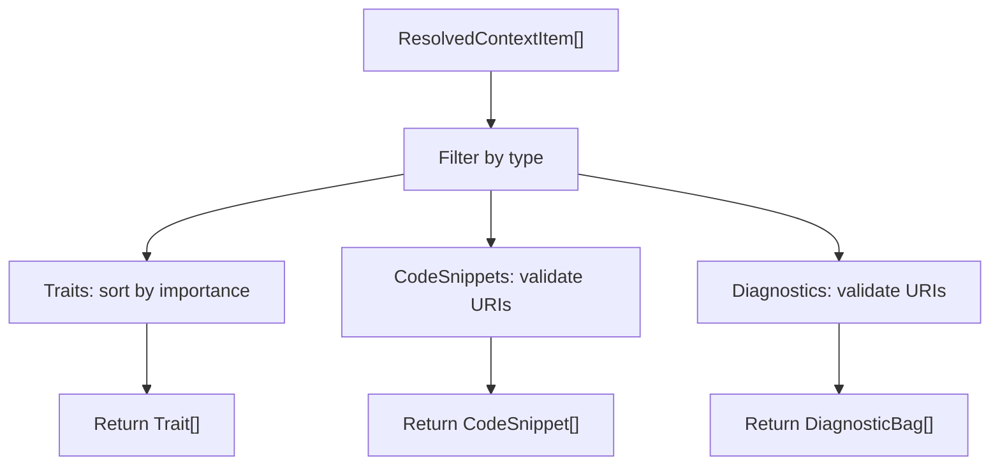
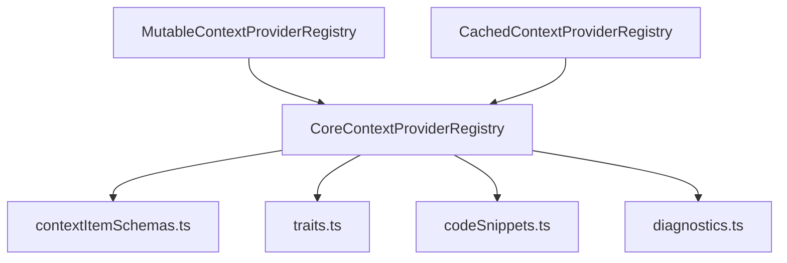

# Custom Context Providers

<cite>
**Referenced Files in This Document**
- [contextProviderRegistry.ts](file://src/extension/completions-core/vscode-node/lib/src/prompt/contextProviderRegistry.ts)
- [contextItemSchemas.ts](file://src/extension/completions-core/vscode-node/lib/src/prompt/contextProviders/contextItemSchemas.ts)
- [traits.ts](file://src/extension/completions-core/vscode-node/lib/src/prompt/contextProviders/traits.ts)
- [codeSnippets.ts](file://src/extension/completions-core/vscode-node/lib/src/prompt/contextProviders/codeSnippets.ts)
- [diagnostics.ts](file://src/extension/completions-core/vscode-node/lib/src/prompt/contextProviders/diagnostics.ts)
- [contextProviderApiV1.ts](file://src/extension/completions-core/vscode-node/types/src/contextProviderApiV1.ts)
- [core.ts](file://src/extension/completions-core/vscode-node/types/src/core.ts)
- [contextProviderRegistry.test.ts](file://src/extension/completions-core/vscode-node/lib/src/prompt/test/contextProviderRegistry.test.ts)
- [contextProviderBridge.test.ts](file://src/extension/completions-core/vscode-node/lib/src/prompt/components/test/contextProviderBridge.test.ts)
</cite>

## Table of Contents
1. [Introduction](#introduction)
2. [Project Structure](#project-structure)
3. [Core Components](#core-components)
4. [Architecture Overview](#architecture-overview)
5. [Detailed Component Analysis](#detailed-component-analysis)
6. [Dependency Analysis](#dependency-analysis)
7. [Performance Considerations](#performance-considerations)
8. [Troubleshooting Guide](#troubleshooting-guide)
9. [Conclusion](#conclusion)
10. [Appendices](#appendices)

## Introduction
This document explains how to create and register custom context providers for Copilot in VS Code. It covers the provider interface, registration mechanisms, contribution system, lifecycle, initialization patterns, cleanup, configuration, parameter passing, result formatting, security, authentication, rate limiting, testing, debugging, performance optimization, and best practices. It also includes step-by-step examples for integrating external systems such as GitHub repositories, Jira tickets, and Slack channels.

## Project Structure
The context provider system is implemented in the completions-core module and exposes a public API for extensions to register providers. Key areas:
- Public API surface for registering providers
- Registry and resolution orchestration
- Validation and filtering of context items
- Utilities for extracting typed context items (traits, code snippets, diagnostics)
- Tests validating registration, cancellation, timeouts, and fallback behavior

**Diagram sources**
- [contextProviderApiV1.ts](file://src/extension/completions-core/vscode-node/types/src/contextProviderApiV1.ts#L32-L68)
- [contextProviderRegistry.ts](file://src/extension/completions-core/vscode-node/lib/src/prompt/contextProviderRegistry.ts#L109-L337)
- [contextItemSchemas.ts](file://src/extension/completions-core/vscode-node/lib/src/prompt/contextProviders/contextItemSchemas.ts#L119-L201)
- [traits.ts](file://src/extension/completions-core/vscode-node/lib/src/prompt/contextProviders/traits.ts#L13-L29)
- [codeSnippets.ts](file://src/extension/completions-core/vscode-node/lib/src/prompt/contextProviders/codeSnippets.ts#L20-L69)
- [diagnostics.ts](file://src/extension/completions-core/vscode-node/lib/src/prompt/contextProviders/diagnostics.ts#L15-L70)

**Section sources**
- [contextProviderApiV1.ts](file://src/extension/completions-core/vscode-node/types/src/contextProviderApiV1.ts#L32-L68)
- [contextProviderRegistry.ts](file://src/extension/completions-core/vscode-node/lib/src/prompt/contextProviderRegistry.ts#L109-L337)
- [contextItemSchemas.ts](file://src/extension/completions-core/vscode-node/lib/src/prompt/contextProviders/contextItemSchemas.ts#L119-L201)
- [traits.ts](file://src/extension/completions-core/vscode-node/lib/src/prompt/contextProviders/traits.ts#L13-L29)
- [codeSnippets.ts](file://src/extension/completions-core/vscode-node/lib/src/prompt/contextProviders/codeSnippets.ts#L20-L69)
- [diagnostics.ts](file://src/extension/completions-core/vscode-node/lib/src/prompt/contextProviders/diagnostics.ts#L15-L70)

## Core Components
- ContextProviderApiV1: Exposes registerContextProvider for extensions to register providers.
- ContextProvider: Defines provider identity, selector, and resolver contract.
- ContextResolver: Implements resolve(request, token) and optional resolveOnTimeout(request).
- ResolveRequest: Carries completionId, opportunityId, documentContext, activeExperiments, timeBudget/timeoutEnd, previousUsageStatistics, and optional data payload.
- SupportedContextItem family: Trait, CodeSnippet, DiagnosticBag with validation and ID assignment.
- CoreContextProviderRegistry: Matches providers, enforces time budgets, cancellation, fallbacks, and filters invalid items.
- Typed extractors: Utilities to filter and prepare context items for downstream consumers.

**Section sources**
- [contextProviderApiV1.ts](file://src/extension/completions-core/vscode-node/types/src/contextProviderApiV1.ts#L32-L68)
- [contextProviderRegistry.ts](file://src/extension/completions-core/vscode-node/lib/src/prompt/contextProviderRegistry.ts#L137-L315)
- [contextItemSchemas.ts](file://src/extension/completions-core/vscode-node/lib/src/prompt/contextProviders/contextItemSchemas.ts#L119-L201)

## Architecture Overview
The system resolves context providers per completion request:
- Determine active providers based on configuration and experiments.
- Match providers against the current document context.
- Enforce a time budget and cancellation semantics.
- Invoke resolvers concurrently and merge results.
- Apply fallback logic on timeout.
- Validate and normalize context items (schema, IDs).
- Sort by match score and return structured results.

**Diagram sources**
- [contextProviderApiV1.ts](file://src/extension/completions-core/vscode-node/types/src/contextProviderApiV1.ts#L32-L68)
- [contextProviderRegistry.ts](file://src/extension/completions-core/vscode-node/lib/src/prompt/contextProviderRegistry.ts#L137-L315)
- [contextItemSchemas.ts](file://src/extension/completions-core/vscode-node/lib/src/prompt/contextProviders/contextItemSchemas.ts#L142-L201)

## Detailed Component Analysis

### Context Provider Interface and Registration
- Registration: Extensions obtain the API and call registerContextProvider with a ContextProvider object containing id, selector, and resolver.
- Selector: DocumentSelector determines activation scope.
- Resolver: resolve(request, token) returns either an array, a single item, or an AsyncIterable of SupportedContextItem.
- Optional fallback: resolveOnTimeout(request) can return partial results when time budget expires.

**Diagram sources**
- [contextProviderApiV1.ts](file://src/extension/completions-core/vscode-node/types/src/contextProviderApiV1.ts#L32-L213)
- [core.ts](file://src/extension/completions-core/vscode-node/types/src/core.ts#L1-L34)

**Section sources**
- [contextProviderApiV1.ts](file://src/extension/completions-core/vscode-node/types/src/contextProviderApiV1.ts#L32-L68)
- [contextProviderApiV1.ts](file://src/extension/completions-core/vscode-node/types/src/contextProviderApiV1.ts#L120-L155)
- [contextProviderApiV1.ts](file://src/extension/completions-core/vscode-node/types/src/contextProviderApiV1.ts#L185-L207)

### Resolution Lifecycle and Time Budget
- Matching: Providers are filtered by active provider lists and selector scores.
- Concurrency: Resolvers are awaited concurrently with a shared CancellationToken.
- Time budget: A timeout cancels outstanding requests; providers can opt into fallback via resolveOnTimeout.
- Fallback: If a provider supplies resolveOnTimeout, results are merged and status upgraded to partial if any fallback items are produced.
- Validation: Items are validated against supported schemas and normalized with IDs.

**Diagram sources**
- [contextProviderRegistry.ts](file://src/extension/completions-core/vscode-node/lib/src/prompt/contextProviderRegistry.ts#L137-L315)
- [contextProviderRegistry.ts](file://src/extension/completions-core/vscode-node/lib/src/prompt/contextProviderRegistry.ts#L255-L315)

**Section sources**
- [contextProviderRegistry.ts](file://src/extension/completions-core/vscode-node/lib/src/prompt/contextProviderRegistry.ts#L208-L220)
- [contextProviderRegistry.ts](file://src/extension/completions-core/vscode-node/lib/src/prompt/contextProviderRegistry.ts#L273-L289)
- [contextProviderRegistry.ts](file://src/extension/completions-core/vscode-node/lib/src/prompt/contextProviderRegistry.ts#L291-L306)

### Typed Context Item Extraction
- Traits: Flattened and sorted by importance; expectations recorded for telemetry.
- Code snippets: Validated against document manager; URIs checked for validity; expectations recorded.
- Diagnostics: Flattened and sorted by importance; URIs validated; expectations recorded.

**Diagram sources**
- [traits.ts](file://src/extension/completions-core/vscode-node/lib/src/prompt/contextProviders/traits.ts#L13-L29)
- [codeSnippets.ts](file://src/extension/completions-core/vscode-node/lib/src/prompt/contextProviders/codeSnippets.ts#L20-L69)
- [diagnostics.ts](file://src/extension/completions-core/vscode-node/lib/src/prompt/contextProviders/diagnostics.ts#L15-L70)

**Section sources**
- [traits.ts](file://src/extension/completions-core/vscode-node/lib/src/prompt/contextProviders/traits.ts#L13-L29)
- [codeSnippets.ts](file://src/extension/completions-core/vscode-node/lib/src/prompt/contextProviders/codeSnippets.ts#L20-L69)
- [diagnostics.ts](file://src/extension/completions-core/vscode-node/lib/src/prompt/contextProviders/diagnostics.ts#L15-L70)

### Schema Validation and ID Normalization
- filterSupportedContextItems validates items against supported schemas and returns a typed array plus a count of invalid items.
- addOrValidateContextItemsIDs assigns or replaces IDs ensuring uniqueness and validity, logging errors for replacements.

**Section sources**
- [contextItemSchemas.ts](file://src/extension/completions-core/vscode-node/lib/src/prompt/contextProviders/contextItemSchemas.ts#L142-L161)
- [contextItemSchemas.ts](file://src/extension/completions-core/vscode-node/lib/src/prompt/contextProviders/contextItemSchemas.ts#L177-L201)

### Step-by-Step Examples

#### Example: GitHub Repository Context Provider
Goal: Provide repository metadata and recent commits as context items.

Steps:
1. Define a ContextProvider with a suitable id and selector (e.g., for Git-related documents).
2. Implement resolver.resolve(request, token):
   - Use request.documentContext.uri to infer repository path.
   - Call GitHub API with authentication (see Security below).
   - Return CodeSnippet items for commit messages and diffs, or Trait items for repo info.
3. Optionally implement resolver.resolveOnTimeout(request) to return a minimal subset (e.g., top N recent commits).
4. Register via ContextProviderApiV1.registerContextProvider.

Notes:
- Respect timeBudget and cancel early on token cancellation.
- Normalize results with filterSupportedContextItems and addOrValidateContextItemsIDs.
- Use diagnostics.ts utilities to attach diagnostics if applicable.

**Section sources**
- [contextProviderApiV1.ts](file://src/extension/completions-core/vscode-node/types/src/contextProviderApiV1.ts#L32-L68)
- [contextProviderRegistry.ts](file://src/extension/completions-core/vscode-node/lib/src/prompt/contextProviderRegistry.ts#L208-L220)
- [contextItemSchemas.ts](file://src/extension/completions-core/vscode-node/lib/src/prompt/contextProviders/contextItemSchemas.ts#L142-L161)

#### Example: Jira Ticket Context Provider
Goal: Provide ticket summary and recent comments.

Steps:
1. Build a ContextProvider with selector targeting issue-related files.
2. Implement resolver.resolve(request, token):
   - Parse Jira issue key from filename or content.
   - Fetch ticket via Jira REST API with authentication.
   - Return Trait items for summary and labels, and optionally CodeSnippet for recent comments.
3. Implement resolver.resolveOnTimeout(request) to return a compact summary.
4. Register via ContextProviderApiV1.registerContextProvider.

Security and Rate Limiting:
- Use secure storage for tokens.
- Implement retries with exponential backoff.
- Respect API rate limits; cache responses.

**Section sources**
- [contextProviderApiV1.ts](file://src/extension/completions-core/vscode-node/types/src/contextProviderApiV1.ts#L64-L68)
- [contextProviderRegistry.ts](file://src/extension/completions-core/vscode-node/lib/src/prompt/contextProviderRegistry.ts#L273-L289)

#### Example: Slack Channel Context Provider
Goal: Provide recent messages from a channel related to the current file.

Steps:
1. Define ContextProvider with selector for relevant file types.
2. Implement resolver.resolve(request, token):
   - Derive channel identifier from file path or naming convention.
   - Query Slack API for recent messages.
   - Return CodeSnippet items for message excerpts.
3. Implement resolver.resolveOnTimeout(request) to return a small sample.
4. Register via ContextProviderApiV1.registerContextProvider.

Security and Rate Limiting:
- Store bot tokens securely.
- Apply rate limiting and pagination.
- Cache recent messages.

**Section sources**
- [contextProviderApiV1.ts](file://src/extension/completions-core/vscode-node/types/src/contextProviderApiV1.ts#L64-L68)
- [contextProviderRegistry.ts](file://src/extension/completions-core/vscode-node/lib/src/prompt/contextProviderRegistry.ts#L208-L220)

### Configuration, Parameter Passing, and Result Formatting
- Active providers: Determined by experiments and configuration; supports wildcard enabling.
- Request parameters: completionId, opportunityId, documentContext, activeExperiments, timeBudget/timeoutEnd, previousUsageStatistics, and optional data.
- Result formatting: ResolvedContextItem[] with providerId, matchScore, resolution status, resolutionTimeMs, and data array of typed items.

**Section sources**
- [contextProviderRegistry.ts](file://src/extension/completions-core/vscode-node/lib/src/prompt/contextProviderRegistry.ts#L494-L508)
- [contextProviderRegistry.ts](file://src/extension/completions-core/vscode-node/lib/src/prompt/contextProviderRegistry.ts#L535-L542)
- [contextProviderRegistry.ts](file://src/extension/completions-core/vscode-node/lib/src/prompt/contextProviderRegistry.ts#L42-L48)
- [contextProviderApiV1.ts](file://src/extension/completions-core/vscode-node/types/src/contextProviderApiV1.ts#L120-L155)

### Security, Authentication, and Rate Limiting
- Authentication: Use secure storage for tokens and credentials; avoid embedding secrets in code.
- Rate limiting: Implement retry with backoff; cache responses; respect provider-side quotas.
- Cancellation: Honor CancellationToken to prevent wasted work after timeout.
- Validation: Validate URIs and schema to avoid leaking sensitive data.

**Section sources**
- [contextProviderRegistry.ts](file://src/extension/completions-core/vscode-node/lib/src/prompt/contextProviderRegistry.ts#L200-L220)
- [contextItemSchemas.ts](file://src/extension/completions-core/vscode-node/lib/src/prompt/contextProviders/contextItemSchemas.ts#L177-L201)

### Testing, Debugging, and Performance Optimization
- Unit tests validate registration, duplicates, cancellation, and fallback behavior.
- Bridge tests demonstrate resolver implementations and error handling.
- Debug mode disables time budget for easier debugging.
- Performance tips:
  - Minimize network calls; batch and cache.
  - Use streaming/AsyncIterable where appropriate.
  - Keep resolveOnTimeout fast and minimal.

**Section sources**
- [contextProviderRegistry.test.ts](file://src/extension/completions-core/vscode-node/lib/src/prompt/test/contextProviderRegistry.test.ts#L87-L117)
- [contextProviderRegistry.test.ts](file://src/extension/completions-core/vscode-node/lib/src/prompt/test/contextProviderRegistry.test.ts#L577-L591)
- [contextProviderRegistry.test.ts](file://src/extension/completions-core/vscode-node/lib/src/prompt/test/contextProviderRegistry.test.ts#L593-L613)
- [contextProviderBridge.test.ts](file://src/extension/completions-core/vscode-node/lib/src/prompt/components/test/contextProviderBridge.test.ts#L112-L136)
- [contextProviderRegistry.ts](file://src/extension/completions-core/vscode-node/lib/src/prompt/contextProviderRegistry.ts#L210-L212)

## Dependency Analysis
- MutableContextProviderRegistry delegates registration to the language context provider service and augments with local providers.
- CachedContextProviderRegistry wraps the core registry to cache results per completionId.
- Typed extractors depend on schema validation and document manager services.

**Diagram sources**
- [contextProviderRegistry.ts](file://src/extension/completions-core/vscode-node/lib/src/prompt/contextProviderRegistry.ts#L339-L373)
- [contextProviderRegistry.ts](file://src/extension/completions-core/vscode-node/lib/src/prompt/contextProviderRegistry.ts#L375-L432)
- [contextItemSchemas.ts](file://src/extension/completions-core/vscode-node/lib/src/prompt/contextProviders/contextItemSchemas.ts#L119-L201)
- [traits.ts](file://src/extension/completions-core/vscode-node/lib/src/prompt/contextProviders/traits.ts#L13-L29)
- [codeSnippets.ts](file://src/extension/completions-core/vscode-node/lib/src/prompt/contextProviders/codeSnippets.ts#L20-L69)
- [diagnostics.ts](file://src/extension/completions-core/vscode-node/lib/src/prompt/contextProviders/diagnostics.ts#L15-L70)

**Section sources**
- [contextProviderRegistry.ts](file://src/extension/completions-core/vscode-node/lib/src/prompt/contextProviderRegistry.ts#L339-L373)
- [contextProviderRegistry.ts](file://src/extension/completions-core/vscode-node/lib/src/prompt/contextProviderRegistry.ts#L375-L432)

## Performance Considerations
- Time budget enforcement prevents long-running providers from blocking completions.
- Caching reduces repeated work across the same completionId.
- Prefer streaming results and minimal fallback payloads.
- Validate early and fail fast on invalid inputs.

[No sources needed since this section provides general guidance]

## Troubleshooting Guide
Common issues and remedies:
- Provider not invoked: Verify selector matches the document and provider id is enabled by configuration/experiments.
- No results: Ensure resolver returns SupportedContextItem; check schema validation and ID normalization.
- Slow performance: Reduce network calls, implement caching, and honor cancellation.
- Timeout errors: Implement resolveOnTimeout to return partial results.

**Section sources**
- [contextProviderRegistry.test.ts](file://src/extension/completions-core/vscode-node/lib/src/prompt/test/contextProviderRegistry.test.ts#L170-L207)
- [contextProviderRegistry.test.ts](file://src/extension/completions-core/vscode-node/lib/src/prompt/test/contextProviderRegistry.test.ts#L577-L591)
- [contextProviderRegistry.ts](file://src/extension/completions-core/vscode-node/lib/src/prompt/contextProviderRegistry.ts#L273-L289)

## Conclusion
Custom context providers enable integrations with external systems and domain-specific knowledge. By adhering to the provider interface, respecting time budgets and cancellation, validating results, and implementing robust fallbacks, you can deliver timely, accurate, and secure context to Copilot. Use the provided utilities and tests as blueprints for building reliable providers.

[No sources needed since this section summarizes without analyzing specific files]

## Appendices

### Best Practices
- Design providers to be deterministic and fast.
- Use resolveOnTimeout for resilient fallbacks.
- Validate and sanitize all external inputs.
- Log meaningful telemetry and errors without leaking secrets.
- Keep selectors precise to minimize unnecessary work.

[No sources needed since this section provides general guidance]