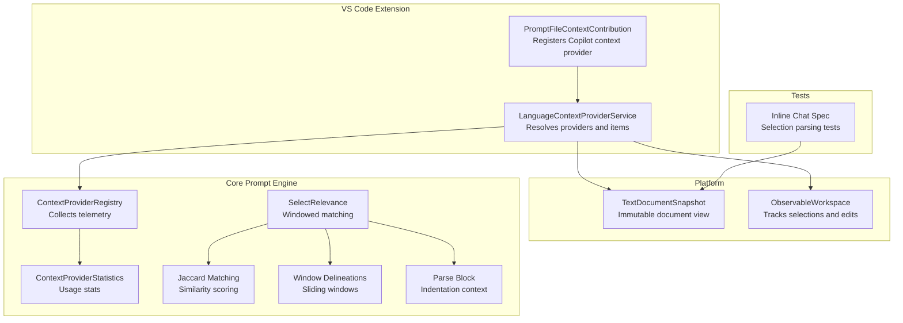
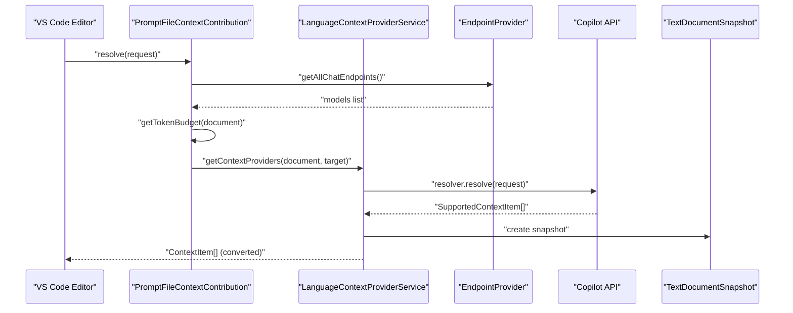
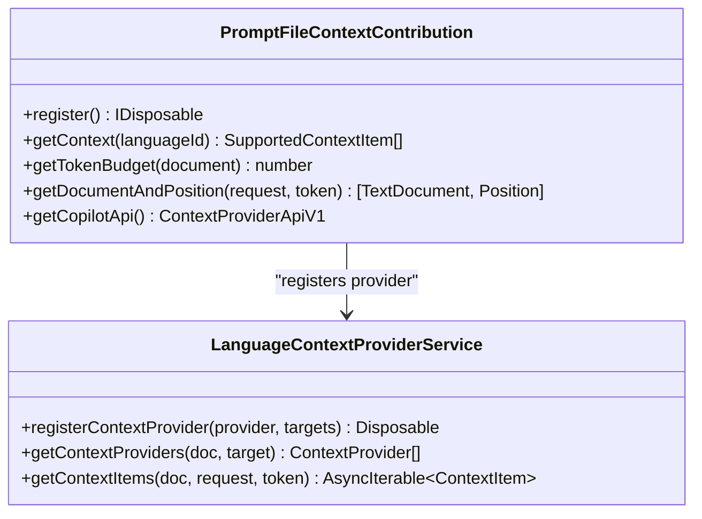
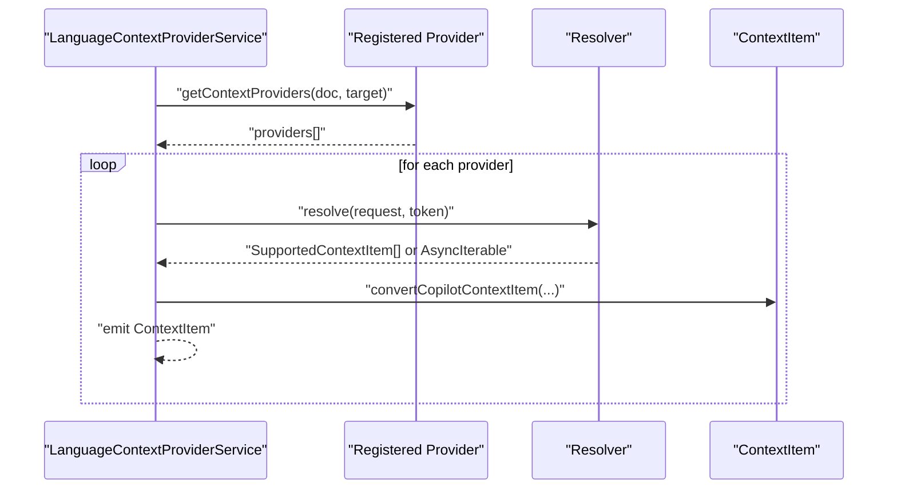
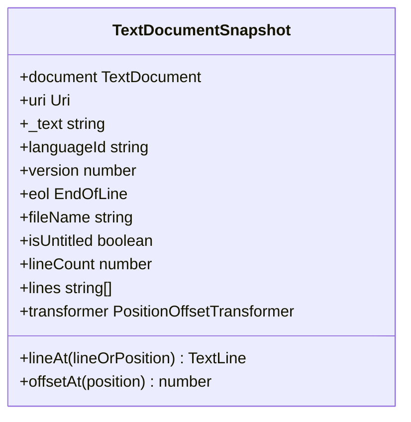
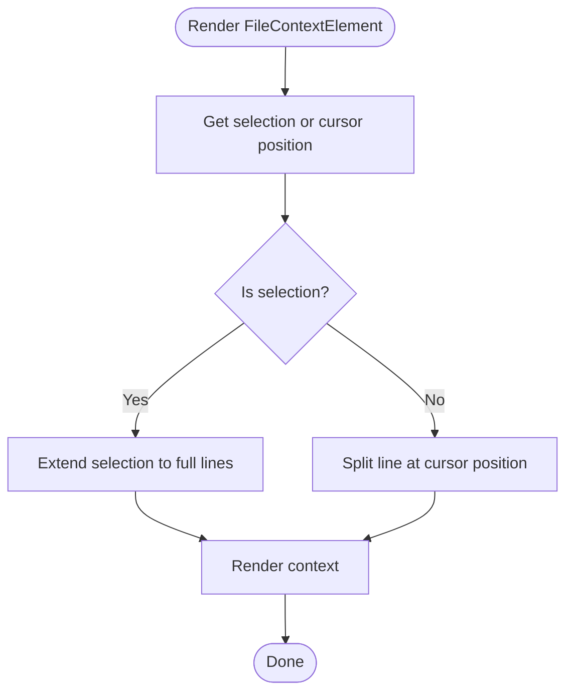
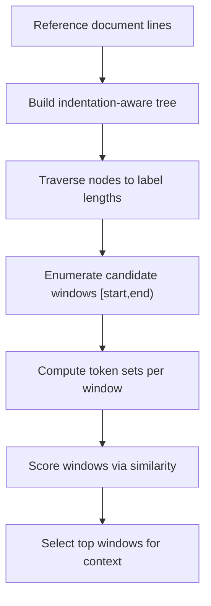
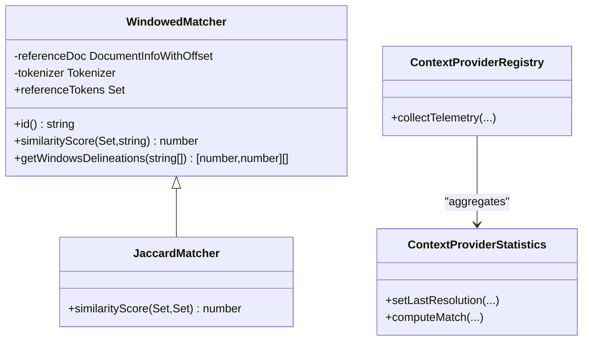
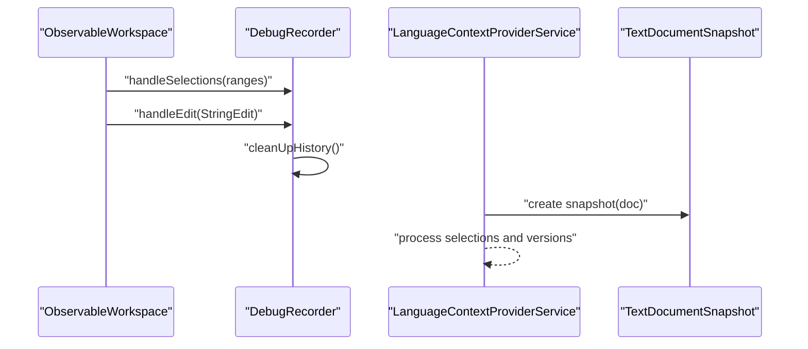
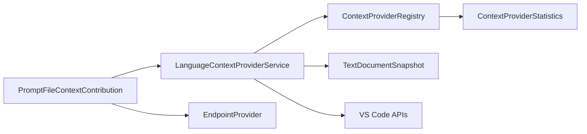

# File Context

<cite>
**Referenced Files in This Document**
- [promptFileContextService.ts](file://src/extension/promptFileContext/vscode-node/promptFileContextService.ts)
- [languageContextProviderService.ts](file://src/extension/languageContextProvider/vscode-node/languageContextProviderService.ts)
- [languageContextProviderService.ts (common)](file://src/platform/languageContextProvider/common/languageContextProviderService.ts)
- [textDocumentSnapshot.ts](file://src/platform/editing/common/textDocumentSnapshot.ts)
- [inlineChat2Prompt.spec.tsx](file://src/extension/prompts/node/inline/test/inlineChat2Prompt.spec.tsx)
- [contextProviderRegistry.ts](file://src/extension/completions-core/vscode-node/lib/src/prompt/contextProviderRegistry.ts)
- [contextProviderStatistics.ts](file://src/extension/completions-core/vscode-node/lib/src/prompt/contextProviderStatistics.ts)
- [selectRelevance.ts](file://src/extension/completions-core/vscode-node/prompt/src/snippetInclusion/selectRelevance.ts)
- [jaccardMatching.ts](file://src/extension/completions-core/vscode-node/prompt/src/snippetInclusion/jaccardMatching.ts)
- [windowDelineations.ts](file://src/extension/completions-core/vscode-node/prompt/src/snippetInclusion/windowDelineations.ts)
- [parseBlock.ts](file://src/extension/completions-core/vscode-node/lib/src/prompt/parseBlock.ts)
- [observableWorkspace.ts](file://src/platform/inlineEdits/common/observableWorkspace.ts)
- [debugRecorder.ts](file://src/extension/inlineEdits/node/debugRecorder.ts)
</cite>

## Table of Contents
1. [Introduction](#introduction)
2. [Project Structure](#project-structure)
3. [Core Components](#core-components)
4. [Architecture Overview](#architecture-overview)
5. [Detailed Component Analysis](#detailed-component-analysis)
6. [Dependency Analysis](#dependency-analysis)
7. [Performance Considerations](#performance-considerations)
8. [Troubleshooting Guide](#troubleshooting-guide)
9. [Conclusion](#conclusion)

## Introduction
This document explains how the system detects and processes file context in the VS Code extension. It focuses on extracting relevant information from currently opened files, including code selection context, syntax-awareness considerations, and file metadata. It also details the file context resolution pipeline, selection parsing, code block identification, context window sizing, integration with VS Code editor APIs and document snapshots, selection tracking, and examples across languages and file types. Finally, it covers context relevance algorithms, code similarity matching, context prioritization, caching, incremental updates, performance considerations for large files, customization guidance, and integration with external code analysis tools.

## Project Structure
The file context functionality spans several modules:
- Prompt file context provider registers a Copilot-compatible context provider for specific prompt-related file types and returns structured hints and examples.
- Language context provider service integrates with VS Code language selectors and resolves context items from registered providers.
- Text document snapshot provides immutable, versioned views of a document’s content and metadata for safe, deterministic processing.
- Inline prompt rendering tests demonstrate selection parsing and cursor-position splitting behavior.
- Context provider registry and statistics collect telemetry and usage details for providers.
- Relevance and similarity utilities implement window-based matching and scoring for code snippets.
- Observable workspace and debug recorder track selection changes and edits for incremental updates.

**Diagram sources**
- [promptFileContextService.ts](file://src/extension/promptFileContext/vscode-node/promptFileContextService.ts#L55-L97)
- [languageContextProviderService.ts](file://src/extension/languageContextProvider/vscode-node/languageContextProviderService.ts#L15-L76)
- [textDocumentSnapshot.ts](file://src/platform/editing/common/textDocumentSnapshot.ts#L28-L134)
- [contextProviderRegistry.ts](file://src/extension/completions-core/vscode-node/lib/src/prompt/contextProviderRegistry.ts#L452-L492)
- [contextProviderStatistics.ts](file://src/extension/completions-core/vscode-node/lib/src/prompt/contextProviderStatistics.ts#L76-L121)
- [selectRelevance.ts](file://src/extension/completions-core/vscode-node/prompt/src/snippetInclusion/selectRelevance.ts#L77-L112)
- [jaccardMatching.ts](file://src/extension/completions-core/vscode-node/prompt/src/snippetInclusion/jaccardMatching.ts#L39-L56)
- [windowDelineations.ts](file://src/extension/completions-core/vscode-node/prompt/src/snippetInclusion/windowDelineations.ts#L57-L82)
- [parseBlock.ts](file://src/extension/completions-core/vscode-node/lib/src/prompt/parseBlock.ts#L82-L123)
- [inlineChat2Prompt.spec.tsx](file://src/extension/prompts/node/inline/test/inlineChat2Prompt.spec.tsx#L30-L212)
- [observableWorkspace.ts](file://src/platform/inlineEdits/common/observableWorkspace.ts#L175-L208)
- [debugRecorder.ts](file://src/extension/inlineEdits/node/debugRecorder.ts#L113-L169)

**Section sources**
- [promptFileContextService.ts](file://src/extension/promptFileContext/vscode-node/promptFileContextService.ts#L1-L275)
- [languageContextProviderService.ts](file://src/extension/languageContextProvider/vscode-node/languageContextProviderService.ts#L1-L124)
- [languageContextProviderService.ts (common)](file://src/platform/languageContextProvider/common/languageContextProviderService.ts#L1-L31)

## Core Components
- PromptFileContextContribution: Registers a Copilot context provider for prompt-related file types and returns structured hints and examples tailored to those files.
- LanguageContextProviderService: Manages provider registration, selection matching, and asynchronous resolution of context items, converting Copilot items to internal ContextItem format.
- TextDocumentSnapshot: Provides an immutable, versioned snapshot of a document’s text, language ID, EOL, and version for deterministic processing.
- Inline prompt rendering tests: Demonstrate selection parsing and cursor-position splitting behavior for file context rendering.
- ContextProviderRegistry and ContextProviderStatistics: Collect telemetry and usage statistics for providers.
- SelectRelevance, Jaccard Matching, Window Delineations, Parse Block: Implement window-based similarity matching and indentation-aware context parsing.
- ObservableWorkspace and Debug Recorder: Track selection changes and edits for incremental updates.

**Section sources**
- [promptFileContextService.ts](file://src/extension/promptFileContext/vscode-node/promptFileContextService.ts#L55-L97)
- [languageContextProviderService.ts](file://src/extension/languageContextProvider/vscode-node/languageContextProviderService.ts#L15-L76)
- [textDocumentSnapshot.ts](file://src/platform/editing/common/textDocumentSnapshot.ts#L28-L134)
- [inlineChat2Prompt.spec.tsx](file://src/extension/prompts/node/inline/test/inlineChat2Prompt.spec.tsx#L30-L212)
- [contextProviderRegistry.ts](file://src/extension/completions-core/vscode-node/lib/src/prompt/contextProviderRegistry.ts#L452-L492)
- [contextProviderStatistics.ts](file://src/extension/completions-core/vscode-node/lib/src/prompt/contextProviderStatistics.ts#L76-L121)
- [selectRelevance.ts](file://src/extension/completions-core/vscode-node/prompt/src/snippetInclusion/selectRelevance.ts#L77-L112)
- [jaccardMatching.ts](file://src/extension/completions-core/vscode-node/prompt/src/snippetInclusion/jaccardMatching.ts#L39-L56)
- [windowDelineations.ts](file://src/extension/completions-core/vscode-node/prompt/src/snippetInclusion/windowDelineations.ts#L57-L82)
- [parseBlock.ts](file://src/extension/completions-core/vscode-node/lib/src/prompt/parseBlock.ts#L82-L123)
- [observableWorkspace.ts](file://src/platform/inlineEdits/common/observableWorkspace.ts#L175-L208)
- [debugRecorder.ts](file://src/extension/inlineEdits/node/debugRecorder.ts#L113-L169)

## Architecture Overview
The file context pipeline integrates VS Code APIs, document snapshots, and provider-based resolution to deliver context items. Providers are registered per language selector and can return either traits or code snippets. The system computes a token budget, validates document versions, and converts provider outputs into internal context items with priorities.

**Diagram sources**
- [promptFileContextService.ts](file://src/extension/promptFileContext/vscode-node/promptFileContextService.ts#L55-L97)
- [languageContextProviderService.ts](file://src/extension/languageContextProvider/vscode-node/languageContextProviderService.ts#L47-L76)
- [textDocumentSnapshot.ts](file://src/platform/editing/common/textDocumentSnapshot.ts#L28-L134)

## Detailed Component Analysis

### Prompt File Context Provider
- Registration: Registers a Copilot context provider with a selector for prompt-related file types and a resolver that returns structured hints and examples.
- Token Budget: Computes a token budget based on document size to constrain context length.
- Document Selection: Retrieves the active or matching document and validates its version against the request.
- Model Discovery: Queries available endpoints to populate model choices dynamically.
- Provider Targets: Registers for both NES and Completions targets via the language context provider service.

**Diagram sources**
- [promptFileContextService.ts](file://src/extension/promptFileContext/vscode-node/promptFileContextService.ts#L55-L97)
- [languageContextProviderService.ts](file://src/extension/languageContextProvider/vscode-node/languageContextProviderService.ts#L15-L36)

**Section sources**
- [promptFileContextService.ts](file://src/extension/promptFileContext/vscode-node/promptFileContextService.ts#L55-L97)
- [promptFileContextService.ts](file://src/extension/promptFileContext/vscode-node/promptFileContextService.ts#L245-L270)

### Language Context Provider Service
- Provider Management: Maintains a registry of providers and their targets, filtering by language selector and target.
- Asynchronous Resolution: Executes resolvers concurrently and emits context items as they arrive.
- Conversion: Converts Copilot context items (traits or snippets) into internal ContextItem format with priority derived from importance.
- Timeout Handling: Supports fallback resolution on timeouts.

**Diagram sources**
- [languageContextProviderService.ts](file://src/extension/languageContextProvider/vscode-node/languageContextProviderService.ts#L47-L76)
- [languageContextProviderService.ts](file://src/extension/languageContextProvider/vscode-node/languageContextProviderService.ts#L78-L98)

**Section sources**
- [languageContextProviderService.ts](file://src/extension/languageContextProvider/vscode-node/languageContextProviderService.ts#L47-L76)
- [languageContextProviderService.ts](file://src/extension/languageContextProvider/vscode-node/languageContextProviderService.ts#L78-L121)

### TextDocumentSnapshot
- Immutable View: Captures document URI, text, language ID, EOL, and version for deterministic processing.
- Line Access: Lazily splits text into lines and exposes line-at-access with boundary checks.
- Position Transform: Validates positions and computes offsets using a position-offset transformer when versions differ.

**Diagram sources**
- [textDocumentSnapshot.ts](file://src/platform/editing/common/textDocumentSnapshot.ts#L28-L134)

**Section sources**
- [textDocumentSnapshot.ts](file://src/platform/editing/common/textDocumentSnapshot.ts#L28-L134)

### Selection Parsing and Cursor Splitting
- Tests demonstrate selection parsing and cursor-position splitting behavior:
  - Single-line selection renders only the selected line.
  - Multi-line selection renders full lines spanning the range.
  - Partial line selection is extended to full lines.
  - Cursor position splits a line into before/after segments with a special marker.

**Diagram sources**
- [inlineChat2Prompt.spec.tsx](file://src/extension/prompts/node/inline/test/inlineChat2Prompt.spec.tsx#L128-L212)

**Section sources**
- [inlineChat2Prompt.spec.tsx](file://src/extension/prompts/node/inline/test/inlineChat2Prompt.spec.tsx#L30-L212)

### Context Window Sizing and Code Block Identification
- Token Budget: Prompt file context provider computes a token budget based on document length to constrain context size.
- Window Delineations: Sliding window algorithm identifies candidate windows for inclusion based on indentation-aware tree traversal.
- Indentation Context: Utilities define previous/current/next indentation levels to guide context boundaries.

**Diagram sources**
- [windowDelineations.ts](file://src/extension/completions-core/vscode-node/prompt/src/snippetInclusion/windowDelineations.ts#L57-L82)
- [parseBlock.ts](file://src/extension/completions-core/vscode-node/lib/src/prompt/parseBlock.ts#L82-L123)

**Section sources**
- [promptFileContextService.ts](file://src/extension/promptFileContext/vscode-node/promptFileContextService.ts#L245-L247)
- [windowDelineations.ts](file://src/extension/completions-core/vscode-node/prompt/src/snippetInclusion/windowDelineations.ts#L57-L82)
- [parseBlock.ts](file://src/extension/completions-core/vscode-node/lib/src/prompt/parseBlock.ts#L82-L123)

### Context Relevance, Similarity Matching, and Prioritization
- Windowed Matching: Implements a base class for window-based similarity matching with configurable window sizes and tokenization.
- Jaccard Similarity: Computes Jaccard scores between token sets of windows to rank relevance.
- Statistics and Telemetry: Tracks provider resolution status, usage counts, and partial/full usage details for analytics.
- Priority Conversion: Converts provider importance (0–100) to internal priority (0–1).

**Diagram sources**
- [selectRelevance.ts](file://src/extension/completions-core/vscode-node/prompt/src/snippetInclusion/selectRelevance.ts#L77-L112)
- [jaccardMatching.ts](file://src/extension/completions-core/vscode-node/prompt/src/snippetInclusion/jaccardMatching.ts#L39-L56)
- [contextProviderRegistry.ts](file://src/extension/completions-core/vscode-node/lib/src/prompt/contextProviderRegistry.ts#L452-L492)
- [contextProviderStatistics.ts](file://src/extension/completions-core/vscode-node/lib/src/prompt/contextProviderStatistics.ts#L76-L121)

**Section sources**
- [selectRelevance.ts](file://src/extension/completions-core/vscode-node/prompt/src/snippetInclusion/selectRelevance.ts#L77-L112)
- [jaccardMatching.ts](file://src/extension/completions-core/vscode-node/prompt/src/snippetInclusion/jaccardMatching.ts#L39-L56)
- [contextProviderRegistry.ts](file://src/extension/completions-core/vscode-node/lib/src/prompt/contextProviderRegistry.ts#L452-L492)
- [contextProviderStatistics.ts](file://src/extension/completions-core/vscode-node/lib/src/prompt/contextProviderStatistics.ts#L76-L121)
- [languageContextProviderService.ts](file://src/extension/languageContextProvider/vscode-node/languageContextProviderService.ts#L100-L109)

### Integration with VS Code Editor APIs, Document Snapshots, and Selection Tracking
- VS Code APIs: Uses language selectors, text documents, and editor APIs to match providers and resolve context.
- Document Snapshots: Ensures deterministic processing by working with immutable snapshots and validating versions.
- Selection Tracking: Observable workspace tracks visible ranges and selections; debug recorder maintains history of edits and selections for incremental updates.

**Diagram sources**
- [observableWorkspace.ts](file://src/platform/inlineEdits/common/observableWorkspace.ts#L175-L208)
- [debugRecorder.ts](file://src/extension/inlineEdits/node/debugRecorder.ts#L113-L169)
- [textDocumentSnapshot.ts](file://src/platform/editing/common/textDocumentSnapshot.ts#L28-L134)
- [languageContextProviderService.ts](file://src/extension/languageContextProvider/vscode-node/languageContextProviderService.ts#L47-L76)

**Section sources**
- [observableWorkspace.ts](file://src/platform/inlineEdits/common/observableWorkspace.ts#L175-L208)
- [debugRecorder.ts](file://src/extension/inlineEdits/node/debugRecorder.ts#L113-L169)
- [textDocumentSnapshot.ts](file://src/platform/editing/common/textDocumentSnapshot.ts#L28-L134)

### Examples of File Context Extraction Across Languages and File Types
- Prompt files: Returns structured hints for frontmatter attributes, allowed values, and example snippets.
- Instructions files: Provides guidance on supported attributes and glob patterns for file targeting.
- Agent files: Supplies model options, tool lists, target platforms, and handoff configurations.

These examples are returned as context items from the prompt file context provider and integrated into the broader context pipeline.

**Section sources**
- [promptFileContextService.ts](file://src/extension/promptFileContext/vscode-node/promptFileContextService.ts#L99-L219)

## Dependency Analysis
- Provider registration depends on language selectors and target categories.
- Resolution depends on endpoint discovery for model availability.
- Conversion from Copilot items to internal context items ensures consistent priority semantics.
- Telemetry and statistics rely on provider usage details and resolution outcomes.

**Diagram sources**
- [languageContextProviderService.ts](file://src/extension/languageContextProvider/vscode-node/languageContextProviderService.ts#L47-L76)
- [contextProviderRegistry.ts](file://src/extension/completions-core/vscode-node/lib/src/prompt/contextProviderRegistry.ts#L452-L492)
- [contextProviderStatistics.ts](file://src/extension/completions-core/vscode-node/lib/src/prompt/contextProviderStatistics.ts#L76-L121)
- [textDocumentSnapshot.ts](file://src/platform/editing/common/textDocumentSnapshot.ts#L28-L134)
- [promptFileContextService.ts](file://src/extension/promptFileContext/vscode-node/promptFileContextService.ts#L73-L81)

**Section sources**
- [languageContextProviderService.ts](file://src/extension/languageContextProvider/vscode-node/languageContextProviderService.ts#L15-L36)
- [promptFileContextService.ts](file://src/extension/promptFileContext/vscode-node/promptFileContextService.ts#L73-L81)

## Performance Considerations
- Token Budgeting: Prompt file context provider computes a token budget to cap context size based on document length.
- Version Validation: Ensures document versions match the request to avoid stale or inconsistent contexts.
- Asynchronous Resolution: Concurrently resolves multiple providers to reduce latency.
- Windowed Matching: Uses sliding windows and caching to limit similarity computations for large files.
- Incremental Updates: Selection and edit histories enable targeted recomputation rather than full reprocessing.

[No sources needed since this section provides general guidance]

## Troubleshooting Guide
- Provider Registration Failures: Verify that the Copilot extension is installed and activated, and that the context provider API is available.
- Empty Context Items: Confirm that the language selector matches the document and that the resolver returns items for the current language ID.
- Stale Context: Ensure document versions align with the request; mismatched versions cause resolution to be skipped.
- Excessive Context Size: Adjust token budget or selection ranges; consider narrowing selections or reducing window sizes.

**Section sources**
- [promptFileContextService.ts](file://src/extension/promptFileContext/vscode-node/promptFileContextService.ts#L249-L270)
- [languageContextProviderService.ts](file://src/extension/languageContextProvider/vscode-node/languageContextProviderService.ts#L47-L76)

## Conclusion
The file context system integrates VS Code APIs, immutable document snapshots, and provider-based resolution to deliver language-aware, token-bounded context. It supports selection parsing, cursor splitting, windowed similarity matching, and prioritization, enabling efficient processing across diverse file types and languages. With telemetry-driven statistics and incremental update mechanisms, the system scales to large files and evolving editor states while maintaining deterministic behavior.