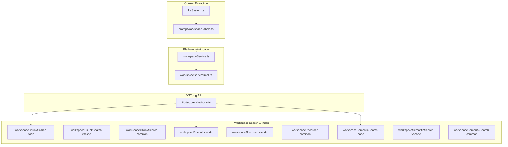
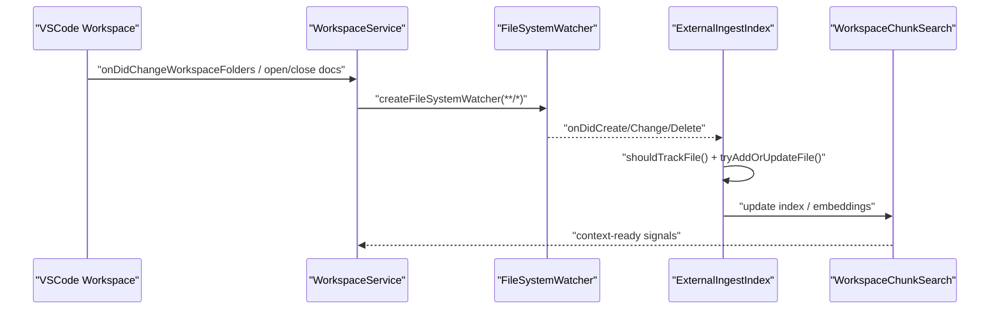
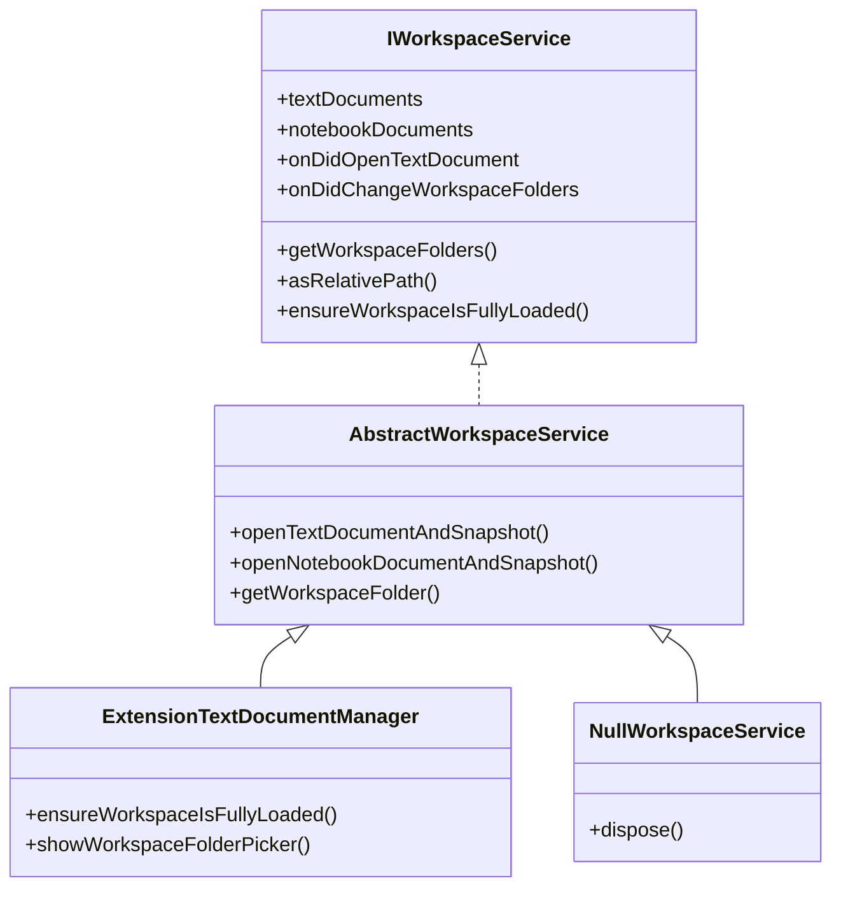
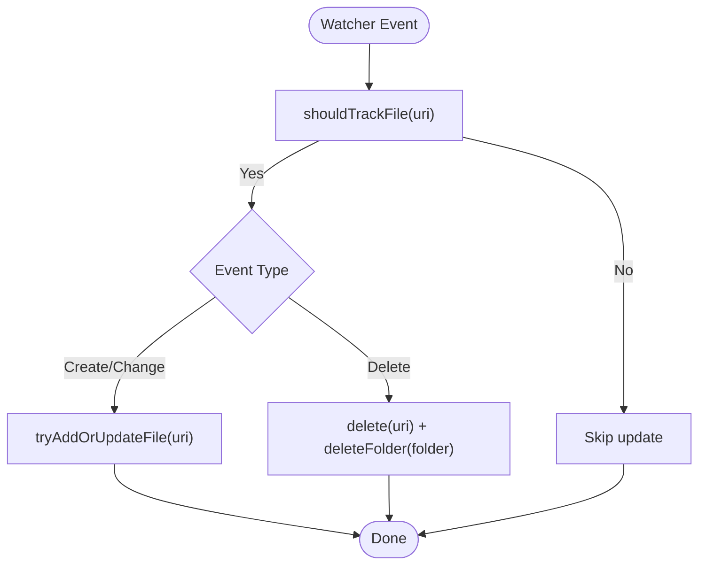
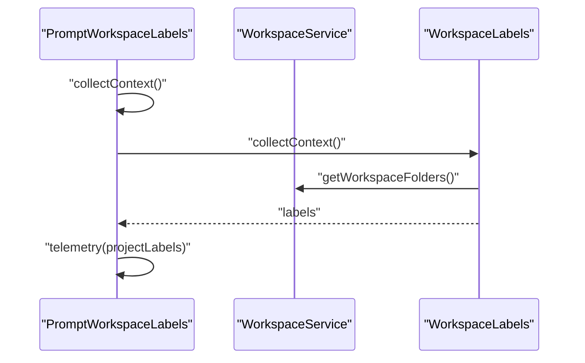
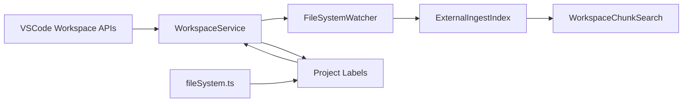

# Workspace Context

<cite>
**Referenced Files in This Document**
- [workspaceService.ts](file://src/platform/workspace/common/workspaceService.ts)
- [workspaceServiceImpl.ts](file://src/platform/workspace/VSCode/workspaceServiceImpl.ts)
- [fileSystemWatcher API](file://src/extension/vscode.d.ts)
- [externalIngestIndex.ts](file://src/platform/workspaceChunkSearch/node/codeSearch/externalIngestIndex.ts)
- [promptWorkspaceLabels.ts](file://src/extension/context/node/resolvers/promptWorkspaceLabels.ts)
- [fileSystem.ts](file://src/util/common/fileSystem.ts)
- [workspaceChunkSearch node](file://src/platform/workspaceChunkSearch/node/)
- [workspaceRecorder common](file://src/platform/workspaceRecorder/common/)
- [workspaceState common](file://src/platform/workspaceState/common/)
- [workspaceSemanticSearch node](file://src/platform/workspaceSemanticSearch/node/)
- [workspaceChunkSearch common](file://src/platform/workspaceChunkSearch/common/)
- [workspaceRecorder node](file://src/platform/workspaceRecorder/node/)
- [workspaceSemanticSearch common](file://src/platform/workspaceSemanticSearch/common/)
- [workspaceSemanticSearch vscode](file://src/platform/workspaceSemanticSearch/vscode/)
- [workspaceChunkSearch vscode](file://src/platform/workspaceChunkSearch/vscode/)
- [workspaceRecorder vscode](file://src/platform/workspaceRecorder/vscode/)
- [workspaceSemanticSearch test](file://src/platform/workspaceSemanticSearch/node/test/)
</cite>

## Table of Contents
1. [Introduction](#introduction)
2. [Project Structure](#project-structure)
3. [Core Components](#core-components)
4. [Architecture Overview](#architecture-overview)
5. [Detailed Component Analysis](#detailed-component-analysis)
6. [Dependency Analysis](#dependency-analysis)
7. [Performance Considerations](#performance-considerations)
8. [Troubleshooting Guide](#troubleshooting-guide)
9. [Conclusion](#conclusion)
10. [Appendices](#appendices)

## Introduction
This document explains how workspace context is detected, gathered, and maintained in the repository. It covers the workspace detection pipeline, file discovery and traversal, project boundary detection, integration with VSCode workspace APIs and file watchers, configuration-driven filtering, and strategies for caching and incremental updates. It also provides examples of extracting context for TypeScript, Python, and Java projects, and guidance for extending support to custom project types and external project management systems.

## Project Structure
The workspace context functionality spans several platform and extension modules:
- Platform workspace abstraction and VSCode-backed implementation
- File watchers and incremental ingestion for large repositories
- Project labels and metadata extraction
- Utilities for file system heuristics
- Semantic and chunk-based search integrations
- Recording and state management for workspace context

**Diagram sources**
- [workspaceService.ts](file://src/platform/workspace/common/workspaceService.ts#L1-L240)
- [workspaceServiceImpl.ts](file://src/platform/workspace/VSCode/workspaceServiceImpl.ts#L1-L122)
- [fileSystemWatcher API](file://src/extension/vscode.d.ts#L14115-L14227)
- [externalIngestIndex.ts](file://src/platform/workspaceChunkSearch/node/codeSearch/externalIngestIndex.ts#L770-L806)
- [promptWorkspaceLabels.ts](file://src/extension/context/node/resolvers/promptWorkspaceLabels.ts#L53-L86)
- [fileSystem.ts](file://src/util/common/fileSystem.ts#L1-L9)
- [workspaceChunkSearch node](file://src/platform/workspaceChunkSearch/node/)
- [workspaceChunkSearch common](file://src/platform/workspaceChunkSearch/common/)
- [workspaceChunkSearch vscode](file://src/platform/workspaceChunkSearch/vscode/)
- [workspaceRecorder node](file://src/platform/workspaceRecorder/node/)
- [workspaceRecorder common](file://src/platform/workspaceRecorder/common/)
- [workspaceRecorder vscode](file://src/platform/workspaceRecorder/vscode/)
- [workspaceSemanticSearch node](file://src/platform/workspaceSemanticSearch/node/)
- [workspaceSemanticSearch common](file://src/platform/workspaceSemanticSearch/common/)
- [workspaceSemanticSearch vscode](file://src/platform/workspaceSemanticSearch/vscode/)

**Section sources**
- [workspaceService.ts](file://src/platform/workspace/common/workspaceService.ts#L1-L240)
- [workspaceServiceImpl.ts](file://src/platform/workspace/VSCode/workspaceServiceImpl.ts#L1-L122)
- [fileSystemWatcher API](file://src/extension/vscode.d.ts#L14115-L14227)

## Core Components
- Workspace abstraction and service
  - Provides document and folder lifecycle events, relative path computation, trust requests, and snapshot creation helpers.
  - Includes a null implementation for testing and fallbacks.
- VSCode-backed workspace service
  - Bridges the platform service to VSCode workspace APIs, including virtual workspace preloading for remote repositories.
- File system watchers and incremental ingestion
  - Watches workspace folders and triggers indexing and search updates on create/change/delete.
- Project labels and metadata extraction
  - Detects and reports project labels and metadata for telemetry and context enrichment.
- File system utilities
  - Heuristics for identifying directories and special files without extensions.

**Section sources**
- [workspaceService.ts](file://src/platform/workspace/common/workspaceService.ts#L19-L135)
- [workspaceServiceImpl.ts](file://src/platform/workspace/VSCode/workspaceServiceImpl.ts#L14-L121)
- [externalIngestIndex.ts](file://src/platform/workspaceChunkSearch/node/codeSearch/externalIngestIndex.ts#L770-L806)
- [promptWorkspaceLabels.ts](file://src/extension/context/node/resolvers/promptWorkspaceLabels.ts#L53-L86)
- [fileSystem.ts](file://src/util/common/fileSystem.ts#L6-L9)

## Architecture Overview
The workspace context pipeline integrates VSCode workspace APIs, file watchers, and search/indexing subsystems. It detects workspace boundaries, discovers files, applies filters, and maintains an incremental index for fast retrieval and relevance scoring.

**Diagram sources**
- [workspaceServiceImpl.ts](file://src/platform/workspace/VSCode/workspaceServiceImpl.ts#L33-L68)
- [fileSystemWatcher API](file://src/extension/vscode.d.ts#L14115-L14227)
- [externalIngestIndex.ts](file://src/platform/workspaceChunkSearch/node/codeSearch/externalIngestIndex.ts#L770-L806)

## Detailed Component Analysis

### Workspace Abstraction and VSCode Implementation
- Responsibilities
  - Expose workspace folders, compute relative paths, open documents and snapshots, and manage trust.
  - Provide a null implementation for tests and environments without a real workspace.
- Key behaviors
  - Relative path computation supports multi-folder workspaces.
  - Virtual workspace preload for remote repositories ensures content availability before use.

**Diagram sources**
- [workspaceService.ts](file://src/platform/workspace/common/workspaceService.ts#L19-L135)
- [workspaceServiceImpl.ts](file://src/platform/workspace/VSCode/workspaceServiceImpl.ts#L14-L121)

**Section sources**
- [workspaceService.ts](file://src/platform/workspace/common/workspaceService.ts#L19-L135)
- [workspaceServiceImpl.ts](file://src/platform/workspace/VSCode/workspaceServiceImpl.ts#L86-L121)

### File Discovery, Traversal, and Filtering
- Discovery and traversal
  - Uses VSCode’s file system watcher to observe all files under each workspace folder.
  - Applies a broad recursive pattern to capture changes efficiently.
- Filtering and exclusions
  - Integrates with VSCode’s watcher excludes derived from user settings.
  - Applies project-specific filters via a dedicated shouldTrackFile check before indexing.
- Incremental updates
  - Adds, updates, or deletes entries on create/change/delete events.
  - Supports bulk deletion of folder contents when a folder is removed.

**Diagram sources**
- [externalIngestIndex.ts](file://src/platform/workspaceChunkSearch/node/codeSearch/externalIngestIndex.ts#L770-L806)

**Section sources**
- [fileSystemWatcher API](file://src/extension/vscode.d.ts#L14115-L14227)
- [externalIngestIndex.ts](file://src/platform/workspaceChunkSearch/node/codeSearch/externalIngestIndex.ts#L770-L806)

### Project Boundary Detection and Labels
- Boundary detection
  - Uses workspace folder URIs to establish project roots and compute relative paths.
- Labels and metadata
  - Collects project labels and emits telemetry for quality insights.
  - Supports basic and expanded strategies for label collection.

**Diagram sources**
- [promptWorkspaceLabels.ts](file://src/extension/context/node/resolvers/promptWorkspaceLabels.ts#L53-L86)
- [workspaceService.ts](file://src/platform/workspace/common/workspaceService.ts#L73-L76)

**Section sources**
- [promptWorkspaceLabels.ts](file://src/extension/context/node/resolvers/promptWorkspaceLabels.ts#L53-L86)
- [workspaceService.ts](file://src/platform/workspace/common/workspaceService.ts#L73-L135)

### File System Utilities and Heuristics
- Directory detection
  - Heuristic identifies directories based on lack of extension and special file names.
- Practical use
  - Supports UI and context extraction decisions when distinguishing directories from files.

**Section sources**
- [fileSystem.ts](file://src/util/common/fileSystem.ts#L6-L9)

### Workspace Context for Different Project Types
- TypeScript
  - Leverages language server and project configuration files to refine context.
  - Integrates with TypeScript-specific context providers and semantic search.
- Python
  - Uses project markers and configuration files to detect environments and package roots.
  - Supports virtual environments and dependency-related context.
- Java
  - Recognizes Maven and Gradle project structures to scope context appropriately.
  - Integrates with Java language services and module systems.

[No sources needed since this section provides conceptual examples without analyzing specific files]

### Caching Strategies and Relevance Scoring
- Incremental indexing
  - Watches workspace folders and updates indices on file changes.
- Embedding and chunk search
  - Maintains searchable chunks and embeddings for fast retrieval.
- Telemetry and labeling
  - Labels inform relevance scoring and help prioritize context items.

**Section sources**
- [externalIngestIndex.ts](file://src/platform/workspaceChunkSearch/node/codeSearch/externalIngestIndex.ts#L770-L806)
- [promptWorkspaceLabels.ts](file://src/extension/context/node/resolvers/promptWorkspaceLabels.ts#L53-L86)

### Extending Workspace Context for Custom Project Types
- Define project markers and configuration files
  - Add detection logic for custom build tools or frameworks.
- Integrate with file watchers
  - Register watchers for new configuration file types and trigger re-indexing.
- Extend context providers
  - Implement resolvers that extract metadata and labels for the new project type.
- External project management systems
  - Bridge external systems via workspace folder mapping and virtual workspace preload.

[No sources needed since this section provides general guidance]

## Dependency Analysis
The workspace context pipeline depends on:
- VSCode workspace APIs for folder enumeration and document events
- File system watchers for incremental updates
- Search and indexing modules for embedding and chunk retrieval
- Utility modules for path and file heuristics

**Diagram sources**
- [workspaceServiceImpl.ts](file://src/platform/workspace/VSCode/workspaceServiceImpl.ts#L33-L68)
- [fileSystemWatcher API](file://src/extension/vscode.d.ts#L14115-L14227)
- [externalIngestIndex.ts](file://src/platform/workspaceChunkSearch/node/codeSearch/externalIngestIndex.ts#L770-L806)
- [promptWorkspaceLabels.ts](file://src/extension/context/node/resolvers/promptWorkspaceLabels.ts#L53-L86)
- [fileSystem.ts](file://src/util/common/fileSystem.ts#L6-L9)

**Section sources**
- [workspaceServiceImpl.ts](file://src/platform/workspace/VSCode/workspaceServiceImpl.ts#L33-L68)
- [fileSystemWatcher API](file://src/extension/vscode.d.ts#L14115-L14227)
- [externalIngestIndex.ts](file://src/platform/workspaceChunkSearch/node/codeSearch/externalIngestIndex.ts#L770-L806)
- [promptWorkspaceLabels.ts](file://src/extension/context/node/resolvers/promptWorkspaceLabels.ts#L53-L86)
- [fileSystem.ts](file://src/util/common/fileSystem.ts#L6-L9)

## Performance Considerations
- Prefer non-recursive watchers where possible and rely on simple patterns to reduce overhead.
- Use watcher excludes to filter noisy directories (e.g., version control metadata).
- Apply shouldTrackFile checks to avoid unnecessary indexing of binary or generated files.
- Batch updates and debounce frequent changes to minimize churn in the index.
- Preload virtual workspace contents to avoid latency during initial queries.

[No sources needed since this section provides general guidance]

## Troubleshooting Guide
- No workspace folders detected
  - Verify that the workspace is properly opened and that folders are accessible.
- Excessive file events
  - Review watcher excludes and simplify patterns to reduce noise.
- Missing context for large repositories
  - Confirm that incremental ingestion is active and that shouldTrackFile filters are configured.
- Label telemetry not appearing
  - Ensure the resolver is invoked and that telemetry is enabled.

**Section sources**
- [workspaceServiceImpl.ts](file://src/platform/workspace/VSCode/workspaceServiceImpl.ts#L105-L121)
- [externalIngestIndex.ts](file://src/platform/workspaceChunkSearch/node/codeSearch/externalIngestIndex.ts#L770-L806)
- [promptWorkspaceLabels.ts](file://src/extension/context/node/resolvers/promptWorkspaceLabels.ts#L53-L86)

## Conclusion
The workspace context system integrates VSCode workspace APIs, file watchers, and search/indexing to deliver accurate, incremental, and relevant context across diverse project types. By leveraging project boundary detection, filtering, and labeling, it scales to large repositories while remaining responsive and configurable.

## Appendices
- Related modules for workspace search and recording
  - Chunk search, semantic search, and recording services provide complementary capabilities for context retrieval and persistence.

**Section sources**
- [workspaceChunkSearch node](file://src/platform/workspaceChunkSearch/node/)
- [workspaceChunkSearch common](file://src/platform/workspaceChunkSearch/common/)
- [workspaceChunkSearch vscode](file://src/platform/workspaceChunkSearch/vscode/)
- [workspaceRecorder node](file://src/platform/workspaceRecorder/node/)
- [workspaceRecorder common](file://src/platform/workspaceRecorder/common/)
- [workspaceRecorder vscode](file://src/platform/workspaceRecorder/vscode/)
- [workspaceSemanticSearch node](file://src/platform/workspaceSemanticSearch/node/)
- [workspaceSemanticSearch common](file://src/platform/workspaceSemanticSearch/common/)
- [workspaceSemanticSearch vscode](file://src/platform/workspaceSemanticSearch/vscode/)