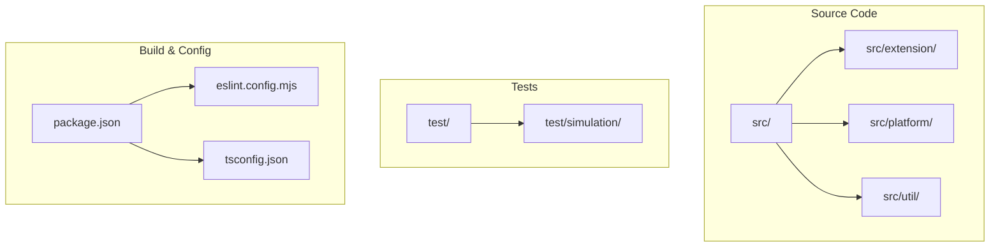
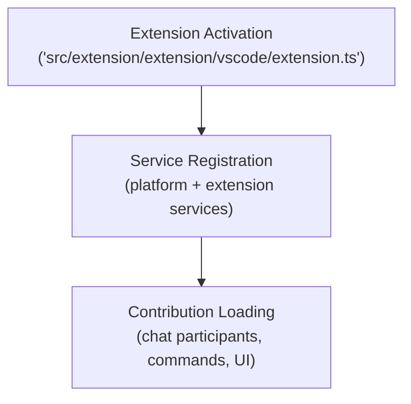
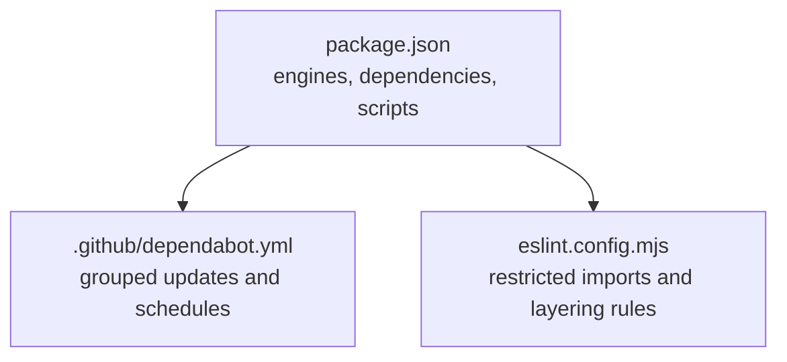

# Contributing Guidelines

<cite>
**Referenced Files in This Document**
- [CONTRIBUTING.md](file://CONTRIBUTING.md)
- [CODE_OF_CONDUCT.md](file://CODE_OF_CONDUCT.md)
- [README.md](file://README.md)
- [LICENSE.txt](file://LICENSE.txt)
- [SECURITY.md](file://SECURITY.md)
- [.github/copilot-instructions.md](file://.github/copilot-instructions.md)
- [package.json](file://package.json)
- [eslint.config.mjs](file://eslint.config.mjs)
- [.github/dependabot.yml](file://.github/dependabot.yml)
- [test/simulation/baseline.json](file://test/simulation/baseline.json)
</cite>

## Table of Contents
1. [Introduction](#introduction)
2. [Project Structure](#project-structure)
3. [Core Components](#core-components)
4. [Architecture Overview](#architecture-overview)
5. [Detailed Component Analysis](#detailed-component-analysis)
6. [Dependency Analysis](#dependency-analysis)
7. [Performance Considerations](#performance-considerations)
8. [Troubleshooting Guide](#troubleshooting-guide)
9. [Conclusion](#conclusion)
10. [Appendices](#appendices)

## Introduction
Thank you for your interest in contributing to VSCode Copilot Chat. This document consolidates the contribution process, development workflow, code quality standards, testing requirements, and community guidelines for the project. It is derived from the repository’s official contribution and policy documents, ensuring that all contributors can align their efforts with the project’s architecture, standards, and operational practices.

## Project Structure
The repository is organized into several major areas:
- Source code: organized by feature and runtime layer (common, vscode, node, vscode-node, worker, vscode-worker)
- Platform services and utilities
- Tests and simulation workbenches
- Build configuration and scripts
- Documentation and assets

Key entry points and guidance for making changes are documented in the Copilot Instructions, which outlines the layered architecture, coding standards, and recommended locations for implementing features.

**Diagram sources**
- [.github/copilot-instructions.md](file://.github/copilot-instructions.md#L39-L138)
- [package.json](file://package.json#L1-L120)

**Section sources**
- [.github/copilot-instructions.md](file://.github/copilot-instructions.md#L39-L138)
- [CONTRIBUTING.md](file://CONTRIBUTING.md#L186-L267)

## Core Components
This section summarizes the essential components and standards that govern contributions.

- Code of Conduct: The project adheres to the Microsoft Open Source Code of Conduct. Contributors are expected to follow the conduct and use the provided resources for reporting and support.
- Licensing: The project is licensed under the MIT License. Contributions are subject to the terms of the license.
- Security: Security issues must not be reported via public GitHub issues. Follow the repository’s security reporting guidance.
- Community Standards: Use respectful and inclusive language. Follow the project’s communication guidelines and moderation channels.

**Section sources**
- [CODE_OF_CONDUCT.md](file://CODE_OF_CONDUCT.md#L1-L10)
- [LICENSE.txt](file://LICENSE.txt#L1-L21)
- [SECURITY.md](file://SECURITY.md#L1-L14)

## Architecture Overview
The project follows a layered architecture with clear separation between platform services and extension features. The Copilot Instructions document provides a comprehensive overview of the system, including:
- Directory structure and feature grouping
- Extension activation flow
- Chat and agent systems
- Inline chat and editing capabilities
- Language model integration and tooling
- Coding standards and testing practices

**Diagram sources**
- [.github/copilot-instructions.md](file://.github/copilot-instructions.md#L139-L156)

**Section sources**
- [.github/copilot-instructions.md](file://.github/copilot-instructions.md#L39-L138)

## Detailed Component Analysis

### Contribution Process
- Issue reporting: Search existing issues before filing. Provide reproducible steps, environment details, and relevant logs. Use the built-in issue reporter to collect system and extension information.
- Feature requests: Follow the same search and reporting guidelines. Provide clear acceptance criteria and context.
- Pull requests: Ensure tests pass, maintain code quality, and update documentation as needed. Simulation tests require cache population and baseline updates.

**Section sources**
- [CONTRIBUTING.md](file://CONTRIBUTING.md#L30-L66)
- [CONTRIBUTING.md](file://CONTRIBUTING.md#L85-L123)

### Development Workflow
- Requirements: Node.js, Python, Git LFS, and platform-specific build tools as needed.
- First-time setup: Install dependencies, obtain tokens, and use the provided launch configurations to build and debug.
- Testing: Run unit tests, extension integration tests, and simulation tests. Simulation tests require cache population and baseline updates.
- Prompt development: Use the TSX-based prompt framework for dynamic composition and pruning under token budgets.
- Troubleshooting: Use the “Show Chat Debug View” to inspect requests and export logs for issue reports.

**Section sources**
- [CONTRIBUTING.md](file://CONTRIBUTING.md#L69-L127)
- [CONTRIBUTING.md](file://CONTRIBUTING.md#L128-L185)
- [CONTRIBUTING.md](file://CONTRIBUTING.md#L295-L308)

### Code Quality Standards
- Coding standards: Indentation with tabs, naming conventions, string quoting, arrow functions, conditionals, and comments.
- Architecture patterns: Service-oriented design, contribution-based modularity, event-driven patterns, and layered separation.
- Type management: Avoid global exports unless necessary, prefer strong types, and minimize use of any/unknown.
- ESLint configuration: Enforces stylistic rules, restricted imports, and project-specific checks for layered code and test hygiene.

**Section sources**
- [.github/copilot-instructions.md](file://.github/copilot-instructions.md#L186-L261)
- [eslint.config.mjs](file://eslint.config.mjs#L28-L539)

### Testing Requirements
- Unit tests: Run with the provided npm scripts.
- Integration tests: Execute within the VS Code extension host.
- Simulation tests: Reach out to Copilot API endpoints, cache results, and require baseline updates. Cache population is required for PRs.

**Section sources**
- [CONTRIBUTING.md](file://CONTRIBUTING.md#L85-L123)
- [test/simulation/baseline.json](file://test/simulation/baseline.json#L1-L20)

### Branch Management and Commit Conventions
- Branching: Use feature branches for contributions. Keep branches focused and up to date with upstream.
- Commits: Follow conventional commit practices where applicable. Keep commits small and focused.
- PRs: Include a clear description, link to related issues, and ensure all checks pass.

[No sources needed since this section provides general guidance]

### Code Review Processes
- Reviews: Expect feedback on adherence to standards, architecture, and test coverage.
- Changes: Address reviewer comments promptly and update tests and documentation as needed.

[No sources needed since this section provides general guidance]

### Types of Contributions
- Bug fixes: Provide reproduction steps, environment details, and a minimal fix with tests.
- Feature additions: Align with the layered architecture and coding standards. Include tests and documentation.
- Documentation improvements: Keep documentation accurate and consistent with the project’s style.
- Test enhancements: Improve coverage and reliability of unit, integration, and simulation tests.

**Section sources**
- [CONTRIBUTING.md](file://CONTRIBUTING.md#L128-L185)
- [.github/copilot-instructions.md](file://.github/copilot-instructions.md#L280-L345)

### Development Environment Setup
- Prerequisites: Node.js, Python, Git LFS, and platform-specific build tools.
- Setup: Install dependencies, obtain tokens, and use the provided launch configurations to build and debug.
- Running with Code OSS: Follow the documented steps for desktop and web environments.

**Section sources**
- [CONTRIBUTING.md](file://CONTRIBUTING.md#L69-L84)
- [CONTRIBUTING.md](file://CONTRIBUTING.md#L335-L439)

### Debugging Issues
- Use the “Show Chat Debug View” to inspect requests, tools, and responses.
- Export request logs for issue reports, mindful of sensitive information.

**Section sources**
- [CONTRIBUTING.md](file://CONTRIBUTING.md#L299-L308)

### API Updates and Compatibility
- Proposed API: Maintain compatibility with VS Code engines and proposed API versions. Adopt changes in lockstep with VS Code releases.
- Breaking vs additive changes: Breaking changes require updating API versions; additive changes require updating engine dates.

**Section sources**
- [CONTRIBUTING.md](file://CONTRIBUTING.md#L309-L334)

### Release Process, Versioning, and Maintenance
- Versioning: Releases align with VS Code due to deep UI integration. Use the latest Copilot Chat versions with the latest VS Code.
- Maintenance: Keep dependencies updated and follow the project’s dependency management guidance.

**Section sources**
- [README.md](file://README.md#L55-L67)
- [.github/dependabot.yml](file://.github/dependabot.yml#L1-L66)

## Dependency Analysis
The project’s dependencies and compatibility are managed centrally in the package manifest and enforced by ESLint rules. The dependency update policy groups and schedules updates to maintain stability.

**Diagram sources**
- [package.json](file://package.json#L25-L29)
- [.github/dependabot.yml](file://.github/dependabot.yml#L1-L66)
- [eslint.config.mjs](file://eslint.config.mjs#L174-L291)

**Section sources**
- [package.json](file://package.json#L25-L29)
- [.github/dependabot.yml](file://.github/dependabot.yml#L1-L66)
- [eslint.config.mjs](file://eslint.config.mjs#L174-L291)

## Performance Considerations
- Simulation tests: Cache results to speed up reruns and reduce costs. Populate caches before submitting PRs.
- Layered architecture: Favor shared platform services and avoid unnecessary runtime-specific code to maximize portability across node.js and web workers.

**Section sources**
- [CONTRIBUTING.md](file://CONTRIBUTING.md#L100-L123)
- [.github/copilot-instructions.md](file://.github/copilot-instructions.md#L206-L211)

## Troubleshooting Guide
- Compilation errors: Use the watch tasks to catch errors early. Fix all compilation errors before running scripts.
- Simulation test failures: Ensure cache is populated and baseline is updated. Verify that cache layers are created on the development machine and not committed as-is by community contributors.
- Debug logs: Use the “Show Chat Debug View” to inspect requests and export logs for issue reports.

**Section sources**
- [.github/copilot-instructions.md](file://.github/copilot-instructions.md#L26-L37)
- [CONTRIBUTING.md](file://CONTRIBUTING.md#L100-L123)
- [CONTRIBUTING.md](file://CONTRIBUTING.md#L299-L308)

## Conclusion
By following these guidelines, contributors can effectively collaborate on VSCode Copilot Chat while maintaining high code quality, consistent architecture, and strong testing practices. Adhering to the project’s standards and community guidelines ensures a positive and productive development experience for everyone.

## Appendices
- Communication guidelines: Use respectful and inclusive language; follow the Code of Conduct and moderation channels.
- Security reporting: Do not use public issues for vulnerabilities; follow the repository’s security reporting guidance.
- Licensing: Contributions are subject to the MIT License.

**Section sources**
- [CODE_OF_CONDUCT.md](file://CODE_OF_CONDUCT.md#L1-L10)
- [SECURITY.md](file://SECURITY.md#L1-L14)
- [LICENSE.txt](file://LICENSE.txt#L1-L21)