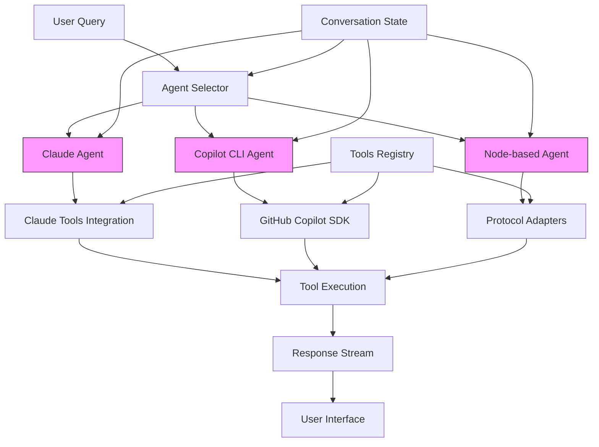
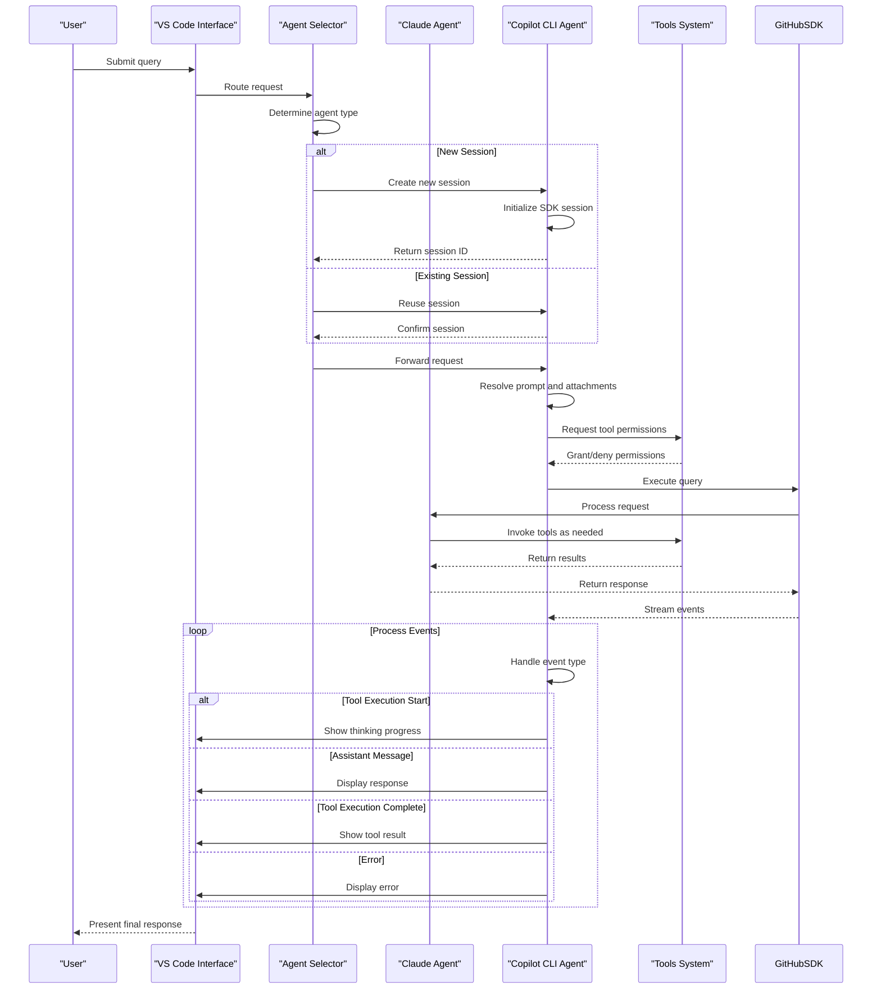
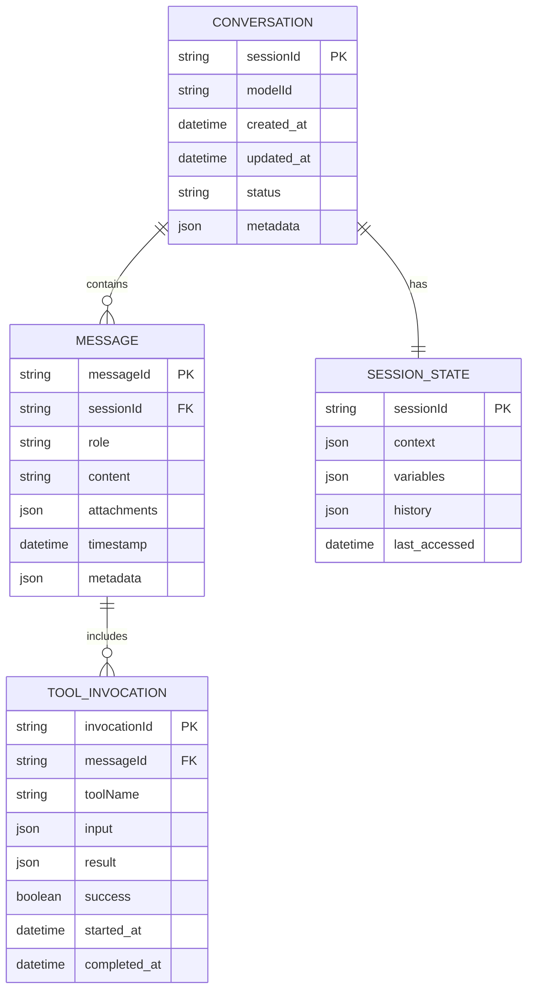
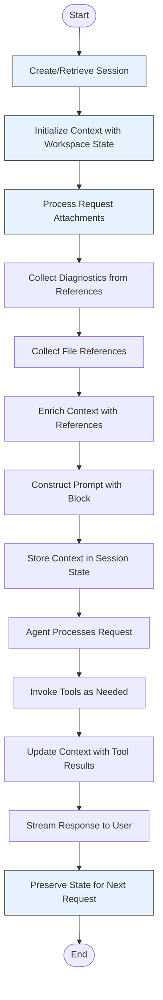
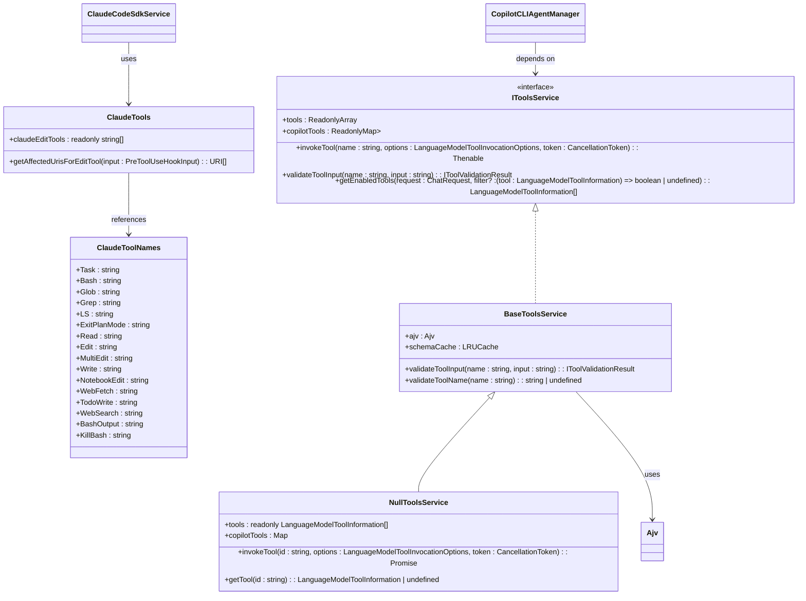
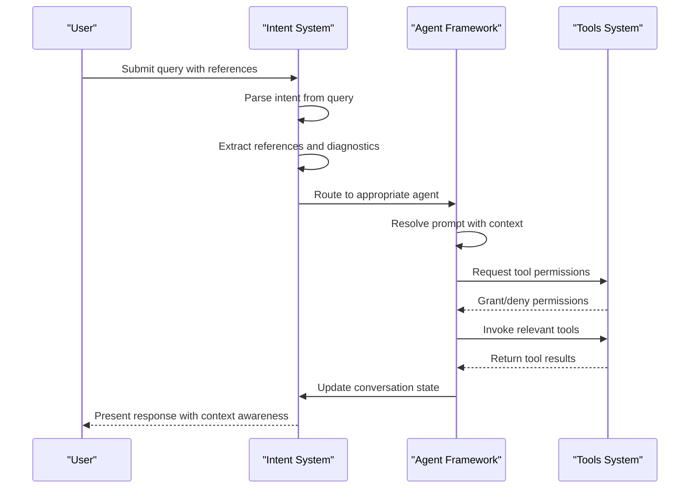
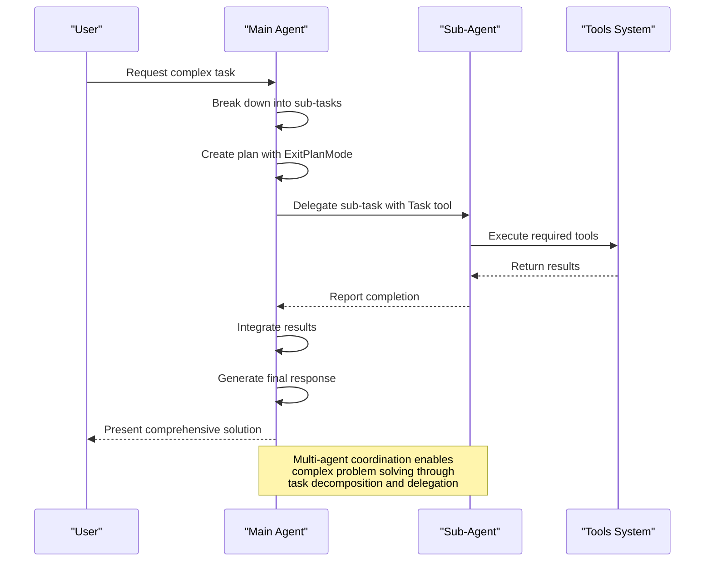

# AI Agents

<cite>
**Referenced Files in This Document**   
- [claudeTools.ts](file://src/extension/agents/claude/common/claudeTools.ts)
- [claudeCodeSdkService.ts](file://src/extension/agents/claude/node/claudeCodeSdkService.ts)
- [copilotcliAgentManager.ts](file://src/extension/agents/copilotcli/node/copilotcliAgentManager.ts)
- [copilotcliPromptResolver.ts](file://src/extension/agents/copilotcli/node/copilotcliPromptResolver.ts)
- [toolInvocationFormatter.ts](file://src/extension/agents/claude/common/toolInvocationFormatter.ts)
- [toolsService.ts](file://src/extension/tools/common/toolsService.ts)
- [types.ts](file://src/extension/agents/node/adapters/types.ts)
- [agentConversationHistory.tsx](file://src/extension/prompts/node/agent/agentConversationHistory.tsx)
</cite>

## Table of Contents
1. [Introduction](#introduction)
2. [Agent Framework Architecture](#agent-framework-architecture)
3. [Core Agent Implementations](#core-agent-implementations)
4. [Agent Invocation and Selection](#agent-invocation-and-selection)
5. [Domain Model for Agent Conversations](#domain-model-for-agent-conversations)
6. [State Management and Context Propagation](#state-management-and-context-propagation)
7. [Tool Integration and Code Manipulation](#tool-integration-and-code-manipulation)
8. [Configuration Options and Model Parameters](#configuration-options-and-model-parameters)
9. [Return Value Patterns and Response Handling](#return-value-patterns-and-response-handling)
10. [Integration with Intent System](#integration-with-intent-system)
11. [Common Issues and Solutions](#common-issues-and-solutions)
12. [Multi-step Reasoning and Agent Coordination](#multi-step-reasoning-and-agent-coordination)

## Introduction
The AI agent system in GitHub Copilot Chat provides a sophisticated framework for intelligent code assistance through multiple specialized agent implementations. This documentation details the architecture and implementation of the agent framework, focusing on the Claude agent, Copilot CLI agent, and node-based agent systems. The system enables natural language interaction for code generation, editing, and problem-solving by leveraging large language models and tool integration. Agents process user queries, maintain conversation state, and coordinate with various tools to execute complex tasks while preserving context across interactions.

## Agent Framework Architecture



**Diagram sources**
- [copilotcliAgentManager.ts](file://src/extension/agents/copilotcli/node/copilotcliAgentManager.ts#L25-L235)
- [types.ts](file://src/extension/agents/node/adapters/types.ts#L37-L91)
- [claudeCodeSdkService.ts](file://src/extension/agents/claude/node/claudeCodeSdkService.ts#L9-L38)

**Section sources**
- [copilotcliAgentManager.ts](file://src/extension/agents/copilotcli/node/copilotcliAgentManager.ts#L25-L235)
- [types.ts](file://src/extension/agents/node/adapters/types.ts#L37-L91)

## Core Agent Implementations

### Claude Agent Implementation
The Claude agent implementation leverages the Anthropic Claude model through a specialized SDK integration. It provides advanced code understanding and generation capabilities with a rich set of tools for file operations, code editing, and system interactions. The agent is designed to handle complex coding tasks through multi-step reasoning and tool coordination.

```mermaid
classDiagram
class ClaudeCodeSdkService {
+_serviceBrand : undefined
+query(options : {prompt : AsyncIterable<SDKUserMessage>, options : Options}) : Promise<Query>
}
class IClaudeCodeSdkService {
<<interface>>
+_serviceBrand : undefined
+query(options : {prompt : AsyncIterable<SDKUserMessage>, options : Options}) : Promise<Query>
}
IClaudeCodeSdkService <|.. ClaudeCodeSdkService
ClaudeCodeSdkService --> "1" Query : creates
Query --> "1..*" SDKUserMessage : contains
class ClaudeToolNames {
+Task : string
+Bash : string
+Glob : string
+Grep : string
+LS : string
+ExitPlanMode : string
+Read : string
+Edit : string
+MultiEdit : string
+Write : string
+NotebookEdit : string
+WebFetch : string
+TodoWrite : string
+WebSearch : string
+BashOutput : string
+KillBash : string
}
ClaudeCodeSdkService --> ClaudeToolNames : uses
```

**Diagram sources**
- [claudeCodeSdkService.ts](file://src/extension/agents/claude/node/claudeCodeSdkService.ts#L9-L38)
- [claudeTools.ts](file://src/extension/agents/claude/common/claudeTools.ts#L9-L26)

**Section sources**
- [claudeCodeSdkService.ts](file://src/extension/agents/claude/node/claudeCodeSdkService.ts#L9-L38)
- [claudeTools.ts](file://src/extension/agents/claude/common/claudeTools.ts#L9-L26)

### Copilot CLI Agent Implementation
The Copilot CLI agent serves as a bridge between the VS Code extension and the GitHub Copilot SDK, enabling access to advanced AI capabilities through a session-based architecture. This agent manages authentication, session lifecycle, and tool permission handling while providing a seamless interface for natural language interactions.

```mermaid
classDiagram
class CopilotCLIAgentManager {
+findSession(sessionId : string) : CopilotCLISession | undefined
+handleRequest(copilotcliSessionId : string | undefined, request : vscode.ChatRequest, context : vscode.ChatContext, stream : vscode.ChatResponseStream, modelId : ModelProvider | undefined, token : vscode.CancellationToken) : Promise<{ copilotcliSessionId : string | undefined }>
}
class CopilotCLISession {
+sessionId : string
+query(prompt : string, attachments : Attachment[], options : AgentOptions) : AsyncGenerator<SessionEvent>
+invoke(prompt : string, attachments : Attachment[], toolInvocationToken : vscode.ChatParticipantToolToken, stream : vscode.ChatResponseStream, modelId : ModelProvider | undefined, token : vscode.CancellationToken) : Promise<void>
+_processEvent(event : SessionEvent, stream : vscode.ChatResponseStream, toolInvocationToken : vscode.ChatParticipantToolToken) : void
+requestPermission(permissionRequest : PermissionRequest, toolInvocationToken : vscode.ChatParticipantToolToken) : Promise<{ kind : 'approved' } | { kind : 'denied-interactively-by-user' }>
}
CopilotCLIAgentManager --> CopilotCLISession : creates/manages
CopilotCLISession --> Agent : uses SDK
Agent --> SessionEvent : processes
SessionEvent --> ChatResponseStream : outputs to
class SessionEvent {
+type : string
+data : object
}
SessionEvent <|-- AssistantTurnStart
SessionEvent <|-- AssistantTurnEnd
SessionEvent <|-- AssistantMessage
SessionEvent <|-- ToolExecutionStart
SessionEvent <|-- ToolExecutionComplete
SessionEvent <|-- SessionError
class ChatResponseStream {
+markdown(content : string) : void
+push(part : ChatResponsePart) : void
}
ChatResponseStream <|-- Stream
```

**Diagram sources**
- [copilotcliAgentManager.ts](file://src/extension/agents/copilotcli/node/copilotcliAgentManager.ts#L25-L235)

**Section sources**
- [copilotcliAgentManager.ts](file://src/extension/agents/copilotcli/node/copilotcliAgentManager.ts#L25-L235)

### Node-based Agent Implementation
The node-based agent implementation provides a flexible adapter pattern for integrating with various language models and protocols. It defines a standardized interface for request parsing, streaming responses, and protocol-specific formatting, enabling extensibility across different AI service providers.

```mermaid
classDiagram
class IProtocolAdapter {
<<interface>>
+name : string
+parseRequest(body : string) : IParsedRequest
+formatStreamResponse(streamData : IAgentStreamBlock, context : IStreamingContext) : readonly IStreamEventData[]
+generateFinalEvents(context : IStreamingContext, usage? : APIUsage) : readonly IStreamEventData[]
+getContentType() : string
+extractAuthKey(headers : http.IncomingHttpHeaders) : string | undefined
}
class IProtocolAdapterFactory {
<<interface>>
+createAdapter() : IProtocolAdapter
}
class IParsedRequest {
+model? : string
+messages : readonly Raw.ChatMessage[]
+options? : IMakeChatRequestOptions['requestOptions']
+type? : string
}
class IAgentStreamBlock {
<<abstract>>
}
IAgentStreamBlock <|-- IAgentTextBlock
IAgentStreamBlock <|-- IAgentToolCallBlock
class IAgentTextBlock {
+type : 'text'
+content : string
}
class IAgentToolCallBlock {
+type : 'tool_call'
+callId : string
+name : string
+input : object
}
class IStreamingContext {
+requestId : string
+endpoint : { modelId : string, modelMaxPromptTokens : number }
}
IProtocolAdapterFactory --> IProtocolAdapter : creates
IProtocolAdapter --> IParsedRequest : processes
IProtocolAdapter --> IAgentStreamBlock : formats
IAgentStreamBlock --> IStreamEventData : converts
```

**Diagram sources**
- [types.ts](file://src/extension/agents/node/adapters/types.ts#L37-L91)

**Section sources**
- [types.ts](file://src/extension/agents/node/adapters/types.ts#L37-L91)

## Agent Invocation and Selection



**Diagram sources**
- [copilotcliAgentManager.ts](file://src/extension/agents/copilotcli/node/copilotcliAgentManager.ts#L42-L73)
- [copilotcliPromptResolver.ts](file://src/extension/agents/copilotcli/node/copilotcliPromptResolver.ts#L22-L108)

**Section sources**
- [copilotcliAgentManager.ts](file://src/extension/agents/copilotcli/node/copilotcliAgentManager.ts#L42-L73)
- [copilotcliPromptResolver.ts](file://src/extension/agents/copilotcli/node/copilotcliPromptResolver.ts#L22-L108)

## Domain Model for Agent Conversations



**Section sources**
- [agentConversationHistory.tsx](file://src/extension/prompts/node/agent/agentConversationHistory.tsx)

## State Management and Context Propagation



**Section sources**
- [copilotcliPromptResolver.ts](file://src/extension/agents/copilotcli/node/copilotcliPromptResolver.ts#L22-L108)
- [agentConversationHistory.tsx](file://src/extension/prompts/node/agent/agentConversationHistory.tsx)

## Tool Integration and Code Manipulation



**Diagram sources**
- [claudeTools.ts](file://src/extension/agents/claude/common/claudeTools.ts#L9-L60)
- [toolsService.ts](file://src/extension/tools/common/toolsService.ts#L46-L253)

**Section sources**
- [claudeTools.ts](file://src/extension/agents/claude/common/claudeTools.ts#L9-L60)
- [toolsService.ts](file://src/extension/tools/common/toolsService.ts#L46-L253)

## Configuration Options and Model Parameters

```mermaid
flowchart TD
Start([Configuration Start]) --> ModelSelection["Select Model Provider"]
ModelSelection --> alt Default Model
ModelSelection --> ClaudeSonnet["Use claude-sonnet-4.5"]
else Custom Model
ModelSelection --> UserSelection["Use user-specified model"]
end
ModelSelection --> SessionOptions["Configure Session Options"]
SessionOptions --> Authentication["Set Copilot Token"]
Authentication --> Environment["Set Environment Variables"]
Environment --> WorkingDirectory["Set Working Directory"]
WorkingDirectory --> AbortController["Initialize Abort Controller"]
AbortController --> PermissionHandler["Set Request Permission Handler"]
PermissionHandler --> Logger["Set Logger"]
Logger --> SDKSession["Create SDK Session"]
SDKSession --> RequestProcessing["Process Request with Options"]
RequestProcessing --> End([Configuration Complete])
style ModelSelection fill:#ffebcc,stroke:#333
style SessionOptions fill:#ffebcc,stroke:#333
style SDKSession fill:#ffebcc,stroke:#333
```

**Section sources**
- [copilotcliAgentManager.ts](file://src/extension/agents/copilotcli/node/copilotcliAgentManager.ts#L125-L143)

## Return Value Patterns and Response Handling

```mermaid
flowchart TD
Start([Event Received]) --> EventType["Determine Event Type"]
EventType --> alt Assistant Turn Start/End
EventType --> ClearTools["Clear Tool Names Map"]
ClearTools --> Continue["Continue Processing"]
else Assistant Message
EventType --> HasContent["Check for Content"]
HasContent --> yes --> StreamMarkdown["Stream Markdown Content"]
StreamMarkdown --> Continue
HasContent --> no --> Continue
else Tool Execution Start
EventType --> ProcessStart["Process Tool Execution Start"]
ProcessStart --> GenerateThinking["Generate Thinking Progress Part"]
GenerateThinking --> StreamThinking["Stream Thinking Part"]
StreamThinking --> LogStart["Log Tool Start"]
LogStart --> Continue
else Tool Execution Complete
EventType --> ProcessComplete["Process Tool Execution Complete"]
ProcessComplete --> GetResult["Get Tool Result Part"]
GetResult --> IsNotThinking["Check if Not Thinking Part"]
IsNotThinking --> yes --> StreamResult["Stream Result Part"]
StreamResult --> LogComplete["Log Tool Completion"]
LogComplete --> Continue
IsNotThinking --> no --> Continue
else Session Error
EventType --> LogError["Log Error Message"]
LogError --> StreamError["Stream Error Markdown"]
StreamError --> Continue
else Unknown Event
EventType --> LogUnknown["Log Unknown Event"]
LogUnknown --> Continue
end
Continue --> End([Event Processing Complete])
style EventType fill:#e6f3ff,stroke:#333
style StreamMarkdown fill:#d5e8d4,stroke:#333
style StreamThinking fill:#d5e8d4,stroke:#333
style StreamResult fill:#d5e8d4,stroke:#333
style StreamError fill:#f8cecc,stroke:#333
```

**Section sources**
- [copilotcliAgentManager.ts](file://src/extension/agents/copilotcli/node/copilotcliAgentManager.ts#L160-L212)

## Integration with Intent System



**Section sources**
- [copilotcliPromptResolver.ts](file://src/extension/agents/copilotcli/node/copilotcliPromptResolver.ts#L22-L108)

## Common Issues and Solutions

### Agent Switching and Context Preservation
When switching between agents or maintaining context across sessions, the system employs several strategies to ensure continuity and prevent data loss:

1. **Session State Management**: Each agent session maintains its own state that persists across requests, allowing for context preservation even when switching between different agent types.

2. **Context Serialization**: Conversation history and state are serialized and stored in the session, enabling restoration when returning to a previous conversation.

3. **Reference Tracking**: The system tracks all references (files, diagnostics, etc.) and maintains their state across agent invocations.

4. **Tool State Consistency**: Tool invocations and their results are recorded in the conversation history, ensuring that subsequent agents can access previous tool outputs.

**Section sources**
- [agentConversationHistory.tsx](file://src/extension/prompts/node/agent/agentConversationHistory.tsx)
- [copilotcliAgentManager.ts](file://src/extension/agents/copilotcli/node/copilotcliAgentManager.ts#L77-L97)

## Multi-step Reasoning and Agent Coordination



**Diagram sources**
- [claudeTools.ts](file://src/extension/agents/claude/common/claudeTools.ts#L40-L44)
- [toolInvocationFormatter.ts](file://src/extension/agents/claude/common/toolInvocationFormatter.ts#L91-L94)

**Section sources**
- [claudeTools.ts](file://src/extension/agents/claude/common/claudeTools.ts#L40-L44)
- [toolInvocationFormatter.ts](file://src/extension/agents/claude/common/toolInvocationFormatter.ts#L91-L94)