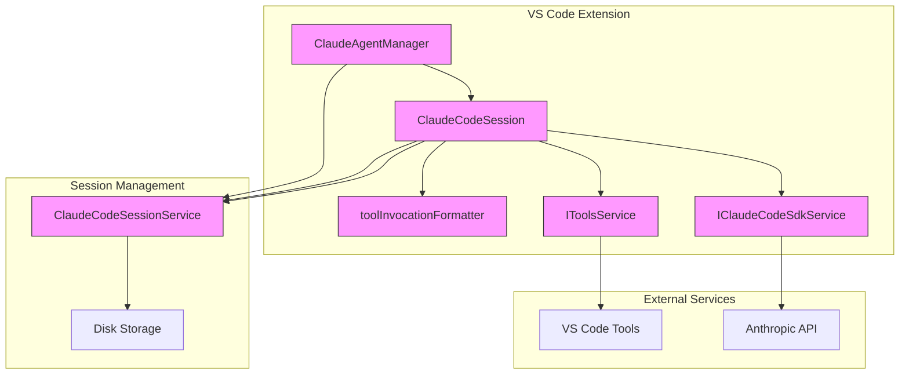
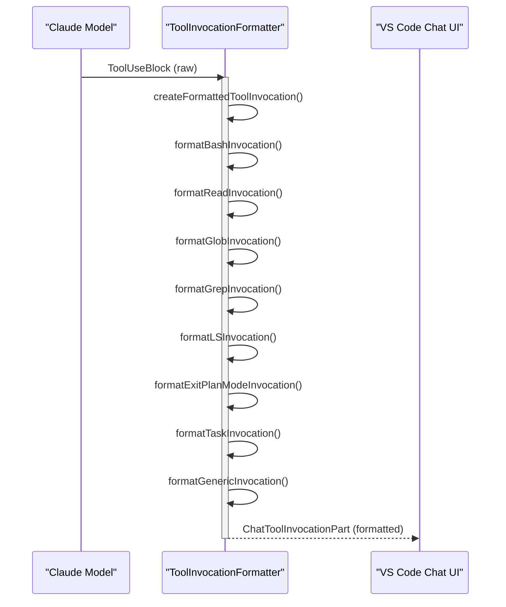
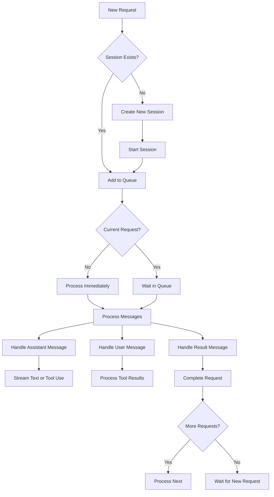
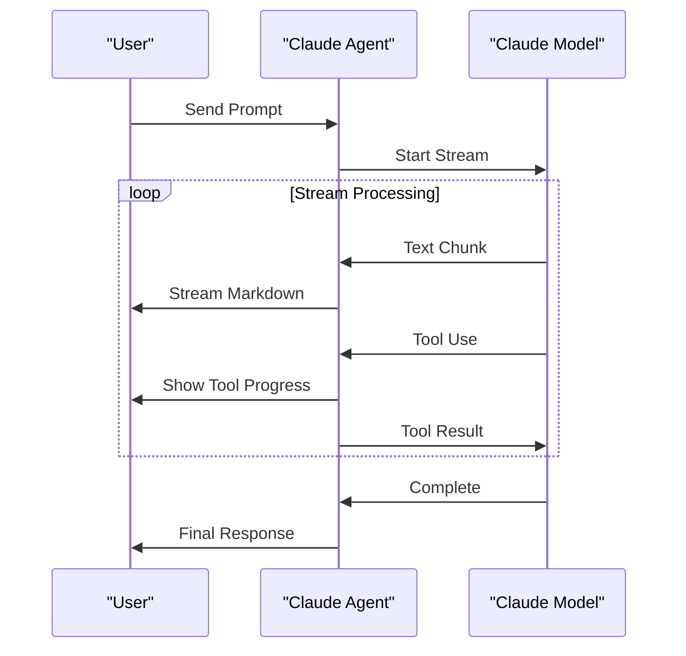

# Claude Agent

<cite>
**Referenced Files in This Document**   
- [claudeCodeSdkService.ts](file://src/extension/agents/claude/node/claudeCodeSdkService.ts)
- [claudeCodeAgent.ts](file://src/extension/agents/claude/node/claudeCodeAgent.ts)
- [claudeTools.ts](file://src/extension/agents/claude/common/claudeTools.ts)
- [toolInvocationFormatter.ts](file://src/extension/agents/claude/common/toolInvocationFormatter.ts)
- [claudeCodeSessionService.ts](file://src/extension/agents/claude/node/claudeCodeSessionService.ts)
- [langModelServer.ts](file://src/extension/agents/node/langModelServer.ts)
</cite>

## Table of Contents
1. [Introduction](#introduction)
2. [Architecture Overview](#architecture-overview)
3. [Core Components](#core-components)
4. [Claude Code SDK Integration](#claude-code-sdk-integration)
5. [Tool Integration and Management](#tool-integration-and-management)
6. [Tool Invocation Formatting](#tool-invocation-formatting)
7. [Session Management and State](#session-management-and-state)
8. [Configuration and Model Parameters](#configuration-and-model-parameters)
9. [Error Handling and Rate Limiting](#error-handling-and-rate-limiting)
10. [Streaming Responses and Multi-turn Conversations](#streaming-responses-and-multi-turn-conversations)
11. [Conclusion](#conclusion)

## Introduction

The Claude Agent implementation in GitHub Copilot Chat provides a sophisticated integration between the VS Code environment and Anthropic's Claude language models. This document details the architecture and implementation of the agent, focusing on how it manages language model interactions, tool integration, and multi-step reasoning workflows. The system is designed to enable seamless AI-assisted development by bridging the gap between the IDE's capabilities and the language model's reasoning abilities.

The agent architecture follows a modular design pattern, with clear separation of concerns between SDK integration, tool management, session state, and user interface components. This design enables robust error handling, efficient state management, and extensible tool integration while maintaining a responsive user experience through streaming responses and asynchronous processing.

**Section sources**
- [claudeCodeAgent.ts](file://src/extension/agents/claude/node/claudeCodeAgent.ts#L1-L128)

## Architecture Overview

The Claude Agent architecture consists of several interconnected components that work together to provide AI-powered assistance in VS Code. At its core, the system integrates with Anthropic's Claude Code SDK to handle language model interactions while providing a rich set of tools that extend the model's capabilities to interact with the development environment.



**Diagram sources **
- [claudeCodeAgent.ts](file://src/extension/agents/claude/node/claudeCodeAgent.ts#L29-L148)
- [claudeCodeSdkService.ts](file://src/extension/agents/claude/node/claudeCodeSdkService.ts#L9-L38)
- [claudeCodeSessionService.ts](file://src/extension/agents/claude/node/claudeCodeSessionService.ts#L44-L54)

## Core Components

The Claude Agent system comprises several core components that work together to provide AI-powered assistance. The `ClaudeAgentManager` serves as the entry point, managing the lifecycle of Claude sessions and coordinating between the language model server and the chat interface. Each active conversation is handled by a `ClaudeCodeSession` instance, which maintains the state for a specific interaction with the language model.

The architecture implements a request queue system that ensures proper ordering of user requests while handling cancellation and error conditions gracefully. Sessions are designed to be disposable, with proper cleanup of resources and cancellation of ongoing operations when a session is terminated. The system also includes comprehensive logging to aid in debugging and monitoring of agent behavior.

**Section sources**
- [claudeCodeAgent.ts](file://src/extension/agents/claude/node/claudeCodeAgent.ts#L29-L148)
- [claudeCodeAgent.ts](file://src/extension/agents/claude/node/claudeCodeAgent.ts#L149-L180)

## Claude Code SDK Integration

The integration with the Anthropic API is managed through the `IClaudeCodeSdkService` interface and its implementation `ClaudeCodeSdkService`. This service abstraction provides a clean separation between the SDK functionality and the rest of the agent system, enabling easier testing and potential replacement of the underlying SDK if needed.

```mermaid
classDiagram
class IClaudeCodeSdkService {
<<interface>>
+_serviceBrand : undefined
+query(options : {prompt : AsyncIterable<SDKUserMessage>, options : Options}) : Promise<Query>
}
class ClaudeCodeSdkService {
+_serviceBrand : undefined
+query(options : {prompt : AsyncIterable<SDKUserMessage>, options : Options}) : Promise<Query>
}
IClaudeCodeSdkService <|.. ClaudeCodeSdkService : implements
class Options {
+cwd : string
+abortController : AbortController
+executable : 'node'
+env : Record<string, string>
+resume : string
+canUseTool : (name : string, input : Record<string, unknown>) => Promise<{behavior : 'allow'|'deny', updatedInput : Record<string, unknown>}>
+appendSystemPrompt : string
}
class Query {
+[Symbol.asyncIterator]() : AsyncIterator<SDKMessage>
}
ClaudeCodeSdkService --> Options : uses
ClaudeCodeSdkService --> Query : returns
```

**Diagram sources **
- [claudeCodeSdkService.ts](file://src/extension/agents/claude/node/claudeCodeSdkService.ts#L9-L38)
- [claudeCodeAgent.ts](file://src/extension/agents/claude/node/claudeCodeAgent.ts#L272-L277)

The SDK integration is configured with several important options that customize the behavior of the language model interaction. The environment variables are carefully set to ensure the Claude CLI can access necessary tools like ripgrep, with the PATH extended to include the VS Code bundled version. The ANTHROPIC_BASE_URL and ANTHROPIC_API_KEY are configured to route requests through a local language model server, which acts as a proxy to the actual Anthropic API.

The integration also includes a custom system prompt that instructs the model to format responses as markdown, ensuring proper rendering in the VS Code chat interface. The `canUseTool` callback is implemented to handle tool permission requests, requiring user confirmation before executing potentially dangerous operations like file modifications or shell commands.

**Section sources**
- [claudeCodeSdkService.ts](file://src/extension/agents/claude/node/claudeCodeSdkService.ts#L9-L38)
- [claudeCodeAgent.ts](file://src/extension/agents/claude/node/claudeCodeAgent.ts#L243-L277)

## Tool Integration and Management

The Claude Agent implements a comprehensive tool integration system that allows the language model to interact with the development environment through a set of predefined tools. These tools are defined in the `ClaudeToolNames` enum and include capabilities for file operations, shell execution, code search, and task management.

```mermaid
classDiagram
class ClaudeToolNames {
+Task : 'Task'
+Bash : 'Bash'
+Glob : 'Glob'
+Grep : 'Grep'
+LS : 'LS'
+ExitPlanMode : 'ExitPlanMode'
+Read : 'Read'
+Edit : 'Edit'
+MultiEdit : 'MultiEdit'
+Write : 'Write'
+NotebookEdit : 'NotebookEdit'
+WebFetch : 'WebFetch'
+TodoWrite : 'TodoWrite'
+WebSearch : 'WebSearch'
+BashOutput : 'BashOutput'
+KillBash : 'KillBash'
}
class ITodoWriteInput {
+todos : {content : string, status : 'pending'|'in_progress'|'completed', activeForm : string}[]
}
class IExitPlanModeInput {
+plan : string
}
class ITaskToolInput {
+description : string
+subagent_type : string
+prompt : string
}
class claudeEditTools {
+Edit : string
+MultiEdit : string
+Write : string
+NotebookEdit : string
}
class getAffectedUrisForEditTool {
+getAffectedUrisForEditTool(input : PreToolUseHookInput) : URI[]
}
getAffectedUrisForEditTool --> ClaudeToolNames : uses
getAffectedUrisForEditTool --> URI : returns
```

**Diagram sources **
- [claudeTools.ts](file://src/extension/agents/claude/common/claudeTools.ts#L9-L60)

The tool system is designed with security and user control in mind. Before executing any tool, the agent presents a confirmation dialog to the user, showing the tool name and input parameters in a formatted manner. This prevents unauthorized or potentially harmful operations from being executed without explicit user approval.

Certain tools are automatically approved based on safety analysis. For example, file edit operations are auto-approved if the target file is determined to be safe for modification based on workspace context and file type. This balance between security and usability ensures that common operations can proceed smoothly while maintaining protection against potentially dangerous actions.

The tool integration also includes special handling for specific tool types. The `TodoWrite` tool, for instance, is suppressed in the UI but triggers a core todo list management tool, allowing the agent to update task lists without cluttering the conversation with tool invocation details.

**Section sources**
- [claudeTools.ts](file://src/extension/agents/claude/common/claudeTools.ts#L9-L60)
- [claudeCodeAgent.ts](file://src/extension/agents/claude/node/claudeCodeAgent.ts#L525-L553)

## Tool Invocation Formatting

The `toolInvocationFormatter.ts` module plays a crucial role in transforming raw tool calls from the Claude API into user-friendly representations in the VS Code chat interface. This formatting layer ensures that tool invocations are presented clearly and consistently, enhancing the user experience and providing transparency into the agent's actions.



**Diagram sources **
- [toolInvocationFormatter.ts](file://src/extension/agents/claude/common/toolInvocationFormatter.ts#L15-L102)
- [claudeCodeAgent.ts](file://src/extension/agents/claude/node/claudeCodeAgent.ts#L467-L478)

The formatter handles different tool types with specialized formatting functions. For example, Bash commands are displayed with syntax highlighting and command-line formatting, while file read operations show the file path as a clickable link. Search operations (Glob, Grep, LS) are formatted to clearly indicate what was searched for and where.

The formatting system also includes logic to suppress certain tool invocations that would clutter the interface without adding value. For instance, the `TodoWrite` tool is completely suppressed since its effects are handled through the core todo management system, and edit operations are not shown as separate invocations since the actual code changes are displayed in the diff view.

Each formatted tool invocation includes metadata that enables proper rendering in the UI, such as whether the tool was confirmed by the user, whether it resulted in an error, and any tool-specific data like command lines or file paths. This rich metadata allows the chat interface to present a comprehensive view of the agent's actions while maintaining a clean and focused conversation flow.

**Section sources**
- [toolInvocationFormatter.ts](file://src/extension/agents/claude/common/toolInvocationFormatter.ts#L15-L102)
- [claudeCodeAgent.ts](file://src/extension/agents/claude/node/claudeCodeAgent.ts#L467-L478)

## Session Management and State

The Claude Agent implements sophisticated session management to maintain conversation state across multiple interactions. The `ClaudeCodeSession` class manages the lifecycle of a single conversation, handling request queuing, state preservation, and proper cleanup when sessions are terminated.



**Diagram sources **
- [claudeCodeAgent.ts](file://src/extension/agents/claude/node/claudeCodeAgent.ts#L149-L409)

Sessions maintain a queue of pending requests, ensuring that user inputs are processed in order while supporting cancellation of individual requests. The system uses a generator pattern to create an async iterable of user messages, which feeds into the Claude SDK's query mechanism. This design allows for efficient handling of multiple requests without blocking the UI.

The session service (`ClaudeCodeSessionService`) provides persistent storage of chat sessions on disk, enabling users to resume conversations across VS Code restarts. Sessions are stored in JSONL format in the user's home directory, with each workspace having its own session folder. The service implements a caching mechanism based on file modification times to efficiently load sessions without unnecessary disk I/O.

State management includes tracking of ongoing edits, with special handling for external edit confirmations. When the model proposes code changes, the system waits for user confirmation through the `externalEdit` stream before proceeding, ensuring that users have control over code modifications in their workspace.

**Section sources**
- [claudeCodeAgent.ts](file://src/extension/agents/claude/node/claudeCodeAgent.ts#L149-L409)
- [claudeCodeSessionService.ts](file://src/extension/agents/claude/node/claudeCodeSessionService.ts#L44-L103)

## Configuration and Model Parameters

The Claude Agent provides extensive configuration options for controlling model behavior and interaction parameters. These settings are exposed through the VS Code configuration system and can be customized by users to suit their preferences and requirements.

The configuration includes options for model selection, temperature settings, and context window management. Temperature controls the randomness of the model's responses, with lower values producing more deterministic outputs and higher values encouraging creativity. The context window is managed automatically by the system, with conversation history preserved across sessions to maintain context for multi-turn interactions.

Additional configuration options include debug settings that enable detailed logging of SDK interactions, which is invaluable for troubleshooting and understanding the agent's behavior. The system also supports custom instructions that can be applied to all conversations, allowing users to personalize the agent's behavior and knowledge.

The agent respects workspace-specific settings, allowing different configurations for different projects. This flexibility enables teams to establish consistent AI assistance patterns within their development workflows while accommodating project-specific requirements.

**Section sources**
- [claudeCodeAgent.ts](file://src/extension/agents/claude/node/claudeCodeAgent.ts#L240-L241)
- [claudeCodeAgent.ts](file://src/extension/agents/claude/node/claudeCodeAgent.ts#L276-L277)

## Error Handling and Rate Limiting

The Claude Agent implements comprehensive error handling to ensure robust operation in the face of API failures, network issues, and other potential problems. The system is designed to provide meaningful feedback to users while maintaining stability and preventing cascading failures.

Error handling is implemented at multiple levels, from the SDK integration layer to the user interface. When API errors occur, they are caught and transformed into user-friendly messages that explain the issue without exposing technical details. The system distinguishes between different types of errors, such as authentication failures, rate limiting, and model execution errors, providing appropriate guidance for each scenario.

Rate limiting is handled through the underlying Claude SDK, which includes built-in mechanisms for managing API request rates. The agent respects these limits and implements retry logic with exponential backoff when appropriate. Users are informed when rate limits are approached or exceeded, with suggestions for alternative actions or timing of requests.

The system also handles cancellation gracefully, ensuring that ongoing operations are properly terminated when users cancel requests. This prevents resource leaks and ensures that the agent remains responsive even when dealing with long-running operations.

**Section sources**
- [claudeCodeAgent.ts](file://src/extension/agents/claude/node/claudeCodeAgent.ts#L86-L95)
- [claudeCodeAgent.ts](file://src/extension/agents/claude/node/claudeCodeAgent.ts#L515-L519)

## Streaming Responses and Multi-turn Conversations

The Claude Agent supports streaming responses to provide immediate feedback to users as the language model generates content. This creates a more natural and responsive interaction pattern, with text appearing progressively rather than waiting for complete responses.



**Diagram sources **
- [claudeCodeAgent.ts](file://src/extension/agents/claude/node/claudeCodeAgent.ts#L374-L409)

The streaming architecture is built around async generators and iterators, enabling efficient processing of large responses without blocking the UI. Text content is streamed directly to the chat interface as markdown, while tool invocations are processed and formatted before being displayed.

Multi-turn conversations are supported through session state management, with the agent maintaining context across multiple exchanges. The system handles complex workflows involving multiple tool invocations, user confirmations, and iterative refinement of responses. Each turn in the conversation is properly sequenced, with the agent waiting for completion of previous operations before proceeding to the next step.

The implementation includes special handling for different message types, ensuring that text, tool uses, and results are processed appropriately. Assistant messages with text content are streamed directly, while tool uses trigger appropriate UI elements and confirmation workflows. User messages containing tool results are processed to update the conversation state and provide feedback on tool execution.

**Section sources**
- [claudeCodeAgent.ts](file://src/extension/agents/claude/node/claudeCodeAgent.ts#L374-L409)
- [claudeCodeAgent.ts](file://src/extension/agents/claude/node/claudeCodeAgent.ts#L414-L430)

## Conclusion

The Claude Agent implementation in GitHub Copilot Chat demonstrates a sophisticated integration between a language model and a development environment. By combining the power of Anthropic's Claude models with a rich set of tools and a well-designed architecture, the system provides valuable AI assistance while maintaining user control and security.

The modular design, with clear separation between SDK integration, tool management, and session state, enables robust operation and extensibility. The thoughtful handling of streaming responses, multi-turn conversations, and error conditions creates a responsive and reliable user experience.

Key strengths of the implementation include its emphasis on security through user confirmation for tool execution, its efficient state management that supports conversation persistence, and its clean separation of concerns that facilitates maintenance and evolution of the system. These design principles ensure that the Claude Agent remains a powerful and trustworthy assistant for developers using GitHub Copilot Chat.