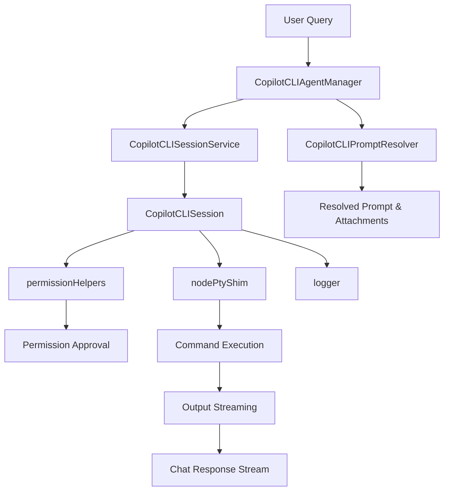
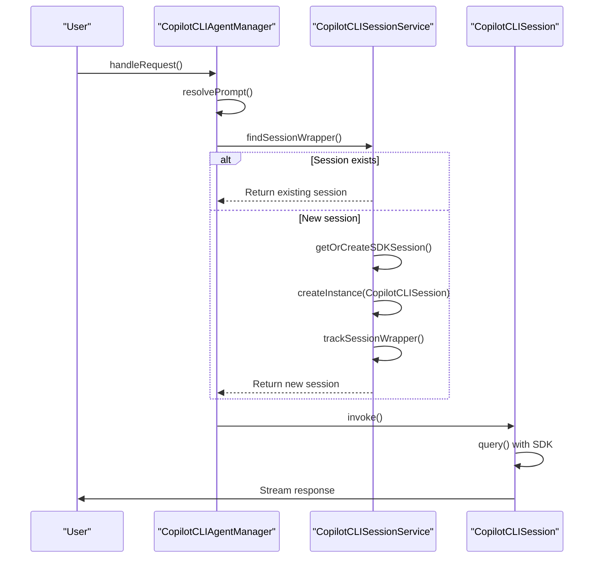
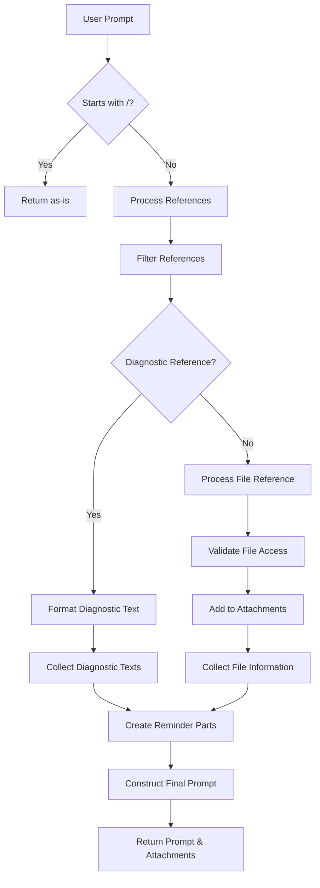
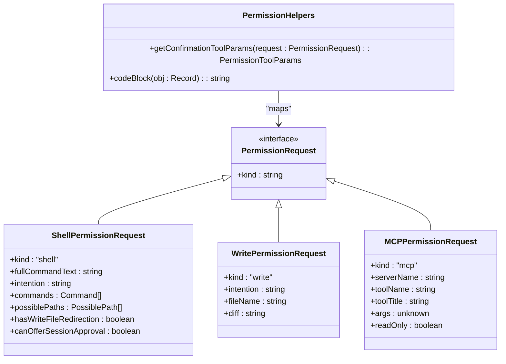
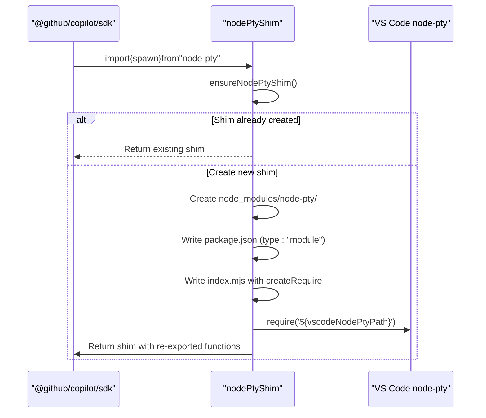

# Copilot CLI Agent

<cite>
**Referenced Files in This Document**   
- [copilotcliAgentManager.ts](file://src/extension/agents/copilotcli/node/copilotcliAgentManager.ts)
- [copilotcliPromptResolver.ts](file://src/extension/agents/copilotcli/node/copilotcliPromptResolver.ts)
- [permissionHelpers.ts](file://src/extension/agents/copilotcli/node/permissionHelpers.ts)
- [nodePtyShim.ts](file://src/extension/agents/copilotcli/node/nodePtyShim.ts)
- [copilotcliSessionService.ts](file://src/extension/agents/copilotcli/node/copilotcliSessionService.ts)
- [copilotcliToolInvocationFormatter.ts](file://src/extension/agents/copilotcli/node/copilotcliToolInvocationFormatter.ts)
- [logger.ts](file://src/extension/agents/copilotcli/node/logger.ts)
</cite>

## Table of Contents
1. [Introduction](#introduction)
2. [Architecture Overview](#architecture-overview)
3. [Core Components](#core-components)
4. [Agent Lifecycle Management](#agent-lifecycle-management)
5. [Prompt Resolution and Processing](#prompt-resolution-and-processing)
6. [Permission Management and Security](#permission-management-and-security)
7. [Terminal Interface and Command Execution](#terminal-interface-and-command-execution)
8. [Configuration and Execution Contexts](#configuration-and-execution-contexts)
9. [Error Handling and Troubleshooting](#error-handling-and-troubleshooting)
10. [Conclusion](#conclusion)

## Introduction

The Copilot CLI agent in GitHub Copilot Chat provides a sophisticated interface between natural language queries and executable command-line operations. This document details the architecture and implementation of the agent system, focusing on how it orchestrates CLI interactions, manages security through permission controls, and provides a seamless user experience through real-time output streaming. The system is designed to translate user intent expressed in natural language into appropriate CLI commands while maintaining strict security boundaries and providing transparent feedback throughout the execution process.

**Section sources**
- [copilotcliAgentManager.ts](file://src/extension/agents/copilotcli/node/copilotcliAgentManager.ts#L1-L235)

## Architecture Overview

The Copilot CLI agent architecture follows a modular design pattern with clear separation of concerns. The system consists of several key components that work together to process user queries, manage agent sessions, resolve prompts, handle permissions, and execute commands through a pseudo-terminal interface.

**Diagram sources**
- [copilotcliAgentManager.ts](file://src/extension/agents/copilotcli/node/copilotcliAgentManager.ts#L25-L235)
- [copilotcliPromptResolver.ts](file://src/extension/agents/copilotcli/node/copilotcliPromptResolver.ts#L16-L108)
- [copilotcliSessionService.ts](file://src/extension/agents/copilotcli/node/copilotcliSessionService.ts#L58-L280)

**Section sources**
- [copilotcliAgentManager.ts](file://src/extension/agents/copilotcli/node/copilotcliAgentManager.ts#L1-L235)
- [copilotcliSessionService.ts](file://src/extension/agents/copilotcli/node/copilotcliSessionService.ts#L1-L280)

## Core Components

The Copilot CLI agent system comprises several core components that work together to provide a robust and secure command execution environment. The architecture is designed with extensibility and maintainability in mind, following dependency injection patterns and clear interface definitions. Each component has a specific responsibility, from managing the agent lifecycle to processing user queries and executing commands in a secure environment.

**Section sources**
- [copilotcliAgentManager.ts](file://src/extension/agents/copilotcli/node/copilotcliAgentManager.ts#L25-L235)
- [copilotcliSessionService.ts](file://src/extension/agents/copilotcli/node/copilotcliSessionService.ts#L58-L280)

## Agent Lifecycle Management

The Copilot CLI agent lifecycle is managed through the `CopilotCLIAgentManager` and `CopilotCLISession` classes, which handle session creation, request processing, and resource cleanup. The agent manager serves as the entry point for handling user requests, coordinating between the prompt resolver, session service, and other components.

The `CopilotCLIAgentManager` class is responsible for:
- Handling incoming chat requests
- Resolving prompts through the prompt resolver
- Managing session lifecycle (creation, reuse, and disposal)
- Coordinating the invocation of agent sessions

When a request is received, the agent manager first checks if an existing session should be reused or if a new session needs to be created. The session management is handled by the `CopilotCLISessionService`, which maintains a registry of active sessions and provides methods for creating, retrieving, and deleting sessions.

**Diagram sources**
- [copilotcliAgentManager.ts](file://src/extension/agents/copilotcli/node/copilotcliAgentManager.ts#L42-L73)
- [copilotcliSessionService.ts](file://src/extension/agents/copilotcli/node/copilotcliSessionService.ts#L162-L197)

**Section sources**
- [copilotcliAgentManager.ts](file://src/extension/agents/copilotcli/node/copilotcliAgentManager.ts#L25-L73)
- [copilotcliSessionService.ts](file://src/extension/agents/copilotcli/node/copilotcliSessionService.ts#L58-L280)

## Prompt Resolution and Processing

The `copilotcliPromptResolver.ts` component is responsible for processing user queries and preparing them for execution by the Copilot CLI agent. This component handles the transformation of natural language input into a structured format that can be understood by the underlying agent system.

The prompt resolution process involves several key steps:
1. **Slash command detection**: The resolver first checks if the prompt starts with a slash (/), which indicates a direct command that should not be modified.
2. **Reference processing**: The resolver processes any references included in the request, such as file references or diagnostic information.
3. **Attachment collection**: Files and directories referenced in the request are collected as attachments for the agent session.
4. **Context enrichment**: The resolver adds contextual information to the prompt in the form of reminders, which include references and diagnostics.

The resolver handles different types of references, including:
- **Diagnostic references**: These are converted into structured text describing the diagnostic issues, including severity, code, and location.
- **File references**: These are processed to include the file path and name, with appropriate validation to ensure they are accessible.

**Diagram sources**
- [copilotcliPromptResolver.ts](file://src/extension/agents/copilotcli/node/copilotcliPromptResolver.ts#L16-L108)

**Section sources**
- [copilotcliPromptResolver.ts](file://src/extension/agents/copilotcli/node/copilotcliPromptResolver.ts#L16-L108)

## Permission Management and Security

The Copilot CLI agent implements a comprehensive permission management system through the `permissionHelpers.ts` component, which ensures that potentially dangerous operations require explicit user approval. This security model is critical for preventing unauthorized access to system resources and protecting users from malicious commands.

The permission system is based on the `PermissionRequest` type, which defines different kinds of permission requests:
- **Shell execution**: Requests approval for executing shell commands
- **File writing**: Requests approval for modifying or creating files
- **MCP (Model Control Protocol) operations**: Requests approval for invoking MCP tools
- **File reading**: Requests approval for reading files

The `getConfirmationToolParams` function maps these permission requests to appropriate confirmation tools, providing contextual information to help users make informed decisions. For shell commands, the function displays both the full command text and a natural language description of the intended action. For file operations, it shows the specific file being modified and the nature of the changes.

**Diagram sources**
- [permissionHelpers.ts](file://src/extension/agents/copilotcli/node/permissionHelpers.ts#L8-L176)

**Section sources**
- [permissionHelpers.ts](file://src/extension/agents/copilotcli/node/permissionHelpers.ts#L8-L176)

## Terminal Interface and Command Execution

The `nodePtyShim.ts` component provides a critical bridge between the Copilot CLI agent and the system's terminal interface, enabling command execution and output capture. This component addresses a key architectural challenge: the Copilot SDK's hardcoded dependency on the `node-pty` library, which must be compatible with VS Code's module system.

The node-pty shim works by:
1. Creating a virtual `node-pty` module within the extension's directory structure
2. Using Node.js's `createRequire` function to load VS Code's bundled `node-pty` library
3. Re-exporting the necessary functions (spawn, IPty, native) to satisfy the SDK's imports

This approach allows the Copilot SDK to use the terminal functionality without requiring a separate installation of `node-pty`, while ensuring compatibility with VS Code's module loading system. The shim is created dynamically at runtime, ensuring that the correct version of `node-pty` is used based on the current VS Code installation.

**Diagram sources**
- [nodePtyShim.ts](file://src/extension/agents/copilotcli/node/nodePtyShim.ts#L1-L83)

**Section sources**
- [nodePtyShim.ts](file://src/extension/agents/copilotcli/node/nodePtyShim.ts#L1-L83)

## Configuration and Execution Contexts

The Copilot CLI agent supports various configuration options that control its behavior during command execution. These configurations are managed through the agent options passed to the SDK session and include settings for timeouts, environment variables, and execution contexts.

The agent's execution context is configured through the `AgentOptions` interface, which includes:
- **Model provider**: Specifies which AI model to use (defaulting to Claude Sonnet 4.5)
- **Working directory**: Set to the first workspace folder, providing context for relative paths
- **Environment variables**: Includes process environment with additional Copilot-specific settings
- **Permission request handler**: Callback for handling permission requests
- **Logger**: Integration with VS Code's logging system
- **Abort controller**: For canceling ongoing operations

The agent also supports timeout configurations through the cancellation token mechanism, allowing operations to be terminated if they exceed expected execution times. This is particularly important for long-running commands that might otherwise block the user interface.

**Section sources**
- [copilotcliAgentManager.ts](file://src/extension/agents/copilotcli/node/copilotcliAgentManager.ts#L125-L143)
- [copilotcliSessionService.ts](file://src/extension/agents/copilotcli/node/copilotcliSessionService.ts#L77-L94)

## Error Handling and Troubleshooting

The Copilot CLI agent implements comprehensive error handling mechanisms to provide users with meaningful feedback when issues occur. The system captures and reports errors at multiple levels, from permission denials to command execution failures.

Common issues and their solutions include:

**Permission errors**: When a user denies permission for a command, the agent gracefully handles the rejection and provides feedback in the chat interface. The system uses the `requestPermission` method in `CopilotCLISession` to coordinate with the tools service for user confirmation.

**Command execution failures**: The agent captures error output from executed commands and presents it in a user-friendly format. The `processToolExecutionComplete` function in `copilotcliToolInvocationFormatter.ts` handles the formatting of success and error states for display in the chat interface.

**Output truncation**: Long command outputs are streamed in real-time to prevent truncation. The agent uses the chat response stream to deliver output incrementally, ensuring that users can see results as they are generated.

**Node-pty shim failures**: If the node-pty shim cannot be created, the agent logs a warning and throws an error. This typically occurs when there are file system permission issues or when VS Code's installation is corrupted.

The logging system, implemented in `logger.ts`, provides detailed trace information that can be used for debugging. The logger integrates with VS Code's logging service, allowing developers to inspect agent behavior through the developer tools console.

**Section sources**
- [copilotcliAgentManager.ts](file://src/extension/agents/copilotcli/node/copilotcliAgentManager.ts#L153-L157)
- [copilotcliToolInvocationFormatter.ts](file://src/extension/agents/copilotcli/node/copilotcliToolInvocationFormatter.ts#L172-L188)
- [logger.ts](file://src/extension/agents/copilotcli/node/logger.ts#L8-L20)

## Conclusion

The Copilot CLI agent in GitHub Copilot Chat represents a sophisticated integration of natural language processing, command execution, and security management. The architecture demonstrates careful consideration of user experience, security, and system integration, providing a seamless interface between conversational AI and command-line operations.

Key strengths of the implementation include:
- **Modular design**: Clear separation of concerns between components
- **Security-first approach**: Comprehensive permission management for all potentially dangerous operations
- **Real-time feedback**: Streaming output and progress updates enhance user experience
- **VS Code integration**: Deep integration with VS Code's extension system and services

The agent's ability to translate natural language queries into executable commands while maintaining strict security boundaries makes it a powerful tool for developers. By combining the flexibility of CLI operations with the accessibility of natural language interfaces, the Copilot CLI agent lowers the barrier to entry for complex development tasks while providing experienced users with efficient workflows.

Future enhancements could include improved error recovery, more granular permission controls, and enhanced support for long-running operations with checkpointing and resumption capabilities.