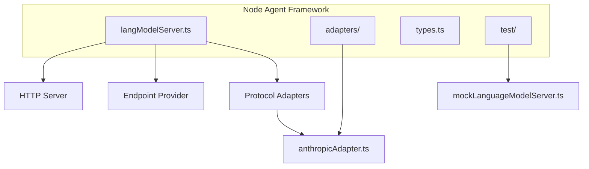
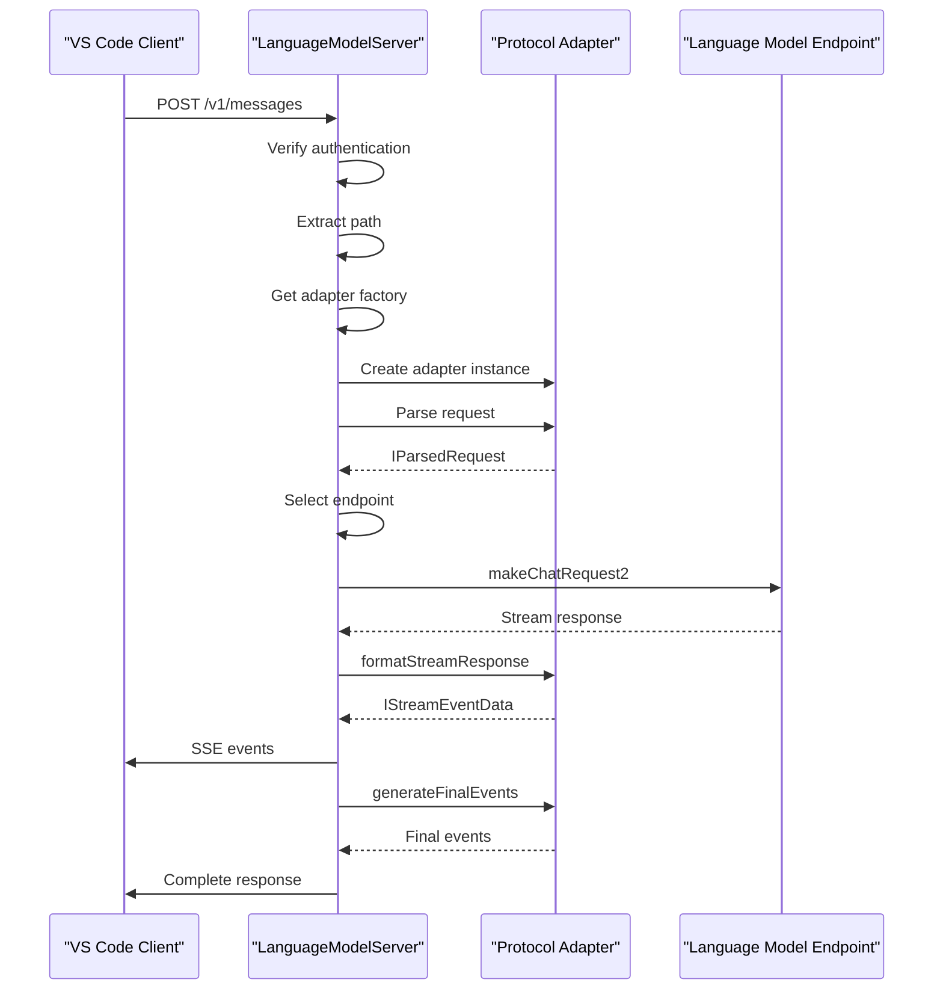
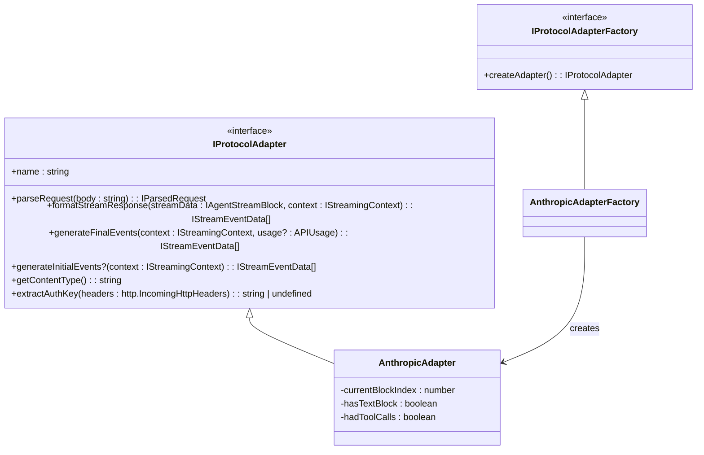
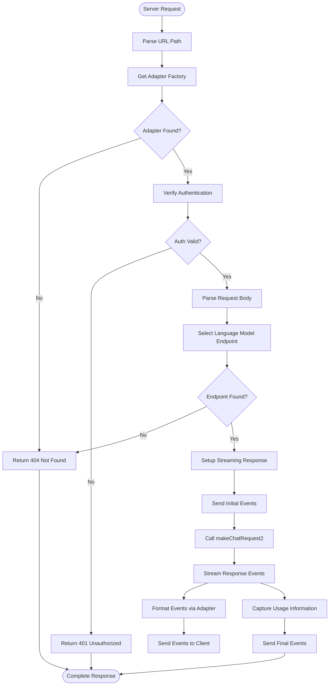

# Node Agent Framework

<cite>
**Referenced Files in This Document**   
- [anthropicAdapter.ts](file://src/extension/agents/node/adapters/anthropicAdapter.ts)
- [types.ts](file://src/extension/agents/node/adapters/types.ts)
- [langModelServer.ts](file://src/extension/agents/node/langModelServer.ts)
- [mockLanguageModelServer.ts](file://src/extension/agents/node/test/mockLanguageModelServer.ts)
- [chatEndpoint.ts](file://src/platform/endpoint/node/chatEndpoint.ts)
- [copilotChatEndpoint.ts](file://src/platform/endpoint/node/copilotChatEndpoint.ts)
</cite>

## Table of Contents
1. [Introduction](#introduction)
2. [Project Structure](#project-structure)
3. [Core Components](#core-components)
4. [Architecture Overview](#architecture-overview)
5. [Detailed Component Analysis](#detailed-component-analysis)
6. [Dependency Analysis](#dependency-analysis)
7. [Performance Considerations](#performance-considerations)
8. [Troubleshooting Guide](#troubleshooting-guide)
9. [Conclusion](#conclusion)

## Introduction
The Node Agent Framework in GitHub Copilot Chat provides a robust infrastructure for integrating language models into the VS Code environment. This framework enables seamless communication between the editor and various language model providers through a standardized interface. The architecture is designed around the adapter pattern, allowing different language model APIs to be integrated through a common protocol. The system handles critical aspects such as authentication, request/response transformation, error normalization, and connection management, providing a consistent experience across different model providers. This documentation explains the foundational architecture, focusing on how the framework supports agent implementations on the Node.js platform.

## Project Structure
The Node Agent Framework is organized within the `src/extension/agents/node` directory, which contains adapters, type definitions, and the language model server implementation. The framework follows a modular design with clear separation between protocol adapters, type definitions, and server implementation. The adapters directory contains protocol-specific implementations like the Anthropic adapter, while the types.ts file defines the contract for agent communication. The langModelServer.ts file implements the core server functionality that handles incoming requests and routes them to appropriate adapters. Test implementations are located in the test directory, including the mockLanguageModelServer for unit testing.



**Diagram sources**
- [langModelServer.ts](file://src/extension/agents/node/langModelServer.ts)
- [anthropicAdapter.ts](file://src/extension/agents/node/adapters/anthropicAdapter.ts)
- [mockLanguageModelServer.ts](file://src/extension/agents/node/test/mockLanguageModelServer.ts)

**Section sources**
- [langModelServer.ts](file://src/extension/agents/node/langModelServer.ts)
- [adapters/](file://src/extension/agents/node/adapters/)
- [test/](file://src/extension/agents/node/test/)

## Core Components
The Node Agent Framework consists of several core components that work together to provide a standardized interface for language model interactions. The LanguageModelServer acts as the central component, receiving incoming requests and routing them to appropriate protocol adapters. Protocol adapters like AnthropicAdapter implement the IProtocolAdapter interface, providing standardized methods for request parsing and response formatting. The type definitions in types.ts establish the contract for agent communication, defining message formats, tool specifications, and response schemas. The framework also includes a mock implementation for testing purposes, allowing developers to test agent functionality without making actual API calls.

**Section sources**
- [langModelServer.ts](file://src/extension/agents/node/langModelServer.ts)
- [types.ts](file://src/extension/agents/node/adapters/types.ts)
- [anthropicAdapter.ts](file://src/extension/agents/node/adapters/anthropicAdapter.ts)

## Architecture Overview
The Node Agent Framework follows a layered architecture with clear separation of concerns. At the core is the LanguageModelServer, which implements an HTTP server to receive incoming requests from the VS Code client. The server uses protocol adapters to handle different language model APIs, with each adapter implementing the IProtocolAdapter interface. When a request arrives, the server identifies the appropriate adapter based on the URL path and delegates processing to that adapter. The adapter parses the incoming request into a standardized format, which is then forwarded to the appropriate language model endpoint. The response from the language model is streamed back through the adapter, which transforms it into the protocol-specific format before sending it to the client. This architecture enables the framework to support multiple language model providers through a common interface.



**Diagram sources**
- [langModelServer.ts](file://src/extension/agents/node/langModelServer.ts)
- [anthropicAdapter.ts](file://src/extension/agents/node/adapters/anthropicAdapter.ts)

## Detailed Component Analysis

### Protocol Adapter Pattern Implementation
The framework implements the adapter pattern to provide a standardized interface for different language model providers. The IProtocolAdapter interface defines the contract that all adapters must implement, including methods for parsing requests, formatting responses, and handling authentication. This pattern allows the framework to support multiple language model APIs while maintaining a consistent interface for the rest of the system. The adapter pattern also enables easy addition of new language model providers by simply implementing the adapter interface without modifying the core server logic.



**Diagram sources**
- [types.ts](file://src/extension/agents/node/adapters/types.ts)
- [anthropicAdapter.ts](file://src/extension/agents/node/adapters/anthropicAdapter.ts)

**Section sources**
- [types.ts](file://src/extension/agents/node/adapters/types.ts)
- [anthropicAdapter.ts](file://src/extension/agents/node/adapters/anthropicAdapter.ts)

### Type System and Communication Contracts
The framework uses a comprehensive type system to define the contract for agent communication. The types.ts file defines interfaces for parsed requests, stream events, and agent blocks, ensuring type safety throughout the system. The IParsedRequest interface defines the standardized format for incoming requests, including model, messages, and options. The IAgentStreamBlock type union represents the different types of content that can be streamed from the language model, such as text and tool calls. The IStreamEventData interface defines the structure of server-sent events, with event type and data payload. This type system ensures that all components in the framework communicate using a consistent and well-defined contract.

```mermaid
classDiagram
class IParsedRequest {
+model? : string
+messages : Raw.ChatMessage[]
+options? : IMakeChatRequestOptions['requestOptions']
+type? : string
}
class IStreamEventData {
+event : string
+data : string
}
class IAgentTextBlock {
+type : 'text'
+content : string
}
class IAgentToolCallBlock {
+type : 'tool_call'
+callId : string
+name : string
+input : object
}
class IStreamingContext {
+requestId : string
+endpoint : {
+modelId : string
+modelMaxPromptTokens : number
}
}
IAgentStreamBlock <|-- IAgentTextBlock
IAgentStreamBlock <|-- IAgentToolCallBlock
```

**Diagram sources**
- [types.ts](file://src/extension/agents/node/adapters/types.ts)

**Section sources**
- [types.ts](file://src/extension/agents/node/adapters/types.ts)

### Language Model Server Implementation
The LanguageModelServer class implements the core functionality of the framework, providing an HTTP server that handles incoming requests from the VS Code client. The server uses a map of adapter factories to route requests to appropriate protocol adapters based on the URL path. It handles authentication by verifying a nonce in the request headers, ensuring that only authorized clients can access the service. The server manages streaming responses by setting up appropriate headers and handling client disconnections through cancellation tokens. It also handles error conditions gracefully, returning appropriate HTTP status codes and error messages. The server's start and stop methods provide lifecycle management, allowing it to be properly initialized and cleaned up.



**Diagram sources**
- [langModelServer.ts](file://src/extension/agents/node/langModelServer.ts)

**Section sources**
- [langModelServer.ts](file://src/extension/agents/node/langModelServer.ts)

## Dependency Analysis
The Node Agent Framework has several key dependencies that enable its functionality. The framework depends on the @anthropic-ai/sdk package for interacting with the Anthropic API, and on @vscode/prompt-tsx for type definitions related to chat messages. It also depends on various platform components such as the endpoint provider, authentication service, and telemetry service. The framework uses the IEndpointProvider interface to discover available language model endpoints, and the IAuthenticationService to obtain authentication tokens. It integrates with the telemetry system to collect usage data and performance metrics. The dependency structure follows the inversion of control principle, with services being injected through the constructor rather than being directly instantiated.

```mermaid
graph LR
A[LanguageModelServer] --> B[IEndpointProvider]
A --> C[ILogService]
A --> D[AnthropicAdapterFactory]
D --> E[AnthropicAdapter]
E --> F[@anthropic-ai/sdk]
A --> G[IProtocolAdapterFactory]
G --> H[IProtocolAdapter]
H --> I[IParsedRequest]
H --> J[IStreamEventData]
A --> K[Raw.ChatMessage]
K --> L[@vscode/prompt-tsx]
M[ChatEndpoint] --> N[IChatEndpoint]
N --> O[IMakeChatRequestOptions]
O --> P[@vscode/copilot-api]
```

**Diagram sources**
- [langModelServer.ts](file://src/extension/agents/node/langModelServer.ts)
- [chatEndpoint.ts](file://src/platform/endpoint/node/chatEndpoint.ts)
- [copilotChatEndpoint.ts](file://src/platform/endpoint/node/copilotChatEndpoint.ts)

**Section sources**
- [langModelServer.ts](file://src/extension/agents/node/langModelServer.ts)
- [chatEndpoint.ts](file://src/platform/endpoint/node/chatEndpoint.ts)
- [copilotChatEndpoint.ts](file://src/platform/endpoint/node/copilotChatEndpoint.ts)

## Performance Considerations
The Node Agent Framework is designed with performance in mind, particularly for handling streaming responses from language models. The server uses keep-alive connections and appropriate caching headers to minimize connection overhead. It processes requests asynchronously, allowing it to handle multiple concurrent requests efficiently. The framework uses cancellation tokens to handle client disconnections promptly, freeing up resources when a client disconnects before the request completes. The adapter pattern allows for protocol-specific optimizations, such as the Anthropic adapter's token usage adjustment to make the agent think it has a larger context window. The framework also includes error handling and retry logic to ensure reliable operation under various network conditions.

## Troubleshooting Guide
Common issues with the Node Agent Framework typically fall into several categories: network connectivity problems, authentication issues, and serialization errors. Network connectivity problems can occur if the language model server fails to start or if there are firewall restrictions preventing access. Authentication issues may arise if the nonce verification fails or if the authentication token is invalid. Serialization errors can occur when there are mismatches between expected and actual data formats in the request or response. To troubleshoot network issues, verify that the server is running and accessible on the expected port. For authentication problems, check that the nonce in the request headers matches the server's configuration. For serialization errors, validate that the request body is properly formatted JSON and that all required fields are present.

**Section sources**
- [langModelServer.ts](file://src/extension/agents/node/langModelServer.ts)
- [anthropicAdapter.ts](file://src/extension/agents/node/adapters/anthropicAdapter.ts)
- [types.ts](file://src/extension/agents/node/adapters/types.ts)

## Conclusion
The Node Agent Framework in GitHub Copilot Chat provides a robust and extensible infrastructure for integrating language models into the VS Code environment. By implementing the adapter pattern, the framework enables seamless integration of different language model providers through a standardized interface. The comprehensive type system ensures type safety and consistency across the system, while the modular architecture allows for easy extension and maintenance. The framework handles critical aspects such as authentication, request/response transformation, and error handling, providing a reliable foundation for agent implementations. With its support for streaming responses and efficient resource management, the framework delivers a responsive and performant experience for users interacting with language models in VS Code.