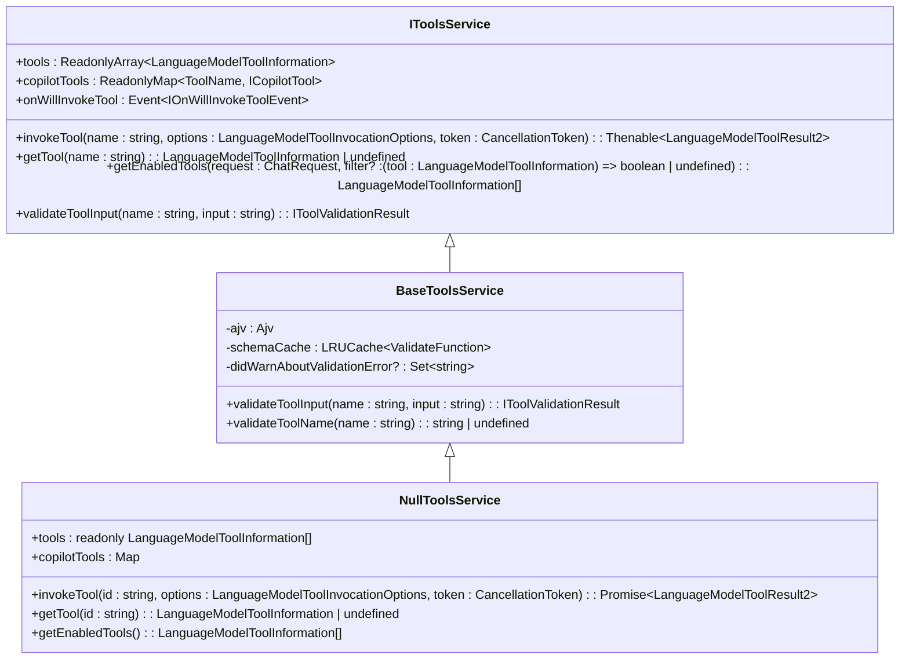
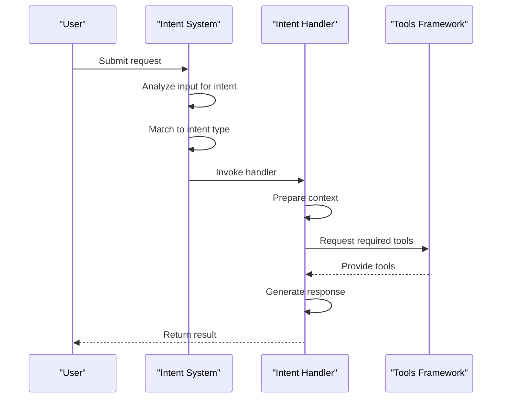
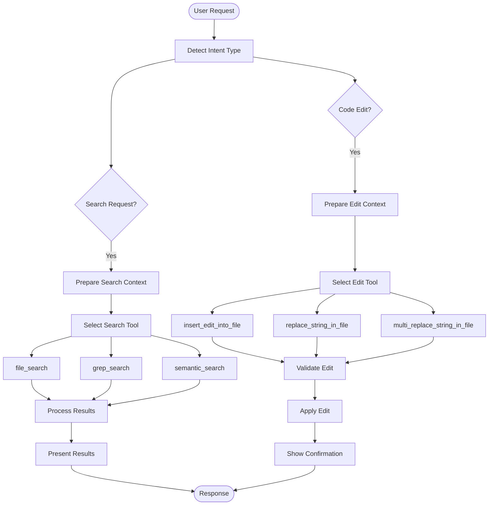
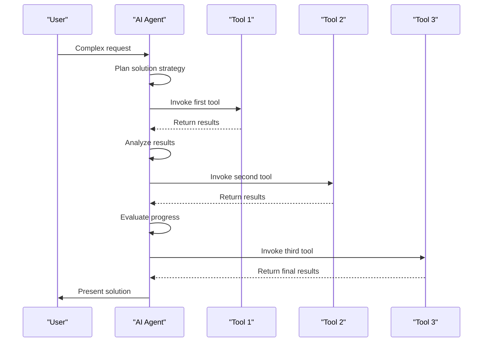

# Core Features

<cite>
**Referenced Files in This Document**   
- [editCodeIntent2.ts](file://src/extension/intents/node/editCodeIntent2.ts)
- [allIntents.ts](file://src/extension/intents/node/allIntents.ts)
- [intents.ts](file://src/extension/intents/common/intents.ts)
- [editCodePrompt2.tsx](file://src/extension/prompts/node/panel/editCodePrompt2.tsx)
- [toolsService.ts](file://src/extension/tools/common/toolsService.ts)
- [toolNames.ts](file://src/extension/tools/common/toolNames.ts)
- [agentIntent.ts](file://src/extension/intents/node/agentIntent.ts)
</cite>

## Table of Contents
1. [Introduction](#introduction)
2. [AI Agent System](#ai-agent-system)
3. [Tool Framework](#tool-framework)
4. [Intent Handling Mechanism](#intent-handling-mechanism)
5. [Domain Model for Conversation State](#domain-model-for-conversation-state)
6. [Code Edits and Search Results](#code-edits-and-search-results)
7. [Configuration Options and Feature Toggles](#configuration-options-and-feature-toggles)
8. [Agent Mode and Multi-Tool Integration](#agent-mode-and-multi-tool-integration)
9. [Rate Limiting and Context Window Constraints](#rate-limiting-and-context-window-constraints)
10. [Multi-Step Reasoning and Code Manipulation](#multi-step-reasoning-and-code-manipulation)

## Introduction
GitHub Copilot Chat is an AI-powered coding assistant that integrates directly into the development environment to provide intelligent code suggestions, edits, and explanations. This document details the core features of GitHub Copilot Chat, focusing on its AI agent system, tool framework, and intent handling mechanism. The implementation enables sophisticated code manipulation through a structured system of intents, tools, and prompts that work together to interpret user requests and execute complex coding tasks. The architecture supports multi-step reasoning, context-aware responses, and seamless integration with the development workflow.

## AI Agent System
The AI agent system in GitHub Copilot Chat serves as the central intelligence that processes user requests and coordinates the execution of coding tasks. Agents are specialized components that handle different types of interactions, each designed for specific coding scenarios. The system implements a hierarchy of agent types, including the default agent, workspace agent, terminal agent, and specialized editing agents. These agents are identified by unique participant IDs that determine their behavior and capabilities within the chat interface.

The agent system operates through a structured invocation process where user requests are routed to the appropriate agent based on the context and intent. Each agent maintains its own state and has access to a specific set of tools relevant to its domain. The system supports agent switching, allowing users to transition between different modes of interaction seamlessly. The agent framework is extensible, enabling the addition of new agent types to support emerging development workflows and coding patterns.

**Section sources**
- [intents.ts](file://src/extension/intents/common/intents.ts#L6-L30)

## Tool Framework
The tool framework in GitHub Copilot Chat provides a comprehensive set of capabilities for interacting with code, files, and development environment features. Tools are implemented as discrete functions that can be invoked by the AI agent to perform specific actions, such as editing files, searching code, or running tests. The framework categorizes tools into logical groups including file operations, code analysis, testing, and environment interaction.

Each tool has a well-defined schema that specifies its input parameters and expected behavior. The framework includes validation mechanisms to ensure that tool inputs are properly formatted and semantically correct before execution. Tools are registered with the system and can be dynamically enabled or disabled based on the current context and user preferences. The framework supports both synchronous and asynchronous tool execution, allowing for efficient handling of operations with varying response times.

**Diagram sources **
- [toolsService.ts](file://src/extension/tools/common/toolsService.ts#L6-L253)

**Section sources**
- [toolsService.ts](file://src/extension/tools/common/toolsService.ts#L6-L253)
- [toolNames.ts](file://src/extension/tools/common/toolNames.ts#L8-L250)

## Intent Handling Mechanism
The intent handling mechanism in GitHub Copilot Chat interprets user requests and routes them to the appropriate processing pipeline based on the detected intent. Intents represent different types of coding tasks, such as editing code, explaining code, fixing issues, or generating new content. The system uses a registry to manage available intents and their corresponding handlers, allowing for extensible support of new capabilities.

When a user submits a request, the intent system analyzes the input to determine the most appropriate intent to handle it. This process involves pattern matching, context analysis, and sometimes machine learning-based classification. Once an intent is identified, the system invokes the corresponding handler, which prepares the necessary context and tools for processing the request. The intent handling mechanism supports both explicit intents (triggered by specific commands) and implicit intents (inferred from natural language input).

**Diagram sources **
- [allIntents.ts](file://src/extension/intents/node/allIntents.ts#L34-L59)
- [editCodeIntent2.ts](file://src/extension/intents/node/editCodeIntent2.ts#L63-L124)

**Section sources**
- [allIntents.ts](file://src/extension/intents/node/allIntents.ts#L34-L59)
- [editCodeIntent2.ts](file://src/extension/intents/node/editCodeIntent2.ts#L63-L124)

## Domain Model for Conversation State
The domain model for conversation state in GitHub Copilot Chat maintains the context and history of interactions between the user and the AI assistant. This model tracks the sequence of messages, tool invocations, and state changes throughout a conversation session. The conversation state includes metadata about each turn, such as timestamps, participant information, and any confirmations or modifications made during the interaction.

The model supports features like conversation persistence, allowing users to resume previous sessions with full context. It also enables features like undo/redo by maintaining a history of changes made through tool invocations. The conversation state is structured to support both linear interactions and branching scenarios where multiple possible solutions are explored. The model integrates with the development environment to provide context-aware responses that take into account the current code, file structure, and project configuration.

**Section sources**
- [agentIntent.ts](file://src/extension/intents/node/agentIntent.ts#L263-L354)

## Code Edits and Search Results
The implementation of code edits and search results in GitHub Copilot Chat follows a structured approach that ensures accuracy and safety when modifying code. For code edits, the system uses specialized tools like EditFile, ReplaceString, and MultiReplaceString that operate on specific code patterns rather than raw text replacement. These tools understand code structure and can make precise modifications while preserving formatting and surrounding context.

Search functionality is implemented through tools like file_search, grep_search, and semantic_search that provide different levels of code discovery. The system prioritizes relevant results based on context, usage patterns, and project structure. Search results are presented with sufficient context to help users understand their relevance, and the system supports follow-up actions like navigating to specific locations or applying suggested changes.

**Diagram sources **
- [editCodeIntent2.ts](file://src/extension/intents/node/editCodeIntent2.ts#L35-L61)
- [toolNames.ts](file://src/extension/tools/common/toolNames.ts#L21-L71)

**Section sources**
- [editCodeIntent2.ts](file://src/extension/intents/node/editCodeIntent2.ts#L35-L61)
- [editCodePrompt2.tsx](file://src/extension/prompts/node/panel/editCodePrompt2.tsx#L28-L162)

## Configuration Options and Feature Toggles
GitHub Copilot Chat provides extensive configuration options and feature toggles that allow users and administrators to customize the behavior of the AI assistant. Configuration is managed through a hierarchical system that supports user-level, workspace-level, and organization-level settings. Feature toggles enable controlled rollout of new capabilities and allow users to experiment with different AI models and interaction patterns.

Key configuration parameters include model selection, temperature settings, tool availability, and context window size. The system supports experimental features through opt-in flags that can be enabled for testing purposes. Configuration options also control privacy settings, data sharing preferences, and integration with external services. The configuration system is designed to be extensible, allowing for the addition of new settings as the capabilities of the AI assistant evolve.

**Section sources**
- [editCodeIntent2.ts](file://src/extension/intents/node/editCodeIntent2.ts#L80-L85)
- [agentIntent.ts](file://src/extension/intents/node/agentIntent.ts#L185-L194)

## Agent Mode and Multi-Tool Integration
Agent mode in GitHub Copilot Chat represents an advanced interaction paradigm where the AI assistant can autonomously coordinate multiple tools to accomplish complex coding tasks. In this mode, the agent can plan a sequence of actions, execute them through appropriate tools, and adapt its strategy based on intermediate results. This capability enables sophisticated workflows like refactoring across multiple files, implementing features with associated tests, or debugging complex issues.

The multi-tool integration framework allows the agent to combine different capabilities in a coordinated manner. For example, the agent might first search for relevant code using semantic_search, analyze the results, make edits using insert_edit_into_file, and then run tests using run_tests to verify the changes. The system manages tool dependencies and execution order to ensure that operations are performed in the correct sequence. Agent mode includes safeguards to prevent infinite loops and excessive resource consumption during multi-step operations.

**Diagram sources **
- [agentIntent.ts](file://src/extension/intents/node/agentIntent.ts#L55-L126)
- [editCodeIntent2.ts](file://src/extension/intents/node/editCodeIntent2.ts#L35-L61)

**Section sources**
- [agentIntent.ts](file://src/extension/intents/node/agentIntent.ts#L55-L126)
- [editCodeIntent2.ts](file://src/extension/intents/node/editCodeIntent2.ts#L35-L61)

## Rate Limiting and Context Window Constraints
The system implements comprehensive mechanisms to handle rate limiting and context window constraints, which are critical for maintaining performance and reliability. Rate limiting is enforced at multiple levels, including API call frequency, tool invocation rates, and conversation turn limits. The system monitors usage patterns and can dynamically adjust limits based on current load and user behavior.

Context window management is essential for handling large codebases and complex conversations. The system employs strategies like conversation summarization, selective context inclusion, and token budgeting to stay within model limitations. When approaching context limits, the system can automatically summarize previous interactions or request user input to prioritize relevant context. These mechanisms ensure that the AI assistant remains responsive and effective even in demanding scenarios.

**Section sources**
- [agentIntent.ts](file://src/extension/intents/node/agentIntent.ts#L250-L259)
- [editCodeIntent2.ts](file://src/extension/intents/node/editCodeIntent2.ts#L82-L83)

## Multi-Step Reasoning and Code Manipulation
The multi-step reasoning and code manipulation capabilities in GitHub Copilot Chat enable sophisticated problem-solving and code transformation. The system can break down complex requests into a sequence of logical steps, each handled by appropriate tools or reasoning processes. This capability supports tasks like implementing new features, refactoring code, or debugging issues that require understanding of code relationships across multiple files.

Code manipulation is performed with awareness of syntax, semantics, and coding patterns. The system can make structural changes to code while preserving functionality and adhering to style guidelines. It supports operations like method extraction, class restructuring, and API migration that require understanding of code dependencies and design principles. The multi-step reasoning framework includes validation checkpoints to verify the correctness of intermediate results and adjust the approach if needed.

**Section sources**
- [agentIntent.ts](file://src/extension/intents/node/agentIntent.ts#L232-L354)
- [editCodePrompt2.tsx](file://src/extension/prompts/node/panel/editCodePrompt2.tsx#L47-L109)