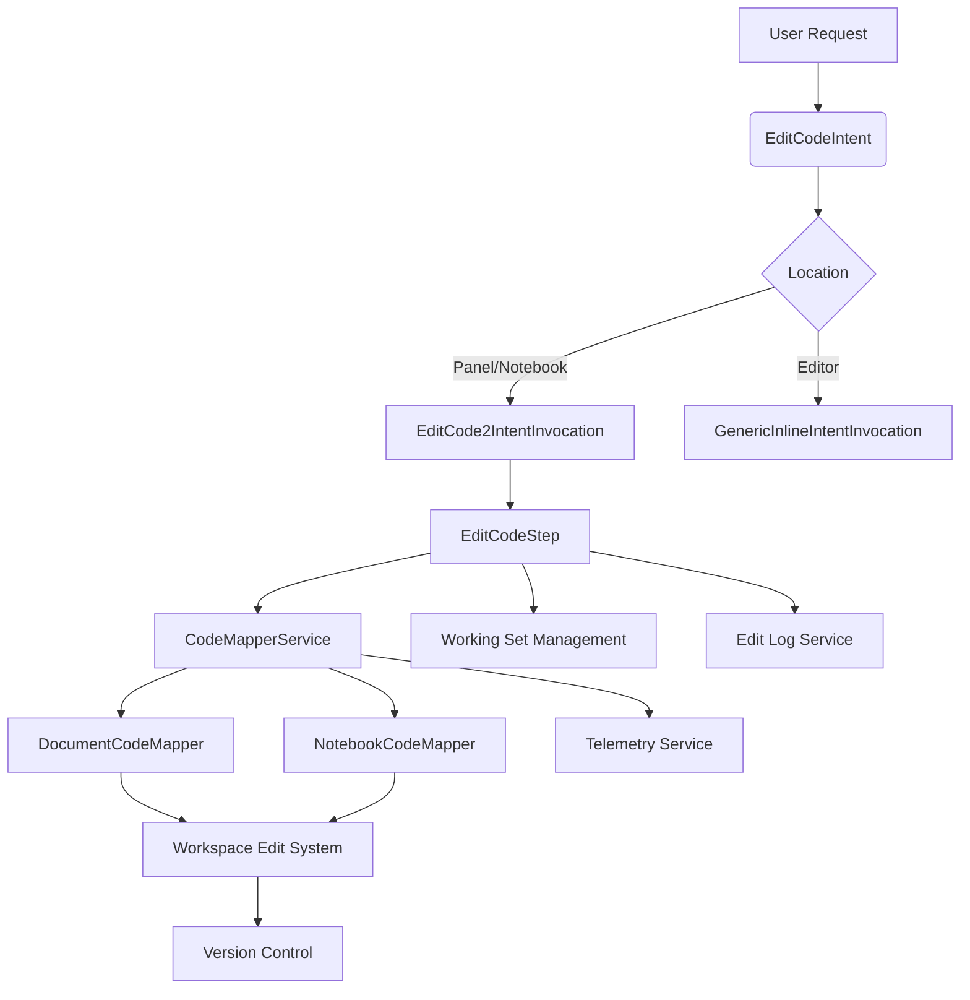
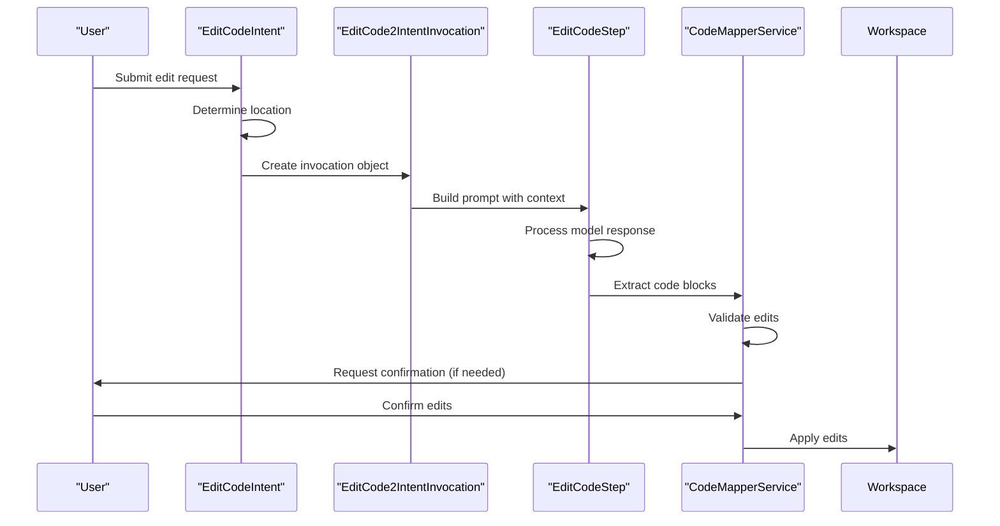
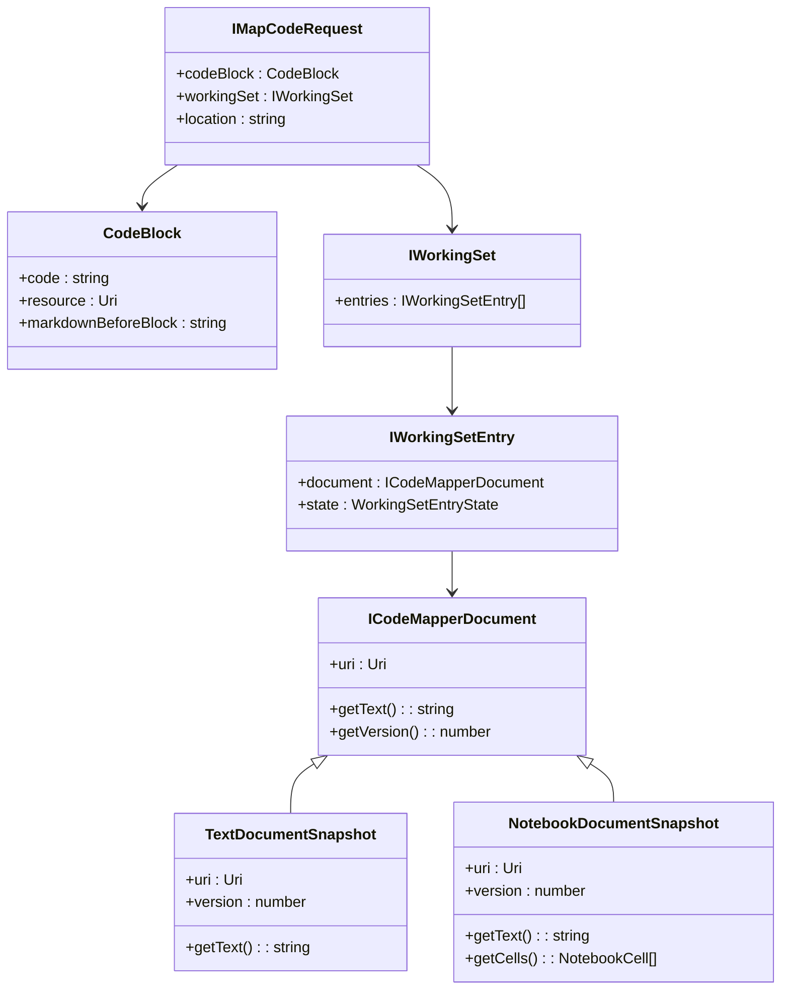
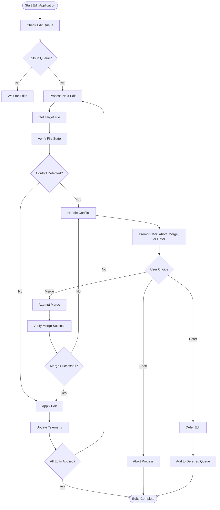

# Edit Code Intent

<cite>
**Referenced Files in This Document**   
- [editCodeIntent.ts](file://src/extension/intents/node/editCodeIntent.ts)
- [editCodeIntent2.ts](file://src/extension/intents/node/editCodeIntent2.ts)
- [editCodeStep.ts](file://src/extension/intents/node/editCodeStep.ts)
- [codeMapperService.ts](file://src/extension/prompts/node/codeMapper/codeMapperService.ts)
- [codeMapper.ts](file://src/extension/prompts/node/codeMapper/codeMapper.ts)
- [textDocumentSnapshot.ts](file://src/platform/editing/common/textDocumentSnapshot.ts)
- [editCodeIntent.spec.ts](file://src/extension/intents/test/node/editCodeIntent.spec.ts)
</cite>

## Table of Contents
1. [Introduction](#introduction)
2. [Architecture Overview](#architecture-overview)
3. [Core Components](#core-components)
4. [Edit Code Intent Implementation](#edit-code-intent-implementation)
5. [Domain Model for Edit Operations](#domain-model-for-edit-operations)
6. [Edit Application and Version Control](#edit-application-and-version-control)
7. [Error Handling and Conflict Resolution](#error-handling-and-conflict-resolution)
8. [Performance Considerations](#performance-considerations)
9. [Conclusion](#conclusion)

## Introduction

The Edit Code Intent in GitHub Copilot Chat enables users to modify existing code through natural language requests. This system parses user queries, validates them, and transforms them into executable edit operations that can be previewed and applied to the workspace. The implementation involves a sophisticated interaction between the intent service and the editCodeIntent2 module, which interfaces with the workspace edit system and version control mechanisms.

The system is designed to handle both simple and complex code modifications, from single-file edits to multi-file refactoring operations. It provides a safe environment for code changes by implementing confirmation workflows, conflict detection, and rollback capabilities. The architecture supports various edit strategies and integrates with the broader Copilot ecosystem to provide context-aware suggestions and intelligent code transformations.

This documentation explains the implementation details of the Edit Code Intent, focusing on how user requests are processed, how edit operations are constructed and applied, and how the system ensures the safety and integrity of code modifications.

## Architecture Overview

The Edit Code Intent architecture consists of several interconnected components that work together to process user requests and apply code modifications. The system follows a modular design with clear separation of concerns between intent handling, edit processing, and workspace integration.

**Diagram sources**
- [editCodeIntent.ts](file://src/extension/intents/node/editCodeIntent.ts)
- [editCodeIntent2.ts](file://src/extension/intents/node/editCodeIntent2.ts)
- [codeMapperService.ts](file://src/extension/prompts/node/codeMapper/codeMapperService.ts)

**Section sources**
- [editCodeIntent.ts](file://src/extension/intents/node/editCodeIntent.ts#L83-L193)
- [editCodeIntent2.ts](file://src/extension/intents/node/editCodeIntent2.ts#L63-L118)

## Core Components

The Edit Code Intent system comprises several core components that handle different aspects of the code modification process. The primary components include the EditCodeIntent class, which serves as the entry point for edit requests, and the EditCode2IntentInvocation class, which manages the execution of edit operations in different contexts.

The CodeMapperService plays a crucial role in translating high-level edit requests into concrete text edit operations that can be applied to files. This service uses different strategies depending on whether the target is a regular text document or a notebook document. The Working Set management system tracks the files involved in an editing session, maintaining their state and providing context for the AI model.

The system also includes comprehensive telemetry and logging capabilities through the EditLogService, which records the outcome of edit operations for analysis and improvement. These components work together to provide a robust and reliable code modification experience that balances automation with user control.

**Section sources**
- [editCodeIntent.ts](file://src/extension/intents/node/editCodeIntent.ts#L83-L193)
- [editCodeIntent2.ts](file://src/extension/intents/node/editCodeIntent2.ts#L63-L118)
- [codeMapperService.ts](file://src/extension/prompts/node/codeMapper/codeMapperService.ts#L61-L229)

## Edit Code Intent Implementation

The Edit Code Intent implementation begins with the EditCodeIntent class, which handles incoming edit requests from users. When a request is received, the system determines the appropriate invocation strategy based on the location (panel, notebook, or editor) and creates the corresponding intent invocation object.

For panel and notebook locations, the system uses the EditCode2IntentInvocation class, which extends the base AgentIntentInvocation. This class is responsible for building the prompt that will be sent to the language model, incorporating the current working set, conversation history, and any relevant context. The prompt construction process includes determining which tools are available for the current request, such as file editing, code search, or notebook operations.

The EditCodeStep class manages the state of an editing session, tracking the working set of files, the user's query, and the AI's response. It processes the model's output, extracting code blocks and preparing them for application. The system uses a streaming approach to handle the model's response, allowing it to begin processing code blocks as soon as they are generated rather than waiting for the complete response.

When the model proposes edits to specific files, the system may require user confirmation before applying the changes, particularly for readonly files or files outside the current workspace. This confirmation step provides an additional safety layer, allowing users to review proposed changes before they are applied.

**Diagram sources**
- [editCodeIntent.ts](file://src/extension/intents/node/editCodeIntent.ts#L166-L174)
- [editCodeIntent2.ts](file://src/extension/intents/node/editCodeIntent2.ts#L89-L118)
- [editCodeStep.ts](file://src/extension/intents/node/editCodeStep.ts#L1-L100)

**Section sources**
- [editCodeIntent.ts](file://src/extension/intents/node/editCodeIntent.ts#L166-L174)
- [editCodeIntent2.ts](file://src/extension/intents/node/editCodeIntent2.ts#L89-L118)

## Domain Model for Edit Operations

The domain model for edit operations in the Edit Code Intent system is centered around several key concepts: code blocks, working sets, and mapped edits. A code block represents a proposed modification to a file, containing the new code content, the target file URI, and metadata about the edit. The working set maintains the collection of files involved in an editing session, tracking their state and providing context for the AI model.

The system uses the IMapCodeRequest interface to define the structure of edit requests, which includes the code block to be applied and the current working set. This request is processed by the CodeMapperService, which determines the appropriate edit strategy based on the content and context. The service can handle various edit patterns, including complete file replacements, partial modifications with elided code markers, and notebook cell edits.

The edit domain model supports both text document and notebook document modifications through specialized mappers. For text documents, the system uses TextDocumentSnapshot to capture the current state of a file, while notebook documents use NotebookDocumentSnapshot. These snapshots provide a consistent interface for accessing document content regardless of the underlying file type.

The system also includes mechanisms for handling edge cases such as file creation, readonly files, and files outside the workspace. When creating new files, the system can generate appropriate content based on the file extension and context. For readonly files, it prompts the user for confirmation before proceeding. Files outside the workspace are handled by creating untitled documents, allowing users to review changes before saving them to a specific location.

**Diagram sources**
- [codeMapperService.ts](file://src/extension/prompts/node/codeMapper/codeMapperService.ts#L44-L54)
- [textDocumentSnapshot.ts](file://src/platform/editing/common/textDocumentSnapshot.ts#L1-L50)
- [editCodeStep.ts](file://src/extension/intents/node/editCodeStep.ts#L1-L50)

**Section sources**
- [codeMapperService.ts](file://src/extension/prompts/node/codeMapper/codeMapperService.ts#L44-L54)
- [textDocumentSnapshot.ts](file://src/platform/editing/common/textDocumentSnapshot.ts#L1-L50)

## Edit Application and Version Control

The edit application process in the Edit Code Intent system is designed to integrate seamlessly with the workspace and version control systems. When edits are ready to be applied, the CodeMapperService coordinates with the workspace edit system to implement the changes safely and efficiently.

The system uses a queue-based approach to handle concurrent edit requests for the same file, ensuring that edits are applied in a consistent order and preventing race conditions. This is particularly important in collaborative environments where multiple users or processes might be modifying the same files.

For version control integration, the system works with the underlying source control system to ensure that all changes are properly tracked. When edits are applied, they are recorded as discrete changes that can be reviewed, committed, or reverted as needed. The system also provides telemetry data that can be used to analyze edit patterns and improve the quality of future suggestions.

The application process includes several safety mechanisms to prevent data loss and ensure code integrity. Before applying edits, the system verifies that the target files have not been modified by other processes since the edit was proposed. If conflicts are detected, the system can either abort the operation or attempt to merge the changes, depending on the configuration.

The system also supports partial application of edits, allowing users to apply some changes while deferring others. This is particularly useful for complex refactoring operations that span multiple files, where users might want to review and apply changes incrementally.

**Diagram sources**
- [codeMapperService.ts](file://src/extension/prompts/node/codeMapper/codeMapperService.ts#L75-L83)
- [editCodeIntent.ts](file://src/extension/intents/node/editCodeIntent.ts#L133-L164)

**Section sources**
- [codeMapperService.ts](file://src/extension/prompts/node/codeMapper/codeMapperService.ts#L75-L83)
- [editCodeIntent.ts](file://src/extension/intents/node/editCodeIntent.ts#L133-L164)

## Error Handling and Conflict Resolution

The Edit Code Intent system implements comprehensive error handling and conflict resolution mechanisms to ensure reliable operation and prevent data loss. When errors occur during the edit process, the system captures detailed error information and provides appropriate feedback to the user.

Common issues such as partial application failures are handled by rolling back any applied changes and presenting the user with information about what went wrong. The system distinguishes between different types of errors, such as network issues, file access problems, and semantic errors in the proposed edits, and provides tailored solutions for each case.

Merge conflicts are detected by comparing the current state of target files with the state when the edits were proposed. When conflicts are detected, the system offers several resolution options: aborting the operation, attempting to merge the changes automatically, or deferring the edit for manual resolution. The choice of resolution strategy can be configured based on user preferences and project requirements.

The system also includes mechanisms for handling version control conflicts, working with the underlying source control system to resolve merge conflicts and ensure that all changes are properly tracked. This includes support for common version control operations such as committing, branching, and merging.

Telemetry data is collected for all error and conflict scenarios, providing valuable insights for improving the system's reliability and user experience. This data helps identify common failure patterns and informs the development of more robust error handling strategies.

**Section sources**
- [editCodeIntent.ts](file://src/extension/intents/node/editCodeIntent.ts#L156-L163)
- [codeMapperService.ts](file://src/extension/prompts/node/codeMapper/codeMapperService.ts#L138-L144)

## Performance Considerations

The Edit Code Intent system is designed with performance in mind, implementing several optimizations to ensure responsive operation even with complex edit requests. The system uses asynchronous processing throughout, allowing it to handle multiple operations concurrently without blocking the user interface.

One key performance optimization is the use of document snapshots, which provide efficient access to file content without requiring repeated file I/O operations. The system also employs caching mechanisms to store frequently accessed data, reducing the need for expensive computations or network requests.

The streaming approach to processing model responses allows the system to begin applying edits as soon as they are generated, rather than waiting for the complete response. This reduces the perceived latency and provides faster feedback to users.

The system also includes telemetry for monitoring performance metrics such as prompt rendering duration and edit application time. This data is used to identify performance bottlenecks and guide optimization efforts.

**Section sources**
- [editCodeIntent.ts](file://src/extension/intents/node/editCodeIntent.ts#L427-L441)
- [codeMapperService.ts](file://src/extension/prompts/node/codeMapper/codeMapperService.ts#L120-L127)

## Conclusion

The Edit Code Intent implementation in GitHub Copilot Chat provides a powerful and safe mechanism for modifying code through natural language requests. By combining sophisticated intent handling, intelligent edit processing, and robust workspace integration, the system enables users to make complex code changes with confidence.

The architecture balances automation with user control, providing intelligent suggestions while maintaining safety through confirmation workflows and conflict detection. The domain model for edit operations supports a wide range of modification patterns, from simple single-file edits to complex multi-file refactorings.

Through comprehensive error handling, version control integration, and performance optimizations, the system delivers a reliable and responsive experience that enhances developer productivity. The telemetry and logging capabilities provide valuable insights for continuous improvement, ensuring that the system evolves to meet the changing needs of developers.

As the system continues to evolve, future enhancements may include more advanced conflict resolution strategies, deeper integration with specific version control workflows, and improved support for collaborative editing scenarios.