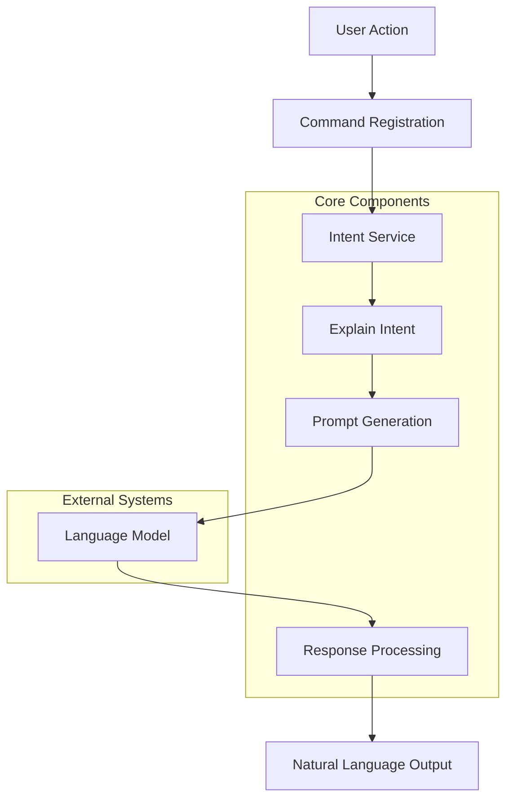
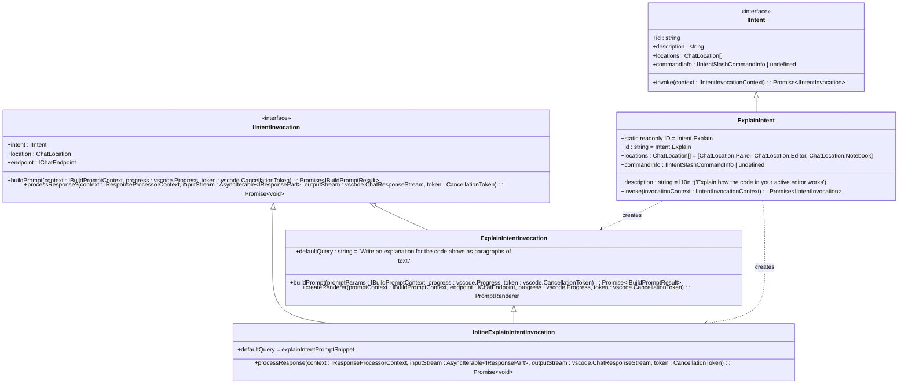
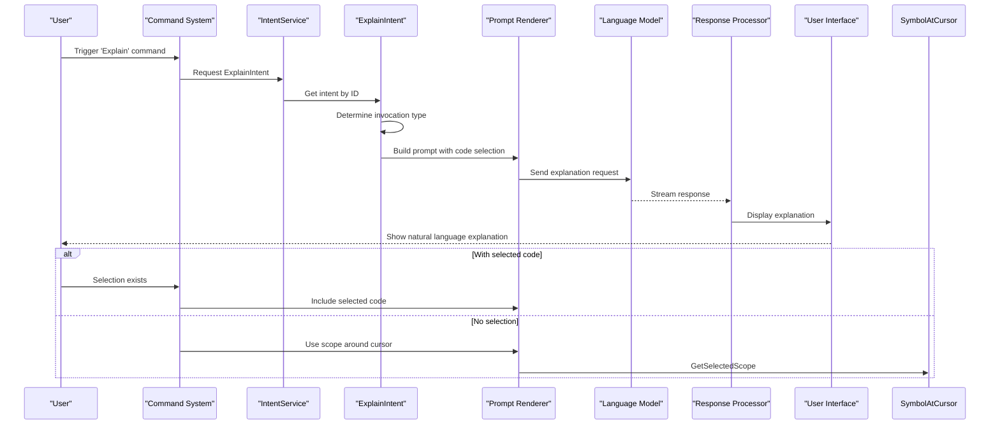
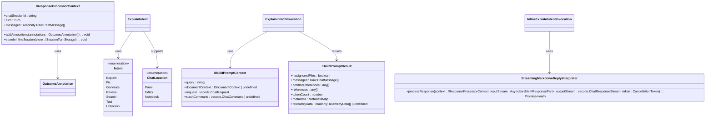
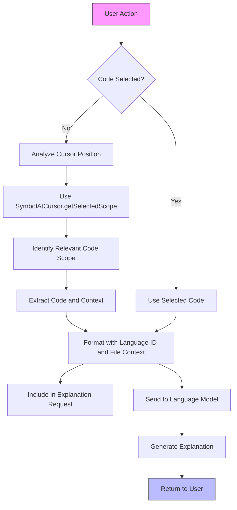
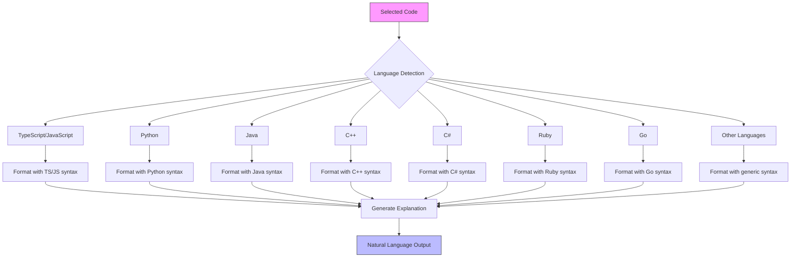

# Explain Code Intent

<cite>
**Referenced Files in This Document**   
- [explainIntent.ts](file://src/extension/intents/node/explainIntent.ts)
- [intentService.ts](file://src/extension/intents/node/intentService.ts)
- [allIntents.ts](file://src/extension/intents/node/allIntents.ts)
- [inlineChatCommands.ts](file://src/extension/inlineChat/vscode-node/inlineChatCommands.ts)
- [intents.ts](file://src/extension/prompt/node/intents.ts)
- [classes.ts](file://test/scenarios/test-explain/classes.ts)
- [functions.py](file://test/scenarios/test-explain/functions.py)
</cite>

## Table of Contents
1. [Introduction](#introduction)
2. [Architecture Overview](#architecture-overview)
3. [Core Components](#core-components)
4. [Explain Intent Implementation](#explain-intent-implementation)
5. [Invocation Flow](#invocation-flow)
6. [Domain Model for Explanation Operations](#domain-model-for-explanation-operations)
7. [Code Analysis and Contextualization](#code-analysis-and-contextualization)
8. [Natural Language Generation](#natural-language-generation)
9. [Multi-Language Support](#multi-language-support)
10. [Common Issues and Solutions](#common-issues-and-solutions)
11. [Conclusion](#conclusion)

## Introduction
The Explain Code Intent functionality in GitHub Copilot Chat provides developers with natural language explanations of selected code. This feature enables users to understand complex code constructs, algorithms, and implementation details through AI-powered explanations. The system analyzes selected code, contextualizes it within the broader codebase, and generates human-readable descriptions that explain the purpose, functionality, and implementation details of the code. This documentation details the implementation of this functionality, including the interaction between the intent service, explainIntent module, language models, symbol resolvers, and documentation systems.

## Architecture Overview
The Explain Code Intent system follows a modular architecture with clear separation of concerns between intent handling, prompt generation, and response processing. The system is built around a service-oriented design where the IntentService coordinates the execution of different intents, including the ExplainIntent.

**Diagram sources**
- [explainIntent.ts](file://src/extension/intents/node/explainIntent.ts)
- [intentService.ts](file://src/extension/intents/node/intentService.ts)
- [inlineChatCommands.ts](file://src/extension/inlineChat/vscode-node/inlineChatCommands.ts)

## Core Components
The Explain Code Intent functionality is implemented through several core components that work together to provide code explanations. The system is built on a service-oriented architecture with clear interfaces between components.

The IntentService acts as the central coordinator, managing the lifecycle of different intents including the ExplainIntent. The ExplainIntent class implements the IIntent interface and handles the specific logic for code explanation requests. The prompt generation system creates appropriate prompts for the language model based on the selected code and context. The response processing system interprets the language model's output and presents it to the user in a readable format.

**Section sources**
- [explainIntent.ts](file://src/extension/intents/node/explainIntent.ts)
- [intentService.ts](file://src/extension/intents/node/intentService.ts)
- [allIntents.ts](file://src/extension/intents/node/allIntents.ts)

## Explain Intent Implementation
The ExplainIntent class is the core implementation of the code explanation functionality. It extends the IIntent interface and provides specific behavior for explaining code. The implementation includes different invocation strategies for inline chat and panel-based interactions.

The ExplainIntent class defines a default query that instructs the language model to "Write an explanation for the active selection as paragraphs of text." This query is used when no specific query is provided by the user. The intent supports multiple locations including the chat panel, editor, and notebook interfaces, allowing users to access the explanation functionality from different contexts within the IDE.

For inline chat scenarios, the InlineExplainIntentInvocation class provides specialized behavior that processes the response using a StreamingMarkdownReplyInterpreter, which streams the explanation directly to the user interface as it is generated by the language model.

**Diagram sources**
- [explainIntent.ts](file://src/extension/intents/node/explainIntent.ts)
- [intents.ts](file://src/extension/prompt/node/intents.ts)

## Invocation Flow
The invocation flow for the Explain Code Intent begins with a user action, typically through a command palette entry or context menu option. The system registers commands such as "github.copilot.chat.explain" and "github.copilot.chat.explain.palette" which trigger the explanation process.

When a user invokes the explain command, the system first determines whether there is selected code in the active editor. If code is selected, this selection is included in the explanation request. If no code is selected but the user invokes the command from the palette, the system attempts to identify a relevant code scope around the cursor position using the SymbolAtCursor.getSelectedScope method.

The IntentService retrieves the ExplainIntent from the IntentRegistry and invokes it with the appropriate context. The ExplainIntent then creates either an ExplainIntentInvocation or InlineExplainIntentInvocation based on the location (panel or editor). The invocation builds a prompt that includes the selected code and the explanation instruction, then sends this to the language model endpoint.

**Diagram sources**
- [inlineChatCommands.ts](file://src/extension/inlineChat/vscode-node/inlineChatCommands.ts)
- [explainIntent.ts](file://src/extension/intents/node/explainIntent.ts)
- [intentService.ts](file://src/extension/intents/node/intentService.ts)

## Domain Model for Explanation Operations
The domain model for explanation operations is built around several key concepts: intents, invocations, prompts, and responses. The IIntent interface defines the contract for all intents in the system, including the ExplainIntent. Each intent has an ID, description, supported locations, and an invocation method.

The IIntentInvocation interface represents an active instance of an intent and is responsible for building prompts and processing responses. For the ExplainIntent, there are two invocation types: ExplainIntentInvocation for panel-based interactions and InlineExplainIntentInvocation for editor-based interactions. These invocations handle the specific requirements of their respective contexts.

The prompt generation system uses the PromptRenderer to create appropriate prompts for the language model. The ExplainPrompt class is specifically designed for code explanation requests and includes the necessary context and formatting to produce high-quality explanations. The response processing system uses the StreamingMarkdownReplyInterpreter to handle the streaming response from the language model and present it to the user in real-time.

**Diagram sources**
- [explainIntent.ts](file://src/extension/intents/node/explainIntent.ts)
- [intents.ts](file://src/extension/prompt/node/intents.ts)
- [intentService.ts](file://src/extension/intents/node/intentService.ts)

## Code Analysis and Contextualization
The Explain Code Intent system performs sophisticated code analysis and contextualization to provide meaningful explanations. When a user selects code for explanation, the system captures not only the selected text but also its surrounding context, including the file name, language ID, and structural position within the codebase.

The system uses the SymbolAtCursor.getSelectedScope method to identify relevant code scopes when no explicit selection is made. This allows the system to provide explanations for functions, classes, or other code constructs even when they are not explicitly selected. The scope selection process takes into account language-specific parsing rules and structural boundaries to identify the most relevant code unit for explanation.

For multi-file projects, the system can incorporate relevant context from other files, such as imports, dependencies, and related classes. This contextual awareness enables the language model to provide more comprehensive explanations that consider the broader architectural context of the code being explained.

The code selection is formatted with appropriate syntax highlighting and structural information before being sent to the language model. This formatting preserves the code's structure and semantics while making it easily digestible for the language model.

**Diagram sources**
- [inlineChatCommands.ts](file://src/extension/inlineChat/vscode-node/inlineChatCommands.ts)
- [explainIntent.ts](file://src/extension/intents/node/explainIntent.ts)

## Natural Language Generation
The natural language generation process for code explanations follows a structured approach that balances technical accuracy with readability. The system uses a specific prompt template that instructs the language model to "Write an explanation for the active selection as paragraphs of text." This prompt guides the language model to produce coherent, paragraph-form explanations rather than fragmented or bullet-point responses.

The response processing system uses the StreamingMarkdownReplyInterpreter to handle the language model's output. This interpreter streams the explanation to the user interface as it is generated, providing immediate feedback and reducing perceived latency. The streaming approach also allows users to begin reading the explanation before it is complete, improving the overall user experience.

The system preserves the natural language structure of the explanation, including paragraphs, sentences, and punctuation. It also supports markdown formatting in the response, allowing the language model to use formatting elements like bold, italic, and code blocks to enhance the clarity of the explanation.

For complex code constructs, the system may generate explanations that include multiple paragraphs covering different aspects of the code, such as its purpose, implementation details, and potential use cases. The length and depth of the explanation are influenced by the complexity of the code and the available context.

**Section sources**
- [explainIntent.ts](file://src/extension/intents/node/explainIntent.ts)
- [intents.ts](file://src/extension/prompt/node/intents.ts)

## Multi-Language Support
The Explain Code Intent system provides comprehensive multi-language support, enabling code explanations across various programming languages. The system detects the language of the selected code through the editor's language ID and includes this information in the explanation request.

When formatting the selected code for the language model, the system preserves the original syntax highlighting and language-specific formatting. This ensures that the language model can accurately interpret the code's structure and semantics, regardless of the programming language.

The explanation generation process takes into account language-specific conventions and idioms. For example, explanations of Python code may reference Python-specific concepts like decorators and list comprehensions, while explanations of JavaScript code may reference closures and prototypal inheritance.

The system supports a wide range of programming languages, including but not limited to:
- TypeScript/JavaScript
- Python
- Java
- C++
- C#
- Ruby
- Go

This broad language support is achieved through the use of a general-purpose language model that has been trained on diverse codebases across multiple programming languages.

**Diagram sources**
- [inlineChatCommands.ts](file://src/extension/inlineChat/vscode-node/inlineChatCommands.ts)
- [functions.py](file://test/scenarios/test-explain/functions.py)
- [classes.ts](file://test/scenarios/test-explain/classes.ts)

## Common Issues and Solutions
The Explain Code Intent system addresses several common issues that can arise in code explanation scenarios:

**Oversimplification**: To prevent oversimplification, the system provides sufficient context to the language model, including the complete selected code block and surrounding context. The prompt specifically requests "paragraphs of text" rather than brief summaries, encouraging more detailed explanations.

**Technical Inaccuracy**: The system mitigates technical inaccuracy by preserving the exact syntax and structure of the code in the explanation request. This reduces the risk of the language model misinterpreting the code's behavior. Additionally, the system can incorporate documentation and type information when available to improve accuracy.

**Context Loss**: To prevent context loss, the system captures not only the selected code but also its file context, language ID, and structural position. When no code is selected, the system uses scope detection to identify the relevant code unit, ensuring that explanations are always grounded in concrete code.

**Performance**: The streaming response approach improves perceived performance by delivering parts of the explanation as they are generated, rather than waiting for the complete response. This allows users to begin reading the explanation immediately.

**Ambiguity**: When code selections are ambiguous or span multiple code units, the system can prompt the user to clarify their intent or automatically select the most relevant scope based on cursor position and code structure.

These issues are addressed through a combination of careful prompt design, context preservation, and user interface considerations that balance comprehensiveness with usability.

**Section sources**
- [explainIntent.ts](file://src/extension/intents/node/explainIntent.ts)
- [inlineChatCommands.ts](file://src/extension/inlineChat/vscode-node/inlineChatCommands.ts)

## Conclusion
The Explain Code Intent functionality in GitHub Copilot Chat provides a sophisticated system for generating natural language explanations of code. The implementation leverages a modular architecture with clear separation between intent handling, prompt generation, and response processing. The system integrates with the IDE's editor, language services, and command system to provide seamless code explanation capabilities.

Key aspects of the implementation include:
- A service-oriented architecture with the IntentService coordinating intent execution
- Specialized intent classes like ExplainIntent that implement the IIntent interface
- Context-aware code analysis that considers both selected code and surrounding context
- Streaming response processing that delivers explanations in real-time
- Comprehensive multi-language support that preserves language-specific syntax and semantics
- Careful prompt design that encourages detailed, accurate explanations

The system effectively bridges the gap between code and natural language understanding, helping developers comprehend complex code constructs and share knowledge more effectively. By combining advanced language models with thoughtful UI design and context preservation, the Explain Code Intent feature enhances developer productivity and code comprehension across diverse programming languages and project types.